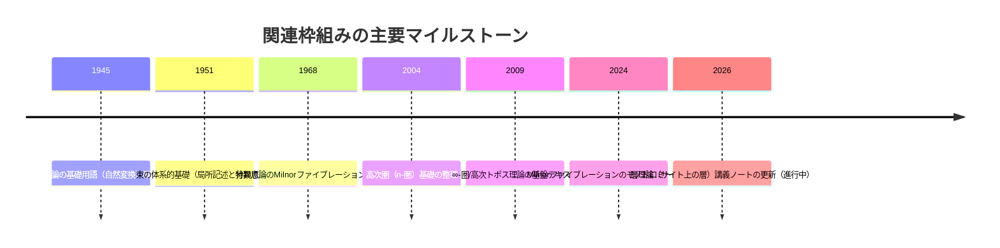

# DR-D01-mathematics.md — D01 数学 ディープリサーチ一次ソース

**Issue**: #62 Step 6
**ソース**: ChatGPT Deep Research / deep-research (2026-02-24)
**レビュー**: Claude / claude-opus-4-5 (2026-02-24)
**指示書**: `chatgpt/inbox/REQ-GPT-20260224-D01_mathematics.md`
**GPT出力**: unknown
**備考**: output未保存（チャット経由受領）

---

## 原レポート題

数学における「場→波→縁→渦→束」と構造的に類似する三つの理論枠組み

## エグゼクティブサマリー

本レポートは、対象テーマが明示されていない状況を前提にしつつ、提供されたブリーフ（D01: 数学）に基づく仮定として、「創造の5段階（場→波→縁→渦→束）」と**構造的類似**を持つ数学的理論・構造・現象を3件に絞って特定し、一次文献・教科書級文献中心に整理したものである（ここでいう「構造的類似」は、厳密な同型や同値を主張するものではなく、**段階的に“局所から整合条件を経て大域構造が立ち上がる”**タイプの構成が、5段階の抽象スキーマと対応づけ可能である、という意味で用いる）。  

結論として、以下の3件が「5段階」を**数学の標準的構成規則（階層・貼り合わせ・捻れ・ファイバー化）**として読み替えたときに、最も“こじつけ”の余地が小さい。  

第一に、entity["people","Samuel Eilenberg","mathematician, category theory"]とentity["people","Saunders Mac Lane","mathematician, category theory"]に始まる圏論は、対象（0次）→射（1次）→射の間の変換（2次）→高次の整合（3次以上）という「高次化」により、段階的層構造が明示的に現れる（特に“自然変換”が、単なる対応ではなく図式の整合（可換性）として定義される点が重要）。citeturn0search4turn0search5turn1search0turn1search1  

第二に、層（シェーフ）とČechコホモロジーを媒介とする「局所データ→重なり上の整合→コサイクル条件→大域構造（束）の生成／分類」は、5段階を**局所→境界（重なり）→捻れ（コサイクル）→束**として読むのに適している。層を「反変関手」として定式化し、局所・大域の二分法と“局所から大域へ上げる障害”を体系的に扱うという位置づけも、この段階モデルと噛み合いやすい。citeturn3search4turn3search3turn2search28turn2search1turn1search18  

第三に、特異点論におけるMilnorファイブレーションは、（近傍の）解析的データから、リンク（境界）と単位円周上のファイバー化が**定理として**立ち上がり、さらに周回に伴うモノドロミー（捻れ・循環）が自然に現れる。これは「渦→束（ファイバー束）」という語彙に最も文字通り近く、5段階との対応づけを、比喩ではなく**ファイバー束構造とモノドロミー**として語れるのが強みである。citeturn2search26turn2search19turn4search11turn4search0  

## 背景と評価基準

本件で鍵になるのは、「5段階」を“物語”としてではなく、数学で頻出する次の型として読むことである。  

- **場（Field）**: まず基礎となる“台（base）”や“雰囲気（ambient）”があり、内部はまだ分解しない（例：位相空間、対象のクラス、関数の定義域など）。  
- **波（Wave）**: 基礎の上に、変化・写像・局所データ（section、射、ファイバー、レベル集合など）が現れる。  
- **縁（Relation）**: “境界”や“重なり”で整合条件が課され、局所どうしが関係づけられる（制限写像、可換図式、貼り合わせ条件、トリビアライゼーションの遷移など）。  
- **渦（Vortex）**: 整合の失敗・捻れ・周回に伴う作用が現れ、単なる整合の有無を超えて“循環的な構造”が立ち上がる（コサイクル、モノドロミー、（高次）コヒーレンスなど）。  
- **束（Bundle）**: 最終的に、局所から大域の“構造体”が生成される。幾何では文字通り束（fiber bundle）として、圏論では高次射の束ね上げ（∞-圏、(∞,1)-圏など）として現れる。citeturn2search28turn3search3turn1search0turn2search26  

評価基準は次の2点に置いた。  
第一に、数学的主張は一次文献・教科書級文献で裏づけられること（定義・定理・標準命題）。citeturn0search4turn0search5turn2search1turn2search26  
第二に、5段階との対応はあくまで“構造的類似”として、**何が厳密で、どこからが比喩・解釈か**を分離して記述できること（同型や同値の主張にすり替えない）。citeturn1search0turn3search3  

## 調査方法

調査は「一次・公的・査読・日本語（可能なら）」の優先順位で、次の層を往復して行った。  

一次層として、圏論では1945年の原論文（自然変換の導入）と標準教科書、さらに高次圏／∞-圏の基礎文献を参照した。citeturn0search4turn0search5turn1search0turn1search1  

層と束については、層の定義を“反変関手＋同値化（シェーフ条件）”として明記するリファレンス（公的に継続更新されるテキスト）と、束の局所記述における遷移関数・コサイクル条件、そして分類（classifying spaceやČechコホモロジー）への接続を確認した。citeturn3search4turn2search28turn2search1turn1search18  

特異点論は、Milnorファイブレーションが「局所から束が立つ」ことを主張する中核定理であるため、概説ではなく“束としての主張”が明示された資料（書籍章・講義ノート・査読論文）を優先し、さらに直近5年でモノドロミーを直接扱う研究（2024年）を加えて、現代的に“渦（周回作用）”が研究対象として現役であることを確認した。citeturn2search26turn2search19turn4search11turn4search0  

## 主要発見: 三つの候補

以下では、各候補について **[P] 確立された事実 / [M] 5段階対応 / [S] 解釈（要検証） / [E] 主要出典 / [R] 牽強付会リスク** の順で記述する（[S]は必ず“解釈の追加”として隔離する）。

image_group{"layout":"carousel","aspect_ratio":"16:9","query":["natural transformation commutative diagram","fiber bundle local trivialization transition functions diagram","Milnor fibration diagram sphere complement to circle"],"num_per_query":1}

**候補 A: 高次圏（圏論→2-圏→n-圏/∞-圏）**

[P] 確立された事実  
圏論は、対象と射、および射の合成と恒等射という最小限の公理で定義され、以後の「関手」「自然変換」が構造を運ぶ中心概念になる。自然変換は、2つの関手の間の“成分”と可換図式（自然性条件）により特徴づけられ、単なる写像の集まりではない形で定式化されている。citeturn0search4turn0search5  
圏の上にさらに「射の間の射（2-射）」を導入すると、2-圏（および一般のn-圏）という高次構造が現れ、0-セル、1-セル、…、n-セルという階層で整合（coherence）を管理する枠組みになる。citeturn1search0  
∞-圏（とくに(∞,1)-圏を含む現代的枠組み）は、集合をホモトピー型へ置き換えた世界で「圏」を扱うという直観を与え、トポロジーや（導来）代数幾何などで、弱い等価と高次整合を標準語彙として扱う基盤になっている。citeturn1search1turn1search9  

[M] 5段階対応（構造的類似の読み替え）  
場: 0-セル（対象）の“平坦な集合（集まり）”としての基盤。対象の内部は問わず、関係が出る前の配置として扱う。  
波: 1-セル（射）が、対象間の変換・過程として立ち上がる（「差」や「作用」が射として表現される）。  
縁: 図式の可換性・自然性条件により、「射どうし／過程どうしの関係」が拘束条件として現れる。特に自然変換は“関手間の整合”を定義する。  
渦: 2-射・3-射…という高次変換（自然変換の間の変換、さらにその間の整合）が導入され、整合の整合（coherence of coherence）が現れる。周回やループを“高次セル”で扱うという見方が可能になる（ただしここは比喩が混ざりやすいので、後述の[R]で限定する）。citeturn1search0turn1search1  
束: 高次セルの全階層を束ねて「∞-圏」という器に入れることで、局所的等価・ホモトピー的整合が大域的言語として固定化される。citeturn1search1  

[S] 解釈（要検証・追加仮定）  
「渦」を“周回作用”として読むなら、∞-圏における自己同値や高次ホモトピーは自然に関係するが、それを“渦”と名指すのは比喩であり、対応の強さは採用する∞-圏モデル（準圏、単体圏、Segal空間等）と用途によって変動する。citeturn1search1turn1search29  
「束」を文字通り束（fiber bundle）と同一視するのではなく、「高次整合を束として保管する装置」と読む必要がある（同型主張はできない）。citeturn1search0  

[E] 主要出典  
自然変換と基礎定義（1945）: Transactions論文。citeturn0search4  
標準教科書（基礎語彙の固定化）: entity["book","Categories for the Working Mathematician","graduate texts, 2nd ed 1998"]。citeturn0search5turn0search13  
高次圏の基礎: entity["book","Higher Operads, Higher Categories","lms lecture note, 2004"]。citeturn1search0turn1search4  
∞-圏の中核基礎: entity["book","Higher Topos Theory","annals studies, 2009"]。citeturn1search1  

[R] 牽強付会リスク  
「波＝射」「縁＝自然変換」までは説明可能だが、「渦＝高次整合」を“循環”として語ると比喩が急増する。高次セルは“回転”ではなく、整合条件を構造として表す一般枠組みである点を崩すと危険。citeturn1search0  
同型・同値の主張にすり替わりやすい（例: “5段階はn-圏と同型”など）。この候補は**階層性の類似**として限定すべき。citeturn1search0turn1search1  

**候補 B: 層とČechコホモロジーによる「局所→整合→捻れ→束」の立ち上げ**

[P] 確立された事実  
層（シェーフ）の基礎となる「前層（presheaf）」は、（開集合のなす）圏から集合（あるいは群など）への**反変関手**として定式化できる。これにより、制限写像が合成に関して整合することが、関手性として表現される。citeturn3search4turn3search0  
層理論は、局所／大域の二分法を扱う数学的道具であり、「局所から大域へ上げる障害（obstructions）」を与える・同時に“大域にしか存在しない対象”を構成する、という動機づけが明確に述べられている。citeturn3search3turn3search27  
ファイバー束は、局所自明化（trivialization）と遷移関数（transition functions）によって局所データを貼り合わせて構成される。遷移関数は重なり上でコサイクル条件（例: 三重交叉上での合成が恒等になる、あるいはg_ij g_jk = g_ikなど）を満たす必要がある。citeturn2search28  
主束（principal G-bundle）は分類空間BGを用いて分類され、（適切な仮定の下で）X上の主G束の同型類が、ホモトピー類[X,BG]と対応する、という分類定理が提示される。citeturn2search1  
Čechコホモロジー（非可換を含む）の観点から、主束（およびその高次化）は「局所自明化から得られるコサイクル」が分類データになる、という哲学が近年の講義ノート・論文でも明示されている。citeturn1search18turn1search2  

[M] 5段階対応（構造的類似の読み替え）  
場: 台空間X（あるいはsite/開集合の圏）。まだ“何を貼るか”は決めず、開被覆という“海”を用意する段階。citeturn3search4turn3search3  
波: 各開集合Uに局所データ（section）を割り当てる（前層）。局所で“揺れ”としてデータが立つが、まだ大域対象とは限らない。citeturn3search4  
縁: 重なり（U_i∩U_j）での制限と一致条件、貼り合わせ条件（sheaf condition）が“関係の場”として現れる。束の局所自明化でも、重なり上の遷移関数がここに当たる。citeturn2search28turn3search4  
渦: 三重重なり上のコサイクル条件は、「重なりを周回して戻ると恒等（あるいは所定の一致）になる」という“循環的整合”を要求し、これが成り立つ／成り立たない、あるいは同値類が異なることが“捻れ”として情報を持つ。Čech 1-コホモロジー（非可換を含む）はこの捻れを分類データとして扱う。citeturn2search28turn1search2turn1search18  
束: 上の整合条件を満たす局所データの同値類から、大域的対象（主束・ファイバー束）が構成・分類される。分類空間BGや特性類と接続でき、構造として固定化される。citeturn2search1turn1search18  

[S] 解釈（要検証・追加仮定）  
「渦」を“捻れ（twist）”として読むと直観は強いが、非可換Čechコホモロジーによる分類は一般には集合（pointed set）として現れ、群構造を持たない場合がある。この点を無視して“渦＝群”のように語ると構造を壊す。citeturn1search2turn1search10  
「束→場への循環」を数学的に寄せるなら、束から再び局所化（pullback、局所自明化の取り直し、層化）へ戻る往復として理解できるが、これは比喩的説明であり、一般定理としての“循環”を主張するものではない。citeturn3search4turn2search1  

[E] 主要出典  
前層＝反変関手（定義）: entity["organization","Stacks Project","open algebraic geometry text"]（Sites and Sheaves）。citeturn3search4  
層＝局所/大域と障害（動機づけ）: entity["people","Masaki Kashiwara","mathematician, sheaf theory"]・entity["people","Pierre Schapira","mathematician, sheaf theory"]の講義ノート（2026年版、進行中）。citeturn3search3turn3search27  
束の遷移関数とコサイクル条件（局所記述）: 束講義ノート（コサイクル条件の明示）。citeturn2search28  
主束の分類（BG）: entity["people","Ralph L. Cohen","mathematician, algebraic topology"]の講義ノート（主束と分類空間）。citeturn2search1turn2search8  
Čechによる束分類（近年の明示）: 2024年の査読論文・講義資料。citeturn1search18turn1search6turn1search2  

[R] 牽強付会リスク  
層理論一般は“束を作る理論”ではない（層はより広く、束は特定の事例・関連概念）。したがって「層＝束」と短絡させず、「局所→大域の一般機構」として説明する必要がある。citeturn3search3turn3search4  
Čech分類は仮定（良い被覆、パラコンパクト性、構造群の条件等）に依存しうるため、「いつでも分類できる」と書くと誤る。必ず“条件付き”として扱うべき。citeturn2search1turn1search2turn1search18  

**候補 C: 特異点論のMilnorファイブレーション（リンク・モノドロミー・束）**

[P] 確立された事実  
entity["people","John Milnor","mathematician, topology"]の古典的著作 entity["book","Singular Points of Complex Hypersurfaces","annals studies 61, 1968"] は、複素超曲面の特異点近傍に付随するファイブレーション（Milnorファイブレーション）を導入し、局所位相を解析する基盤を与えることを主眼に置く。citeturn2search10turn0search7  
孤立特異点など適切な条件の下で、球面からリンク（特異ファイバーとの交わり）を除いた空間がS^1にファイバー化される、という「Milnorのファイブレーション定理」が、解説・再定式化を伴って述べられている。citeturn2search26turn2search19turn4search11  
このファイバー化には周回に伴うモノドロミー（ファイバー自己同相／自己微分同相）が付随し、モノドロミーが研究対象として現在も継続的に扱われている（例: 2024年に“Milnorファイブレーションのモノドロミー微分同相”を直接対象とする研究）。citeturn4search0turn4search4turn4search11  
日本語圏でも、Milnorファイブレーション（およびその拡張）が研究として扱われ、Ehresmannの定理などを用いた局所自明性の議論が明示されている。citeturn2search15turn2search11  

[M] 5段階対応（構造的類似の読み替え）  
場: 解析的データとしての（局所）写像fと、その定義域（例えばC^{n+1}の小球近傍）。  
波: 近傍ファイバー（f^{-1}(t)）や、fの位相的挙動を追うための“パラメータ方向”が立つ（tが0の周りを動く、あるいはarg(f)=f/|f|で位相を読む）。citeturn2search26turn2search3  
縁: リンクK（球面と特異ファイバーの交差）が“境界／結び目”として現れ、補空間（球面\K）が大域構造の舞台になる。citeturn4search11turn4search13  
渦: S^1を一周することに伴うモノドロミーが、ファイバーの自己写像として生じ、捻れ・循環の情報を担う。citeturn4search4turn4search11turn4search0  
束: その全体が（局所自明な）S^1上のファイバー束として定理化される。ここでは「束」は比喩ではなく、文字通りファイバー束構造である。citeturn2search26turn4search22  

[S] 解釈（要検証・追加仮定）  
「場→波→縁→渦→束」を、(i) 台空間＋関数、(ii) 近傍ファイバーの族、(iii) リンクと補空間、(iv) モノドロミー、(v) ファイブレーション、という読み替えで固定すると対応は扱いやすいが、これは特異点の種類（孤立か非孤立か、実解析か複素解析か）により技術条件が変わるため、適用範囲は常に明記が必要。citeturn2search19turn2search11turn4search11  

[E] 主要出典  
古典一次: entity["book","Singular Points of Complex Hypersurfaces","annals studies 61, 1968"]（Milnor）。citeturn2search10turn0search7  
束としての定式化（章・解説）: “The Milnor fibration”。citeturn2search26turn4search22  
モノドロミー（直近5年の研究例）: 2024年の査読論文（Milnorファイブレーションのモノドロミー微分同相）。citeturn4search0  
日本語・国内機関由来の研究資料: Milnorファイブレーションの存在・拡張を扱う論文。citeturn2search15turn2search11  

[R] 牽强付会リスク  
Milnorファイブレーションは「束」が強く出る一方、「場」「波」の読み替えは複数あり得る（fそのものを“場”と見るか、定義域を“場”と見るか、など）。この揺らぎを無視すると、恣意性が増す。citeturn2search26turn2search19  
“渦＝モノドロミー”は説明しやすいが、モノドロミーは一般のファイバー束にも存在する概念なので、Milnor固有の内容（リンク、特異点、消滅サイクル等）を落とすと浅くなる。citeturn4search11turn4search1  

## 比較表とデータ要約

次表は、5段階への対応の“型”を、数学の標準語彙で揃えて比較した要約である（強度は「束が定理として立つか」「捻れが不変量として扱えるか」「段階分解が標準的か」を基準に、相対評価した）。

| 候補 | 数学的コア | 5段階の“数学読み替え”の主軸 | 「束」要素の強さ | 「渦」要素の強さ | 代表的な一次・基礎文献年 |
|---|---|---|---|---|---|
| A 高次圏 | n-圏/∞-圏、関手、自然変換、高次整合 | 次元（k-射）の階層化 | 中（“束ね上げ”として） | 中（コヒーレンスとして） | 1945 / 1998 / 2004 / 2009 |
| B 層とČech→束 | 前層・層、重なり、コサイクル、分類空間 | 局所→重なり→コサイクル→大域対象 | 高（束を貼り合わせで構成・分類） | 高（捻れ＝コサイクル） | 1951〜 / 2000s〜 / 2024 |
| C Milnorファイブレーション | 特異点、リンク、補空間、S^1上のファイバー束、モノドロミー | 特異点近傍→リンク→周回作用→束 | 最高（束が定理） | 最高（モノドロミーが直接） | 1968 / 2010s〜 / 2024 |

この比較の裏づけとして、Aは1945年論文と標準教科書・高次圏文献、Bは前層＝反変関手の定義、束の遷移関数とコサイクル条件、分類空間による分類、そして近年のČech分類言及、CはMilnorファイブレーションが束として提示され、現代研究がモノドロミーを直接扱う点を参照した。citeturn0search4turn0search5turn1search0turn1search1turn3search4turn2search28turn2search1turn1search18turn2search26turn4search0  

図表として、時間発展（一次文献→現代展開）を最小限で示す。

上の各項目は、それぞれ圏論の原論文と教科書、高次圏と∞-圏の基礎、束の分類思想、Milnorファイブレーションの古典と近年研究、層理論講義ノートの更新に対応している。citeturn0search4turn0search5turn1search0turn1search1turn2search1turn2search26turn4search0turn3search3  

## シナリオ分析

ここでは“不確実性”を、（データ不足ではなく）**「構造的類似」をどの強度で要求するか**という仮定の違いとしてシナリオ化する。

シナリオとして最も重要なのは、「束」を文字通りfiber bundleと読むか、あるいは“束ね上げ（aggregation）”として抽象的に読むかである。文字通り読める理論は限られる一方、抽象的に読むと適用範囲が急拡大し、牽強付会リスクも増える。citeturn2search26turn2search28turn1search0  

**シナリオ S1: 厳密寄り（“束”は実際のfiber bundle、または同等の幾何構造を要求）**  
この基準では、候補C（Milnorファイブレーション）が最も強い。候補Bは“束そのもの”を扱うため適合度が高いが、層理論一般を広げすぎると焦点がぼける。候補Aは“高次整合の束ね上げ”としては美しいが、fiber bundleそのものの主張ではないため、S1では補助的位置づけが妥当。citeturn2search26turn2search1turn1search1  

**シナリオ S2: 標準（“局所→重なり→捻れ→大域構造”の機構を重視し、束は抽象的でも可）**  
この基準が、ブリーフの意図（こじつけ回避・構造類似に集中）に最も整合すると推定される。候補BとCは「捻れ」や「周回作用」を明確に持ち、候補Aは“高次整合の階層化”として段階モデルと噛み合う。citeturn1search0turn2search28turn4search11  

**シナリオ S3: 比喩重視（“渦”“束”を直観的メタファーとして許容）**  
候補Aの説明自由度が上がり、他にも分岐理論・特異点・圏化（categorification）一般へ拡張しやすい。しかし、このシナリオは「表面的類似」と「構造的類似」を混同しやすいので、出力を証拠化する目的には不向きである。citeturn1search0turn3search3  

## 結論と実務的提言

結論として、数学領域で「場→波→縁→渦→束」を**構造の立ち上げの型**として読むなら、最も堅い3点は次である。  
(1) 高次圏（対象→射→高次射）による階層化、(2) 層・Čech・遷移関数による貼り合わせと捻れ、(3) Milnorファイブレーションによる“渦（モノドロミー）を伴う束（S^1上のファイバー束）”。citeturn1search0turn3search4turn2search28turn2search26turn4search0  

実務的提言は3点に要約できる。  

第一に、エビデンス化（evidence-mathematics.md等へ落とす）では、各候補の記述を「定義・定理・条件」の骨格に揃えるべきである。具体的には、圏論は1945年論文と標準教科書にある定義語彙（自然変換・可換図式）に固定し、高次圏は“k-セルの階層”として最小限のみ述べる。citeturn0search4turn0search5turn1search0  

第二に、層・束ルートは「遷移関数のコサイクル条件」と「分類（BGやČech）」のどちらか（可能なら両方）を明示し、5段階対応は「局所データ→重なり→コサイクル→大域構造」という“構成手順”として書くと、比喩を最小化できる。citeturn2search28turn2search1turn1search18  

第三に、Milnorファイブレーションは“束が定理で立つ”点が強いので、(i) リンクと補空間、(ii) S^1へのファイバー化、(iii) モノドロミー、の3点セットで固定し、「渦＝モノドロミー」という対応づけを**過不足なく**行うのが最も安全である。さらに直近5年の研究（2024）を一つ添えることで、「渦（モノドロミー）が現代的にも中核対象である」ことを裏取りできる。citeturn2search26turn4search11turn4search0  

最後に注意点として、これら3候補は「5段階モデルの正しさ」を数学が証明するものではなく、数学に内在する“構造生成の型”を、5段階スキーマに照らして整理したものである。従って成果物側では、常に「類似の型（階層／貼り合わせ／周回作用）」を明示し、「同型・同値」を主張しないという禁則を、文章レベルで守ることが重要になる。citeturn1search0turn3search3
