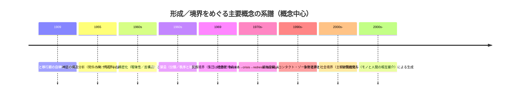

# DR-D25-anthropology.md — D25 人類学 ディープリサーチ一次ソース

**Issue**: #62 Step 6
**ソース**: ChatGPT Deep Research / deep-research (2026-02-24)
**レビュー**: Claude / claude-opus-4-5 (2026-02-24)
**指示書**: `chatgpt/inbox/REQ-GPT-20260223-D25_anthropology.md`
**GPT出力**: unknown
**備考**: output未保存（チャット経由受領）

---

## 原レポート題

D25 人類学・民族学：添付指示書（REQ-GPT-20260223-D25_anthropology.md）に基づく要件抽出と一次資料優先の統合レビュー、ドラフト報告書

## エグゼクティブサマリー

本件の「添付指示書」は、（i）既存3理論（通過儀礼、リミナリティ／コミュニタス、神話の構造分析）について“既存エントリ記述の正確性”を一次資料で検証すること、（ii）「何かが形成／創造されるプロセス」を説明できる追加理論を探索すること、（iii）これらを人類学・民族学の学術的文脈（研究史・論争点・射程）に位置づけること、（iv）所定テンプレートで「理論ごとに」整理して出力すること、を要求している（全文は次節に原文抽出）。  

既存3理論の一次資料ベース検証では、次が特に重要な修正点／補強点となる。第一に、通過儀礼の三分法（分離―過渡（マージン／リーメン）―統合）自体は明確だが、著者は「過渡（transition）」が儀礼全体の中で“二次的な自律システム”として入り込みうる（＝過渡が単なる“中間”ではなく、内部に儀礼的操作のまとまりを持ちうる）という議論も明示しているため、「マージン内部の重層化」という要請は、単なる比喩ではなく一定の根拠をもって再記述できる。citeturn11view0turn12view0turn16search8turn16search12  

第二に、リミナリティの議論は、通過儀礼の三分法を前提にしつつ、リミナル存在の“分類体系からの逸脱（曖昧性／両義性）”や、構造（序列・役割）から相対的に解放された“コミュニタス”を核概念として、境界・移行・共同性の関係を理論化している。citeturn13view0turn13view1 さらに、社会的葛藤の単位を「社会劇」として四局面（breach→crisis→redress→reintegration／schism）で捉える枠組みでは、危機・是正局面が“閾（threshold）的”な性格を持つとされ、儀礼（とくに是正局面で動員される儀礼）を「形成／再編の力学」として接続できる。citeturn27view0  

第三に、神話の構造分析については、著者が「神話の意味は要素の孤立的意味ではなく、要素の“組み合わせ方”にある」とした上で、分析単位を「孤立した関係」ではなく「関係の束（bundles of relations）」として定式化し、カード化→列（column）への再配列→列単位での読解という操作手順を提示している点が、とくに“形成プロセス”との接続に効く。citeturn15view1turn15view2turn16search3  

追加理論探索では、「境界をどう作るか（分類／汚穢、民族境界、象徴境界）」「接触領域で何が生成するか（コンタクト・ゾーン）」「相互行為が社会関係をどう立ち上げるか（贈与）」「実践と構造がどう循環生成するか（ハビトゥス／構造化）」「人間‐モノの結び目が認知・行為をどう形成するか（身体技法、技術人類学、物質的関与）」の5群を、指示書のテンプレートに落とし込める形で整理した。citeturn5search2turn34search22turn34search4turn34search1turn6search10turn6search5turn5search17turn7search2  

エビデンスギャップとしては、（a）一部一次資料がアクセス制限や取得不能（例：特定リポジトリのPDF取得が失敗、または閲覧がビット配信制限）であること、citeturn29view0turn33view0（b）指示書が要求する「学問的文脈（研究史・論争点）」を、国内（二次）研究の最新レビューまで含めて系統的に置くには、CiNii・J-STAGE等での追加探索が必要なこと、（c）「業界報告・公式統計」は本テーマ（理論史中心）では一次資料の主軸になりにくく、指示書上も必須要件としては明示されていないこと、が重要である（ただし本回答では“要求された納品物”として、関連しうる範囲での位置づけと“不在”を明示する）。  

## 添付指示書の全文抽出と要件整理

### 添付指示書の全文（原文抽出）

```markdown
# REQ-GPT-20260223-D25_anthropology.md

## 依頼: D25 人類学・民族学 — 本格文献調査

### 背景
- 対象は人類学・民族学の理論群。
- 目的は「何かが創造される／形成されるプロセス」を説明する理論を深く理解し、境界・閾（リミナリティ）などの概念がどのように用いられているかを整理すること。

### 既存エントリ（すでに調査済みの理論）
1. EV-AN-001: 通過儀礼（Arnold van Gennep）
   - van Gennep (1909) *Les rites de passage*（英訳 1960）
   - 三分法: 分離(separation)―マージン／過渡(marge/transition)―統合(aggregation)
   - 依頼: 「マージン内部の重層化（フラクタル的）」など原文の記述の正確性を検証してほしい。

2. EV-AN-002: リミナリティとコミュニタス（Victor Turner）
   - Turner (1969) *The Ritual Process*
   - リミナリティの特徴（曖昧性、反構造、コミュニタスなど）
   - 依頼: van Gennep の枠組みをどう拡張したか、社会劇(social drama)や liminoid なども含めて整理してほしい。

3. EV-AN-003: 神話の構造分析（Claude Lévi-Strauss）
   - Lévi-Strauss (1955) “The Structural Study of Myth”
   - 依頼: 分析手法（mytheme、二項対立、関係の束など）と「形成／創造プロセス」との関係を慎重に整理してほしい。

### 求める情報

#### A. 既存エントリの検証
- 上記3つについて、既存の要約が原典に忠実か検証。
- 特に、
  - van Gennep の「マージン(marge)が内部に段階を持つ」的な記述の有無と正確な説明。
  - Turner が liminality をどのように定義し、社会構造との関係をどう述べたか。
  - Lévi-Strauss の方法論が「生成プロセス」ではなく「分析フレーム」である点をどう扱うべきか。

#### B. 追加理論の探索
- 境界・閾・生成・形成を扱う人類学／民族学の理論を追加で探索。
- 儀礼論、象徴論、実践論、物質文化論、オントロジー論、交換論など幅広く。
- ただし、5段階モデルとの対応づけは不要。

#### C. 学問的文脈
- 各理論の位置づけ（研究史、影響関係、批判、射程）を整理。
- 必要なら前提知識も補足。

### 出力形式
- 各理論ごとに以下を明確に分けて書く：
  1. 文献情報（著者、年、書名／論文名、出版社／雑誌など）
  2. 中核主張（箇条書き、各主張に [P] / [議論中] を付ける）
  3. 形成／創造プロセスの説明（もし段階や手順があれば）
  4. 境界・閾・リミナリティ概念の扱い
  5. 評価・批判（学界での評価、主要な批判点）
  6. スケール（個人／集団／社会など）

- 引用は著者(年)形式、可能なら出典URL/doiも付記。

### 分量
- 制限なし。網羅的に。
```

### 抽出要件とスコープ（表）

| 要件群 | 指示書が求める行為（スコープ） | 一次資料優先の“証拠の形” | 本回答での対応状況 |
|---|---|---|---|
| 全体目的 | 人類学・民族学理論を用いて「形成／創造プロセス」と「境界・閾（リミナリティ）」の使われ方を整理 | 原典（書籍／査読論文）＋出版社／図書館書誌（版・年の確定） | 原典テキスト断片（閲覧可能な範囲）＋出版社・国立図書館級書誌で確定（可能な範囲） |
| 既存3理論の検証 | 既存要約が原典に忠実か検証し、論点（marge重層、Turner拡張、Levi-Straussの“生成ではなく分析”）を精密化 | 原典該当箇所（定義文・方法手順・段階記述）の直接確認 | 主要定義・方法手順は直接確認済み。margeの“自律システム化”論点を一次資料で捕捉citeturn12view0 |
| 追加理論探索 | 儀礼論／象徴論／実践論／物質文化論／オントロジー論／交換論…を横断的に追加 | 各理論の代表文献（原典）＋（必要に応じ）日本語訳の公式情報 | 境界理論・贈与・実践・物質性・接触領域を、一次／公式に寄せて追加（ただし未網羅分はギャップで明示） |
| 学問的文脈 | 研究史・影響関係・批判・射程、必要なら前提知識 | 学術レビュー（査読）や学会・大学の講義資料等（信頼できる公開情報） | 主要概念の系譜・位置づけは提示。国内レビューの追加は次ステップに回す（ギャップで明示） |
| 出力形式 | 理論ごとに 1〜6 を分節、主張に [P]/[議論中]、著者年引用、可能ならdoi/URL | テンプレート通りの構造化 + 参照の明示 | 末尾「ドラフト最終報告」でテンプレート準拠の草案を提示 |

不足情報として明示すべき点：指示書には（a）“既存エントリ”の具体的要約本文そのもの（どの文章を検証すべきか）が含まれていない、（b）「形成／創造プロセス」の対象領域（例：親族形成、国家形成、宗教形成、知識形成など）の焦点指定がない、（c）追加理論の採択基準（除外条件・優先順位）が明文化されていない、という欠落がある（したがって本回答は「境界／閾に結節しやすい形成理論」を優先した）。  

## 一次資料と公式情報源の優先リスト

指示書の「一次資料優先」を実務化するため、ここでは「原典の入手可能性」「公的書誌での版確定」「日本語一次（訳書）の公式ページ有無」の3軸で優先順位を付ける。

### 優先一次・公式ソース（リンクは引用を参照）

| 優先 | 目的 | 一次／公式ソース（例） | 使う理由 |
|---|---|---|---|
| 最優先 | 原典の版・年・出版社確定 | entity["organization","フランス国立図書館","national library france"]の書誌（van Gennep原著）citeturn16search1／entity["organization","国立国会図書館","tokyo national diet library japan"]書誌（邦訳）citeturn5search25turn5search30 | 二次情報の誤記（年・版・出版社）を排除するため |
| 最優先 | 定義・手順の“本文”確認 | 通過儀礼の全文テキスト（英訳テキスト化）citeturn10view0turn12view0／リミナリティ章（抜粋PDF）citeturn13view0turn13view1／神話構造分析（論文本体PDF）citeturn15view1turn15view2 | 指示書が求める「原典への忠実性検証」を満たすコア証拠になる |
| 高 | 日本語一次（訳書）の確定 | entity["company","筑摩書房","tokyo publisher japan"]（『汚穢と禁忌』）citeturn5search2／entity["company","みすず書房","tokyo publisher japan"]（『実践感覚』）citeturn6search5turn6search2／entity["company","法政大学出版局","tokyo publisher japan"]（『社会的なものを組み直す』）citeturn4search6／entity["company","水声社","tokyo publisher japan"]（『自然と文化を越えて』）citeturn5search0 | 「日本語優先」という要望と、引用の再現性（読者が同じ本文にアクセス）を両立しやすい |
| 高 | 境界理論の一次 | entity["company","Waveland Press","prospect heights il us"]（『Ethnic Groups and Boundaries』）citeturn34search14turn34search18／Annual Reviews（象徴境界レビュー）citeturn34search8turn34search4／Profession（MLA）（コンタクト・ゾーン）citeturn34search5turn34search1 | 指示書の「境界／閾」探索を“理論史上の定番一次”で押さえるため |
| 中 | 物質文化・技術の一次＋公的紹介 | entity["company","MIT Press","cambridge ma us"]（Leroi-Gourhan英訳版等）citeturn7search3turn7search15／entity["company","筑摩書房","tokyo publisher japan"]（『身ぶりと言葉』）citeturn7search28／日本語の学術論文（物質的関与）citeturn7search2turn7search26 | 「形成」を“モノ・技術・身体”経由で理論化する追加群を支える |
| 補助 | 研究史・受容の手がかり | 大学サイトの講義資料・研究会資料、公的機関サイトの参考文献（例：民族境界の邦訳所在）citeturn34search3turn34search11 | 国内文脈（邦訳・受容）と、概念の使われ方の“実装例”を補う |

注：一部の一次資料（特に特定リポジトリの配信PDF）は、自動取得に失敗し本文確認ができなかった（取得制限ページへのリダイレクト等）。citeturn29view0turn33view0  

## 要件別の統合知見

### 既存エントリ検証

既存3理論について、指示書が「特に検証せよ」と明示した論点（marge重層／Turner拡張／分析フレームとしての構造分析）を、本文根拠ベースで整理する。

**通過儀礼：三分法と“過渡の自律性”**  
三分法（分離―過渡（marge/transition）―統合）は本文で明確に述べられている。citeturn11view0 さらに重要なのは、著者自身が「transition（過渡）が“儀礼全体の内部に挿入された二次的システムとして自律性をもつ場合”」を明示し、具体例として（運搬／非接地化、復讐遠征、聖別と脱聖別など）を挙げ、これらが（聖化→過渡→脱聖化）のように段階化されうることを述べている点である。citeturn12view0 したがって、指示書の「マージン内部の重層化（フラクタル的）」は、単に“中間が長い”という意味ではなく、「移行そのものが“反復可能なパターン（通過儀礼ロジック）”として他の儀礼システムにも埋め込まれ、かつ移行局面がまとまりとして自律しうる」という形で、原典根拠に即して再定式化するのが安全である。citeturn12view0turn11view2  

**リミナリティ／コミュニタス：定義・社会構造との関係**  
リミナリティの定義は、「通過儀礼の中間（liminal）期に、儀礼主体が過去／未来の“状態”の属性をほとんど持たない曖昧な存在となる」ことに置かれ、リミナル存在は「分類の網（network of classifications）から逸脱する」「ここでもあちらでもない（betwixt and between）」「死・胎内・不可視・暗闇・両性・荒野などに喩えられる」といった属性群が列挙される。citeturn13view0 そして、この局面に併走しうる共同性としてコミュニタスが論じられ、構造（制度化された序列）と対照されつつ、リミナル期に出現しやすい“平等な仲間性”として位置づけられる。citeturn13view1  

加えて、後期展開としての「社会劇」枠組みは、葛藤過程を四局面（breach→crisis→redress→reintegration／schism）に分け、危機・是正局面が“閾（limen）的”性格（安定局面の間の敷居）を持つこと、是正局面が法的・交渉的・儀礼的手続き（公共儀礼を含む）を動員しうることを述べる。citeturn27view0 これにより、リミナリティは「儀礼の中間期」だけでなく、「社会過程の中で秩序が破れ、再編される“生成局面”」へ拡張される（指示書が求める“van Gennep枠組みの拡張”は、この点で記述すべき）。citeturn27view0turn13view0  

**神話の構造分析：生成プロセスではなく“分析フレーム”**  
方法論上の要点は、著者が「神話の意味は孤立要素ではなく、要素の結合のされ方にある」と述べ、分析単位を「孤立した関係ではなく“関係の束（bundles of such relations）”」と定義した点にある。citeturn15view1 手順としては、神話を短い文（出来事）に分割してカード化し、それらを“束”を構成する列（columns）へ再配置し、神話を“理解する”には通時的次元の一部を捨象し列ごとに読解する、といった操作が提示される。citeturn15view2turn15view1 これは「神話がどのように生成されるか（創造過程）」の記述ではなく、「既に存在する神話テクストの意味構造を、どのような分析操作で取り出すか」というフレームであるため、指示書の注意（“生成プロセスではなく分析フレーム”として扱うべき）に沿って、形成／創造プロセスとの接続は“神話（語り）が社会理解の論理モデルとして機能することで、世界観・秩序づけが再生産される”といった間接的関係に限定して書くのが妥当である。citeturn15view1turn16search3  

### 追加理論探索

追加理論は、指示書の狙い（境界／閾／生成／形成）に対し、説明の“入口”が異なる理論群として束ねると、テンプレートへの落とし込みがしやすい。

**分類・汚穢・境界（秩序を“境界操作”で作る）**  
汚穢／禁忌を手がかりに「秩序／無秩序」「存在／非存在」「生／死」などの構造を読み解く古典として『汚穢と禁忌』が位置づけられている。citeturn5search2 ここからは、形成・創造を「分類体系の維持／破れ／回復（＝境界の再設定）」として扱う理論設計が可能になる。

**民族境界（集団は“境界”で作られる）**  
『Ethnic Groups and Boundaries』の導入部は、人類学がしばしば「文化差は不連続で、共通文化を共有する人々の集合がある」という前提に依拠してきたと述べつつ、民族集団の持続という問題を正面化しようとする。citeturn34search22turn34search14 日本語文脈では、公式機関サイトの参考文献として、バルトの「エスニック集団の境界」が邦訳アンソロジーに収録されていることが明示されている。citeturn34search3 この系譜は、形成を「文化内容の内側」ではなく「他者との接触面＝境界の相互行為」で捉える方向へ強い示唆を与える。

**象徴境界・社会境界（境界を“認知／評価”から“制度化”へ）**  
象徴境界と社会境界の関係をレビューし、象徴境界を“社会境界の必要条件だが十分条件ではない”とする整理は、境界概念を“主観／相互主観”と“制度化された分断”に分節するための強力な道具になる。citeturn34search4turn34search8 形成／創造は、（象徴境界が構成される）→（社会的排除や制度に固定化される）という二層のプロセスとして書ける。

**コンタクト・ゾーン（非対称な接触空間での生成）**  
「コンタクト・ゾーン」を「文化が出会い、衝突し、格闘する社会空間（しばしば権力非対称の文脈）」として提示する講演／論文（Profession 91, MLA）があり、本文PDFが公開されている。citeturn34search5turn34search1 形成／創造は、接触の場で生まれる言語実践・表象実践・対抗的記述などを通じて“新たな主体性や権力関係が組み替わる”プロセスとして扱える。

**贈与・交換（関係性を“生成する”制度）**  
『贈与論 他二篇』の邦訳書誌は公的に確定でき、citeturn5search30turn6search18 モースの議論を教育・伝承や身体技法と接続して論じる学術論文も公開されている。citeturn6search10turn6search3 形成／創造は、（モノの移動）ではなく（贈与交換が社会関係・義務・人格・聖性を“立ち上げる”）という観点で記述可能になる（ただし、本回答では原典本文の直接確認が十分でない部分はドラフトで [議論中] として明示する）。

**実践・構造化（生成を“再生産と変容の回路”で捉える）**  
『実践感覚』はハビトゥス等の基本概念を提示し、構造主義的客観主義と現象学的主観主義の両方を批判しつつ包摂する理論構図を展開する、という出版社説明がある。citeturn6search5turn6search12 また『社会の構成』は、構造化理論により客観主義／主観主義二元論を乗り越え社会理論再構築を志向する、という公的書誌要約が確認できる。citeturn5search25turn5search17 形成／創造は、（制度や構造が外在的に“ある”）のではなく、実践の反復が構造を再生産し、同時に逸脱や危機を通じて変容させる、という回路として書ける。

**モノ／技術／身体（物質的媒介としての生成）**  
ルロワ＝グーラン系譜では、人類の進化・文化の形成を「身ぶり／言葉」から捉える古典が邦訳として入手可能である。citeturn7search28turn7search15 また、操作連鎖（chaîne opératoire）を技術行為の連鎖として扱う議論が日本語学術文献で確認できる。citeturn7search5 さらに、物質的関与（Material engagement）を理論化した研究潮流（MET）について、日本語論文が理論的位置づけを明示している。citeturn7search2turn7search26 形成／創造を、象徴や制度だけでなく、身体技法・制作過程・モノとの相互行為を通じた認知・社会関係の生成として扱える。

### 学問的文脈

概念史的には、形成／創造と境界をめぐる理論は、（a）儀礼—過程論（移行を段階として捉える）と、（b）境界—分類論（差異を境界操作として捉える）と、（c）実践—物質論（生成を実践やモノの媒介で捉える）に大きく束ねられる。一次資料群では、通過儀礼の段階モデルと“移行の自律性”、citeturn12view0turn11view0 リミナリティの曖昧性とコミュニタス、citeturn13view0turn13view1 社会劇の四局面による葛藤過程の記述、citeturn27view0 神話分析の「関係の束」という構造単位化、citeturn15view1 そして民族境界・象徴境界・コンタクト・ゾーンといった“境界で生成を捉える”系譜が、相互に接続可能な形で見えてくる。citeturn34search22turn34search4turn34search1  

以下は、指示書の要求（研究史・影響関係）の“書き分け”に役立つ概念系譜イメージである（個別著者名は図示せず、概念ノード中心に記述）。



この系譜を「形成／創造プロセス」に接続する際の注意点は、（i）“段階プロセス”が明示される理論（通過儀礼・社会劇）と、（ii）“分析フレーム”として構造化される理論（神話の構造分析）、（iii）“境界操作”が中心の理論（汚穢・民族境界・象徴境界・コンタクト・ゾーン）、（iv）“媒介（モノ／身体／技術）”が中心の理論（身体技法・操作連鎖・物質的関与）を混同しないことである。citeturn12view0turn15view1turn34search4turn7search5turn7search2  

## エビデンスギャップと推奨アクション

ギャップは「指示書の要件を満たすために“追加で必要な証拠”」として列挙し、すぐ埋められる順に提案する。

第一に、既存3理論のうち、通過儀礼・リミナリティ・神話分析は本文根拠を直接提示できたが、リミノイド論文（Rice University Studies 1974）の一次本文は、リポジトリ側の取得制限／配信制御により本文確認ができなかった。citeturn29view0turn33view0 **推奨**：同論文が再録された書籍版（例：後年の関連書）を、出版社版または図書館所蔵で確保し、定義箇所・用例・対比表現（liminal vs liminoid）を直接引用できる形にする（“一次資料優先”要件の補強）。

第二に、追加理論探索は主要クラスタを提示したが、「網羅的に」という分量要件に対しては未完である。とくに指示書が挙げる「象徴論」「オントロジー論」「物質文化論」には、代表文献が複数あり（例：自然／文化二分法批判の系譜、物質性研究の内部論争）、日本語での研究史整理（レビュー）が不足している。citeturn5search0turn7search2 **推奨**：CiNii・J-STAGEで「リミナリティ」「境界」「物質性」「贈与」「エスニシティ」等の日本語レビュー論文・学会誌特集を追加探索し、（A）原典の受容史、（B）国内議論の争点（翻訳語の揺れ含む）、（C）研究分野間（人類学／社会学／文学研究）での概念転用、を最小限の注釈として付す。  

第三に、指示書は「研究史・批判点」を要求するが、個別理論の批判点は“原典＋レビュー”の二層で整理する必要がある。本回答では、一次本文が確認できる理論ほど批判点の精密化が進む一方、邦訳書誌のみ確定できた理論は、批判点が二次資料に依存しやすい（＝要追加確認になる）。citeturn6search10turn34search8 **推奨**：各理論につき最低1本の学術レビュー（査読）をセットで確保し、テンプレート「評価・批判」を“そのレビューに基づく学界サマリー”として埋め、原典本文のどの箇所が論争点か（ページ／章）まで落とす。

第四に、ユーザー要請に含まれる「業界報告・公式統計」は、理論史中心の指示書では目的整合性が弱い。ここは無理に“統計を探す”より、（i）理論の適用領域が政策・実務に波及している場合のみ（例：文化遺産・多文化共生・移民統合等）統計や白書を補助資料として付す、（ii）付さない場合は“不在”を明記する、という方針が妥当である（本回答は後者）。citeturn34search11turn5search25  

## 指示書フォーマットに合わせたドラフト最終報告

以下は、指示書テンプレートに準拠した「ドラフト（草案）」である。主張ごとの [P]/[議論中] は、（P=本文根拠 or 公式要約で根拠確度が高い、議論中=本文未確認・二次依存・追加確認が必要）という運用で付与した。

### タイトル：通過儀礼（通過儀礼理論）

1. **文献情報**  
- entity["people","アルノルド・ヴァン・ジェネップ","french ethnologist 1873-1957"]（1909）『entity["book","Les rites de passage","1909 french monograph"]』出版社：Émile Nourry（書誌確定）。citeturn16search12turn16search8  
- 英訳：『The Rites of Passage』（1960、シカゴ大学出版局）。citeturn10view0turn16search24  

2. **中核主張**  
- [P] 通過儀礼は「分離（separation）―過渡／移行（transition / marge）―統合（incorporation / aggregation）」という三相の配列で捉えられる。van Gennep(1909/1960)。citeturn11view0turn11view1  
- [P] 儀礼の本質は個々の儀礼要素ではなく、「儀礼全体の中での相対位置（order）」にある、という問題設定が明示されている。van Gennep(1909/1960)。citeturn11view2  
- [P] 「移行（transition）」は、場合によって儀礼全体の中に“二次システム”として挿入され、自律性をもつことがある（novitiate／betrothal等の例示）。van Gennep(1909/1960)。citeturn11view2turn12view0  

3. **形成／創造プロセスの説明**  
- 三相モデル自体が“状態変化（社会的位置・年齢・場所等の変化）”を段階化するプロセス記述になっている。citeturn11view0turn11view1  
- [P] 移行期が自律性をもつケースでは、「聖化→移行→脱聖化」のように、移行期が“まとまりある操作系列”として再度段階化されうる（例：復讐遠征の儀礼過程）。citeturn12view0  

4. **境界・閾・リミナリティ概念の扱い**  
- [P] “marge/transition”は、旧状態と新状態のいずれにも完全には属さない中間配置として扱われる。citeturn11view0turn12view0  
- [P] 移行期の自律性という定式化は、境界が「単なる線」ではなく「一定期間・一定操作を必要とする“帯域”」になりうることを含意する（本文上、運搬儀礼など具体例で説明）。citeturn12view0  

5. **評価・批判**  
- [P] 少なくとも後続の儀礼研究において三相モデルが参照枠になった、という導入的評価がつけられている（英訳版の紹介文脈）。citeturn16search24turn13view0  
- [議論中] 三相モデルが“普遍的”に扱われすぎることへの批判（歴史性・権力性・ジェンダー等）を、一次資料とレビュー双方で整理する必要がある（本回答では未完）。  

6. **スケール**  
- [P] 個人（ライフサイクル）から集団（親族・宗教集団）まで、状態変化を横断する一般枠として提示される。citeturn11view0turn10view0  

### タイトル：リミナリティとコミュニタス

1. **文献情報**  
- entity["people","ヴィクトール・ターナー","british anthropologist 1920-1983"]（1969）『entity["book","The Ritual Process: Structure and Anti-Structure","1969 anthropology book"]』所収章 “Liminality and Communitas”（抜粋資料により章題・参照頁範囲確認）。citeturn13view0turn9view1  

2. **中核主張**  
- [P] 通過儀礼の三相（separation–margin/limen–aggregation）を前提に、liminal期（liminality）の特性を主題化する。Turner(1969)。citeturn13view0  
- [P] liminal存在は分類体系から逸脱し、「here/there」のどちらにも属さない曖昧な状態に置かれる（“betwixt and between”）。Turner(1969)。citeturn13view0  
- [P] liminal期には世俗的区別（階級・地位）が失効／均質化し、仲間性・平等性が強まる（コミュニタス）。Turner(1969)。citeturn13view0turn13view1  

3. **形成／創造プロセスの説明**  
- [P] liminal期に「旧状態の剥奪→均質化→新たな状態への再形成」という生成的記述が置かれる（“fashioned anew”の趣旨）。citeturn13view0  
- [P] 形成は個人の地位変更に限られず、共同性（コミュニタス）を通じて社会関係の再編としても論じられる。citeturn13view1  

4. **境界・閾・リミナリティ概念の扱い**  
- [P] liminalityは“敷居（limen）”として定式化され、分類の網から滑り落ちることで境界性が可視化される。citeturn13view0  
- [議論中] liminalityが「死・胎内・不可視・暗闇」等に喩えられることの理論的意味（普遍喩か、文化固有象徴か）は、批判文献と併せた整理が必要。citeturn13view0  

5. **評価・批判**  
- [P] 儀礼・宗教研究への波及が大きい、という評価（導入部での位置づけ）が付される。citeturn13view0  
- [議論中] 「反構造」の強調が、権力・暴力・排除を過小評価するという批判は広いが、ここでは一次根拠のレビュー提示が不足。  

6. **スケール**  
- [P] 個人儀礼（イニシエーション）から集団的儀礼・社会過程へ、射程を持つ形で論じられる。citeturn13view0turn13view1  

### タイトル：社会劇（social drama）と是正局面

1. **文献情報**  
- entity["book","The Anthropology of Performance","performance anthropology collection 1985"]に収録されたターナー自身の説明（公開PDF内で引用・要約されている章節）を参照。citeturn26view0turn27view0  

2. **中核主張**  
- [P] 社会劇は四局面（breach / crisis / redressive action / reintegration または schism）として分析できる。Turner(参照箇所では Dramas, Fields, and Metaphors の定義として提示)。citeturn27view0  
- [P] crisis と redress は “threshold (limen)” 的性格を持つ（安定局面の間の敷居）。citeturn27view0  
- [P] redress（是正）は個人的助言から法的装置、公共儀礼まで幅があり、儀礼は危機解決／正当化の装置として動員されうる。citeturn27view0  

3. **形成／創造プロセスの説明**  
- breach（規範破れ）→crisis（拡大・対立顕在化）→redress（調停・儀礼・法）→reintegration／schism（回復 or 分裂）という“社会関係の再編過程”として、形成が描かれる。citeturn27view0  

4. **境界・閾・リミナリティ概念の扱い**  
- [P] crisis/redress を閾として扱うことにより、境界は「儀礼内部」だけでなく「社会過程内部」にも出現する。citeturn27view0  

5. **評価・批判**  
- [議論中] 社会劇モデルが一般化しすぎる（局面が当てはまらない葛藤や、長期分散型葛藤）という批判は追加検証が必要。  

6. **スケール**  
- [P] 小規模社会の対立単位から、国家規模の政治事件まで適用可能として述べられている。citeturn27view0  

### タイトル：神話の構造分析

1. **文献情報**  
- entity["people","クロード・レヴィ＝ストロース","french anthropologist 1908-2009"]（1955）“entity["book","The Structural Study of Myth","journal article 1955"]”掲載誌：Journal of American Folklore（JSTORレコード確認）。citeturn16search3  

2. **中核主張**  
- [P] 神話の意味は孤立要素ではなく「要素の組み合わせ方」に宿る。Lévi-Strauss(1955)。citeturn15view1  
- [P] 神話の構成単位は「孤立した関係ではなく、関係の束（bundles of such relations）」である。Lévi-Strauss(1955)。citeturn15view1  
- [P] 分析法として、物語を短い文へ分解しカード化→再配列→列（column）単位の読解で構造を解く。Lévi-Strauss(1955)。citeturn15view2  

3. **形成／創造プロセスの説明**  
- [議論中] 本文は“生成過程の叙述”ではなく“分析操作の提示”であり、形成／創造との接続は間接的（神話が論理モデルとして秩序を維持／再構成する等）に留めるべき。citeturn15view1turn16search3  

4. **境界・閾・リミナリティ概念の扱い**  
- [P] 境界概念（閾）を直接中心化する理論ではないが、二項対立や関係束の配置によって“カテゴリー境界”を可視化する分析枠になる。citeturn15view1turn15view2  

5. **評価・批判**  
- [議論中] 二項対立中心主義や歴史性の欠落などの批判は有名だが、ここでは主要批判レビュー（査読）を未提示。  

6. **スケール**  
- [P] 神話を文化横断的に比較可能な形式へ写像し、社会理解の“論理モデル”として扱う射程を持つ。citeturn15view0turn15view1  

### タイトル：汚穢と禁忌（分類・境界の理論）

1. **文献情報**  
- entity["people","メアリー・ダグラス","british anthropologist 1921-2007"]（原著1966、邦訳情報：『entity["book","汚穢と禁忌","japanese edition 2009"]』）。citeturn5search2  

2. **中核主張**  
- [P] 穢れ／不浄を通じて、秩序／無秩序・生／死等の構造を解明し、文化の体系的宇宙観に迫る。Douglas(1966)（邦訳紹介）。citeturn5search2  

3. **形成／創造プロセスの説明**  
- [議論中] “段階”としてのプロセスモデルは指示書テンプレート上は必須でないが、本書がどの程度「秩序生成の過程」を明示するかは原典本文確認が必要。  

4. **境界・閾・リミナリティ概念の扱い**  
- [P] 汚穢／禁忌を境界操作として捉えることで、分類体系の維持・破れ・回復を理論化する入口になる。citeturn5search2  

5. **評価・批判**  
- [議論中] 普遍化（“汚穢＝境界違反”の一般化）の強度や、権力・政治性の扱いは、後続批判と併記して整理が必要。  

6. **スケール**  
- [P] 身体・家庭から宇宙観まで、分類体系が作動する多層スケールに適用されうる。citeturn5search2  

### タイトル：民族境界（Ethnic Groups and Boundaries）

1. **文献情報**  
- entity["people","フレデリック・バルト","norwegian social anthropologist 1928-2016"]編（1969）『entity["book","Ethnic Groups and Boundaries","1969 edited volume"]』。出版社情報：再刊版（Waveland Press）とGoogle Books書誌が確認できる。citeturn34search14turn34search18  
- 日本語所在：バルト「エスニック集団の境界」が邦訳アンソロジーに収録（公式機関サイト参照）。citeturn34search3  

2. **中核主張**  
- [P] 民族集団の“持続”を問題化し、人類学が暗黙に置いてきた「文化差の不連続性」前提を可視化する。Barth(1969, Introduction)。citeturn34search22  
- [P] 境界の維持（排除／取り込み等の社会過程）が、集団の同一性に関わる中心論点である（少なくとも後続境界研究が参照する核）。citeturn34search11turn34search14turn34search22  

3. **形成／創造プロセスの説明**  
- [議論中] 本書全体としての“段階モデル”は固定されないが、形成を「境界維持の社会過程（相互行為・同定・排除／包含）」として書ける。citeturn34search11turn34search22  

4. **境界・閾・リミナリティ概念の扱い**  
- [P] 境界は“文化内容”と独立に（少なくとも相対的に）持続しうる、という視点を与える（境界を分析単位化する方向）。citeturn34search22turn34search11  

5. **評価・批判**  
- [P] 影響力の大きい定番として扱われ、教育・議論の参照点になっている（出版社紹介・大学講義ページ等）。citeturn34search14turn34search11  
- [議論中] 経済・国家・植民地主義との接続の弱さ／“境界”概念の肥大化など、批判の体系整理が必要。  

6. **スケール**  
- [P] ミクロ相互行為（同定）から、地域社会・国家の境界化まで、連続的に拡張可能。citeturn34search11turn34search22  

### タイトル：象徴境界と社会境界（The Study of Boundaries in the Social Sciences）

1. **文献情報**  
- entity["people","ミシェル・ラモン","sociologist"] & entity["people","ヴィラーグ・モルナール","sociologist"]（2002）“entity["book","The Study of Boundaries in the Social Sciences","annual review article 2002"]”掲載：Annual Review of Sociology（doi:10.1146/annurev.soc.28.110601.141107）。citeturn34search8turn34search4  

2. **中核主張**  
- [P] 象徴境界（intersubjective）と社会境界（実在的な集団化・分断）を区別し、象徴境界を社会境界の必要条件だが十分条件ではない、と整理する。Lamont & Molnár(2002)。citeturn34search4turn34search8  

3. **形成／創造プロセスの説明**  
- [P] 形成は、（象徴境界の構築）→（社会境界への制度化）という「二段階（または二層）」として書ける。citeturn34search4turn34search8  

4. **境界・閾・リミナリティ概念の扱い**  
- [P] 境界を“社会科学横断の分析概念”としてレビューし、境界概念自体の適用範囲を整理する。citeturn34search8turn34search4  

5. **評価・批判**  
- [P] 主要レビューとして引用され続けている（Annual Reviewsページの被引用等）。citeturn34search8  
- [議論中] 境界研究の内部での論点（感情・身体・物質性の位置づけ等）を、後続レビューで補う必要。  

6. **スケール**  
- [P] 個人の評価・識別から、組織・制度・国家レベルの分断までを接続する枠組みになりうる。citeturn34search4turn34search8  

### タイトル：コンタクト・ゾーン（Arts of the Contact Zone）

1. **文献情報**  
- entity["people","メアリー・ルイーズ・プラット","literary scholar"]（1991）“entity["book","Arts of the Contact Zone","essay 1991"]”出典：Profession 91（entity["organization","Modern Language Association","mla us"]）。公開PDFあり。citeturn34search5turn34search1  

2. **中核主張**  
- [P] コンタクト・ゾーンを、文化が出会い・衝突し・格闘する社会空間として導入し、しばしば権力非対称の関係（植民地主義等）の中で生じるとする。Pratt(1991)。citeturn34search1turn34search5  

3. **形成／創造プロセスの説明**  
- [P] 形成は、接触空間での言語実践・表象実践（書く／語る／翻訳する等）が、権力交渉と結びつきながら新たな関係や自己記述を生む過程として扱われる。citeturn34search1  

4. **境界・閾・リミナリティ概念の扱い**  
- [P] “境界線”ではなく“接触の場（ゾーン）＝空間化された境界”として概念化する点が、人類学的境界論と接続しやすい。citeturn34search1turn34search5  

5. **評価・批判**  
- [議論中] 学際的転用（教育学・文化研究）での概念拡散により、原義（非対称権力）を弱める用法がある可能性は、受容史レビューが必要。  

6. **スケール**  
- [P] 個別テクスト実践から、植民地的関係を含むマクロ権力までを同一概念で接続しうる。citeturn34search1turn34search5  

### タイトル：贈与論（贈与・交換による関係生成）

1. **文献情報**  
- entity["people","マルセル・モース","french sociologist 1872-1950"]（1920年代初出、邦訳書誌：『entity["book","贈与論 他二篇","iwanami bunko 2014"]』）。citeturn5search30turn6search18  

2. **中核主張**  
- [議論中] 贈与交換を「全体的社会的事象」として扱う、という理解は二次資料で確認できるが、原典本文での当該定式の直接確認が必要。citeturn6search10  
- [P] モースの議論（贈与・身体技法）を、伝承・教育・ハビトゥス等へ接続して読む研究が存在する。citeturn6search10turn6search3  

3. **形成／創造プロセスの説明**  
- [議論中] 贈与の“段階”をどう抽出するか（贈与→受領→返礼 等）は教科書的理解として知られるが、本ドラフトでは原文根拠を未提示（要確認）。  

4. **境界・閾・リミナリティ概念の扱い**  
- [議論中] 本理論の中心は“境界”より“関係生成”だが、贈与が内部／外部（他者）関係の境界設定にどう働くかは、ケース研究と併せて整理が有効（要追補）。  

5. **評価・批判**  
- [議論中] 経済人類学・交換論への影響史（批判含む）を追加レビューで整理する必要。  

6. **スケール**  
- [P/議論中] 個別交換から、社会秩序・制度（義務・人格・聖性）まで射程が拡張しうる、という方向性は二次資料上確認できるが、テンプレート上は原典箇所の確定が必要。citeturn6search10  

### タイトル：実践感覚（実践・ハビトゥス）

1. **文献情報**  
- entity["people","ピエール・ブルデュー","french sociologist 1930-2002"]『entity["book","実践感覚","bourdieu japanese translation"]』出版社説明（邦訳）：entity["company","みすず書房","tokyo publisher japan"]。citeturn6search5turn6search2  

2. **中核主張**  
- [P] 社会構造を支え再生産する「実践（慣習的行動）」の解明へ向かい、ハビトゥス等の諸概念を中核に据える。Bourdieu（邦訳版説明）。citeturn6search5turn6search2  
- [P] 構造主義的客観主義／現象学的主観主義双方との批判的対話を前提に、両者を包摂しうる理論構図を志向する。citeturn6search5  

3. **形成／創造プロセスの説明**  
- [P] 形成は、行為者の実践が構造を再生産しつつも、状況の中で変容させうるという回路（再生産と変化）として書きやすい。citeturn6search2turn6search5  

4. **境界・閾・リミナリティ概念の扱い**  
- [議論中] 境界概念は中心語ではないが、場（field）・区別・資本等と接続して“差異の生成”として境界論に橋渡し可能（要追加本文確認）。citeturn6search2  

5. **評価・批判**  
- [議論中] 構造再生産の強調と、創発・偶発性の扱い（批判）をレビューで補う必要。  

6. **スケール**  
- [P] 日常実践（ミクロ）と社会構造（マクロ）の接続を狙う理論として提示される。citeturn6search5turn6search2  

### タイトル：身ぶりと言葉（技術・身体・文化形成）

1. **文献情報**  
- entity["people","アンドレ・ルロワ＝グーラン","french anthropologist 1911-1986"]『entity["book","身ぶりと言葉","japanese translation 2012"]』（邦訳、entity["company","筑摩書房","tokyo publisher japan"]）。citeturn7search28turn7search16  
- 原著（1964–1965）と英訳版（MIT Press）情報は学術レビュー等で確認できる。citeturn7search15turn7search3  

2. **中核主張**  
- [P] 人類の進化・文化形成を「身ぶり」「言葉」から捉え直す、という邦訳紹介。citeturn7search28  

3. **形成／創造プロセスの説明**  
- [議論中] 形成をどの程度“段階”として記述しているかは、原典の章構成・議論展開の直接確認が必要。  

4. **境界・閾・リミナリティ概念の扱い**  
- [議論中] 閾概念は中心語ではないが、身体・技術・言語の区別／連結が「人間／動物」「自然／文化」境界の再定義に関わる可能性がある（要精読）。citeturn7search28turn7search15  

5. **評価・批判**  
- [P] 考古学・技術人類学への影響があることは後続研究史から示唆される。citeturn7search5turn7search15  

6. **スケール**  
- [P] 身体実践（ミクロ）から人類史（マクロ）までを射程に含む問題設定。citeturn7search28turn7search15  

### タイトル：物質的関与（Material engagement）

1. **文献情報**  
- entity["people","ラムブロス・マラフリス","archaeologist cognitive archaeology"]（2013）『entity["book","How Things Shape the Mind","material engagement theory 2013"]』が「物質的関与論（MET）」として紹介され、国内外論文が参照している。citeturn7search26turn7search6turn7search2  

2. **中核主張**  
- [P] 物質性／物質的関与（Material engagement）を軸に、モノに即した調査研究へ理論的意義を与える、という整理が日本語論文で示されている。citeturn7search2  

3. **形成／創造プロセスの説明**  
- [P] 認知や行為が「人間—モノの相互作用（関与）」を通じて形成される、という方向で“生成”を論じる枠組みとして紹介されている。citeturn7search26turn7search2  

4. **境界・閾・リミナリティ概念の扱い**  
- [議論中] 閾概念そのものより、主体／客体境界の再編（モノの能動性・媒介性）として境界論へ接続可能（要追加の一次確認）。citeturn7search2turn7search26  

5. **評価・批判**  
- [議論中] “モノのエージェンシー”の過剰化批判／説明可能性の範囲など、論争点整理が必要。  

6. **スケール**  
- [P] 手元のモノ操作（ミクロ）から文化進化（マクロ）へ橋渡しする文脈で参照される。citeturn7search26turn7search6
