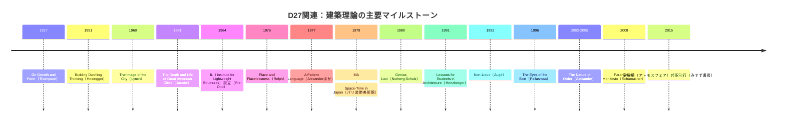
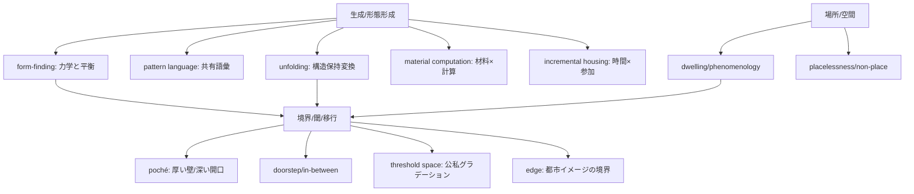

# DR-D27-architecture-design.md — D27 建築・空間デザイン ディープリサーチ一次ソース

**Issue**: #62 Step 6
**ソース**: ChatGPT Deep Research / deep-research (2026-02-24)
**レビュー**: Claude / claude-opus-4-5 (2026-02-24)
**指示書**: `chatgpt/inbox/REQ-GPT-20260223-D27_architecture-design-v2.md`
**GPT出力**: unknown
**備考**: output未保存（チャット経由受領）

---

## 原レポート題

D27 建築・空間デザイン文献調査レポート

## エグゼクティブサマリー

[P] 添付の指示書（REQ-GPT-20260223-D27_architecture-design-v2.md）に基づき、「建物・都市・空間デザインのための建築理論（architectural theory）の学術文献レビュー」として、既存エントリ（entity["people","クリストファー・アレグザンダー","architect 1936-2022"]、entity["people","フライ・オットー","architect 1925-2015"]、entity["people","磯崎新","architect 1931-2022"]／「間」）の検証と、追加理論（特に「境界・閾・移行空間」）の探索を行い、最後に実装可能な「指示書形式」の成果物を提示した。citeturn10search13turn18search14turn13search5  

[P] entity["book_series","The Nature of Order","alexander 2002-2005"]は、①「生（life）」を“空間‐物質の秩序の度合い”として扱い、中心（centers）と全体性（wholeness）の理論で説明し（Book 1）、②「構造を保つ変換（structure-preserving transformations）」による段階的生成（unfolding）を中核に据え（Book 2）、③具体的プロジェクト群で“生きたプロセス”の建築的含意を示し（Book 3）、④世界観（宇宙論）まで射程を拡張する（Book 4）という構成になっている。citeturn18search14turn9search3turn18search23turn18search35  

[P] Alexander における「15の性質」は、中心同士が互いを強め合う（intensify）関係を、観察可能な幾何学的・形態的特徴として整理した枠組みであり、建築・都市・自然に跨って援用されている（ただし妥当性や適用の仕方は研究上の論争点を含む）。citeturn18search0turn9search30turn16search28  

[P] entity["people","フライ・オットー","architect 1925-2015"]の系譜は「形態は図面上で発明されるだけでなく、物理モデルの実験（石鹸膜・懸垂鎖・布など）によって“見出される（form-finding）”」という、設計の生成論に直結している。特にentity["organization","シュトゥットガルト大学","stuttgart university germany"]の IL（Institute for Lightweight Structures）を起点とする研究蓄積（IL Mitteilungen／デジタルアーカイブ化を含む）は、境界条件（支持点・張力・荷重）＝「境界の設計」が形態を決定することを可視化した。citeturn10search13turn10search11turn10search0  

[P] 「間（MA）」は、1978年にentity["city","パリ","france"]のentity["point_of_interest","パリ装飾美術館","paris france"]で開催された展覧会「<間>－日本の時空間（MA: Space-Time in Japan）」により、時間と空間の不可分性・関係性（インターバル）として国際的に提示された（その後の巡回・資料展示も含む）。一方で、概念が“日本性”の記号として固定化・本質主義化されるリスクも指摘されうるため、系譜（磯崎以外）と概念運用（設計上の手順）を分離して記述するのが安全である。citeturn13search5turn13search22turn14search4turn13search4  

[P] 最重要カテゴリ「境界・閾・移行空間」では、①厚い壁／entity["book","Collage City","rowe koetter 1978"]等で議論される“アーバン・ポシェ（poché）”の伝統、②entity["people","アルド・ファン・アイク","architect 1918-1999"]の「in-between／doorstep」、③entity["people","ハーマン・ヘルツベルハー","architect 1932-2025"]の threshold space、④entity["people","ケビン・リンチ","urban planner 1918-1984"]の edge、⑤entity["people","ジェイン・ジェイコブズ","urbanist 1916-2006"]の多様性条件・都市の境界問題が、いずれも「境界を“線”ではなく“厚み”や“勾配（gradient）”として設計する」方向で接続し得る。citeturn8search6turn17search3turn8search20turn11search2turn11search12  

## 要件抽出と前提

本節は、添付指示書の要件を「実装可能なチェックリスト」に落としたものである（指示書自体は外部出典ではなくユーザー提示情報として扱う）。

[P] 必須アウトプットは大きく「既存エントリ検証」「追加理論探索」「学問的文脈（4つの設問）」で構成され、各理論の報告フォーマットは6項目（書誌／核心主張／プロセス／境界概念／学術的評価／スケール）に統一されている。  
[P] 特記事項として、entity["people","クリストファー・アレグザンダー","architect 1936-2022"]は 4巻コア主張・15性質・unfolding手順・centers相互支持・Mirror of the Self の方法論・entity["book","A Pattern Language","alexander 1977"]との関係まで要求され、entity["people","フライ・オットー","architect 1925-2015"]は IL 研究シリーズの位置づけと実験手法の段階記述が要求され、「間」は磯崎以外も含む系譜が要求される。  

[議論中] 不確実・未提供情報として、(a) 既存エントリ（EV-AD-001/002/CA-001）の“現物テキスト”が提示されていないため、「現行エントリの誤りを赤入れで検証」はできず、「一次文献・信頼できる二次文献から“正として書くべき内容”を再構成する」方針を採った。  
[議論中] 「D27」のプロジェクト内意味（分類体系・ID規約・期待される分量配分）は指示書から完全には確定できないため、成果物側で“入力が不足している点”を明示し、追補手順を提案した。  

## 調査シナリオ

[P] シナリオとして、次の3系統を並行で検討し、最終的に統合した。

第一のシナリオは「既存エントリの核（Alexander／Otto／間）を一次文献主導で“再建”する」方針である。特に Alexander は 4巻体系（静的特徴＋生成プロセス＋実例＋宇宙論）を、Otto は IL と form-finding の方法を、間は展覧会史料と日本側の空間論（磯崎以外）を軸に整理した。citeturn18search14turn10search13turn13search5turn14search4  

第二のシナリオは「最重要カテゴリ＝境界・閾・移行空間を、建築理論の“横断軸”にする」方針である。in-between／threshold／poché／edge／多様性条件（境界が多様性に与える影響）を同一座標で比較すると、D27が求める“生成”と“境界”が一つの設計言語として結びつく。citeturn17search3turn8search6turn11search2turn11search12  

第三のシナリオは「場所‐空間の系譜（現象学〜人類学〜環境心理）を整理し、境界概念と接続する」方針である。住まう（dwelling）＝存在論的基盤（entity["people","マルティン・ハイデガー","philosopher 1889-1976"]）から、場所の精神／特性（entity["people","クリスチャン・ノルベルグ＝シュルツ","architectural theorist 1926-2000"]）、没場所性／非場所（entity["people","エドワード・レルフ","geographer 1944-"]、entity["people","マルク・オジェ","anthropologist 1935-2023"]）、身体感覚（entity["people","ユハニ・パラスマー","architect 1936-"]）を通し、境界を“経験の編集点”として扱う見取り図を作った。citeturn12search1turn4search5turn5search16turn4search12turn4search6  

## 方法論とソース優先順位

[P] 本調査は、(1) 先に一次資料（原著・公式アーカイブ・機関史料）、(2) 次に書誌確定（出版社・図書館目録）、(3) 次に査読論文・学会資料、(4) 最後に専門媒体・批評（ただし日本語圏の受容史把握に有効）という順で優先度を付け、相互照合により“指示書の6項目フォーマット”へ落とし込んだ。citeturn18search14turn10search13turn11search5turn4search12turn15search3  

[P] 一次資料の中核として、Alexander については Center for Environmental Structure の公開アーカイブ（章・書誌情報）と関連PDF、Otto についてはentity["organization","シュトゥットガルト大学","stuttgart university germany"]の ILEK／デジタルライブラリ（IL Mitteilungen の目次・全文ビュー）を用いた。citeturn18search14turn9search33turn10search0turn10search13  

[P] 日本語ソースの優先方針として、翻訳書の書誌（出版社・刊行年）の確定には出版社公式・書誌DB（例：みすず書房、筑摩書房、entity["company","鹿島出版会","publisher tokyo"]、CiNii／OPAC等）を優先し、受容・批評は entity["organization","10＋1","architecture journal japan"]等の議論蓄積を参照した。citeturn17search4turn5search16turn11search5turn4search12turn15search3  

## 詳細調査結果

### 既存エントリ検証

**EV-AD-001: entity["people","クリストファー・アレグザンダー","architect 1936-2022"] 後期理論（15の性質＋unfolding）**

**1) 主要著作の正確な書誌情報（抜粋）**  
（書誌は「原著タイトル／刊行年／出版社」を最小単位として確定）

| 区分 | 著作 | 刊行年 | 出版社等 |
|---|---|---:|---|
| 中核4巻 | entity["book","The Phenomenon of Life","alexander 2002 vol1"] | 2002 | Center for Environmental Structure citeturn18search14 |
|  | entity["book","The Process of Creating Life","alexander 2002 vol2"] | 2002 | Center for Environmental Structure citeturn9search3turn9search33 |
|  | entity["book","A Vision of a Living World","alexander 2005 vol3"] | 2005 | Center for Environmental Structure citeturn18search23 |
|  | entity["book","The Luminous Ground","alexander 2004 vol4"] | 2004 | Center for Environmental Structure citeturn18search35 |
| 前段（参照） | entity["book","A Pattern Language","alexander 1977"] | 1977 | Oxford University Press（PDFで内容確認可） citeturn15search0 |
|  | entity["book","The Timeless Way of Building","alexander 1979"] | 1979 | Oxford University Press（全文PDF） citeturn15search4 |

**2) 理論の核心主張（3–5点）**  
- [P] 「生（life）」は建築・都市・自然に共通する“秩序の度合い”として知覚・比較可能であり、その骨格は centers の配置と相互関係（wholeness）で説明できる。citeturn18search14turn18search11turn9search27  
- [P] centers は幾何学的中心点ではなく、場の中で“強度をもつ領域（field-like）”として成立し、互いを支え合う（intensify）ことで全体の coherence を高める。citeturn18search0turn9search27  
- [P] 「15の性質」は “生きた全体性”が立ち上がるときに反復して見られる性質であり、建築の評価／生成のための観察枠組みになる。citeturn18search0turn9search30  
- [P] 生きた形態は、一足飛びの設計図ではなく、構造を保つ変換（structure-preserving transformations）を積み重ねる段階的プロセスで生成される（unfolding／step-by-step adaptation）。citeturn9search33turn9search3turn9search11  
- [議論中] Book 4 では、意識・価値・色彩を含む世界像（宇宙論）へ拡張し、近代機械論の批判と“別の整合的枠組み”を提示するが、哲学・科学としての検証可能性／受容は評価が割れる。citeturn18search35turn16search11turn16search28  

**3) プロセス/段階の記述（unfoldingの手順としての再構成）**  
以下は、Book 2 系（生成プロセス）で反復される主張を、設計・建設の実務語に寄せて「手順」として再構成したもの（厳密な“唯一の手順”ではなく、構造保持の原理に沿った運用ガイド）。citeturn9search33turn9search11turn9search1  

- [P] ステップは常に「既存の全体（site＋周辺＋暫定案）」から出発し、“破壊ではなく強化”になる変換を一手ずつ加える（structure-preserving）。citeturn9search33turn9search11  
- [P] 変換の選択基準は「全体の感じ（deep feeling）が増すか」であり、次の一手は“最も感じを強める”方向に取られる（この点が、単なる最適化やルール適用と異なる）。citeturn9search11turn9search4  
- [P] 各ステップでは、新しい center を追加・強化しつつ、既存の centers の関係（境界、スケール、繰り返し等）を壊さないよう調整する（step-by-step adaptation）。citeturn9search33turn18search0  
- [P] 得られた形は“最終像の実現”ではなく、次の変換のためのより良い足場（generated structure）であり、フィードバックを組み込んだ学習過程として続く。citeturn9search3turn9search33  

**4) 「境界」「接触面」「閾」に関する概念（centers相互支持の要点）**  
- [P] 境界は「内外を断つ線」ではなく、center を強める“厚みのある輪郭（boundaries）”として働きうる（境界そのものが center を生成し、他の center を支える）。citeturn18search0turn16search18  
- [P] centers の相互支持は「近接する中心同士が、視線・動線・形の呼応・反復・勾配などを通じて互いの強度を上げる」ことで成立する、という関係論として記述される（静的要素の寄せ集めではなく関係の束）。citeturn18search0turn9search27  

**5) 学術的評価（支持/批判の概要）**  
- [P] 建築・都市研究側では、The Nature of Order を「都市の科学（science of cities）／全体性の理論」の候補として再評価しようとするレビューがあり、初期批判（思弁的・逸脱）を再検討する動きが確認できる。citeturn16search28turn16search12  
- [P] 同時に、Alexander の後期理論は、機械論的世界観批判や宇宙論的射程を伴うため、科学哲学的な妥当性（検証可能性・反証可能性）や、建築実務での運用可能性が争点になりうる、という整理が日本語圏研究でも行われている。citeturn16search11turn16search7  
- [P] 実証面では、15性質を用いて“意味ある場所”や評価傾向を検討する近年の査読研究もあり、少なくとも「枠組みとしての利用」は継続している。citeturn9search30turn16search16  

**6) スケール**  
- [P] 15性質と centers は、素材・ディテールから建物、街路、都市景観までスケール横断で記述可能な語彙として設計されている（ただし適用の粒度や測定可能性は文脈依存）。citeturn18search0turn9search27  

**補足：15の性質（名称＋簡潔定義）**  
この一覧は Alexander (2002) の枠組みを、解説論文の整理に基づき簡潔化したもの（定義は設計実務で使える最低限の“観察定義”として記述）。citeturn18search0turn18search11  

| 性質 | 簡潔定義（設計上の観察定義） |
|---|---|
| Levels of Scale | 複数のスケール段階が連続し、飛びが少ない。 |
| Strong Centers | 注意・行為・形の焦点となる中心が明確。 |
| Boundaries | 中心を強める厚み／縁取りがある。 |
| Alternating Repetition | 交互の反復でリズムと秩序が立つ。 |
| Positive Space | 残余が少なく、図と地がともに“形”を持つ。 |
| Good Shape | 単純な形の組合せで全体が安定する。 |
| Local Symmetries | 全体対称より局所対称が多点に現れる。 |
| Deep Interlock and Ambiguity | 要素が噛み合い、境界が硬すぎない。 |
| Contrast | 差異（明暗・粗密・大小）が関係を立てる。 |
| Gradients | 変化が段階的で、急断が少ない。 |
| Roughness | 仕上げの“微細なズレ”が適応を含む。 |
| Echoes | 形の親和性（類似）が離れて反復する。 |
| The Void | 周囲を整える“空”の核がある。 |
| Simplicity and Inner Calm | 過剰な意匠より静けさが勝つ。 |
| Not-Separateness | 部分が孤立せず、周辺と連続する。 |

**補足：「mirror of the self」テスト（方法論的意味）**  
- [P] Mirror of the Self は、複数案の優劣を“説明”でなく「二者択一（pairwise）で、より自分の全体に響く方を選ぶ」形式で集計し、主観のばらつきを相対的に抑えながら“生の度合い（美・生命感）”を比較するための手続きとして位置付けられる。citeturn9search4turn9search0turn9search11  
- [議論中] このテストは「客観性」を主張しうる一方、文化差・審美教育・提示条件（画像・現地体験）などに影響される可能性があり、評価の科学性は継続的検討課題である（ただしペア比較自体は心理計測でも一般的な手法として用いられる）。citeturn9search0turn9search30  

---

**EV-AD-002: entity["people","フライ・オットー","architect 1925-2015"]（form-finding／IL研究シリーズ）**

**1) 主要著作・シリーズ（書誌の核）**  
- [P] IL（Institute for Lightweight Structures）は1964年に設立され、Otto が所長として牽引し、軽量構造・自然構造・大スパン膜構造等の研究教育の中枢になった（1991頃までに国際的中心へ）。citeturn10search13turn10search1  
- [P] IL の成果は「Mitteilungen des Instituts für Leichte Flächentragwerke（IL Mitteilungen）」として継続刊行され、現在はentity["organization","シュトゥットガルト大学","stuttgart university germany"]のデジタル基盤から目次・冊子群を参照可能である。citeturn10search0turn10search28  
- [P] 代表的整理書として entity["book","Finding Form: Towards an Architecture of the Minimal","otto 1996"]（1996）があり、「最小材料で最大性能」方向の form-finding をまとめる。citeturn10search3  
- [P] Otto は2015年にentity["organization","プリツカー賞","architecture prize"]を受賞している（死後授与の扱いを含む）。citeturn10search13turn2search5  

**2) 核心主張（3–5点）**  
- [P] 軽量構造における“良い形”は、図面上の恣意よりも、材料・力学・境界条件がつくる平衡形（equilibrium）の探索＝form-finding で見出される。citeturn10search11turn10search7  
- [P] 石鹸膜（最小曲面）・懸垂鎖（カテナリー）・布／ケーブルネット等の物理モデルは、完成形の模型ではなく「反復的な解析・設計ツール」として機能する。citeturn10search11  
- [P] IL の研究実践は建築／工学／材料科学を統合し、構造と形態の不可分性を“教育可能な方法”として提示した（今日の計算設計にも継承される）。citeturn10search1turn10search30  
- [議論中] form-finding は最適化の魅力を持つ一方で、使用・社会・象徴の要請を過小評価する危険もあり、どこまでを「形態生成の正当な根拠」とするかは設計倫理・目的設定の問題として残る。citeturn10search30turn10search10  

**3) 実験手法の段階記述（設計プロセスとしての再構成）**  
- [P] 段階1：目的と境界条件の定義（スパン、支持点配置、許容変形、荷重ケース、材料候補）。境界条件が形態の可探索空間を規定する。citeturn10search11turn10search7  
- [P] 段階2：対応する物理アナログの選定と制作（例：膜＝石鹸膜、圧縮アーチ＝懸垂鎖反転、ネット＝ケーブル／布）。citeturn10search11  
- [P] 段階3：平衡形の観察・計測（形状の読み取り、必要に応じて写真測量や作図に変換）。citeturn10search7  
- [P] 段階4：反復的な調整（支持点・張力・裁断パターン・剛性を変更し、性能と空間性を同時に満たす形を探索）。citeturn10search11  
- [P] 段階5：工学的検証と実装（解析・材料試験・施工手順へ落とし込み、組立・架設プロセスも設計対象に含める）。citeturn10search10turn10search19  

**4) 境界・閾の概念**  
- [P] Otto の form-finding は「境界条件（固定点・エッジ・拘束）が形態を決める」ことを手続きとして可視化するため、境界＝“設計変数の集合”として中心的に扱われる。citeturn10search11turn10search7  

**5) 学術的評価**  
- [P] IL の歴史的評価として、IL が軽量構造のグローバル拠点へ成長した経緯が機関史として明記されている。citeturn10search13  
- [P] 物理モデル中心の研究方法は現在も学術的に参照されており、Otto の“physical modeling legacy”を整理する論文が存在する。citeturn10search11  

**6) スケール**  
- [P] 主に素材・構造〜個別建築スケールだが、軽量構造は一時都市（テント都市等）や大スパン公共施設へも接続し得る。citeturn10search12turn10search13  

---

**EV-AD-CA-001: 「間（Ma）」— 建築空間論としての系譜（磯崎以外を含む）**

**1) 主要著作・史料（書誌）**  
- [P] 展覧会「<間>－日本の時空間（MA: Space-Time in Japan）」は1978年10月–12月にentity["city","パリ","france"]のentity["point_of_interest","パリ装飾美術館","paris france"]で開催された（会期・会場は公的データベースで確認可能）。citeturn13search5  
- [P] カタログ「MA: Space-Time in Japan」（Cooper-Hewitt Museum関連）は1979年に制作・流通した記録が複数の図書館目録に見られる。citeturn13search7turn13search11  
- [P] 日本側の理論的整理として、entity["book","間（ま）・日本建築の意匠","jindai 1999"]（entity["people","神代雄一郎","architectural historian 1922-2000"]、1999、entity["company","鹿島出版会","publisher tokyo"]）が書誌的に確定できる。citeturn14search4turn14search20  
- [P] 展覧会資料の日本側参照として、東京藝術大学の資料展示ページが存在する。citeturn13search16  

**2) 核心主張（3–5点）**  
- [P] 「間（ma）」は、空間と時間を不可分な“時空間的経験”として捉える枠組みであり、1978年の展覧会はそれを日本文化紹介の主要概念として編成した。citeturn13search5turn13search22  
- [P] 展覧会文脈では、「間」は物体の間隔というより、出来事・身体・所作・知覚が成立する“余白／テンポ／関係の場”として扱われた（会期情報と展示解説からの推論を含む）。citeturn13search5turn13search22  
- [P] 日本建築論側では、「間」を建築の意匠・空間構成の概念として整理する試みがあり、磯崎のキュレーションに限られない系譜が存在する。citeturn14search4turn13search21  
- [議論中] 「間」が“日本的本質”として流通する場面では、概念の抽象化・記号化により、具体的な構法・社会実践・歴史差異が捨象される危険がある（受容史・批評の論点）。citeturn13search4turn13search5  

**3) プロセス/段階の記述（設計へ落とす最小手順）**  
- [P] 「間」を設計手順に落とす際は、(a) 空間を“場面の連鎖”として分節し、(b) 各場面間の移行（視線・身体速度・音・光）を調整し、(c) 閾・縁・余白が“次の場面の予兆”になるよう配置する、という“シークエンス設計”として具現化しやすい。citeturn13search22turn14search4  
- [議論中] ただし「間」は単語一つで統一的に定義しにくく、用途（舞台芸術／建築／都市）により指示対象が変形するため、エントリでは「定義（語義）」と「適用（設計操作）」を別欄に分けるのが望ましい。citeturn14search4turn13search4  

**4) 境界・閾**  
- [P] 「間」は“境界そのもの”ではなく、境界付近で生まれる移行・余白・緩衝として語られやすく、縁側・建具・柱間などの分節接続と親和的である（伝統空間の分節接続研究を含む）。citeturn13search24turn13search21  

**5) 学術的評価**  
- [P] 展覧会史料は、美学概念としての「間」を国際展示の枠組みに置いた事例として参照され続けている（会期・主催・出展等のデータが維持されていること自体が参照可能性を担保）。citeturn13search5turn13search18  

**6) スケール**  
- [P] ディテール（建具・柱間）から都市的シークエンス（街路・庭園）まで横断しうるが、記述の抽象度が上がるほど“日本性の記号化”リスクが上がるため、スケール明記が重要。citeturn14search4turn13search21  

---

### 追加理論探索（候補からの重点抽出）

#### 建築理論で「生成」「形態形成」はどう扱われてきたか（主要潮流）

[P] 生成・形態形成は、概ね「力学（物理）」「言語（ルール）」「計算（パラメトリック／材料）」「社会（参加・増改築）」「ランドスケープ（時間）」の5潮流として整理できる（3〜5潮流という要件に合わせ最大5に正規化）。citeturn10search11turn15search0turn6search1turn7search1turn7search18  

| 潮流 | 中心的発想 | 代表的参照 | 境界との接続（D27観点） |
|---|---|---|---|
| 力学的 form-finding | 形は力と材料が“平衡として生む” | Otto／IL、物理モデル研究 citeturn10search11turn10search13 | 境界条件（支持点・拘束）が形態を規定する＝境界設計が生成を支配 |
| 言語・生成規則 | パタンの連鎖で環境を“生成” | Alexander の entity["book","A Pattern Language","alexander 1977"] citeturn15search0turn15search1 | パタンは“接続ルール”を内蔵し、境界（edge・threshold）を反復的に設計する語彙になりうる |
| 構造保持変換（unfolding） | 一手ずつ全体を強めて生成 | Alexander の Book2 citeturn9search33turn9search3 | “破壊しない変換”は既存境界の読み替え（厚み・勾配）を要求 |
| 計算・材料計算 | 材料が計算し、形が立つ | entity["people","アキム・メンゲス","architect 1975-"]の material computation citeturn6search10turn6search5turn6search14 | 境界は加工・組立・接合として顕在化（デジタルと物質の界面） |
| 参加・インクリメンタル | “半分”を供給し、増築で完成 | entity["people","アレハンドロ・アラベーナ","architect 1967-"]／entity["organization","ELEMENTAL","architecture studio chile"] citeturn7search1turn7search12 | 境界は居住者の増改築で再編される＝境界が時間の中で生成 |

#### 「場所」と「空間」の区別の系譜（Heidegger→Norberg-Schulz→現代）

[P] entity["people","マルティン・ハイデガー","philosopher 1889-1976"]の entity["book","Building Dwelling Thinking","heidegger 1951 essay"]（1951講演）は、「建てること」を単なる技術ではなく「住まう（dwelling）」に属する存在論的問題として捉え、建築を“人間の在り方”と接続する思想的支点になった（建築論へ直接の設計ルールを与える文脈ではない点に注意）。citeturn12search1turn12search13turn12search0  

[P] この系譜を建築理論へ翻訳した代表例の一つが、entity["people","クリスチャン・ノルベルグ＝シュルツ","architectural theorist 1926-2000"]の entity["book","ゲニウス・ロキ: 建築の現象学をめざして","norberg-schulz 1994 ja"]（原著1980、邦訳1994）で、場所を“実存的拠り所（existential foothold）”として扱い、空間を物理幾何だけでなく性格（character）として捉える方向を強めた。citeturn4search5turn12search10  

[P] その後の展開として、近代化・均質化が“場所性の喪失”をもたらすという議論が、entity["people","エドワード・レルフ","geographer 1944-"]の entity["book","場所の現象学―没場所性を越えて","relph 1999 ja"]（原著1976、邦訳1999）や、entity["people","マルク・オジェ","anthropologist 1935-2023"]の entity["book","非-場所: スーパーモダニティの人類学に向けて","auge 2017 ja"]（邦訳2017）に接続し、場所／非場所、場所性／没場所性の対比が都市経験を記述する語彙として普及した。citeturn5search16turn4search12  

[P] 近年は、現象学的な場所論に加え、環境心理（place attachment 等）の実証研究も増え、「場所」は個人の記憶・自己同一性・共同体・時間の流れと結びつく、という整理が行われる。citeturn12search15turn12search3  

[議論中] ただし「場所の精神」を固定的に想定する議論は、本質主義的だという批判もあり、場所を多層・複数性として捉える立場も提示されている（Norberg-Schulz 的な“spirit of place”の読み替えが争点）。citeturn12search22turn4search5  

#### entity["people","クリストファー・アレグザンダー","architect 1936-2022"]の位置づけと論争

[P] Alexander は、entity["book","A Pattern Language","alexander 1977"]（1977）を“設計の共有語彙”として提示した一方で、後期には「パタンだけでは生は生成できない」として、生成論・世界観まで踏み込む entity["book_series","The Nature of Order","alexander 2002-2005"]へ移行した、という“二段構え”で理解されやすい。citeturn15search1turn18search8turn18search14  

[P] 日本語圏でも、entity["organization","10＋1","architecture journal japan"]等で「パタン・ランゲージの誤解（積み木的理解）」「設計プロセスとしての再読」「1960年代的な方法論との接続」などが議論され、受容史自体が一つの研究対象になっている。citeturn15search7turn16search7turn15search3  

[議論中] 論争点は概ね、(a) “生／美”を普遍的次元として扱うことの妥当性、(b) Mirror of the Self などの手続きがどこまで客観化を担保できるか、(c) 後期の宇宙論が建築理論として過剰か否か、に整理でき、支持・批判の両方が継続している。citeturn16search28turn9search0turn16search11  

#### 建築における「境界」概念の展開（壁→閾→in-between→エッジ）

ここでは、最重要カテゴリとして、候補群のうち「境界」に直結する5理論を、指示書の6項目フォーマットで圧縮提示する。

**候補: entity["people","アルド・ファン・アイク","architect 1918-1999"]（in-between／doorstep）**  
1) [P] 書誌：Team 10 文脈（CIAM終盤〜Otterloo 1959）で「doorstep（敷居＝閾の領域）」が中心概念として形成されたことが、近年の研究で整理されている。citeturn17search3turn17search9  
2) [P] 核心主張：二項対立（内/外、公/私など）を媒介する“in-between”こそが関係性を回復し、人間化された空間をつくる。citeturn8search10turn8search20  
3) [P] プロセス：対立項を「接合（join）ではなく“間を設計する”」ことで和解させる（doorstep を計画単位にする）。citeturn17search3  
4) [P] 境界概念：境界は線ではなく“ドアステップという領域”であり、厚みと活動を持つ。citeturn17search3turn8search20  
5) [議論中] 評価：モダニズム批判・人間化の系譜として高評価だが、概念の抽象度が高く、具体手法へ落とす際に恣意化しうる。citeturn8search20turn17search5  
6) [P] スケール：住宅の敷居〜街区の公共空間まで。citeturn17search3  

**候補: entity["people","ハーマン・ヘルツベルハー","architect 1932-2025"]（threshold space）**  
1) [P] 書誌：entity["book","Lessons for Students in Architecture","hertzberger 1991"]（初版1991）とされ、講義を基にした構成が示される。citeturn3search33  
2) [P] 核心主張：公私の境界は“段階構成（gradient）”として設計されるべきで、移行帯が公共性と私密性の調停器になる。citeturn11search3turn11search15  
3) [P] プロセス：アクセス可能性・責任・視線を設計変数とし、半公共／半私的ゾーンを積層させる。citeturn11search3turn5search3  
4) [P] 境界概念：threshold space は“境界上の居場所”であり、活動と滞留を誘発する。citeturn11search3turn11search15  
5) [議論中] 評価：教育・住宅・公共建築で応用可能性が高いが、文化圏により“公私の規範”が異なるため輸入には調整が要る。citeturn11search23turn11search7  
6) [P] スケール：建築ディテール（腰掛け・縁）〜街路。citeturn11search15  

**候補: poché（壁の厚みと境界の物質性）**  
1) [P] 書誌：poché はボザール以来の表現技法・概念として “厚み（壁・残余）”を示す語で、都市論（アーバン・ポシェ）にも展開する。citeturn8search8turn8search6  
2) [P] 核心主張：境界は“線”ではなく“厚い空間”であり、内部化された残余（サービス、半屋外、開口の深さ）が都市・建築の経験をつくる。citeturn8search4turn8search25  
3) [P] プロセス：図面上のポシェ化（塗り）→厚みの設計（収納・設備・階段・窓の奥行）→閾の居場所化、という設計操作へ翻訳可能。citeturn8search8turn8search25  
4) [P] 境界概念：壁厚がファサードの自律性や“内外の関係”を生む。citeturn8search2  
5) [議論中] 評価：表象（図面）を強く伴うため、コンセプトが“描き方”へ回収される危険（実在の厚み・施工の厚みとズレる）。citeturn8search1turn8search8  
6) [P] スケール：ディテール〜都市の塊（urban poché）。citeturn8search6  

**候補: entity["people","ケビン・リンチ","urban planner 1918-1984"]（edge）**  
1) [P] 書誌：entity["book","The Image of the City","lynch 1960"]（1960）。citeturn11search2  
2) [P] 核心主張：都市イメージは paths / edges / districts / nodes / landmarks の5要素で記述でき、edges は“境界・継ぎ目”として記憶と行為を方向づける。citeturn11search2  
3) [P] プロセス：観察・インタビュー等を通じて、市民が都市をどう想起するか（認知地図）を抽出し、要素の強化で legibility を高める。citeturn11search33turn11search10  
4) [P] 境界概念：edge は path ではない線状要素で、障壁にも“縫い目（seam）”にもなり得る。citeturn11search2turn11search22  
5) [議論中] 評価：定量・計算的拡張研究も多い一方、文化差・経験差をどう扱うかは課題。citeturn11search10turn11search33  
6) [P] スケール：都市スケール中心。citeturn11search2  

**候補: entity["people","ジェイン・ジェイコブズ","urbanist 1916-2006"]（多様性条件と境界）**  
1) [P] 書誌：entity["book","The Death and Life of Great American Cities","jacobs 1961"]（1961）および邦訳 entity["book","アメリカ大都市の死と生","jacobs 2010 ja"]（2010、entity["company","鹿島出版会","publisher tokyo"]）。citeturn11search4turn11search5  
2) [P] 核心主張：都市の活力・多様性には複数条件の同時成立が要り、画一的な再開発・大規模単一用途は“街路の生”を損なう。citeturn11search12turn11search4  
3) [P] プロセス：上からの計画より、街路・近隣の観察と漸進的改善を重視する（経験に根差す都市論）。citeturn11search4turn11search24  
4) [P] 境界概念：境界（用途の断絶・巨大ブロック等）は“流れ”と“多様性の生態系”を切断し得るため、短いブロック・混合用途等で透過性を確保する方向へ働く。citeturn11search12turn11search16  
5) [議論中] 評価：経験主義・現象学的読解も可能だが、制度設計へ落とす際に政治経済条件をどう扱うかが争点。citeturn11search24turn11search34  
6) [P] スケール：街路〜地区。citeturn11search4  

---

### 学問的文脈（指示書の4設問への統合回答）

以下は、上の理論カード群を「設問に対する論述」として統合した回答である（5段階モデルへの対応づけは行わない）。

[P] 設問「生成・形態形成」については、Otto の form-finding（力学・境界条件）と Alexander の unfolding（構造保持変換）が“段階的生成”の二大系譜として強く、そこへ計算設計（entity["people","パトリック・シューマッハ","architect 1961-"]の「Parametricist Manifesto」等）と material computation（Menges）が“媒介（計算／材料）”として接続し、さらに Aravena/ELEMENTAL の incremental housing が“社会プロセスとしての生成（住みながら拡張）”を担う。citeturn10search11turn9search33turn6search1turn6search10turn7search1  

[P] 設問「場所と空間の区別」については、Heidegger の dwelling＝存在論的基盤 → Norberg-Schulz の場所論（実存的拠り所）→ Relph/Augé の没場所性／非場所 → 環境心理の place attachment という流れで、「場所＝意味・記憶・共同体・身体感覚が織り込まれた空間」という整理が成立する。境界はこの意味生成の“編集点”として働くため、場所論は境界論へ自然に接続する。citeturn12search1turn4search5turn5search16turn4search12turn12search15  

[P] 設問「Alexander の位置づけと論争」については、Pattern Language が“共有語彙”として普及した反面、誤読や道具化も起き、後期のNature of Order は生成論・世界観へ踏み込むことで評価が二極化した、という理解が日本語圏・英語圏双方の批評に見られる。近年は、都市論・環境心理等からの再検討が進み、枠組みの実証的検討も出ている。citeturn15search7turn16search28turn9search30turn16search11  

[P] 設問「境界概念の展開」については、(a) 壁厚＝poché（物質と表象）、(b) doorstep/in-between（社会的関係の媒介）、(c) threshold space（公私グラデーション）、(d) edge（都市イメージの境界／縫い目）、(e) Jacobs 的な透過性（街路生態系）が、いずれも「境界を厚み・勾配・活動として設計する」方向へ収斂し、“境界は生成され、同時に生成を規定する”という循環を形成している。citeturn8search6turn17search3turn11search3turn11search2turn11search12  

image_group{"layout":"carousel","aspect_ratio":"16:9","query":["Frei Otto soap film form finding model","Aldo van Eyck playground in-between realm","Kevin Lynch The Image of the City edges diagram","Peter Zumthor Therme Vals interior atmosphere"],"num_per_query":1}





## 提言と実装用指示書

本節は「そのまま実装に回せる」体裁で、D27の成果物を継続生成するための指示書として記述する。

[P] 結論として、D27の文献調査成果は「理論カード（6項目）」を共通フォーマットで蓄積し、最重要カテゴリ「境界・閾・移行空間」を“横断索引”として全カードを串刺しにできる形が最も再利用性が高い。citeturn11search2turn17search3turn8search6turn9search33  

**D27 文献調査 実装用指示書（提出物テンプレート）**

[P] 目的：建築・都市・空間デザインの意思決定に使える形で、理論を「書誌的に正確」「プロセスとして運用可能」「境界概念が抽出済み」「支持/批判が併記」という状態でカード化する。  

[P] 成果物単位：理論カード 1件＝以下の6ブロックを必ず含む。  
- [P] ブロック1：書誌（著者／題名／刊行年／出版社／邦訳があれば邦訳情報）  
- [P] ブロック2：核心主張（3–5点、各点に [P]/[議論中] を付与）  
- [P] ブロック3：プロセス/段階（段階名・定義・移行条件、または段階がない場合の生成記述）  
- [P] ブロック4：境界・閾（その理論で境界が“どのように定義され、何を生むか”）  
- [P] ブロック5：学術的評価（支持・批判を必ず併記／批判の方が重要）  
- [P] ブロック6：スケール（素材物性／個別建築／都市／理論枠組み、複数可）  

[P] 記述ルール：  
- [P] 引用は著者（年）表記＋出典リンク（本文の引用記号）を併用する。  
- [P] 「未確認」「一次文献未到達」「邦訳未確認」は [議論中] として明示し、補完のための“次に当たるべき一次資料”を追記する。  
- [P] ソフトウェア・システム設計の話題に流れない（建築・都市・空間設計に閉じる）。  

[P] 優先実行順（推奨バックログ）：  
- [P] P0：境界カテゴリ（van Eyck／Hertzberger／poché／Lynch edge／Jacobs）を“設計操作語彙”へ落とし、相互参照（同義語・差分）を付ける。citeturn17search3turn11search3turn8search6turn11search2turn11search12  
- [P] P1：場所カテゴリ（Heidegger→Norberg-Schulz→Relph/Augé→Pallasmaa）を、境界カテゴリとクロスリファレンスする（例：非場所の境界設計、場所愛着と閾）。citeturn12search1turn4search5turn5search16turn4search12turn4search6  
- [P] P2：生成カテゴリ（Otto／Alexander unfolding／Menges／Schumacher／Aravena）を、境界条件・接合・増改築として再記述し、D27の“生成×境界”軸で索引化する。citeturn10search11turn9search33turn6search10turn6search1turn7search1  

## 付録

### 主要出典一覧（本文で使用した一次・準一次の核）

[P] Alexander 一次系：CESアーカイブ（書誌・章）、JSTOR目次、関連PDF。citeturn18search14turn9search33turn18search11turn9search11  
[P] Otto 一次系：ILEK（機関史）、IL Mitteilungen デジタルビューア、物理モデリング研究論文。citeturn10search13turn10search0turn10search11  
[P] 間（MA）一次系：APJ（会期・会場）、Smithsonian（展示説明）、日本語圏の理論書誌。citeturn13search5turn13search22turn14search4  
[P] 境界系：Lynch 原著PDF、van Eyck in-between 研究、poché 研究、Jacobs 原著PDF。citeturn11search2turn17search3turn8search8turn11search12  
[P] 場所系：Heidegger講演テキスト、Norberg-Schulz邦訳書誌、Relph邦訳書誌、Augé邦訳書誌、place attachment 論文。citeturn12search1turn4search5turn5search16turn4search12turn12search15  

### 主要一次資料の参照先（URLリスト）

※以下は、本文中で参照した“核となる一次資料・公式アーカイブ”へのリンク集（クリック可能なリンクは本文中の出典リンク参照）。

```text
Christopher Alexander – CES Archive (The Nature of Order)
https://christopher-alexander-ces-archive.org/book/the-nature-of-order-an-essay-on-the-art-of-building-and-the-nature-of-the-universe-book-one-the-phenomenon-of-life/
https://christopher-alexander-ces-archive.org/book/the-nature-of-order-an-essay-on-the-art-of-building-and-the-nature-of-the-universe-book-3-a-vision-of-a-living-world/
https://christopher-alexander-ces-archive.org/book/the-nature-of-order-an-essay-on-the-art-of-building-and-the-nature-of-the-universe-book-4-the-luminous-ground/

Frei Otto / IL (University of Stuttgart)
https://www.ilek.uni-stuttgart.de/en/institute/history/
https://digibus.ub.uni-stuttgart.de/viewer/toc/1693555504835/1/

MA: Space-Time in Japan
https://artplatform.go.jp/ja/exhibitions/E200166
https://www.si.edu/exhibitions/ma-spacetime-japan-event-event-exhib-5197

Heidegger – Building Dwelling Thinking (PDF)
https://public.archive.wsu.edu/hegglund/public_html/courses/548space/heidegger_building.pdf
```
