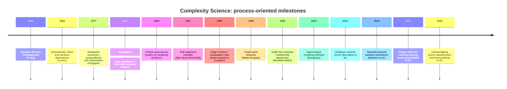
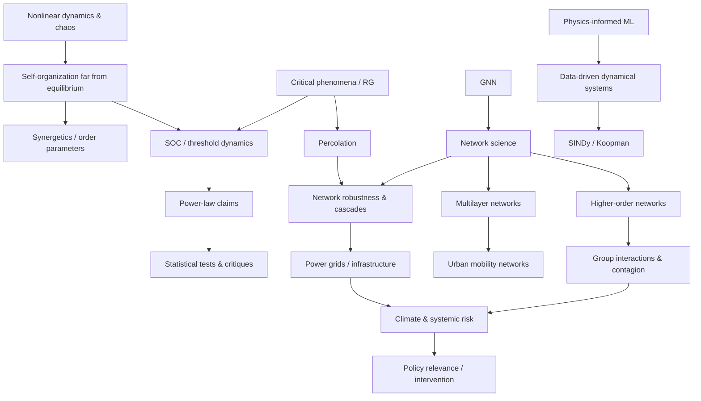

# DR-D29-complexity-science.md — D29 複雑系科学 ディープリサーチ一次ソース

**Issue**: #62 Step 6
**ソース**: ChatGPT Deep Research / deep-research (2026-02-24)
**レビュー**: Claude / claude-opus-4-5 (2026-02-24)
**指示書**: `chatgpt/inbox/REQ-GPT-20260223-D29_complexity-science.md`
**GPT出力**: unknown
**備考**: output未保存（チャット経由受領）

---

## 原レポート題

複雑系科学ディープリサーチ報告書（REQ-GPT-20260223-D29_complexity-science.md）

## エグゼクティブサマリ

本報告は、ファイル **REQ-GPT-20260223-D29_complexity-science.md** に記載された調査要件（「創造の5段階モデル：場→波→縁→渦→束」と**構造的に類似する**プロセス記述が複雑系科学に存在するか）を踏まえ、複雑系科学の主要理論・歴史・応用・最新動向を、一次資料と主要レビューを中心に整理した。fileciteturn0file0  

結論として、複雑系科学には「ゆらぎ→閾値（臨界）→境界での相互作用→秩序（パターン）の立ち上がり→安定化・反復」という**過程記述を含む枠組み**が複数あり（散逸構造、自己組織化臨界、反応拡散、臨界現象、シナジェティクス、エッジ・オブ・ケイオス、自己触媒ネットワーク等）、ただし理論ごとに「境界」「臨界」「安定化」の数学的定義と検証可能性が大きく異なる。citeturn1search0turn9search5turn2search17turn7search4turn2search16  

ファイルで「既に有力候補」とされた3理論（散逸構造論、自己組織化臨界＋セル・オートマトン、自己触媒集合）は、いずれも「臨界・分岐・閉包（closure）」概念と相性が良い一方、**“何でも説明できる”批判**（例：べき分布の誤検出、スケールフリー仮説の過剰一般化）への統計的・方法論的対策が不可欠である。citeturn9search0turn14search0turn14search1turn9search5  

過去10年（概ね2016–2026）では、(a) 多層・高次相互作用ネットワーク（multilayer / higher-order）、(b) データ駆動の力学系同定（SINDy、Koopman）、(c) 物理法則を組み込む機械学習（Physics-Informed ML）、(d) グラフニューラルネット（GNN）、(e) 気候ティッピングとカスケード、といった「**複雑系×データ×予測・介入**」の接続領域が強く伸長している。citeturn6search3turn10search0turn10search1turn10search2turn10search3turn11search0  

実務者にとっては、理論選択よりも「観測データの分解能・境界条件の定義・モデル検証（反証可能性）・感度解析」を満たす設計が成否を分ける。べき分布やスケーリング主張は特に厳密な適合検定が必要である。citeturn9search0turn14search1  

---

## ファイル内容の要約と要求仕様の整理

対象ファイルの中心は、「創造の5段階モデル（場→波→縁→渦→束）」が**存在そのものの形成プロセス**を記述する仮説であり、これと「構造的に類似するプロセス記述」が複雑系科学に見られるかを本格文献調査する、という依頼仕様である。fileciteturn0file0  

ファイルは5段階を次のように定義している：場＝未分節の背景、波＝揺らぎ・差異の顕在化（閾値超え）、縁＝境界・接触面での関係生成、渦＝まとまり（新秩序・パターン）の立ち上がり、束＝反復・安定化・制度化（束→場への循環含む）。fileciteturn0file0  

調査対象として、すでに候補として「散逸構造論」「自己組織化臨界（SOC）＋セル・オートマトン」「自己触媒集合（Kauffman）」が挙げられている。加えて、(2) 「自己組織化」と「創発」の関係（同義か区別か）と、(3) 複雑系科学の主要論争・批判（“何でも説明できる＝何も説明していない”批判等）を必須論点として明記している。fileciteturn0file0  

出力要件としては、主張ごとに **[P]（確立）/ [議論中]** タグ付与、引用は著者(年)形式、日本語、未知・未検証は正直に記すこと、そして5段階モデルとの対応づけは不要、とされる。なおファイル本文中に「…」が含まれ、番号付き要件の(1)が欠けているため、原仕様の一部が省略されている可能性がある（原稿の完全版が別にあるなら、その入手が望ましい）。fileciteturn0file0  

---

## 複雑系科学の主要理論、定義、歴史的発展

複雑系科学（complex systems science）は、多数要素の相互作用が、全体としての秩序・適応・情報処理・創発（emergence）を生む現象を、分野横断的に扱う枠組みとして整理されることが多い。代表的な総説として、複雑性プロファイルや多尺度性を含めて概観するレビュー（entity["people","Alexander F. Siegenfeld","complex systems review author"]／entity["people","Yaneer Bar-Yam","complex systems theorist"]）がある。citeturn4search5turn4search1  

また研究拠点の観点では、複雑適応系（complex adaptive systems）を掲げる学際研究機関として entity["organization","Santa Fe Institute","complex systems institute | santa fe, nm, us"] が1984年に設立された、という制度史的事実が、複雑系科学の「学際化」を象徴する。citeturn5search11turn5search7  

日本語圏の導入としては、複雑系理論生物学や生命の動的安定性・共進化を扱う教科書的著作（entity["people","金子邦彦","theoretical biologist"] ほか）や、創発概念の来歴を追う学術的整理が存在する。citeturn13search1turn13search13turn13search3  

歴史的発展を「プロセス記述（ゆらぎ→臨界→境界相互作用→パターン→安定化）」の観点で俯瞰すると、少なくとも以下が節目として位置づけられる（年代は代表作の発表年）：

- 反応拡散による形態形成（1952）：entity["people","アラン・チューリング","mathematician"] の反応拡散モデルは、均一状態の不安定化から空間パターンが生じる機構（後の “Turing pattern”）の原型を提示した。citeturn2search17turn2search37  
- 決定論的カオス（1963）：entity["people","エドワード・ローレンツ","chaos theorist"] は非線形常微分方程式の感度（初期値鋭敏性）と非周期軌道を示し、カオス理論の礎を築いた。citeturn3search0  
- 非平衡自己組織化（1970s）：entity["people","イリヤ・プリゴジン","non-equilibrium thermodynamics"] の非平衡熱力学と「散逸構造」概念は、開放系が平衡から離れた条件で秩序構造を形成し得ることを理論化し、1977年ノーベル化学賞の対象となった。citeturn1search0turn1search1  
- シナジェティクス（1977）：entity["people","ヘルマン・ハーケン","synergetics founder"] は非平衡相転移・自己組織化を「秩序変数（order parameter）」「従属原理（slaving principle）」等で統一的に扱う枠組みを展開した。citeturn2search16turn2search24  
- フラクタル（1982）：自然の不規則形状をスケール不変構造として記述するフラクタル幾何は、スケーリングという言語を多分野に広げた（代表的著作として entity["people","ブノワ・マンデルブロ","fractal geometry"]）。citeturn3search29turn3search1  
- 自己組織化臨界（1987）：entity["people","ペル・バック","self-organized criticality"] らは砂山モデル等を通じて、外部から精密に制御せずとも臨界的状態に“自律的に”近づく系の概念を提案した。citeturn0search11turn0search12  
- エッジ・オブ・ケイオス（1990）：entity["people","クリストファー・ラングトン","artificial life researcher"] はセル・オートマトンの相転移近傍で情報処理能力が高まる可能性を論じ、計算と臨界の接続を意識化した。citeturn5search2  
- ネットワーク科学（1998–1999）：entity["people","ダンカン・ワッツ","network scientist"]／entity["people","スティーブン・ストロガッツ","dynamical systems scientist"] のスモールワールド、entity["people","アルバート＝ラズロ・バラバシ","network scientist"]／entity["people","レーカ・アルバート","network scientist"] の優先的選択モデルにより、実データ駆動のネットワーク研究が加速した。citeturn2search18turn2search27  
- エージェントベースモデル（2002など）：ABMは複雑系の「生成的説明（generative）」に適し、社会・政策領域での応用が体系化された。citeturn4search0  

image_group{"layout":"carousel","aspect_ratio":"16:9","query":["Lorenz attractor chaotic system visualization","Turing pattern reaction diffusion animal coat pattern","Bak Tang Wiesenfeld sandpile model avalanche illustration","scale-free network Barabasi Albert visualization"],"num_per_query":1}

---

## 既存3理論の検証と追加理論の精査

### 散逸構造論（非平衡自己組織化）

**主要文献（代表）**  
- プリゴジン：1977年ノーベル化学賞（非平衡熱力学・散逸構造）citeturn1search0turn1search1  
- 非平衡系の自己組織化を体系化した書籍（著者情報・成立史は出版社・アーカイブで確認可能）。citeturn1search1turn1search4  

**コア主張（[P]/[議論中]）**  
- [P] 開放系が平衡から離れた条件（エネルギー/物質フラックス）で、秩序構造が形成され得る（散逸と秩序形成の両立）。citeturn1search0turn1search1  
- [P] 平衡近傍の線形応答ではなく、非線形領域では微小ゆらぎが増幅され、分岐（bifurcation）を通じて新しい定常構造に遷移し得る。citeturn1search1turn1search0  
- [議論中] 「散逸→秩序」言説が比喩的に一般化されやすく、熱力学的な厳密条件（状態方程式、エントロピー生成、境界条件）を欠く応用が“説明の万能化”を招く、という批判が繰り返し指摘されてきた（これは理論自体というより“適用の作法”への批判）。citeturn4search5turn4search32  

**プロセス記述（複雑系科学としての“生成”）**  
典型的説明は「熱力学的に駆動される開放系」で、平衡からの距離が増すにつれて（制御パラメータ増大）、(i) ゆらぎが観測可能な差異となり、(ii) 分岐点近傍で不安定化し、(iii) マクロな秩序変数で特徴づけられる構造（対流セル等）が立ち上がり、(iv) その構造がフラックスの下で維持される、という流れを取る。citeturn1search1turn2search16  

**境界・臨界・接触面（縁）に相当する概念**  
- 境界：開放系の境界条件（流入・流出、温度勾配等）が“秩序”の形を決める。citeturn1search1  
- 臨界：分岐点（安定性が変わる点）。citeturn2search16  
- 接触面：相互作用が局所で生じ、秩序変数に“集約”される（ハーケンの枠組みで明示化）。citeturn2search16  

**学術的位置づけ（評価・限界）**  
散逸構造は非平衡パターン形成の基礎語彙として定着しているが、現象ごとの厳密化は個別モデル（反応拡散、流体力学、非線形振動等）に依存するため、「一般理論としての散逸構造」だけでは予測・介入が不足することが多い。citeturn1search1turn2search17turn10search0  

**適用スケール**  
化学反応系・流体・生体パターンなど、連続体近似が成立するミクロ〜マクロまで広いが、特に「非平衡パターン形成（空間・時間構造）」に強い。citeturn2search17turn2search16  

### 自己組織化臨界（SOC）＋セル・オートマトン（CA）

**主要文献（代表）**  
- SOCの源流：バックらの論文（砂山モデル）citeturn0search11turn0search12  
- SOCの総説：25年レビュー（概念と論争整理）citeturn9search5turn9search1  
- CAの複雑性モデル：entity["people","スティーブン・ウルフラム","cellular automata"] によるCAの複雑性論（一般原理の提案）。citeturn4search15turn4search11  
- SOCの体系書：entity["people","Gunnar Pruessner","soc theorist"] による理論・モデル・特徴づけの整理。citeturn9search6turn9search18  

**コア主張（[P]/[議論中]）**  
- [P] 閾値型ダイナミクス（threshold dynamics）と局所相互作用のもとで、アバランチ的イベントが多発しうる（砂山などの典型モデル）。citeturn0search11turn9search18  
- [議論中] 多くの実データで観測される“べき分布”をSOCの証拠とみなす慣行は統計的に危うく、べき分布の検出・比較には厳密な推定と適合度検定が必要（安易なログ–ログ直線当てはめは不適切）。citeturn9search0turn9search8  
- [議論中] SOCは分野横断で強い影響力を持った一方、定義の拡散・誤解・過剰適用を巡る論争も多く、レビューはその点を明示的に整理している。citeturn9search5turn9search1  

**プロセス記述（“生成”としてのSOC/CA）**  
典型的には、(i) 外部駆動でゆっくり“蓄積”され（load）、(ii) 局所閾値を超えると連鎖的緩和（アバランチ）を起こし（release）、(iii) その結果として系全体が臨界的状態近傍に保たれる、という循環過程で語られる。CAは、この種の局所ルール→大域パターンの生成を最小モデルとして実装できる。citeturn0search11turn9search18turn4search15  

**境界・臨界・接触面**  
- 境界：格子の境界条件や散逸位置（端で砂が落ちる等）が定常状態を規定する。citeturn9search18  
- 臨界：臨界点“にチューニングされる”という主張自体がSOCの核（ただし実系でどの程度成立するかは分野依存で議論が残る）。citeturn9search5turn9search1  
- 接触面：局所相互作用（近傍規則）が連鎖発展の媒介になる。citeturn4search11turn0search11  

**学術的位置づけ（評価・限界）**  
SOCの価値は「閾値・連鎖・多尺度（power law など）を結ぶモデリング言語」を与えた点にあるが、経験データへの当てはめでは、(a) べき分布の統計検証、(b) 競合理論（乱流、分岐、自己回帰過程等）との識別、(c) 介入可能な制御パラメータの同定、が課題として残る。citeturn9search0turn9search5turn9search33  

**適用スケール**  
地球物理・宇宙物理・神経活動など多様な報告があるが、評価は分野ごとに差が大きい（“SOCらしさ”の定義が拡散しやすいため）。citeturn9search5turn9search33  

### 自己触媒集合（Autocatalytic Sets）

**主要文献（代表）**  
- entity["people","スチュアート・カウフマン","complexity and origin of life"] の起源生命・自己組織化に関する体系書（自己触媒集合を主要トピックとして含む）。citeturn0search14turn0search15  
- RAF理論（自己触媒かつ“食物集合”から生成可能）を、検出アルゴリズムとして定式化：entity["people","Wim Hordijk","autocatalytic sets researcher"]／entity["people","Mike Steel","mathematical biologist"] の理論・アルゴリズム。citeturn8search0turn8search19  
- 自己触媒ネットワークのレビュー（理論史、実験系への接続）：citeturn8search1turn8search27  

**コア主張（[P]/[議論中]）**  
- [P] 反応ネットワークの部分集合が「互いに触媒し合い」、かつ外部の“食物集合”から自己維持的に生成される、という形式的概念は数学的に定式化でき、効率的アルゴリズムで検出可能である（RAF理論）。citeturn8search0turn8search19  
- [議論中] 自己触媒集合が「生命の必要条件（ただし十分条件ではない）」とする主張はレビューで明示されるが、どのレベルの生命性（進化可能性、遺伝情報の出現、区画化）までを説明できるかは研究フロンティアである。citeturn8search1turn8search9  
- [P] 近年、RNA等を用いた前生物的実験系で“自己触媒的ネットワーク”を扱う研究が進み、理論と実験の往復が進展している。citeturn8search10turn8search35  

**プロセス記述（“生成”としての自己触媒集合）**  
( i ) 多様な分子と反応の母集団があり、( ii ) ある触媒密度（または触媒割当確率）を超えると反応の閉包が成立し、( iii ) “自己維持的な反応の束”が出現し、( iv ) その内部で反応産物が次の反応を支え合う、という相転移的描像が中心となる。citeturn8search1turn8search3turn8search9  

**境界・臨界・接触面**  
- 境界：食物集合（food set）と、自己触媒集合（RAF）との境界条件が理論の定義そのもの。citeturn8search0turn8search4  
- 臨界：触媒密度パラメータに関する相転移的な出現条件（どのモデルでどの臨界が成立するかはモデル依存）。citeturn8search3turn8search26  
- 接触面：触媒（catalysis）が“反応間の結合”＝接触面として働く（化学反応ネットワークのハイパーグラフ的表現にも接続）。citeturn8search9turn6search7  

**学術的位置づけ（評価・限界）**  
RAF理論は「検出可能性（計算可能性）」という強い武器を持つ一方、起源生命の説明では「区画化」「誤り訂正」「遺伝情報の継承」など、ネットワーク閉包だけでは不足する要素が残ることを多くのレビューが認めている。citeturn8search1turn8search27  

**適用スケール**  
分子反応ネットワーク（起源生命・代謝）から、抽象モデルとしては経済や技術の“相互補完的生産ネットワーク”への類推まで議論されるが、後者は比喩化のリスクが高く、定義の厳密化が重要である。citeturn8search26turn8search1  

### 追加で検討すべき理論クラス（ファイル要件の拡張）

ファイルの「構造的に類似するプロセス記述」を満たしうるものとして、少なくとも次が有力である。ここでは各理論について、文献・主張・過程・境界/臨界・評価・スケールを簡潔に整理する（網羅的な精査は、後述の比較表と最新動向も参照）。citeturn2search16turn2search17turn7search4turn6search21turn4search0turn5search0  

- シナジェティクス：秩序変数／制御変数、分岐による秩序形成を明示的に扱う。citeturn2search16turn2search24  
- 反応拡散・チューリング機構：均一状態→不安定化→空間パターン→安定化（境界条件が本質）。citeturn2search17turn2search37  
- 臨界現象・繰り込み群：スケール不変・普遍性（universality）を“臨界”の言語で厳密化。citeturn7search4turn7search2turn7search3  
- パーコレーション：連結性が閾値で劇的に変化し、巨視的クラスターが出現する。citeturn6search0turn6search21  
- ネットワーク科学の近年の拡張：多層・高次相互作用（ハイパーグラフ等）が“境界/接触面”の形式化として重要化。citeturn6search3turn6search2  
- オートポイエーシス（自己産出系）：構成要素が境界を生産し続ける、という「境界生成」を理論の中心に置く。citeturn5search0turn16search12turn16search2  
- ABM：局所ルール→大域パターン（創発）を“生成的説明”として検証する道具立て。citeturn4search0turn3search3  

---

## 比較表と事例研究表

### 理論的枠組みごとの比較表

下表は、ファイルが例示する理論群を中心に、複雑系科学の主要枠組みを「特徴・数理手法・応用・主要参考文献」で比較したものである（参考文献欄は代表例）。citeturn1search0turn9search5turn6search3turn4search0turn7search4turn6search0turn2search17  

| 枠組み | 特徴（何を“生成”とみなすか） | 主な数理手法 | 代表的応用 | 主要参考文献（代表） |
|---|---|---|---|---|
| 散逸構造・非平衡自己組織化 | フラックス駆動下での秩序形成（パターン・機能の維持） | 非線形安定性解析、分岐理論、連続体モデル | 反応系・流体・生体パターン | Prigogine（ノーベル関連）citeturn1search0turn1search1 |
| シナジェティクス | 秩序変数が微視相互作用を“従属”させ、相転移的に秩序が立つ | 秩序変数・制御変数、分岐、モード縮約 | レーザー、パターン形成、協同現象 | Haken “Synergetics”citeturn2search16turn2search24 |
| カオス理論 | 決定論でも長期予測不能（初期値鋭敏性）／アトラクタの形成 | 非線形力学、位相空間、Lyapunov指数 | 気象・流体・工学系の不規則振動 | Lorenz(1963)citeturn3search0 |
| 反応拡散・チューリング機構 | 均一状態の不安定化→空間パターン→固定化（境界条件が重要） | 反応拡散方程式、線形安定性、固有値解析 | 形態形成、組織パターン | Turing(1952)／解説レビューciteturn2search17turn2search37 |
| SOC（自己組織化臨界） | 制御なしに臨界近傍へ→アバランチ（スケール不変） | 閾値ダイナミクス、確率過程、CA | 地球物理・太陽フレア等のイベント統計 | Watkins et al.(2016)レビューciteturn9search5turn9search1 |
| 臨界現象・繰り込み群 | 臨界点での普遍性・スケール不変（“臨界”の厳密理論） | 統計力学、RG、スケーリング理論 | 相転移、臨界ダイナミクス | Wilson（ノーベル講演）citeturn7search4turn7search0 |
| パーコレーション | 閾値で巨視的連結成分が出現（接続性の“相転移”） | 格子/ネットワークの確率モデル、有限サイズスケーリング | 材料・伝染・地形・ネットワーク頑健性 | Stauffer & Aharony（教科書）citeturn6search12turn6search4 |
| ネットワーク科学 | “縁（接続）”の構造がダイナミクスを規定（拡散・同期・崩壊） | グラフ理論、スペクトル解析、確率モデル | 疫学、インフラ、SNS | Watts–Strogatz(1998)／Barabási–Albert(1999)citeturn2search18turn2search27 |
| 多層・高次相互作用ネットワーク | 相互作用を層/集合として表現し、従来モデルの限界を補う | 多層グラフ、ハイパーグラフ、単体複体 | 複数関係を持つ社会・交通・生体 | Boccaletti et al.(2014)／Battiston et al.(2020)citeturn6search2turn6search3turn6search6 |
| ABM（エージェントベースモデル） | 局所行動規則→巨視構造（生成的説明） | シミュレーション、探索、感度分析 | 政策評価、社会動態、経済 | Bonabeau(2002)citeturn4search0 |
| 自己触媒集合（RAF等） | 反応ネットワークの閉包が相転移的に出現 | 反応ネットワーク、計算アルゴリズム | 起源生命、代謝ネットワーク | Hordijk & Steel(2004)／レビューciteturn8search0turn8search1 |
| オートポイエーシス | 構成要素が境界を生産し自己同一性を維持（境界生成の理論） | 概念枠組み＋形式化の試み（議論は継続） | 認知・社会理論への拡張（慎重適用） | Maturana & Varela(1980)／Luisi(2003)／Razeto-Barry(2012)citeturn5search0turn16search12turn16search2 |

### 応用分野別の事例研究（表）

下表は代表例に限定し、「目的・手法・成果・限界」を“実務的に”比較できるよう整理した。citeturn2search17turn4search0turn11search7turn12search14turn11search0turn11search8turn10search0turn10search2turn6search3  

| 分野 | 事例 | 目的 | 手法 | 成果（代表） | 限界・注意点 | 主要参考文献 |
|---|---|---|---|---|---|---|
| 生物学 | チューリング・パターン | 形態パターンの生成機構を説明 | 反応拡散方程式＋不安定性解析 | 均一状態から縞・斑点が自発形成し得る枠組みを提示 | 実系は多要因で、単純2成分RDだけで説明しきれない場合が多い | Turing(1952)／70年レビューciteturn2search17turn2search37 |
| 社会科学 | ABMの方法論（一般） | 局所ルールから巨視現象を生成的に理解 | ABMの設計・検証枠組み | 多領域での応用方法を整理 | 校正・妥当性確認が難しく“物語化”しやすい | Bonabeau(2002)citeturn4search0 |
| 経済学 | エージェントベース・マクロ（ベースライン） | DSGEと異なる景気循環・分布を再現 | 異質主体ABM＋シミュレーション | スタイライズド・ファクト再現の可能性を示す | 同定・推定・比較可能性が課題 | Lengnick(2013)citeturn11search7 |
| 都市計画/都市科学 | 都市スケーリング（起源の理論化） | 都市指標が人口に対してべき的に変化する理由 | 経験データ＋理論モデル | 都市を複雑系として扱う理論的導出を提示 | 関数形の識別・都市境界定義・統計仮定で論争 | Bettencourt(2013)／批判的検定citeturn12search14turn14search2turn14search1 |
| 気候科学 | 気候ティッピング／連鎖リスク | 1.5℃超での複数ティッピング誘発可能性を評価 | 文献統合・不確実性評価 | ティッピング閾値の再評価と連鎖リスクを提示 | 閾値分布の不確実性・モデル依存が大きい | Armstrong McKay et al.(2022)citeturn11search0turn11search2 |
| 工学 | カスケード故障（複雑ネットワーク） | 連鎖的障害のモデル化と緩和策 | ネットワークモデル＋故障伝播のレビュー | モデル群と緩和戦略を整理 | 電力系は物理制約（AC潮流等）が強く、単純グラフモデルは不十分になり得る | Valdez et al.(2020)／Guo et al.(2017)citeturn11search8turn11search12 |
| 工学/数理 | SINDy（データ駆動方程式発見） | データから支配方程式を同定 | スパース回帰＋力学系 | 少数項での支配方程式復元を提示 | ノイズ・観測設計・辞書設計に強く依存 | Brunton et al.(2016)citeturn10search0turn10search4 |
| 工学/計算科学 | Physics-Informed ML | 物理法則×データの統合 | PINN等のレビュー | 物理制約を損失に組込み、逆問題等へ適用 | 学習不安定・スケーラビリティ等の限界も整理 | Karniadakis et al.(2021)citeturn10search2turn10search34 |
| 情報科学 | GNNレビュー | グラフ上の学習の体系化 | メッセージパッシング等 | 方法と応用を大規模整理 | 評価・解釈可能性・データ偏りが課題 | Zhou et al.(2020)citeturn10search3 |
| 複雑系一般 | 高次相互作用ネットワーク | ペア相互作用仮定の限界克服 | ハイパーグラフ等のレビュー | 高次構造がダイナミクス理解を改善し得る | 表現の選択・推定の難しさ | Battiston et al.(2020)citeturn6search3turn6search7 |

---

## 最新の研究動向と引用ネットワーク分析

### 過去10年中心の主要レビュー／ホットトピック

過去10年（概ね2016–2026）で“複雑系科学の方法論”を更新した潮流は、ネットワークと機械学習の接続、力学系のデータ駆動化、そして臨界・カスケードの政策的関心の増大に集約できる。多層ネットワークの包括レビューや、高次相互作用ネットワークの総説は、複雑系における「縁（相互作用単位）の再定義」を押し進めた。citeturn6search3turn6search2turn12search6  

同時に、観測データが増えたことで、力学系の“逆問題”（モデル同定・状態推定）が中心課題化し、SINDyやKoopman作用素のレビューが、複雑系を「データから再構成する」手続きを整備している。citeturn10search0turn10search1turn10search17  

さらに、物理法則を学習に埋め込む潮流（Physics-Informed ML）は、複雑系の予測・制御で「モデル不足」を補完する方向性として急速に引用を伸ばしている。citeturn10search2turn10search6turn10search26  

### 引用数・影響度の簡易ランキング

以下は、主要論文ページが表示する引用数（“Cited by”）を用いた簡易ランキングである（データベース・集計法により数値は変動するため、**2026-02-23時点の参照値**として扱うべき）。citeturn10search2turn10search3turn10search0turn6search10turn6search7turn11search0turn11search1turn11search8turn14search0turn9search5  

| 区分 | 論文/レビュー（代表） | 年 | 主題 | 参照元表示の引用数（目安） |
|---|---:|---:|---|---:|
| ML×複雑系 | Physics-informed machine learning | 2021 | 物理法則×学習 | 8,498citeturn10search2 |
| ML×ネットワーク | Graph neural networks: A review | 2020 | GNNレビュー | 9,269citeturn10search3 |
| データ駆動力学 | SINDy（PNAS） | 2016 | 方程式同定 | 6,392citeturn10search0 |
| 多層ネットワーク | Multilayer networks（Phys Rep） | 2014 | 多層構造とダイナミクス | 4,022citeturn6search10 |
| 高次相互作用 | Networks beyond pairwise（Phys Rep） | 2020 | ハイパーグラフ等 | 1,958citeturn6search7 |
| 気候ティッピング | Multiple tipping points（Science） | 2022 | ティッピング再評価 | 2,153citeturn11search0 |
| 気候ティッピング | Climate tipping points—too risky（Nature） | 2019 | リスク警告 | 2,619citeturn11search1 |
| カスケード故障 | Cascading failures review | 2020 | 連鎖故障レビュー | 155citeturn11search8 |
| ネットワーク批判 | Scale-free networks are rare | 2019 | スケールフリー普遍性批判 | 1,441citeturn14search0 |
| SOC総説 | SOC: concepts and controversies | 2016 | SOC論争整理 | 272citeturn9search5 |

このランキングは、複雑系科学が「理論→データ→学習→介入」へと重心移動していることを示唆する一方、引用数が“正しさ”を保証しない（話題性・応用範囲・分野人口に影響）点は留保が必要である。citeturn14search0turn9search5turn14search1  

### 引用ネットワークの読み方（概念的分析）

引用ネットワークを概念的に読むと、(A) 臨界・スケーリング（相転移・パーコレーション・SOC）クラスターと、(B) ネットワーク科学（構造とダイナミクス）クラスター、(C) データ駆動・機械学習クラスターが、近年「気候ティッピング」「インフラの連鎖故障」「疫学・都市」の応用ノードで強く結合している、という形が見えやすい。citeturn7search4turn6search21turn6search3turn11search0turn11search8turn10search2turn10search3  

一方で、スケーリングやべき分布に依存する主張は、統計的検定の厳密化（べき分布レビュー、スケールフリー“稀少”論文、都市スケーリング検定）が引用ネットワーク上で「批判・校正」枝として発達しており、これはファイルが求める「主要な論争・批判」論点の中核をなす。citeturn9search0turn14search0turn14search1turn14search2  

---

## 図表とモデリング・実装ガイド

### mermaidでのタイムライン案（概念図）

以下は、ファイルの関心（生成プロセスの構造）に沿って、複雑系科学の節目を“過程言語”で並べるための図案である（史実の根拠は本文の一次資料に基づく）。citeturn2search17turn3search0turn1search0turn0search11turn2search18turn2search27turn4search0turn10search2  

### mermaidでの引用ネットワーク概念図案（“何が何を支えるか”）

これは厳密な引用データから自動生成したものではなく、レビューが示す系譜に沿った「概念的ネットワーク」である（実データでの構築方法は後述）。citeturn9search5turn7search4turn6search3turn10search2turn11search0turn14search0  

### 図（グラフ）提案：定量検証で有用なチャート

ファイルの「“何でも説明できる”批判」対策として、次の可視化が実務上重要である。べき分布主張やスケーリング主張を扱う場合、ログ–ログ直線だけで結論を出すことは避け、尤度ベース比較と適合度検定を併用するべきである。citeturn9search0turn14search1turn14search0  

- **べき分布検証**：CCDF（補累積分布）＋推定区間、代替分布（対数正規等）との尤度比比較（Clauset et al.流）。citeturn9search0turn9search8  
- **相転移/臨界**：制御パラメータに対する秩序パラメータの変化、有限サイズスケーリング。citeturn7search4turn6search0  
- **ネットワーク頑健性**：除去率に対する巨大連結成分サイズ（percolation on networks）。citeturn6search0turn11search8  
- **ABM検証**：出力分布の多指標比較（平均だけでなく分散・歪度・尾部）、感度解析（パラメータ→結果の写像）。citeturn4search0turn4search32  

### 研究ギャップ・未解決問題・推奨手法

複雑系科学の研究ギャップは、概念的には「生成（創発）を語る言語の豊富さ」に対し、「反証可能性・識別可能性・介入可能性」が追いつかない点に集約されることが多い。これが“何でも説明できる”批判の背景であり、統計検定・モデル比較・因果推論の導入が主要な対策になる。citeturn9search0turn14search0turn9search5turn14search1  

特に未解決問題として、(a) 境界（何を系とみなすか）定義の恣意性、(b) 多尺度（ミクロ→マクロ）の縮約の一意性欠如、(c) 相互作用の単位（ペアか高次か）の推定、(d) 非定常・時間変化ネットワークでの“臨界”定義、が挙げられる。近年の高次相互作用ネットワークや多層ネットワーク研究は (c)(d) の形式化を進めるが、実データからの推定は依然難しい。citeturn6search3turn6search2turn12search29  

スケーリングについては、都市スケーリング・ネットワークのスケールフリー性ともに、関数形の識別と統計仮定に関する批判が蓄積しているため、研究では「検定可能な予測（追加の共変量、機構モデル、反事実シミュレーション）」を合わせて提示することが望ましい。citeturn14search2turn14search1turn14search0  

### 実務者向け短期実装ガイド

**データ要件**  
- 境界定義：ノード・エッジ・相互作用単位（ペア／グループ）を、観測手段と整合させて定義する（多層/高次では特に重要）。citeturn6search3turn6search2  
- 時系列：臨界・相転移・因果方向に関心がある場合、十分な長さと分解能が必要（短い系列＋重尾統計は誤判定しやすい）。citeturn9search0turn7search4  
- ノイズ：SINDyやPINN等のデータ駆動法はノイズ・サンプリング設計の影響が大きい。citeturn10search0turn10search2  

**計算資源（目安）**  
- ABM：多数回試行（乱数・パラメータ）による不確実性評価が本体になりやすく、並列化前提の設計が望ましい。citeturn4search0turn4search32  
- GNN/PINN：GPUが有効だが、物理制約付き学習は最適化が難しく、分散・ミニバッチ戦略の設計が鍵になる。citeturn10search2turn17search3turn17search36  

**推奨ソフトウェア／ライブラリ（代表）**  
- ネットワーク解析：entity["organization","NetworkX","python network library"]（Python）citeturn17search8  
- ABM：entity["organization","Mesa","python abm framework"]（Python）citeturn17search1turn17search19  
- GNN：entity["organization","PyTorch Geometric","gnn library"]（PyTorch拡張）citeturn17search3turn17search14  
- SINDy実装：entity["organization","PySINDy","sindy python package"]（SINDyのソフトウェア実装）citeturn17search2turn17search6turn17search10  

**評価指標（最低限）**  
- 予測（時系列・ネットワーク過程）：外挿性能（時間・ネットワーク分割）と不確実性（予測区間）を報告。citeturn10search0turn11search8  
- 構造仮説（べき分布・スケーリング）：代替モデル比較＋適合度（p値や尤度比）を明示。citeturn9search0turn14search0turn14search1  
- ABM：感度解析（パラメータ→結果の頑健性）、再現すべきスタイライズド・ファクトの事前登録（“後付け説明”回避）。citeturn4search0turn11search7  

---

## 結論

ファイルが求める「創造の5段階モデル」と**構造的に類似する**過程記述は、複雑系科学の主要理論群に広く存在する。特に、散逸構造論（非平衡下の秩序形成）、SOC/CA（閾値連鎖と臨界近傍）、自己触媒集合（閉包の相転移的出現）は、ゆらぎ・臨界・境界（縁）・秩序（渦）・安定化（束）という語彙と整合しやすい。fileciteturn0file0 citeturn1search0turn9search5turn8search1  

一方で、複雑系科学の中心的論争として、べき分布やスケーリングの誤検出・過剰一般化が繰り返し問題化しており、“何でも説明できる”批判に対しては、統計的厳密さ（検定・モデル比較）と境界条件の明確化が不可欠である。citeturn9search0turn14search0turn14search1turn9search5  

過去10年の研究フロンティアでは、ネットワーク表現の高度化（多層・高次）と、データ駆動・機械学習の統合（SINDy/Koopman、PINN、GNN）が、複雑系の「記述→推定→予測→介入」を加速しており、今後は“生成プロセス”の主張を、より反証可能な形で結び直す研究が重要になる。citeturn6search3turn10search0turn10search2turn10search3turn10search1
