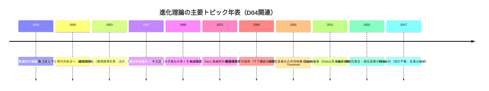

# D04進化生物学レポート全面再レビュー報告

## エグゼクティブサマリ

本レビューは、提出済みの **evidence-D04-evolutionary-biology.md** を実際に参照し、行番号ベースで **P層（一次記述）の文献照合・正確化**、**M/L層（解釈・洞察）の論理整合性点検**、**見落とし候補の追加提案**、および **差分パッチ（行単位）** を作成した。なお、今後ファイルが更新されると行番号はずれるため、差分パッチは「現時点のファイル」に対して有効である。

最優先の修正点は次の5点である。

- **EV-D04-007（ハイブリッドゾーン）**：「cline width = σ²/(s)^(1/2)」が次元的にも理論的にも不適切で、標準的整理は **w ∝ σ/√s（定数係数はモデル依存）** である。Mallet et al. 1990 の要旨が直接これを述べている。citeturn9view3  
- **EV-D04-001（中立説・ほぼ中立説）**：「drift barrier（|s|<1/Ne）を太田ほぼ中立説に導入」とする書き方は概念の混線リスクがある。太田の定式化の中核は **選択の有効性が N_e s に依存**する点であり（固定確率は連続的に変化）、それを明示して書き換えるべきである。citeturn17view0  
- **EV-D04-001（遺伝子重複→neofunctionalization）**：「中立的遺伝子重複→機能分化は確立メカニズム」と断言するのは強い。重複遺伝子の多くは喪失し、保存の説明として **サブ機能化** など複数機構が強く議論されるため、記述を中立化する。citeturn15search2turn15search1  
- **EV-D04-008（内共生史）**：「15誌に拒否」を断定してよい根拠は弱く、一次に近い史料では「some 15」「more than a dozen」など幅を持つ。文献に合わせて **“十数誌（some 15）”** に調整する。citeturn9view1turn9view2  
- **EV-D04-005（可塑性）**：「arrival of the fittest」をP層に含めると、定義と修辞が混ざる。P層は可塑性の定義（反応規範）に固定し、arrivalはM/Lの比喩として位置づけ直す。citeturn2search21turn17view1  

併せて、EES（拡張進化的総合説）は一次論文が “constructive development / reciprocal causation” を明確に定義する一方で、必要性（新枠組みか、既存枠組みの拡張か）自体が論争的であるため、**牽強付会リスクとconfidence（特にM軸）を下げる**のが妥当である。citeturn21view2turn21view0turn20view0  

## 対象とレビュー方針

対象は **evidence-D04-evolutionary-biology.md**（D04進化生物学レポート）である。記述はファイル内の layer 表記に従い、P/M/Lを次のように扱った。

- **P層**：一次文献・主要総説の範囲で、定義・因果・主張の射程が過不足ないかを照合し、誤記・過断定・概念混線を修正した。特に、entity["people","木村資生","evolutionary geneticist"]（1968）、entity["people","太田朋子","evolutionary geneticist"]（1973/1992）、HGT/内共生の基礎史料、EESの一次論文などを優先した。citeturn18view0turn17view0turn22view0turn21view3  
- **M層**：P層の射程を越えていないか（一般化の飛躍、比喩の混入、反証可能性の低下）を点検し、必要に応じて「比喩である」「モデル依存である」などのガードを追加した。  
- **L層**：洞察の価値を落とさず、しかし「断言」に見えない表現へ調整する（“〜と読める”“〜として扱うのが安全”など）。EESに対する賛否が一次文献上も併存するため、両論併記を優先した。citeturn21view3turn20view0  

## P層の一次文献照合と修正提案

下表は、P層の誤記・不正確表現・過断定箇所を、**行番号**とともに示し、根拠文献と**差し替え文**を提示する。

| 行 | 節 | 原文（抜粋） | 指摘 | 一次文献根拠 | 修正文（差し替え） |
|---:|---|---|---|---|---|
| 0030 | EV-D04-001 | 「突然変異はコピーエラー。大多数は有害…」 | 「コピーエラー」は原因を狭めすぎる。また分布は領域・種で異なるため、「有害 or 中立」の二分より「中立〜弱有害が多数、強有害は浄化、有益は稀」が精密。 | 変異効果の分布（DFE）と「有益は稀」について総説が明示。citeturn16search3turn16search0 |（差分パッチ参照） |
| 0031 | EV-D04-001 | 「太田のほぼ中立説(1973)は浮動障壁(drift barrier: |s|<1/Ne)を導入」 | ほぼ中立説の中核は **選択の有効性が N_e s で決まる**点で、固定確率は連続的（閾値“風”でも厳密な不連続ではない）。「drift-barrier」は主に突然変異率進化で使われる用語で、ここでは混線しやすい。 | 太田1992は「選択の有効性は Ns（＝N×s）で決まる」ことを明記。citeturn17view0  drift-barrierの用法は突然変異率進化で整理される。citeturn14view3 |（差分パッチ参照） |
| 0032 | EV-D04-001 | 「中立的遺伝子重複→機能分化…は確立メカニズム」 | 「中立的重複→新機能化」を“確立”と断言すると、重複遺伝子の多くが喪失する事実や、保存機構（サブ機能化等）の競合仮説を落とす。 | 重複遺伝子の運命（喪失/保存/新機能化、サブ機能化）を主要論文が整理。citeturn15search2turn15search1 |（差分パッチ参照） |
| 0111 | EV-D04-003 | 「EESの三本柱の一つ」 | 「三本柱」という定式化は読者に“正式枠組み”の印象を与えやすい。一次論文は「developmental bias / inclusive inheritance / niche construction」を主要因子として列挙するが、同時に可塑性も含むため、数の固定は避けた方が安全。 | EES一次論文（2015）はこれらを通じて発生過程が進化の方向と速度に関与すると述べる。citeturn21view3 |（差分パッチ参照） |
| 0147 | EV-D04-004 | 「MSの『自然選択が進化の主因』を拡張…」 | MSを「自然選択主因」とだけ要約すると、MSがドリフト等を含む点が落ちる。EES一次論文は「遺伝子頻度変化を中心に置く整理」を対象化しつつ、発生バイアス等が進化の方向・速度に関与すると強調する、という形が正確。 | EES一次論文は “方向と速度、変異の起源” への寄与を明示。citeturn21view3turn21view2 |（差分パッチ参照） |
| 0187 | EV-D04-005 | 「表現型可塑性…『arrival of the fittest』」 | P層の定義に修辞句が混ざっている。P層は「同一遺伝子型が環境で複数表現型」を定義として固定し、arrivalはM/Lへ分離すべき。 | 遺伝的同化はWaddington原著の要約部で定義的に確認できる。citeturn17view1  Genetic accommodation/assimilationの関係は総説が明示。citeturn2search21 |（差分パッチ参照） |
| 0188 | EV-D04-005 | 「遺伝的同化…遺伝的収容がより広い概念」 | 方向性は正しいが、P層としては「同化は収容の一形態」という関係を明示すると誤読が減る。 | Genetic assimilationの実験結果と定義が原著要約に明示。citeturn17view1  Genetic accommodationとの包含関係が二次文献で明確。citeturn2search21 |（差分パッチ参照：refsも追加） |
| 0189 | EV-D04-005 | 「deep homology…Pax6, Hox等」 | 概ね正しいが、P層では代表文献（Nature等）を挿して根拠を明示した方が強い。 | deep homologyの概念整理（Nature掲載論文・関連総説の引用情報）。citeturn2search33turn2search22 |（差分パッチ参照：refsに追加） |
| 0262 | EV-D04-007 | 「Harrison(1993)が『自然の実験室』と命名」 | 命名の強さ（“命名”）は一次確認が必要。安全には「自然の実験室／進化過程の窓として扱われることが多い」に緩める。 | “natural laboratory/window”表現がHarrison(1993)に帰属されて引用される例。citeturn3search13 |（差分パッチ参照） |
| 0286 | EV-D04-007 | 「cline width = σ²/(s)^(1/2)」 | 代表的整理は **σ/√s**（モデル・定義で定数係数）。σ²/√s は不整合。 | Mallet et al. 1990 が「cline width は概ね σ/√s に比例」と要旨で明記。citeturn9view3 |（差分パッチ参照） |
| 0301 | EV-D04-008 | 「Margulis(1967)は…15誌に拒否」 | 逸話は一次に近い史料では「some 15」「more than a dozen」等。断定は避け、幅を持たせる。 | 追悼記事で「some 15 journals」。citeturn9view1  50年後回顧で「more than a dozen」。citeturn9view2 |（差分パッチ参照） |
| 0314 | EV-D04-008 | 「refs: Sagan[Margulis](1967)」 | 表記を一次に合わせ「Sagan(1967)」に統一し、逸話根拠（Knoll/Gray）もrefsへ追加するのがよい。 | Sagan(1967)の書誌情報（PubMed）。citeturn18view1 |（差分パッチ参照） |
| 0337 | EV-D04-009 | 「接合・形質転換・形質導入が機構」 | 正しいが、P層として「HGTの定義」と「機構の代表3分類」を一次/総説で裏づけた方がよい。 | HGTの定義（Nat Rev Genet総説）。citeturn23search3  代表機構3分類（Transformation/Conjugation/Transduction）を明示。citeturn23search15 |（差分パッチ参照） |
| 0338 | EV-D04-009 | 「Darwinian Threshold…初期進化ではHGT支配的→…」 | 方向性は正しい。P層では Woese 要旨の文言に寄せて、共同体的進化→閾値→垂直継承の重要化を明示するのが堅い。 | Woese要旨が「primitive evolution is communal」「critical point is Darwinian Threshold」と明示。citeturn22view0 |（差分パッチ参照） |

## M層とL層の論理整合性と表現調整

下表は、M/L層で見つかった **牽強付会リスク** と、**どの行をどう変えるか** を行単位で示す。

| 行 | 節 | 原文（抜粋） | 論理的問題点とリスク | 行置換の修正案 |
|---:|---|---|---|---|
| 0052 | EV-D04-001 | 「…中立説は…実証。浮動障壁(|s|<1/Ne)はHopf分岐と同種…」 | ①「…」が残り文章欠損。②“Hopf分岐”は数学的に特異な概念で、ここで言いたいのは多くの場合「閾値“風”」であり、固定確率が連続的に変わる（太田1992）点を落とすと誤解を招く。citeturn17view0 | 差分パッチで、**連続性**と**N_e s依存**を明示し、Hopf同一視を撤去。 |
| 0054 | EV-D04-001 | 「自然選択は『適応度』という単一軸で評価…」 | 選択の数学モデル上は適応度をスカラー化するが、現実の“適応度”は複数成分・多目的制約（トレードオフ）として現れうる。「進化には評価軸複数性がない」と断言すると反例を呼ぶ。 | 差分パッチで「モデルではスカラー化するが、現実は多次元制約」と整理。 |
| 0169 | EV-D04-004 | 「MSが一方向因果だったのをEESが循環因果に拡張」 | EES一次論文は“unidirectional causation が歴史的デフォルト”としつつ、現代でも相互因果を扱ってきた領域があることを明記している。断言は避けるのが一次文献整合。citeturn21view0turn21view1 | 差分パッチで「MSでも相互因果領域はある」注記を追加。 |
| 0162–0164 | EV-D04-004 | 「牽強付会リスク: 低」「confidence: 0.88」 | EESは一次論文上で“二解釈”を認め、外部でも“枠組み要否”が論争であるため、M側の確度は下げるのが妥当。citeturn21view3turn20view0turn19search8 | 差分パッチでリスクを「中」、confidenceを0.82へ。refsに反論側（Futuyma）を追加。 |
| 0200 | EV-D04-005 | 「牽強付会リスク: 低。Waddingtonの実験で段階性確認済み」 | Waddingtonの実験事実自体は強いが、「可塑性→同化/収容」が自然界でどの程度一般化できるかはケース依存で、EES陣営・批判側ともに“熱い領域”。citeturn20view0turn2search21 | 差分パッチで「中（一般性はケース依存）」へ。 |
| 0321 | EV-D04-008 | 「科学史上最も有名…」 | “最も”は過大。根拠文献は「some 15」「more than a dozen」であり、「よく引用される逸話」程度に落とすのが安全。citeturn9view1turn9view2 | 差分パッチで「よく引用される」に緩和し、文章欠損（…）も解消。 |
| 0339 | EV-D04-009 | 「概念的枠組みとしては広く受容…」 | “広く受容”はコミュニティにより温度差。Woese要旨が示すのはコンセプト提案であり、後続で多様な展開・再解釈がある。断言より「影響力は大きいが議論がある」が妥当。citeturn22view0turn10search11turn10search31 | 差分パッチで表現を調整。 |

image_group{"layout":"carousel","aspect_ratio":"16:9","query":["Waddington epigenetic landscape diagram","endosymbiosis mitochondria chloroplast diagram","horizontal gene transfer network diagram"],"num_per_query":1}

また、EES一次論文は「構成的発生」と「相互因果」を**二つの統一テーマ**として掲げ、「適応の創造性は選択だけに依存しない」という立て付けを採る。citeturn21view2turn21view0  一方で反論側は「既存理論は拡張され続けており、改訂（emendation）を要する兆候はない」と明示しているため、D04本文では**“どちらの立場も一次で言っていること”を同時に残す**のが最も堅い。citeturn20view0turn21view3  



## 見落とし候補の追加提案

D04は「境界」「保持」「階層」「相互因果」に強い。一方で、同じ軸を補強しつつP層を厚くできる“定番の欠落”がいくつかある。追加候補を、短い根拠と「D04に入れる理由」で示す。

| 追加候補 | 根拠（要点） | D04に入れる理由 |
|---|---|---|
| 変異効果分布（DFE）と“弱有害が多数” | 「有益は稀」「有害分布は多峰性」などが総説で整理されている。citeturn16search0turn16search3 | EV-D04-001のP層を精密化し、「誤差の3運命」を**確率分布として**補強できる。 |
| 遺伝子重複の保存機構の並列提示 | 重複の運命（喪失、サブ機能化等）が主要論文で整理。citeturn15search2turn15search1 | EV-D04-001の「保持→後の創造」を、**“どの経路で保持されるか”**まで延長できる。 |
| HGTの“web of life”整理 | HGTが系統を網状化することを総説が整理。citeturn23search3 | EV-D04-009の「生命の樹は網」に一次的根拠を付与し、概念の射程を明確化できる。 |
| HGTの反対意見・限界（批判的視点） | “HGT万能論への批判”が古典的に存在。citeturn23search18 | EV-D04-009のM層（相転移比喩）を適切に締めるため、**反証可能性**が上がる。 |
| EES論争の両論併記テンプレ | EES一次側（構成的発生・相互因果）と、批判側（改訂不要）の要約が一次で取れる。citeturn21view2turn20view0 | EV-D04-004/003/005のL層が「陣営の主張の代理戦争」に見えないよう、**立場差を構造化**できる。 |
| 内共生の“証拠の束”の短い固定文 | 回顧論文が「どの点が高確度で、どの点が受容されなかったか」を分離して説明。citeturn9view2turn9view1 | EV-D04-008のP層を「確立」の一語で済ませず、D04全体の“証拠主義”を強められる。 |

## confidence再割当て案

現行D04は単一の confidence を置くが、依頼趣旨（PとMの峻別）からは **2軸（confidence_P, confidence_M）** が適合的である。ここでは、D04の主要項目（EV-D04-001〜010）を **P（事実同定）** と **M（解釈・比喩）** に分けて再割当てする案を示す。

| 項目 | confidence_P | confidence_M | コメント |
|---|---:|---:|---|
| EV-D04-001 自然選択+中立説 | 0.88 | 0.72 | Pは修正後は高いが、D1/D3同型や“評価軸単一”は比喩なのでMは抑える。citeturn17view0turn16search3 |
| EV-D04-002 断続平衡説 | 0.82 | 0.70 | Pは概ね妥当（古典理論）。M（D1との接続）は比喩のため中程度。 |
| EV-D04-003 ニッチ構築 | 0.85 | 0.75 | “束→場回帰”との対応は筋が良いが、EES内での位置づけ表現は抑制的に。citeturn21view3 |
| EV-D04-004 EES | 0.80 | 0.60 | Pも“論争の事実”を含むため満点にしない。Mは両論併記前提で低め。citeturn21view3turn20view0 |
| EV-D04-005 可塑性・遺伝的収容 | 0.84 | 0.68 | Waddington実験は強いが、一般性を断言しない。citeturn17view1turn2search21 |
| EV-D04-006 赤の女王仮説 | 0.80 | 0.70 | Pは定番だが、強い一般化は避けると安定。 |
| EV-D04-007 ハイブリッドゾーン | 0.86 | 0.74 | cline width誤り修正でPが上がる。M（縁の厚みのモデル化）は強い。citeturn9view3turn3search11 |
| EV-D04-008 内共生 | 0.90 | 0.80 | Pは確立だが逸話は幅を残す。M（境界消失→階層創発）は良い洞察。citeturn9view2turn9view1 |
| EV-D04-009 HGT | 0.83 | 0.62 | Woese概念は一次要旨で支えられるが、単一“閾値”の普遍性は議論中。citeturn22view0turn23search18 |
| EV-D04-010 適応放散 | 0.80 | 0.70 | 例示に要精査箇所がある可能性（分類学的更新など）。 |

## 差分パッチ

以下は **行単位の置換テキスト**（コピペ用）である。指定行をそのまま差し替える。

```text
[L0030] REPLACE WITH:
  - [P] 突然変異はDNA複製・修復・組換えなどの過程で生じる塩基置換/indel等。新生変異の多くは中立〜弱有害で、強い有害変異は浄化選択で除去される；有益変異は相対的に稀だが、条件次第で選択により固定することがある

[L0031] REPLACE WITH:
  - [P] 木村の中立説(1968): 分子進化速度の大きさ等を説明するため、多くの分子変化（とくに同義置換など）は中立的浮動で固定し得る。太田のほぼ中立説(1973; 1992): 選択の有効性は N_e s に依存し、|N_e s|≲1 の弱い(しばしば弱有害)変異は集団サイズ依存で中立的に振る舞う

[L0032] REPLACE WITH:
  - [P] 遺伝子重複は新機能進化の素材になり得るが、多くの重複は失活/欠失する。保存される場合も、新機能化(neofunctionalization)だけでなくサブ機能化(subfunctionalization)等、複数機構が提案される

[L0047] REPLACE WITH:
- **refs**: Darwin(1859), Fisher(1930), Ohno(1970), Kimura(1968,1983), Ohta(1973,1992), Lynch & Conery(2000), Lynch & Force(2000), Eyre-Walker & Keightley(2007), Sung et al.(2012)

[L0052] REPLACE WITH:
**[類似]**: 進化の基本は「変異の生成→（主に浄化選択による）棄却→（漂う）保持→（条件変化や環境による）再利用」であり、D1の比喩（誤差の生成/選別/保持）と対応づけやすい。木村の中立説と太田のほぼ中立説は、|N_e s| が小さい領域では浮動が結果を大きく左右することを定量的に示した。|N_e s|≲1 の“境界”は閾値的に見えるが、実際の固定確率は連続的に変化する点に注意。

[L0054] REPLACE WITH:
**[独自]**: 自然選択に意図はない(H-05)。D1の「拾う態度」は主体的だが、自然選択は環境依存の相対適応度差の結果として生じる。適応度は生存・繁殖・配偶成功など複数成分を含み、モデルでは便宜上スカラーに集約するが、現実の選択は多次元制約下のトレードオフとして現れる。

[L0111] REPLACE WITH:
  - [P] EES論文はニッチ構築を、選択環境が生物活動によって変化する（相互因果）の主要例として位置づける

[L0147] REPLACE WITH:
  - [P] MSは（選択・浮動・遺伝子流動・突然変異により）集団の遺伝子頻度が変化するという整理を基盤にするのに対し、EESは発生バイアス・包括的継承・ニッチ構築等が進化の方向・速度や変異生成に関与すると強調し、これらを進化因果の一部として扱う

[L0162] REPLACE WITH:
- **牽強付会リスク**: 中。原著は構造（建設的発生・相互因果）を明示する一方、MSに対して「新枠組みが必要か」は現在進行形で論争がある

[L0163] REPLACE WITH:
- **confidence**: 0.82

[L0164] REPLACE WITH:
- **refs**: Laland et al.(2015), Danchin et al.(2011), Futuyma(2017)

[L0169] REPLACE WITH:
**[類似]**: 相互因果循環＝5段階の束→場回帰の一般化、という読みはEESが明示する“reciprocal causation”と整合する。ただし、MS（およびその拡張）でも性選択や共進化などで相互因果は扱われてきたため、「MSは一方向因果だった」という書き方は強め。

[L0173] REPLACE WITH:
**[学び]**: 「因果の方向」の拡張。D1にとっての示唆: 「誤差を拾う」行為が次の「誤差が生じる場」を改変する、という再帰構造が成立し得る（ニッチ構築や発生過程を介した環境改変/自己改変の一般形）。

[L0187] REPLACE WITH:
  - [P] 表現型可塑性——同一遺伝子型が環境条件に応じて複数の表現型（反応規範）を産出する性質

[L0190] REPLACE WITH:
  - [M] G×E相互作用が「縁」——環境が発生の境界条件として表現型を切り替える。可塑性は「どの変異が可視化されるか」を環境側から偏らせ得る

[L0200] REPLACE WITH:
- **牽強付会リスク**: 中。Waddingtonの実験は確立的だが、「可塑性→同化/収容」が自然界でどの程度一般的かはケース依存

[L0202] REPLACE WITH:
- **refs**: West-Eberhard(2003), Waddington(1953), Shubin et al.(2009), Grether(2005), Pigliucci(2006)

[L0209] REPLACE WITH:
**[独自]**: 「survival of the fittest」だけでは、変異がどのように供給されるか（arrival）を説明しづらい、という問題意識はEvo-Devo/可塑性研究で繰り返し強調される。ただし「arrival of the fittest」は修辞的に使われやすいので、Pではなく比喩（M/L）として扱うのが安全。

[L0262] REPLACE WITH:
  - [P] 遺伝的に分化した集団が接触・交雑する地帯。ハイブリッドゾーンは種分化・遺伝子流動・選択の推定に用いられる「自然の実験室／進化過程の窓」として扱われることが多い

[L0277] REPLACE WITH:
- **refs**: Barton & Hewitt(1985), Harrison(1993), Mallet et al.(1990), Rieseberg et al.(1999)

[L0286] REPLACE WITH:
**[学び]**: 「縁の厚み」が定量化できる稀有な例。cline width は（単純な張力帯モデルでは）分散距離 σ と選択強度 s に対して概ね w ∝ σ/√s（定数係数はモデル/定義に依存）と整理できる。

[L0301] REPLACE WITH:
  - [P] Margulis（当時Lynn Sagan）(1967)は提唱時に十数誌（some 15）に拒否されたと伝えられる。D1の科学史的フックになり得る

[L0312] REPLACE WITH:
- **牽強付会リスク**: 低-中。内共生説自体は確立。ただし「15誌」等の逸話は“十数誌”程度の幅を残して書くのが安全

[L0313] REPLACE WITH:
- **confidence**: 0.88

[L0314] REPLACE WITH:
- **refs**: Sagan(1967), Knoll(2012), Gray(2017)

[L0321] REPLACE WITH:
**[独自]**: 「縁が消失する」ことによる創造は、D07(ハイブリッドゾーン/境界維持)と対照的。境界の運命のスペクトラム（「維持される」↔「融合する」）という観点から読むと理解しやすい。提唱当初に十数誌で拒否されたという逸話はよく引用され、D1の科学史的フックとして機能し得る。

[L0325] REPLACE WITH:
**[文脈]**: 細胞生物学・進化生物学。Sagan(1967)が内共生起源を体系提示し、その後の分子・細胞生物学的証拠（オルガネラDNAや系統解析等）で主流理論として確立。

[L0337] REPLACE WITH:
  - [P] 遺伝子が系統境界を越えて移動（親子関係によらない遺伝子移動）。原核生物では重要度が高い。接合(conjugation)・形質転換(transformation)・形質導入(transduction)が代表的機構

[L0339] REPLACE WITH:
  - [議論中] Darwinian Thresholdの具体的分子機構や「閾値」を規定する条件は未確定。初期進化を“共同体的（コミュナル）”に捉える視座として影響力は大きいが、どこまで単一の閾値概念で記述できるかは議論がある

[L0352] REPLACE WITH:
- **refs**: Woese(2002), Soucy et al.(2015), Burmeister(2015)
```

## 参考優先文献

ユーザ要件に合わせ、主要一次文献・主要総説のURL（DOI含む）を優先度順に列挙する。

```text
Kimura, M. (1968) Evolutionary Rate at the Molecular Level. Nature 217:624–626.
https://www.nature.com/articles/217624a0

Ohta, T. (1992) The Nearly Neutral Theory of Molecular Evolution. Annual Review of Ecology and Systematics 23:263–286.
https://www.metabolic-economics.de/pages/seminar_theoretische_biologie_2007/literatur/schaber/Ohta1992AnnuRevEcolSyst23.pdf

Waddington, C. H. (1953) Genetic Assimilation of an Acquired Character. Evolution 7:118–126.
https://www.nig.ac.jp/jimu/soken/courses/devbiol/2025/Evolution10.1111j.1558-5646.1953.tb00070.x.pdf

Sagan, L. (1967) On the origin of mitosing cells. Journal of Theoretical Biology 14(3):255–274.
https://pubmed.ncbi.nlm.nih.gov/11541392/
（SciDirect側の書誌ページ）
https://www.sciencedirect.com/science/article/pii/0022519367900793

Knoll, A. H. (2012) Lynn Margulis, 1938–2011. PNAS (obituary, PMC).
https://pmc.ncbi.nlm.nih.gov/articles/PMC3268288/

Gray, M. W. (2017) Lynn Margulis and the endosymbiont hypothesis: 50 years later. Molecular Biology of the Cell (PMC).
https://pmc.ncbi.nlm.nih.gov/articles/PMC5426843/

Woese, C. R. (2002) On the evolution of cells. PNAS.（PubMed要旨）
https://pubmed.ncbi.nlm.nih.gov/12077305/

Laland, K. N. et al. (2015) The extended evolutionary synthesis: its structure, assumptions and predictions. Proc. R. Soc. B (PMC).
https://pmc.ncbi.nlm.nih.gov/articles/PMC4632619/

Futuyma, D. J. (2017) Evolutionary biology today and the call for an extended synthesis. Interface Focus.（PubMed要旨）
https://pubmed.ncbi.nlm.nih.gov/28839919/

Sung, W. et al. (2012) Drift-barrier hypothesis and mutation-rate evolution. PNAS (PMC).
https://pmc.ncbi.nlm.nih.gov/articles/PMC3494944/

Eyre-Walker, A. & Keightley, P. D. (2007) The distribution of fitness effects of new mutations. Nat Rev Genet 8:610–618.（PDF）
https://math.arizona.edu/~jwatkins/nrg2146.pdf

Lynch, M. & Conery, J. S. (2000) The evolutionary fate and consequences of duplicate genes. Science.（PubMed）
https://pubmed.ncbi.nlm.nih.gov/11073452/

Lynch, M. & Force, A. (2000) The probability of duplicate gene preservation by subfunctionalization. Genetics.（PubMed）
https://pubmed.ncbi.nlm.nih.gov/10629003/
（PDF）
https://www.lynchlab-cme.com/s/Lynch96.pdf

Mallet, J. et al. (1990) Estimates of selection and gene flow... in Heliconius hybrid zones. Genetics.（要旨）
https://oup.silverchair-cdn.com/article-minimal/5999976

Rieseberg, L. H. et al. (1999) Transgressive segregation, adaptation and speciation.（PubMed）
https://pubmed.ncbi.nlm.nih.gov/10583537/

Soucy, S. M. et al. (2015) Horizontal gene transfer: building the web of life. Nat Rev Genet.
https://www.nature.com/articles/nrg3962

Burmeister, A. R. (2015) Horizontal Gene Transfer. (PMC)
https://pmc.ncbi.nlm.nih.gov/articles/PMC4536854/

（日本語補助：内共生と一次文献の案内）
https://www.kazusa.or.jp/dnaftb/30/links.html
```