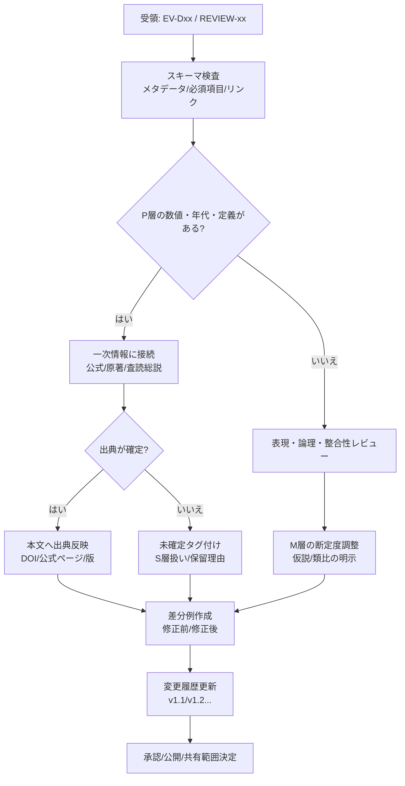

# レビュー報告書：受領Markdownファイル精査・改訂提案（2026-02-28 JST）

## エグゼクティブサマリー

本レビューでは、受領したMarkdown 2ファイルについて、**内容要約・論理性/一貫性・正確性（要ファクトチェック箇所の抽出）・日本語品質・リスク（セキュリティ/プライバシー/法務）・具体的修正案（差分例）**を、機密性高め前提で精査した。

結論として、**evidence-D05-earth-science.md**は「論拠DB」としての型（メタデータ、10エントリの統一スキーマ、[P]/[M]層分離、時間/空間スケール明示）が概ね良好で、P層の主張も大枠で妥当だが、**少なくとも3点は“断定のまま残すと誤解/誤記になり得る”ため最優先で修正推奨**である。具体的には、(1) 白亜紀磁場静穏期（CNS）の年代レンジ、(2) P–T境界の絶滅率（90%断定）、(3) VEI8頻度（10^5年に1回断定）の3点で、いずれも文献差や推定幅があり、**「幅を含む表現＋一次情報（査読論文/公的機関）への参照追記」**が望ましい。CNSは一般に「約120–83Ma」などと整理される例があり、現行の「約84–125Ma」はレンジの取り方が逆転/ズレて見えるため、修正と出典付与を推奨する。citeturn1search2turn1search6

一方、**REVIEW-GPT-D03-20260228.md**は「レビュー結果サマリ」であるが、**箇所の省略（“...”）と“原文省略”が含まれ、監査可能性（どの原文に対して何を根拠に判断したか）が不足**している。ファイル自体はメモとして有用だが、実務レビュー報告書としては、(a) 省略部分の復元、(b) 参照元（EV-D03-chemistry.md）とのリンク（章/行番号/該当抜粋）、(c) 判断基準と保留理由の文章化、がP0（最優先）になる。

リスク面では、両ファイルとも個人情報を含む様子は小さいが、**内部プロセス名（Step/Phase、承認待ち等）や知識統合経路の記載は、外部共有時に組織情報（ワークフロー/体制）を漏らす可能性**があるため、配布範囲に応じてマスキング/公開版生成を推奨する。

## 受領ファイルの一覧化

受領ファイルは2点。ファイル形式・専門分野・納期は未指定のため、**対象ドメインはファイル内容から推定**し、**機密性は高い前提**で扱った。

| ファイル名 | 種類 | ページ数/長さ | メタデータ/作成日 | 想定目的（推定） | 現状ステータス（本文より） |
|---|---|---:|---|---|---|
| evidence-D05-earth-science.md | Markdown | 491行 / 23,013文字 | last_updated: 2026-02-28 | 地球科学（D05）の論拠DB整備（[P]/[M]で事実と類比を分離） | 「GPTレビュー待ち」 |
| REVIEW-GPT-D03-20260228.md | Markdown | 37行 / 867文字 | 作成日: 2026-02-28 | 化学（D03）論拠ファイルのレビュー結果サマリ | “Phase 4突き合わせ結果”だが原文省略あり |

レビュー基準（全体）としては、(1) 記載の確度（P層は一次情報へ接続できるか）、(2) 類比（M層）がP層を踏み越えて断定していないか、(3) 用語とスコープの一貫性、(4) 監査可能性（引用・行番号・版管理）、(5) 情報リスク（配布前提に対する過剰情報の混入）を重視した。

## 各ファイルの要約と評価：evidence-D05-earth-science.md

### ファイル名・種類・ページ数/長さ

- **ファイル名**：evidence-D05-earth-science.md  
- **種類**：Markdown（YAMLフロントマターあり）  
- **長さ**：491行、23,013文字（文字数は実測）  
- **ページ数**：未指定（Markdownのため固定ページ概念なし）

冒頭メタデータでは、D05領域の論拠DBであり、10エントリを「DR-D05 3件＋新規7件」を統合した旨と、現状が「GPTレビュー待ち」であることが明記されている（L001–L008相当）。  

### 主要目的と要約

主要目的は、**「創造5段階（場→波→縁→渦→束）」と地球科学的プロセスの構造類似を、P層（確立知）とM層（類比）に分けて蓄積**することにある。方法論的原則として、「渦」の読み方が領域ごとに異なる点を尊重し、無理な統一を避ける方針が示されている（L019相当）。

構成は、EV-D05-001〜010の10エントリが統一フォーマットで並び、各エントリに **flags / layer / triage / claims / 5段階対応 / 縁フラグ / mechanism_type / scale / refs / cross_ref / 4面記述 / CHK** が揃っている（構造品質は高い）。

エントリ一覧（概要）は下表の通り（本ファイル内記述から抽出）。

| エントリ | トピック | triage | 縁フラグ | 時間/空間スケール（要旨） |
|---|---|---|---|---|
| EV-D05-001 | プレートテクトニクス（ウィルソンサイクル） | Accept | 🔴 | 10^7–10^9年 / 10^3–10^4km |
| EV-D05-002 | ENSO（大気海洋結合振動） | Accept | 🔴 | 2–10年 / 10^3–10^4km |
| EV-D05-003 | 軌道要素変動（氷期のペースメーカー） | Accept | 🟡 | 10^4–10^5年 / 全球 |
| EV-D05-004 | 地震発生（臨界応力・弾性反跳） | Accept | 🔴 | 蓄積10^1–10^3年 / 破壊秒〜分 |
| EV-D05-005 | 火山噴火ダイナミクス | Accept | 🔴 | 蓄積10^2–10^5年 / 噴火日〜 |
| EV-D05-006 | シーケンス層序学 | Accept | 🟡 | 10^4–10^7年 / 堆積盆 |
| EV-D05-007 | 大量絶滅と回復 | Accept | 🔴 | 絶滅10^3–10^5年 / 回復10^6–10^7年 |
| EV-D05-008 | 風化・土壌形成 | 条件付き採用 | 🟡 | 10^2–10^6年 / μm〜流域 |
| EV-D05-009 | 地球磁場ダイナモと逆転 | Accept | 🔴 | 遷移10^3–10^4年 / 安定10^5–10^7年 |
| EV-D05-010 | 惑星分化（コア-マントル-地殻） | Accept | 🔴 | 10^7–10^8年 / 惑星規模 |

### 正確性・一貫性・論理性の評価

**一貫性（構造）**：全エントリのスキーマ統一ができており、読者が比較読解しやすい。layerの[P][M]分離が明示され、P層とM層を混同しにくい設計である。

**論理性（P→Mの橋渡し）**：P層の記述（例：ENSOの判定基準や、シーケンス層序の定義など）は、概念としては学術的に一般的で、一次情報へ接続しやすい。一方で、M層が概念の類比である以上、**M層の結論（“最も自然” “最大スケール” 等）の断定が強い箇所は、読者に「科学的に実証済みの主張」と誤認される余地**がある。ここは「類比として」の限定句や、M層を仮説[S]扱いに寄せる運用ルールがあると、誤読耐性が上がる。

**正確性（要注意）**：全体として大枠は妥当だが、以下は「表現の断定度」または「年代値」等で修正優先度が高い。
- ENSO判定基準は、entity["organization","気象庁","tokyo, japan"]のFAQ等に合致する記述であり、内容は概ね正しいが、**“基準値（30年平均）”や海域座標**などが省略されているため、一次情報への接続を明示する追記が望ましい。citeturn1search8turn1search9
- 白亜紀の磁場静穏期（CNS）の年代レンジは、レビュー論文等で「120–83Ma」などと説明される例があり、現行の「約84–125Ma」は一般的なレンジの提示と齟齬が生じやすい。citeturn1search2turn1search6
- P–T境界の“海洋種約90%絶滅”は歴史的に広く引用される一方、推定の幅や新しい整理もあり、近年のレビューでは推定値の幅（81–96%など）や、81%程度とする推定も示される。断定のまま置くと誤解や反論ポイントになる。citeturn16search5turn16search4
- VEI8頻度（10^5年に1回程度）は推定としては理解できるが、VEI8自体が観測史で実地観測されておらず、頻度推定は不確実性が大きい。**定義（噴出物量>1,000km^3等）と“頻度は推定”の但し書き**が必要。citeturn5search5turn5search0
- プレート運動の駆動力の表現は「マントル対流」単独に読めるため、専門的にはスラブプル等の寄与を併記して**“複合要因”**にする方が誤解が少ない（同ファイル内でもリッジプッシュ/スラブプルを挙げており整合しやすい）。citeturn0search1turn3search10

### 事実確認が必要な箇所（出典・根拠の提示要求）

以下は、**本文P層の中でも“数字・年代・頻度・定義”に関わり、誤記/誤解時の影響が大きい**ため、一次情報の明示（DOI、公式ページ、版）を要求すべき箇所（優先度高→低）。

| 対象（エントリ/行） | 原文（要旨） | リスク | 一次情報の推奨 | 確認メモ（外部一次情報） |
|---|---|---|---|---|
| EV-D05-009（L346相当） | CNS年代（約84–125Ma） | 年代誤記・順序誤解 | レビュー論文/年代尺度 | CNSを120–83Maとする整理例がある citeturn1search2turn1search6 |
| EV-D05-007（L265相当） | P–T境界で海洋種約90% | 絶滅率は推定幅あり | レビュー/統計整理 | 81%推定や81–96%幅の整理がある citeturn16search5turn16search4 |
| EV-D05-005（L189相当） | VEI8頻度10^5年に1回 | 頻度推定の不確実性 | 公的機関＋学術 | VEI8定義（>1000km^3）と、頻度“推定”表現が望ましい citeturn5search5turn5search0 |
| EV-D05-002（L068相当） | ENSO判定基準（±0.5℃等） | 定義は版が重要 | 公式FAQ/監視速報 | 5か月移動平均・6か月継続・±0.5℃・基準値30年平均の記載 citeturn1search8turn1search9 |
| EV-D05-001（L029相当） | “十数枚”・駆動力表現 | 教育表現の揺れ | 公的解説＋論文 | “dozen or more large/small plates”などの公的記述 citeturn15search10turn15search13 |

### スタイル・表現・日本語品質チェック

- **長文1行が長い**：Markdownとして閲覧性が落ちる箇所があり、特に「縁フラグ」説明が1行に詰まる傾向がある。段落化（改行）で可読性が上がる。
- **英語略語の初出定義**：SST、VEI、δ¹⁸O、CNSなど、専門略語が多い。初出で（日本語名＋略語）を明記し、読者層のブレに耐えるようにするのが望ましい（例：SST=海面水温）。citeturn5search5turn10search4
- **P層とM層の“断定度”**：M層で「最も自然」「最大」などの表現が出る場合、P層の確度と同列に読める恐れがあるため、M層では「〜と解釈できる」「類比として」などのモダリティを推奨。

### セキュリティ・プライバシー・法的リスク

- **プライバシー**：個人情報（氏名・住所・連絡先等）は見当たらず低リスク。
- **セキュリティ**：内部ワークフロー（Step 7 Phase 2、承認待ち等）・統合経路（“Claude知識”）が記載されているため、外部共有時には**内部体制/プロセス情報の露出**になり得る。公開版ではプロセス名を一般化し「内部統合済み」程度へ丸める運用が望ましい。
- **法的（著作権/引用）**：一次論文名が列挙される形は問題になりにくいが、今後「原文抜粋」を増やす場合は、引用要件（必要最小限・出典明示・主従関係）を満たすよう、抜粋長と目的の管理が必要。

### 改善点と具体的修正案（優先度付き）

- **P0（最優先：誤記/誤解リスクの低減）**
  - CNS年代レンジを一般的整理に合わせて修正し、文献差を注記する。citeturn1search2turn1search6
  - P–T境界の絶滅率を「推定幅あり」表現へ変更し、レビュー/統計整理への参照を追加する。citeturn16search5turn16search4
  - VEI8頻度の断定を弱め、「推定」「不確実性」を明記し、VEI8定義の一次情報に接続する。citeturn5search5turn5search0
- **P1（高：監査可能性と再利用性の向上）**
  - 各P層の主要主張に、**DOI/公式ページ/書誌情報**（最低限：著者・年・媒体）を追記し、ファクトチェックを再現可能にする。
  - cross_refの命名規則（D05-001 vs EV-D05-001）を統一し、リンク解決可能性を上げる（例：参照先ファイル名orIDを持たせる）。
  - mechanism_type（T1〜T7）と縁フラグ（🔴/🟡等）の**凡例を冒頭に集約**し、読者が途中参照せず理解できるようにする。
- **P2（中：読みやすさ/運用性）**
  - 長文行の段落化、略語の初出定義、単位表記（kyr/万年、Ma/百万年前等）の統一。
  - “条件付き採用”の条件を、本文内に明文化（EV-D05-008のCA理由を短文で定常化）。

### 変更履歴提案とレビュー実施メモ

**変更履歴提案（例）**
- v1.0（現状）：2026-02-28 統合版（GPTレビュー待ち）
- v1.1：P0修正（CNS年代、P–T絶滅率、VEI頻度、ENSO定義の一次情報リンク追記）
- v1.2：P1整備（cross_ref命名統一、凡例集約、主要P層のDOI/公式リンク整備）
- v1.3：P2整形（段落化、略語定義、単位表記統一）

**レビュー実施メモ**
- 形式：Markdown構造・スキーマ整合性・記述の断定度（P/M層）を点検。
- ファクトチェック：数字・年代・定義に関わる箇所を中心に、公的機関/査読論文でクロスチェック。
- 限界：cross_ref先（D02/D03/D06等）の参照ファイルが未提供のため、相互参照の正否（参照先の内容整合）は未検証。

## 各ファイルの要約と評価：REVIEW-GPT-D03-20260228.md

### ファイル名・種類・ページ数/長さ

- **ファイル名**：REVIEW-GPT-D03-20260228.md  
- **種類**：Markdown（フロントマターなし）  
- **長さ**：37行、867文字  
- **ページ数**：未指定（Markdown）

### 主要目的と要約

本ファイルは、**「EV-D03-chemistry.md（化学領域の論拠ファイル）」に対するレビュー結果を、Phase 4の突き合わせとして要点列挙したサマリ**である。冒頭で「5観点（P層正確性／牽強付会チェック／見落とし／L-1〜L-5品質／信頼度スコア妥当性）」に基づくレビューであると宣言している（L05相当）。

内容は「一致点（全採用 A〜L）」と「議論点（M〜P）」に分かれ、採用/保留/次領域判断といった意思決定が記録されている（L10–L30相当）。一方で、A〜Lの中間が「...」で省略され、さらに末尾で「（原文省略 — コンテキストウィンドウ内に全文保持済み）」とされており（L37相当）、**このファイル単体ではレビューの根拠（原文抜粋・該当箇所）に到達できない**。

### 正確性・一貫性・論理性の評価

**一貫性（形式）**：意思決定ログとしては簡潔だが、実務レビュー報告書として一般に求められる「対象資料の引用」「判断根拠」「変更前後の差分」「保留理由」が不足している。結果、第三者に引き継ぐときに、判断が再現できない。

**正確性（記載されている範囲）**：本文は多くが「レビュー指示（緩和/修正/前提明示）」であり、原文がないため“誤り”は断定できない。ただし、歴史/理論に触れる一部項目は、外部一次情報と整合する可能性が高い。
- 化学振動反応の史実（1951発見、1959公表、1968国際周知）という整理は、専門解説や学術記事でも言及される（例：学術誌の記事）。citeturn13search7turn13search3
- 水素酸化の爆発限界に関する「第三爆発限界＝熱爆発」断定の不適切さは、第三爆発限界が化学反応と拡散等の競合として扱われ、熱爆発限界と区別される議論がある点から、修正方針自体は合理的。citeturn13search2turn13search6
- Flory–Stockmayer理論の前提（ランダム架橋、環化無視など）を明示する方針は、理論の限界として一般に議論されるため、妥当性が高い。citeturn13search5turn13search9

ただし、これは“方針が妥当そう”という評価に留まり、**当該ファイルの原文（EV-D03-chemistry.md）に何が書かれていたか**が無いため、現行サマリの正確性を監査的に保証できない。

### 事実確認が必要な箇所（出典・根拠の提示要求）

本ファイルを実務成果物とするなら、少なくとも次を“根拠付き”にする必要がある。

| 対象（行） | 記載内容（要旨） | 要求すべき根拠（一次情報） | コメント |
|---|---|---|---|
| L14 | 史実修正（1951/1959/1968） | 学術解説/総説/一次文献 | 史実は確認可能だが、原文のどこをどう直したか不明 citeturn13search7turn13search3 |
| L15 | 第2/第3爆発限界の修正 | 査読論文（爆発限界の化学） | “熱爆発”との区別を明記すべき citeturn13search2turn13search6 |
| L16 | Flory–Stockmayer前提明示 | 理論の整理（総説/原典/解説） | “どの前提を追加したか”を箇条書きで残す citeturn13search5turn13search9 |
| L28 | “commitment step保留” | 定義・採用基準 | 何をもって保留か（不足データ/一致しない等）理由が必要 |

### スタイル・表現・日本語品質チェック

- **省略記法が多く、監査不能**： “...” と “原文省略” が、実務レビュー報告としては致命的。レビューの価値は「第三者が追試できる」ことにあるため、少なくとも“対象箇所引用＋変更理由”が必要。
- **ラベル（A〜L、M〜P、L-4洞察3等）の定義欠落**：内部関係者以外には意味が通らない。凡例が必要。
- **ファイル単体で閉じていない**：参照先（EV-D03-chemistry.md）を添付・リンク・ハッシュ等で結び、版管理することが望ましい。

### セキュリティ・プライバシー・法的リスク

- **プライバシー**：個人情報は見当たらず低い。
- **セキュリティ**：内部のレビュー運用（Phase 4等）が外部に露出する恐れはある。公開版では表現を抽象化すること。
- **法的**：現状は引用がほぼ無いのでリスクは小さいが、逆に「根拠のない断定」と見られるリスク（信用リスク）が大きい。

### 改善点と具体的修正案（優先度付き）

- **P0（最優先：監査可能性の確立）**
  - “...” を廃し、A〜Lを省略なく記載（最低でも箇条書き全文）。
  - “原文省略”を廃し、EV-D03-chemistry.mdの**該当章/行番号＋短い抜粋**を付す（各指摘につき1〜3行で十分）。
  - 「保留（将来検討）」は理由を明文化（例：定義不明、データ不足、仮説とP層が混線等）。
- **P1（高：版管理・メタデータ）**
  - YAMLフロントマター追加（review_id、対象ファイルの版、レビュー日、レビュー者、スコープ）。
  - “信頼度スコア”の計算/判定基準を1段落で定義し、レビュー間比較可能にする。
- **P2（中：運用統合）**
  - D05論拠DBと用語を揃える（triage、layer、縁フラグ等）。領域間でレビュー運用を横断しやすくなる。

### 変更履歴提案とレビュー実施メモ

**変更履歴提案（例）**
- v0.1（現状）：2026-02-28 サマリのみ（省略あり）
- v0.2：A〜L完全記載＋EV-D03該当箇所引用（行番号/抜粋）
- v0.3：保留理由・採用基準・信頼度スコア定義を追記
- v1.0：レビュー報告書版として確定（監査可能）

**レビュー実施メモ**
- 本ファイルは「レビュー結果の抜粋」であり、対象原文（EV-D03-chemistry.md）が未提供のため、レビュー判断の妥当性を第三者検証できない点を主要リスクとして記録。

## ファイル間の矛盾点や重複の比較

両ファイルはドメインが異なる（D05地球科学 vs D03化学レビュー）ため、内容の直接矛盾は限定的だが、**運用・形式面での不整合**が確認できる。

| 観点 | evidence-D05-earth-science.md | REVIEW-GPT-D03-20260228.md | 矛盾/重複の評価 | 統一提案 |
|---|---|---|---|---|
| メタデータ | YAMLあり（file_id、entry_count、status等） | YAMLなし | **形式不一致**（監査性に差） | D03レビューにもYAML導入 |
| ステータス | 「GPTレビュー待ち」 | 「ChatGPTレビュー出力」「Phase 4突き合わせ」 | **運用段階の表記が非対称** | ステータス語彙（draft/review/approved等）統一 |
| 層の概念 | [P]/[M]を凡例で定義 | “P層”を言及するが定義は引用内 | **重複概念だが説明密度が不一致** | 共通「層定義テンプレ」を冒頭に置く |
| 監査可能性 | エントリごとに体系化 | “...”と“原文省略”で追跡不能 | **D03側の監査不能が突出** | すべての指摘に「対象箇所引用＋理由＋差分」 |
| cross_ref | D03領域（BZ反応等）参照あり | D05への参照なし | 矛盾ではないが**リンクが片方向** | cross_refをファイル間で解決可能に（ID/ファイル名） |
| 省略記法 | 基本なし | 省略が多い | **品質差** | 省略ルール（許容/禁止）を決める |

## 修正案と差分例、図表、最終結論

### 差分例（修正前／修正後）

重要度の高い箇所を中心に、差分例（抜粋）を示す。ここでの「修正前」は受領ファイルの該当箇所要旨であり、最終的には実ファイル上で行番号・更新履歴と結び付けて確定させる。

| 対象 | 修正前（要旨） | 修正後（案） | 目的 |
|---|---|---|---|
| D05-009（地球磁場） | 「CNS, 約84–125Ma」 | 「CNS（白亜紀磁場静穏期）は、概ね約120–83Ma（年代は資料により差があるため要注記）」citeturn1search2turn1search6 | 年代誤解/反論点を除去 |
| D05-007（P–T絶滅） | 「海洋種の約90%が絶滅」 | 「推定幅があり、海洋生物の損失は**約80–90%（研究により81–96%など）**と幅をもって記述」citeturn16search5turn16search4 | 推定幅の明示で信頼性向上 |
| D05-005（VEI8頻度） | 「VEI8は10^5年に1回程度」 | 「VEI8（噴出物量>1,000km^3等）は極めて稀で、頻度は推定で数万〜10万年規模とされるが不確実性が大きい（“推定”を明記）」citeturn5search5turn5search0 | 断定回避＋定義の一次情報接続 |
| D05-002（ENSO定義） | 「NINO.3の5か月移動平均が6か月以上±0.5℃」 | 「同庁の定義として、(1) NINO.3海域、(2) 基準値は前年まで30年平均、(3) 5か月移動平均が6か月以上±0.5℃、を脚注で明記」citeturn1search8turn1search9 | 定義の“版”と検証容易性の確保 |
| D03レビュー（監査性） | “...”や“原文省略” | “...”廃止。各項目に「対象（EV-D03の章/行）」「抜粋」「修正理由」「修正後文」を1セットで記録 | レビューを再現可能に |

### 推奨フローチャート（mermaid）

以下は、論拠DB（EV-Dxx）とレビュー（REVIEW-xxx）を**監査可能**に運用するための最小プロセス案（テンプレ）。D05の形式の強みを、D03レビューにも移植する意図。

### 最終結論と推奨事項

- **evidence-D05-earth-science.md**は、構造設計（層分離・スケール・機構タグ等）が成熟しており、論拠DBとして有用性が高い。次の段階は、P層の“数値・年代・頻度・定義”に関して、一次情報への接続（DOI/公式ページ）を整備し、断定度を推定幅に合わせて調整すること。特にCNS年代、P–T絶滅率、VEI8頻度は、修正効果が大きい（P0）。
- **REVIEW-GPT-D03-20260228.md**は、現状では「意思決定メモ」に留まり、実務レビュー報告書としては監査性が不足している。省略の廃止、対象原文（EV-D03-chemistry.md）との突合（章/行＋抜粋）、保留理由の文章化を行えば、領域横断レビューの標準テンプレとして価値が上がる（P0）。
- **ファイル間統一**としては、(1) YAMLメタデータ、(2) ステータス語彙、(3) 層/スコア/凡例テンプレ、(4) cross_refの解決可能性、を揃えると、今後の“比較レビュー（矛盾検出・重複排除）”が自動化しやすくなる。

付記（追加で必要な情報・短く）：未指定事項が多いため、精度を上げるには **(a) EV-D03-chemistry.md 本体のアップロード、(b) このレビューの目的（品質チェック/学術査読/法務/技術等）、(c) 納期、(d) 共有範囲（社内限定/外部公開）と機密区分** の提示が必要。