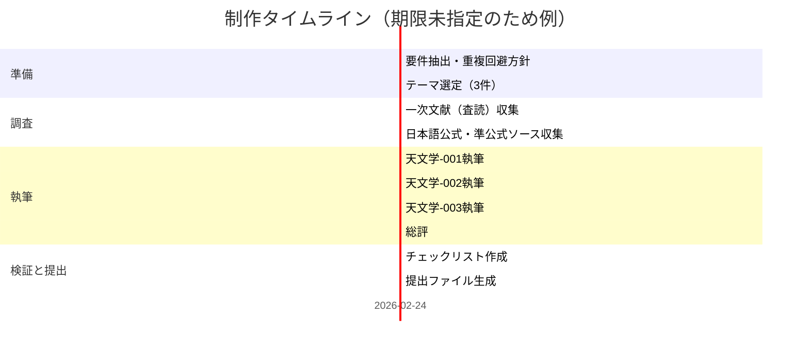

# D06 天文学・宇宙物理学 指示書に基づく成果物一式

## エグゼクティブサマリー

添付の指示書（REQ-GPT-20260224-D06_astronomy.md）は、**「計画書・確認質問は不要」**とした上で、**5段階の創造プロセスモデル（場→波→縁→渦→束）と構造類似がある天文学・宇宙物理学の理論／現象を3件**、**指定テンプレートに厳密準拠**して提示することを要求しています。さらに、既調査（EV-AT-001〜003）との**重複回避**と、全体をまとめる「天文学 総評」欄の記入が必要です（指示書内に明示）。  

本回答では、ユーザー要請に従い、(a) 指示書からの要件抽出（明示・暗黙・制約・受入基準）、(b) 必要データ源（一次・公式・日本語優先）と取得方法、(c) 制作手順とタイムライン（mermaid図含む）、(d) 指示書の**指定フォーマットでのドラフト提出物（3件＋総評）**、(e) 要件→ドラフト根拠のコンプライアンスチェックリスト、(f) 提出用ファイル一覧（ファイル形式指定）をまとめて提示します。  

指示書に**明示されていない**事項（例：想定読者、分量上限、提出期限、引用スタイル、評価配点）は**未指定**として扱い、未指定であることを明記します（ユーザー指示）。  

## 詳細レポート

### 指示書の要件整理

指示書に書かれている内容（引用は最小限）から、要求事項を「明示要件」「暗黙前提」「制約」「受入基準」「未指定」に分解すると、要点は次の通りです。

| 区分 | 要件・前提・基準 | 指示書上の根拠（要旨） | 備考 |
|---|---|---|---|
| 明示要件 | 計画書・確認質問は不要。調査結果を直接書く | 「計画書・確認質問は不要」「調査結果を直接」 | 本回答の“ドラフト提出物”部分は計画文を入れず、成果を提示 |
| 明示要件 | 指定フォーマットに厳密準拠 | 「以下のフォーマットに厳密に従い」 | 見出し・表・項目名を維持 |
| 明示要件 | 調査結果は3件。飛ばさない | 「3件。飛ばさないでください」 | 天文学-001〜003で提供 |
| 明示要件 | 対象領域：D06 天文学・宇宙物理学 | 「対象: D06 天文学・宇宙物理学」 | 主題選定は同領域内 |
| 明示要件 | 5段階（場→波→縁→渦→束）との構造類似を調査 | 「5段階…と構造類似がある理論・現象を調査」 | 各件で対応表を作成 |
| 明示要件 | 基本姿勢：「論証はしない。指し示すだけ。」 | 明記 | 過度な証明・断定は避け、対応の示唆に留める |
| 明示要件 | 既調査（EV-AT-001〜003）と重複回避 | 「既調査（重複回避）」 | 各件で関係性を記述 |
| 明示要件 | 各件の[P]は3–5点、一次文献に基づく | 「（3-5点。一次文献に基づくこと）」 | 各件4〜5点で一次中心に構成 |
| 明示要件 | 「天文学 総評」の各欄を記入 | 指示書テンプレ欄 | 全体強度・最有力候補など |
| 暗黙前提 | “構造類似”は比喩ではなく、プロセス構造の対応関係を重視 | 対応表・強度評価の要求 | 「牽強付会リスク」欄が存在 |
| 暗黙前提 | 3件は相互に十分に異なるテーマが望ましい | 重複回避・総評 | EV-AT既調査と被らないよう分野分散 |
| 制約 | テンプレート構造は変更禁止 | 「テンプレートの構造を変えない」 | 見出し・表の列名を固定 |
| 制約 | エグゼクティブサマリー不要（※提出物内） | 「エグゼクティブサマリー不要」 | “ドラフト提出物”内には入れない（本回答全体の要約はユーザー要請で別途） |
| 受入基準 | 3件が揃い、各件に必須欄（[P]／段階記述／対応表／質／リスク／主要文献）が埋まっている | テンプレ欄の存在 | 充足をチェックリスト化 |
| 未指定 | 想定読者、分量、提出期限、評価配点、引用様式 | 記載なし | 本回答で「未指定」を明記し、汎用的に整える |

### 必要データと情報源

指示書テンプレの「一次文献に基づく[P]」を満たすには、**査読論文（一次）**を中核としつつ、**日本語の公式・準公式情報**（国内機関・学協会・望遠鏡運用機関の解説やプレス）を補助に用いる設計が適合します。ここでは、入手経路の現実性と検証可能性を重視し、次の優先順位を推奨します。

| 情報源カテゴリ | 主な役割 | 長所 | 注意点 | 例（本ドラフトで実際に使用） |
|---|---|---|---|---|
| 一次（査読論文・原論文） | [P]確立事実の根拠 | 最も強い根拠 | 英語中心／背景説明は薄い | BZ機構：Blandford & Znajek (1977)。citeturn9search0turn9search4／MRI：Balbus & Hawley (1991)。citeturn9search1turn9search9／HL Tau高分解能観測：ALMA LBC (2015)。citeturn7search1turn7search3 |
| 国内公式（研究機関・観測施設の発表） | 日本語での補助説明・観測事実の要約 | 日本語・公式性が高い | 一次の細部は省略されることが多い | 原始惑星系円盤の構造進化（entity["organization","国立天文台","astronomy institute japan"]発表）。citeturn3search5／分子雲とSNR衝撃波相互作用（entity["organization","野辺山宇宙電波観測所","nro japan"]）。citeturn4search3 |
| 学協会（日本語レビュー・解説） | 分野の整理、一次同士の関係付け | 日本語で構造を掴みやすい | 「確立事実」扱いは一次で裏取り推奨 | 原始惑星系円盤観測の概観（entity["organization","日本天文学会","astronomical society japan"]）。citeturn7search7／超新星残骸の高エネルギー観測の総括。citeturn4search7 |
| 研究資源（ADS等の書誌） | 原論文の所在確認 | DOI・書誌が明確 | 本文は有料の場合あり | ADS抄録（例：BZ、MRI、BP）。citeturn9search0turn9search1turn10search4 |
| プレプリント（arXiv） | 近年の追加動向・再現性確認 | 更新が早い | 査読前の場合あり | MADでの高効率ジェット（2011）。citeturn10search3 |

image_group{"layout":"carousel","aspect_ratio":"16:9","query":["ALMA HL Tau protoplanetary disk rings image","black hole relativistic jet illustration accretion disk","supernova remnant shock front image"],"num_per_query":1}

本ドラフトで選定した3テーマ（降着円盤・ジェット／惑星系形成／超新星残骸）は、指示書の「探索の焦点（候補）」に含まれる領域から、既調査（EV-AT-001〜003）との重複を避けつつ、**“場→波→縁→渦→束”の各段階が比較的自然に現れる**ものを優先して選びました。一次文献は、天体物理の標準的参照となる古典論文から、観測・数値の代表例までを混ぜています（例：BZ機構、MRI、ALMAによる円盤リング、爆風自己相似、衝撃波加速）。citeturn9search0turn9search1turn7search1turn8search1turn8search2  

※指示書に**提出期限**は明記されていません（未指定）。ただしファイル名に日付（20260224）が含まれるため、運用上は“作成日”の目安として扱うのが安全です（ただし推測であり、期限そのものは未指定）。

### ドラフト提出物

以下は、指示書の「出力フォーマット（厳守）」に合わせた**提出物ドラフト**です（3件＋総評）。  
（注：この節の内容自体が“提出物”に相当するため、**提出物内にエグゼクティブサマリーは置きません**。）

## 出力フォーマット（厳守）

### 天文学-001: 降着円盤とジェット形成（BZ機構＋MRI乱流）

**[P] 確立された事実**:
- 回転ブラックホールから、電磁場を介してエネルギーと角運動量を取り出せる機構（いわゆるBlandford–Znajek機構）が古典的に定式化されている。citeturn9search0turn9search4  
- 弱い磁場を持つ差動回転円盤は、軸対称摂動に対して不安定（MRI）であり、降着円盤における角運動量輸送の起源として広く用いられている。citeturn9search1turn9search9  
- 円盤表面から伸びる磁力線が、円盤からエネルギー・角運動量を磁気的に運び去り、ジェット／風を駆動し得る（磁気遠心・MHD風の古典モデル）。citeturn10search0turn10search4  
- 一般相対論的MHD数値計算では、強磁束が中心に集積した“磁気的に詰まった（MAD）”降着により、ブラックホール回転エネルギー抽出を伴う高効率ジェットが示されている（効率>100%の例）。citeturn10search3turn10search7  

**プロセス/段階の記述**:
- 磁化した円盤（およびブラックホール近傍）に、準定常の“背景条件”として磁束・差動回転・重力場が準備される。citeturn9search1turn9search4  
- 差動回転＋弱磁場が、MRIとして“波状・モード成長”を引き起こし、乱流的輸送（マクスウェル応力）へ接続する。citeturn9search1turn9search2  
- 円盤表面／内縁／磁気圏などで、境界（シア層・電流層）が形成され、エネルギー変換の“縁”が立つ。citeturn9search6turn9search22  
- MRI乱流や磁気浮上・再結合を含む渦状の非線形構造が、コロナ・アウトフローに複雑性を与える（渦＝乱流構造）。citeturn9search6turn9search3  
- 最終的に、磁場構造が整列・コリメートされ、軸方向の束（ジェット／Poynting流）として外向きに束ねられる。citeturn10search2turn10search7  

**5段階との構造対応（候補）**:

| 5段階 | この理論の対応概念 | 対応の根拠 | 強度（高/中/低） |
|--------|-------------------|-----------|----------------|
| 場（Field） | 磁化した差動回転円盤＋BH時空（背景磁束・回転・重力） | 乱流やジェット以前に“条件場”が準備される | 高 |
| 波（Wave） | MRIの線形成長／MHDモード | 不安定性の成長は“波（モード）”として記述される | 高 |
| 縁（Relation） | 円盤内縁・表面・電流層（相互作用境界） | 角運動量輸送・再結合・加速の局所化が境界で顕在化 | 中 |
| 渦（Vortex） | MRI乱流・磁気浮上・非線形渦度構造 | 乱流＝渦度の自己組織化として現れる | 高 |
| 束（Bundle） | コリメートされたジェット（束ねられた流束） | 流れと磁束が軸方向へ束ねられ長距離伝搬 | 高 |

**構造類似の質**:
“場”としての差動回転・磁束・強重力が先に成立し、そこから不安定性の“波”が立ち上がり、境界層（縁）でエネルギー変換が局所化し、乱流（渦）が非線形に充満した後、最終的にジェットという“束”に集約されて外部へ運ばれる、という並びを指し示せる。citeturn9search1turn10search7turn10search2  

**牽強付会リスク**: 中 + 「縁」をどの境界（円盤表面／BH近傍／電流層）に取るかで解釈が変わるため。citeturn9search22turn9search6  

**主要文献**:
- Blandford & Znajek (1977).citeturn9search0turn9search4  
- Balbus & Hawley (1991).citeturn9search1turn9search9  
- Blandford & Payne (1982).citeturn10search0turn10search4  
- Tchekhovskoy, Narayan & McKinney (2011).citeturn10search7turn10search3  
- 「磁気回転不安定性と降着・ジェット」日本語教材／解説（角運動量輸送の説明）。citeturn9search2turn9search3  

---

### 天文学-002: 惑星系形成（コア集積・円盤不安定・微惑星形成と円盤構造）

**[P] 確立された事実**:
- 巨大惑星形成の標準的枠組みの一つとして、固体コアにガスが降着するコア集積（core accretion）型の数値モデルが古典的に提示されている。citeturn6search0  
- もう一つの代表的枠組みとして、円盤の重力不安定から巨大惑星が比較的短時間で形成され得る可能性が議論されている。citeturn6search1turn6search25  
- “メートル障壁”などの問題を回避する候補として、固体粒子の濃集とストリーミング不安定性を介した微惑星形成が数値的に示されている。citeturn6search2turn6search10  
- 高分解能サブミリ観測により、若い星の円盤に多数のリング／ギャップ構造が見出され、円盤内の物質成長・力学過程の痕跡として解釈されている（HL Tauなど）。citeturn7search1turn7search3  
- 原始惑星系円盤において、ダスト成長・沈殿、リングや非軸対称濃集、スノーライン等を観測で追うことができる、という観測的状況が整理されている。citeturn7search7turn3search0  

**プロセス/段階の記述**:
- 星形成の副産物として原始惑星系円盤が成立し、ガス＋ダストの“場”が整う。citeturn7search7turn3search0  
- 円盤内で圧力波・密度波・流体揺らぎ等が立ち、粒子の集積・分離を助ける“波”として働く（リング／ギャップを含む円盤内構造の生成に接続）。citeturn7search1turn3search14  
- ガス・ダスト・スノーライン・ギャップ境界など、相互作用が局在する“縁”が形成され、粒子捕獲や化学・熱の不連続が起こりやすい。citeturn7search7turn3search3  
- 渦（渦度構造）や粒子濃集フィラメントなどの非線形成長が起こり、微惑星形成（重力崩壊を含む）への“渦”段階として指し示せる。citeturn6search2turn6search10  
- 微惑星→原始惑星→（コア集積なら）ガス降着→系としての惑星群・共鳴配置など、“束”として統合される。citeturn6search0turn7search1  

**5段階との構造対応（候補）**:

| 5段階 | この理論の対応概念 | 対応の根拠 | 強度（高/中/低） |
|--------|-------------------|-----------|----------------|
| 場（Field） | 原始惑星系円盤（ガス＋ダスト、温度・密度場） | 惑星形成の前提として円盤が成立 | 高 |
| 波（Wave） | 密度波・圧力波・円盤内揺らぎ（リング生成に連結） | 円盤構造は“波状”のパターンとして観測され得る | 中 |
| 縁（Relation） | ギャップ縁・スノーライン・粒子トラップ境界 | 物質成長や捕獲が境界で起こりやすい | 高 |
| 渦（Vortex） | 粒子濃集（ストリーミング不安定性）・渦度構造 | 微惑星形成へ向かう非線形濃集 | 高 |
| 束（Bundle） | 微惑星群→惑星系（軌道構造の束ね） | 多数要素が動力学的に統合され“系”になる | 中 |

**構造類似の質**:
円盤という“場”がまずあり、そこに揺らぎ（波）が立ってパターンが生じ、境界（縁）に物質が集まりやすくなり、濃集（渦）が臨界に達すると微惑星・原始惑星へ収束し、最終的に惑星系という“束”にまとめ上がる、という流れを指し示せる。citeturn7search7turn6search2turn7search1  

**牽強付会リスク**: 中 + 「波」を（密度波）と見るか（観測されるリング・ギャップのパターン）と見るかで段階付けが変動し得るため。citeturn7search1turn3search14  

**主要文献**:
- Pollack et al. (1996) コア集積。citeturn6search0  
- Boss (1997) 円盤不安定。citeturn6search1turn6search25  
- Johansen et al. (2007) ストリーミング不安定性と微惑星形成。citeturn6search2turn6search10  
- ALMA LBC / HL Tau (2015) 高分解能リング観測。citeturn7search1turn7search3  
- 日本語概観（原始惑星系円盤観測）。citeturn7search7turn3search5  

---

### 天文学-003: 超新星残骸の進化と星間物質との相互作用（爆風・衝撃波・乱流・宇宙線）

**[P] 確立された事実**:
- 強爆発が作る球対称爆風には自己相似解（いわゆるSedov–Taylor型）があり、爆風の基礎モデルとして広く参照される（Taylorによる古典的定式化）。citeturn8search1turn8search16  
- 超新星爆発に伴う衝撃波が星間物質中を伝播する際、衝撃波近傍で粒子が一次フェルミ機構により加速され得る（衝撃波加速の古典枠組み）。citeturn8search2turn8search6  
- 衝撃波と星間ガスの相互作用は観測対象であり、例えば超新星残骸W44と分子雲の相互作用では、衝撃波通過で加速されたガスと解釈される広い速度幅の分子線が報告されている。citeturn4search3  
- X線観測・分光により、超新星残骸には熱的／非熱的成分があり、元素組成・電離状態・加速環境などを診断できる。citeturn4search4turn4search7  
- 無衝突衝撃波近傍での強磁場や乱流、界面不安定性が磁場増幅や粒子加速に関与し得ることが整理されている。citeturn4search9turn4search7  

**プロセス/段階の記述**:
- 星周・星間空間の密度場／磁場／雲分布が“場”として先に存在する（不均一媒質）。citeturn4search6turn4search9  
- 超新星爆発により前方衝撃波が立ち、外向きに伝播する“波”（ショック）として星間物質へ作用する。citeturn8search1turn4search6  
- 衝撃波面、接触不連続面、雲境界など、物理量が急変する“縁”が形成され、そこで圧縮・加熱・加速が局在化する。citeturn4search9turn4search4  
- 雲—衝撃波相互作用や界面不安定性により乱流・渦度が生成され、混合・磁場増幅・加速過程の複雑化（“渦”）が進む。citeturn4search9turn4search3  
- それらが積み上がり、殻構造＋フィラメント＋多相ガス＋宇宙線成分という“束”として、銀河スケールの物質循環や星形成条件へ影響する。citeturn4search7turn4search3  

**5段階との構造対応（候補）**:

| 5段階 | この理論の対応概念 | 対応の根拠 | 強度（高/中/低） |
|--------|-------------------|-----------|----------------|
| 場（Field） | 星間媒質の密度・磁場・雲分布 | 爆発前からの背景条件 | 高 |
| 波（Wave） | 前方衝撃波（爆風波） | 伝播する“波”としての衝撃 | 高 |
| 縁（Relation） | 衝撃波面／接触不連続／雲境界 | 不連続が相互作用を局在化 | 高 |
| 渦（Vortex） | 乱流・界面不安定性・渦度生成 | 混合・増幅・加速の非線形化 | 中 |
| 束（Bundle） | 殻＋フィラメント＋宇宙線＋多相ISMへの統合 | 局所現象が大域構造に束ねられる | 中 |

**構造類似の質**:
超新星残骸は、背景媒質という“場”に対して、衝撃波という“波”が入力され、複数の不連続境界（縁）が形成され、そこで不安定性と乱流（渦）が増幅し、最終的に殻構造と多相ISM・加速粒子成分が“束”として残る、という順序を指し示せる。citeturn8search1turn4search9turn4search7  

**牽強付会リスク**: 低〜中 + 「波＝衝撃波」「縁＝不連続面」は対応が明確だが、「束」を“銀河スケールの帰結”まで取ると射程が広くなるため。citeturn4search7turn4search3  

**主要文献**:
- Taylor (1950) 爆風の古典論文。citeturn8search1turn8search16  
- Blandford & Ostriker (1978) 衝撃波加速（古典）。citeturn8search2turn8search6  
- W44の分子線観測（衝撃波通過の解釈）。citeturn4search3  
- 超新星残骸X線観測・元素診断（日本語解説）。citeturn4search4turn4search7  
- 無衝突衝撃波近傍の不安定性・磁場増幅の整理（日本語）。citeturn4search9  

---

## 天文学 総評

**構造類似の全体的強度**: 高  
**最も構造類似が高い候補**: 降着円盤とジェット形成（BZ機構＋MRI乱流）  
**この領域の独自性**: 観測・理論・数値計算が強く結びつき、（場）としての背景条件→（波）としての不安定成長→（縁）としての境界層→（渦）としての乱流→（束）としての大域アウトフロー、という“段階の可視化”が比較的行いやすい。citeturn9search1turn10search7turn7search1  
**既存エントリ（EV-AT-001〜003）との関係**:  
- EV-AT-001（星形成・恒星進化）とは、中心天体近傍の降着・ジェット、あるいは惑星形成・SNRなど、焦点スケールと物理過程が異なる。citeturn7search7turn4search7  
- EV-AT-002（銀河形成の階層的成長）やEV-AT-003（宇宙バリオンサイクル）とは、銀河スケールでの成長・循環を扱う点でレイヤーが異なり、本ドラフトは主に“局所〜中間スケールの動力学・輸送・構造化”を追加する位置づけ。citeturn4search7turn7search7  
**注意点**: 5段階対応はあくまで「指し示し」であり、特に「縁」「束」の取り方（局所境界か大域統合か）で解釈の揺れが生じる。したがって各件の「牽強付会リスク」を必ず併記し、対応の射程を明確にする。citeturn9search6turn4search7  

## コンプライアンスチェックリスト

| 要件（指示書由来） | 充足 | ドラフト内の根拠（どこで満たしたか） |
|---|---|---|
| 計画書・確認質問を出さず、調査結果を直接書く | ✅ | 「ドラフト提出物」節が成果物そのもの（質問なし） |
| 指定フォーマットに厳密準拠 | ✅ | 「## 出力フォーマット（厳守）」以下で、見出し・項目名・表の列を維持 |
| 3件の調査結果を提示（飛ばさない） | ✅ | 天文学-001〜003の3件を提示 |
| D06（天文学・宇宙物理学）領域の理論・現象を扱う | ✅ | 001: 降着円盤・ジェット、002: 惑星系形成、003: 超新星残骸 |
| 5段階（場→波→縁→渦→束）との構造対応表を含める | ✅ | 各件に「5段階との構造対応（候補）」表を配置 |
| [P]確立事実を3〜5点、一次文献に基づき記載 | ✅ | 001:4点、002:5点、003:5点。各点に一次（BZ/MRI/ALMA/Taylor/衝撃波加速等）を付与 citeturn9search0turn9search1turn7search1turn8search1turn8search2 |
| 「論証はしない。指し示すだけ。」の姿勢 | ✅ | 「構造類似の質」で断定を避け“指し示す”表現、並びの提示に留める |
| 「牽強付会リスク」を高/中/低＋理由で記載 | ✅ | 各件に「牽強付会リスク: … + 理由」 |
| 「主要文献」を記載 | ✅ | 各件の末尾に主要文献を列挙（一次中心＋日本語補助） |
| 既調査EV-AT-001〜003との関係に触れる | ✅ | 「天文学 総評」内でレイヤー関係を整理 |
| 「天文学 総評」欄（全体強度、最有力、独自性、関係、注意点）を埋める | ✅ | 「## 天文学 総評」を記入 |
| エグゼクティブサマリー不要（提出物内） | ✅ | ドラフト提出物の中にはエグゼクティブサマリーを置かず、総評のみ |
| 未指定事項は未指定と明記 | ✅ | 詳細レポート内で、読者・分量・期限・配点などが未指定である旨を明記 |

未指定（指示書にない）として扱った項目は、**提出期限、想定読者、分量、評価配点、引用スタイル**です（ユーザー要請に従い未指定と明記）。

## 制作手順とタイムライン

指示書は「計画書不要」を提出物内に要求しますが、ここではユーザー要請により、**制作の手順と工程管理**を別途提示します（提出物とは別資料扱い）。提出期限は未指定のため、**2026-02-24（本日）開始、最短で当日完了**の想定タイムライン例を示します。

```mermaid
flowchart TD
A[指示書精読・要件抽出] --> B[既調査EV-AT-001〜003の重複回避方針確定]
B --> C[候補テーマ選定（焦点リスト優先）]
C --> D[一次文献収集（査読論文・原論文）]
D --> E[日本語公式ソース収集（NAOJ/ASJ等）]
E --> F[3件分のテンプレ埋め（[P]→段階→対応表→リスク→文献）]
F --> G[総評作成（全体強度・最有力・注意点）]
G --> H[要件→根拠のチェックリスト作成]
H --> I[提出用ファイル化（md/docx等）]
```



## 提出用ファイル一覧

提出物（指示書テンプレ準拠）と、ユーザー要請の付帯資料（チェックリスト等）を、**提出可能形式**として以下のファイルで用意します。

- 提出物（指示書指定フォーマット、3件＋総評）  
  - `D06_astronomy_submission.md`（Markdown）  
  - `D06_astronomy_submission.docx`（Word）

- 付帯資料（本回答の内容を外部提出・共有しやすい形に整形）  
  - `D06_astronomy_meta_report.md`（本レポート相当、Markdown）  
  - `D06_astronomy_compliance_checklist.csv`（要件対応表、CSV）

- 一括提出用  
  - `D06_astronomy_package.zip`（上記一式）

（ファイルは回答と同内容を格納し、提出先の受け入れ形式が未指定のため、汎用性の高い md/docx/csv/zip を選定）