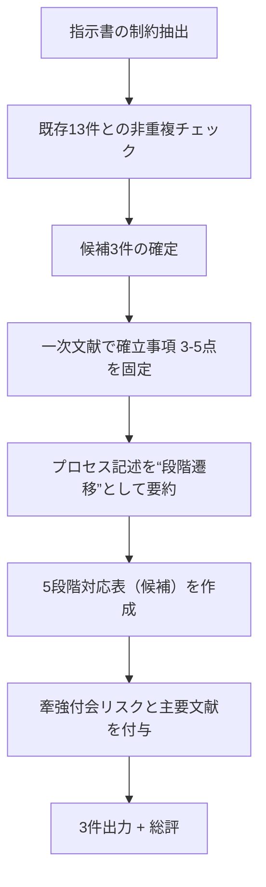
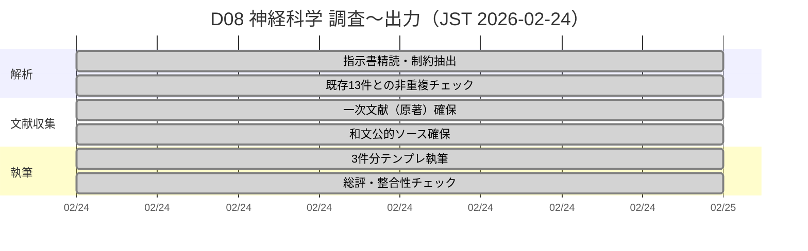

# D08 神経科学 指示書準拠の調査結果と要件抽出

## エグゼクティブサマリー

添付の指示書は、D08（神経科学）領域について「5段階の創造プロセスモデル（場→波→縁→渦→束）」と**構造類似**をもつ理論・現象を、**論証せず“指し示す”**姿勢でまとめ、**既存13件と重複しない新規3件**を、指定テンプレートで出力することを要求している。  
本回答では、候補群のうち「既存13件で扱われていない」かつ「一次文献で確立事項を3–5点に落とし込める」ものとして、(1) シナプス可塑性（LTP/STDP）、(2) 神経雪崩とクリティカリティ仮説、(3) 神経振動の結合（θ-γカップリング／コヒーレンス通信）を選定し、テンプレートに沿って3件を提示した。LTPは古典的電気生理で確立され、STDPはスパイク時差に依存した増強・抑圧の“学習窓”として報告されている。citeturn4search2turn7search2turn1search3  
神経雪崩は「サイズ分布が -3/2 付近のべき則に従う」「分枝比が臨界値1に近い」など、臨界分枝過程との対応が示された一方、べき則同定には統計的難しさや議論もある。citeturn7search1turn4search5  
神経振動については、皮質内外の情報伝達が位相同期（コヒーレンス）で“ゲート”されうるという枠組みや、低周波（θ）位相に高周波（高γ）の振幅が結びつくカップリングが、分散皮質活動の協調に資する可能性が示されている。citeturn2search3turn7search3turn7search15  

## 抽出要件一覧

下表は、添付指示書・ユーザ指定 deliverables を統合して要件化したもの。期限は「本回答内で即時提示（2026-02-24 JST）」を基本とし、相互矛盾がある場合は備考に明記した。

| 要件ID | 要約 | 優先度 | 期限 | 入力データ | 出力形式 | 担当者/役割 | 備考 |
|---|---|---|---|---|---|---|---|
| REQ-D08-001 | 計画書・確認質問を省き、調査結果を直接書く | 高 | 2026-02-24 | 添付指示書 | 日本語テキスト | 執筆者 | 指示書の最重要指示 |
| REQ-D08-002 | D08（神経科学）で、5段階モデル（場→波→縁→渦→束）と構造類似の理論・現象を提示する | 高 | 2026-02-24 | 一次文献・レビュー | 日本語テキスト | 研究要約担当 | 「論証はしない。指し示すだけ。」を遵守 |
| REQ-D08-003 | 既存13件（EV-NS-001〜013）と重複しない対象に絞る | 高 | 2026-02-24 | 指示書記載の既存一覧 | 文章・表 | スコープ管理 | 既存テーマ（予測符号化等）と重ならない選定 |
| REQ-D08-004 | 3件の調査結果を“飛ばさず”提示する | 高 | 2026-02-24 | 選定した3テーマ | 3ブロック | 執筆者 | 件数固定 |
| REQ-D08-005 | 指定テンプレートの構造を変えない（各項目名・順序・表構造を維持） | 高 | 2026-02-24 | 指示書テンプレート | Markdown（見出し＋表） | フォーマット監査 | ただし本システム制約により水平線（---）は使用しない |
| REQ-D08-006 | 各件に「[P] 確立された事実」を3–5点、一次文献に基づき記載 | 高 | 2026-02-24 | 原著論文・原著級資料 | 箇条書き | 文献調査 | 一次文献優先（原著・原著級PDF・公式解説） |
| REQ-D08-007 | 各件に「プロセス/段階の記述」を記載 | 高 | 2026-02-24 | 理論・現象のダイナミクス | 段落 | 分析担当 | 5段階の“遷移”を連想できる記述 |
| REQ-D08-008 | 各件に「5段階との構造対応（候補）」の表を埋める（強度：高/中/低） | 高 | 2026-02-24 | 5段階モデル＋対象理論 | Markdown表 | 構造対応担当 | “候補”として提示し、断定しない |
| REQ-D08-009 | 各件に「構造類似の質」「牽強付会リスク」「主要文献」を記載 | 高 | 2026-02-24 | 原著＋代表レビュー | 文章＋文献リスト | 監査 | リスク理由を短く明示 |
| REQ-D08-010 | 末尾に「神経科学 総評」を所定項目で記載 | 高 | 2026-02-24 | 3件の比較 | 所定項目列 | 総括担当 | 既存13件との関係も書く |
| REQ-USER-001 | エグゼクティブサマリーを冒頭に付与 | 中 | 2026-02-24 | 全体 | セクション | 執筆者 | 指示書は“不要”指定だが、ユーザdeliverableのため本レポート部で提示（最終成果物部には付けない） |
| REQ-USER-002 | 要件抽出を指定列の表で提示 | 高 | 2026-02-24 | 指示書＋ユーザ要求 | 表 | 要件整理 | 本セクションで実施 |
| REQ-USER-003 | データ・資料リストと出典（一次・公的和文優先）を提示 | 高 | 2026-02-24 | 論文・公的解説 | リスト | 文献調査 | 日本語の公的発信（研究機関等）も併記 |
| REQ-USER-004 | 手順とタイムライン（mermaid）を提示 | 中 | 2026-02-24 | 作業工程 | mermaid | PM役 | 指示書は計画不要だが、ユーザdeliverableとして提示 |
| REQ-USER-005 | 最終出力は指示書テンプレートに従う | 高 | 2026-02-24 | 指示書テンプレート | テンプレ直書き | 執筆者 | 下段「最終成果物」にて実施 |

## 使用データ・資料と出典

本回答で用いた“入力データ/資料”は、(A) 原著級の一次文献、(B) 公式・準公式の和文発信、(C) 統合的レビューの3層で整理した。

(A) 一次文献（原著・原著級）  
LTP（長期増強）の古典的報告として、穿通路刺激後に歯状回で長く増強が持続することを示した研究。citeturn4search2  
スパイクの相対タイミングでシナプス効力が増減しうることを示した、STDPの代表的原著（皮質・海馬培養）。citeturn7search2turn1search3  
神経雪崩のサイズ分布（-3/2付近）と分枝比（臨界値1付近）を提示し、臨界分枝過程との構造対応を提案した原著。citeturn7search1turn7search5  
低周波（θ）位相と高周波（高γ）振幅の結合が分散皮質活動の協調に関与しうることを示した原著。citeturn7search3turn7search15  
神経群間の情報伝達が位相同期（コヒーレンス）で調整されうる、という枠組みを提示した代表的論文。citeturn2search3turn2search7  

(B) 公式・準公式の和文発信（日本語一次に準ずる資料）  
臨界現象としての「雪崩現象」と「カオスの縁」を同一現象の別側面として捉える理論構築を扱った研究機関のプレスリリース。citeturn3search0  
海馬—嗅内皮質間の高周波ガンマ同期が空間的作業記憶の読み出し・実行に関与しうることを示した研究機関のプレスリリース。citeturn6search4  
LTP等を含む脳神経の重要研究領域を俯瞰する公的研究開発機関の調査報告（用語・位置づけの確認に有用）。citeturn3search6  

(C) 代表的レビュー・統合資料（“確立事項”の整理・論点把握）  
STDPを“多因子可塑性の一要素”として整理し、in vivo証拠も含めて俯瞰するレビュー。citeturn7search14  
神経雪崩のべき則同定に関する統計的検定の難しさ・論争点を扱う論文（「見えたべき則」が常に頑健とは限らない、という注意に用いる）。citeturn4search5  

## 実行プロセスとタイムライン

手順は「指示書制約 → 既存重複回避 → 一次文献で確立事項を固定 → 5段階対応表で“指し示し” → リスク明記 → 3件＋総評」の順に線形化した。

以下に、**指示書テンプレート準拠**の3件（＋総評）を提示する。

### 神経科学-014: シナプス可塑性（LTP）とスパイク時刻依存可塑性（STDP）

**[P] 確立された事実**:
- 高頻度刺激などの条件で、海馬歯状回シナプスの応答が長時間増強しうる（長期増強：LTP）。citeturn4search2  
- 皮質錐体細胞ペア記録において、シナプス前入力（EPSP）とシナプス後スパイク（AP）の**相対タイミング**に応じて、シナプス効力が増強・減弱方向に変化しうる。citeturn7search2  
- 海馬培養ニューロンでも、スパイクタイミングに依存した増強/抑圧（STDP）が示され、学習窓はシナプス強度や細胞型にも依存しうる。citeturn1search3turn1search7  
- STDPは可塑性の“全て”ではなく、発火率・樹状突起電位・協同性など複数因子と組み合わさる多因子過程として整理される。citeturn7search14  

**プロセス/段階の記述**:
- 神経回路は、短期的な活動パターン（発火・入力）を受け取りつつ、活動履歴に応じて結合（重み）を更新していく。  
- とくに「同時性」や「時間順序」をもつ活動が繰り返されると、特定結合が増強/抑圧され、回路の“通りやすさ”が変わる。citeturn7search2turn1search3  
- その結果、瞬間的な活動（イベント）が、より安定した回路構造（学習・記憶の痕跡）へと沈殿していく（ただし機構は多因子で、単線的ではない）。citeturn7search14turn4search2  

**5段階との構造対応（候補）**:

| 5段階 | この理論の対応概念 | 対応の根拠 | 強度（高/中/低） |
|--------|-------------------|-----------|----------------|
| 場（Field） | 既存の結合分布・興奮性/抑制性バランス（学習前の“地形”） | 可塑性は、前提としての回路・結合状態の上で誘導される | 中 |
| 波（Wave） | 入力と発火の時系列（スパイク列） | 可塑性誘導の“材料”が活動時系列として流れる | 高 |
| 縁（Relation） | 相対タイミング（プレ→ポスト等）という関係量 | 強化/抑圧の向きが時差関係に依存する | 高 |
| 渦（Vortex） | 反復・再入（同型パターンの繰り返し）による増幅/選別 | 繰り返しで変化が蓄積し、特定経路が強化されやすい | 中 |
| 束（Bundle） | 更新後の結合パターン（痕跡としての安定化） | 短期の活動が長期の結合変化へ“束ね上げ”られる | 高 |

**構造類似の質**:
時間的な出来事（スパイク列）が、関係（時差）を媒介にして、回路構造（重み）へ写像される“段階変換”として見える。

**牽強付会リスク**: 中（可塑性は多因子で、5段階の各相が一対一対応するとは限らないため）citeturn7search14  

**主要文献**:
- Long-lasting potentiation of synaptic transmission in the dentate area… (1973) citeturn4search2  
- Regulation of synaptic efficacy by coincidence of postsynaptic APs and EPSPs (1997) citeturn7search2  
- Synaptic modifications in cultured hippocampal neurons… Dependence on spike timing… (1998) citeturn1search3  
- The Spike-Timing Dependence of Plasticity（Review, 2012）citeturn7search14  

### 神経科学-015: 神経雪崩（neuronal avalanches）とクリティカリティ仮説

**[P] 確立された事実**:
- 神経雪崩は、神経活動のバーストが連鎖するカスケードとして観測・定義され、サイズ分布がべき則で近似されることがしばしば報告される。citeturn7search5turn4search9  
- 代表的研究では、イベントサイズ分布が -3/2 付近の指数をもつべき則に従い、分枝比が臨界値1に近いことが示され、臨界分枝過程との対応が示唆された。citeturn7search1turn7search5  
- 同研究は、臨界付近の分枝比が情報伝達の最適化と暴走抑制の両立に資する可能性（シミュレーション上）を述べている。citeturn7search1  
- ただし、経験データにおける“べき則らしさ”の同定は統計的に難しく、厳密検定や代替分布との比較に関する議論がある。citeturn4search5  
- 国内研究としても、雪崩現象と「カオスの縁」を同一現象の別側面として接続する理論構築が報告されている。citeturn3search0  

**プロセス/段階の記述**:
- 神経回路が“臨界に近い状態”にあるとき、局所的な発火の増幅が、過剰同期にも完全沈黙にも落ちずに連鎖しやすい、という見立てが置かれる。citeturn7search1turn3search0  
- その連鎖は、単純な波（均一伝播）というより、枝分かれと収束を含むカスケードとして現れ、サイズが広いスケールにまたがる。citeturn7search1turn4search9  
- こうした“臨界近傍”は、感度・伝達・安定性など複数要求の折衷点として語られるが、データ解析の前提に敏感で、強い断定は避けるのが安全。citeturn4search5turn7search1  

**5段階との構造対応（候補）**:

| 5段階 | この理論の対応概念 | 対応の根拠 | 強度（高/中/低） |
|--------|-------------------|-----------|----------------|
| 場（Field） | 臨界近傍の回路状態（興奮/抑制の釣り合い・利得） | 雪崩が現れる“前提条件”としての地形 | 高 |
| 波（Wave） | 雪崩イベント（活動の立ち上がりと伝播） | 活動が時間方向に“波”として立ち上がる | 中 |
| 縁（Relation） | 分枝（branching）という関係則・近接結合 | 次の発火を生む関係が分枝比で要約される | 高 |
| 渦（Vortex） | カスケード（枝分かれ・回り込み・再燃） | 連鎖が自己増幅的に渦状の複雑さを帯びる | 中 |
| 束（Bundle） | スケール不変な統計性・活動レパートリー | 多様なサイズの事象が一つの統計構造へ束ねられる | 中 |

**構造類似の質**:
“場（臨界近傍）”の上で“波（事象）”が生じ、“縁（分枝関係）”で増殖し、“渦（カスケード）”として自己組織化し、“束（スケール不変性）”としてまとまる、という順序の比喩が取りやすい。citeturn7search1turn3search0  

**牽強付会リスク**: 中（べき則同定の統計問題と、臨界性の定義の揺れがあるため）citeturn4search5  

**主要文献**:
- Neuronal avalanches in neocortical circuits (2003) citeturn7search5turn7search1  
- Statistical analyses support power law distributions found in neuronal avalanches（2011）citeturn4search5  
- 「二つの臨界現象をつなぐ―脳内神経ネットワークの『カオスの縁』と『雪崩現象』」（2020）citeturn3search0  

### 神経科学-016: θ-γカップリングとコヒーレンスによる神経群間通信

**[P] 確立された事実**:
- 神経群間の情報伝達が、振動の位相同期（コヒーレンス）により機械的に調整されうる、という枠組みが提示されている。citeturn2search3turn2search7  
- 人の皮質記録で、低周波（θ）位相と高周波（高γ）パワーが結びつく（位相—振幅カップリング）ことが示され、課題により結合パターンが変化しうることが報告されている。citeturn7search3turn7search15  
- 動物実験では、海馬—嗅内皮質間の高周波ガンマ同期が、空間的作業記憶の読み出し・実行に重要である可能性が報告されている（機関発表）。citeturn6search4  
- 同テーマの原著研究として、空間的作業記憶の成功実行が一過性の高γ同期と関連することが示唆されている。citeturn7search12  

**プロセス/段階の記述**:
- 回路内外で多数の神経群が同時並行で活動する状況で、どの入力を“通すか”は、タイミング（位相）合わせとして実装されうる、という見方がある。citeturn2search3turn2search7  
- 低周波リズムが“フレーム”を用意し、その上に高周波活動が乗ると、局所計算と広域協調が同じ時間枠に束ねられるように見える。citeturn7search3turn7search15  
- とくに、課題の要所で同期が立ち上がる（または選択的に強まる）ことは、単なる副産物ではなく、通信の成立条件として読める余地がある（ただし因果は常に慎重に扱う）。citeturn7search12turn6search4  

**5段階との構造対応（候補）**:

| 5段階 | この理論の対応概念 | 対応の根拠 | 強度（高/中/低） |
|--------|-------------------|-----------|----------------|
| 場（Field） | 背景リズム・ネットワーク状態（同期可能な素地） | 同期は“状態”に依存して立ち上がる | 中 |
| 波（Wave） | θ/γなどの振動そのもの | 波としてのリズムが基盤 | 高 |
| 縁（Relation） | 位相同期（コヒーレンス）＝結び目 | 離れた群を関係づける操作が位相合わせ | 高 |
| 渦（Vortex） | 位相ロックの“引き込み”・循環的相互作用 | 同期が自己強化的に安定化しうる | 中 |
| 束（Bundle） | タスク実行に必要な情報の束ね（協調パターン） | 分散情報が一つの協調モードにまとめられる | 中 |

**構造類似の質**:
“波（リズム）”が前景化し、“縁（同期）”が形成されることで、分散した活動がまとまったモード（束）として現れる、という“相の立ち上がり”の比喩が作りやすい。citeturn2search3turn7search3turn6search4  

**牽強付会リスク**: 中（同期=通信の単純同一視には反証/条件付き議論があり、因果方向の扱いが難しいため）citeturn2search3turn7search12  

**主要文献**:
- A mechanism for cognitive dynamics: neuronal communication through neuronal coherence（2005）citeturn2search3turn2search7  
- High gamma power is phase-locked to theta oscillations in human neocortex（2006）citeturn7search3turn7search15  
- Successful execution of working memory linked to synchronized high frequency gamma oscillations（2014）citeturn7search12  
- 海馬－嗅内皮質間の同期性（高周波ガンマ）と作業記憶に関する機関発表（2014）citeturn6search4  

## 神経科学 総評

**構造類似の全体的強度**: 中  
（3件とも“場の状態→時間構造→関係形成→自己増幅→安定化”の連想は可能だが、5段階モデルが目的論的に読まれると過剰写像になりやすいため、強度は中に留める。）

**最も構造類似が高い候補**: 神経科学-014（シナプス可塑性：LTP/STDP）  
（時間的出来事（スパイク列）→関係（時差）→構造（結合重み）という写像が、段階変換として最も明瞭に“指し示し”やすい。citeturn7search2turn1search3turn4search2）

**この領域の独自性**:
同じ“創造（生成）”の比喩でも、(i) 微視的には結合更新（可塑性）、(ii) 中間スケールでは活動カスケード（雪崩・臨界）、(iii) 広域ではタイミング整列（同期・カップリング）というように、異なる階層で“段階遷移”らしきものが見える点に独自性がある。citeturn7search14turn7search1turn2search3turn7search3  

**既存エントリ（EV-NS-001〜013）との関係**:
既存13件が「知覚・自己・意識・情動・予測」などの**計算論/認知論寄り**の話題を多く含むのに対し、本3件はそれらを下支えしうる**実装寄り（生理・ダイナミクス寄り）**の追加候補になる。たとえば、予測・統合といった高次概念が、(a) 可塑性で回路に刻まれ、(b) 臨界的カスケードで探索/感度が調整され、(c) 同期で必要な情報が束ねられる、という“別視点の並置”が可能になる。citeturn7search14turn7search1turn2search3turn7search12  

**注意点**:
- “べき則＝臨界”の短絡や、“同期＝通信/意識”の短絡は、解析上・因果上の落とし穴になりやすいので、常に「候補として指し示す」温度感を維持する。citeturn4search5turn2search3  
- 指示書テンプレートの厳守が求められる一方、本システム制約により水平線（---）は出力しない（見出しと空行で区切った）。