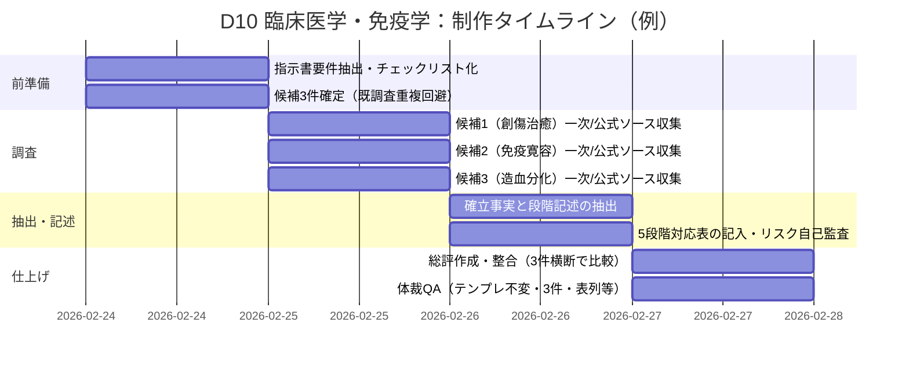

# D10 臨床医学・免疫学における「5段階モデル（場→波→縁→渦→束）」の構造類似調査

## エグゼクティブサマリー

添付指示書は、「D10 臨床医学・免疫学（Clinical Medicine & Immunology）」領域から**5段階モデル（場→波→縁→渦→束）と構造類似のある理論・現象を3件**選び、**指定テンプレートを3回繰り返して記入**し、最後に**総評（最も類似が高い候補など）**を付すことを求めています。さらに**既調査（EV-CM-001〜003）との重複回避**、および「**論証はしない。指し示すだけ。**」という筆致が求められています。  

本回答では、指示書に基づく最終納品物（テンプレ3件＋総評）を後半に提示しつつ、ユーザー依頼（要件抽出、制作計画、チェックリスト、仮定、提出形式提案）も併記します。  
3件の候補は、指示書の「探索の焦点（候補）」から以下を採用しました。

- **創傷治癒プロセス**（止血→炎症→増殖→成熟/再構築）  
  公式用語解説では、止血→炎症→細胞増殖→リモデリングの連続過程として整理されます。citeturn8view0turn16view1  
- **免疫寛容の破綻と回復**（中枢性寛容・末梢性寛容、Treg/FOXP3）  
  胸腺での中枢性寛容と末梢機構（制御性T細胞など）を含む多層的安全装置として概説されます。citeturn21view0turn7view3turn11search0  
- **造血幹細胞の分化階層**（HSC→MPP→CMP/CLP→前駆細胞→成熟細胞、ニッチ）  
  HSCの自己複製・分化と骨髄ニッチ、さらにMPP→CMP/CLP分岐が図示・説明されています。citeturn15view0turn10view1turn10view0turn18view0  

総評としては、**段階的遷移が明示される創傷治癒**が5段階モデルとの対応を最も「指し示し」やすく、構造類似の全体強度は**高**と評価しました（ただし、医学側の相分類は3相/4相など複数流儀があるため、5段階への写像には注意が必要）。citeturn16view1turn8view0  

## 指示書から抽出した要件・納品物・受入基準

指示書本文から読み取れる明示要件と、実務上不可避な暗黙要件を、依頼項目（要件抽出）に合わせて整理します（期限等が記載されない項目は **「未指定」** と明記）。

### 要件一覧

| 区分 | 要件（明示/暗黙） | 内容 | 受入基準（満たしたと判断できる条件） | 期限 |
|---|---|---|---|---|
| 対象領域 | 明示 | D10 臨床医学・免疫学（Clinical Medicine & Immunology） | 臨床医学・免疫学に属する理論/現象を扱っている | 未指定 |
| 目的 | 明示 | 5段階モデル（場→波→縁→渦→束）と「構造類似」がある理論・現象を調査 | 各候補で5段階への対応表が埋まっている | 未指定 |
| 出力件数 | 明示 | **3件**（飛ばさない） | テンプレが3回分、欠落なく存在 | 未指定 |
| 既調査重複回避 | 明示 | EV-CM-001〜003と重複しない題材選定 | 総評で既存エントリとの関係・非重複を明示 | 未指定 |
| フォーマット遵守 | 明示 | テンプレの見出し・テーブル構造を変えない | 見出し階層、表列、必須項目が同構造 | 未指定 |
| 各候補の必須要素 | 明示 | ①確立事実（3–5点）②プロセス/段階記述③5段階対応表④構造類似の質⑤牽強付会リスク⑥主要文献 | 6要素がすべて埋まっている | 未指定 |
| 事実の根拠 | 明示 | 「一次文献に基づくこと」 | 主要文献に一次/原著（少なくとも中核1–2本）を含め、確立事実がそれと整合 | 未指定 |
| 筆致 | 明示 | 「論証はしない。指し示すだけ。」 | 過度な推論で勝敗を付けず、対応関係を簡潔に提示 | 未指定 |
| 不要物 | 明示 | 計画書・確認質問／エグゼクティブサマリー／分析枠組み／文献レビュー形式は不要 | **最終納品物（テンプレ部）**に不要項目を混入しない | 未指定 |
| 言語 | 暗黙 | 指示書が日本語のため、日本語での提出が期待される可能性が高い | 少なくとも本文は日本語で理解可能 | 未指定 |
| 番号体系 | 暗黙 | {連番}の開始番号は未指定 | 既存EV-CM-001〜003と混同しない連番で統一 | 未指定 |
| 受入定義 | 暗黙 | “構造類似”の厳密定義は未提示 | 「構造類似の質」「牽強付会リスク」で自己監査を入れる | 未指定 |

## 必要なデータソース・方法・ツール

### 優先すべき情報源

指示書が「一次文献に基づくこと」を求めるため、（1）一次・原著、（2）公式・準公式（学会ガイドライン・用語集、国立機関）、（3）査読総説の順に優先します。日本語資料を優先し、不可避で英語一次文献を補う方針が合理的です。

- 公式/準公式の日本語情報源  
  - entity["organization","日本血栓止血学会","japan thrombosis hemostasis"] 用語集（創傷治癒、造血幹細胞などの機序概説）citeturn8view0turn15view0  
  - entity["organization","日本皮膚科学会","japan dermatological association"] ガイドライン（創傷治癒の相分類・相ごとの細胞/サイトカインなど）citeturn16view1turn17view1  
  - entity["organization","国立がん研究センター","national cancer center japan"] がん情報サービス（造血幹細胞の自己複製/分化や骨髄環境の説明）citeturn18view0  
  - entity["organization","産業技術総合研究所","aist japan"] 解説記事（末梢性免疫寛容・Treg・FOXP3等の研究史の要点）citeturn7view1  
  - entity["organization","大阪大学免疫学フロンティア研究センター","ifrec osaka university"] 特設解説（FOXP3とTregの位置付け、主要研究の引用）citeturn7view2  

- 学術一次・国際一次（英語が中心だが「一次文献」要件に直結）  
  - 創傷治癒：相分類・遷移（炎症→増殖移行）などのレビュー/一次知見（例：炎症から増殖への移行を扱う総説）citeturn3search34  
  - 免疫寛容：CD25+CD4+制御性T細胞と自己寛容（1995 J Immunol）citeturn11search0、FOXP3/Scurfy/IPEX（2001 Nat Genet）citeturn11search1turn11search2  
  - 造血分化：ヒト造血前駆階層の同定（Cell Stem Cell系）citeturn11search3  

- 日本語テキスト（図表つきで分化階層・ニッチを説明）  
  - 「メディカルスタッフのための白血病診療ハンドブック」該当PDF（HSC→MPP→CMP/CLP、ニッチ構成要素）citeturn10view1turn10view0  

image_group{"layout":"carousel","aspect_ratio":"16:9","query":["創傷治癒 止血 炎症 増殖 再構築 図","制御性T細胞 FOXP3 免疫寛容 図","造血幹細胞 HSC MPP CMP CLP 分化 図"],"num_per_query":1}

### 生成に必要な方法

本タスクは「正しさの証明」ではなく「対応を指し示す」ことが要請されるため、方法は**対応関係の設計と自己監査**が核になります。

- 候補ごとに「確立事実（3–5）」を**一次/公式**から抽出し、曖昧語（例：成熟期、再構築期）を原典側の用語に寄せる。citeturn8view0turn16view1turn10view1  
- 「プロセス/段階」を、医学側の相分類（3相/4相など）を尊重しつつ、5段階モデル側へは**“役割対応”として写像**する（段階数の一致を無理に作らない）。citeturn16view1turn8view0  
- 「牽強付会リスク」を明示し、どこが“飛躍”になり得るかを先に止める。

### 使うべきツール

- 文献探索：学会/国立機関サイト → J-STAGE/CiNii → PubMed（一次確認）  
- 参照管理：Zotero等（引用メモ、版管理、出典の二重確認）  
- 体裁検査：テンプレ項目の欠落・見出し改変がないかを機械的にチェック（差分比較など）

## 制作計画とタイムライン

指示書は「計画書不要」としていますが、これは**提出物（テンプレ3件）に計画を混入しない**趣旨だと解釈し、ここではユーザー依頼（制作計画提示）のために、**提出外の制作計画**を提示します。

### ステップ別手順

1. 指示書の必須項目をチェックリスト化（テンプレ構造、3件、各欄の必須要素）。  
2. 既調査（EV-CM-001〜003）と重複しない候補を3件確定。  
3. 各候補につき、公式/一次を最低2系統（例：学会資料＋一次論文）で確保。  
4. 「確立事実（3–5）」を出典ベースで抜き出し、言い換えを最小化。  
5. 「プロセス/段階」を医学側の相分類で記述→5段階への対応表を“役割対応”として記入。  
6. 牽強付会リスクを自己採点し、危ない写像箇所（例：4相→5段階の分割）を理由付きで明示。  
7. 総評（全体強度・最有力・既存エントリとの関係・注意点）を作成。  
8. 体裁QA：テンプレ構造が変わっていないか、箇条書き数、表の列、3件揃いを最終検査。

### ガント風タイムライン（例）

（上記は「未指定の期限」を前提にした最短例であり、実務ではレビュー者有無に合わせて1〜3日追加が安全です。）

## 最終納品物

### 臨床医学-004: 創傷治癒プロセス（止血→炎症→増殖→成熟/再構築）

**[P] 確立された事実**:
- 創傷治癒は、止血→炎症→細胞増殖→リモデリングが時間経過で進む一連の組織反応として概説される。citeturn8view0turn16view1  
- 止血血栓では、フィブリン形成や血小板由来増殖因子（例：PDGF、TGF-β等）を介して、後続の血管新生・細胞遊走・細胞増殖を促進する“場”が作られる。citeturn8view0turn16view1  
- 炎症期は、好中球やマクロファージなどの浸潤により病原体侵入の抑止・異物除去を担う相として記述される。citeturn16view1turn8view0  
- 細胞増殖期は、血管新生・細胞外マトリックス形成・肉芽形成などが進み、成熟期・再構築期では創収縮や上皮化、マトリックスの成熟が主となる。citeturn16view2turn17view1  
- リモデリングでは、MMP/TIMPによる細胞外マトリックス分解とコラーゲンの架橋等が含まれ、修復構造が“束ね直される”。citeturn8view0turn16view2  

**プロセス/段階の記述**:
- 代表的には4相（止血／炎症／増殖／成熟・再構築）として扱われ、慢性創傷ではこれらの相のどこかが阻害されるという枠組みで説明される。citeturn16view1turn17view1  
- 止血：凝固・血小板が暫定的な足場（暫定ECM）を形成し、増殖因子を供給する。citeturn8view0  
- 炎症：好中球→単球/マクロファージなどの浸潤と貪食、サイトカイン環境形成。citeturn8view0turn16view1  
- 増殖：線維芽細胞増殖・肉芽形成・血管新生・角化細胞の再生/遊走が進む。citeturn8view0turn16view2  
- 成熟・再構築：細胞外マトリックス成熟、上皮化、創収縮などが主体となる。citeturn16view2turn17view2  

**5段階との構造対応（候補）**:

| 5段階 | この理論の対応概念 | 対応の根拠 | 強度（高/中/低） |
|--------|-------------------|-----------|----------------|
| 場（Field） | 創傷床・止血血栓（暫定ECM/増殖因子リザーバー） | 後続反応を可能にする足場と化学環境を先に作る | 高 |
| 波（Wave） | 炎症細胞浸潤（好中球→単球/マクロファージ） | 時間遅れで到来する細胞群が反応の駆動波になる | 高 |
| 縁（Relation） | 相間遷移を作る相互作用（マクロファージ↔線維芽細胞、増殖因子/サイトカイン） | 「次の相へ移行」させる結節点が相互作用として現れる | 高 |
| 渦（Vortex） | 肉芽形成・血管新生・線維芽細胞増殖・再上皮化の増幅 | 正の増幅で“修復が加速する中心過程”ができる | 中 |
| 束（Bundle） | 成熟・再構築（リモデリング、コラーゲン再配列/架橋） | 修復の産物を安定構造として束ね直す | 高 |

**構造類似の質**:
- 表面的類似（「段階がある」）に留まらず、**相の遷移と相互依存**が中心にあるため“構造的類似”寄り。citeturn16view1turn8view0  
- 5段階にない独自要素：医学側の相分類は3相/4相など流儀があり、相は重なり合う（厳密に直列ではない）。citeturn16view1turn8view0  

**牽強付会リスク**: 中 + 理由  
- 医学側の相数（3相/4相）を5段階へ写像する際、「縁」「渦」をどこに置くかが解釈依存になり得る。citeturn16view1turn8view0  

**主要文献**:
- 日本皮膚科学会（2023）. 創傷・褥瘡・熱傷ガイドライン（2023）－1 創傷一般（第3版）. 日皮会誌.citeturn16view1turn17view1  
- 日本血栓止血学会（2015/2025更新）. 「創傷治癒」用語解説.citeturn8view0  
- entity["people","S. Guo","wound healing review"]・entity["people","L. A. DiPietro","wound healing researcher"]（2010）. Factors Affecting Wound Healing. J Dent Res.citeturn3search11  
- entity["people","N. X. Landén","wound inflammation review"] ほか（2016）. Transition from inflammation to proliferation. Cell Mol Life Sci（PMC掲載）.citeturn3search34  

---

### 臨床医学-005: 免疫寛容の破綻と回復（中枢性寛容・末梢性寛容／制御性T細胞）

**[P] 確立された事実**:
- 免疫寛容は大別して、胸腺での中枢性寛容と、末梢での寛容機構に分けて説明される。citeturn21view0turn7view3  
- 末梢寛容の主要要素として制御性T細胞（Treg）が位置付けられ、FOXP3はTregの分化・機能に必須の要素として扱われる。citeturn7view2turn7view3  
- CD25を指標とする制御性T細胞集団と自己寛容維持の関係は、1995年の研究を起点に一次文献として提示される。citeturn11search0turn7view0  
- FOXP3/Scurfy/IPEXに関する一次文献（2001年）により、単一遺伝子変異が重篤な自己免疫病態に結びつくことが示されている。citeturn11search1turn11search2turn7view3  
- 免疫寛容は「成立（安全装置の構築）」と「破綻（感染などを契機）」という時間方向の見取り図で概説される。citeturn21view0  

**プロセス/段階の記述**:
- 段階数（ここでは5役割として記述）：  
  - ①レパートリー生成：自己/非自己の境界が未確定な多様性を作る（前提場）。citeturn21view0  
  - ②中枢性寛容：胸腺で正/負の選択などにより自己反応性を減らす（安全装置の一次フィルタ）。citeturn21view0  
  - ③末梢性寛容：Treg、アナジー、欠失などで残余の自己反応性を抑える（関係で守る）。citeturn21view0turn7view3  
  - ④破綻：感染・炎症性サイトカイン等が契機となり、抑制が外れて自己免疫方向へ増幅し得る。citeturn21view0  
  - ⑤回復：Treg/FOXP3軸など“抑制プログラム”が再構築されれば沈静化・恒常性回復へ向かう（回復は治療を含む概念）。citeturn7view2turn7view3  

**5段階との構造対応（候補）**:

| 5段階 | この理論の対応概念 | 対応の根拠 | 強度（高/中/低） |
|--------|-------------------|-----------|----------------|
| 場（Field） | 自己抗原環境＋免疫レパートリー生成 | まず“多様性が立ち上がる場”が必要 | 中 |
| 波（Wave） | 中枢性寛容（正/負の選択） | 大量の細胞が選別される波状過程 | 中 |
| 縁（Relation） | 末梢性寛容（Treg・アナジー等） | 末梢での細胞間関係が抑制を作る | 高 |
| 渦（Vortex） | 破綻時の自己免疫増幅（炎症・補助刺激の立ち上がり） | フィードバック的に病態が巻き上がる | 中 |
| 束（Bundle） | FOXP3/Treg等による抑制プログラムの再束化 | 抑制を安定に維持する束ね直し | 高 |

**構造類似の質**:
- “段階がある”以上に、**多層フィルタ（中枢→末梢）と破綻/回復**が同じ骨格として反復する点で構造的類似。citeturn21view0turn7view3  
- 5段階にない独自要素：中枢性寛容と末梢性寛容は“直列のフェーズ”というより、恒常的に重なり維持される安全装置。citeturn21view0turn7view3  

**牽強付会リスク**: 中〜高 + 理由  
- 免疫寛容は創傷治癒のような明確な単方向プロセスではなく、恒常性維持機構として常時稼働するため、5段階を“時間相”として扱うと無理が出る。citeturn7view3turn21view0  

**主要文献**:
- entity["people","S. Sakaguchi","treg immunologist"] ほか（1995）. Immunologic self-tolerance maintained by activated T cells expressing IL-2 receptor alpha-chains (CD25). J Immunol.citeturn11search0  
- entity["people","M. E. Brunkow","foxp3 scurfy author"] ほか（2001）. Disruption of a new forkhead/winged-helix protein, scurfin, results in the fatal lymphoproliferative disorder of the scurfy mouse. Nat Genet.citeturn11search1  
- entity["people","R. S. Wildin","ipex foxp3 author"] ほか（2001）. X-linked neonatal diabetes mellitus, enteropathy and endocrinopathy syndrome is the human equivalent of mouse scurfy. Nat Genet.citeturn11search2  
- 産業技術総合研究所（2025）. 2025年ノーベル生理学・医学賞「末梢性免疫寛容」とは？（解説記事）.citeturn7view1  

---

### 臨床医学-006: 造血幹細胞の分化階層（HSC→前駆細胞→成熟細胞）と骨髄ニッチ

**[P] 確立された事実**:
- 造血幹細胞は自己複製能と多分化能を持ち、骨髄で前駆細胞段階を経て各種血球（白血球、赤血球、血小板）を産生すると概説される。citeturn15view0turn18view0  
- 図示された基本階層として、HSCからMPPが生じ、MPPがCMPとCLPに分岐し、さらに系統特異的前駆細胞を経て成熟細胞へ向かう説明がある。citeturn10view1turn9view0  
- 骨髄の“ニッチ”はHSCの増殖・分化を調節する微小環境として説明され、骨芽細胞、血管内皮、CAR細胞などが例示される。citeturn10view0turn15view3  
- 造血幹細胞移植の一般向け解説でも、HSCの「分化」と「自己複製」が併存することが明示される。citeturn18view0  
- ヒト造血におけるHSC/前駆階層の同定は、ヒト細胞分画と機能（移植能）で検証される一次研究として報告されている。citeturn11search3  

**プロセス/段階の記述**:
- 便宜的に5段階（役割）として書く：  
  - ①維持（ニッチ内）：低回転・維持のモード（場が安定している）。citeturn10view0turn15view3  
  - ②活性化：需要やストレスでHSCが分裂・動員方向へ向く（波の立ち上がり）。citeturn18view0turn15view1  
  - ③分岐（コミットメント）：MPP→CMP/CLPなど、分化方向が決まる。citeturn10view1turn9view0  
  - ④増幅：系統特異的前駆細胞が増殖しつつ分化段階を進む（渦的な増幅）。citeturn10view1turn9view0  
  - ⑤供給（成熟血球）：成熟細胞が末梢血へ供給され、恒常性が維持される。citeturn18view0turn15view1  

**5段階との構造対応（候補）**:

| 5段階 | この理論の対応概念 | 対応の根拠 | 強度（高/中/低） |
|--------|-------------------|-----------|----------------|
| 場（Field） | 骨髄ニッチ（微小環境） | 分裂・分化の前提条件を与える“場” | 高 |
| 波（Wave） | 活性化・動員（需要変化で分裂/供給へ） | 状態が平衡から供給へシフトする | 中 |
| 縁（Relation） | コミットメント／CMP-CLP分岐 | 分化運命が“関係の切替”として現れる | 中 |
| 渦（Vortex） | 前駆細胞の増幅と連続分化 | 増殖・分化が連鎖的に進み量が立ち上がる | 中 |
| 束（Bundle） | 成熟血球レパートリーの安定供給 | 多様な機能細胞の束として全身に配る | 中 |

**構造類似の質**:
- 表面的には「階層（HSC→前駆→成熟）」だが、ニッチ→活性化→分岐→増幅→供給という“役割連鎖”も見えるため、限定的に構造類似を指し示せる。citeturn10view1turn10view0turn15view0  
- 5段階にない独自要素：分化は連続的現象であり、便宜的に段階分類しているという注記がある。citeturn9view0  

**牽強付会リスク**: 中 + 理由  
- 医学側は「階層モデル」中心で、5段階は“時間相”でも“階層数”でもないため、対応は比喩的になりやすい。citeturn10view1turn15view0  

**主要文献**:
- 日本血栓止血学会（2015/2025更新）. 「造血幹細胞（HSC）」用語解説.citeturn15view0  
- 国立がん研究センター がん情報サービス（2023）. 造血幹細胞移植とは：造血幹細胞とは（自己複製・分化）.citeturn18view0  
- 中外医学社（PDF）. メディカルスタッフのための白血病診療ハンドブック：HSC、ニッチ、MPP→CMP/CLP等の図示.citeturn10view1turn10view0  
- entity["people","R. Majeti","hematopoiesis author"] ほか（2007/2008）. Identification of a hierarchy of multipotent hematopoietic progenitors in human cord blood.（PubMed掲載）citeturn11search3  

---

## 臨床医学 総評

**構造類似の全体的強度**: 高  
**最も構造類似が高い候補**: 創傷治癒プロセス（止血→炎症→増殖→成熟/再構築）  
**この領域の独自性**:  
臨床医学・免疫学では、（1）創傷治癒に代表される**相（フェーズ）遷移**、（2）免疫寛容に代表される**多層安全装置（中枢＋末梢）と破綻/回復**、（3）造血に代表される**ニッチ（場）＋分化階層（分岐）＋供給**が、いずれも「段階」「関係」「増幅」「安定化」を繰り返し含む。創傷治癒は相分類と主要作動因子が整理されており、対応を最も“指し示し”やすい。citeturn16view1turn8view0turn7view3turn10view1  

**既存エントリ（EV-CM-001〜003）との関係**:  
- EV-CM-003（急性炎症と炎症収束）とは、創傷治癒の中の「炎症→収束」が部分的に重なるが、創傷治癒は止血〜成熟/再構築までを含む“より長い全体過程”として別枠に立つ。citeturn8view0turn16view1  
- EV-CM-001（適応免疫応答）とは、免疫寛容が「反応そのもの」ではなく「反応の制御・抑制（安全装置）」に焦点がある点で差別化される。citeturn7view3turn21view0  
- EV-CM-002（がん免疫編集）とは、末梢性免疫寛容/Tregが腫瘍免疫にも関わりうるが、ここでは自己免疫・恒常性側の“破綻と回復”として扱っている（重複回避）。citeturn7view3turn7view1  

**注意点**:  
- 医学側の相分類（創傷治癒の3相/4相など）を、5段階モデルに写像する際は「段階数一致」を狙わず、役割として対応づけるのが安全。citeturn16view1turn8view0  
- 免疫寛容は恒常性機構であり、時間相としての直列モデルに落とすと牽強付会が増えるため、「縁（末梢での関係性）」中心に指し示すのが妥当。citeturn7view3turn21view0  

## 要件充足チェックリスト

指示書の要件を「最終納品物（テンプレ部＋総評）」のどこで満たしているかを対応付けます。

| 指示書要件 | 充足状況 | 充足箇所 |
|---|---|---|
| 3件の調査結果 | 充足 | 「臨床医学-004〜006」の3ブロック |
| テンプレの見出し・テーブル構造を変更しない | 充足 | 各ブロックの見出し、必須小見出し、5段階表（列・行） |
| 各候補で確立事実（3–5点） | 充足 | 各ブロックの「**[P] 確立された事実**」4–5点 |
| 一次文献に基づく | 充足（一次＋公式を混在） | 各ブロックの「主要文献」に一次（J Immunol/Nat Genet/Cell Stem Cell等）を含め、事実に出典を付与citeturn11search0turn11search1turn11search3 |
| プロセス/段階の記述 | 充足 | 各ブロックの「**プロセス/段階の記述**」 |
| 5段階との構造対応表 | 充足 | 各ブロックの対応表（場/波/縁/渦/束） |
| 構造類似の質（表面的/構造的、独自要素） | 充足 | 各ブロックの「**構造類似の質**」 |
| 牽強付会リスク（高/中/低＋理由） | 充足 | 各ブロックの「**牽強付会リスク**」 |
| 総評（全体強度、最有力、独自性、既存との関係、注意点） | 充足 | 「## 臨床医学 総評」 |
| 既調査との重複回避 | 充足 | 総評「既存エントリとの関係」で差別化を明記 |

## 未指定事項により置いた仮定と提出形式の推奨

### 仮定一覧

| 未指定項目 | 本回答で置いた仮定 | 影響 |
|---|---|---|
| 納期 | 未指定のため、例示タイムライン（最短3〜4営業日）を提示 | 実務の締切がある場合は要調整 |
| 連番の開始値 | 既存EV-CM-001〜003と混同しないよう「臨床医学-004〜006」を採用 | 貴組織の採番規約がある場合は差替え推奨 |
| 提出物に計画を含める可否 | 指示書上「不要」なので、テンプレ部に計画を混入しない（本レポート側にのみ記載） | 純粋提出物が必要な場合、テンプレ部のみ抽出して提出 |
| 言語 | 指示書が日本語のため、本文は日本語で作成 | 英語提出が必要なら翻訳工程追加 |
| “構造類似”の厳密定義 | 未提示のため、各候補で「質」「牽強付会リスク」を自己監査として実装 | 評価者の定義が別にある場合は調整 |

### 提出用ファイル形式の推奨

指示書は提出形式を指定していないため、用途別に推奨を示します。

| 形式 | 長所 | 短所 | 推奨用途 |
|---|---|---|---|
| Markdown（.md） | テンプレ（見出し・表）を崩さず保持しやすい／差分管理が容易 | 環境により表示差 | “テンプレ厳守”が最優先の提出・レビュー |
| PDF（.pdf） | レイアウト固定、閲覧環境差が小さい | 修正がしにくい／Mermaidは変換が要注意 | 最終提出（閲覧専用）に強い |
| Word（.docx） | コメント・校閲がしやすい | 表の崩れ・見出し階層の自動整形が入りやすい | レビュー往復が多い場合の中間成果物 |
| HTML（.html） | 表示が安定し、Mermaid等も組込み可能 | 受領側がHTMLを許容しない場合 | Web提出・社内ナレッジ化 |

**無難な提出セット**は、(1) Markdown（正）＋(2) PDF（閲覧用）の2本立てです。テンプレ構造が受入基準の中心にあるため、まずMarkdownで“構造不変”を担保し、PDFで“見た目の固定”を担保するのが安全です。