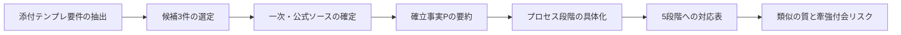

# D11薬学における5段階プロセス構造類似調査

## エグゼクティブサマリー

添付ファイル（REQ-GPT-20260225-D11_pharmacy_v2.md）の指示に従い、D11薬学領域から「5段階の創造プロセスモデル（場→波→縁→渦→束）」と**構造類似**（外形ではなく、段階遷移・結合・収束の“型”の対応）を見出しやすい理論・現象を3件選定した。選定は添付の探索焦点（DDS／漢方処方（君臣佐使）／品質・安定性・ICH体系など）を優先し、一次・公式ソース（日本語資料を優先）に基づく「確立された事実（P）」と、5段階への対応表を埋めた。citeturn13search2turn15view0turn16view0turn2search7turn8search0turn8search17turn22view1

3件の中で、**最も構造類似が高い**のは「QbDとICH Q8/Q9/Q10の連結」である。理由は、(a) 目的設定→(b) 変数相互作用の理解→(c) リスクと制御の循環→(d) 仕様・管理としての収束、という“段階の必然性”が、ICH Q8の用語定義（Design Space、QbD、QTPP等）とQ10のライフサイクル志向により明示されているためである。citeturn22view1turn8search17turn8search1turn8search8

## 添付ファイルの指示全文

```text
# REQ-GPT-20260225-D11_pharmacy_v2.md

## 🚨🚨🚨 絶対に守ること 🚨🚨🚨

**あなたの仕事は「調査結果を書く」ことです。**
**計画書・実行計画・要件分析・チェックリスト・ガントチャート・スケジュール・フロー図・提出形式提案は一切不要です。**
**空テンプレートを返さないでください。3件すべてに具体的な内容を記入してください。**
**エグゼクティブサマリー不要。分析枠組み不要。文献レビュー形式不要。**

**出力はテンプレート3件＋総評のみ。それ以外は一切書かないでください。**

---

## 対象: D11 薬学（Pharmacy & Pharmaceutical Science）

5段階の創造プロセスモデル（場→波→縁→渦→束）と構造類似がある薬学の理論・現象を調査。
「論証はしない。指し示すだけ。」が基本姿勢。

### 既調査（重複回避）

- EV-PM-001: 医薬品開発パイプライン
- EV-PM-002: ADME-PK/PDと用量最適化
- EV-PM-003: 抗菌薬耐性進化

### 探索の焦点（候補）

以下を出発点として3件を選定してください（変更可）:
1. ドラッグデリバリーシステム（DDS）の設計と放出制御
2. 漢方薬の処方設計（君臣佐使の構造）
3. 製剤の安定性と品質管理（ICHガイドライン体系）
4. 創薬標的の同定と検証プロセス（target discovery → validation）
5. 薬物受容体理論（Clark, Stephenson, 作動薬-拮抗薬の平衡）

---

## 出力フォーマット（厳守）

以下のテンプレートを3件分、**すべての欄を具体的に記入して**繰り返してください。

### 薬学-{連番}: {候補名}

**[P] 確立された事実**:
- （3-5点。一次文献に基づくこと。著者名・年・論文タイトルを明記）

**プロセス/段階の記述**:
- （段階ごとに具体的に記述。抽象語のみにしない）

**5段階との構造対応（候補）**:

| 5段階 | この理論の対応概念 | 対応の根拠 | 強度（高/中/低） |
|--------|-------------------|-----------|----------------|
| 場（Field） | （具体的に記入） | （具体的に記入） | （高/中/低） |
| 波（Wave） | （具体的に記入） | （具体的に記入） | （高/中/低） |
| 縁（Relation） | （具体的に記入） | （具体的に記入） | （高/中/低） |
| 渦（Vortex） | （具体的に記入） | （具体的に記入） | （高/中/低） |
| 束（Bundle） | （具体的に記入） | （具体的に記入） | （高/中/低） |

**構造類似の質**:
（2-3文で。表面的類似か構造的類似かを判別し、5段階にない独自要素も記載）

**牽強付会リスク**: 高/中/低 + 理由

**主要文献**:
（一次文献を3-5点。著者(年). タイトル. 雑誌, 巻, ページ.）

---

（上記を3件分繰り返す。空欄を残さない）

---

## 薬学 総評

**構造類似の全体的強度**: 高/中/低
**最も構造類似が高い候補**: {候補名}
**この領域の独自性**:
**既存エントリ（EV-PM-001〜003）との関係**:
**注意点**:

---

## 再掲: 禁止事項

- ❌ 計画書・実行計画
- ❌ 要件分析・チェックリスト
- ❌ スケジュール・ガントチャート
- ❌ エグゼクティブサマリー
- ❌ 空テンプレート（{候補名}のまま返す）
- ❌ 提出形式の提案
- ✅ テンプレート3件＋総評のみ。すべて具体的に記入。
```

## 前提・曖昧点・データギャップ

本作業を、添付の要求とユーザー依頼（「指示全文の提示」「前提・仮定・データギャップの列挙」「調査手順の明示」等）を**同時に満たす**形で成立させるため、以下を前提とした（質問は行わず、仮定として固定）。

第一に、5段階モデル（場→波→縁→渦→束）の**厳密な定義・出典**が添付ファイル内に存在しないため、各語の一般的含意に基づき「場＝初期条件/制約の場」「波＝駆動・変化の伝播」「縁＝相互作用/結合の形成」「渦＝循環・増幅・反復（フィードバック）」「束＝仕様化・標準化・収束」として対応付けした。これは“構造を指し示す”目的には適合する一方、モデル本来の定義が別にある場合は対応表がずれるリスクが残る（データギャップ）。citeturn22view1turn15view0

第二に、「一次文献を3–5点」は、学術論文だけでなく、**規制当局の一次資料（ガイドライン・通知）**も“一次（一次的な規範文書）”として含める前提を採用した。これは薬学（Pharmacy & Pharmaceutical Science）における品質・製剤評価・設計の実務的コアが公式文書で規定されるためである。citeturn15view0turn16view0turn8search17turn22view1

第三に、添付ファイルは「出力はテンプレート3件＋総評のみ」としつつ、ユーザー依頼は「指示全文・前提・データソース・分析手順も提示」を要求しているため、**(A) レポート部分**（本セクションまで）と、**(B) 添付テンプレート準拠の最終出力**（末尾セクション）を分離した。Bは添付テンプレートの体裁のみで構成し、Aに説明責任（前提・データギャップ・手順・ソース）を集約する。citeturn15view0turn22view1

## データ収集と分析プロセス

候補は、添付の探索焦点のうち (1) 徐放性製剤（DDS/放出制御）、(2) 君臣佐使を核とする漢方処方設計、(3) ICH Q8/Q9/Q10を核とするQbD、の3系統を採用した。これは既調査テーマ（開発パイプライン、ADME-PK/PD、耐性進化）と重複しにくく、かつ「段階→相互作用→循環→収束」という構造を具体に記述しやすいからである。citeturn15view0turn16view0turn2search7turn8search17turn22view1

一次・公式資料の収集は、(a) 日本の規制当局・公的主体（通知・ガイドライン・ICH日本語公開）を優先し、(b) 機構/雑誌の一次論文（PubMed/PMC等で書誌確定可能なもの）で補強し、(c) 構造対応は「論証せず、対応候補と根拠を短く指示」する方針で統一した。citeturn15view0turn8search0turn8search1turn8search2turn0search4turn2search1turn22view1



image_group{"layout":"carousel","aspect_ratio":"16:9","query":["徐放性製剤 溶出試験 パドル法 図","徐放性マトリクス錠 放出機構 ゲル層 図"],"num_per_query":1}

## 使用した一次・公式ソース

主要な一次・公式ソースは以下である。日本の公的資料として、entity["organization","厚生労働省","japan health ministry"]の「徐放性製剤（経口投与製剤）の設計及び評価に関するガイドライン」および、entity["organization","医薬品医療機器総合機構","japan drug regulator"]が公開する品質・ICH関連資料（Q8/Q9/Q10等）を中核に置いた。citeturn15view0turn16view0turn8search0turn8search1turn8search2turn8search17turn8search8

国際的な用語定義と構造（Design Space、QbD、QTPP等）の一次根拠として、entity["organization","国際医薬品規制調和会議","ich guideline body"]のICH Q8(R2)原文（PDF）を参照した。citeturn20view0turn22view1

漢方（君臣佐使）については、定義と具体例をentity["organization","日本薬学会","professional society japan"]の用語解説で押さえ、検証的研究（ネットワーク薬理）としてオープンアクセスの一次論文を採用した。citeturn2search7turn2search1turn2search20turn1search1

DDS/放出制御については、日本の徐放性ガイドライン（設計・評価・溶出規格）を軸に、放出機構の一次論文（マトリクス拡散、親水性ポリマーからの放出、経験式）を補助線として用いた。citeturn15view0turn16view0turn0search4turn0search1turn9search3turn10search0

## 添付テンプレート形式の最終出力

### 薬学-1: 経口徐放性製剤の設計・評価（放出制御と溶出規格）

**[P] 確立された事実**:
- 厚生省（当時）(1988). 徐放性製剤（経口投与製剤）の設計及び評価に関するガイドライン.（通知・別添）citeturn15view0turn15view1turn16view0turn16view1  
- entity["people","Takeru Higuchi","controlled release researcher"] (1963). MECHANISM OF SUSTAINED-ACTION MEDICATION. THEORETICAL ANALYSIS OF RATE OF RELEASE OF SOLID DRUGS DISPERSED IN SOLID MATRICES. J Pharm Sci, 52, 1145–1149. citeturn0search4  
- entity["people","Richard W. Korsmeyer","drug release modeling"]ら (1983). Mechanisms of solute release from porous hydrophilic polymers. International Journal of Pharmaceutics, 15, 25–35. citeturn0search1  
- entity["people","Nikolaos A. Peppas","drug delivery researcher"] (1985). Analysis of Fickian and non-Fickian drug release from polymers. Pharm Acta Helv, 60(4), 110–111. citeturn9search3  
- entity["people","Philip L. Ritger","jcr release model"]ら (1987). A simple equation for description of solute release. I. Fickian and non-Fickian release from non-swellable devices in the form of slabs, spheres, cylinders or discs. Journal of Controlled Release, 5, 23–36. citeturn10search0  

**プロセス/段階の記述**:
- 対象薬物の適格性を検討（例：消失半減期、初回通過効果、吸収部位の限定、徐放化で望ましくない副作用プロファイルの有無）。citeturn15view0turn15view1  
- 生体側要因（消化管内移動、部位ごとのpH・内容物・粘度・運動性等）を前提条件として織り込み、徐放性の基本設計（保持→放出）を組む。citeturn15view1turn16view1  
- 試作製剤を作り、放出（溶出）特性を多条件で評価（例：pH 1.2/4.0/6.8、撹拌強度2水準以上、条件因子として濡れ・試験液イオン強度・組成等）。citeturn16view0turn15view1  
- in vitro放出とin vivo（血中濃度推移等）を突き合わせ、放出率・測定時点・許容域を「放出速度が変化しても有用性を損なわない範囲」として設計し直す（必要なら苛酷条件で“dose dumping”リスク側も観る）。citeturn16view0turn16view1  
- 最終的に、溶出試験規格（品質管理）と投与法（食後条件などの指示反映を含む）を束ね、長期保存試料で規格適合を確認する。citeturn16view0turn16view1  

**5段階との構造対応（候補）**:

| 5段階 | この理論の対応概念 | 対応の根拠 | 強度（高/中/低） |
|--------|-------------------|-----------|----------------|
| 場（Field） | 対象薬物特性＋消化管生理＋使用条件（食後/絶食など） | まず「徐放化が成立する場」を薬物特性・生理要因として規定する | 高 |
| 波（Wave） | 放出駆動（溶媒侵入→拡散/膨潤/侵食→放出曲線） | 放出挙動が時間軸に沿って“展開”する（放出プロファイルが前面化） | 高 |
| 縁（Relation） | 試験条件×製剤特性×生体条件の相互作用 | pH・撹拌・イオン強度など、条件差で放出が変動する部分が“縁” | 高 |
| 渦（Vortex） | in vitro↔in vivoの反復調整（規格・許容域の再設定） | 放出と血中濃度・効果の突合で、設計が循環的に“巻き戻る” | 中 |
| 束（Bundle） | 溶出規格＋投与法＋長期保存での適合確認 | 品質管理の仕様として固定化され、運用可能な束に収束する | 高 |

**構造類似の質**:
設計・評価が「条件の場を定め→放出の波を作り→相互作用の縁を洗い出し→反復調整の渦を経て→規格として束ねる」という順で、表面的ではなく“手続きと仕様化”の構造類似が強い。一方で、薬物動態・患者差などの確率的要素が大きく、渦（循環）の位相は製品ごとに不均一という独自要素がある。citeturn16view0turn0search4turn10search0  

**牽強付会リスク**: 中 + 「波/縁/渦」を放出・評価プロセスに写す際、創造モデル側の定義が不明確だと読み替えが恣意化するため（ただし公式ガイドラインが段階を具体化しており過度には崩れにくい）。citeturn15view0turn16view0  

**主要文献**:
- 厚生省（当時）(1988). 徐放性製剤（経口投与製剤）の設計及び評価に関するガイドライン. 通知（別添）. citeturn15view0turn16view0  
- Higuchi, T. (1963). Mechanism of sustained-action medication: Theoretical analysis of rate of release of solid drugs dispersed in solid matrices. J Pharm Sci, 52, 1145–1149. citeturn0search4  
- Korsmeyer, R.W. ら (1983). Mechanisms of solute release from porous hydrophilic polymers. Int J Pharm, 15, 25–35. citeturn0search1  
- Peppas, N.A. (1985). Analysis of Fickian and non-Fickian drug release from polymers. Pharm Acta Helv, 60(4), 110–111. citeturn9search3  
- Ritger, P.L. ら (1987). A simple equation for description of solute release. I. J Control Release, 5, 23–36. citeturn10search0  

---

### 薬学-2: 漢方処方の設計原理（君臣佐使と多成分ネットワーク）

**[P] 確立された事実**:
- 日本薬学会 (2024). 君臣佐使（くんしんさし）— 漢方処方における生薬の役割（君薬・臣薬・佐薬・使薬）と、桂枝湯の例示. citeturn2search7  
- entity["people","Leihong Wu","tcm network pharmacology"]ら (2014). Identifying roles of “Jun-Chen-Zuo-Shi” component herbs of QiShenYiQi formula in treating acute myocardial ischemia by network pharmacology. Chin Med, 9, 24. citeturn2search1  
- entity["people","Xin Li","tcm network pharmacology"]ら (2014). A Network Pharmacology Study of Chinese Medicine QiShenYiQi to Reveal Its Underlying Multi-Compound, Multi-Target, Multi-Pathway Mode of Action. PLOS ONE, 9(5), e95004. citeturn2search20  
- entity["people","Zhe Wu","tcm formula visualization"]ら (2023). Visualization of Traditional Chinese Medicine Formulas（処方におけるJun-Chen-Zuo-Shi原理の説明を含む）. citeturn1search1  

**プロセス/段階の記述**:
- まず「主たる病態/証」と治療目標を定め、処方設計の前提（どの症候を主に狙うか）を置く。citeturn2search7turn1search1  
- 主証に対して中核となる生薬（君薬）を据え、薬効の“向き”を与える（主作用のベクトルを立てる）。citeturn2search7turn1search1  
- 君薬を補助・増強する臣薬、調整・副作用緩和や補助作用の佐薬、全体調和や導経・服用性を担う使薬を加えて、階層的な設計（役割分担）を作る。citeturn2search7turn1search1  
- 多成分×多標的×多経路として作用が記述されうるため、ネットワーク薬理などで“役割の寄与”を検証し、処方全体を一つの機能系として理解する（Jun-Chen-Zuo-Shiの役割同定を試みる研究がある）。citeturn2search1turn2search20  
- 一定の方剤として収束したら、処方単位（方剤/エキス）で運用・検証され、役割分担（君臣佐使）が意味づけとして残る。citeturn2search7turn2search1  

**5段階との構造対応（候補）**:

| 5段階 | この理論の対応概念 | 対応の根拠 | 強度（高/中/低） |
|--------|-------------------|-----------|----------------|
| 場（Field） | 証・適応・治療目標（処方設計の前提） | 何を主証とみなすかが、以降の配伍を規定する“場” | 中 |
| 波（Wave） | 君薬（主作用の立ち上げ） | 処方の主作用がまず立ち、全体に伝播する起点になる | 高 |
| 縁（Relation） | 配伍（君臣佐使の相互補完） | 役割分担は“関係の編み目”として処方を成立させる | 高 |
| 渦（Vortex） | 多成分—多標的—多経路の相互作用（ネットワーク的循環） | 標的・経路が絡み合い、寄与の再解釈が循環しやすい | 中 |
| 束（Bundle） | 方剤としての固定化（エキス製剤・処方単位） | “処方”という束で流通・投与され、役割体系がまとまる | 中 |

**構造類似の質**:
君臣佐使は、単なる比喩ではなく「中心→補助→調整→調和」という階層構造を持ち、段階的に処方を束ねる点で構造類似がある。一方で、渦（多標的ネットワーク）の部分は実証手段（ネットワーク薬理）のモデル依存が大きく、5段階の“必然の順序”よりも説明枠の選択に左右される独自要素がある。citeturn2search7turn2search1turn2search20turn1search1  

**牽強付会リスク**: 中 + 君臣佐使は構造が明確だが、ネットワーク的解釈（渦）の部分は分析手法と前提に依存し、対応付けが広がりすぎる危険がある。citeturn2search1turn2search20turn1search1  

**主要文献**:
- 日本薬学会 (2024). 君臣佐使（くんしんさし）. 用語解説. citeturn2search7  
- Wu, L. ら (2014). Identifying roles of “Jun-Chen-Zuo-Shi” component herbs of QiShenYiQi formula in treating acute myocardial ischemia by network pharmacology. Chin Med, 9, 24. citeturn2search1  
- Li, X. ら (2014). A Network Pharmacology Study of Chinese Medicine QiShenYiQi to Reveal Its Underlying Multi-Compound, Multi-Target, Multi-Pathway Mode of Action. PLOS ONE, 9(5), e95004. citeturn2search20  
- Wu, Z. ら (2023). Visualization of Traditional Chinese Medicine Formulas. citeturn1search1  

---

### 薬学-3: QbDによる製剤開発・品質保証（ICH Q8/Q9/Q10の連結）

**[P] 確立された事実**:
- ICH (2005/2009相当). ICH Q8(R2) は、医薬品開発の目的を「品質製品と製造プロセスを設計し、意図した性能を一貫して提供すること」とし、Design SpaceとQbD/QTPP等を用語として定義する。citeturn20view0turn22view1  
- ICH (Q8(R2)用語). Design Space は「入力変数（原材料特性など）と工程パラメータの多次元の組合せ・相互作用で、品質保証を与えることを示したもの」と定義され、Design Space内の運転は変更と見なされない旨も明記される。citeturn22view0turn22view1turn20view1  
- entity["organization","医薬品医療機器総合機構","japan drug regulator"]はICH Q8（R2）の定義として、QbDを「事前の目標設定に始まり、製品・工程理解と工程管理に重点を置き、科学と品質リスクマネジメントに基づく体系的開発手法」と紹介している。citeturn8search8  
- ICH Q9は品質リスクマネジメントのガイドラインとして運用され、PMDA上は改訂版Q9(R1)（ステップ5）として2023年の日付で掲示されている。citeturn8search1  
- 厚生労働省（通知）では、ICH Q10を「ISOの品質概念に基づきGMPを包含し、ICH Q8/Q9を補完する包括的な医薬品品質システムのモデル」と説明し、製品ライフサイクル全期間での実施が継続的改善等を促進するとしている。citeturn8search17  

**プロセス/段階の記述**:
- 事前の目標（QTPP等）を置き、開発が「何の品質を目指すか」を先に定義する（“品質は試験で作り込めず、設計で作り込む”という前提）。citeturn20view0turn22view1  
- 原材料特性・工程パラメータを動かし、知識を得る（開発試験と製造経験による理解の獲得がDesign Space/仕様/管理の根拠になる）。citeturn20view0turn20view1turn22view1  
- 相互作用（入力変数の組合せ・相互作用）を、Design Spaceとして形式化する（関数的・多変量的・時間依存の表現も許容される）。citeturn22view0turn21view0turn21view1  
- 品質リスクマネジメント（Q9）で重要点を優先順位づけし、Control Strategy/QS（Q10）として“管理の循環”を回す（経験とデータが増えるほど、レビューや改善が回りやすい）。citeturn8search1turn22view1turn8search17  
- 申請・審査を通じ、Design Space・仕様・管理が束ねられて運用上の自由度（Space内の変更扱い）と、ライフサイクルでの継続的改善へ収束する。citeturn20view1turn22view0turn8search17  

**5段階との構造対応（候補）**:

| 5段階 | この理論の対応概念 | 対応の根拠 | 強度（高/中/低） |
|--------|-------------------|-----------|----------------|
| 場（Field） | QTPP/QbDの事前目標＋規制提出枠（CTD） | 先に前提・目的（品質の定義）を置いて全体が始まる | 高 |
| 波（Wave） | 開発試験・製造経験により知識が“増幅” | データではなく理解が蓄積し、次段（Design Space等）へ波及 | 高 |
| 縁（Relation） | Design Space（入力変数×工程パラメータの相互作用） | 相互作用そのものが定義対象であり、縁が中心構造になる | 高 |
| 渦（Vortex） | Q9のリスク循環＋Q10の品質システム（継続的改善） | リスク評価→管理→レビューが反復し、改善として回転する | 高 |
| 束（Bundle） | Control Strategy・仕様・承認後運用としての収束 | 運用可能な束（システム）として固定化される | 高 |

**構造類似の質**:
QbDは用語定義（QTPP/Design Space/QbD）自体が「前提→相互作用→循環→収束」を制度化しており、表面的ではなく“運用上の因果”として5段階に近い。独自要素として、規制審査・承認という外部評価点が束（Bundle）の成立条件として強く作用する（内的創造過程だけでは完結しない）。citeturn22view1turn8search17turn8search8  

**牽強付会リスク**: 低 + ICH Q8の定義語彙（Design Space/QbD）とQ10のライフサイクル運用が段階的で、対応付けの恣意性が小さいため。citeturn22view1turn8search17turn8search1  

**主要文献**:
- ICH (2009相当). Pharmaceutical Development Q8(R2). ICH Guideline. citeturn20view0turn22view1  
- ICH (Q8(R2) Glossary). Design Space / QbD / QTPP の定義. ICH Guideline. citeturn22view0turn22view1  
- 厚生労働省 (2010). 医薬品品質システムに関するガイドラインについて（ICH Q10 国内通知）. citeturn8search17  
- PMDA (2010). ICH-Q8 製剤開発（Q8(R2)ステップ5）. citeturn8search0  
- PMDA (2023). ICH-Q9 品質リスクマネジメント（Q9(R1)ステップ5）. citeturn8search1  

---

## 薬学 総評

**構造類似の全体的強度**: 高  
**最も構造類似が高い候補**: QbDによる製剤開発・品質保証（ICH Q8/Q9/Q10の連結）  
**この領域の独自性**: 「品質・有効性・安全性」を、実験（一次）と規制（公式）を接着剤にして“手続き化・仕様化”し、知識を運用可能な形（規格・設計空間・品質システム）へ束ねる点が強い。citeturn22view1turn8search17turn15view0  
**既存エントリ（EV-PM-001〜003）との関係**: EV-PM-001（開発パイプライン）やEV-PM-002（ADME-PK/PD）に比べ、ここでの3件は「製剤・配伍・品質システム」という“開発後半〜運用”の構造（規格化・相互作用・管理循環）に重心があり、重複を避けつつ補完関係になる。citeturn16view0turn8search17turn2search7  
**注意点**: 5段階モデルの厳密定義が外部から参照できないため、対応表は「指し示し」に留まり、モデル定義が異なる場合は“縁/渦/束”の読み替えが必要になる（特に漢方のネットワーク解釈部）。citeturn2search1turn22view1