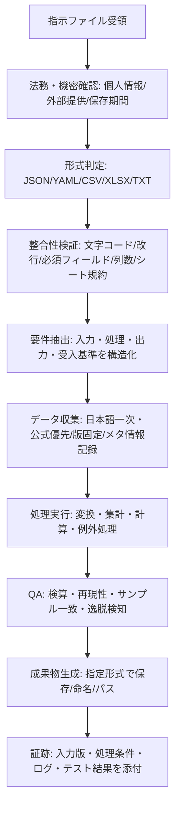
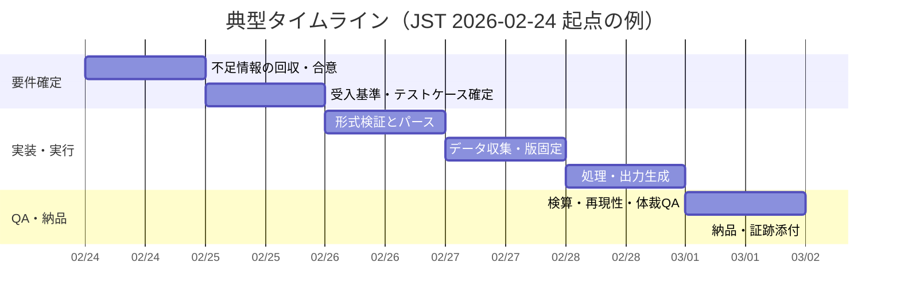

# 指示ファイルに従って結果を出力するための要件整理と実行設計

本件（「ファイルの指示に従い結果まで出力」）は、**指示ファイルの形式・解釈ルール・入力データ・出力仕様・受入基準・制約条件**が確定して初めて、再現可能で検証可能な実行ができるタイプの依頼である。特に、JSONは相互運用上の文字コード要件（典型的にUTF-8）を持ち、CSVは実装差が大きいことが明記され、YAMLは暗黙型などの落とし穴が仕様上の論点として存在し、XLSX（OOXML）はパッケージ仕様に基づくため、**形式ごとに検証点とパース戦略を分ける設計**が必要になる。citeturn2view4turn2view5turn2view6turn2view7

また、入力データに個人情報等が含まれる可能性がある場合、entity["organization","個人情報保護委員会","privacy regulator, japan"]が示す法令・ガイドライン体系に沿って、**安全管理措置や外部提供制限**を前提条件として確定させる必要がある。citeturn2view3turn4view0  
公的・一次情報を優先する運用（特に日本語）を採る場合は、entity["organization","デジタル庁","national digital agency, japan"]のオープンデータ指針が示す「機械判読に適した形式での公開を原則」等の考え方を参照し、**入力データの版管理・メタ情報・機械可読性**も要件化しておくと手戻りが減る。citeturn2view0turn2view1

## 不足情報の整理

現時点では「指示ファイルが後から提供される」前提のため、実行に必須な不足情報を**最短で確定できる形**で列挙する（ユーザー確認用）。標準や公式文書で明示される相互運用上の論点（文字コード、CSVの解釈差、YAMLの暗黙型、OOXMLの仕様依存）を、最初から“要件項目”として扱う。citeturn2view4turn2view5turn2view6turn2view7

### 必須の追加情報（不足項目一覧）

| 区分 | 不足している必須情報（ユーザーから確定が必要） | 具体例（望ましい記述） |
|---|---|---|
| 指示ファイルの物理仕様 | **ファイル形式/拡張子**、**文字エンコーディング**、**改行コード**、（必要なら）区切り文字・BOM有無 | `instructions.json` / `UTF-8` / `LF`（または`CRLF`）citeturn2view4turn2view5 |
| 指示ファイルの論理仕様 | **スキーマ/フィールド定義**（必須キー、型、許容値）、版（v1/v2）、コメント可否 | `inputs[] / processing[] / output / acceptance` を必須、各型を明記 |
| 指示の粒度 | **DSL（機械実行可能な命令列）か自然言語か**、曖昧語（「適宜」等）の扱い | 「SQL風where句を採用」／「自然言語は要件抽出して合意」 |
| 入力データ（ソースとアクセス） | **添付ファイルの有無**、URL、DB種別、認証方式、資格情報の受け渡し方法、更新頻度 | 「CSV添付」／「政府統計URL」／「社内DBはVPN＋読み取り専用」 |
| 処理ルール | **計算/集計定義**、結合キー、期間、単位換算、**丸め**、**欠損値ポリシー**、**例外処理** | 「欠損は除外」／「丸めは四捨五入・小数2桁」／「外れ値は上限クリップ」 |
| 出力仕様 | **出力形式（複数可）**、**ファイル名/保存パス**、列順、文字コード、ヘッダ、シート構成（XLSX） | `output/result.csv`、`reports/report.md`、`result.xlsx: Summary/Raw` citeturn2view7turn2view5 |
| 受入基準 | **合格条件**、検算ルール、許容誤差、**テストケース**（最小2〜3件推奨） | 「総計一致」「サンプル10行一致」「誤差±0.1%まで」 |
| 期限・マイルストーン | **締切**、中間成果（ドラフト）時刻、凍結日、レビュー体制 | 「T+1日で暫定」「T+3日で確定」「レビュー1回」 |
| 機密・法務 | **機密区分**、個人情報の有無、外部送信可否、保持期間、匿名化/仮名化要否 | 「個人情報あり、集計のみ、外部参照禁止」citeturn2view3turn4view0 |
| 外部データ利用と言語 | **参照してよい外部ソース範囲**、優先言語（日本語優先など）、引用形式 | 「日本語の一次/公式を優先、次に英語一次」citeturn2view1 |
| 実行環境制約 | ネット接続可否、使用可能ツール、ライブラリ制限、マクロ可否、OS/文字化け対策 | 「ネット可、Python可、VBA不可、UTF-8固定」citeturn2view4turn2view7 |

補足：entity["organization","独立行政法人情報処理推進機構","cybersecurity agency, japan"]のセキュリティ自己診断資料では、例えばパスワード強度やバックアップ取得などの基本対策がチェック項目として扱われており、入力データや成果物を扱う実務でも同系統の統制が必要になる。citeturn3view0

## 実行ワークフロー

以下は「指示ファイル受領→結果出力」までを、形式差・法務/機密差・データ差を吸収しつつ再現可能にする標準手順である。標準・公式文書に基づき、最初に“壊れやすい点”（文字コード、CSV解釈、YAML暗黙型、OOXML互換）を検証工程として固定する。citeturn2view4turn2view5turn2view6turn2view7



上記の根拠として、JSONは相互運用上UTF-8が要求される場面があるため文字コード検証を早期に行うのが合理的であり、CSVは解釈の幅が大きいことが明記されるため“列数一致・引用符整合”などの機械的検査が必須になる。citeturn2view4turn2view5  
オープンデータ等を参照する場合は、機械判読に適した形式での公開が原則とされ、品質評価やメタ情報の考慮も推奨されるため、取得時点で版（取得日、更新日、識別子）を固定して証跡化する。citeturn2view1turn2view0  
個人情報等を扱う場合は、安全管理措置を含む義務・留意点に沿って、アクセス制御・保存・外部提供の可否を工程Bで確定する。citeturn2view3turn4view0



## 形式別テンプレートと意思決定

ここでは、現場で頻出する形式ごとに、**最小限のテンプレート**と**パース→実行の方針**を提示する。形式の根拠は、JSON（RFC 8259）、CSV（RFC 4180）、YAML仕様、OOXML（ECMA-376）に置く。citeturn2view4turn2view5turn2view6turn2view7

### 形式別の意思決定表

| 形式 | まず検証すること | パース戦略 | 実行への落とし込み | 失敗しやすい点（対策） |
|---|---|---|---|---|
| JSON | UTF-8・BOM・必須キー | スキーマに近い必須項目検査 → 型検査 | `inputs/processing/output/acceptance` を直接実行計画へ | 文字コード/必須キー欠落（早期にエラー化）citeturn2view4 |
| CSV | 列数・ヘッダ・引用符整合 | 1行=1手順のDSLとして解釈、列を固定 | 手順を順次実行し中間成果を命名 | 解釈差の大きさ（列不整合は即停止）citeturn2view5 |
| YAML | バージョン/暗黙型 | YAML→内部モデル（JSON同等構造）へ変換 | JSONテンプレと同様に実行 | 暗黙型の罠（文字列はクォート運用）citeturn2view6 |
| XLSX | シート名・列名規約 | シート規約で抽出（見た目ではなく列名で読む） | `Instructions/Inputs/Outputs` に分割して実行 | 実装差・セル書式依存（列名固定、式より値優先）citeturn2view7 |
| テキスト/Markdown | セクション構造 | 見出し→要件抽出→構造化（要合意） | 「自然言語→実行可能な仕様」へ変換後に実行 | 曖昧語（未決事項として差し戻し） |

### JSON（DSL向き）テンプレート

```json
{
  "inputs": [{"type": "file", "path": "input/data.csv", "encoding": "utf-8"}],
  "processing": [
    {"op": "filter", "where": "date>=2026-01-01 and date<=2026-01-31"},
    {"op": "group_by", "keys": ["region"], "metrics": [{"sum": "amount"}]},
    {"op": "round", "columns": ["amount_sum"], "digits": 0}
  ],
  "output": {"format": "csv", "path": "output/result.csv", "encoding": "utf-8"},
  "acceptance": {"checks": [{"type": "columns_exact", "value": ["region","amount_sum"]}]}
}
```

パース方針：UTF-8前提の検証を最初に行い、必須キーと型を落とし穴なく検査する。citeturn2view4

### CSV（運用者が表で管理しやすい）テンプレート

```csv
step,op,param1,param2,output
1,load,input/data.csv,utf-8,df
2,filter,date>=2026-01-01,date<=2026-01-31,df_f
3,group_by,region,sum(amount),df_g
4,export_csv,output/result.csv,utf-8,done
```

パース方針：列数一致・引用符整合などの機械的検査を必須にし、曖昧な自動補正を避ける（CSV解釈の幅があるため）。citeturn2view5

### YAML（人が編集しやすいが暗黙型に注意）テンプレート

```yaml
%YAML 1.2
inputs:
  - type: file
    path: input/inventory.csv
    encoding: "utf-8"
processing:
  - op: validate_schema
    required_columns: ["item_id","qty"]
  - op: compute
    expr:
      shortage: "max(0, 10 - qty)"
output:
  format: markdown
  path: output/report.md
acceptance:
  checks:
    - type: non_negative
      columns: ["shortage"]
```

パース方針：YAML 1.2系の前提とし、暗黙型変換の影響を最小化する（数値/真偽の誤判定回避）。citeturn2view6

### Excel/XLSX（指示＋参照データを同一ブックに束ねる）テンプレート

- `Instructions`（列：`step, op, target, args_json, output_name`）  
- `Inputs`（列：`name, path_or_url, as_of, hash`）  
- `Outputs`（列：`name, format, path, encoding, columns`）

パース方針：OOXMLは仕様に基づくパッケージであるため、**シート名と列名を規約化**し、それを唯一の解釈根拠にする。citeturn2view7

### テキスト/Markdown（自然言語指示を仕様化してから実行）テンプレート

```markdown
## 目的
2026年1月の地域別売上合計を算出する。

## 入力
- sales.csv（UTF-8, LF）

## 処理
- dateが2026-01-01〜2026-01-31の行のみ
- regionで集計しamount合計
- 合計は整数に丸め（四捨五入）

## 出力
- output/result.csv（列: region, amount_sum）
- 検算: 全region合計が元データの合計と一致
```

パース方針：見出し単位で要件を抽出し、未確定（曖昧語・欠落項目）は“差戻しリスト”として即時可視化する。機械判読性を重視する方針は政府指針とも整合する。citeturn2view1

## 規模別の工数・リソース見積り

見積りは「データ量」よりも、**要件の不確実性**と**統合・検証の重さ**で決まる。機械判読性や品質評価の考え方を採ると、取得時点の版固定やメタ情報整備が工数に乗るため、そこを前提に含める。citeturn2view1  
ここでいう法務・個人情報対応はentity["country","日本","sovereign state"]の法令・ガイドライン参照が前提となり、要件次第で追加工数が発生する。citeturn2view3turn4view0

### 規模定義

- **小規模**：入力1〜2、処理は単純（抽出・集計中心）、出力1種、外部参照ほぼ無し  
- **中規模**：入力3〜10、結合/欠損/例外あり、出力複数、一次ソース収集と根拠整理が必要  
- **大規模**：入力10+やAPI/DB統合、監査証跡・再実行性・権限制御が必須、法務/機密審査込み

### 工数・体制・前提（目安）

| 規模 | 人時（目安） | 役割 | 主ツール | 前提/仮定 |
|---|---:|---|---|---|
| 小規模 | 4〜12h | 実装1、レビュー1（軽） | Python/スプレッドシート | 指示がDSLで曖昧さが少ない |
| 中規模 | 16〜48h | 実装1、レビュー1、PM兼務1 | Python、DBクライアント、ドキュメント | 受入基準とテストケースが提供される |
| 大規模 | 80〜240h | 実装2〜4、PM、セキュリティ/法務確認 | ETL基盤、CI、権限管理、ログ | 個人情報/機密の統制が必須（安全管理措置含む）citeturn4view0 |

補足：バックアップ取得やアクセス制限などの基本対策は、IPAの自己診断資料でも具体的チェック項目として提示されているため、成果物生成の運用設計では最低限の統制として織り込むのが現実的である。citeturn3view0

## 検証とQA

QAは「計算が合う」だけでなく、**再現性（同じ入力→同じ出力）**、**証跡（入力版・処理条件・検算結果）**、**形式互換（受け手が読める）**、**セキュリティ/プライバシー**まで含めて合格条件にする。CSVは解釈差があるため出力側のルール固定、JSONは文字コード要件の固定、YAMLは暗黙型抑止、XLSXはシート/列規約が鍵になる。citeturn2view4turn2view5turn2view6turn2view7

### 推奨QAチェック

| フェーズ | チェック | 最低限の合格条件 |
|---|---|---|
| 形式QA | 文字コード/改行/必須項目 | JSONは相互運用前提ならUTF-8、CSVは列数一致、XLSXはシート規約一致citeturn2view4turn2view5turn2view7 |
| 入力QA | 版固定・欠損/外れ値・単位 | 取得日・更新日・識別子を記録、欠損と単位が処理ルールに明記citeturn2view1 |
| 処理QA | 計算式・集計キー・例外 | 例外時の挙動（除外/補完/エラー停止）が明文化 |
| 検算QA | リコンシリエーション | 総計一致、サンプル行一致、許容誤差内 |
| 出力QA | 互換性・命名・パス | 指定パスに保存、列順/シート構成一致、再読込で同一解釈citeturn2view5turn2view7 |
| セキュリティ/法務QA | 安全管理・外部提供 | 個人情報がある場合、リスクに応じた安全管理措置と提供制限を満たすciteturn4view0turn2view3 |

### ユーザー提出チェックリスト

| 提出物 | 必須 | あると大幅に短縮 |
|---|---|---|
| 指示ファイル | 形式/拡張子、エンコーディング、改行、スキーマ | “正”のサンプル（最小1ケース） |
| 入力データ | 添付または参照先、アクセス方法 | 版情報（更新日/タグ/ハッシュ）citeturn2view1 |
| 処理ルール | 欠損、丸め、例外、単位換算 | 外れ値処理、優先順位 |
| 出力仕様 | 形式、ファイル名/パス、列/シート | テンプレ出力ファイル |
| 受入基準 | 合格条件、テストケース | 検算式・許容誤差 |
| 制約条件 | 機密/個人情報、外部参照可否 | 保存期間・アクセス権限citeturn4view0turn2view3 |
| 期限 | 最終締切・中間レビュー | スコープ調整可否（遅延時の優先順位） |

## 仮想指示ファイルの入力例と出力例

「結果まで出力」を成立させるため、**入力→処理→出力→受入基準**が揃っている例を2つ示す（実データ収集は行わない）。形式の落とし穴（CSV解釈、JSONエンコーディング等）は仕様根拠に沿って回避する。citeturn2view4turn2view5

### 例示: JSON指示でCSV集計を生成

**入力（instructions.json）**

```json
{
  "inputs": [{"type":"file","path":"sales.csv","encoding":"utf-8"}],
  "processing": [
    {"op":"group_by","keys":["region"],"metrics":[{"sum":"amount"}]},
    {"op":"sort","by":[{"column":"amount_sum","direction":"desc"}]}
  ],
  "output": {"format":"csv","path":"output/result.csv","encoding":"utf-8"},
  "acceptance": {"checks":[
    {"type":"columns_exact","value":["region","amount_sum"]},
    {"type":"row_count_greater_than","value":0}
  ]}
}
```

**入力（sales.csv）**

```csv
region,amount
Kanto,1200
Kansai,800
Kanto,300
Tohoku,500
Kansai,200
```

**出力（output/result.csv）**

```csv
region,amount_sum
Kanto,1500
Kansai,1000
Tohoku,500
```

要点：JSONは相互運用上UTF-8が要求される設計が明示されているため、文字コードを明文化して早期検証する。citeturn2view4  
CSVは解釈差があることが明記されるため、列名・列数整合・引用符整合を最低限の受入条件として固定する。citeturn2view5

### 例示: Markdown指示を仕様化してレポート生成

**入力（instructions.md）**

```markdown
## 目的
在庫監査として、安全在庫10を下回る不足数(shortage)を算出し一覧化する。

## 入力
- inventory.csv（UTF-8, LF）

## 処理
- 必須列: item_id, name, qty
- shortage = max(0, 10 - qty)
- shortageは0以上の整数

## 出力
- output/report.md（表形式）
- 受入基準: shortageが負にならない
```

**入力（inventory.csv）**

```csv
item_id,name,qty
A01,Widget,8
A02,Gadget,12
A03,Thing,0
```

**出力（output/report.md）**

```markdown
# 在庫監査レポート

前提: safety_stock = 10

| item_id | name   | qty | shortage |
|---|---|---:|---:|
| A01 | Widget | 8  | 2  |
| A02 | Gadget | 12 | 0  |
| A03 | Thing  | 0  | 10 |
```

要点：自然言語指示は見出しから構造化し、受入基準（shortage非負）を機械的チェックとして実装する。CSV出力/入力に関する基礎的な形式理解はRFCで整理されており、解釈差を前提に“列整合の固定”が必要になる。citeturn2view5  
運用上、バックアップ取得などの基本統制はIPA資料のチェック項目にも含まれ、成果物・入力の保全に直結するため、最低限の運用要件として定義しておくと事故確率を下げられる。citeturn3view0