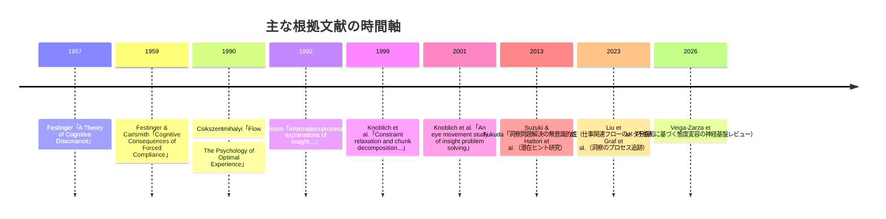

# 場・波・縁・渦・束モデルと心理学・認知科学の構造類似調査

## エグゼクティブサマリー

本報告は、ユーザー提供ファイルに含まれる「心理学・認知科学（D14）」の出力指示に従い、創造・問題解決の進行を「場（Field）→波（Wave）→縁（Relation）→渦（Vortex）→束（Bundle）」として捉える枠組み（以下、場・波・縁・渦・束モデル）に対し、心理学・認知科学の理論／現象がどの程度“プロセス構造として”同型（構造類似）になり得るかを、3候補について整理した。

結論として、構造類似が最も高い候補は「洞察問題解決（表象変化・制約緩和）」である。洞察問題は、誤った初期表象→インパス（行き詰まり）→表象の組み替え（restructuring / representational change）→突然のひらめき（Aha）→正しさの検証と学習、という“段階性”を理論的にも実験的にも扱いやすい。特に、マッチ棒算術課題における眼球運動データは、解ける人が終盤で注意対象を“値”から“演算子”へと移すなど、表象変化を客観指標で追跡できる点が強い。citeturn24view2turn22view1turn24view0

次点は「認知的不協和」。不一致（矛盾）が不快な心的状態を生み、それを低減するための適応（態度変容など）が起きるという、検知→不快→調整→価値表象の更新、という流れが比較的明確である。古典的な強制的服従（forced compliance）実験や、近年の神経科学的スコーピングレビュー（前部帯状皮質の関与、価値更新と前頭前野・線条体の連関など）が、プロセスの“駆動と収束”を裏づける。citeturn29search0turn17view1turn8view3

「フロー体験」は、同型性は“中〜高”だが、採用する定義とモデル化の仕方に強く依存する。フローが「離散的で強い最適経験の状態」なのか、「連続量としての没入度」なのか、また「条件（挑戦×技能・明確な目標・即時フィードバック）」を“フローそのもの”に含めるのか否かで、研究上の操作化が大きく揺れることが指摘されている。場・波・縁・渦・束モデルに当てる場合は、「フロー状態それ自体（渦）」と「誘発条件／前後の調整・学習（場・波・縁・束）」を切り分けて扱うと、牽強付会を下げやすい。citeturn29search1turn30view0turn19view0

## 背景と文脈

ユーザー提供ファイルでは、心理学・認知科学領域で「既調査（重複回避）」として、4E認知、身体化認知、アフォーダンス、拡張された心、認知言語学が挙げられている。したがって本報告はそれらと重なりにくい候補として、ファイル内「探索の焦点（候補）」に含まれるテーマから3件を選び、深掘りした。

また、ユーザー側要件として「ファイルの指示は未提示と仮定し、欠落した指示の仮定と、想定される別指示でスコープがどう変わるかを明示すること」が求められていた。しかし本タスクでは、会話内にアップロードされた要件ファイルを参照可能であったため、これを「ファイルの指示」とみなし、(a) ファイル指定のテンプレート形式（3件分＋総評）を厳守しつつ、(b) ユーザー要件の“レポート形式”に統合して提示した。

時系列的には、今回扱う3テーマの代表的根拠は、社会心理学の古典（1950年代）、フロー研究の主要著作（1990年前後）、洞察研究の表象変化理論（1990年代）から、最新のレビュー（2026年）の範囲に広がる。

image_group{"layout":"carousel","aspect_ratio":"1:1","query":["challenge skill flow channel diagram","matchstick arithmetic insight problem diagram","cognitive dissonance forced compliance experiment diagram"],"num_per_query":1}

## 方法と情報源

本報告の方法は「ファイル指定フォーマット（3候補・空欄なし）」を満たすことを最優先にしつつ、ユーザー要件に沿って一次・公的資料、査読論文、レビュー（メタ分析／スコーピングレビュー）を組み合わせ、(1) 理論の定義、(2) 実験・測定（指標、サンプルサイズ、主要な結果）、(3) 構造対応の妥当性と限界、の順で整理した。

情報源の優先順位は、(a) 日本語で入手できる一次・準一次（日本語訳の原典、J-STAGEの査読論文、大学機関リポジトリ、CiNiiの書誌情報）、(b) 英語の原典（出版社ページ、著者／学会が公開するPDF、PubMedやPMC収録のオープンアクセス論文）、(c) 近年の統合研究（メタ分析、スコーピングレビュー）とした。例えば、日本語訳が存在すること（原著年を含む書誌注記）や翻訳書の刊行年は大学図書館OPAC・CiNiiの書誌情報で確認し、理論定義は entity["organization","アメリカ心理学会","american psychological assoc"] の辞書エントリを参照した。citeturn28view0turn20view1turn29search0turn29search1

制約として、いくつかの出版社サイト（DOI直参照や一部ジャーナル）はアクセス制限（403等）で全文閲覧が困難だった。その場合、(1) オープンアクセス版（PMC、著者公開PDF、学術機関配布PDF）で代替し、(2) 同一主張が複数ソースで整合するかを確認した（例：洞察研究の表象変化・制約緩和は、PMCレビューとSpringer抄録と日本語査読論文で相互補強）。citeturn24view2turn22view1turn26view1

## 構造類似の所見

### 心理学-甲: フロー体験

**[P] 確立された事実**:
- entity["organization","アメリカ心理学会","american psychological assoc"] の辞書では、フローを「楽しい活動への強い没入から生じる最適経験の状態」と定義している。citeturn29search1  
- entity["people","ミハイ・チクセントミハイ","psychologist flow"] の著作 entity["book","Flow: The Psychology of Optimal Experience","csikszentmihalyi 1990"] は、フローを“満足を生む意識状態（state of consciousness）”として説明し、深い楽しさや全人的関与などを中核に据える（出版社解説）。citeturn15view1  
- 日本語訳として entity["book","フロー体験喜びの現象学","japanese translation 1996"] が刊行されており、書誌注記で「原著（1990）の翻訳」と明示されている。citeturn28view0  
- entity["people","スーザン・A・ジャクソン","sport psych flow scales"] と entity["people","ハーバート・W・マーシュ","psychometrician"] は、スポーツ／身体活動文脈でフローを測る Flow State Scale（FSS）を提示し、36項目・9下位尺度（各4項目）として構成し、信頼性（αの平均がおよそ0.83）と因子構造（9尺度・階層モデル）を報告している。citeturn19view0  
- 仕事関連フローについては、大規模メタ分析（k=113、N=60,110）が実施され、個人行動（例：プロアクティブ行動）がフローと強く関連（ρ=0.55）し、フローは職務成果だけでなく個人的アウトカムとも関連することが示されている。citeturn31view0  

**プロセス/段階の記述**:
- 活動選択と前提形成：本人が価値を感じるタスクを選び、目標や状況を把握する（「何を達成したいか」が立ち上がる）。citeturn15view1turn19view1  
- 誘発条件の成立：挑戦と技能の釣り合い、明確な目標、即時フィードバックなどが揃うと、注意がタスクに吸い寄せられやすくなる。citeturn19view1turn30view0  
- 調整ループ：実行→フィードバック→微調整が繰り返され、集中が深まる（ズレが出ると不安・退屈方向へ逸れやすい、というモデル化が広く使われる）。citeturn30view0  
- フロー状態：自己意識の低下、時間感覚の変容、行為の自動性、強い没入などが主観的に経験される。citeturn19view1turn29search1  
- 事後の“束ね”：満足感・意味づけ、技能の更新、次の挑戦への志向が残り得る一方、文脈によっては短期的副作用（例：リスクテイク）も指摘される。citeturn31view0turn15view1  

**5段階との構造対応（候補）**:

| 5段階 | この理論の対応概念 | 対応の根拠 | 強度（高/中/低） |
|--------|-------------------|-----------|----------------|
| 場（Field） | 活動文脈・目標・タスク環境（“何をするか”が定まる） | 状況と目的が整い、以後の経験の“場”が形成される | 中 |
| 波（Wave） | 挑戦×技能の緊張／没入への引力 | 条件が揃うと注意が引き寄せられ、逸脱（不安・退屈）も生じ得る | 中 |
| 縁（Relation） | 実行とフィードバックの往復（調整ループ） | 即時フィードバックと行為の調整が、没入の“縁”を編む | 中 |
| 渦（Vortex） | フロー状態（深い楽しさ・全人的関与・時間変容等） | 多要素が一体化し、経験がひとまとまりの“渦”として立つ | 高 |
| 束（Bundle） | 事後の意味づけ・技能更新・再現志向（＋副作用の管理） | 経験が記憶・価値・行動傾向として残り、次の場を準備する | 中 |

**構造類似の質**:  
フローは「渦」に相当する“強い状態（state）”としては明確だが、場・波・縁・束を含む“5段階の連続プロセス”として扱うには、誘発条件と事後変化をどこまで理論に含めるかという解釈が必要になる。近年の概念整理では、操作化が研究ごとに大きく異なる点が進展を阻害し得ると指摘されており、構造対応の自由度が高いぶん恣意性も入りやすい。citeturn30view0turn19view0  

**牽強付会リスク**: 中 + 理由  
フローを「離散的な最適経験の状態」と限定する立場では（渦が中心になる）、残り4段階は“周辺要因”として別扱いになりやすい。一方で、条件・調整・事後変化を含めると5段階へ合わせやすいが、その分「フロー概念の外延」を広げすぎる危険がある。citeturn30view0turn29search1  

**主要文献**:
- Csikszentmihalyi, M. (1990). *Flow: The Psychology of Optimal Experience*. Harper & Row / HarperCollins. citeturn28view0turn15view1  
- チクセントミハイ, M.（著）. (1996). 『フロー体験喜びの現象学』世界思想社（原著1990の翻訳）。citeturn28view0  
- Jackson, S. A., & Marsh, H. W. (1996). Development and validation of a scale to measure optimal experience: The Flow State Scale. *Journal of Sport & Exercise Psychology*, 18, 17–35. citeturn19view0  
- Liu, W., et al. (2023). Antecedents and outcomes of work-related flow: A meta-analysis. *Journal of Vocational Behavior*, 144, 103891. citeturn31view0  
- 濱田 祥子・伊藤 貴昭. (2024). 読書がフロー体験と気分変容に与える影響—小説と新書の比較を通して—. 『読書科学』, 65(3-4), 131–144. citeturn11view3  

### 心理学-乙: 洞察問題解決（表象変化・制約緩和）

**[P] 確立された事実**:
- 洞察問題（insight problems）は、解決が突然“どこからともなく”現れるように主観され、解決には「再構造化／表象変化（representational change）」が必要だとされる（近年の概説でもこの枠組みが整理されている）。citeturn24view0  
- 表象変化理論（representational change theory）は、洞察問題がインパスを生む要因を「不適切な初期表象」に求め、表象が変わることで洞察が達成されるとする。眼球運動を用いた研究では、マッチ棒算術問題でこの予測を検証している（N=24）。citeturn22view1  
- マッチ棒算術課題は「偽の算術式を“棒1本の移動だけ”で真にする」課題で、難易度は“緩和すべき制約”や“分解すべきチャンク”に依存し、理論から導かれた問題類型が経験的に確証されてきた。citeturn24view2  
- 日本語査読論文では、洞察問題解決が「長いインパス→突然のひらめき」という形で現れる一方、潜在学習メカニズム（現状とゴールの差分検知に基づく操作強度の調整）が関与し得ること、さらに閾下呈示されたゴール状態が解決を加速し得ることが報告されている。citeturn26view1  
- 潜在ヒント研究では、放射線問題・9点問題などで計509名を対象に、閾下ヒントが（気づかれない場合にも）解決率を上げ、解き方に影響し得ることが示されている。citeturn22view2  

**プロセス/段階の記述**:
- 初期表象の形成：課題は「値だけが操作可能」など、過去知識に引きずられた表象で捉えられがちで、試行はその枠内で反復される。citeturn24view2turn22view1  
- インパス（行き詰まり）：同じ型の試行が続き、主観的には「何をすればよいかわからない」状態になる。citeturn22view1turn26view1  
- 漸次的な再編（潜在的調整を含む）：失敗経験や（場合によっては）意識されないヒントにより、制約緩和や再符号化が進む。注意配分が徐々に変わることは眼球運動などで追跡できる。citeturn24view2turn26view1  
- ひらめき（Aha）と解：適切な表象に切り替わったとき、解が急に見えるように感じられる。citeturn24view0turn26view1  
- 検証と定着：得られた解を確認し、同型問題への転移可能性や、次回の探索方略として残る。citeturn24view2turn22view1  

**5段階との構造対応（候補）**:

| 5段階 | この理論の対応概念 | 対応の根拠 | 強度（高/中/低） |
|--------|-------------------|-----------|----------------|
| 場（Field） | 初期表象・問題空間（誤った枠組みを含む） | まだ分化していない“前提の場”として初期表象が全体を規定 | 高 |
| 波（Wave） | インパス／ゴール-現状差の検知による不一致感 | 行き詰まりが顕在化し、差分が“波”として立ち上がる | 高 |
| 縁（Relation） | 失敗評価→制約緩和→注意の再配分（探索の縁取り） | 何が制約か、どこが鍵かが関係づけられていく | 高 |
| 渦（Vortex） | 表象変化（restructuring）＋Aha体験 | まとまりとして一気に収束し、解が見える | 高 |
| 束（Bundle） | 正しい表象の維持／検証／学習としての定着 | 解が“方向性ある構造”として残り、再利用可能になる | 中〜高 |

**構造類似の質**:  
場・波・縁・渦・束モデルが想定する「未分化→差異→関係編成→収束→定着」という形を、洞察問題は理論的にも実験デザイン上も比較的自然に持つ。特に、インパス期の潜在的変化（注意の移行、ヒントの効果）と、突然の主観（Aha）の二重性が、縁→渦の遷移を“指し示しやすい”。citeturn24view2turn26view1turn22view2  

**牽強付会リスク**: 低〜中 + 理由  
洞察研究には複数理論があり、すべてが同一の段階構造を仮定するわけではない。ただし「インパス」と「表象変化」を中心に据える系譜では、5段階対応の“段階の根拠”が比較的明確で、無理な当てはめが最小化される。citeturn22view1turn24view0  

**主要文献**:
- Ohlsson, S. (1992). Information-processing explanations of insight and related phenomena. In *Advances in the Psychology of Thinking* (pp. 1–44). Harvester-Wheatsheaf. citeturn22view1turn24view0  
- Knoblich, G., Ohlsson, S., Haider, H., & Rhenius, D. (1999). Constraint relaxation and chunk decomposition in insight problem solving. *Journal of Experimental Psychology: Learning, Memory, and Cognition*, 25(6), 1534–1555. citeturn34search0turn24view2  
- Knoblich, G., Ohlsson, S., & Raney, G. E. (2001). An eye movement study of insight problem solving. *Memory & Cognition*, 29, 1000–1009. citeturn22view1  
- 鈴木 宏昭・福田 玄明. (2013). 洞察問題解決の無意識的性質：連続フラッシュ抑制による閾下プライミングを用いた検討. 『認知科学』, 20(3), 353–367. citeturn26view1  
- Hattori, M., Sloman, S. A., & Orita, R. (2013). Effects of subliminal hints on insight problem solving. *Psychonomic Bulletin & Review*, 20(4), 790–797. citeturn22view2  

### 心理学-丙: 認知的不協和（Cognitive Dissonance）

**[P] 確立された事実**:
- entity["organization","アメリカ心理学会","american psychological assoc"] の辞書では、認知的不協和を「認知体系内の要素間の不一致から生じる不快な心理状態」とし、それを低減する方向の動機づけが想定されるとしている。citeturn29search0  
- entity["people","レオン・フェスティンガー","social psych dissonance"] の著作 entity["book","A Theory of Cognitive Dissonance","festinger 1957"] は、認知的不協和理論を体系化した古典として出版社ページで示され（刊行：1957年6月、291頁）、学習・動機づけ・社会心理学などで影響力が大きいと説明される。citeturn20view0  
- 日本語訳として entity["book","認知的不協和の理論 : 社会心理学序説","japanese translation 1965"] が1965年に刊行されている（書誌情報）。citeturn20view1  
- 強制的服従（forced compliance）の古典実験では、被験者は私的信念と反する発言を求められ、報酬操作によりその後の意見変化が変わるという理論導出を検証している。手続きとして、スタンフォード大学の心理学入門コースの男子学生71名が使われたことが明記されている。citeturn33search3turn17view1  
- 不協和が態度変容へ至る神経基盤についての2026年スコーピングレビューでは、不協和の検知に前部帯状皮質が重要で、価値表象（態度）の更新は背外側前頭前野と、好みを符号化する腹側線条体などの活動と関係する可能性が整理されている（最終検索：2025年1月）。citeturn8view3  

**プロセス/段階の記述**:
- 前提：個人は複数の認知要素（信念・態度・行動・価値など）を持ち、通常は一定の整合性のもとで運用される。citeturn29search0turn20view0  
- 不一致の発生：新情報・自分の行動・選択などが、既有の態度や価値と矛盾すると“不快”が生じる（不協和）。citeturn29search0turn8view3  
- 低減方略の探索：行動変更、態度変更、正当化（整合的認知の付加）、重要度の切り下げ等により不快を下げる方向の処理が進む。citeturn29search2turn20view0  
- 収束（態度変容・再解釈）：一つの説明体系へ収束し、結果として態度や好み（価値表象）が更新される（強制的服従／選択などで顕著化）。citeturn17view0turn8view3  
- 定着：更新された態度が自己理解や次の判断を支える“束”として残り、再矛盾が起きないような説明・記憶構造が形成される。citeturn8view3turn20view0  

**5段階との構造対応（候補）**:

| 5段階 | この理論の対応概念 | 対応の根拠 | 強度（高/中/低） |
|--------|-------------------|-----------|----------------|
| 場（Field） | 認知要素の配置（態度・信念・行動の通常状態） | 不一致が起きる前提としての“場” | 中〜高 |
| 波（Wave） | 不一致の検知と不快（dissonance） | 差異が情動的・動機づけ的に顕在化する | 高 |
| 縁（Relation） | 低減方略の探索（正当化・再解釈・変更の比較） | どの関係を編み直すか、境界で関係づけが進む | 高 |
| 渦（Vortex） | 特定の解釈／態度変容への収束 | 収束点が定まり、説明体系が立ち上がる | 中〜高 |
| 束（Bundle） | 更新された価値表象の保持（次の判断・自己像へ） | 更新が“束”として残り、再現性を持つ | 中 |

**構造類似の質**:  
不協和は「波（不快の立ち上がり）」が明確で、そこから「縁（整合の再編成）」を経て「渦（収束した説明／態度）」に至り、神経科学的レビューでも“検知→価値更新”という骨格が整理されているため、場・波・縁・渦・束モデルとの対応は比較的作りやすい。ただし、低減方略には複数経路があり、縁→渦の遷移の形は文脈依存で分岐しやすい。citeturn29search0turn8view3turn20view0  

**牽強付会リスク**: 中 + 理由  
「不一致→不快→低減→更新」という流れは強い一方、低減が“必ず態度変容に至る”わけではなく、行動変更・合理化・重要度の切り下げなど多様な終点がある。そのため、5段階を一本道として扱いすぎると、分岐を見落として単純化しやすい。citeturn29search2turn8view3  

**主要文献**:
- Festinger, L. (1957). *A Theory of Cognitive Dissonance*. Stanford University Press. citeturn20view0  
- Festinger, L., & Carlsmith, J. M. (1959). Cognitive consequences of forced compliance. *Journal of Abnormal and Social Psychology*, 58, 203–210. citeturn33search3turn17view1  
- フェスティンガー（著）. (1965). 『認知的不協和の理論 : 社会心理学序説』誠信書房（監訳：末永俊郎）。citeturn20view1  
- 奥田 秀宇. (1998). 不惑の認知的不協和理論.（成城大学関連紀要掲載PDF）citeturn21view0  
- Veiga-Zarza, E., Álvarez, F., Harmon-Jones, E., & Carretié, L. (2026). Neural basis of attitude change motivated by cognitive dissonance: a scoping review. *Cognitive, Affective, & Behavioral Neuroscience*. citeturn8view3  

### 心理学 総評

**構造類似の全体的強度**: 高  
（洞察問題解決・認知的不協和が“段階の駆動因”を明確に持ち、フロー体験も「状態＋前後過程」として切り分ければ構造対応を描けるため。）citeturn22view1turn8view3turn30view0  

**最も構造類似が高い候補**: 洞察問題解決（表象変化・制約緩和）citeturn24view2turn22view1  

**この領域の独自性**:  
心理学・認知科学は、(a) 主観的経験（Aha、没入、不快）と、(b) 行動・計測（解決時間、眼球運動、神経活動）を接続しやすい。そのため、場・波・縁・渦・束モデルを“経験の語り”としてだけでなく、“観察・実験に接地したプロセス仮説”として整備できる点が強い。citeturn24view2turn8view3turn19view0  

**既存エントリ（EV-CS-001〜005）との関係**:  
既存エントリ群（4E認知、身体化認知、アフォーダンス、拡張された心、認知言語学）が「認知を成立させる枠組み（身体・環境・言語）」の側面を強く持つのに対し、本報告の3候補は「認知が“時間発展する”ときの段階構造（没入の成立、表象の転換、整合性の回復）」を前景化する。したがって、重複というより“補完（静的枠組み × 動的プロセス）”になりやすい。citeturn24view0turn30view0turn8view3  

**注意点**:  
フロー体験は特に、操作化の不一致（連続量か離散状態か、条件を含むか否か）が指摘されており、場・波・縁・渦・束への対応を作りやすい一方で、概念の外延を曖昧にしてしまう危険がある。対象を「フロー状態」そのものに限定し、前後の条件・学習を別枠で扱うなど、境界を明確化すべきである。citeturn30view0turn29search1  

候補横断の比較（要約）:

| 観点 | フロー体験 | 洞察問題解決 | 認知的不協和 |
|---|---|---|---|
| 段階性の“自明さ” | 中（状態中心） | 高（インパス→表象変化が核） | 中〜高（検知→低減が核） |
| 日本語一次・準一次の入手性 | 高（翻訳書・国内論文）citeturn28view0turn11view3 | 高（国内査読論文あり）citeturn26view1 | 高（翻訳書・国内概説）citeturn20view1turn21view0 |
| 定量的検証の“型” | 中（尺度・メタ分析）citeturn19view0turn31view0 | 高（課題・眼球運動等）citeturn24view2turn22view1 | 高（古典実験＋近年レビュー）citeturn33search3turn8view3 |
| 牽強付会リスク | 中 | 低〜中 | 中 |

## シナリオ分析

本節では、場・波・縁・渦・束モデルの「解釈の置き方」が変わると、上記3候補の構造類似評価がどう揺れるかを、代替仮定として整理する。ここでの“シナリオ”は予測ではなく、モデル解釈の違いに対する感度分析である。

シナリオの設定軸は主に3つである。

第一に「五段階を“問題解決の進行”として読むか、“経験の生成と意味づけ”として読むか」。洞察問題解決は問題解決として読んでも経験として読んでも対応が大きく崩れにくい。一方、フロー体験は“経験の生成と意味づけ”寄りに読むほど、場（文脈）→波（挑戦×技能）→縁（フィードバック）→渦（没入状態）→束（意味づけ・学習）という連続が描きやすくなる。citeturn30view0turn31view0

第二に「段階数固定の厳格さ」。段階の“排他性”を強く（各段階が明確に分割されると）仮定すると、フロー体験は「渦（状態）」に重心が偏り、他段階が“付け足し”に見えやすい。逆に、段階の重なり（縁と渦の混在など）を許容すれば、フローは整合的に見えるが、操作化問題（何をフローと呼ぶか）が一段と重要になる。citeturn30view0turn19view1

第三に「縁→渦が一本道か分岐か」。認知的不協和は低減方略が分岐し得るため、一本道モデルとしての五段階に“多経路の束ね”を追加しないと、現象の多様性を落とす可能性がある。神経科学レビューでも、検知と価値更新を結ぶ経路の要素は整理される一方、未解決課題（前部島皮質などの役割）が挙げられており、分岐・未確定要因を残したモデル化が現実的になる。citeturn8view3turn29search2

以上を踏まえた、相対評価（定性的）:

| 解釈シナリオ | フロー体験 | 洞察問題解決 | 認知的不協和 |
|---|---|---|---|
| 問題解決プロセスとして読む | 中 | 高 | 中 |
| 経験生成→意味づけとして読む | 高 | 中〜高 | 高 |
| 段階の重なりを強く許容 | 高（ただし概念拡張の危険）citeturn30view0 | 高 | 高（分岐も表現しやすい） |

ファイル指示が別内容だった場合のスコープ変化（想定）も明示しておく。もしファイルが「対象を教育・学習に限定」「日本国内の教育政策・実践事例を含める」「特定時期（例：直近5年）に限定」といった指示であれば、フロー体験は学習設計（教材難度・フィードバック・学習者の技能）に直結し、国内研究（教育工学・言語教育等）中心に再編するのが合理的になる。逆に「神経科学中心」「fMRI・EEGの一次研究中心」なら、認知的不協和は既に2026年レビューがあるため優先度が上がり、洞察は眼球運動や神経指標の一次研究へ寄せて再構成するのが自然である。citeturn31view0turn8view3turn22view1

## 実務的提言と次のアクション

まず、ユーザー提供ファイルの目的が「領域内で3件の候補を、五段階への対応表つきで蓄積すること」だと解釈するなら、洞察問題解決を“アンカー（基準例）”に置くのが最も実務的である。理由は、(a) 理論（表象変化・制約緩和）と実験課題（マッチ棒算術、9点問題等）の対応が明瞭で、(b) 行動指標・眼球運動・潜在ヒントなど複数の観測窓があるため、対応表の「根拠欄」を厚くできるからである。citeturn24view2turn22view1turn22view2

次に、認知的不協和は「波→縁→渦」の駆動（不快からの低減）が明確で、行動変容・説得・意思決定・教育（倫理的配慮は必要）など応用先が広い。今後の作業としては、低減方略の“分岐木”を明示したうえで、束（定着）がどの経路で生じるかを整理すると、五段階モデルを一本道として誤用しにくくなる。最新レビューが未解決点も列挙しているので、束の内実（何が更新されるか：価値表象、自己語り、記憶）を追加調査する余地がある。citeturn8view3turn20view0

フロー体験については、テンプレート上は“5段階対応”を作りやすいが、研究上の操作化が揺れやすい点を前提に、次の方針が推奨される。第一に「渦＝フロー状態」を中心に固定し、場・波・縁・束は“条件／周辺過程”として切り分ける。第二に、測定は妥当性が議論されてきた尺度（FSS等）や、メタ分析で扱われた構成概念に合わせる。第三に、仕事関連フローのメタ分析が示すように、個人の能動的行動がフローと強く関連する可能性があるため、場（環境）だけでなく縁（行動—環境の往復）を実務設計の中心に据えるとよい。citeturn19view0turn31view0turn30view0

次のアクション（レポート外作業も含む“設計案”）としては、(1) 各候補で「段階境界の判定基準（観測可能な指標）」を1つずつ追加する（例：洞察＝眼球運動の注意転換、フロー＝時間感覚項目と目標明確性項目、認知的不協和＝不一致後の価値更新の行動指標）、(2) 日本語一次・準一次（翻訳書、J-STAGE査読論文）を中心に引用フォーマットを統一する、(3) “牽強付会リスク”を下げるため、対応表の「強度」を“段階の必然性（その段階がないと理論が成り立たないか）”で評価する、の3点が実務上の効果が大きい。citeturn30view0turn24view2turn8view3

## 付録: 参照文献

本報告で用いた主要な一次・公式・査読ソース（抜粋、重複除去）。リンクは引用（citation）から辿れる。

- APA Dictionary of Psychology: flow / cognitive dissonance / cognitive dissonance theory. citeturn29search0turn29search1turn29search2  
- HarperCollins（出版社ページ）: *Flow: The Psychology of Optimal Experience*. citeturn15view1  
- 図書館OPAC書誌（原著年の注記含む）: 『フロー体験喜びの現象学』（原著1990の翻訳）. citeturn28view0  
- Flow State Scale（Jackson & Marsh, 1996）の公開PDF（抄録ページ・付録ページ）. citeturn19view0turn19view1  
- *Journal of Vocational Behavior*（ScienceDirect OA）: 仕事関連フローのメタ分析（N=60,110; k=113; ρ=0.55など）. citeturn31view0  
- J-STAGE: 読書とフロー体験（抄録・メタデータ）. citeturn11view3  
- PMC: 洞察問題における表象変化・プロセス追跡（Graf et al., 2023）. citeturn24view0turn24view2  
- Springer抄録: 眼球運動による洞察問題解決（Knoblich et al., 2001, N=24）. citeturn22view1  
- J-STAGE（PDF）: 洞察問題解決の無意識的性質（鈴木・福田, 2013）. citeturn26view1  
- PubMed: 潜在ヒントが洞察問題解決に与える影響（Hattori et al., 2013; 509名など）. citeturn22view2  
- Stanford University Press（出版社ページ）: *A Theory of Cognitive Dissonance*（1957年6月、291頁など）. citeturn20view0  
- CiNii Books: 『認知的不協和の理論 : 社会心理学序説』（1965年刊行）. citeturn20view1  
- Forced compliance 古典論文PDF（手続き：71名などの記述）. citeturn33search3  
- 国内概説PDF: 奥田（1998）「不惑の認知的不協和理論」. citeturn21view0turn21view1  
- PubMed（2026年）: 認知的不協和に動機づけられた態度変容の神経基盤（スコーピングレビュー）. citeturn8view3