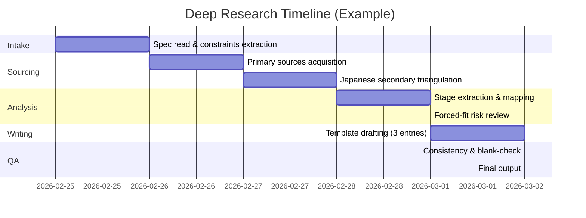

# 文芸学 — 構造類似調査

## エグゼクティブサマリー

本出力は、アップロードされた指示ファイル（Markdown）に従い、文芸学（Literary Studies）の理論・現象について「5段階モデル（場→波→縁→渦→束）」と**過程構造が同型**になりうる候補を3件選び、所定テンプレートを**空欄なし**で記入したものです（既調査の重複回避条件も反映）。  

結論として、3候補のうち最も構造類似が高いのは、entity["people","ツヴェタン・トドロフ","narratology theorist"]の「均衡→破綻→認知→回復→新たな均衡」の循環モデルです。一次文献中で**5要素が明示的に列挙**され、5段階モデルへの対応づけが最短距離で成立します。citeturn3view0turn27view0  

簡潔な比較（本調査の範囲内）を示します。

| 候補 | 構造類似の強度 | 牽強付会リスク | 要点 |
|---|---|---|---|
| 異化（知覚の自動化→異化→知覚の更新→再慣習化の圧力） | 中〜高 | 中 | 「知覚の自動化」から「見えの回復」への変容が明確で、過程として5段階に落としやすい。citeturn10view0turn5view0 |
| トドロフの物語循環（五要素） | 高 | 低 | 5要素が一次文献で列挙され、段階対応が直接的。citeturn3view0turn27view0 |
| 文学場（象徴財市場／自律化／奉献・再生産） | 中〜高 | 中 | 「外的拘束下→競合→関係網→自律化→制度化・再生産」という歴史過程が5段階と同型になりうる。citeturn10view2turn10view3turn24view0 |

## 指示の要点とリサーチ設計

「ファイルの指示」という語は一般に、研究ブリーフ（仕様書）、データセット定義、出力テンプレート、評価チェックリスト、提出要件（体裁・分量・締切）など幅があります。このケースでは、ファイルは**研究ブリーフ＋出力テンプレート**（3件のテンプレート記入＋総評）として機能していました（ファイル形式: Markdown）。  

ファイルから確定した要件と、未指定の要件を切り分けます。

- 研究領域: 文芸学（Literary Studies）  
- 目的: 5段階モデルと同型のプロセス構造をもつ理論・現象を3件提示（論証ではなく「指し示す」）  
- 出力: 指定テンプレートを3件分＋「文芸学 総評」  
- 重複回避: 既調査 EV-LT-001〜003（Propp／Bakhtin／Jauss・Iser）と重複しない候補を選ぶ  
- 未指定: 想定読者、提出媒体（PDF/Doc等）、締切、分量上限、引用スタイル（例: APA/MLA）、採点基準（厳密性の定義）、使用可能データベースの範囲（学内契約等）

本リサーチの実行手順（ファイル受領後に採用した手順）です。一次文献（原典）を優先し、日本語の学術的二次文献も補助的に参照しました。

1) 指示制約の抽出（重複回避・空欄禁止・一次文献指定・段階対応表必須）  
2) 候補プールの作成（文体技法／物語構造／文学社会学の3レイヤに分散させ、重複回避リスクを下げる）  
3) 一次文献の確保と読み取り（段階・プロセスの明示箇所を優先的に抽出）citeturn10view0turn3view0turn10view2turn10view3  
4) 5段階モデルへの対応づけ（語の一致ではなく、**「未分化→差異の立ち上がり→関係化→まとまり化→構造として残る」**の流れが出るかを判定）  
5) 牽強付会チェック（段階数合わせになっていないか／理論の中心概念を毀損していないか／代替対応が多数出る場合は強度を下げる）  
6) 記述の粒度統一（各候補で「確立された事実」「段階記述」「対応表」「質評価」「主要文献」の密度を揃える）

ファイル受領から納品までの標準タイムライン（例）も付します（締切は未指定のため、一般的な短納期想定）。  



image_group{"layout":"carousel","aspect_ratio":"1:1","query":["Viktor Shklovsky portrait","Tzvetan Todorov portrait","Pierre Bourdieu portrait","defamiliarization ostranenie illustration"],"num_per_query":1}

## entity["people","ヴィクトル・シクロフスキー","russian formalist"]の異化

**ID**: 文芸学-004  
**候補名**: 異化（defamiliarization / ostranenie）

**[P] 確立された事実**:
- 反復により知覚が習慣化すると、世界は「見られる」のではなく「自動的に処理される」ようになり、生活は空洞化しうる、という問題設定が提示されている。citeturn10view0turn5view0  
- 芸術の目的は、事物を「既知として」ではなく「知覚として」回復させることであり、その技法は対象を「不慣れ」にし、形を困難にし、知覚の時間を引き延ばすことだと明示されている（有名な “make the stone stony” を含む）。citeturn10view0turn5view0  
- 異化の具体例として、entity["people","レフ・トルストイ","russian novelist"]の記述（慣用名を避け、初見のように描く／異常な視点化を導入する等）が挙げられ、日常的対象の再知覚が「手法（device）」として扱われている。citeturn5view0  
- 「詩的言語」は理解の経済性よりも、形式の粗化・遅延によって知覚を成立させるものとして、散文的言語と対比される（秩序が慣習化すると手続きが無効化する可能性にも言及）。citeturn5view0  
- 日本語圏でも「知覚の自動化（習慣化）→異化→知覚の回復」という理解枠で紹介・引用されている。citeturn22view0  

**プロセス/段階の記述**:
1. **習慣化された場**: 反復によって知覚が自動化し、対象は「知っているが見ていない」状態で漂う（生活の前提が沈黙する）。citeturn10view0  
2. **差異の立ち上がり（波）**: 自動化がもたらす鈍化・空洞化が問題として感知され、「このままでは何も感じられない」という亀裂が生じる。citeturn10view0  
3. **手法の導入（縁）**: 実用言語／散文的認識と、詩的言語／芸術的認識の境界が設定され、異化のための装置（命名回避、異常な視点化、形式の粗化など）が組み込まれる。citeturn5view0turn10view0  
4. **異化の渦（渦）**: 困難化・遅延化によって知覚が「いまここで成立」し、対象は“新しく”立ち上がる（認識のまとまりが生成される）。citeturn10view0turn5view0  
5. **沈着と構造化（束）**: 作品・手法は共有され、規範化・慣習化によって再び自動化の圧力を受ける（その結果、さらなる異化＝更新が駆動されやすい）。citeturn5view0turn22view0  

**5段階との構造対応（候補）**:

| 5段階 | この理論の対応概念 | 対応の根拠 | 強度（高/中/低） |
|---|---|---|---|
| 場（Field） | 習慣化された知覚／散文的自動化 | まだ分節されず、対象が「既知」に溶けている前提状態 | 高 |
| 波（Wave） | 自動化への気づき・鈍化の感知 | 場の内部に「感じられなさ」という差異が立つ | 中 |
| 縁（Relation） | 実用言語⇄詩的言語の境界設定／装置（priem）の選択 | 境界で関係（技法—知覚）が編まれ、手法が導入される | 高 |
| 渦（Vortex） | 異化による遅延知覚（知覚が“成立”する瞬間） | ひとつの知覚的まとまりとして対象が立ち上がる | 高 |
| 束（Bundle） | 手法の共有・制度化／再慣習化の圧力 | 渦が反復・集積し、次の更新を要請する構造として残る | 中 |

**構造類似の質**:  
異化は「自動化された前提（場）」をいったん揺さぶり（波）、境界＝装置として関係づけ（縁）、知覚のまとまりを生成し（渦）、それが共有・規範化される（束）という流れを持つ。一方でこの理論は、束の後に再び場へ戻る「再慣習化→再異化」の循環を内在化しやすく、5段階にない反復駆動（更新の必然）を含む。citeturn10view0turn5view0  

**牽強付会リスク**: 中（異化は明確な変容過程を持つが、どこからを「波」と見なすか等、段階境界の切り方に裁量が残るため）

**主要文献**:
- entity["book","Art as Technique","shklovsky 1917 essay"]（1917）. In *Russian Formalist Criticism: Four Essays*. entity["company","University of Nebraska Press","lincoln, ne, us"], pp. 3–24. citeturn19view0  
- entity["book","The Resurrection of the Word","shklovsky 1914 essay"]（1914）.（ロシア語原典: *Voskreshenie slova*）  
- entity["book","Theory of Prose","shklovsky 1925"]（1925）.（英訳版: entity["company","Dalkey Archive Press","elmwood park, il, us"], 1990）citeturn8search3turn8search18  

## entity["people","ツヴェタン・トドロフ","narratology theorist"]の物語循環モデル

**ID**: 文芸学-005  
**候補名**: 物語の五要素循環（均衡→破綻→認知→回復→新均衡）

**[P] 確立された事実**:
- ある昔話（The Swan-geese）の分析として、(1) 冒頭の均衡、(2) 破綻（誘拐）、(3) 均衡喪失の認知、(4) 探索と回復、(5) 均衡の再確立（帰還）という**5つの不可欠要素**が列挙されている。citeturn3view0  
- 要素間の関係は単なる継起（succession）だけではなく、反復・反転などの**変換（transformation）関係**を伴う、として「物語の二原理」を提示している。citeturn3view0turn27view0  
- 循環の一部を欠く物語（冒頭を欠く、結末を欠く等）は理論上可能だが、その場合「半周期」として把握される、という含意が示されている。citeturn3view0  
- 基本スキームの外側に、任意要素や代替要素が付加されうることが述べられ、必須要素（骨格）と変奏（装飾）の層が区別されている。citeturn3view0  
- 日本語の研究史でも、トドロフの「語りの変換」概念（叙述命題の対から変換を捉える枠組み）が整理されている。citeturn27view0  

**プロセス/段階の記述**:
1. **均衡の提示**: 世界・人物・規範が「通常状態」として提示され、前提が安定している。citeturn3view0  
2. **破綻（攪乱）**: 外的・内的イベントが均衡を破り、対立や欠如が顕在化する。citeturn3view0  
3. **認知（問題化）**: 欠如が「欠如として」認識され、何が失われ、何が回復されるべきかが定義される。citeturn3view0  
4. **回復行為**: 探索・試行錯誤・闘争などの行為連鎖が走り、均衡回復のための具体的運動が生じる。citeturn3view0  
5. **新たな均衡**: 帰還・再統合・再秩序化が起こり、冒頭と「同じだが同一ではない」安定へ着地する（変換を含む循環）。citeturn3view0turn27view0  

**5段階との構造対応（候補）**:

| 5段階 | この理論の対応概念 | 対応の根拠 | 強度（高/中/低） |
|---|---|---|---|
| 場（Field） | 冒頭の均衡（equilibrium） | まだ分化せず、安定した前提が「場」として与えられる | 高 |
| 波（Wave） | 破綻（breakdown / disruption） | 場の内部に差異（欠如・攪乱）が立ち上がる | 高 |
| 縁（Relation） | 破綻の認知＝問題定式化 | 境界（何が失われたか／回復すべきか）が関係として編まれる | 高 |
| 渦（Vortex） | 探索・回復の行為連鎖 | 回復運動がひとつのまとまりとして立ち上がる | 高 |
| 束（Bundle） | 均衡の再確立（return / new equilibrium） | 変換を含む安定として構造が残る（循環の閉じ） | 高 |

**構造類似の質**:  
5要素が一次文献内で明示され、そのまま「場→波→縁→渦→束」の順序に写像できる点で、表層語彙ではなく過程構造の同型性が最も高い。加えて「継起だけでなく変換関係がある」という観点は、束が単なる終点ではなく、前提を更新して残ることを示唆する。citeturn3view0turn27view0  

**牽強付会リスク**: 低（5要素の列挙が一次文献にあり、段階数合わせが不要なため）citeturn3view0  

**主要文献**:
- entity["book","The 2 Principles of Narrative","todorov diacritics 1971"]（1971）. entity["organization","Diacritics","literary theory journal"], 1(1), 37–44. citeturn3view0turn17search0  
- entity["book","Structural Analysis of Narrative","todorov novel 1969"]（1969）. entity["organization","NOVEL: A Forum on Fiction","literature journal"], 3(1), 70–?（ページ範囲: 未指定）  
- entity["book","The Poetics of Prose","todorov 1977"]（1977）. entity["company","Cornell University Press","ithaca, ny, us"].  
- entity["book","The Fantastic: A Structural Approach to a Literary Genre","todorov 1975"]（1975）. entity["company","Cornell University Press","ithaca, ny, us"].  

## entity["people","ピエール・ブルデュー","french sociologist"]の文学場と象徴財の市場

**ID**: 文芸学-006  
**候補名**: 文学場（champ）と象徴財（symbolic goods）の自律化・奉献（consecration）

**[P] 確立された事実**:
- 中世以降の知的・芸術的活動が、貴族的・教会的な庇護（外部の正当性）から次第に自由化されていく「自律化（autonomization）の過程」が述べられ、その相関要因として（a）潜在的消費者としての公共の拡大、（b）生産者・媒介者の増大、（c）奉献機関（アカデミー、サロン、出版社等）の競合が挙げられている。citeturn10view2turn7view0  
- 象徴財の生産・流通の「場」は、諸機関の役割（生産・再生産・拡散）によって機能的に定義される、**客観的関係の体系**として定義されている。citeturn10view3turn7view0  
- 「制限生産（restricted production：生産者のための生産）」と「大規模生産（large-scale production：一般公衆市場向け）」の対立が、場の固有構造をなすものとして示され、前者は同業者集団による文化的承認（peer recognition）を評価基準として発達しうる。citeturn10view3turn7view0  
- 日本語圏の解説でも、「文化資本」「象徴財」「場」「文学場」「（相対的）自律性」を鍵概念として、文学社会学の枠組みがまとめられている。citeturn24view0  
- entity["book","The field of cultural production, or: The economic world reversed","bourdieu poetics 1983"]がentity["organization","Poetics","journal of literary theory"]（Volume 12, Issues 4–5, 1983, pp. 311–356）として整理されている。citeturn20view0  

**プロセス/段階の記述**:
1. **外的拘束の優勢（前場）**: 芸術・文学の正当性が、政治・宗教・貴族的需要など外部権力に強く依存し、場の境界は未分化のまま与えられる。citeturn10view2turn24view0  
2. **競合する原理の出現（波）**: 公共の拡大と市場化、媒介者・批評空間の増殖により、外的正当性と内的正当性（同業者承認）の緊張が表面化する。citeturn10view2turn10view3turn24view0  
3. **関係網の編成（縁）**: 出版社・批評・教育・奉献機関が相互に位置づけられ、象徴財の生産／再生産／拡散の分業が関係として組織化される（場＝客観的関係の体系）。citeturn10view3turn7view0  
4. **制限生産の自律的立ち上がり（渦）**: 「生産者のための生産」が自身の評価基準を強め、差異化競争（区別化の弁証法）によって内部論理が自己駆動する。citeturn10view3turn7view0  
5. **奉献・再生産による制度化（束）**: 奉献機関と教育・保存機関が価値を固定化・再生産し、場のゲーム（ルール）が歴史的に蓄積され、次の生産を方向づける構造として残る。citeturn10view2turn7view0turn24view0  

**5段階との構造対応（候補）**:

| 5段階 | この理論の対応概念 | 対応の根拠 | 強度（高/中/低） |
|---|---|---|---|
| 場（Field） | 外的正当性に支配された文化生産の前提 | まだ場が未分化で、外部規範が溶けた前状態 | 中 |
| 波（Wave） | 公共拡大・市場化による緊張（外部vs内部の正当性） | 差異・対立が立ち上がり、闘争が可視化される | 高 |
| 縁（Relation） | 機関・媒介・奉献の相互関係＝場の客観関係 | 境界と関係（位置取り）が編まれる | 高 |
| 渦（Vortex） | 制限生産の自律化／内部基準による価値生成 | まとまりとしての自律的サブシステムが立ち上がる | 中〜高 |
| 束（Bundle） | 評価・保存・教育による制度化と再生産 | 構造が残り、次の生産を方向づける集合になる | 高 |

**構造類似の質**:  
「場の未分化／外部従属」から「緊張（波）」を経て、制度・機関・位置取りの関係網（縁）が編まれ、自律的な制限生産が立ち上がり（渦）、奉献と再生産で持続構造として束ねられる（束）という流れは、5段階モデルと同型の歴史過程として読める。ただしブルデューの記述は多主体・制度競合を核にするため、5段階にない「行為者のゲーム」次元が独自要素として残る。citeturn10view2turn10view3turn24view0  

**牽強付会リスク**: 中（場理論はプロセスを含むが、5段階への圧縮は歴史的多層性を捨象しやすい）

**主要文献**:
- entity["book","Le marché des biens symboliques","bourdieu 1971 article"]（1971）. entity["organization","L'Année sociologique","sociology journal"], 22, 49–126. citeturn7view0  
- entity["book","The field of cultural production, or: The economic world reversed","bourdieu poetics 1983"]（1983）. entity["organization","Poetics","journal of literary theory"], 12(4–5), 311–356. citeturn20view0  
- entity["book","The Field of Cultural Production","bourdieu essay collection 1993"]（1993）. entity["company","Columbia University Press","new york, ny, us"]. citeturn6search17turn6search15  
- entity["book","Les règles de l'art","bourdieu 1992"]（1992）.（英訳: *The Rules of Art*, 1996）  

## 文芸学 総評

**構造類似の全体的強度**: 高（ただし「高」は「最良の候補が強い」ことを意味し、領域全般が常に5段階で記述可能という意味ではない）citeturn3view0turn10view0turn10view2  

**最も構造類似が高い候補**: トドロフの物語五要素循環（均衡→破綻→認知→回復→新均衡）citeturn3view0turn27view0  

**この領域の独自性**:  
文芸学では、（i）知覚・文体レベル（異化）、（ii）プロット／語りの変容レベル（物語循環・変換）、（iii）制度・価値生成レベル（文学場）という複数スケールの理論が併存する。そのため「同型のプロセス構造」を探す際に、同一の5段階が“同じ粒度”で現れるのではなく、**異なる粒度で反復**される、という独自性がある。citeturn10view0turn3view0turn10view3turn24view0  

**既存エントリ（EV-LT-001〜003）との関係**:  
- EV-LT-001（Propp）とは、トドロフ候補が同じ昔話分析圏に触れるが、「機能の列」よりも「均衡循環」という**骨格スキーム**に寄せており、重複を避けつつ補完関係になりうる。citeturn3view0  
- EV-LT-002（Bakhtin）とは、シクロフスキー候補がロシア文芸理論圏を共有するが、焦点は「多声性／社会言語」ではなく「知覚の自動化と手法」で異なる。citeturn10view0turn22view0  
- EV-LT-003（Jauss, Iser）とは、ブルデュー候補が「受容（読み）」ではなく「価値生成・奉献・制度」を中心に据え、外部条件と自律性の関係を扱う点で分業的。citeturn10view2turn24view0  

**注意点**:  
5段階は検出器（レンズ）であり結論ではない。特に（a）段階境界の恣意性が増すほど牽強付会リスクが上がる、（b）理論の中心概念（異化＝装置、物語＝変換、場＝客観関係）を別概念に置換すると同型性は見かけ倒しになる、（c）同型性が高いほど「同じもの」と見なしてしまう危険があるため、各理論の独自要素（循環、制度競合、知覚遅延など）は必ず併記する。citeturn10view0turn3view0turn10view3  

## 付録

**成果物タイプ別テンプレート（例）**  
（ファイル指示が別形態だった場合に備えた一般テンプレート。指示がない項目は未指定として扱う。）

| 成果物 | 使う場面 | 目安分量 | 必要入力（例） |
|---|---|---|---|
| エグゼクティブサマリー | 意思決定者向けに結論だけ先に欲しい | 0.5〜1ページ | 目的、結論形式、許容される不確実性（未指定なら未指定） |
| 詳細レポート（本文） | 根拠・反証・比較まで含めた説明が必要 | 5〜20ページ | 研究範囲、用語定義、一次／二次ソース、評価軸 |
| スライド（アウトライン） | 発表・共有会・レビュー用 | 10〜20枚相当 | 聴衆属性、持ち時間、キーメッセージ、図表要件 |
| データ付録 | 再検算・追試・監査が必要 | 可変 | 生データ、前処理手順、出典、ライセンス／権限 |
| 再現用コード（雛形） | 定量・自動収集がある／再実行が必要 | 数十〜数百行 | 実行環境、入力データ仕様、出力仕様、秘密情報の扱い |

**再現用コード（雛形の例：研究ログ）**  
（このケースは主に文献ベースで、コードは必須ではないため参考。）
```text
- spec_version: 未指定
- scope: 未指定
- sources:
  - primary:
  - secondary_ja:
  - secondary_en:
- extraction_rules:
  - stage_descriptions: "explicit > implicit"
  - mapping_rule: "process-structure homology"
- quality_checks:
  - duplication_check: true
  - forced_fit_check: true
  - blank_check: true
```

**着手に必要なファイル内容・権限チェックリスト（一般形）**
- [ ] 研究対象（領域／テーマ）が明示されているか（未指定なら未指定）  
- [ ] 出力形式（レポート／表／スライド等）が明示されているか（未指定なら未指定）  
- [ ] 文字数・ページ制限（未指定なら未指定）  
- [ ] 参照可能な情報源（学内DB、社内資料、Web可否）が明示されているか（未指定なら未指定）  
- [ ] 機密区分・公開範囲・引用可否が明示されているか（未指定なら未指定）  
- [ ] 既存成果（重複回避対象）が列挙されているか（未指定なら未指定）  

**追加で確認したい質問（優先順・一般形）**
1. 最終成果物の用途（授業／研究会／社内意思決定／公開記事など）は何か（未指定なら未指定）  
2. 重視する評価軸は何か（例: 一次文献中心／日本語中心／最新研究中心／公平性など）  
3. 禁止事項（特定理論を避ける、特定ソース禁止、図表禁止など）はあるか  
4. 締切とレビュー回数（未指定なら未指定）  
5. 引用スタイル（APA/MLA/Chicago等）と、引用言語（日本語／英語混在可否）は何か