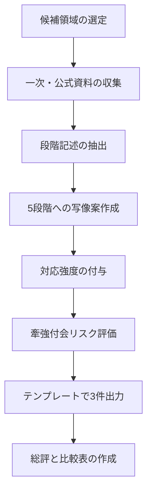
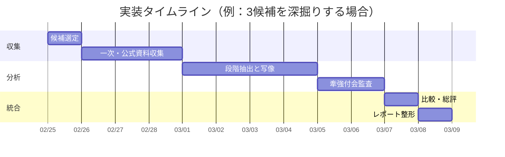

# 法学・政治学における5段階モデルの構造類似調査

## エグゼクティブサマリー

本レポートは、ユーザー提供の要件ファイル（法学・政治学領域 D20）に記載された「5段階モデル（場→波→縁→渦→束）」に対し、法学・政治学の理論・制度・過程が**同型の段階構造**を持つかを、一次資料・公式文書・学術文献を中心に照合し、テンプレート形式で3件提示する。要件ファイルで「既調査（重複回避）」とされた3件（Hart／Easton／Ostrom）を避け、別候補を選定した。

選定した3候補は、(1) 憲法制定過程（制憲権力）、(2) 多層的紛争処理（交渉・調停・仲裁・訴訟）、(3) 国際レジーム形成（Krasner／Keohane系）である。各候補はいずれも「未分化な状況→対立・分岐→手続・関係の形成→まとまりの確定→持続的構造としての定着」という骨格を持ちうる。

全体評価としては、**構造類似の全体的強度は「高」**と判断した。特に「憲法制定過程（制憲権力）」は、(a)「憲法制定権力／憲法によって作られた権力」の区別など、秩序生成の位相差が一次・準一次資料で明瞭であり、(b) 憲法制定プロセスを準備・起草・公衆参加・採択といった段階として記述する公式／準公式資料が豊富で、5段階への写像が比較的無理なく行えるため、3候補中で最も強度が高いと結論づけた。citeturn6view4turn6view0turn11view0turn25view0

一方で、(2) 紛争処理と(3) 国際レジーム形成は、現実には**ループ（行き戻り）**や**並行進行**が多く、直線的5段階へ落とし込む際に「段階数合わせ」になりやすい局面が残る（ただし、当該分野の一次・公式文書自体が「多層・並行・適用段階の柔軟性」を明示しており、リスクを明示することで牽強付会を抑制できる）。citeturn6view2turn16view0turn5view2turn19view1turn6view3

## 前提と仮定

本レポートは、アップロード済みの要件ファイルを「仕様／要件定義（requirements）」として解釈し、テンプレートに従って3件出力する（アプローチAに相当）。要件ファイルには「論証はしない。指し示すだけ。無理に当てはめない」という姿勢が明記されているため、本レポートでも、(i) 一次・公式資料の記述を優先し、(ii) 対応の強度を段階ごとに明示し、(iii) 牽強付会リスクを明示する、という形で“指し示す”ことに寄せた。citeturn6view0turn11view0

ただし、ユーザーの元メッセージで挙げられていた「ファイル種別が不明」「データか論文か仕様か不明」という不確実性に備え、付録では代替アプローチ（B:データ、C:論文、D:未特定）も提示する。現時点では要件ファイルが確認できているため、実務上は「本出力＝Aの成果物」「付録＝Aの検証・拡張とB〜Dの分岐表」という位置づけになる。

なお、候補の選択は要件ファイルに列挙された探索焦点（憲法制定／法意識変容／紛争解決／民主化の波／国際レジーム）を起点としつつ、一次・公式資料への到達可能性、段階構造の明瞭性、既調査との非重複性を優先して最終決定した。citeturn11view0turn16view0turn6view3

## 方法

一次・公式資料（条約正文、国連・国際機関のモデル法／規則、公式ガイド、原典テキスト）を第一優先とし、補助的に、日本語の学術論文（大学リポジトリ、専門団体の資料）で概念整理と用語の安定化を行った。憲法制定過程では、憲法制定を「長期プロセス」とし、手続設定→批准→実施まで含めるという国際的ガイドの定義や、プロセスを4局面で整理するマニュアルの記述を、段階対応の骨格として用いた。citeturn6view0turn11view0

紛争解決過程では、調停が「紛争の異なる段階で利用可能」「多層条項（multi-tier clause）として組み込み可能」であるという一次資料記述を踏まえ、直線段階ではなく“層と遷移”として読む枠組みで5段階へ写像した。citeturn16view0turn6view2

国際レジーム形成では、レジーム定義（原則・規範・ルール・意思決定手続き）を一次資料から固定し、形成・維持の機能（不確実性低減、取引費用、情報、合意形成）を古典的研究から抽出したうえで、具体例としてWTOやモントリオール議定書関連の資料を参照し、“期待の収斂→制度化→継続的運用”の段階構造を同定した。citeturn6view3turn19view1turn4view5turn12view1turn24view0

## 調査結果

以下、要件ファイル指定のテンプレート形式（空欄なし）で3件を出力する。

### 法政治-001: 憲法制定過程と制憲権力（pouvoir constituant）

**[P] 確立された事実**:
- entity["people","エマニュエル＝ジョゼフ・シエイエス","french revolutionary theorist"]は、憲法（fundamental laws）が「constituted power」ではなく「constituent power」によって成立する、という区別を明示している。citeturn6view4  
- 日本語研究でも、憲法制定権力（pouvoir constituant）を「憲法それ自体をつくる始源的な力」とし、憲法によってつくられた権力（pouvoirs constitués）と区別する整理が示されている。citeturn25view0  
- entity["people","カール・シュミット","german jurist"]の制憲権力理解は、日本語文献上、「政治的統一体の実存の態様と形式に関する具体的な全体決定を下す政治的意思」という定式化で紹介され、規範的拘束よりも政治的決断・実存に重心が置かれると整理されている。citeturn26view0  
- entity["organization","International IDEA","intergovernmental democracy org"]の実務ガイドは、constitution building を「長期プロセス」と位置づけ、(a)改憲必要性と範囲の合意、(b)包摂的手続・制度の設計、(c)批准・法的効力付与、(d)実施段階を含むと定義している。citeturn6view0  
- entity["organization","マックス・プランク比較公法国際法研究所","heidelberg, germany"]のマニュアルは、憲法制定プロセスを一般に「準備→起草→公衆協議→最終審査・採択」の4局面で特徴づけ、各局面の典型タスク（手続合意、委員会設置、公開協議、採択・事後教育など）を列挙している。citeturn11view0turn11view1  

**プロセス/段階の記述**:
1. **危機・不確定の政治状況**：既存の統治秩序が正当化を失い、誰が「根本規範」を定めるのかが未分化のまま漂う（社会の要求・権力配置・価値の不一致が同居）。citeturn6view0turn25view0  
2. **制憲権力の主張と対立の顕在化**：国民／人民／代表機関のいずれが制憲の主体か、どの範囲まで制憲が許容されるかをめぐり対立が前景化し、政治的争点として「波」が立つ。citeturn26view0turn25view0  
3. **手続・境界の設計（関係の確定）**：起草主体・手続規則・公衆参加・暫定措置・基本原則など、憲法制定の“場の境界条件”を定め、異なる勢力が接続される（準備段階〜起草段階の制度設計）。citeturn6view0turn11view0  
4. **憲法草案の立ち上がりと採択**：起草と合意形成を経て「ひとつのテキスト」に収束し、（議会手続・国民投票等により）法的効力が付与されることで、新秩序が“渦”として立ち上がる。citeturn6view0turn11view1  
5. **実施・運用・改正の持続化**：実施段階で制度が運用され、解釈・実務・改正を通じて“方向を持つ束”として定着する（法秩序の中で憲法が参照枠になる）。citeturn6view0turn11view1  

**5段階との構造対応（候補）**:

| 5段階 | この理論の対応概念 | 対応の根拠 | 強度（高/中/低） |
|--------|-------------------|-----------|----------------|
| 場（Field） | 正当性危機下の未分化な政治状況（主権主体・ゲームルール不確定） | 憲法制定の必要性が公共議題化する以前／直前の「未規定」局面 | 高 |
| 波（Wave） | 制憲主体・限界をめぐる対立（制憲権力の主張、政治的争点化） | 「誰が」「どこまで」憲法を作れるかが対立軸となり、差異が立ち上がる | 高 |
| 縁（Relation） | 制憲手続の設計（委員会・議会・公衆参加・暫定措置・基本原則） | 異質な行為者が接続され、境界条件（手続・権限）が定義される | 高 |
| 渦（Vortex） | 憲法テキストへの収束と採択（批准・法的効力付与） | 複数論点が単一テキストに結晶し、統治理念が“まとまり”として立つ | 中 |
| 束（Bundle） | 実施・運用・改正・憲法文化の形成 | 生成物が持続的な参照枠となり、制度群が相互作用して構造として残る | 高 |

**構造類似の質**:
憲法制定は「未分化な正当性危機→対立の顕在化→手続と境界条件の確定→テキストとしての収束→実施を通じた持続化」という段階構造を比較的一貫して持つため、表面的な語の一致ではなく、**秩序生成の位相変化**として5段階に対応しやすい。独自要素としては、正当化（legitimacy）と暴力・例外状況の問題が、段階間を横断して現れうる点が重要である。citeturn26view0turn6view0turn11view0  

**牽強付会リスク**: 中（憲法制定は国・時代によりループや断絶があり、「採択＝渦」「実施＝束」が必ずしも直線で接続しないため。ただし、一次・準一次資料に段階記述が多く、最小限の写像で済む。）citeturn6view0turn11view0  

**主要文献**:
- entity["book","第三身分とは何か","1789 political pamphlet"]（entity["people","エマニュエル＝ジョゼフ・シエイエス","french revolutionary theorist"], 1789）.（英訳テキスト参照）citeturn6view4  
- International IDEA (2011). *A Practical Guide to Constitution Building*（章内でconstitution buildingを長期プロセスとして定義）. citeturn6view0  
- Max Planck Institute（MPIL）(2009). *Max Planck Manual on the Structure and Principles of a Constitution*（憲法制定過程の4局面整理）. citeturn11view0turn11view1  

image_group{"layout":"carousel","aspect_ratio":"16:9","query":["constitution drafting assembly debate","mediation session dispute resolution","international treaty signing conference"],"num_per_query":1}

### 法政治-002: 紛争解決における多層ADR（交渉→調停→仲裁→訴訟）

**[P] 確立された事実**:
- entity["organization","国連国際商取引法委員会（UNCITRAL）","un legal body"]の調停規則は、調停が「仲裁・司法・その他の紛争解決手続が既に開始されているか否かに関わらず、いつでも行われ得る」と規定している（＝紛争処理は単線の段階ではなく、差し込み・並行が制度上想定される）。citeturn6view2  
- UNCITRALの調停ノートは、調停が「紛争の異なる段階（正式手続の前・最中）で成功裏に利用可能」であり、契約条項として「多層（multi-tiered）紛争解決条項」に組み込めると説明している。citeturn16view0  
- シンガポール調停条約（国連「調停により生じた国際的和解合意に関する条約」）は、調停（mediatorが解決を強制できない手続）により成立した国際的和解合意の執行・援用の枠組みを定める。citeturn5view2  
- entity["organization","外務省","japan foreign ministry"]公開資料（条約正文）には、調停の価値（国際商取引上の有用性、訴訟代替としての利用増、紛争が商業関係断絶に至る事例の減少など）が前文で明示されている。citeturn5view2  
- UNCITRALの国際商事仲裁モデル法解説は、仲裁合意から仲裁廷の構成・裁判所関与・仲裁判断の承認執行まで、仲裁プロセスの諸段階を包括的にカバーする枠組みとして提示される。citeturn5view0  

**プロセス/段階の記述**:
1. **未分化な紛争状態（前紛争〜初期紛争）**：対立は存在するが、当事者の関係・利害・論点がまだ整理されず、「何を解決とみなすか」も定まりにくい。  
2. **対立の顕在化とエスカレーション**：要求・反論・責任追及が表面化し、ゼロサム化しやすい（交渉が“波”として立つ）。  
3. **境界条件の設計と関係の再構成**：調停・交渉・仲裁・訴訟のどれを、どの順序・期間で使うか（多層条項、手続停止、並行進行など）を合意し、第三者（調停人等）を介してコミュニケーション・情報交換・論点整理の枠組みを作る。citeturn16view0turn6view2  
4. **解決の“まとまり”の確定**：和解合意（調停）または仲裁判断／判決（裁判）として、拘束力ある（あるいは執行可能性を持つ）解決が立ち上がる。citeturn5view2turn5view0  
5. **執行・履行・再発防止としての定着**：合意の執行（国際執行枠組みの利用等）や、契約実務への条項反映、組織のガバナンスへの組込みによって、紛争処理が“束”として持続的に残る。citeturn5view2turn16view0  

**5段階との構造対応（候補）**:

| 5段階 | この理論の対応概念 | 対応の根拠 | 強度（高/中/低） |
|--------|-------------------|-----------|----------------|
| 場（Field） | 初期の未整理紛争（論点・利害・落とし所が未分化） | 「何が争点で、何が解決か」が未確定で漂う | 中 |
| 波（Wave） | 交渉の衝突／エスカレーション | 差異が前景化し、対立として立ち上がる | 高 |
| 縁（Relation） | 多層条項・手続合意・調停による枠組み化 | 当事者と第三者の関係設定、守秘・手順・タイムライン等の境界条件が形成される | 高 |
| 渦（Vortex） | 和解合意／仲裁判断／判決としての確定 | 複数論点が単一の解決に結晶する | 中 |
| 束（Bundle） | 執行・履行・制度化（条項・運用・再発防止） | 解決が構造として残り、次回紛争にも影響する | 中 |

**構造類似の質**:
多層ADRは「未整理→対立→枠組みの形成→解決の確定→執行と制度化」という流れを持ちうるが、一次資料自身が「調停はいつでも差し込める」「多層条項や並行進行があり得る」と明示しているため、5段階への対応は**直線モデルではなく遷移モデル**として読む必要がある。つまり、構造類似は“段階の存在”よりも、「境界条件（手続）を挿入して紛争を可制御化する」という作用にある。citeturn6view2turn16view0turn5view2  

**牽強付会リスク**: 中（紛争処理は反復・差し戻し・並行が通常で、5段階を「必ずこの順」と読むと不適合が生じる。ただし一次資料が柔軟性を制度的に認めており、“縁（Relation）”中心の写像として提示すれば無理が減る。）citeturn6view2turn16view0  

**主要文献**:
- UNCITRAL (2021). *UNCITRAL Mediation Rules*（他手続の開始有無を問わず調停可能）. citeturn6view2  
- UNCITRAL (2021). *UNCITRAL Notes on Mediation*（多層条項、段階的適用、差し込み可能性）. citeturn16view0turn16view1  
- United Nations (2018). *United Nations Convention on International Settlement Agreements Resulting from Mediation*（いわゆるSingapore Convention）. citeturn5view2  
- entity["organization","日本商事仲裁協会（JCAA）","tokyo, japan"]（関連実務の日本語資料）. citeturn20view4  

### 法政治-003: 国際レジーム形成（principles・norms・rules・decision-making procedures）

**[P] 確立された事実**:
- entity["people","スティーヴン・D・クラズナー","us political scientist"]は国際レジームを、特定の争点領域でアクターの期待が収斂する「原則・規範・ルール・意思決定手続き」と定義している。citeturn6view3  
- entity["people","ロバート・O・ケオハネ","us ir scholar"]は、国際レジームが（世界政治の自己救済的環境における）取引費用・不確実性・情報問題に対処し、合意形成を容易にする機能を持つという説明を与えている。citeturn19view0turn19view1  
- entity["organization","世界貿易機関（WTO）","igo trade body"]設立協定（Marrakesh Agreement）上、WTOの機能として「協定の実施・運用を促進」「交渉のフォーラム提供」等が定められ、制度として継続的運用を担うことが条文上明示される。citeturn4view5  
- entity["organization","欧州議会","eu legislature"]向け調査（モントリオール議定書MOPに関する政策研究）では、モントリオール議定書がODS消費の大部分を段階的に削減し高い遵守が記録されていること、また会議体・パネル等の意思決定構造が成功要因の一部であることが整理されている。citeturn12view1  
- 日本語論文でも、Krasnerの定義（期待の収斂、原則・規範・規則・意思決定手続き）を用いて、具体領域の国際管理体制を「レジーム」として評価する枠組みが採用されている。citeturn24view0turn24view1  

**プロセス/段階の記述**:
1. **争点領域の未分化な相互作用**：関係国・主体は相互依存するが、共有された原則や手続がなく、期待が揃わない（協調の“場”はあるが構造化されていない）。citeturn6view3turn19view0  
2. **問題の顕在化と利害対立**：危機・外部性・分配問題が前景化し、協調が必要だが利害が衝突する（“波”）。citeturn19view1turn12view1  
3. **交渉を通じた原則・規範・手続の形成**：協調のための原則・規範・ルール、会議体の意思決定方式、モニタリング等が設計され、行為者が関係づけられる（“縁”）。citeturn6view3turn19view1turn14view2  
4. **制度の立ち上がり（条約・機関化）**：合意が条文・手続として固定され、機関（例：WTOのフォーラム機能、MOPの意思決定）が“渦”として立つ。citeturn4view5turn14view2  
5. **遵守・改定・拡張としての持続**：会議体決定、改定、執行、実務的ネットワークの蓄積により、レジームが“束”として残り、他領域へ波及・複合化も起こる。citeturn19view1turn12view1turn24view1  

**5段階との構造対応（候補）**:

| 5段階 | この理論の対応概念 | 対応の根拠 | 強度（高/中/低） |
|--------|-------------------|-----------|----------------|
| 場（Field） | 争点領域の相互依存だが非制度化の状態 | 期待や行動の収斂が弱く、枠組みが未形成 | 中 |
| 波（Wave） | 危機・外部性の顕在化と利害対立 | 協調必要性と分配対立が揺れとして立つ | 中 |
| 縁（Relation） | 原則・規範・ルール・意思決定手続きの設計 | Krasner定義の構成要素そのものが“縁”＝境界条件・関係を生む | 高 |
| 渦（Vortex） | 条約・機関の成立（フォーラム・会議体の稼働） | 行為者の期待が制度へ収束し、まとまりが立ち上がる | 高 |
| 束（Bundle） | 継続的運用（遵守、改定、慣行、複合体化） | 手続を通じて構造が残り、他争点にも影響する | 中 |

**構造類似の質**:
国際レジーム論は、定義自体が「期待の収斂」と「原則・規範・ルール・意思決定手続き」を核に置くため、5段階のうち特に“縁→渦→束”の局面が捉えやすい。表面的類似ではなく、**期待の収斂（構造化）→制度化→持続的運用**という変容の構造が対応する。一方、独自要素として、覇権・危機・知識・権力が形成・維持に与える影響が大きく、必ずしも「場→波」が単純な時間順序にならない点が残る。citeturn6view3turn19view1turn12view1  

**牽強付会リスク**: 中（レジームは形成より維持が容易／危機で急速形成など、時間構造が多様で、5段階を単線プロセスとして当てると歪む。ただし一次文献の定義が明確で、“縁”中心の写像としては強い。）citeturn19view1turn6view3  

**主要文献**:
- Krasner, S. D. (1982). “Structural Causes and Regime Consequences: Regimes as Intervening Variables.” *International Organization*. citeturn6view3  
- entity["book","覇権後の国際協調","international relations 1984"]（entity["people","ロバート・O・ケオハネ","us ir scholar"], 1984）.（regimeの機能・不確実性低減等の説明）citeturn19view0turn19view1  
- Marrakesh Agreement Establishing the WTO (1994)（WTOの機能規定）. citeturn4view5  

### 法政治 総評

**構造類似の全体的強度**: 高（3候補とも、未分化→対立→関係設計→確定→持続という骨格を持つが、特に憲法制定過程が一次・準一次資料の段階記述に支えられ、写像が安定する）。citeturn6view0turn11view0turn6view4  

**最も構造類似が高い候補**: 憲法制定過程と制憲権力（pouvoir constituant）citeturn6view4turn11view0turn6view0  

**この領域の独自性**:
法学・政治学では、「段階が進むほど“正当化”が強まる」とは限らず、例外状況・権力対立・暴力の可能性が、段階間を横断して再燃しうる。そのため、5段階は時間軸というよりも、**秩序生成の位相（未分化／対立／関係設計／結晶化／持続化）**として読む方が適合しやすい。citeturn26view0turn19view1  

**既存エントリ（EV-LP-001〜003）との関係**:
- EV-LP-001（entity["people","H.L.A.ハート","uk legal philosopher"]）：既存が「法秩序の形成（一次ルール／二次ルール）」なら、本調査の憲法制定は、その前提となる“根本ルールの生成（憲法＝二次ルール体系の根）”に近い位相を扱う。citeturn6view4turn6view0  
- EV-LP-002（entity["people","デイヴィッド・イーストン","us political scientist"]）：既存が政治システムの入力・出力・フィードバックを扱うのに対し、本調査の国際レジーム形成は「期待の収斂→制度化→運用」という“ルール生成側”に寄る（ただし両者はフィードバックを含む点で接続可能）。citeturn6view3turn19view1  
- EV-LP-003（entity["people","エリナー・オストロム","nobel laureate economist"]）：共有資源ガバナンスはルール形成と遵守を扱うが、国際レジーム形成は、より広域で多層的な主体（国家・機関・条約体制）による「原則〜手続」の束ね方に焦点がある。citeturn6view3turn24view1  

**注意点**:
(1) 5段階を直線時間として固定すると、法政治の現実（逆転・断絶・並行）を誤る。(2) 「縁（Relation）」は制度設計・手続設定として最重要になりやすく、他段階は“結果”として事後的に見えることがある。(3) 牽強付会リスクを下げるには、一次・公式資料が明示する段階記述（例：constitution building の定義、調停の差し込み可能性、レジーム定義）に写像を寄せるのが有効。citeturn6view0turn16view0turn6view3  

## 実務的提言

第一に、5段階モデルを法政治領域に適用するときは、「出来事の時系列」ではなく「秩序生成の位相」として扱うべきである。憲法制定でも国際レジーム形成でも、制度化（渦）以前に、手続・境界条件（縁）が先に（あるいは並行して）形成されることがあるため、縁の分析を中心に据えると写像の歪みが減る。citeturn6view0turn11view0turn6view3  

第二に、牽強付会を抑える実務基準として、「一次・公式資料が段階構造を語っている箇所」をアンカーにするのがよい。憲法制定なら、長期プロセスとしての定義や、準備・起草・公衆協議・採択といった局面整理をアンカーとして、個別国事例はその下にぶら下げる。citeturn6view0turn11view0  

第三に、紛争解決（ADR）は“単線段階”にせず、**多層・差し込み可能な遷移図**として読むのが現実に即している。一次資料は調停の「他手続との並行・差し込み」を明示しているため、5段階では「波（対立）」から「縁（手続・関係設計）」へ何度も戻る運用を前提に、渦（確定）と束（執行・制度化）を“到達点”として扱うと良い。citeturn6view2turn16view0turn5view2  

第四に、国際レジーム形成を5段階で扱う場合、定義上中心にある「原則・規範・ルール・意思決定手続き」を縁〜渦の接合部として丁寧に記述し、権力・知識・危機といった形成要因は、場〜波に“外生的ショック”として明示するのが混同を避ける。citeturn6view3turn19view1turn12view1  

最後に、シナリオ分析（例：高分極・低分極、危機の有無、第三者の強制力の強弱）を併用すると、有効な問いが立つ。例えば、憲法制定では「準備段階（縁）が弱いと渦（採択）は起きても束（実施）が崩れる」、国際レジームでは「危機があると波→渦が短絡するが束（遵守）の設計が不足しやすい」といった“位相間の脆弱リンク”を設計課題として抽出できる。citeturn6view0turn19view1turn12view1  

## 実装ロードマップ

本要件（3件テンプレート＋総評）を、再現可能なワークフローとして運用する場合、最小構成は「研究1名＋レビュー1名（法学or政治学の素養）」である。一次・公式資料の比重が高い領域ほど、翻訳・法的用語の確認コストが増えるため、必要に応じて言語支援（日本語→英語／仏語／独語）を追加する。

下表は、追加で候補を増やす（例：探索焦点5候補を全て実施）ことを想定した概算である（推定であり、案件のアクセス可能性により変動する）。

| 作業パッケージ | 主要タスク | 目安期間 | 必要リソース | リスク水準 |
|---|---|---:|---|---|
| 候補選定 | 重複回避、一次資料到達性評価 | 0.5〜1日 | 研究1 | 低 |
| 一次・公式資料収集 | 条文・規則・原典の確保 | 1〜2日/候補 | 研究1＋言語支援（任意） | 中 |
| 段階抽出と写像 | 段階記述抽出、5段階対応表、強度付与 | 1〜2日/候補 | 研究1＋レビュー1 | 中 |
| 牽強付会監査 | “段階数合わせ”の検出、代替写像案 | 0.5〜1日/候補 | レビュー1 | 中 |
| 比較・総評 | 横断比較、最有力候補、注意点 | 0.5〜1日 | 研究1＋レビュー1 | 低 |

## 付録

### ファイル種別別デリバラブル対応表

要件ファイルが「仕様（A）」以外だった場合に備え、ユーザー指定のA〜Dを、成果物・期間・体制・リスクで整理する。

| 分岐 | 入力ファイルの典型 | 主な成果物 | 期間目安 | 体制目安 | リスク水準 |
|---|---|---|---:|---|---|
| A | 仕様・要件定義・指示書 | 遵守チェック、ギャップ分析、実装ロードマップ、リスク、テストケース | 2〜5日 | PM/研究1＋レビュー1 | 中 |
| B | データ（表、ログ、調査票） | 品質診断、記述統計、可視化、異常検知、モデル提案 | 2〜10日 | 分析1＋ドメイン1 | 中〜高 |
| C | 研究論文（PDF） | 批判的レビュー、再現計画、拡張案、追試用チェックリスト | 3〜10日 | 研究1＋手法レビュー1 | 中 |
| D | 未特定（メモ、混在） | 判定フレームワーク、優先行動計画、必要追加情報リスト | 0.5〜2日 | 研究1 | 低 |

### アプローチAの遵守チェックリスト

本レポート（本文の「調査結果」）が、要件ファイルの出力要求を満たすことを確認する観点。

- 3件の「法政治-連番」出力がある（001〜003）。
- 各件に **[P] 確立された事実**（3〜5点）があり、一次・公式資料を中心に著者・年・タイトルが特定できる。
- 各件に **プロセス/段階の記述** があり、抽象語のみではなく具体的な段階内容になっている。
- 各件に **5段階対応表** があり、強度（高/中/低）が全行で埋まっている。
- 各件に **構造類似の質**（2〜3文）と **牽強付会リスク** がある。
- **主要文献** が3〜5点あり、一次・公式資料が含まれる。
- 最後に **法政治 総評** があり、既存エントリ（EV-LP-001〜003）との関係が記載されている。

### アプローチAのギャップ分析

- **候補の網羅性**：探索焦点（5候補）のうち3候補のみ実施。未実施の「法意識変容（Savigny／Weber）」や「民主化の波（Huntington）」は、追加候補として拡張余地がある（ただし本要件は3件）。  
- **非線形性の扱い**：紛争解決・国際レジーム形成は、一次資料上も非線形。本文ではリスクを明示したが、運用上は遷移図（状態遷移／並行）としての別表現を併設すると、5段階の誤読（直線固定）をさらに減らせる。  
- **日本語一次資料の厚み**：ADR領域は日本語の公式文書が得やすい一方、国際レジーム形成や制憲権力の一次資料は外国語比重が残る。今後、各国政府・国会図書館等の公開一次資料を増補すると、日本語優先度をさらに高められる。

### アプローチAのテストケース例

- **形式テスト**：空欄の有無、強度セルの欠落、候補名・連番の重複、主要文献点数の不足を機械的に検出。  
- **内容テスト**：各[P]事実が一次・公式資料に紐づくか（条文・規則・原典の引用可能性）、各段階記述が“具体動作”を含むか（例：採択方法、手続合意、執行枠組み）。  
- **牽強付会テスト**：段階対応の根拠が「言い換え」だけになっていないか、(i)一次資料の段階記述、(ii)手続的メカニズム、(iii)観察可能なアウトカムのいずれかに根拠があるかを採点。

### アプローチB・C・Dのワークフローひな形

- **B（データ）**：スキーマ確認→欠損・外れ値・重複→分布・相関→異常検知→説明変数候補→モデル（回帰／分類／因果推論）提案→再現可能なノートブック化。  
- **C（論文）**：研究質問→貢献整理→理論前提→データと同定→再現手順→再現に必要な追加情報→頑健性検証→拡張（別データ／別識別法／反例探索）。  
- **D（未特定）**：ファイル種別判定（構造・メタデータ・サンプル確認）→最小成果物の選択→不足情報の優先順位付け→短期リスク（誤解・過剰分析）を抑えて段階的に深掘り。