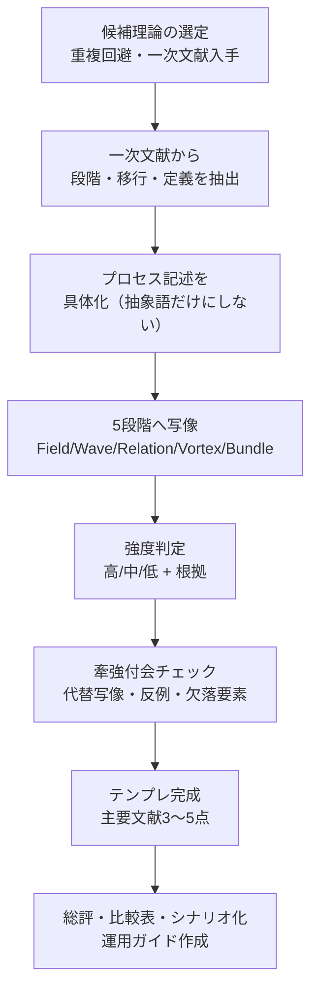
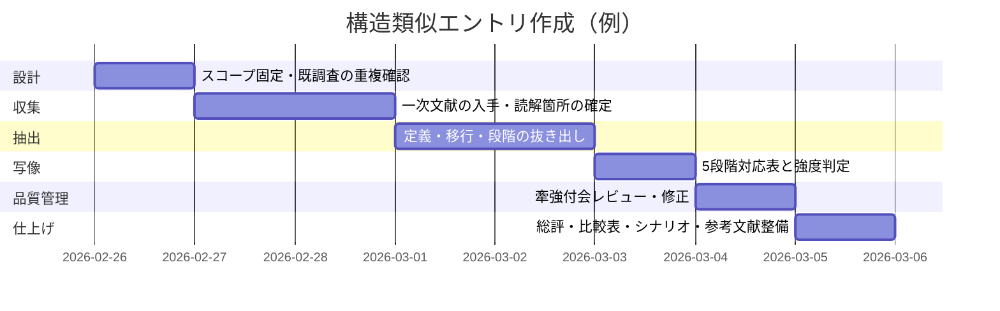

# 経済学における「5段階モデル」構造類似調査

## エグゼクティブサマリー

本調査は、指定ファイルの要件（「経済学の理論・現象を調査し、5段階モデル（場→波→縁→渦→束）と同型のプロセス構造をもつ候補を3件、所定テンプレートで記入」）に従い、一次文献（原著・原論文）中心で3件のエントリを作成した。一次文献だけでは日本語での運用・応用の接続が弱くなるため、日本の公的資料（イノベーション定義や金融システム安定に関する公式レポート）も補助線として併用した。citeturn5view0turn5view2turn7view0turn9view1turn15view0turn16view0

結論として、5段階モデルとの構造対応が比較的“無理なく”指し示しやすいのは、(a)定常からの逸脱→(b)差異の増幅→(c)関係（金融・制度・競争）の編成→(d)局所的なまとまり（新体制・脆弱性・制度改変）の立ち上がり→(e)新たな構造の固定化、という時間発展を明示的に含む理論である。本稿ではその要件を満たすものとして、entity["people","ジョゼフ・シュンペーター","austrian economist"]（創造的破壊／イノベーション循環）、entity["people","ハイマン・ミンスキー","us economist"]（金融不安定性仮説）、entity["people","ダグラス・ノース","us economist"]（制度変化と経路依存）を採択した。citeturn8view0turn7view0turn9view3

実務的には、(1)「一次文献から“段階”を抜く」ための抽出手順、(2)牽強付会を抑えるためのチェックリスト（強度判定・代替写像・反例探索）、(3)成果物を再利用可能にするためのテンプレート規律（用語集・引用管理・レビュー手順）をセットで運用するのが有効である。日本の政策文書でも、イノベーションを“広義の新結合”として扱い、また金融安定をマクロプルーデンスの枠でシナリオ分析・ストレステストに接続しているため、作成した3エントリは（研究用途だけでなく）政策・企業実務の“説明の骨格”にも転用しやすい。citeturn16view0turn15view0turn19view0

## 背景とスコープ

本依頼の中心要件は「5段階モデル（場／波／縁／渦／束）と**同型のプロセス構造**をもつ経済学の理論・現象を3件選び、一次文献根拠で、テンプレートを全欄埋めて出力する」ことにある。ここでの「構造類似」は、語彙の一致ではなく、**（A）未分化な前提的状態→（B）差異の立ち上がり→（C）境界・関係の編成→（D）まとまりの成立→（E）構造としての残存**という“段階的変容の流れ”が対応するか、を問う枠組みである。

スコープ解釈は次のとおり。
- **成果物の第一優先**：ファイル指定テンプレートに沿った3件のエントリ＋総評。
- **深掘り要件への対応**：上記成果物を中核に据えつつ、一次／公式／学術／業界資料を補助的に追加し、比較表・シナリオ分析・実装チェックリストまで含めて“再現可能な作業手順”として整形する（ただし、テンプレート自体は厳守）。

既調査として挙げられている「一般均衡とタトヌマン」「進化経済学の変異-選択-保持」「情報の非対称性と市場選別」との重複は避ける（候補選定における制約条件）。

## 調査方法

一次文献の要件を満たすため、各候補について「著者自身が定義・段階・移行（transition）を語っている箇所」を優先的に抽出した。具体的には、シュンペーターでは“循環（circular flow）から新結合へ、信用が資源を引き剥がし、創造的破壊として構造が更新される”という連鎖を、該当ページから拾っている。citeturn5view0turn8view0turn5view2  
ミンスキーでは、Working Paper No.74（1992）における「ヘッジ／スペキュレーティブ／ポンジの3区分」および「繁栄が続くと安定的関係から不安定的関係へ移行する」という“2つの定理”を中核根拠とした（同文献に明示されているため、段階写像の恣意性が相対的に下がる）。citeturn7view0  
ノースでは、1990年の著書冒頭での定義（制度＝ゲームのルール／人為的制約、制度と組織の区別、執行と非公式制約、経路依存と増加収穫）を一次根拠として採用し、1991年論文で“制度は漸進的に進化し、過去と現在と未来をつなぐ”という時間方向性を補強した。日本語での補助線として、entity["organization","経済産業研究所（RIETI）","policy think tank | tokyo, japan"]掲載の制度論講義資料（ノースの「ゲームのルール」概念とフォーマル／インフォーマルの摩擦）も参照した。citeturn9view1turn6view1turn6view2

“深掘り”要件（公的・業界資料）として、イノベーション概念の公的整理（entity["organization","内閣府","government office | tokyo, japan"]の年次報告におけるシュンペーターの広義の5類型）citeturn16view0turn16view1、金融システム安定の公式枠組み（entity["organization","日本銀行","central bank | tokyo, japan"]『金融システムレポート』のマクロプルーデンス定義・目的・転載方針）citeturn15view0、国際的な整理（entity["organization","国際決済銀行（BIS）","intl org | basel, switzerland"]によるマクロプルーデンス文献レビュー、内生循環観＝ミンスキー流の位置づけ）citeturn19view0、計測基準（entity["organization","経済協力開発機構（OECD）","intl org | paris, france"]のentity["book","Oslo Manual 2018","oecd innovation manual 2018"]）citeturn17search0turn17search4を併用した。

選定基準（インクルージョン）は、(1)一次文献で主要メカニズムが明示される、(2)時間発展／移行が核にある、(3)既調査3件と実質的に重ならない、(4)5段階に写像したとき“少なくとも3段階以上”が強度「中」以上で埋まる、である。

## 経済学 構造類似エントリ

### 経済学-001: entity["people","ジョゼフ・シュンペーター","austrian economist"]の創造的破壊とイノベーション循環

**[P] 確立された事実**:
- entity["book","The Theory of Economic Development","schumpeter 1934 english"]では、発展の中核現象を「循環（circular flow）から生産手段を引き剥がし、新しい結合（new combinations）へ配分する」問題として定式化し、その実現手段として信用（credit）を明示する。citeturn5view0
- 同書は、新結合の実行が、しばしば既存企業の延長ではなく“新しい企業体”として体現され、競争経済では旧来結合の排除（置換）を伴うことを述べる（＝更新が「並存→淘汰」を含む）。citeturn8view0
- 同書は、企業家（entrepreneur）を「実際に新結合を遂行する者」として定義し、企業家的状態が恒常的職業ではなく“遂行時にのみ成立する機能”であることを強調する。citeturn8view1
- 信用は「循環の既存の購買力の移転」ではなく、「新たな購買力の創出」として描かれ、新結合の資金調達における決定的契機として位置づけられる。citeturn5view0
- entity["book","Capitalism, Socialism and Democracy","schumpeter 1942 book"]（創造的破壊章）では、資本主義を内側から革命化し、旧構造を破壊し新構造を創出する「創造的破壊」を“資本主義の本質的事実”として提示し、その変化が離散的な突進（discrete rushes）と吸収過程の反復として景気循環に接続される。citeturn5view2

**プロセス/段階の記述**:
1. **循環（circular flow）の前提**：既存の生産・分配が慣行として回り、資源配分は既定の結合に固定される（未分化というより「既定の流路」）。citeturn5view0turn8view2  
2. **差異の立ち上がり＝新結合の萌芽**：新しい結合（製品・方法・市場・資源・組織の刷新）が、既存の結合の横に現れる。多くは新企業として立ち上がり、旧来の担い手が自動的に変身するわけではない。citeturn8view0  
3. **資源の引き剥がしと接続**：新結合は“未使用資源”ではなく、原則として既存結合から生産手段を引き剥がして再配分する。その媒介として信用が働き、循環内の生産者をアウトビッドして資源を動かす。citeturn5view0turn8view0  
4. **まとまりとしての立ち上がり＝企業家的実行**：企業家が新結合を実際に遂行する局面で、競争上の置換が進む（旧来の結合が圧迫される）。ここで“新体制の局所的なまとまり”が成立する。citeturn8view1turn8view0  
5. **構造としての残存＝創造的破壊の定着**：破壊と創造の連鎖が経済構造を内側から更新し、更新→吸収→再更新の時間構造として景気循環的に現れる。citeturn5view2

**5段階との構造対応（候補）**:

| 5段階 | この理論の対応概念 | 対応の根拠 | 強度（高/中/低） |
|--------|-------------------|-----------|----------------|
| 場（Field） | 循環（circular flow）としての既定の流路 | 変化が起きる前提場（資源・慣行・既存結合） | 高 |
| 波（Wave） | 新結合の萌芽／離散的な突進 | 場の中に差異が立ち上がり、既存との対立と揺れが生じる | 中 |
| 縁（Relation） | 信用による資源の引き剥がしと再配分（アウトビッド） | 境界（旧結合↔新結合）で関係が編まれ、資源移動が制度的に起動する | 高 |
| 渦（Vortex） | 企業家による新結合の遂行／新企業の立ち上がり | ひとつのまとまりが立ち上がり、競争上の置換が進む | 高 |
| 束（Bundle） | 創造的破壊としての構造更新＋吸収（景気循環として残る） | 渦が連鎖し、方向性を持つ更新プロセスが“構造”として残存する | 中 |

**構造類似の質**:
この候補は、循環→差異→信用媒介→実行→構造更新という“流れ”が一次文献内に比較的明瞭にあるため、5段階への写像が説明的に成立しやすい。一方で、創造的破壊は「連続過程＋離散的突進」という二重性を持つため、5段階を“1回の変容”として切るのか、“波の反復”として取るのかで読みが分岐する。citeturn5view2turn8view0turn5view0

**牽強付会リスク**: 中（創造的破壊が“反復構造”を強く持つため、5段階を単発プロセスとして固定すると切断点が恣意的になりうる）

**主要文献**:
- Schumpeter, J. A. (1934). *The Theory of Economic Development: An Inquiry into Profits, Capital, Credit, Interest, and the Business Cycle*. Harvard University Press.citeturn5view0turn8view0turn8view1  
- Schumpeter, J. A. (1942). *Capitalism, Socialism and Democracy*. Harper & Brothers.citeturn5view2  
- Schumpeter, J. A. (1939). *Business Cycles: A Theoretical, Historical and Statistical Analysis of the Capitalist Process*. McGraw-Hill.citeturn0search2  

### 経済学-002: entity["people","ハイマン・ミンスキー","us economist"]の金融不安定性仮説

**[P] 確立された事実**:
- entity["book","The Financial Instability Hypothesis","minsky 1992 working paper"]（Working Paper No.74, 1992）は、経済主体の所得—債務関係を「ヘッジ／スペキュレーティブ／ポンジ」の3類型として定義し、各類型をキャッシュフローが元利支払いを満たすか／元金返済はロールオーバーに依存するか／利払いすら資産売却や追加借入に依存するかで区別する。citeturn7view0
- 同文献は、(i)安定的な金融レジームと不安定な金融レジームが存在する、(ii)繁栄が長く続くと安定的関係から不安定的関係へ移行する、という2つの定理として金融不安定性仮説を提示し、さらに好況が続くほどヘッジ優位からスペキュレーティブ／ポンジの比重が増すと述べる。citeturn7view0
- 同文献は、インフレ局面で金融引締めが行われるとスペキュレーティブがポンジ化し、キャッシュフロー不足主体が資産売却を迫られ、資産価格の崩壊につながりうるメカニズムを記述する。citeturn7view0
- 同文献は、景気循環を外生ショックに依存せず、資本主義経済の内部動学（および、それを抑え込む介入・規制の体系）から生成されうるモデルとして提示する。citeturn7view1
- 1977年論文（Challenge）は、「安定的成長は両立しない」「うまくいくこと（doing well）が投機的ブームへ転化する傾向が基本的不安定性」であると述べ、またヘッジ／スペキュレーティブ／ポンジの区別と、金利上昇が段階的に脆弱性を増幅することを示す。citeturn20view0

**プロセス/段階の記述**:
1. **“安定的”な金融構造の前提**：ヘッジ金融主体が相対的に多く、元利支払いが営業キャッシュフローで賄える（余裕＝margin of safetyが厚い）。citeturn7view0  
2. **好況によるリスク認知の低下と拡張**：繁栄の持続が、負債金融の拡大と金融革新を促し、資産価格と投資を押し上げる（doing well → speculative boom）。citeturn20view0  
3. **関係の編成＝ロールオーバー構造の常態化**：スペキュレーティブ金融が増え、元金返済が借換え（roll over）に依存する主体が増加する。金融市場の“通常運転”への依存度が上がる。citeturn7view0turn20view0  
4. **脆弱性の渦＝ポンジ化と増幅**：キャッシュフローが利払いにも不足するポンジ主体が増え、わずかな金利上昇・利益減・資産価格下落が連鎖増幅されやすい状態になる。citeturn7view0turn20view0  
5. **束＝清算・介入・再設計**：資産売却の連鎖や価格崩壊（debt-deflation方向）が現実化しうる。他方で、当局介入・規制・最後の貸し手機能により全面崩壊が中断される場合もあり、結果として“次の局面”を規定する枠組み（制度・規制・行動）が更新される。citeturn7view1turn20view0

**5段階との構造対応（候補）**:

| 5段階 | この理論の対応概念 | 対応の根拠 | 強度（高/中/低） |
|--------|-------------------|-----------|----------------|
| 場（Field） | ヘッジ優位の金融レジーム（余裕のある構造） | まだ差異が顕在化しない“安定の前提場” | 中 |
| 波（Wave） | 好況が招く負債拡張・金融革新・投機化 | 場の中でリスクテイクが増幅し揺れが立ち上がる | 高 |
| 縁（Relation） | 借換え依存・金融市場への接続（ロールオーバー） | 境界＝キャッシュフローと契約支払いの接点で関係が編まれる | 高 |
| 渦（Vortex） | ポンジ化・資産売却・価格崩壊の自己増幅 | ひとつの“危機のまとまり”として立ち上がる | 高 |
| 束（Bundle） | 介入／規制／再編による次のレジーム形成 | 危機後に構造（制約と行動）が残り、次の循環の方向を決める | 中 |

**構造類似の質**:
Working Paper（1992）が“2つの定理”として移行構造を明示しているため、5段階のうち少なくとも「波（増幅）」「渦（崩壊）」の核が強い。加えて、ヘッジ→スペキュレーティブ→ポンジという類型は“段階モデル”として読めるため、構造対応の指し示しが容易である。citeturn7view0turn20view0

**牽強付会リスク**: 低〜中（類型と移行が一次文献に明記されている一方、5段階の「縁／束」をどこまで制度・介入に含めるかで解釈が分岐する）

**主要文献**:
- Minsky, H. P. (1992). *The Financial Instability Hypothesis*. Working Paper No. 74, The Jerome Levy Economics Institute.citeturn7view0turn7view1  
- Minsky, H. P. (1977). *The Financial Instability Hypothesis*（Challenge掲載版）.citeturn20view0  
- Minsky, H. P. (1986). *Stabilizing an Unstable Economy*. Yale University Press.citeturn5view1  

### 経済学-003: entity["people","ダグラス・ノース","us economist"]の制度変化と経路依存

**[P] 確立された事実**:
- entity["book","Institutions, Institutional Change and Economic Performance","north 1990 cambridge"]は、制度を「社会におけるゲームのルール」、より形式的には「人間が作り出した、人間相互作用を形づくる制約（humanly devised constraints）」と定義し、フォーマルな規則とインフォーマルな規範・慣習、および執行（enforcement）のコストを制度機能の中心に置く。citeturn9view1turn9view0
- 同書は「ルール（制度）とプレイヤー（組織）を概念的に区別すべき」とし、組織は既存の制約（制度＋通常の経済制約）が与える機会集合に応じて創られ、制度変化の主要な担い手になると述べる。citeturn9view1
- 同書は「History matters（歴史は重要だ）」を明示し、現在と未来が制度の連続性によって過去につながると述べ、経路依存を歴史的理解の鍵概念として位置づける。citeturn9view2
- 同書は、経路依存が「増加収穫（increasing returns）メカニズム」によって方向が強化されること、経路の変更が予期せぬ帰結・外部効果・（場合により）分析枠組み外の力や政治変化から生じうることを述べる。citeturn9view3
- 1991年論文は、制度が不確実性を減らすために人間により作られ、取引費用・生産費用や経済活動の収益性を規定し、また制度は漸進的に進化して過去—現在—未来をつなぐ、と要約している。citeturn6view1

**プロセス/段階の記述**:
1. **制度環境（制度マトリクス）の前提**：フォーマル規則＋インフォーマル規範＋執行形態が、人々の相互作用を“当たり前”として規定する。citeturn9view1turn9view0  
2. **差異の立ち上がり＝不確実性・相対価格・機会集合の変化**：技術・市場・政治等の変化が、既存の制度環境のもとでの利得構造をずらし、摩擦や非効率が目立ち始める。citeturn6view1turn9view1  
3. **縁＝組織の学習と戦略的相互作用**：組織（企業・政治団体等）が機会集合に反応して学習し、執行の仕組みやルール変更に働きかける。制度と組織の相互作用が、制度変化の“接点”になる。citeturn9view1  
4. **渦＝漸進的な制度改変と自己強化**：制度は増加収穫により方向が強化され、慣性を伴いながら漸進的に変化する。大きな制度転換も、しばしば既存経路の延長線上で“まとまり”として成立する。citeturn9view3turn6view1  
5. **束＝経路依存としての長期固定**：新しい制度配置が次の選択を制約し、過去—現在—未来をつなぐ“持続的構造”となって経済成果を規定する。citeturn9view2turn6view1

**5段階との構造対応（候補）**:

| 5段階 | この理論の対応概念 | 対応の根拠 | 強度（高/中/低） |
|--------|-------------------|-----------|----------------|
| 場（Field） | 制度＝制約（フォーマル＋インフォーマル＋執行） | 相互作用の前提場として“秩序と不確実性低減”を供給 | 高 |
| 波（Wave） | 機会集合の変化／不一致の顕在化 | 既存制度下で利得構造が揺れ、摩擦が立ち上がる | 中 |
| 縁（Relation） | 制度（ルール）と組織（プレイヤー）の相互作用 | 境界で学習・交渉・執行が編まれ、変化が生じる | 高 |
| 渦（Vortex） | 増加収穫による自己強化＋漸進的改変 | まとまりとしての“新経路”が形成される | 中 |
| 束（Bundle） | 経路依存としての長期連続性 | 次の選択を拘束し、歴史連結として残る | 高 |

**構造類似の質**:
制度変化を「ルールとプレイヤーの相互作用」「漸進進化」「増加収穫による経路依存」として扱うため、5段階のうち“縁（関係の編成）”と“束（残存構造）”が強い。ただし、制度変化はしばしば連続で、多層（複数制度の同時変化）でもあるため、5段階を単線的に並べるほどに情報落ちが起きやすい。citeturn9view1turn9view3turn9view2

**牽強付会リスク**: 中（制度変化は連続・多層で、5段階の切り分けが分析目的に依存しやすい）

**主要文献**:
- North, D. C. (1990). *Institutions, Institutional Change and Economic Performance*. Cambridge University Press.citeturn9view1turn9view3turn9view2  
- North, D. C. (1991). “Institutions.” *Journal of Economic Perspectives*.citeturn6view1  
- （日本語補助）青木昌彦（講義資料）「制度とは何か（ノースの“ゲームのルール”概念を含む）」citeturn6view2  

### 経済学 総評

**構造類似の全体的強度**: 高（ただし、反復過程・多層過程を“単発の5段階”として切ると恣意性が出るため、運用上は「反復する5段階」「多層の5段階（制度／金融／実体）」として扱うのが安全）

**最も構造類似が高い候補**: 経済学-002（ミンスキーの金融不安定性仮説）  
理由：一次文献で“移行（transits）”と“類型（hedge/speculative/Ponzi）”が明示され、段階写像が最小限の操作で済む。citeturn7view0turn20view0

**この領域の独自性**:  
本3件はいずれも「均衡点の比較」より「変化の生成（endogenous change）」を中心に据える。そのため、“場”が静学的前提ではなく、次の“波”を準備する装置（信用・規制・規範・組織学習）として振る舞う点が特徴である。citeturn5view0turn7view1turn9view1

**既存エントリ（EV-EC-001〜003）との関係**:  
一般均衡（タトヌマン）や情報の非対称性（選別）よりも、企業家活動・金融構造・制度進化といった“時間の厚み”に焦点を移す位置づけ。進化経済学（変異-選択-保持）とは親和的だが、本稿は「市場・金融・制度」という別の駆動部を中核にしている。citeturn5view2turn7view0turn9view3

**注意点**:
- 5段階は分析用の“レンズ”であり、分割の仕方自体が結果を規定しうる。したがって、強度「中以下」が2段階以上続く場合は“候補取り下げ”が妥当。  
- 反復過程（創造的破壊、金融循環）は「5段階×n回」という再帰構造として提示し、単発プロセスに押し込まない方が牽強付会を減らせる。citeturn5view2turn7view0

image_group{"layout":"carousel","aspect_ratio":"1:1","query":["Joseph Schumpeter portrait","Hyman Minsky portrait","Douglass North portrait","Bank of Japan headquarters building"],"num_per_query":1}

比較用に、今回の3候補と、同じテーマ群でしばしば並ぶ代替候補（プロスペクト理論、内生成長など）を“選定実務”の観点で整理する。

| 選択肢（理論） | 5段階への載せやすさ | 強み | 弱み／リスク | 調査コスト感（目安） | 典型タイムライン（目安） |
|---|---|---|---|---|---|
| シュンペーター（創造的破壊） | 高 | 循環→新結合→信用→置換→構造更新が一次文献にある | 反復過程を単発化すると恣意性 | 中 | 2〜4日 |
| ミンスキー（金融不安定性） | 最高 | 類型と移行が“定理”として明示 | 「束」を介入・規制に含める切り方が分岐 | 中 | 2〜4日 |
| ノース（制度変化） | 中〜高 | ルール／プレイヤー、増加収穫、経路依存が明確 | 多層・連続で段階切りが難しい | 中〜高 | 3〜7日 |
| （代替）プロスペクト理論 | 中 | 選択の編集→評価の二段階が明示 | 2段階中心で、5段階化は分解が必要 citeturn10search3 | 低〜中 | 1〜3日 |
| （代替）内生成長（知識蓄積） | 中 | 投資→知識→増加収穫→成長の方向性がある citeturn1search3 | モデル依存で“縁”の定義が揺れる | 中 | 2〜5日 |

日本の公的文書は、イノベーションを技術に限定せず、製品・方法・市場・資源・組織といった広義の“新結合”として整理しており、シュンペーター型の説明（新結合の類型）と整合的に接続できる。citeturn16view0turn16view1  
また、金融安定の実務側では、マクロプルーデンスの観点からシステム全体のリスクを分析・評価し、制度設計・政策対応につなげると明示され、ストレステストや複数シナリオが制度化されている。ミンスキー型の「内生的循環観」は、国際的文献レビューでもマクロプルーデンスの理論背景の一つとして位置づけられる。citeturn15view0turn19view0

## シナリオ分析

ここでは「5段階モデル×構造類似エントリ作成」を、用途別に3つのシナリオへ落とし込み、前提・成果・リスク・意思決定ポイントをまとめる。すべて、追加予算・業界指定なし（汎用運用）を前提とする。

シナリオの前提として、中央銀行実務では既に「複数シナリオのストレステスト」が運用されている（ベースライン、海外金利上昇、金融調整など）。これを“シナリオ設計の型”として援用できる。citeturn15view0

### 研究用途としてのシナリオ

前提は「学術的な比較可能性」と「一次文献忠実性」を最優先し、候補を増やしてもテンプレート規律を崩さない。

- **前提**：主張の正しさの論証ではなく、一次文献の段階構造を“指し示す”作業に徹する（牽強付会回避）。  
- **成果物**：領域横断のエントリ集（例：各領域3件×n領域）、強度スコア付き。  
- **主要リスク**：著者が明示していない“段階”を過剰補完してしまう。  
- **意思決定**：強度「低」が2段階以上なら“候補差し替え”を優先（保守的運用）。

このシナリオでは、ノースの「制度と組織」「経路依存＝歴史連結」のように、定義と時間方向性が一次文献に明記される候補が扱いやすい。citeturn9view1turn6view1turn9view2

### 企業イノベーション設計としてのシナリオ

前提は「経営・事業の意思決定に落ちる説明骨格」を重視し、学術議論の網羅性は二次的とする。

- **前提**：イノベーションを技術だけでなく、市場・資源・組織を含む広義で扱う（政策文書の整理と整合）。citeturn16view0turn16view1  
- **適用**：  
  - 場＝既存事業の“循環”（顧客・供給・資金・組織）  
  - 波＝新結合の萌芽（新製品／新方法／新市場など）  
  - 縁＝資源移動の媒介（社内配賦・資金・提携・制度）  
  - 渦＝新事業ユニットとしての立ち上がり  
  - 束＝ポートフォリオとしての定着（既存事業の置換含む）  
- **成果物**：事業テーマごとの「5段階×意思決定ゲート」表、KPI定義（例：新市場獲得、資源再配分速度）。  
- **主要リスク**：創造的破壊を“美談化”し、破壊側（撤退・雇用・規制対応）を軽視する。

政策側の整理でも、シュンペーターのイノベーションを5類型（新商品・新方法・新市場・新資源・新組織）として扱っているため、企業施策の説明枠として輸入しやすい。citeturn16view0turn16view1turn16view2

### 金融安定運用としてのシナリオ

前提は「システム全体のリスクを、循環（好況→過熱→調整）として扱う」ことである。

- **前提**：マクロプルーデンスは、実体経済・市場・金融機関行動の相互連関を踏まえ、システム全体のリスクを分析・評価し制度設計・政策対応につなぐ。citeturn15view0  
- **適用**：ミンスキーの“レジーム移行”（ヘッジ優位→投機化→ポンジ化）を、モニタリング指標（信用伸び、資産価格、ロールオーバー依存度など）に翻訳し、  
  - 場＝相対的安定構造  
  - 波＝信用膨張・リスクテイク  
  - 縁＝借換え常態化（市場依存）  
  - 渦＝自己増幅的調整（売り連鎖）  
  - 束＝介入後の規制・慣行として固定  
  を“再帰的に回る構造”として運用する。citeturn7view0turn19view0turn15view0  
- **成果物**：ストレステスト・シナリオ設計の説明図、リスクコミュニケーション用の簡易版テンプレ。  
- **主要リスク**：内生循環観を強調しすぎて、外生ショック（地政学リスク等）の扱いが薄くなる。

このシナリオは、中央銀行・監督当局の公式レポートがすでにシナリオ分析を組み込み、またマクロプルーデンスの定義とコミュニケーション目的を明確化している点で実装しやすい。citeturn15view0turn19view0

補足：2007–08年危機以降、ミンスキー的枠組みは「Minsky moment」という通称でも広まり、規制改革文脈で引用されることがある。entity["organization","連邦準備銀行ダラス支店","central bank branch | dallas, tx, us"]の講演は、その語がentity["people","ポール・マッカリー","pimco economist"]（entity["company","PIMCO","asset manager | us"]）により1998年の危機文脈で用いられた、と説明している。citeturn18search13

## 実装計画とチェックリスト

実装の目的は「一次文献根拠の段階抽出 → 5段階写像 → 牽強付会を抑えた強度評価 → 再利用可能な知識資産化」である。ここでは、法務（引用・転載）、技術（参照管理）、運用（レビュー体制）までを一体で設計する。

### 推奨ワークフロー

### プロジェクトタイムライン例

（開始日は例示。規模・人数・アクセス可能な一次文献により変動。）

### 法務・コンプライアンス上のチェック

- 引用・転載の条件確認：公的レポートでも、商用転載・複製には事前相談を求める場合がある（例：日本銀行『金融システムレポート』の注意書き）。citeturn15view0  
- 出所明記：転載可の場合でも“出所明記”が明示要件になっていることがあるため、テンプレ内に一次文献と出所（版、年、出版社等）を必ず含める。citeturn15view0turn9view1  
- 二次要約の扱い：政策文書・解説資料は便利だが、[P]「確立された事実」欄は一次文献根拠に限定し、二次は“補助線”として分離する（混ぜると検証不能になる）。

### 技術・運用チェックリスト

- 参照管理：一次文献の「該当ページ／章／引用箇所」を固定し、後で追跡できる形で保存（PDFページ、段落番号、メモ）。citeturn5view0turn7view0turn9view1  
- 用語集：同語が文献ごとに意味ずれする語（例：credit、institution、speculative finance）を“その文献内の定義”で固定する。citeturn5view0turn7view0turn9view1  
- 強度判定の一貫性：  
  - 高＝一次文献に段階・移行が明示、または定義が直接対応  
  - 中＝明示はないが推論のジャンプが小さい  
  - 低＝段階が薄い／切断が恣意的  
- レビュー手順（最小構成）：作成者とは別のレビュワーが「縁（Relation）と束（Bundle）が“単なる言い換え”になっていないか」「反復過程を単発化していないか」を点検。citeturn5view2turn7view0turn9view3

## 参考文献

- Schumpeter, J. A. (1934). *The Theory of Economic Development: An Inquiry into Profits, Capital, Credit, Interest, and the Business Cycle*. Harvard University Press.citeturn5view0turn8view1turn8view0  
- Schumpeter, J. A. (1942). *Capitalism, Socialism and Democracy*. Harper & Brothers.citeturn5view2  
- Schumpeter, J. A. (1939). *Business Cycles: A Theoretical, Historical and Statistical Analysis of the Capitalist Process*. McGraw-Hill.citeturn0search2  
- Minsky, H. P. (1992). *The Financial Instability Hypothesis*. Working Paper No. 74, The Jerome Levy Economics Institute.citeturn7view0turn7view1  
- Minsky, H. P. (1977). “The Financial Instability Hypothesis.” *Challenge*.citeturn20view0  
- North, D. C. (1990). *Institutions, Institutional Change and Economic Performance*. Cambridge University Press.citeturn9view1turn9view3turn9view2  
- North, D. C. (1991). “Institutions.” *Journal of Economic Perspectives*.citeturn6view1  
- 青木昌彦（資料）「制度とは何か：いかにアプローチすべきか（ノースの制度定義を含む）」citeturn6view2  
- 日本銀行（2024）『金融システムレポート（2024年10月）』citeturn15view0  
- 内閣府（2015/2018年次報告の該当ページ）「シュンペーターのイノベーション概念・類型」citeturn16view0turn16view1  
- 内閣官房（2022）「新しい資本主義」会議 基礎資料（シュンペーターMark I/II整理）citeturn16view2  
- Galati, G., & Moessner, R. (2011). *Macroprudential policy – a literature review*. BIS Working Papers No. 337.citeturn19view0  
- OECD (2018). *Oslo Manual 2018: Guidelines for Collecting, Reporting and Using Data on Innovation*. OECD Publishing.citeturn17search0turn17search4  
- Kahneman, D., & Tversky, A. (1979). “Prospect Theory: An Analysis of Decision under Risk.” *Econometrica*, 47(2), 263–291.citeturn10search3turn4search8