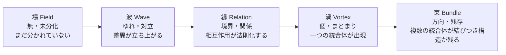

# 発達心理学における「場→波→縁→渦→束」プロセス構造の類似調査

## エグゼクティブサマリー

本調査は、指定の5段階モデル（場→波→縁→渦→束）と**同型の「段階的な変容の流れ」**をもつ発達心理学の理論・現象を、一次文献中心に3件選び、テンプレート形式で記入したものです（既に別ファイルに存在するとされた *Piaget / Vygotsky / Bowlby / Erikson* は重複回避しました）。

結論として、構造類似が最も強い候補は、**entity["people","ロバート・キーガン","adult developmental psychologist"]の構造発達理論（意味構成発達）**です。理由は、(a) 段階が明示的に整理され、(b) 各段階が「主体—客体（subject–object）」の変容として定義され、(c) **段階移行＝“未分化→差異の立ち上がり→関係化→まとまり→統合”**という一般形を最も素直に読み取れるためです。citeturn17view0turn15view0  
2番手は、entity["people","フィリップ・ロシャ","developmental psychologist"]の自己意識5水準モデルで、自己意識を「0（無）から5（メタ自己覚知）へ」立ち上げる過程が、場〜束の直線的上昇として非常に見やすい一方、**5段階モデルとの対応では“束”側に2水準（永続性とメタ自己覚知）が重なりやすい**点が残ります。citeturn21view0turn16view0turn16view1  
3番手は、entity["people","コーン・ルイクス","developmental psychologist"]らの「アイデンティティ形成の二重サイクル／DIDS（5次元）」で、5つのプロセス次元（コミットメント形成、同一化、広い探求、深い探求、反芻的探求）が明示され、日本語版尺度も整備されていますが、モデル自体が“循環（サイクル）”であるため、5段階モデルへの写像は**段階対応というより“場→波→縁→渦→束”の反復運動として読む方が自然**で、直線対応の強度は一段落ちます。citeturn7view0turn6view0turn6view1  

## スコープ・前提・方法論と文献レビュー

本件の「構造類似」は、語の一致や比喩ではなく、**過程構造（段階的変容の順序と役割）が対応するか**を見るものとして扱います（当てはめ過剰を避け、対応の強度と牽強付会リスクを併記）。  
また、発達心理学は広範ですが、今回は「発達段階（あるいは発達プロセス）が明示され、一次文献で段階が定義される」候補を優先しました。これは、指定テンプレートが「段階の叙述」と「5段階への対応表」を要求しているためです。

検索・採択の実務基準（簡略）は次の通りです。

| 観点 | 採択基準（要点） |
|---|---|
| 一次性 | 著者本人の提案（原著論文・原著書籍）を中心に、定義・段階名称・測定法が一次資料で確認できること |
| 日本語ソース | 日本語の査読論文・大学紀要・学会論文・尺度論文（J-STAGE等）で、当該理論の導入・測定・適用が確認できること |
| 段階性 | 5段階に近い明示的段階、または「0を含む5水準」等、段階列挙が可能であること |
| 重複回避 | 指定の重複回避対象（Piaget等）を主題候補にしないこと |

5段階モデル（場→波→縁→渦→束）を、最小限に“操作化”して描くと、次の流れになります（**定義の正当化ではなく、後続の「指し示し」を可能にするための作図**）。

加えて、「構造類似」をどう解釈するかで結果が変わり得るため、ここでは**3つの読み（シナリオ）**を先に提示し、総評でそれぞれの含意を比較します。  
A）**段階数整合**を重視（5段階が明示される理論ほど強い）  
B）**相転移・自己組織化**の機構整合を重視（段階数より“秩序の立ち上がり方”）  
C）**測定・介入**の整合を重視（発達段階が測定や支援に接続されているか）

## 構造類似候補（3件）— テンプレート記入

### 発達心理-001: entity["people","ロバート・キーガン","adult developmental psychologist"] の意味構成発達理論（構造発達理論／主体—客体の変容）

**[P] 確立された事実**:
- 構造発達段階が（0を含め）整理され、各段階は「主体（subject）／客体（object）のどちらに何が置かれるか」という**主体—客体均衡**で特徴づけられる。citeturn17view0turn15view0  
- 構造発達の核心は、ある段階で“主体”だったものが次段階で“客体”になり、客観的に扱えるようになる一方、新しい“主体”に再び従属する、という反復として説明される。citeturn15view0  
- 段階（例：衝動的→尊大→対人関係的→システム的→個人間相互的）と、典型的な発達時期の対応が表形式で示されている。citeturn17view0  
- 構造発達段階の測度として、entity["people","リサ・レイヒー","developmental researcher"]らにより整理された主体—客体面接（SOI）が用いられ、少なくとも日本語圏研究でもSOIが中心的測定手段として位置づけられている。citeturn17view0turn17view2  

**プロセス/段階の記述**:
- 0（未分化）: 反射的で、自己を「主体／客体」に分ける枠組みがまだない（“場”の地平に近い前提状態）。citeturn17view0  
- 1（衝動的）: 衝動・知覚が自己を駆動し、経験はまとまりの手前で流れやすい。citeturn17view0  
- 2（尊大／帝国的）: 欲求・関心・願望が前面化し、対立や取引的な揺れが増える（自己中心的な秩序化の始まり）。citeturn17view0  
- 3（対人関係的）: 自己は対人関係・相互性によって編まれ、「他者との境界面（縁）」が自己の輪郭を与える。citeturn17view0  
- 4（システム的）: アイデンティティやイデオロギー等、自己の内的システム（統制）が立ち上がり、自己が“渦”としてまとまる。citeturn17view0  
- 5（個人間相互的）: 自己システム同士が相互浸透し、複数のシステムを跨いだ統合（束ね）が可能になる。citeturn17view0  

**5段階との構造対応（候補）**:

| 5段階 | この理論の対応概念 | 対応の根拠 | 強度（高/中/低） |
|---|---|---|---|
| 場（Field） | 段階1「衝動・知覚」が自己を占める状態 | まだ“自己の枠組み”が弱く、経験が漂いやすい（統制前の地平） | 中 |
| 波（Wave） | 段階2「欲求・関心・願望」優位 | 差異が前面化し、葛藤・取引として揺れが立ち上がる | 中 |
| 縁（Relation） | 段階3「対人関係・相互性」 | 境界面＝関係の網の目が自己の輪郭を作る | 高 |
| 渦（Vortex） | 段階4「アイデンティティ／精神的統制／イデオロギー」 | ひとつの内的システムとしてまとまりが立ち上がる | 高 |
| 束（Bundle） | 段階5「個人間相互性／自己システム同士の相互浸透」 | 複数の“渦（自己システム）”を束ね、方向づける統合 | 高 |

**構造類似の質**:  
5段階モデルが要求する「未分化→差異→関係→統合体→統合体の統合」を、自己の意味構成の“秩序（orders）”としてほぼそのまま読み替えられる。特に「縁＝対人関係的自己」「束＝自己システム同士の相互浸透」が、表面的比喩ではなく機能対応として指し示しやすい。citeturn17view0  

**牽強付会リスク**: 低（ただし「場＝段階1」と置く点のみ中程度の解釈を含む）citeturn17view0  

**主要文献**:
- Kegan, R. (1982). *The Evolving Self: Problem and Process in Human Development*. Harvard University Press. citeturn10search2turn10search16  
- Kegan, R. (1994). *In Over Our Heads: The Mental Demands of Modern Life*. Harvard University Press. citeturn11view1turn10search3  
- entity["people","齋藤信","japanese developmental researcher"]ほか (2011). 「大学生における自己の構造発達—Keganの構造発達理論に基づいて—」. *青年心理学研究*.（Table 1 を含む）citeturn17view0turn17view2  
- Lahey, L., et al. (1988). *A guide to the Subject-Object Interview: Its administration and interpretation*.（SOI手続きの整理として引用される）citeturn17view0turn22search14  

image_group{"layout":"carousel","aspect_ratio":"16:9","query":["subject-object interview diagram Kegan","mirror self recognition mark test toddler Post-it","Dimensions of Identity Development Scale DIDS model diagram"],"num_per_query":1}

### 発達心理-002: entity["people","フィリップ・ロシャ","developmental psychologist"] の自己意識5水準モデル（鏡反応を手がかりにした自己覚知の立ち上がり）

**[P] 確立された事実**:
- 生後からおよそ4〜5歳にかけて、自己意識（self-awareness）が**5つの水準**として順次展開するモデルが提示され、さらに対照として**水準0（自己意識の欠如）**が区別される。citeturn3view0turn16view0turn3view1  
- 水準は少なくとも「Differentiation（分化）」「Situation（状況）」「Identification（同定／自己認知）」「Permanence（永続性）」「Self-consciousness / meta self-awareness（自己意識／メタ自己覚知）」として節見出しで定義される。citeturn4view0turn5view1turn4view1  
- 鏡への反応（鏡映像を他者として扱う→探索→マークテスト等を含む）は、限界の指摘はあるものの、発達に伴う変化が再現的に観察される指標として位置づけられる。citeturn16view0turn5view1  
- 日本語圏の研究でも、鏡映像に対する反応は段階的に整理され、マークテスト（ルージュ課題等）で18〜24か月頃に自己認知が確認される、という整理が共有されている。citeturn19view0turn18view0  
- entity["people","木下孝司","japanese developmental psychologist"]は「マークテスト合格＝自己認知の達成か」という問いとして、鏡自己認知を“知覚的・感覚的側面”に限定しない立場も示しており、ロシャの「永続性／メタ自己」側への拡張と整合する問題意識を含む。citeturn18view0turn19view0  

**プロセス/段階の記述**:
- 0（Confusion）: 鏡像が“世界の延長”のように扱われ、自己と環境の区別が成立しない。citeturn16view0turn3view0  
- 1（Differentiation）: 自己の運動・感覚と外界の出来事が分かれ始め、自己—世界の最小分化が生じる。citeturn4view0turn5view0  
- 2（Situation）: 自己が環境内で「どこに／どう置かれているか（状況づけ）」が働き、自己—環境の関係が安定化する。citeturn5view0turn5view1  
- 3（Identification）: 鏡の中の像が「Me」であると同定され、マーク（Post-it等）への自己指向反応が出る。citeturn5view1turn16view1  
- 4（Permanence）: ここ・いまの鏡像を越え、写真・過去映像でも自己を同定でき、“同じ自己が時間を貫く”表象が立ち上がる。citeturn5view1turn21view0  
- 5（Self-consciousness / meta）: 他者視点・誤信念理解など、複数表象を扱う力が自己にも返り、メタ自己覚知が成立する。citeturn21view0turn4view1  

**5段階との構造対応（候補）**:

| 5段階 | この理論の対応概念 | 対応の根拠 | 強度（高/中/低） |
|---|---|---|---|
| 場（Field） | 水準0（Confusion／自己意識の欠如） | 「無・未分化」の地平として最も近い（自己と世界が溶ける） | 高 |
| 波（Wave） | 水準1（Differentiation） | 場の中に差異が生まれ、自己—世界の分化が立ち上がる | 高 |
| 縁（Relation） | 水準2（Situation） | 自己が“環境内での関係（状況）”として定位される | 中 |
| 渦（Vortex） | 水準3（Identification） | 「Me」としてのまとまりが立ち上がり、自己指向行為が出現 | 高 |
| 束（Bundle） | 水準4〜5（Permanence → meta self-awareness） | 時間を貫く自己＋他者視点の取り込みが“方向をもつ構造”として残る | 中 |

**構造類似の質**:  
場→波→渦の対応（0→1→3）は非常に明瞭で、特に「マーク（Post-it）への自己指向反応」は“渦＝まとまりの自己”を直観的に指し示す。さらに本人が水準群を「動的システムのアトラクタ」として述べており、束の側（構造として残る集まり）への接続は示唆として強いが、5段階モデルに対して水準4と5が“束”に折りたたまれやすい点が残る。citeturn16view1turn21view0  

**牽強付会リスク**: 中（束へ水準4・5を重ねる必要があるため）citeturn21view0  

**主要文献**:
- Rochat, P. (2003). Five levels of self-awareness as they unfold early in life. *Consciousness and Cognition, 12*(4), 717–731. citeturn3view1turn3view0turn21view0  
- entity["people","木下孝司","japanese developmental psychologist"] (2001). 「幼児は自己映像を“自分のこと”として見ているか？—遅延提示されたビデオ映像による自己認知—」. *神戸大学発達科学部研究紀要, 8*(2), 91–100. citeturn18view0turn19view0  
- Rochat, P. (2001). *The Self in Infancy: Theory and Research*.（自己の共同構成や関連研究の整理としてロシャ自身が参照）citeturn21view0  

### 発達心理-003: entity["people","コーン・ルイクス","developmental psychologist"] らのアイデンティティ形成二重サイクル／DIDS（5次元プロセス）

**[P] 確立された事実**:
- アイデンティティ形成を「コミットメント」と「探求」の下位プロセスへ分解し、少なくとも4次元（Commitment Making / Identification with Commitment / Exploration in Breadth / Exploration in Depth）を統合モデルとして提示し、適合のよさを検討した。citeturn6view0  
- その後、探求を「適応的（reflective）」だけでなく「反芻的（ruminative, maladaptive）」として区別し、**反芻的探求**を第5次元として追加した枠組みが検討され、反芻的探求が苦痛指標と正に関連することが報告されている。citeturn6view0turn6view1  
- 日本語圏では、DIDSに基づくentity["organization","J-STAGE","japan research platform"]掲載論文として、DIDS日本語版（DIDS-J）が作成・検討され、**5因子（コミットメント形成、コミットメントとの同一化、広い探求、深い探求、反芻的探求）**が報告されている。citeturn7view0turn16view2  
- DIDS-Jはクラスター分析により、従来尺度では分かれにくかった複数のステイタス類型（例：searching moratorium など）を識別し得ることが示されている。citeturn7view0turn16view2  

**プロセス/段階の記述**:
- 「探求（exploration）」は、広く選択肢を集める局面と、選んだ対象を深く検討する局面に分けられる（＝形成と維持・精緻化の二重サイクル）。citeturn6view0turn7view0  
- 「コミットメント」は、(a) 形成（選択する）と、(b) 同一化（選択を自分のものとして引き受ける）に分かれる。citeturn6view0turn7view0  
- 探求には、適応的に開く探求だけでなく、迷いの反復として固定化し得る反芻的探求があり、これが苦痛と結びつきやすい。citeturn6view1turn7view0  
- 以上の要素は直線段階というより、（特に青年期〜成人期に）**サイクルとして反復**し得る前提で組まれている。citeturn7view0  

**5段階との構造対応（候補）**:

| 5段階 | この理論の対応概念 | 対応の根拠 | 強度（高/中/低） |
|---|---|---|---|
| 場（Field） | 現在の自己理解・社会的文脈（コミットメント未確定でも成立） | 探求もコミットメントも未分化／未決の前提場として働く | 中 |
| 波（Wave） | 広い探求＋反芻的探求（探索の揺れ） | 選択肢の収集と迷いの反復が“差異・対立”として立ち上がる | 中 |
| 縁（Relation） | コミットメント形成（選択＝境界を切る） | 無限の可能性に境界を入れ、関係の取り方が定まる | 中 |
| 渦（Vortex） | コミットメントとの同一化 | 「これが自分だ」というまとまり（自己同一性）が立ち上がる | 中 |
| 束（Bundle） | 深い探求（維持・精緻化）＋サイクル反復 | まとまりを現実経験に照らして束ね直し、時間的に残る構造へ | 中 |

**構造類似の質**:  
このモデルは、5段階モデルの直線列よりも、「場→波→縁→渦→束」を**形成サイクル／維持サイクルとして反復**するもの、として読むと自然に収まる。5次元が明示され測定も整っているため“束（残る構造）”は確かに指し示せるが、各次元が同時並行で動き得るため、段階対応の強度自体は中程度に留まる。citeturn7view0turn6view0turn6view1  

**牽強付会リスク**: 中（モデルが“段階”より“サイクル／次元”であるため）citeturn7view0  

**主要文献**:
- Luyckx, K., et al. (2006). Unpacking commitment and exploration: Preliminary validation of an integrative model of late adolescent identity formation. *Journal of Adolescence*. citeturn6view0  
- Luyckx, K., et al. (2008). Capturing ruminative exploration: Extending the four-dimensional model of identity formation in late adolescence. *Journal of Research in Personality*. citeturn6view0turn6view1  
- entity["people","中間玲子","japanese psychologist"]ほか (2014). 「多次元アイデンティティ発達尺度（DIDS）によるアイデンティティ発達の検討と類型化の試み」. *心理学研究*. citeturn7view0turn16view2  

## 発達心理 総評

**構造類似の全体的強度**: 中（“強い候補はあるが、領域全体を代表する普遍同型とは言い切れない）  
**最も構造類似が高い候補**: entity["people","ロバート・キーガン","adult developmental psychologist"] の構造発達理論（意味構成発達）citeturn17view0turn15view0  
**この領域の独自性**:  
発達心理学では、(a) 発達を「知識の増加」ではなく「**秩序（構造）の変容**」として捉える系譜が強く、また (b) その変容が直線というより、文脈・相互作用・測定可能性（尺度／面接法）と結びついて蓄積される点が独自である。たとえばロシャ自身が自己意識水準を“アトラクタ”として語り、発達を動的システム的に捉える橋が明示される。citeturn21view0turn20search2  
**既存エントリ（既存エントリなし（Accept 0件））との関係**:  
既存Acceptが0件の状況で、重複回避対象（Piaget等）を主候補から外しつつ、乳幼児（自己意識）、青年期（アイデンティティ）、成人期（意味構成）へと発達期を分散させ、同型構造が「局所（特定理論）」では強く現れ得ることを示した。citeturn17view0turn21view0turn7view0  
**注意点**:  
1) 「5段階モデル→発達理論」への写像は、説明（論証）ではなく“指し示し”として行うべきで、段階名の対応よりも「段階が担う機能（未分化→差異→関係→統合→残存）」を見失うと牽強付会になる。citeturn15view0turn21view0  
2) 段階数が一致しても、理論が「段階」ではなく「次元」や「サイクル」で設計されている場合（DIDSなど）、同型は直線ではなく反復構造として現れるため、対応強度は過大評価しない。citeturn7view0turn6view1  

**比較（簡易）**（“どの読み（シナリオ）で強くなるか”を含む）

| 候補 | 5段階の明示性 | 日本語圏の導入・測定 | 5段階モデルとの噛み合い | 向くシナリオ |
|---|---:|---:|---:|---|
| Kegan | 高（段階表・主体/客体が明示）citeturn17view0 | 高（日本語論文で段階表・SOI運用）citeturn17view0turn17view2 | 高（縁・渦・束が機能対応で立つ）citeturn17view0 | A / C |
| Rochat | 中（5水準＋0）citeturn16view0turn5view1 | 中（鏡自己認知研究の整理がある）citeturn19view0 | 中〜高（場→波→渦が強い）citeturn16view1 | A / B |
| Luyckx/DIDS | 中（5次元、ただしサイクル）citeturn7view0turn6view1 | 高（DIDS-Jで5因子確認）citeturn7view0turn16view2 | 中（直線より反復写像が自然）citeturn7view0 | C（＋Aの補助） |

**シナリオ分析（代替仮定）**  
- A「段階数整合」を最優先するなら、KeganとRochatが最も扱いやすい。Keganは5段階（1〜5）がそのまま写像候補になり、Rochatは0を含むが“場”に0を置いて立ち上げが明瞭になる。citeturn17view0turn16view0turn5view1  
- B「相転移・自己組織化」整合を重視するなら、発達の動的システム観（状態→軌道→アトラクタ）を採択し、5段階モデルを“秩序形成の一般形”として扱う読みが強くなる。実際ロシャは自己意識水準を“アトラクタ集合”と表現している。citeturn21view0turn20search2  
  - この読みでは、entity["people","エスター・セレン","developmental psychologist"]とentity["people","リンダ・スミス","developmental psychologist"]の動的システム・アプローチ（発達を自己組織化・相転移として捉える）は、5段階モデルと非常に相性が良い（ただし今回はテンプレート3件制約のため「候補外の有力枠」として留める）。citeturn20search12turn20search15turn20search2  
- C「測定・介入」整合を重視するなら、DIDS-J（5因子）やSOIなど、評価・支援設計に落とせる枠組みが優位になる。DIDS-Jは青年〜大学生への適用と文化間比較可能性を利点として明示し、SOIは段階推定の面接法として運用が整理されている。citeturn7view0turn17view0turn22search14  

**実務的提言（用途別）**  
- 教育・人材開発（成人期）: Keganを主軸に「縁（対人関係的）→渦（システム的）→束（個人間相互）」の移行支援として、課題設計を“関係の編み直し→自己システム化→複数システム統合”の順で組むと、5段階モデルとの整合が高いチェックリストになる。citeturn17view0turn15view0  
- 乳幼児の発達支援（自己意識）: Rochat×日本語圏の鏡自己認知研究の整理を併用し、「場（混同）→波（分化）→渦（自己同定）」の観察ポイントを家庭・保育の言語で持つと、行動観察の解像度が上がる（ただしマークテスト＝自己意識の全てではない）。citeturn16view0turn19view0turn18view0  
- 青年期支援（アイデンティティ）: DIDS（特に反芻的探求）を含む枠組みで、「波（揺れ）」が適応的探求か反芻固定かを見分け、深い探求と同一化を“束（残る構造）”側に誘導する介入設計（相談・キャリア支援）に転用しやすい。citeturn6view1turn7view0  

**限界と不確実性**  
- 5段階モデル自体は本調査の前提であり、心理学領域で標準化された段階理論ではないため、写像は「説明」ではなく「指し示し」である（＝同型の強度は理論間で揺れる）。citeturn21view0  
- 発達理論の多くは「段階」ではなく「領域別発達」「多次元」「文脈依存」を含むため、5段階の直線に押し込むと情報が失われる。特にDIDSのようなサイクルモデルは、直線写像より反復写像の方が妥当になりやすい。citeturn7view0turn6view1  
- 本件は「3件」に限定されたため、動的システム・アプローチ（発達の自己組織化）等の“同型性が高いが候補外”の系譜は総評内での位置づけに留めた。citeturn20search12turn20search2