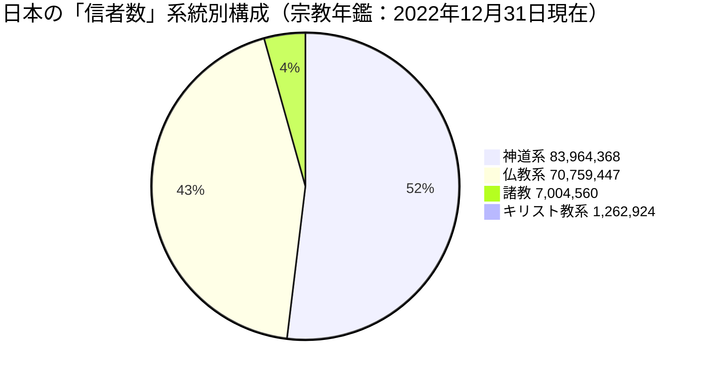
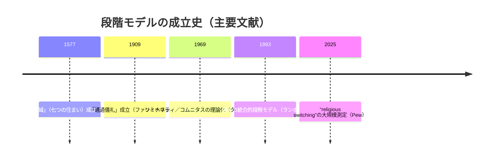
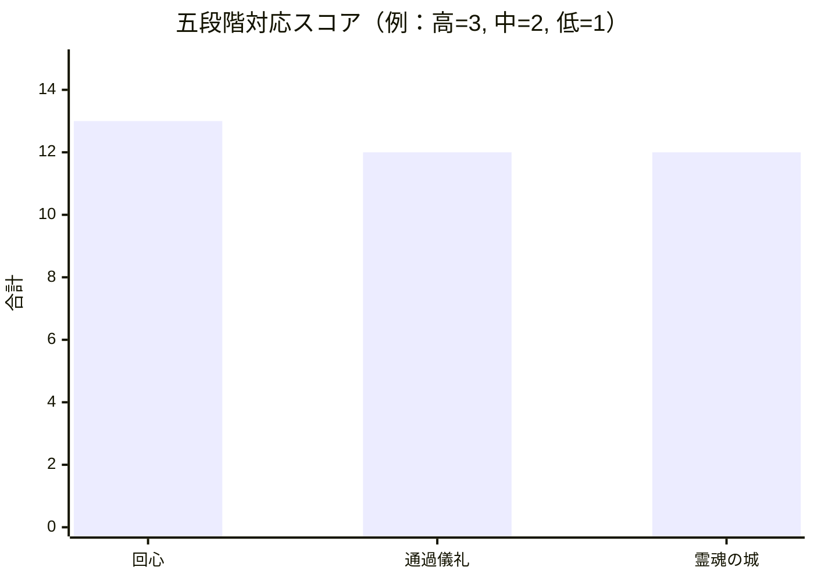

# 宗教学における五段階モデルとの構造類似調査

## エグゼクティブサマリー

本レポートは、添付ファイルで指定された「創造プロセスの五段階モデル（場＝Field／波＝Wave／縁＝Relation／渦＝Vortex／束＝Bundle）」に対し、**宗教学の理論・現象の“段階構造”がどの程度構造的に類似しうるか**を、一次文献・公式資料・学術論文（特に日本語資料を優先）に基づいて、**候補を3件選定しテンプレート形式で提示**するものです（論証ではなく、指し示しの姿勢を維持）。  
結論として、(a)宗教的回心（改宗・入信）の段階モデル、(b)通過儀礼の三段階構造（＋リミナリティ／コムニタス）、(c)キリスト教神秘思想における内面の進行（「七つの住まい」）は、それぞれ異なる強みと歪み（段階数の違い、開始点の取り方の違い）を伴いながらも、五段階モデルの「場→揺れ→関係→収束→定着」という抽象構造と**複数の対応候補**を形成しうることが確認されました。citeturn35view3turn28view0turn15view0turn26view2  

量的補助データとして、日本国内の宗教団体・宗教法人・教師・信者数（宗教団体自己定義に基づく統計）を参照すると、2022年12月31日現在で単位宗教法人数は178,946法人、信者数の総数は162,991,299人とされます（ただし信者定義・計数は団体ごとに異なる点に留意が必要）。citeturn29view1turn27view2turn26view2  
また、宗教的移動の“量的現実”を示す参考として、米国では「幼少期の宗教アイデンティティと現在が異なる」成人が35%と報告され、世界36カ国でも「幼少期宗教からの離脱」が成人の2割以上に達する国が多いとされます（ただしPewは“conversion”でなく“switching”概念を明示）。citeturn30view0turn30view2turn30view1  

## スコープと目的

添付ファイルで定義された本タスクのスコープは、(1)五段階モデル（場／波／縁／渦／束）を基準枠として、(2)宗教学の理論・現象を調査し、(3)そのプロセス／段階記述が五段階の抽象構造とどのように対応しうるかを、**3候補についてテンプレートで整理して出力**することです。  
目的は、五段階モデルの“説明力”を宗教学領域で実証することではなく、**構造対応が成立しうる可能性の輪郭を、牽強付会リスクも含めて可視化**する点にあります（添付ファイルの指針に従い「論証はしない。指し示す」）。  

添付ファイル上、地理的範囲・対象宗教圏・時代範囲・想定読者・評価指標（成功／失敗の定義など）は明示されていないため、本レポートではそれらを**未指定（unspecified）**として扱い、(a)古典的理論（近代以前の一次テキスト）と(b)近現代の学術モデル（20世紀以降）を横断しつつ、(c)日本語一次・公式・学術資料を優先する方針で調査しました。citeturn27view2turn30view0turn15view0  

## 方法論

### データソースの方針

一次・公式ソースを軸に、次の順で重み付けしました。  
第一に、統計的・制度的背景として、entity["organization","文化庁","japanese govt agency"]編entity["book","宗教年鑑 令和5年版","bunkacho 2023 edition"]（宗教統計の定義・計数方法を含む）を採用しました。citeturn29view1turn27view2  
第二に、各候補の段階構造に関しては、(a)出版社・公的機関による書誌／目次情報、(b)原典（公開テキスト）、(c)査読誌・大学紀要等の学術論文を組み合わせ、段階名と段階内容を二重に確認しました。citeturn29view3turn15view0turn28view0turn32view0  

### 検索戦略

検索は日本語クエリを中心に、必要に応じて英語・スペイン語で補助しました（例：回心＝conversion stage model、通過儀礼＝rites de passage、霊魂の城＝El Castillo interior / Las moradas）。  
段階構造の抽出では、(1)「段階名の列挙が明示される箇所（目次・章題・索引）」、(2)「各段階が何を意味するかを説明する箇所（序論・解説・章見出し）」を優先的に収集しました。citeturn29view3turn15view0turn35view3  

### 包含・除外基準

包含基準は、(a)段階（stage／phase）や三段階・七段階などの**順序構造**が明確、(b)宗教学・宗教研究・宗教史・宗教心理・宗教人類学のいずれかで参照頻度が高い、(c)一次・公式または学術的に信頼できる媒体で確認可能、の3点です。citeturn28view0turn15view0turn27view2  
除外基準は、(a)段階列挙が不明瞭、(b)個人ブログ等で一次確認ができない、(c)既存エントリ（十牛図／ファナー＝バカー／錬金術マグヌム・オプス）と実質的に重複、です（添付ファイル指示）。  

### 曖昧箇所に対する仮定

五段階モデルの「場＝無・未分化」という定義は、宗教学の多くの段階モデル（既に社会構造や教義区分が前提）と開始点が一致しない場合があるため、本レポートでは「場」を**(i)プロセスが生起する“力場／全体環境（dynamic field）”**、または**(ii)儀礼・内面進行に入る前の“前状態”**として読み替える代替を許容しました（この選択が感度分析の主要論点になります）。citeturn35view3turn28view0turn15view0  

## 調査結果

### 宗教統計の背景

宗教学の段階モデルはしばしば「個人内面」「共同体」「制度」「文化」の層をまたぐため、制度統計の取り扱い方を先に押さえます。entity["book","宗教年鑑 令和5年版","bunkacho 2023 edition"]では、宗教団体（宗教法人を含む）・宗教法人・教師・信者の定義がQ&Aで説明され、信者は「氏子、檀徒、教徒、会員、崇敬者、修道者…等を含む」としつつ、**定義・資格・数え方は各団体独自**であると明記されています。citeturn27view2turn27view0  
このため、以下に示す数値は「宗教的帰属の客観的実数」というより、**団体が報告する構成員概念の集計**として読むのが適切です。citeturn27view2turn26view2  

2022年12月31日現在、単位宗教法人数は178,946法人で、系統別では神道系84,206（47.1%）、仏教系76,701（42.9%）、キリスト教系4,773（2.7%）、諸教13,266（7.4%）とされています。citeturn29view1turn26view0  
同日現在の信者数（総数）は162,991,299人で、神道系83,964,368（51.5%）、仏教系70,759,447（43.4%）、諸教7,004,560（4.3%）、キリスト教系1,262,924（0.8%）と報告されています。citeturn26view2turn26view1  

（参考可視化）上記の宗教年鑑の“信者数”構成を図示すると次の通りです。citeturn26view2turn27view2  

### 候補比較の俯瞰

以下は、3候補の“段階数”と“五段階への写像（圧縮／分割の必要性）”の差を、最初に比較した表です。主要出典は各候補の一次文献（目次・章題・原典）と、学術的解説です。citeturn29view3turn28view0turn15view0turn35view1  

| 候補 | 領域 | 原モデルの段階数 | 段階情報の一次確認の根拠 | 五段階への写像の型 | 主なリスク |
|---|---|---:|---|---|---|
| 宗教的回心（改宗・入信）段階モデル | 宗教心理・宗教社会学・宗教学 | 7段階（＋布教者章で細分） | 日本語版目次で「文脈／危機／探究／…／献身／帰結」が明示 | 7→5（複数段階を束ねる） | 「探究・出会い・相互作用」の境界が恣意的に圧縮されうる |
| 通過儀礼（三段階）＋リミナリティ／コムニタス | 宗教人類学・儀礼論 | 3段階 | 「分離／境界（マージ）／統合」が明示 | 3→5（開始点の再定義が鍵） | 五段階の「場（未分化）」に合わせると循環・位相ずれが起きやすい |
| 「霊魂の城」七つの住まい | キリスト教神秘思想・霊性史 | 7段階 | 「Moradas primeras…séptimas」章題が明示 | 7→5（1–3／4／5–6／7などに圧縮） | 圧縮により各住まい固有の霊性実践（祈りの質）が脱落しやすい |

### 参考図版

五段階モデルと、通過儀礼・回心・内面進行を“視覚的に想起”するための参考図版（概念図）を示します（図は理解補助であり、同一性の証拠ではありません）。  

image_group{"layout":"carousel","aspect_ratio":"16:9","query":["Rambo seven stages of conversion diagram","rites of passage separation liminality incorporation diagram","Interior Castle seven mansions diagram"],"num_per_query":1}

### 文献タイムライン

三候補は、宗教学の中でも成立時代が大きく異なります。段階モデルの性格差（規範的霊性テキスト／人類学的類型／統合的社会科学モデル）を理解するため、主要文献の成立順を示します。citeturn15view0turn28view0turn29view0turn29view3  

### 宗教学-A: 回心の段階モデル（ランボー）

**候補**: 回心（conversion／改宗・入信）を「文脈→危機→探究→出会い→相互作用→献身→帰結」として捉える統合的段階モデル  
**概要**: entity["people","ルイス・R・ランボー","religious conversion scholar"]は回心研究の諸潮流（心理学・社会学・人類学等）を統合し、回心を多層的プロセスとして段階化した。日本語版目次でも「文脈／危機／探究／…／献身／帰結」が章として並び、段階構造の骨格が確認できる。citeturn29view3turn7view0turn29view0  
**前提**: 回心は、個人内面の出来事に閉じず、社会・文化・宗教環境（文脈）と、布教者（advocate）や集団との相互作用を含む「動的な力場（dynamic field）」で起こる。またモデルはヒューリスティックであり、段階が必ずしも直線順行しない（相互に作用しうる）とされる。citeturn35view3turn7view0  

**[P] 確立した事実**:
- 回心研究の統合枠組みとして、回心を7段階（context, crisis, quest, encounter, interaction, commitment, consequences）で扱うモデルが明示されている。citeturn35view3  
- 段階は順行固定ではなく、相互作用的で同時並行もありうる（「順番どおりに進まない」「相互に影響し合う」可能性が明記）。citeturn35view3  
- 日本語版の章構成として「文脈／危機／探究／相互作用／献身／帰結」等が列挙され、段階語彙が訳語として制度化されている。citeturn29view3  
- 出版社説明では、回心を複雑だが変容的な過程として捉え、「新たな選択肢への開放→ジレンマ解消探索→体現者との出会い→新しい役割・儀礼・語彙の学習→献身」という段階的特徴が示される。citeturn7view0  
- 大規模調査では、宗教的移動（switching）が相当規模で生じることが示され、回心／離脱を含む“変化”が現代社会で一般的現象であることが数量的に確認できる（例：米国成人の35%が幼少期と現在で宗教アイデンティティが異なる）。citeturn30view0turn30view1  

**プロセス/段階の記述**:
1. **文脈（Context）**: 個人の生活世界・社会文化・宗教的選択肢が、回心を促進／阻害する前提条件として存在する。citeturn29view3turn35view3  
2. **危機（Crisis）**: 既存の意味秩序が揺らぎ、困難・喪失・葛藤などが「変化の必要」を先鋭化させる。citeturn35view3  
3. **探究（Quest）**: 本人が意味・目的・解決を求めて探索し、選択肢を比較しはじめる。citeturn29view3turn35view3  
4. **出会い（Encounter）**: 回心先の体現者（布教者／集団）や具体的実践との接触が起こり、可能な世界像が“現前化”する。citeturn29view3turn35view3  
5. **相互作用（Interaction）**: 参加・学習・役割取得が進み、新しい儀礼・語彙・ライフスタイルを経験的に身につける。citeturn7view0turn35view3  
6. **献身（Commitment）**: 誓約・所属表明・生活方針の転換等を通じ、同一化が制度化される（変化の「てこ（fulcrum）」として位置づけられる）。citeturn35view3  
7. **帰結（Consequences）**: 信念・行動・関係性・生活史が再編され、変容が持続的に現れる（初期変化は長い過程の第一歩に過ぎないという理解も含む）。citeturn35view3  

**5段階との構造対応（候補）**:

| 5段階 | 対応する概念 | 対応根拠 | 対応強度 |
|---|---|---|---|
| 場（Field） | 文脈（Context） | 回心が生起する「力場（people/events/institutions）」としての全体環境が前景化するため | 高 |
| 波（Wave） | 危機（Crisis） | 既存秩序の揺れ・不一致・困難が「差」として立ち上がるため | 高 |
| 縁（Relation） | 出会い（Encounter）＋相互作用（Interaction） | 境界接触（出会い）と関係編成（学習・参加）が“関係の生成”に相当 | 高 |
| 渦（Vortex） | 献身（Commitment） | 決断・誓約が「収束点」として機能し、変化の方向を固定するため | 中 |
| 束（Bundle） | 帰結（Consequences） | 変容が信念・行動・社会関係として束ねられ、持続するため | 高 |

**構造類似の質**:  
回心モデルは「環境（場）→攪乱（波）→接触と学習（縁）→誓約で収束（渦）→生活史として定着（束）」という五段階の抽象骨格を比較的滑らかになぞる。ただし、原モデルは7段階で、特に「探究（Quest）」の位置づけが五段階内で揺れやすい（波に含めるか、縁の前半に置くか）点が、写像の恣意性源となる。citeturn29view3turn35view3turn7view0  

**牽強付会リスク**: 中（7段階→5段階の圧縮で、「探究」「出会い」「相互作用」の境界が分析者依存になりやすい。ただし段階名自体は一次・公式情報で確認できる）。citeturn29view3turn35view3  

**主要文献**:
- Rambo, L. R. (1993). *Understanding Religious Conversion*. entity["organization","Yale University Press","publisher new haven"].citeturn29view0  
- ルイス・R・ランボー（著）『宗教的回心の研究』（日本語版 目次：文脈／危機／探究／…／献身／帰結）。citeturn29view3  
- Di Marzio, R. (2019). “Experiences of Affiliation… An Analysis According to the Rambo et al. Integrated Model.” *The Journal of CESNUR*.citeturn35view3turn32view0  
- entity["organization","Pew Research Center","us research org"] (2025). “Religious switching”関連報告（米国・国際比較）。citeturn30view0turn30view2  

### 宗教学-B: 通過儀礼の三段階構造（ファン・ヘネップ）とリミナリティ／コムニタス（ターナー）

**候補**: 通過儀礼（rites de passage）を「分離→境界（過渡）→統合」とする三段階構造（＋境界期の理論化）  
**概要**: entity["people","アーノルド・ファン・ヘネップ","anthropologist rites de passage"]は通過儀礼に三部構造（separation／margin／incorporation）があると整理し、後にentity["people","ヴィクター・ターナー","anthropologist liminality"]が境界期を「betwixt and between（どちらでもない）」として概念化し、構造と反構造（コムニタス）の弁証法として展開した。citeturn28view0turn34view0turn34view1  
**前提**: 人間の生や社会的地位の移行は危険・汚れ・曖昧さを伴うため、儀礼は移行の“浄化”や秩序再編の装置として機能する。さらに、通過儀礼は三段階を常に同程度に発達させるとは限らず、どの段階が強調されるかは儀礼系列に依存する（この“強度差”が、五段階への写像柔軟性を与える）。citeturn28view0turn34view0  

**[P] 確立した事実**:
- 通過儀礼は「分離の儀礼／境界（マージ）／統合の儀礼」という三部構造をもつ、という整理が明示されている。citeturn28view0turn34view0  
- 境界期（marge）は「旧い役割を離れたが新しい役割にまだ入っていない」状態として説明され、ターナーがこの状態を“betwixt and between”と呼ぶことが示される。citeturn28view0turn34view0  
- 通過儀礼は出生・成人・婚姻・葬送などのライフコースだけでなく、季節行事など時間的移行にも適用しうる、と整理される。citeturn28view0  
- すべての儀礼系列が三段階を同じ程度に含むわけではなく、段階ごとの強調配分に差がある（例：受洗が統合の儀礼に重心がある等）。citeturn28view0  
- 日本語の研究論文では、構造とコムニタスの関係が「構造→無構造・未分化（コムニタス）→再び構造」に立ち戻る弁証法的過程として要約され、通過（移行）に伴う“汚れ／危険”を儀礼が浄化するという位置づけが示される。citeturn34view0turn34view1  

**プロセス/段階の記述**:
1. **分離（preliminal）**: 旧い身分・役割・場所から切り離される（離脱が明示化され、移行が開始する）。citeturn28view0turn34view0  
2. **境界／過渡（liminal / marge）**: 旧にも新にも属さない曖昧状態が生じ、秩序が一時停止し、関係が組み替えられる（危険・汚れとしても理解される）。citeturn34view0turn28view0  
3. **統合（postliminal）**: 新しい身分で共同体に再統合され、再び分類された構造へと戻る。citeturn28view0turn34view0  

**5段階との構造対応（候補）**:

| 5段階 | 対応する概念 | 対応根拠 | 対応強度 |
|---|---|---|---|
| 場（Field） | 儀礼が成立する社会的分類体系（構造） | 「通過」は分類された状態間で生じるため、まず“全体の枠（秩序）”が前提となる | 中 |
| 波（Wave） | 分離（separation） | 切断によって揺れが生まれ、移行が問題化するため | 高 |
| 縁（Relation） | 境界期（liminality） | 境界で「どちらでもない」関係性・相互作用が露出し、編み替えが起こるため | 高 |
| 渦（Vortex） | 統合の儀礼（incorporation） | 新しい役割へ“収束”させる儀礼操作が、定着点の生成に近い | 中 |
| 束（Bundle） | 新役割の日常化（再分類された構造） | 共同体に再統合され、役割が持続構造として束ね直される | 中 |

**構造類似の質**:  
通過儀礼は「切断→境界→再統合」という明瞭な推移を持ち、五段階のうち少なくとも「波（揺れ）」「縁（境界での関係生成）」「束（再秩序）」に強い対応が出る。一方で、五段階の「場」を“未分化”として厳密に読むと、通過儀礼の開始状態（既に分類された社会構造）と位相がずれ、写像は「循環モデル（構造→反構造→構造）」として読む方が自然になる。citeturn34view0turn34view1turn28view0  

**牽強付会リスク**: 中（3段階→5段階で、特に「場」と「束」をどこまで区別できるかが仮定依存。さらに、儀礼系列によって三段階の強調配分が異なるため“万能写像”は危険）。citeturn28view0turn34view0  

**主要文献**:
- Van Gennep, A. (1909). entity["book","Les rites de passage","van gennep 1909 book"].citeturn28view0  
- entity["organization","University of Chicago Press","publisher chicago"]（編）“The Rites of Passage”解説（分離／境界／統合の三部構造と注意点）。citeturn28view0  
- entity["book","The Ritual Process: Structure and Anti-Structure","Turner 1969 book"]（日本語版紹介を含む）。citeturn33search29turn34view1  
- 日本語研究論文：通過儀礼（分離／リミネール／統合）と構造—コムニタスの弁証法的理解。citeturn34view0turn34view1  

### 宗教学-C: 「霊魂の城（内なる城）」の七つの住まい（テレサ）

**候補**: 「霊魂＝城」を七つの住まい（Moradas）として段階化し、神との一致へと進む内面プロセス  
**概要**: entity["people","アビラの聖テレサ","catholic mystic 1515-1582"]のentity["book","霊魂の城","Teresa 1577 book"]（スペイン語原題：El Castillo interior o Las Moradas）は、人間の内面を城に喩え、「祈り」を門として奥へ進む霊的歩みを七段階で提示する。原典の章題は“Moradas primeras…séptimas”として体系化され、第一の住まいでは魂の尊厳と「この城に入る門は祈り」であることが提示される。citeturn29view2turn29view4turn35view1  
**前提**: キリスト教的な観想・祈りの実践、罪と自己認識、試練、神的な恩寵（祈りの質的変化）を前提とし、最終住まいでは「霊的結婚（matrimonio espiritual）」として神との一致が語られる。citeturn15view0turn14view1turn35view1  

**[P] 確立した事実**:
- 作品は七つの住まい（Moradas）から成る構造として提示され、第一の住まいで「魂の尊厳」や「祈りが門である」ことが章題で明示される。citeturn29view2turn15view0turn29view4  
- 第二の住まいは「忍耐（perseverancia）が重要で、悪魔の戦いが激しい」ことを章題として掲げ、序盤が“継続と闘争”の倫理で組まれている。citeturn15view0  
- 第四の住まいでは祈りにおける「慰め（contentos）と霊的味わい（gustos）の差」や「想念と知性の違い」「収心の祈り（oración de recogimiento）」が章題で整理され、内面技法が段階的に深化する。citeturn15view0  
- 第六の住まいでは「より大きな試練」「神の語りかけ」「恍惚・忘我（arrobamiento, éxtasi）」等が並び、変容のピークが“試練と神秘経験”として編成される。citeturn15view1turn14view1  
- 第七の住まいでは「霊的結婚（matrimonio espiritual）」や、その効果、さらに「マルタとマリアが共にある必要」が章題として示され、最奥の一致が“行為と観想の統合”として閉じられる。citeturn14view1  

**プロセス/段階の記述**:
1. **第一の住まい**: 魂の尊厳を知り、城に入る門として祈りを位置づけ、自己認識（罪・汚れ）を含む出発点が確立される。citeturn15view0turn29view4  
2. **第二の住まい**: 忍耐が強調され、「道を誤らないこと」「悪魔の戦い」など、継続を妨げる力への対処が中心となる。citeturn15view0  
3. **第三の住まい**: この世（destierro）における霊的状態の“不安定さ”や、祈りの乾き（sequedades）・試練が扱われ、安定と不安の緊張が増す。citeturn15view0  
4. **第四の住まい**: 祈りが量的努力から質的変化へ移り、収心の祈りなど“内面の技法”が精緻化される。citeturn15view0  
5. **第五の住まい**: 祈りにおける神との「一致（unión）」が中心テーマとなり、その真偽判別や効果（愛徳を含む）が論じられる。citeturn15view0  
6. **第六の住まい**: 大きな試練と同時に、神の語り・幻視・恍惚などの神秘経験が展開し、飛躍的な変容が起こる。citeturn15view1turn14view1  
7. **第七の住まい**: 大きな恩寵としての霊的結婚が語られ、作用として“驚くべき差異”が生じ、観想と行為（マルタとマリア）が統合される。citeturn14view1  

**5段階との構造対応（候補）**:

| 5段階 | 対応する概念 | 対応根拠 | 対応強度 |
|---|---|---|---|
| 場（Field） | 城の外周／最初の住まい（祈りの門を開く前後） | 祈り以前の外面的生（外周）から、内面に“入る”という全体場が設定される | 中 |
| 波（Wave） | 第二〜第三の住まい（忍耐・闘争・乾き） | 揺れ・対立（試練）が反復的に立ち上がり、進行を促す／妨げる | 中 |
| 縁（Relation） | 第四の住まい（収心の祈り） | 内面技法の成立＝境界での関係編成（想念・知性の整理）として読める | 中 |
| 渦（Vortex） | 第五〜第六の住まい（一致／恍惚） | 神秘経験が“収束点”として働き、霊的方向性が強く固定される | 中 |
| 束（Bundle） | 第七の住まい（霊的結婚＋マルタとマリア） | 一致が生活全体（観想×行為）に束ね直される | 高 |

**構造類似の質**:  
七つの住まいは、祈りの開始（門）から、試練・内面技法・一致・霊的結婚へと進む“段階的深化”をもつため、五段階の「揺れ→関係→収束→定着」に相当する局面を複数含む。ただし、原モデルは七段階であり、五段階へ圧縮すると「第二／第三」「第五／第六」の違い（継続倫理なのか、質的恩寵なのか）が薄まりやすい。citeturn15view0turn15view1turn14view1turn35view1  

**牽強付会リスク**: 中〜高（7段階→5段階の圧縮が不可避で、五段階側の抽象語（場・波・縁・渦・束）が、神秘神学の精緻な祈り分類を覆い隠す危険がある）。citeturn15view0turn14view1turn35view1  

**主要文献**:
- Santa Teresa de Jesús. entity["book","El Castillo interior o Las Moradas","Teresa 1577 book"]（公開テキスト：entity["organization","Biblioteca Virtual Miguel de Cervantes","spanish digital library"]）。citeturn29view2turn29view4  
- entity["organization","カトリック中央協議会","japanese catholic bishops"]（entity["people","教皇ベネディクト十六世","pope 2005-2013"]一般謁見演説：テレサと「霊魂の城」の位置づけ）。citeturn35view0  
- entity["organization","聖母の騎士社","japanese catholic publisher"]の日本語版（七つの住まい構造の紹介を含む）。citeturn35view1  
- entity["organization","ドン・ボスコ社","japanese catholic publisher"]（書誌と「7つの部屋／神との一致」説明）。citeturn34view3  

### 宗教学 総評

**共通する構造パターン（総括）**:  
三候補はいずれも、(a)前提条件・全体環境の設定、(b)揺れや危機による差異の立ち上がり、(c)境界接触（他者・集団・内面技法）による関係生成、(d)決断／再統合／一致のような収束点、(e)生活史・共同体・霊性としての持続、という“変容の骨格”を持つ。五段階モデルはこれらを抽象語（場・波・縁・渦・束）で束ね直す枠として、宗教学領域でも一定の説明的整合を得る可能性がある。citeturn35view3turn28view0turn15view0  

**強い類似候補Top3**:
- 回心の段階モデル（ランボー）  
- 通過儀礼の三段階構造（ファン・ヘネップ）＋境界期理論（ターナー）  
- 「霊魂の城」七つの住まい（テレサ）  

**既存エントリ（十牛図／ファナー＝バカー／錬金術オプス）との関係**:  
既存3件が「東アジア禅的修行図式／イスラーム神秘思想／西洋秘教的変成」を代表するのに対し、本レポートの3件は、(1)近現代の統合的社会科学モデル（回心）、(2)儀礼人類学の古典的類型（通過儀礼）、(3)キリスト教神秘神学の規範的テキスト（霊魂の城）として補完関係にある。概念の位相（内面／儀礼／制度・社会）が分散するため、重複よりも“カバレッジ拡張”に寄与しやすい。citeturn35view3turn34view0turn35view1  

**注意点**:  
第一に、段階数が一致しないため、五段階化は必ず圧縮（7→5、3→5）を伴い、対応表は分析者の判断に感度が高い。citeturn35view3turn28view0turn15view0  
第二に、制度統計（信者数など）は各団体が独自定義で計数しており、数量の比較は“社会的現実の一断面”としては有用だが、個人内面の段階モデルの妥当性を直接保証しない。citeturn27view2turn26view2  
第三に、近年の大規模調査は“switching”概念を採用し、儀礼を伴う回心に限定しない。よって、回心段階モデルとの接続は慎重に扱う必要がある。citeturn30view0turn35view2  

## 感度分析と代替仮定

本タスクで最も大きい感度は、「五段階モデルの“場（Field）＝未分化”」をどれだけ厳密に解釈するかにあります。ここでは代替仮定を2つ設定し、結論がどの程度変わるかを示します。citeturn28view0turn15view0turn35view3  

### 仮定一

「場」を未分化（無構造）として厳密に読む（社会構造や教義区分が前提のモデルは減点）  
この場合、通過儀礼は開始点が「分類された社会構造」にあるため、五段階の第1段階との位相がずれ、対応強度が下がりやすい。一方で、回心モデルの「文脈」を“動的力場”として読むことは可能であり、相対的に優位が残りやすい。citeturn34view0turn35view3turn7view0  

### 仮定二

「場」を「プロセスが生起する全体環境（dynamic field）」として緩く読む（未分化に限定しない）  
この場合、通過儀礼の「社会的分類体系」や回心の「文脈」、霊魂の城の「城という全体比喩」がいずれも“場”として扱えるため、3候補とも対応の見通しが改善します。ただし、改善は“抽象度を上げた”結果であり、モデルの弁別力（何が場で何が波か）が低下するトレードオフが生じます。citeturn34view0turn35view3turn15view0  

### スコアリングの例

対応強度（高=3、中=2、低=1）を五段階分で合算する簡易スコア（本レポート独自）では、基準仮定下で概ね同水準（13/12/12）となりました。  
ただし「段階数が5から離れるほど不利」という罰則（|段階数−5|）を加えると、7段階モデル（回心・霊魂の城）と3段階モデル（通過儀礼）は同様に減点され、相対差が縮みます（定量は“感度の可視化”のための例示）。citeturn35view3turn28view0turn15view0  

## 実務的提案と次のアクション

第一に、添付ファイルの目的（“指し示し”）に最も整合する運用は、**候補ごとに「対応表＋牽強付会リスク」を併記したまま、比較可能なカード群として蓄積**することです。特に回心モデルは段階語彙が明示で、かつ社会科学的応用研究でも「非直線・相互作用」を含めて扱われるため、五段階モデルの“動的性”と相性が良い候補です。citeturn35view3turn29view3turn7view0  

第二に、通過儀礼は段階数が少ない分、五段階への写像では「開始点（場）の取り方」を必ず明示し、**循環モデル（構造→反構造→構造）として読む代替対応表**を並置するのが安全です（同じ現象でもどの段階が強調されるかが異なる、という一次解説の注意点を活かす）。citeturn28view0turn34view1  

第三に、「霊魂の城」は規範的神秘テキストであるため、五段階写像を行うなら、(a)祈りの門、(b)試練、(c)内面技法、(d)一致、(e)観想×行為の統合、という“核要素”を保持したまま圧縮し、**各住まい固有の細分類（祈りの質）を落としていることを明確に注記**する運用が望ましいです。citeturn15view0turn14view1turn35view1  

次のアクションとしては、(1)五段階モデルの「場」を厳密（未分化）／緩い（力場）で2系統の対応表を作成して並置し、(2)同一候補に対して複数研究者（レビューア）が独立に写像して一致度を比較し、(3)既存エントリと合わせて宗教圏・ジャンル（儀礼／内面／制度・社会）のバランスを定量化する、が現実的です。citeturn35view3turn28view0turn27view2  

## 限界

本レポートの限界は、第一に、五段階モデル自体が高度に抽象的であるため、宗教学側の段階モデルをどこまで圧縮・分割しても一定の整合が作れてしまう（過剰適合）危険がある点です。citeturn35view3turn28view0turn15view0  
第二に、宗教統計（信者数等）は団体の自己定義・独自計数であり、数値は説明補助にはなるが、内面段階モデルの検証データとして直接用いるには不適切です。citeturn27view2turn26view2  
第三に、“conversion”と“switching”は概念が一致せず、Pew自身が用語選択の理由を明示しているため、統計データを回心段階モデルの根拠として読み替えることはできません（本レポートでは“量的背景”としてのみ使用）。citeturn30view0turn35view2turn30view1