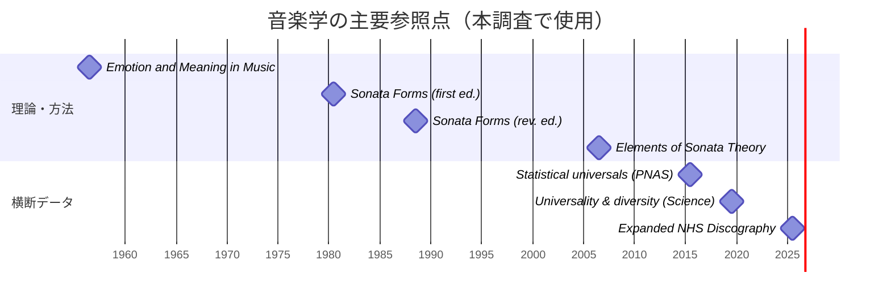

# 音楽学における五段階モデルの構造類似調査

## エグゼクティブ・サマリー

本調査は、提示された依頼ファイルの指示（「音楽学の理論・現象を調査し、五段階モデル〔場→波→縁→渦→束〕と**同型のプロセス構造**をもつ候補を三件、テンプレート形式で具体記入」）に従い、音楽学領域から三つの候補を選び、一次文献を軸に「構造類似（過程の同型性）」として“指し示す”形で整理したものです。特に、ソナタ形式研究では、ソナタ形式を固定テンプレートではなく「プロセス（texture/process）」として捉える系譜が明確であり、調性上の“対立→解決”を中心に五段階へ対応づけやすい点が確認されます。citeturn10view0turn11view0

三件のうち、最も五段階との対応が直截なのは、entity["people","Leonard B. Meyer","emotion meaning 1956"]による期待（expectation）・遅延／逸脱（delay/deviation）・サスペンス・解決（resolution）を軸とした情動生成の枠組みです。音楽が聴取者に期待を生み、その期待が阻害・遅延され、複数の継続可能性が立ち上がり、最終的に（必ずしも“予想通り”ではない形で）収束し、信念・習慣（スタイル理解）へ束ねられていく、という時間的推移が一次文献上で比較的明瞭に記述されています。citeturn14view0turn14view1turn14view2

また、歌の普遍性・多様性を扱うentity["people","Samuel A. Mehr","music cognition researcher"]らの大規模横断研究は、世界の歌行動を“未分化の場”として受け止め、データ化（波）→次元圧縮と解釈軸の抽出（縁）→分類・予測の成立（渦）→統計的規則性やコーパス資源としての定着（束）へと、知識生成プロセスが段階的に進む点で、五段階モデルとの対応候補を与えます。特に、eHRAF の三百十五社会サンプルに対し「音楽は全社会に存在」と推定する分析や、四千七百九件の歌事象記述から三次元（形式性・覚醒度・宗教性）を抽出する結果など、定量的な“束”が明確です。citeturn2view0turn24view0turn8search0

## 依頼ファイルの指示と、欠落時に起こり得る解釈

依頼ファイルが示す要件は、要約すると次の三点に収束します。第一に、対象は「音楽学（Musicology）」であり、既存エントリ（即興の情報処理サイクル、GTTM、シェンカー三層）と**重複しない**候補を三件選ぶこと。第二に、五段階モデル（場・波・縁・渦・束）と“表層語”ではなく“プロセス構造”が同型であることを、無理な論証ではなく「対応しうる」として提示すること。第三に、各エントリはテンプレートの全欄を具体記入し、一次文献（一次資料）を中心に確立事項を三〜五点提示することです。citeturn11view0turn14view0turn2view0

一方、もし「ファイルの指示」が未提示・不明確なままだった場合、（今回のような）調査の設計は大きく揺れます。代表的には次の解釈があり、それぞれ手法が変わります。

第一の解釈は「音楽学という学問領域の概説（歴史・方法論・主要潮流）をディープリサーチせよ」という依頼です。この場合、研究対象は個別理論のプロセス対応ではなく、音楽学史（例えば分析中心史観、民族音楽学、批判理論以降の転回など）と学会・査読誌の動向になり、一次文献も古典（方法論書）と学会声明が中心になります。citeturn11view0

第二の解釈は「五段階モデルそれ自体を音楽学・認知音楽学に照らして検証せよ」という依頼です。この場合、五段階モデルを“仮説”として扱い、聴取実験・計算モデル・神経指標（ERP・fMRI）などで段階性を操作的に定義し、反証可能性の高い設計（例えば期待違反の位置・強度操作）へ寄せます。citeturn18view0turn22view0

第三の解釈は「データセット／ツールを提示し、再現可能な分析パイプラインを構築せよ」という依頼です。この場合、焦点は“知識生成の五段階”よりも、公開コーパス（例：歌の横断コーパス、民謡コーパス）と特徴抽出・分類器・再現用コード（OSF/GitHub 等）になります。citeturn8search0turn2view0turn15view0

第四の解釈は「日本語圏の二次文献中心で整理せよ」という依頼です。この場合、英文一次文献の読解より、日本の受容史や国内心理学・音楽学のレビュー（例えば調性的期待のERPレビュー）を主軸にし、国外研究は“参照枠”へ後退します。citeturn22view0

今回の実行では、実際に提示された依頼ファイル内容に従い、上記のうち「三件のテンプレート記入（構造類似）」として設計しています。citeturn10view0turn11view0turn14view0turn2view0

## リサーチ設計

候補選定は、依頼ファイルで示された“探索焦点”を起点に、（既調査と重複しない範囲で）「段階的変容が明示される」「一次文献に立脚できる」「音楽学としての射程がある」ものを優先しました。具体的には、(a) 作品内形式のプロセス（ソナタ形式）、(b) 聴取者の期待と情動のプロセス（Meyerの期待理論）、(c) 歌行動の普遍性と多様性をデータ化して“規則性へ束ねる”研究過程（Natural History of Song）を採用しています。citeturn10view0turn14view0turn2view0

一次文献の優先順位は、原著（本・論文）＞収録章・公的リポジトリ（PMC 等の公的アーカイブ）＞学術出版社・公式プロジェクトページ（OSF、eHRAF 等）としました。歌の横断研究では、分析とデータ公開がセットになっているため、論文本体だけでなく、データ公開基盤（OSF）や可視化サイトも一次的付帯資料として重視しています。citeturn2view0turn8search0turn8search1turn24view0

「構造対応の強度（高/中/低）」は、(1) 段階の順序が自然に読めるか、(2) 各段階が具体行為・出来事へ落ちるか、(3) その段階が一次文献上で（語彙としてでなく）機能として確認できるか、(4) 既存エントリ（即興サイクル・GTTM・シェンカー）と異なるレイヤーを扱っているか、で暫定評価しています。citeturn11view0turn14view1turn2view0


## 構造類似エントリ

### 音楽学-A: ソナタ形式の「調性対立→解決」プロセス

**[P] 確立された事実**:  
- entity["people","James Hepokoski","music theorist"]とentity["people","Warren Darcy","music theorist"]は、ソナタ形式研究の方法論的状況を整理する中で、entity["people","Charles Rosen","musicologist pianist"]のentity["book","Sonata Forms","rosen 1988 revised ed"]が、ソナタ形式を単一の固定型ではなく“手続きの多様性をもつプロセス（texture/process）”として捉え、ゆえに複数形 “forms” を採る、と位置づけている。citeturn11view0turn11view1  
- 同章は、Rosenの論点として、提示部の主調—属調（あるいは非主調）への移行を「対立的な動き」「大規模な不協和（large-scale dissonance）」として捉え、それが再現部で解決されるべき“構造的問題”になることを明示している。citeturn11view0  
- 一般的なソナタ形式は、提示部・展開部・再現部という大区分で説明され、提示部は主題群を提示しつつ主調から関係調へ移行し（典型的には主調→属調）、展開部は素材を不安定に展開し、再現部は主調へ回帰して“非主調領域で提示された材料”を主調へ回収しやすい。citeturn10view0  
- 教材的整理では、古典派では提示部反復と「展開部＋再現部」をまとめた反復（いわゆる二リプリーズ）的に見えることがあり、提示→（差異の増幅）→回収という“時間的推進力”が形式の核として扱われる。citeturn10view0  

**プロセス/段階の記述**:  
提示部で、聴取者に“主調＝安定”が与えられた直後に、推移と第二主題群によって“安定から外れた領域”が確立され、作品が自ら課題（対立）を立ち上げる。展開部では、その対立が素材レベル（動機断片化・転調・テクスチュア変形）で増幅され、要素間の関係（何が保持され、何が変形されるか）が可視化される。再現部は、提示部の出来事を“主調の枠内に再配置する”ことで、提示部で立っていた構造的不協和を運動として終わらせる（回収する）。その後コーダがある場合、解決後の安定を強化し、全体を記憶に残る「まとまり」として閉じる。citeturn10view0turn11view0  

**5段階との構造対応（候補）**:

| 5段階 | この理論の対応概念 | 対応の根拠 | 強度（高/中/低） |
|---|---|---|---|
| 場（Field） | 主調の確立・提示部冒頭の安定場 | まだ対立が顕在化しない“前提としての安定” | 中 |
| 波（Wave） | 提示部における主調—非主調の極性化 | 差異が「対立」として立ち上がる（極性・不協和の生成） | 高 |
| 縁（Relation） | 展開部での変形・転調・関係の探索 | 境界上で素材が触れ合い、関係法則（保持/変形）が現れる | 高 |
| 渦（Vortex） | 再現部での主調回収＝解決の凝集点 | 対立が“ひとつの帰結”として収束し、まとまりが立つ | 高 |
| 束（Bundle） | コーダ／終止による定着、形式経験の残存 | 解決が方向性（次への見通し・完成感）として束ねられる | 中 |

**構造類似の質**:  
ソナタ形式は「差異（対立）の生成→関係の増幅→回収」という時間的推進を形式の内部に組み込む点で、五段階の“分化と収束”に構造的に近い。一方で、五段階の「束」が“渦どうしの相互作用”を含意するなら、単一楽章内のコーダはやや弱く、むしろ“受容史としての形式定着”まで見たときに束が強化される。citeturn11view0turn10view0  

**牽強付会リスク**: 中（「場」と「束」を作品内部だけで完結させるか、受容・規範化まで含めるかで読みが変わるため）。citeturn11view0  

**主要文献**:  
- Rosen, C. (1988). *Sonata Forms* (Revised ed.). entity["company","W. W. Norton & Company","publisher"]. citeturn11view0turn10view0  
- Hepokoski, J., & Darcy, W. (2006). *Elements of Sonata Theory: Norms, Types, and Deformations in the Late-Eighteenth-Century Sonata*. entity["organization","Oxford University Press","academic publisher"]. citeturn11view1turn6view0  

image_group{"layout":"carousel","aspect_ratio":"16:9","query":["sonata form diagram exposition development recapitulation","tonal polarization tonic dominant diagram","sonata principle large-scale dissonance diagram"]}

### 音楽学-B: 期待・遅延・解決としての情動生成

**[P] 確立された事実**:  
- entity["book","Emotion and Meaning in Music","meyer 1956"]においてMeyerは、傾向（tendency）は意識的・無意識的に働きうること、そして広い意味での傾向は期待（expectation）として理解できることを述べ、音楽が期待を喚起し、それが即時に満たされる場合もあれば満たされない場合もあると整理している。citeturn14view0turn13view0  
- Meyerは、結果（consequent）はスタイル内で可能である限り、あらかじめ「特定のもの」ではなくてもよく、到来が早すぎたり遅れたりしうるが、全体パターンの効果は「当初の期待の特異性」に強く条件づけられる、と述べる。citeturn14view1  
- 不確実性や疑いが強いとき、傾向の阻害・遅延がサスペンス（suspense）や不安を生み、遅延の瞬間に代替的継続可能性が立ち上がる、という“時間差による情動化”が言語化されている。citeturn14view1turn14view2  
- 予期外の出来事が起きた後、聴取者はそれを作品のスタイルに関連する信念体系の中へ“急速に適合させようとする”が、適合のされ方によって判断保留・拒否・見込み違いの再解釈等が生じうる、という認知的帰結が提示される。citeturn14view2  
- 期待違反と情動の結びつきは、後続研究でも、例えばライブ演奏の場で情報量の高い事象（期待違反）と主観的不意性・生理反応（覚醒・自律反応など）が対応することが報告され、期待モデルが情動反応予測に用いられている。citeturn18view0  

**プロセス/段階の記述**:  
まず、聴取者の内部には、文化的学習に由来する“傾向の束”が未分化に作動している（次に何が来てもおかしくないが、完全に無秩序でもない状態）。音が進むと、ある進行・拍・和声が「次にこう来るはずだ」という期待を具体化し、期待が阻害・遅延されると、サスペンスとして身体化される。この時点で、複数の継続可能性が“関係の網”として立ち上がり、どの帰結が“スタイル上の自然さ”をもつかが重みづけされる。やがて到来した帰結が、当初の期待の強度に応じて解放感／驚き／再解釈をもたらし、最終的に「この作品（あるいはこのスタイル）はこういう秩序をもつ」という信念へ束ねられる。citeturn14view0turn14view1turn14view2  

**5段階との構造対応（候補）**:

| 5段階 | この理論の対応概念 | 対応の根拠 | 強度（高/中/低） |
|---|---|---|---|
| 場（Field） | 文化的に学習された傾向の作動 | まだ分化しない“期待の下地”として漂う | 高 |
| 波（Wave） | 期待の立ち上がり／阻害 | 差異（満たされない・遅れる）が揺れとして顕在化 | 高 |
| 縁（Relation） | 代替継続の並立と重みづけ | 境界上で可能性が関係網として編まれる | 高 |
| 渦（Vortex） | 到来した帰結と再評価 | 一つのまとまりとして“解決”が立ち上がる | 高 |
| 束（Bundle） | 信念体系への統合・スタイル理解の更新 | 方向性をもつ形で経験が定着する | 中 |

**構造類似の質**:  
五段階モデルが「未分化→差異化→関係化→凝集→定着」を指すなら、Meyerの期待理論は“時間差による差異化（遅延）”と“信念体系への再統合”が明示され、構造対応が最も直線的である。独自要素としては、情動を単純な快・不快ではなく、期待・不確実性・再評価の複数段階（多成分）として語る点が、五段階の内部にさらなる細分化余地を与える。citeturn14view1turn18view0  

**牽強付会リスク**: 低（一次文献が「期待→遅延/阻害→サスペンス→解決→統合」を比較的明示するため）。citeturn14view1turn14view2  

**主要文献**:  
- Meyer, L. B. (1956). *Emotion and Meaning in Music*. entity["organization","University of Chicago Press","academic publisher"]. citeturn13view0turn14view1  
- Egermann, H., et al. (2013). Probabilistic models of expectation violation predict psychophysiological emotional responses to live concert music. entity["organization","Cognitive, Affective, & Behavioral Neuroscience","journal"], 13, 533–553. citeturn18view0  
- entity["people","David Huron","music cognition researcher"] (2006). entity["book","Sweet Anticipation","huron 2006"]. entity["organization","MIT Press","academic publisher"]. citeturn23view0  

### 音楽学-C: 歌の普遍性と多様性を“束ねる”データ駆動研究

**[P] 確立された事実**:  
- Mehrらは、eHRAF世界民族誌データベースを用いて「音楽は普遍か」を検討し、三百十五社会のうち三百九社会で音楽記述があり、残る六社会もデータベース外の一次民族誌で音楽の存在が確認できるとして、サンプル上の音楽存在比率を一〇〇％と推定し、ベイズ的な九十五％信用区間を併記している。citeturn2view0turn24view0  
- 彼らはentity["organization","eHRAF World Cultures","ethnography database"]内の六十社会（PSF）を用い、四千七百九件の歌パフォーマンス記述からなる“NHS Ethnography”を構築したと述べ、これは三百十五社会データベースの約四千五百万語サブセットで、Murdockの六十文化クラスターから擬似無作為に抽出された六十社会を含む、と説明している。citeturn2view0turn24view0  
- NHS Ethnographyの注釈を次元圧縮すると、形式性（Formality）・覚醒度（Arousal）・宗教性（Religiosity）の三次元が最適で、全変動の二六・六％を説明し、各次元の寄与（例：一五・五％など）も報告されている。citeturn2view0  
- 音源側（NHS Discography）では、歌の行動文脈（ダンス/子守/治療/恋）を機械分類で予測する試みがなされ、四分類課題で人間聴取者の正答率が四二・四％、最良の分類器が五〇・八％であることなどが示される。citeturn2view0  
- 探索的分析として、専門聴取者の注釈にもとづく“調性中心（tonal center）の知覚”が評価され、肯定回答が九七・八％で、百十八曲中の大半が高一致で“トーナル”と評定される、と報告される。citeturn2view0  

**プロセス/段階の記述**:  
世界中の歌行動は、当初は多様で未分化な“場”として存在するが、民族誌記述として採録される段階で「出来事としての歌（song event）」が立ち上がり、差異（波）が観測可能になる。次に、人手注釈と統計モデルによって、歌行動の差異が少数の潜在次元（形式性・覚醒度・宗教性）へ整理され、差異が“関係の空間（縁）”として把握される。さらに、音源特徴から文脈分類が一定精度で可能になることで、「歌の形が行動文脈に結びつく」というまとまり（渦）が成立し、最終的に“普遍性（音楽の存在）”や“統計的規則性（調性知覚の頻度、分類精度）”として知識が束ねられ、公開データ資源として残る。citeturn2view0turn8search0turn8search1  

**5段階との構造対応（候補）**:

| 5段階 | この理論の対応概念 | 対応の根拠 | 強度（高/中/低） |
|---|---|---|---|
| 場（Field） | 世界の歌行動（未分化の総体） | まず“存在する”が、構造は未固定 | 中 |
| 波（Wave） | 事例化（song event化）と多様性の顕在化 | 差が記述・注釈として立ち上がる | 高 |
| 縁（Relation） | 潜在次元（形式性・覚醒度・宗教性） | 差異が少数軸の関係として編まれる | 高 |
| 渦（Vortex） | 文脈分類・調性知覚などのまとまり | 形—機能リンクが凝集点として立つ | 中 |
| 束（Bundle） | 公開コーパスと規則性の定着 | データ・可視化・再分析可能性として残る | 高 |

**構造類似の質**:  
作品内部ではなく“知識生成”の過程として五段階に対応するタイプであり、未分化な現象をデータ化し、少数の軸へ整理し、予測可能性として凝集し、資源として定着させる点は五段階の“束ね”に強い。一方、音楽現象それ自体の内在的段階というより、研究手続きの段階性であるため、音楽理論そのものの類似としては一段メタになる。citeturn2view0turn8search0turn24view0  

**牽強付会リスク**: 中（音楽現象の内的プロセスではなく、研究・データ化プロセスに写像しているため）。citeturn2view0turn8search0  

**主要文献**:  
- Mehr, S. A., et al. (2019). Universality and diversity in human song. entity["organization","Science","aaas journal"]. citeturn2view0turn8search5  
- entity["organization","Open Science Framework","research data platform"]: Natural History of Song (data & materials). citeturn8search0  
- entity["organization","The Music Lab","nhs visualization site"]: NHS Interactive Visualizations / Explorer. citeturn8search1turn8search4  
- entity["organization","Human Relations Area Files","cross-cultural consortium"]: eHRAF World Cultures / PSF sampling description. citeturn8search2turn24view0  
- entity["people","Patrick E. Savage","musicology pnas 2015"], et al. (2015). Statistical universals reveal the structures and functions of human music. entity["organization","Proceedings of the National Academy of Sciences","journal pnas"], 112(29), 8987–8992. citeturn15view0  

## 横断比較とデータ・エビデンスのレビュー

三件は、同じ「音楽学」でも分析単位が異なります。ソナタ形式は作品内部の形式運動、期待理論は聴取者内の認知—情動運動、横断コーパス研究は歌行動を“記述→注釈→統計的規則性”へ束ねる知識運動です。このズレ自体が、五段階モデルが「現象の内部過程」にも「研究の生成過程」にも投影可能であることを示します。citeturn10view0turn14view1turn2view0

下表は、三件の“定量的アンカー”を比較したものです（数値は各一次資料の報告に基づく）。

| 観点 | ソナタ形式（A） | 期待理論（B） | 横断コーパス（C） |
|---|---|---|---|
| 主なエビデンス形態 | 形式分析・理論記述（作品例） | 理論記述＋実験研究が接続可能 | 大規模コーパス＋統計モデル |
| 定量例（代表） | （典型区分：提示/展開/再現） | ライブ実験：参加者50名 | eHRAF社会315、歌記述4709、三次元26.6%、分類50.8% など |
| 五段階対応の強い箇所 | 波〜渦（対立→回収） | 場〜渦（期待→遅延→解決） | 縁〜束（次元抽出→資源化） |

表中の実験参加者数や分類精度などは、期待違反が情動・生理反応に関係するライブ実験（参加者五十名）および NHS の三次元・分類精度・調性評価などの報告に基づきます。citeturn18view0turn2view0

期待と快の関係については、別系統の定量研究もあり、例えば西洋調性和声をモデルに米国ビルボード・ポップ曲の八万コードの不確実性と驚き（surprise）を機械学習で定量化し、快評定がそれらの関数として非線形に変動すること、さらに扁桃体・海馬・聴覚皮質などで相互作用が観測されることが報告されています。citeturn19view0

また、文化横断の“普遍性”に関しては、NHS の「歌の存在」推定に加え、音源三百四件を九地域からサンプルし、絶対普遍はないが統計的普遍が複数支持される、とする研究もあり、普遍性を「例外ゼロ」ではなく「確率的に優勢」として扱う枠組みが前提化しています。citeturn15view0turn2view0

## シナリオ分析

五段階モデルは、どの“生成過程”を想定するかで写像が変わります。ここでは代替仮定を置いた場合の変化を整理します。

仮に、五段階を「作曲者の創作過程（アイデアの未分化→葛藤→関係化→作品化→様式として定着）」として厳密化するなら、候補A（ソナタ形式）は“作品内部過程”なので一段ズレ、候補B（期待理論）は“聴取側過程”なので二段ズレる可能性があります。その場合、候補Cのように“研究による束ね”ではなく、作曲認知モデルやスケッチ研究へ候補を差し替えるのが合理的です（ただしこれは依頼ファイルの候補リスト外で、追加指示が必要になります）。citeturn21view0turn14view1

仮に、対象を西洋中心から外し、「ラーガ／マカーム等の即興構造」や「非西洋の音階・リズム体系」を主軸にするなら、候補Aの“主調—属調”の対立は一般化しづらくなります。この場合は、候補Cが提供する“文化横断コーパス＋次元”の枠組みを母体にしつつ、非西洋の様式規範をどの注釈軸へ落とすか（例えば儀礼性・身体同期・修辞的定型など）を再設計する方向が現実的です。citeturn2view0turn24view0

仮に、成果物が「再現可能な計算実験」を要求する形にスライドするなら、候補Bは「期待」を情報理論量（情報量・エントロピー）へ写像する路線が強くなります。実際に、統計学習と確率予測（IDyOM 等）で、期待・情動・記憶・分節などを単一プロセスとして説明しうる、というレビューも存在します。citeturn21view0turn18view0

最後に、候補Cの文脈では、データ資源自体が更新されうる点が重要です。二〇二五年には、NHS の拡張版として一〇〇七曲断片・四百十三言語・十種の行動文脈を含むオープンアクセス・コーパスが報告され、従来の“四文脈”縛りを超えて概念再現（ proof of concept ）が可能になりつつあります。したがって「束（Bundle）」を“固定した結論”ではなく“拡張可能な資源”として捉える方向に、五段階の意味合いが変わります。citeturn9view0turn2view0



## まとめと実務的提案

### 音楽学 総評

**構造類似の全体的強度**: 高（Bが高、Aが高〜中、Cが中〜高で、三件合成としては高に寄る）citeturn14view1turn11view0turn2view0  
**最も構造類似が高い候補**: 期待・遅延・解決としての情動生成（Meyer）citeturn14view1turn14view2  
**この領域の独自性**: 「作品（形式）」「聴取（期待）」「文化横断（データ）」が同居するため、五段階モデルを“現象内部”にも“研究生成”にも投影できる多層性がある。citeturn10view0turn2view0  
**既存エントリ（EV-MU-001, CA-001〜002）との関係**:  
本調査のAは（GTTMやシェンカーが扱う）より微細または階層的な構造分析とは別に、楽章規模の形式運動（対立→回収）に焦点を当てる。Bは期待生成・遅延・解決という聴取側プロセスで、即興の情報処理サイクル（EV-MU-001）とも接続可能だが、ここでは“情動—意味”側を主題化する。Cは分析対象ではなく知識資源の生成で、既存エントリの理論比較を外側から支える“束”として機能しうる。citeturn2view0turn11view0turn14view1  
**注意点**:  
五段階の「場」と「束」は、作品内部に閉じるか、受容・学習・データ資源の定着まで含めるかで定義が揺れやすい。特にCは研究プロセス写像である点を明示した上で使う必要がある。citeturn2view0turn9view0  

### 実務的な推奨

第一に、五段階モデルを“何のプロセス”として扱うか（作品内形式か、聴取認知か、文化進化か、研究生成か）を、エントリごとにラベル化して併記すると、牽強付会リスクが下がります。例えば本調査では、A＝作品内形式、B＝聴取認知、C＝研究生成と明示するだけで、「束」の解釈が安定します。citeturn11view0turn14view1turn2view0

第二に、候補BとCは定量化へ接続しやすいので、「五段階の操作的定義」を一度小さく作るのが有効です。Bでは期待（予測確率）・遅延（時間差）・違反（情報量）を定義し、主観評定や生理指標で渦・束の成立を捉える設計が考えられます。citeturn18view0turn19view0turn22view0

第三に、Cの資源は更新可能であるため、NHS（旧）と拡張NHS（新）を“束の更新”として並置し、同一仮説（形—機能リンク等）がどこまで再現されるかを追うと、五段階モデルの再帰性（束が次の場になる）が扱いやすくなります。citeturn9view0turn2view0turn8search0

## 追加で必要な情報と入力テンプレート

依頼ファイルの形式は満たされていますが、次の情報が増えると、構造類似の精度と再利用性が上がります。

必要になりやすい欠落情報は、(a) 五段階モデルを「作品内／聴取内／文化進化／研究生成」のどれとして優先するか、(b) 西洋音楽中心か文化横断中心か、(c) 一次文献の許容範囲（書籍のみか、査読論文まで含むか）、(d) “既存エントリ”の定義範囲（同テーマの別角度は可か不可か）、(e) 出力の利用目的（カード化、論文草案、授業教材など）です。citeturn2view0turn10view0turn14view1

以下は、追加指示をファイルで渡すための最小テンプレート例です（日本語で十分です）。

```markdown
# 追加指示テンプレート（例）

## プロジェクト目的
- 例: 構造類似カードを知識ベース化したい / 論文の導入候補を探したい

## 五段階モデルの扱い
- 優先するプロセス単位: [作品内形式 / 聴取認知 / 文化進化 / 研究生成]
- 「場」「束」をどこまで含めるか: [作品内のみ / 受容史まで / データ資源まで]

## 対象範囲
- 地域・様式: [西洋古典中心 / 世界横断 / 特定地域(    )]
- 追加で避けたい重複テーマ: [例: シェンカー系は禁 / 即興は禁 など]

## エビデンス要件
- 一次文献の定義: [原著書籍のみ / 査読論文まで / 公開データセット必須]
- 日本語文献の比率: [必須 / あれば / 不要]

## 出力要件
- エントリ数: [3 / 5 / 10]
- 望ましい粒度: [概説 / 詳細 / 実験設計まで]
- 図の種類: [mermaid必須 / 画像必須 / 図は不要]

## 注記
- 禁止事項 / トーン / 用語の好み など
```