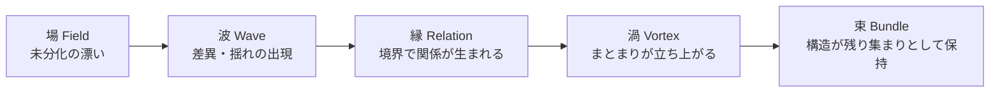
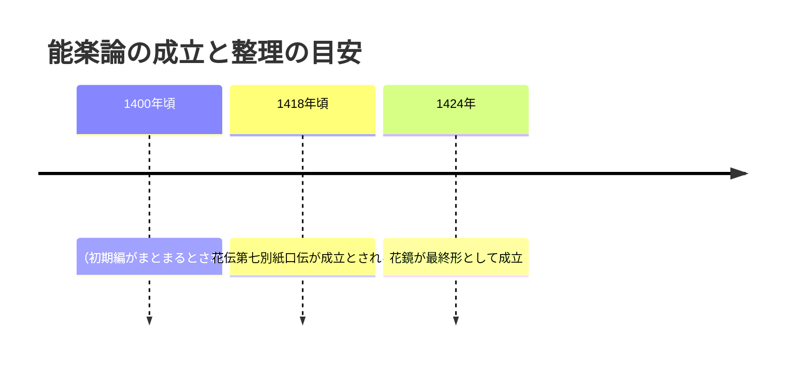
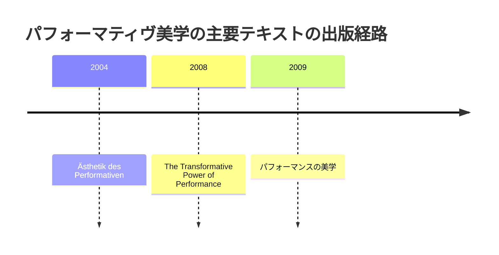

# 舞台芸術の構造類似調査

## エグゼクティブサマリー

本調査は、依頼文書で提示された「場→波→縁→渦→束」の5段階モデル（創造プロセスの段階的な変容）と、舞台芸術における理論・現象のプロセス構造の同型性（構造類似）を、3候補について「指し示す」ことを目的とする。重複回避の指定（Grotowski／スタニスラフスキー／暗黒舞踏）を踏まえ、①能楽における修行論、②即興演劇の訓練体系、③パフォーマンス研究における上演の出来事論を採択した。各候補について一次文献（著書・原典）を中心に、段階記述と5段階対応表を作成した。

結論として、3候補はいずれも「未分化の場」から「差異の立ち上がり」→「関係の生成」→「まとまりとしての成立」→「持続する束（型・文化・余効）」へと移るプロセスを含むが、とくに能楽の芸道論は、修行の長期過程を（伝書体系・教えの整理として）明示的に扱う点で構造類似が最も強い。citeturn9search2turn7search0turn9search4

## 調査設計と方法

本調査の「構造類似」は、語彙の一致ではなく、(a) 段階が区別されること、(b) 段階間の推移が不可逆または履歴依存であること、(c) 後段が前段の生成物を束ねて残すこと、の3点が観察できるかで評価した。一次文献は、(1) その理論・実践を提唱した当事者による著書・原典、または(2) 当事者著作の公刊版・翻訳版（本文が確定している版）を優先し、補助的に公的機関の解説ページや出版社書誌で時期・構成を確認した。citeturn19view0turn15search1turn13search0turn6search4

強度（高/中/低）は、「本文上で明示されている／章立てや概念が段階的である」場合を高、「本文の意図から自然に読み取れるが明示は弱い」を中、「対応付けに追加仮定が多い」を低とした。なお、依頼文書の方針に従い、ここでは厳密な論証や反証可能性の提示ではなく、対応関係の指標化と牽強付会リスクの明示に止める。

一次文献の全文がオンラインで十分に閲覧できないケースがあるため、概念の要点や書誌・構成の確認には、公的解説や出版社・図書館書誌も併用した。章・頁単位での精査が必要な場合は、同一版（同一ISBN/版）を入手して逐語的に照合することが望ましい。

## 調査結果

### 舞台芸術-甲: 能楽の芸道論と花  entity["people","世阿弥","noh actor-playwright"]

**[P] 確立された事実**:
- 『花伝（かでん）』（世阿弥の代表的能楽論）は7篇からなり、応永年間に徐々に成立したと解説される。citeturn9search2  
- 『花鏡』は、1421年頃までに「花鏡」としてまとめ直され、1424年に最終的形が成立したとされる。citeturn3search12  
- 『花鏡』では「初心不可忘」を「是非の初心」「時々の初心」「老後の初心」の3つに分けて説く、という形で要点が整理されている。citeturn7search0  
- 『花伝』第七別紙口伝に関して、能の「花」は観客に生じる「面白さ／めづらしさ」と同心である、という説明（抜粋解説）が示されている。citeturn9search4  
- 『風姿花伝』の命名について、「心より心に伝る花」であるから「風姿花伝と名付く」という引用を含む解説がある。citeturn5search2  

**プロセス/段階の記述**:
- 幼少・初学の段階では、芸はまだ評価語で切り分けられず、「自然に出る」身振り・声・動きが混在する（未分化の稽古場）。
- 稽古の進展とともに、上達や衰え、型の反復と停滞といった差異が浮上し、「今うまくいくこと」と「長期の花」の緊張が生じる。
- 観客の側の心（見所）との関係が中心化し、「花」は自己内部の属性ではなく、相互作用の境界で立ち上がる現象として意識される。
- そのうえで演者は、場の要請（時・観客・演目・共演者）に応じて芸をまとめ上げ、「一つのまとまり」としての上演が成立する。
- 最終的には、芸の勝負・伝承・再現可能な稽古体系として残り、後進に束として継がれる（ただし固定化は花の死とも隣接するため、変化（移り）を内包した束になる）。

**5段階との構造対応（候補）**:

| 5段階 | この理論の対応概念 | 対応の根拠 | 強度（高/中/低） |
|--------|-------------------|-----------|----------------|
| 場（Field） | 初学の「自然」な稽古場 | 初期は分節された評価よりも、混在した身振り・声・動きが先行する（年来稽古条々の趣旨として解説される）。 | 高 |
| 波（Wave） | 「時分の花」への依存と不安定さ | 年齢・熟達で現れる差異（上達／衰え、伸び／停滞）が揺れとして現れ、「初心」をどう保持するかが課題化される。 | 高 |
| 縁（Relation） | 見所（観客）との境界で立つ「花」 | 花は「面白さ／めづらしさ」と結び付けられ、観客の心に生じる作用として説明される。 | 高 |
| 渦（Vortex） | 上演の「まとまり」 | 観客・場・型の制約を束ねて一回の上演が成立する（花を咲かせるために停滞しない＝移る、という条件付けを含む）。 | 中 |
| 束（Bundle） | 秘伝・稽古体系としての伝承 | 7篇の伝書として整理され、後代へ継承される枠組み（ただし束は固定化でなく、移りを含む束）。 | 高 |

上の対応表で根拠にした要点（伝書の構成・成立、初心不可忘、花＝めづらしさ、停滞しないこと）は公的機関の解説および同機関の引用を含む説明に基づく。citeturn9search2turn3search12turn7search0turn9search4turn9search0

上図の時期情報は、7篇の成立過程の説明、および『花鏡』の成立年に関する公的解説に拠った。citeturn9search2turn3search12turn3search5

**構造類似の質**:
この候補は、長期の修行過程（未分化→差異化→観客との関係化→上演の成立→伝承としての残存）を、伝書体系という形で保持している点で、表面的ではなく「プロセス構造」側の類似が出やすい。一方で、5段階の「渦」と能の一回の上演を対応させるとき、能側には「型」「秘す」「時節」など独自の制御変数が多く、渦を単純な“完成”として理解するとずれる。

**牽強付会リスク**: 中 + 5段階を「人生の修行論」として読むと整合しやすいが、能の理論は観客心理・秘伝・宗教性などが絡むため、段階を一般化しすぎると固有性を落とす。

**主要文献**:
- entity["book","風姿花伝（花伝書）","zeami noh treatise"]. 世阿弥(1958). entity["company","岩波書店","japanese publisher"]. citeturn19view0  
- entity["book","花鏡","zeami noh treatise"]. 世阿弥(1952). entity["company","わんや書店","japanese publisher"]. citeturn14search14  
- entity["book","至花道","zeami noh treatise"]. 世阿弥(1974). entity["book","日本思想大系 24","iwanami series volume 24"]収録. 岩波書店. citeturn14search1  
- entity["book","申楽談儀","zeami noh treatise"]. 世阿弥(1934). 岩波書店. citeturn3search6  

image_group{"layout":"carousel","aspect_ratio":"16:9","query":["能舞台 能 上演 写真","能面 演者 舞台 写真","Noh stage performance Japan","Kyogen Noh theatre stage"],"num_per_query":1}

### 舞台芸術-乙: 即興演劇の訓練体系  entity["people","キース・ジョンストン","improv teacher"] と entity["people","ヴァイオラ・スポーリン","improv educator"]

**[P] 確立された事実**:
- Johnstoneの『Impro』は、1979年にentity["company","Faber & Faber","publisher"]からの刊行が書誌情報として示されている。citeturn15search4  
- 『Impro』は、「Status」「Spontaneity」「Narrative Skills」「Masks and Trance」の4部構成として説明されている。citeturn18search16  
- Johnstoneはentity["point_of_interest","ロイヤル・コート劇場","london, uk"]のアソシエイト・ディレクター時代などに俳優訓練の技法を発展させ、のちにentity["organization","The Theatre Machine","improv troupe"]を創設した、と出版社紹介で述べられている。citeturn8search22  
- Spolinの『Improvisation for the Theater』第3版は、1999年にentity["organization","Northwestern University Press","evanston, il, us"]から出版され、同ページは「即興演劇のバイブル」と位置付け、初期版が10万部以上売れたこと、他領域にも影響したことを述べている。citeturn15search1  
- Spolinの『Theater Games for the Classroom』は130以上のシアターゲームを含む、という出版社説明がある。citeturn15search2  

**プロセス/段階の記述**:
- 訓練の入口では、台本・正解・評価から一旦距離を取り、場を「安全に失敗できる」空間として作る（ウォームアップ／ルール設定／集中）。
- その場に出る提案（offer）や身体的・関係的な差異が、すぐに場を揺らす。とくに「地位（status）」「緊張」「恐れ」「沈黙」が波として立ち上がりやすい。
- そこで、相手の提案を受け、場のルールに沿って関係を結び直す（聞く／受け取る／相互に支える）。外部からのサイドコーチングは、境界での微調整として機能する。
- 反復のなかで、場は“あるまとまり”（場面・ゲーム・物語の核）を形成し、即興でありつつ再現可能な形（型）が立ち上がる。
- その型は、個人技能だけでなく、集団の文化（練習手順、規範、共通語彙）として残り、次の場で再利用される（束）。

**5段階との構造対応（候補）**:

| 5段階 | この理論の対応概念 | 対応の根拠 | 強度（高/中/低） |
|--------|-------------------|-----------|----------------|
| 場（Field） | ワークショップの「遊びの場」 | 4部構成の導入以前に、練習集団が入る“場”を作ることが前提になりやすい（訓練書の構成とワークショップ手続き）。 | 高 |
| 波（Wave） | offer／反射的ブロック／statusの揺れ | 即興は提案が出るたびに差異が生じ、受け取り・拒否で場が揺れる。『Impro』がStatusを独立章として扱うことは、この揺れを主要素材として扱うことを示す。 | 高 |
| 縁（Relation） | サイドコーチング／ルールが作る境界 | ゲームのルールと外部コーチの声が境界条件となり、相互行為を“関係”として整える。 | 中 |
| 渦（Vortex） | シーン／ゲームの「成立」 | 反復のなかで一つの場面がまとまり、即興でも「成立した」と言える状態に至る（練習が目指す到達点としての成立）。 | 高 |
| 束（Bundle） | ゲーム形式／稽古手順としての残存 | ゲームが130以上整理され、学校・教育などへも移植される形で束として残る。 | 中 |

サイドコーチングの位置付け、Spolinのゲーム体系化、Johnstoneの4部構成という「段階化された教本構造」を根拠としている。citeturn18search2turn15search2turn18search16turn15search1

**構造類似の質**:
即興演劇は“その場の生成”を扱うため、5段階の前半（場→波→縁）との相性が高い。一方で後半（渦→束）は、即興の「一回性」と、訓練体系としての「反復可能性」が同居するので、束を「固定化」ではなく「再現可能な手順・文化」として読む必要がある。

**牽強付会リスク**: 中 + 即興は多様で、短形式・長形式・競技形式などでプロセスが変わる。訓練書の一般論を、あらゆる即興の上演過程にそのまま当てると過大一般化になる。

**主要文献**:
- entity["book","Impro: Improvisation and the Theatre","johnstone 1979"]. Johnstone, K.(1979). Faber & Faber. citeturn15search4  
- entity["book","Impro for Storytellers","johnstone 1999"]. Johnstone, K.(1999). entity["company","Routledge","academic publisher"]. citeturn15search3  
- entity["book","Improvisation for the Theater","spolin 1963"]. Spolin, V.(1963/1999). Northwestern University Press. citeturn11search13turn15search1  
- entity["book","Theater Games for the Classroom","spolin 1986"]. Spolin, V.(1986). Northwestern University Press. citeturn15search2turn15search6  

### 舞台芸術-丙: 上演を出来事として捉えるパフォーマティヴ美学  entity["people","エリカ・フィッシャー＝リヒテ","theatre scholar"]

**[P] 確立された事実**:
- entity["book","Ästhetik des Performativen","fischer-lichte 2004"]は2004年にentity["company","Suhrkamp Verlag","german publisher"]から刊行された書誌情報が示されている。citeturn13search0  
- 上記著作は2008年に英訳され『The Transformative Power of Performance: A New Aesthetics』として刊行された、という説明が大学の講演案内に記されている。citeturn13search12  
- 英訳版の書誌情報および「performanceをart eventとして跡づけ、新しい美学を提起する」という出版社説明がある。citeturn13search8  
- 日本語訳『パフォーマンスの美学』が2009年にentity["company","論創社","japanese publisher"]から刊行された書誌情報がある。citeturn6search4  
- 「autopoietic feedback loop」は同理論の中心概念の一つであり、上演は俳優と観客の出会い・交換（身体的共在）を通じて生じる、という説明がインタビューで述べられている。citeturn6search9  

**プロセス/段階の記述**:
- 上演前の劇場空間は、俳優・観客が同じ時間と場所に集まることで“場”を形成するが、意味はまだ固定されない（出来事の前の未分化）。
- 上演が始まると、俳優の行為と観客の反応が相互に影響し、エネルギー・感情・思考の流れが立ち上がる（波）。
- この相互作用は「フィードバック・ループ」として自己生成的に循環し、境界（舞台/客席、行為/観察）を揺らしながら“関係”を生成する（縁）。
- その結果、上演は一回限りの「出来事」としてまとまりを持つ（渦）。意味や効果は、固定された作品ではなく、出来事の進行の中で生成される。
- 出来事は、経験変容（transformative power）や再魔術化（reenchantment）といった余効を残し、観客・コミュニティ・文化に束として残る（束）。

**5段階との構造対応（候補）**:

| 5段階 | この理論の対応概念 | 対応の根拠 | 強度（高/中/低） |
|--------|-------------------|-----------|----------------|
| 場（Field） | 身体的共在の前提 | 上演は俳優と観客が同じ時間・場所を共有することから始まるという整理が示される。 | 高 |
| 波（Wave） | ループが“働き始める”瞬間 | エネルギー・感情・思考の相互流動が立ち上がり、出来事が進行し始める。 | 中 |
| 縁（Relation） | autopoietic feedback loop | 出会いと交換を介した自己生成的循環が中心概念として位置付けられる。 | 高 |
| 渦（Vortex） | performance as event | 上演が（作品ではなく）出来事として成立し、意味が生成される、という章立て・説明がある。 | 高 |
| 束（Bundle） | transformative power / reenchantment | 体験変容や再魔術化といった余効を扱う構成が示され、出来事が後に残ることを射程に入れる。 | 中 |

英訳版の章立て（performance as event／reenchantment）と、ループ概念の説明を根拠にした。citeturn2view0turn6search9turn13search8

上図の出版経路は、独語版の出版社書誌と、英訳版への言及（講演案内）、日本語訳版の書誌に基づく。citeturn13search0turn13search12turn6search4

**構造類似の質**:
この候補は、上演の一回性を「出来事」として捉え、その生成を“ループの開始→循環→出来事の成立→余効”として描くため、5段階モデルを「出来事生成の一般形」として読むと対応が作りやすい。反面、5段階の「束」を“安定した構造の残存”と読むと、出来事の不安定さ（意味の非固定）と緊張するため、束の側も「効果・変容の残存」として再定義する必要がある。

**牽強付会リスク**: 低〜中 + 著者自身が「出来事」「ループ」「変容」といった生成語彙を明示するため前半の当てはめは比較的自然だが、束をどこまで“構造”と呼ぶかは解釈依存になる。

**主要文献**:
- Fischer-Lichte, E.(2004). Ästhetik des Performativen. Suhrkamp Verlag. citeturn13search0  
- entity["book","The Transformative Power of Performance: A New Aesthetics","fischer-lichte 2008"]. Fischer-Lichte, E.(2008). Routledge. citeturn13search8turn2view0  
- entity["book","パフォーマンスの美学","japanese translation 2009"]. Fischer-Lichte, E.(2009). 論創社. citeturn6search4turn6search0  

### 候補間の比較

下表は、3候補を「主対象（何の生成を扱うか）」「5段階との噛み合い」「牽強付会リスク」の観点で横断比較した要約である（強度評価は各候補の表に準拠）。citeturn9search2turn15search1turn13search8

| 観点 | 能楽の芸道論 | 即興演劇の訓練体系 | パフォーマティヴ美学 |
|---|---|---|---|
| 主対象 | 長期修行の生成 | その場の協働生成 | 上演＝出来事生成 |
| 強い段階 | 波・縁・束 | 場・波 | 縁・渦 |
| 典型アウトカム | 花の生成と伝承 | 反復可能なゲーム文化 | 変容と余効 |
| 牽強付会リスク | 中 | 中 | 低〜中 |
| 適した使いどころ | 修行・教育・長期熟達 | ワークショップ設計 | 観客参加型設計 |

## 感度分析

ここでは、各候補の5段階「強度（高/中/低）」を数値化し（高=3, 中=2, 低=1）、平均値を粗い「構造類似スコア」として比較した。さらに、(i) 後段（渦・束）を重く見る、(ii) 非線形に重み付けする、(iii) 不確実な段階を±1段階で揺らす、という3つの仮定変更で順位の頑健性を見た。

結果として、能楽候補は複数シナリオで最上位または同率上位を維持し、即興演劇とパフォーマティヴ美学は概ね同水準で並ぶ、という構図になった。

| 候補 | 等重み・線形(3-2-1) | 後段重視(渦束×2) | 非線形(3-1.5-0) | 不確実性を動かした最小〜最大 |
|---|---:|---:|---:|---:|
| 能楽の芸道論 | 2.8 | 2.71 | 2.7 | 2.6〜3.0 |
| 即興演劇の訓練体系 | 2.6 | 2.57 | 2.4 | 2.2〜3.0 |
| パフォーマティヴ美学 | 2.6 | 2.57 | 2.4 | 2.2〜3.0 |

簡易チャート（等重み・線形）：能楽 ████████████ 2.8／即興 ███████████ 2.6／美学 ███████████ 2.6

この感度分析は、強度ラベルの数値化という粗い仮定に依存するため、絶対値ではなく「順位の安定性」を見る補助線として扱うべきである。

## 実務的提言と次のステップ

舞台芸術の現場・教育現場で5段階モデルを使うなら、3候補はそれぞれ「どの段階の言語化が得意か」が異なる。能楽候補は、長期熟達の可視化に向き、「初心」の更新を点検項目にすることで“束が固定化して花が死ぬ”リスクを抑える設計が取りやすい。citeturn7search0turn9search0turn9search4

即興候補は、場と波を安全に扱う実践が豊富で、ルール設計とサイドコーチングを「縁」の装置として取り入れることで、創造プロセス初期に出る揺れ（恐れ・沈黙・ブロック）を可視化しやすい。citeturn18search2turn15search1

パフォーマティヴ美学候補は、観客を単なる受け手ではなく生成過程の構成要素として扱うため、観客参加型・没入型の設計で「縁→渦」を点検するフレームとして適する。特に、出来事がどの瞬間に“ループとして働き始めるか”という問いは、演出のトリガー設計（照明、導線、沈黙、合図）に翻訳しやすい。citeturn6search9turn13search8

追加の精緻化としては、各一次文献の特定章（例：花伝第七別紙口伝、花鏡の初心不可忘、Fischer-LichteのShared bodies/Performance as event章）を当該現場の課題（俳優訓練／創作稽古／観客設計）に照らして抜き出し、5段階の各段階に「観察指標（何が見えたら次段階へ移ったとみなすか）」を定義するのが有効である。citeturn7search0turn2view0turn9search4

## 舞台芸術 総評

**構造類似の全体的強度**: 高  
**最も構造類似が高い候補**: 能楽の芸道論と花（世阿弥）  
**この領域の独自性**: 「上演の一回性」と「長期修行（人生）」が同じ体系内で扱われ、観客の心に立ち上がる現象としての花を中核に据えることで、「縁」を強く内在化している。citeturn9search4turn7search0  
**既存エントリ（EV-PF-001, CA-001〜002）との関係**: 既調査が主に近代以降の俳優訓練・心理技法・身体美学に寄っているのに対し、本候補群は（甲）前近代の伝書体系、（乙）ゲーム化された協働生成、（丙）観客を含む出来事理論、という別軸で補完する。citeturn14search1turn15search2turn13search8  
**注意点**: 5段階モデルを「万能な発達段階」として扱うと、各理論がもつ固有の制御変数（秘伝、型、ルール、フィードバック、意味の非固定）を平板化しやすい。各候補の「牽強付会リスク」で示したポイントを、適用時のチェックリストとして残すのが安全である。