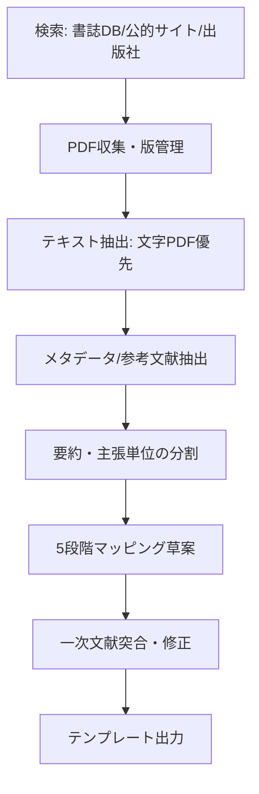

# 伝統知・技芸の構造類似調査

## エグゼクティブサマリー

依頼ファイルに記載の「5段階モデル（場→波→縁→渦→束）」を評価軸として、伝統知・技芸（Traditional Knowledge & Craft）領域から、既調査の「守破離」「杜氏の知の変換」「序破急」と重複しにくい3候補を選び、一次資料（古典テキスト、原著的研究、国際枠組み・公的資料）に寄せて「同型のプロセス構造」を指し示す形で記述した。結果として、最も5段階への“段階的変容の流れ”が見えやすいのは、環境からのフィードバックを観察・解釈し実践と制度へ束ねる **TEK（Traditional Ecological Knowledge）** 系であり、次点として徒弟制を「周縁参加→完全参加」の軌道として捉える **正統的周辺参加（LPP）** が続く。茶道の「一座建立」は、「場」の共同生成と「渦（まとまり）」の立ち上がりが鮮明である一方、5段階を“逐次プロセス”として切り出すには解釈の余地が大きい。citeturn22view1turn29view0turn15view0

**短報（約800字）**  
本調査は、依頼ファイル所定の5段階モデルを、伝統知・技芸の理論／現象に重ねる「構造類似」探索である。候補は①徒弟制の学習理論としての正統的周辺参加（LPP）、②茶事における一座建立、③伝統生態学的知識（TEK）と適応的管理の3件とした。LPPは学習を「共同体への参加の軌道」と捉え、学びを“技能獲得”だけでなく“成員化”として記述するため、場（共同体）→縁（関係とアクセス）→渦（アイデンティティ＝まとまり）→束（再生産）への対応が比較的自然である。citeturn29view0turn21view0　一座建立は、主客が役割を尽くしつつ場を共創し、ある瞬間に一体性が立ち上がるという点で「場→渦」の対応が強い（茶事の場の共創＝一座建立という記述もある）。citeturn15view0　TEKは「知識・実践・信念の複合体」として世代伝達され、環境からのパルス／驚きへの応答、管理実践、制度・価値観への内面化までを含む“変容系列”が明示され、5段階対応の強度が最も高い。citeturn22view0turn22view1turn9view0　ただしTEKは権利と倫理（FPICや利益配分等）を伴うため、参照・抽出・要約の手続き自体を設計に含める必要がある。citeturn27view4turn27view2

## 調査設計と一次資料戦略

本件は「表面的な語の一致」ではなく、(a) 未分化の前提（場）から、(b) 差異・緊張（波）が立ち、(c) 境界・関係が編まれ（縁）、(d) まとまりが立ち上がり（渦）、(e) 構造として残る（束）という“過程の型”が見えるかを重視する。ここでは、（i）学習・伝承のプロセス（徒弟制）、（ii）場の生成論（茶事）、（iii）環境応答と制度化（TEK）という、異なる「伝統知の位相」から3件を選んだ。なお、日本における技芸の公的保護・継承（無形文化財の制度、伝承者養成等）は、伝統知が“個人の技能”であると同時に“制度・共同体の営み”として扱われることを示す背景資料として位置付けた。citeturn9view3turn26search3turn23search1

### 候補比較

| 候補 | 想定される「入力」（観察・資源） | プロセスの核（何が変わるか） | 期待される「出力」（残る構造） |
|---|---|---|---|
| 徒弟制／正統的周辺参加（LPP） | 共同体、道具・作業、先達・同輩、周縁的タスク | 周縁参加→完全参加への軌道（技能＋成員性） | 熟達と同時に共同体の再生産（規範・役割の継承） |
| 茶道の一座建立 | 露地・茶室・道具、主客の準備、所作と言葉 | 主客相互が場を共創し、一体性が立ち上がる | 「一会」の共同体験が規範・記憶として残る |
| TEK／適応的管理 | 領域（territory）、環境指標、生活実践、口承知 | 観察→解釈→応答→制度化（知識‐実践‐信念の束） | ルール・スチュワードシップ・価値観としての持続 |

### 日本語優先の一次資料・公的資料の探索先

探索の実務上、日本の学術論文は **J-STAGE**（例：茶事の場の共創に関する会議論文）citeturn15view0、大学リポジトリ（例：茶書・能楽論への言及がある論考）、図書・古典は entity["organization","国立国会図書館","national diet library"] のサーチ（NDL SEARCH）で所在確認するのが基本になる（館内限定のものも多いため、本文アクセスの可否を別途判断）。citeturn8search1turn8search4　制度・政策は entity["organization","文化庁","japan govt cultural affairs"]（無形文化財、伝承事業、著作権）citeturn9view3turn27view0、entity["organization","経済産業省","japan meti"]（伝統的工芸品産業）citeturn11view3、entity["organization","環境省","japan environment ministry"]（生物多様性と伝統的知識、ABS関連）citeturn9view4turn24search0 が一次の入口となる。

### 文献収集・要約・抽出の自動化ワークフロー

以下は「PDF中心の一次文献」を、テンプレート記入に耐える形で“引用単位”まで管理するための最短構成である（AI要約は人手の一次突合で確定する）。



**主要ツール（例）**

| 目的 | ツール例 | 根拠（公式・一次） |
|---|---|---|
| PDFから文字抽出 | PyPDF2 | 文字PDFではOCRよりテキスト抽出が有利になり得る旨を明記。citeturn12search0turn12search4 |
| 表・CSV処理 | pandas | CSV等をDataFrameとして読み込む標準API。citeturn12search1 |
| 日本語固有表現抽出 | spaCy（jaモデル） | 日本語モデルの提供を公式に案内。citeturn12search2turn12search6 |
| 学術PDFの構造化（任意） | GROBID | PDF→構造化XML/TEI抽出を目的とする。citeturn12search11turn12search15 |

**CLI例（取得と一次整理）**
```bash
mkdir -p papers out
curl -L -o papers/berkes2000.pdf "https://www.cclmportal.ca/sites/default/files/2024-02/Ecological%20Applications%20-%202000%20-%20Berkes%20-%20REDISCOVERY%20OF%20TRADITIONAL%20ECOLOGICAL%20KNOWLEDGE%20AS%20ADAPTIVE%20MANAGEMENT.pdf"
python extract_pdf_text.py papers/berkes2000.pdf > out/berkes2000.txt
grep -n "definition" -n out/berkes2000.txt | head
```

**Python例（PDF→段落→メモ出力）**
```python
# extract_pdf_text.py
from PyPDF2 import PdfReader
import sys

path = sys.argv[1]
reader = PdfReader(path)
for i, page in enumerate(reader.pages):
    text = page.extract_text() or ""
    for line in text.splitlines():
        # 最低限の整形（研究用途なら行番号・ページ番号を保持する）
        print(f"[p{i+1}] {line}")
```

上記のように、抽出結果を「ページ単位で保持」しておくと、後段で“主張→根拠→出典（ページ）”の突合がしやすい。PyPDF2の抽出例は公式ドキュメントに沿う。citeturn12search4

## 構造類似調査結果

### 伝統知-甲: 徒弟制度と正統的周辺参加（LPP）

**[P] 確立された事実**:  
- entity["people","Jean Lave","situated learning author"] と entity["people","Etienne Wenger","communities of practice author"] は、学習を「状況づけられた活動」として捉える際の中心的特徴を「正統的周辺参加（legitimate peripheral participation）」と定義し、新参者が共同体の実践へ向けて参加を深める過程として記述する。citeturn29view0turn21view0  
- LPPは、新参者と古参者の関係、活動・アイデンティティ・道具（artifacts）・知識実践の共同体の関係を語る枠組みであり、「共同体の一員になるプロセス」として明示される。citeturn29view0  
- 概念形成の出発点として、西アフリカ（リベリア）の仕立屋徒弟制（Vai / Gola tailors）の観察が挙げられ、形式教育や試験がなくても熟達が成立する仕組みを説明する文脈でLPPが立ち上がった、と叙述されている。citeturn29view0  
- 「正統的な周縁性」の鍵は共同体へのアクセスであり、活動・成員・資源・参加機会へのアクセスが欠ける（新人が隔離される）と周縁参加が成立しない、という問題が論じられる。citeturn29view0  

**プロセス/段階の記述**:  
共同体（工房・仕事現場・流派）という「場」に新人が入り、いきなり中核技能を教え込まれるのではなく、まず周縁的で正統性のあるタスク（見習い仕事、道具管理、補助作業、部分工程）を担い始める。周縁参加を通じて、技能だけでなく「何が良い作法か／誰が何を決めるか／道具をどう扱うか」といった暗黙の規範を、関係の網目の中で獲得する。参加が深まるにつれ、任される工程が増え、評価や責任の配分が変わり、当人のアイデンティティ（“私はこの共同体の職人である”）が安定していく。最終的に、共同体の中心で実践を担い、次の新人を迎える側へ回ることで、共同体が再生産される。citeturn29view0  

**5段階との構造対応（候補）**:

| 5段階 | この理論の対応概念 | 対応の根拠 | 強度（高/中/低） |
|---|---|---|---|
| 場（Field） | 共同体の実践（community of practice）とその歴史・資源 | 既に流れている実践の環境が前提として存在 | 高 |
| 波（Wave） | 新参者の「周縁」と「中心」の差（緊張）／学びの志向 | 場の中で差異が立ち上がり、参加の方向が生まれる | 中 |
| 縁（Relation） | 正統性あるアクセス／新参者‐古参者の関係編成 | アクセスと関係が学びの条件（周縁性の正統化） | 高 |
| 渦（Vortex） | 成員化と熟達のまとまり（アイデンティティ＋技能） | 参加の深化が“ひとつのまとまり”として立ち上がる | 高 |
| 束（Bundle） | 実践の再生産・変容（新人を迎える側へ） | 構造が共同体の循環として残る | 中 |

**構造類似の質**:  
LPPは「学び＝情報取得」ではなく「参加の軌道」として、未分化の“場”から始まり、関係（アクセスと正統性）が編まれ、成員として立ち上がるところまでを一続きに記述するため、5段階の“生成→結晶→固定”の型を比較的指し示しやすい。いっぽう、LPP自体は連続的な軌道の語りであり、5段階の“離散的ステップ”は後付けの切り出しになりやすい。citeturn29view0  

**牽強付会リスク**: 中（軌道モデルを段階モデルへ切り分ける操作が必要）citeturn29view0  

**主要文献**:  
- Lave, J., & Wenger, E. (1991). *Situated Learning: Legitimate Peripheral Participation*. Cambridge University Press.citeturn29view0turn21view0  
- Wenger, E. (1998). *Communities of Practice: Learning, Meaning, and Identity*. Cambridge University Press.citeturn4search1turn4search19  

### 伝統知-乙: 茶道の「一座建立」と場の共創

**[P] 確立された事実**:  
- entity["people","世阿弥","noh playwright"] の能楽論『風姿花伝』には、「衆人愛敬」をもって「一座建立の寿福」とする旨の記述があり、「一座（座＝関係の場）」が成立することを芸能の成否に関わる中核概念として置いている。citeturn17view1  
- entity["organization","表千家不審菴","omotesenke foundation"] の用語解説によれば、『山上宗二記』は安土桃山期の茶の湯伝書で、entity["people","山上宗二","tea disciple of rikyu"] が天正16年（1588）頃から著し、利休時代の茶の湯を知る上で貴重な史料とされる。citeturn20view3  
- 『山上宗二記』に関連して、たとえ常の茶会であっても露地へ入ってから出るまでを「一期に一度」の会として亭主を敬畏し、世間雑談を避けるべきだ、という趣旨の文言が引かれている。citeturn30view0  
- 近年の実証的検討でも、亭主と未経験者の間であっても「主客の交流」による「場の共創」が成立し得て、その共創が「一座建立」に相当する、という整理が示されている。citeturn15view0  
- また、主客が同じ茶を「回し飲み」する行為が「一座建立」を具現し得る、という論旨で史料読解が行われている（茶会様式史の文脈）。citeturn20view2  

**プロセス/段階の記述**:  
茶事では、亭主は道具組・設え・導線（露地→席入り）を含む総体として「場」を準備し、客も服装・所作・心構えで応答して、同じ目的で“座る”関係が始まる。席入り直後は、非日常性や作法不確実性により緊張や戸惑いが立ちやすいが、その差異がやがて「主客のやり取り」（非言語を含む）として編まれ、タイミング・沈黙・音・道具の意味づけを媒介にして、一体感が立ち上がる。ある瞬間に「この座が成立した」と感じられるまとまりが現れ、それが当事者の経験に「一会」として束ねられ、次の場への規範（敬畏・雑談抑制・趣向への応答）として残る。citeturn15view0turn30view0  

**5段階との構造対応（候補）**:

| 5段階 | この理論の対応概念 | 対応の根拠 | 強度（高/中/低） |
|---|---|---|---|
| 場（Field） | 露地・茶室・道具・主客の準備がつくる前提空間 | 未分化の「会」の可能性が満ちた状態 | 高 |
| 波（Wave） | 緊張・戸惑い・非日常性（差異の立ち上がり） | 場の中にズレが生じ、注意が集中する | 中 |
| 縁（Relation） | 主客の交流（所作／沈黙／最小言語） | 境界で影響し合い、意味が編まれる | 高 |
| 渦（Vortex） | 「一体感」「この座が成立した」経験 | まとまりとして一座が立ち上がる | 高 |
| 束（Bundle） | 一会としての記憶化・規範化（敬畏／雑談抑制） | 経験が次の場の構造へ残る | 中 |

**構造類似の質**:  
「一座建立」は“場を共に立てる”という点で、5段階の「場→縁→渦」を特に強く指し示す。一方、一次テキストは規範・心構えの語りとして現れることが多く、5段階の全域（とりわけ「束＝構造として残る」の粒度）をどこまでプロセスとして切り出すかは、研究設計（観察項目・記録形式）に依存する。citeturn17view1turn30view0turn15view0  

**牽強付会リスク**: 中（現象は鮮明だが、段階分解が観察設計に依存）citeturn15view0turn17view1  

**主要文献**:  
- 世阿弥（原典系）『風姿花伝』（「一座建立の寿福・衆人の愛敬」章を含む）。citeturn17view1turn17view3  
- 山上宗二『山上宗二記』（用語解説・史料的位置づけ）。citeturn20view3  
- 茶事における場の共創＝一座建立（会議論文）。citeturn15view0  

### 伝統知-丙: TEK（Traditional Ecological Knowledge）と適応的管理

**[P] 確立された事実**:  
- entity["people","Fikret Berkes","traditional ecological knowledge"] らはTEKを、世代を超えて文化的に伝達され、適応的プロセスで進化する「知識・実践・信念の累積体」とする作業定義を提示し、TEKが knowledge–practice–belief complex であると明示する。citeturn22view1  
- 同論文は、TEKに基づく管理実践として、複数種管理・資源ローテーション・遷移管理・景観パッチ性管理などを挙げ、パルスや「生態学的サプライズ」への応答を含む、と要約している。citeturn22view0  
- さらに、知の蓄積と伝達、地域制度（リーダー／ルール）、文化的内面化、世界観・価値観の形成など、実践を支える社会メカニズムを列挙し、伝統的管理システムが環境からのフィードバックを解釈して管理方向を導く場合がある、と述べる。citeturn22view0turn22view1  
- entity["people","Henry P. Huntington","traditional ecological knowledge"] は、TEKの科学・管理への適用には利点がある一方、TEKは書かれていないことが多く、別途プロジェクトとしてインタビュー等で記録化しないと統合しにくい、という実務上の障壁を抽出している。citeturn9view0  
- entity["organization","IPBES","biodiversity platform"] はILK（先住民・地域の知）を、領域に根差し、経験や多様な知の形態（口承・暗黙知を含む）を通じて変化し続ける「統合的な知識・実践・信念の動的体系」と整理し、アクセスに際してFPIC（自由意思による事前の十分な情報に基づく同意）を求めるべきだとする。citeturn27view4turn26search1  
- entity["organization","環境省","japan environment ministry"] の資料は、伝統的知識が生物多様性の保全と持続可能な利用の双方に寄与し、先住民・地域社会の参加のもとで尊重・保護・奨励され、条約実施に反映されるべきだ、という目標（愛知目標18の趣旨）を示す。citeturn9view4  
- 名古屋議定書の公定訳では、「遺伝資源及び関連する伝統的知識の慣習的利用・交換」を、可能な限り制限しない方向で扱うべき旨が置かれており、TEK参照が権利・慣習と接続していることが分かる。citeturn27view2  

**プロセス/段階の記述**:  
生活実践が埋め込まれた領域（場）があり、そこで人々は季節性・個体群動態・災害兆候などの“平常”を身体・共同体のリズムとして保持する。資源減少や異常気象、個体群の急変といったパルスが起きると、差異が立ち上がり（波）、経験者は兆候を比較し原因連関を語り直す（縁）。次に、採取規則の変更、禁忌・輪番制・パッチ管理などの実践として応答が立ち上がり（渦）、記憶・物語・教育・制度（スチュワード、規約、価値観）に束ねられて次世代へ渡される（束）。この束は固定ではなく、環境フィードバックに応じて更新される。citeturn22view0turn22view1turn9view0  

**5段階との構造対応（候補）**:

| 5段階 | この理論の対応概念 | 対応の根拠 | 強度（高/中/低） |
|---|---|---|---|
| 場（Field） | territoryに根差した社会‐生態系の前提 | 生活と環境が未分化に絡む基盤 | 高 |
| 波（Wave） | パルス／驚き／資源変動（“異変”の立ち上がり） | 差異が顕在化し注意が向く | 高 |
| 縁（Relation） | 観察の比較・因果連関の編成（解釈） | 指標と原因を関係づける | 高 |
| 渦（Vortex） | 管理実践の発動（ローテーション等） | ひとつの対応として立ち上がる | 高 |
| 束（Bundle） | 制度・規範・価値観への束ね／世代伝達 | 実践が構造として残り更新される | 高 |

**構造類似の質**:  
TEKは「知識→実践→制度・世界観」という層を持ち、環境フィードバックに応じた“観察・解釈・応答・制度化”を含むため、5段階モデルの「生成から束化まで」を比較的そのまま指し示せる。加えて、ILK/TEKは権利（FPIC、慣習的利用・利益配分）と不可分であり、過程構造が社会制度へ沈殿する点も「束（Bundle）」の説明力を上げている。citeturn22view0turn27view4turn27view2  

**牽強付会リスク**: 低〜中（原著がプロセスと社会メカニズムを段階的に記述するが、地域ごとの差は大きい）citeturn22view1turn9view0  

**主要文献**:  
- Berkes, F., Colding, J., & Folke, C. (2000). Rediscovery of Traditional Ecological Knowledge as Adaptive Management. *Ecological Applications*, 10(5), 1251–1262.citeturn22view0  
- Huntington, H. P. (2000). Using Traditional Ecological Knowledge in Science: Methods and Applications. *Ecological Applications*, 10(5), 1270–1274.citeturn9view0  
- IPBES (2022/2025). ILKの方法論ガイダンス（FPICを含む）。citeturn27view4turn24search5  
- 名古屋議定書（公定訳, 2018）。citeturn27view2  

## 伝統知 総評

**構造類似の全体的強度**: 中〜高（3候補のうち、TEKが最も全段階を覆い、LPPがそれに続く。一座建立は「場→渦」が強いが、全段階の切り出しは設計依存）。citeturn22view1turn29view0turn15view0  

**最も構造類似が高い候補**: TEK（Traditional Ecological Knowledge）と適応的管理citeturn22view0turn22view1  

**この領域の独自性**:  
伝統知・技芸は「個人技能」ではなく、(a) 共同体の参加軌道（LPP）、(b) 相互行為としての場の生成（一座建立）、(c) 環境応答と制度化（TEK）という形で、“知が過程として生成され、束化される”ところに独自の強みがある。日本の無形文化財制度が「わざ」を人や団体が体現するものとして扱い、伝承者養成を支援する構造も、この特徴と整合する。citeturn9view3turn26search3turn23search1  

**既存エントリ（守破離、杜氏の知の変換、序破急）との関係**:  
- 本3件は、既存の「段階学習（守破離）」「暗黙知→形式知の変換」「芸能の時間構造（序破急）」と重なる要素を含みつつ、焦点をそれぞれ「参加の正統性」「場の共創」「環境フィードバックと制度化」へずらしている。特に一座建立は序破急と同語彙圏に見えるが、時間配列ではなく“座の成立”を中核に置く点で別軸になる。citeturn17view1turn15view0turn29view0  

**注意点**:  
伝統知の研究・要約・抽出は、単なる文献操作ではなく、権利・慣習・同意と接続する。特にTEK/ILKはFPICや利益配分（ABS）と結びつき、慣習的利用・交換を不必要に制限しない配慮が議論されるため、出典の扱い方（公開範囲、再利用条件、共同執筆・返却）を研究設計に含める必要がある。citeturn27view4turn27view2turn27view3  

### リスク・留意点と対策

| リスク領域 | 典型的な失敗 | 実務対策（最低限） | 根拠 |
|---|---|---|---|
| 伝統的知識の権利・倫理 | 本人たちの意図を超えた抽出、同意なしの転用 | FPICを前提に、利用目的・公開範囲・返却（フィードバック）を手順化 | IPBESはILKアクセスにFPICを求める。citeturn27view4turn24search5 |
| ABS／利益配分 | 遺伝資源・関連TKの利用が利益配分や契約問題に発展 | 名古屋議定書・ボンガイドライン等で、PIC/MAT・利益配分の観点で点検 | citeturn27view2turn27view3turn24search0 |
| ロマン化・過大評価 | TEKを「常に正しい知」と誤って扱う | 原著が警告する“reality check”を踏まえ、反例や条件依存を併記 | Berkesらは誇張への注意を明記。citeturn22view1 |
| AI要約の品質 | 出典の取り違え・幻覚（根拠なき断定） | ①ページ単位で出典管理 ②一次突合 ③リスク評価（透明性・説明責任） | entity["organization","NIST","us standards institute"] のAI RMFは信頼性・透明性等をリスク管理要件として整理。citeturn25search5turn25search1 |
| 著作権・転載 | PDF抽出や引用が権利処理と衝突 | 引用要件・権利制限規定・社内利用範囲を確認（特に生成AI利用時） | entity["organization","文化庁","japan govt cultural affairs"] がAIと著作権の考え方を整理。citeturn27view0 |
| 個人情報（聞き取り等） | インタビュー記録に個人情報が混入 | 匿名化・目的外利用防止・安全管理措置を設計に組込 | entity["organization","個人情報保護委員会","japan privacy regulator"] ガイドライン。citeturn25search3turn25search7 |

### ユーザーが追加指示を提供した場合の出力テンプレート

（このテンプレートは、今回の「伝統知・技芸—構造類似調査」形式を維持しつつ、実務で再利用できるように最小要件を固定化したもの）

```text
【入力（ユーザーから）】
- 対象領域/候補名:
- 参照すべき一次資料（優先順）:
- 禁止事項（公開不可、引用不可、機微情報など）:
- 出力の用途（研究メモ/社内報告/公開記事）:

【出力（私が提出）】

伝統知-（甲/乙/丙）: {候補名}

[P] 確立された事実:
- （一次文献に基づく事実を3–5点。各項目に出典を付す）

プロセス/段階の記述:
- （段階ごとに具体。誰が何を観察し、どう解釈し、何が残るか）

5段階との構造対応（候補）:
| 5段階 | この理論の対応概念 | 対応の根拠 | 強度（高/中/低） |
|---|---|---|---|
| 場（Field） |  |  |  |
| 波（Wave） |  |  |  |
| 縁（Relation） |  |  |  |
| 渦（Vortex） |  |  |  |
| 束（Bundle） |  |  |  |

構造類似の質:
- （2–3文。表面的類似か構造的類似か、独自要素も）

牽強付会リスク: 高/中/低 + 理由

主要文献:
- （一次文献3–5点。書誌情報）
```

（転記・抽出作業を自動化する場合は、「PDF→ページ保持→主張分割→5段階マッピング→一次突合」という順序を固定し、AI要約は“根拠のある暫定案”として扱う。）citeturn12search0turn25search5turn27view4