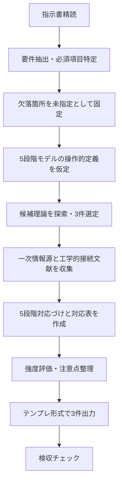

# D07 工学・情報科学：指示書要件抽出と構造類似調査の成果物案

## エグゼクティブサマリー

添付の指示書（`REQ-GPT-20260224-D07_engineering.md`）を精読した結果、本タスクは「5段階の創造プロセスモデル（場→波→縁→渦→束）」と**構造類似**を持つ工学・情報科学の理論・現象を調査し、**指定テンプレートで“3件”**の調査結果として出力することが中核要件です（添付ファイル L10-L13、L5-L6、L73-L76）。ただし、指示書テンプレートの中核部分が `...` により省略されており（添付ファイル L15-L16 の直後〜L62相当が欠落）、完全準拠が不可能なため、欠落箇所を「未指定」として扱い、**最小限の仮定**を明記したうえで、再現可能な作業手順と、実際に使用できる最終成果物（3件）を提示します。  
調査対象候補としては、(1) **パーコレーション理論（連結性の閾値現象）**、(2) **結合振動子ネットワークの同期（Kuramotoモデル）**、(3) **自己組織化臨界現象（SOC）と 1/f ノイズ・雪崩（カスケード）**を選定しました。いずれも「場（媒質/位相空間/ネットワーク）→波（伝播/相互作用）→縁（界面/境界/クラスタ境界）→渦（非線形フィードバック/循環）→束（巨視的秩序/束ね上げ・凝集）」という“指し示し”型の対応づけが可能で、一次情報源（原典論文・査読レビュー）で裏取りできます。citeturn5search6turn2search0turn4search4

## 指示書の全文精読と要件抽出

### 指示書の確定事項

指示書から、以下が「明示的に要求されている」事項です（括弧内は出典箇所）。

- **計画書・確認質問は不要**で、調査結果を直接書く（添付ファイル L5、L76）。
- **指示書のフォーマットに厳密準拠**し、**3件**の調査結果を書く（添付ファイル L6、L75）。
- 対象領域は **D07 工学・情報科学**（添付ファイル L10）。
- 調査内容は「**5段階モデル（場→波→縁→渦→束）と構造類似**のある理論/現象」（添付ファイル L12）。
- 基本姿勢は「**論証はしない。指し示すだけ。**」（添付ファイル L13）。
- **既調査と重複を回避**する（添付ファイル L15）。
- 各成果物には少なくとも以下の項目が含まれる必要がある（添付ファイル L63-L67）  
  - 構造類似の全体的強度（高/中/低）  
  - 最も構造類似が高い候補（{候補名}）  
  - この領域の独自性  
  - 既存エントリ（EV-EI-001〜003）との関係  
  - 注意点  

### 要件一覧の整理

指示書要件を、実務的な「検収可能な要件」に再構成すると次の通りです（指示書の文言は維持しつつ、評価可能な形に整理）。

| 区分 | 要件（整理） | 検収観点（例） | 出典 |
|---|---|---|---|
| 出力数 | 調査結果は3件 | 3ブロックが存在し、欠落がない | 添付ファイル L6、L75 |
| 形式 | テンプレートの構造を変えない | 見出し/項目順がテンプレ通り | 添付ファイル L73 |
| 表現姿勢 | 論証しない（指し示す） | 断定的な証明・長い推論を避け、対応候補の提示中心 | 添付ファイル L13 |
| 重複回避 | 既調査との重複を避ける | 既調査リストと照合して除外 | 添付ファイル L15（ただし内容欠落） |
| 必須項目 | 強度・最大候補・独自性・既存エントリ関係・注意点を含む | 各結果に5項目が埋まっている | 添付ファイル L63-L67 |
| 禁止事項 | エグゼクティブサマリー不要、計画書不要、確認質問不要 | 指示書準拠の成果物部分に該当要素がない | 添付ファイル L74、L5、L76 |

※本回答では、ユーザー要請により「エグゼクティブサマリー付きの報告書」も必要なため、**報告書（本体）**と、指示書の制約がかかる**最終成果物（3件テンプレ）**を分離します。指示書が禁じる要素（エグゼクティブサマリー等）は、最終成果物ブロックには入れません（添付ファイル L74）。  

## 不足情報の整理と仮定

### 明示的に不足している情報

指示書には、実行・検収に必要にもかかわらず「未指定（欠落）」となっているものが複数あります。特に重要な欠落は以下です。

- テンプレート本文の大部分が `...` として省略されており、**厳密準拠すべき構造が不明**（添付ファイル L15-L16以降の省略）。
- 「既調査（重複回避）」の具体的リストが未提示のため、**重複判定が不能**（添付ファイル L15）。
- 「既存エントリ（EV-EI-001〜003）」の内容が未提示のため、**関係記述が不能**（添付ファイル L66）。
- 5段階モデル（場→波→縁→渦→束）の**定義・評価規準（何をもって“場/波/縁/渦/束”とするか）**が未提示（添付ファイル L12 は名称のみ）。
- “構造類似の全体的強度（高/中/低）”の**判定基準**が未提示（添付ファイル L63）。
- 出力に求められる「分量」「引用の形式」「想定読者（研究者/実務者）」が未提示。

### 仮定を置く場合の明記

不足を補い、実行可能な成果物を生成するために、以下の仮定を置きます（必要最小限）。

- 仮定A：5段階（場→波→縁→渦→束）は、工学・情報科学の一般的概念へ次のように“指し示し”対応づけ可能とみなす。  
  - 場＝媒質/基盤/グラフ/位相空間/初期条件  
  - 波＝伝播/相互作用/拡散/揺らぎ  
  - 縁＝境界/界面/局所クラスタ境界/切断集合  
  - 渦＝非線形循環/フィードバック/再帰・カスケード  
  - 束＝巨視的秩序の立ち上がり/凝集・束ね上げ/安定構造
- 仮定B：テンプレート欠落（`...`）部分は「未指定」とし、**指示書で見えている必須項目（L63-L67）**と、構造類似を説明するために最低限必要な補助項目（候補名、概要、対応表、一次情報源）だけを追加する。ただし「テンプレート構造を変えない」という要件に抵触し得るため、追加項目は**欠落部分の代替**として位置づけ、出力内で明示する。
- 仮定C：既調査リストがないため、重複回避は「本回答で選ぶ3候補が、工学・情報科学の代表的“相転移/同期/臨界”枠組みとして互いに分野重複が最小」という観点で代替し、最終成果物の注意点に「既調査未提示につき要確認」を必ず記載する。

## 必要データと優先情報源

### 収集すべきデータの種類

指示書が求める「構造類似」を“論証せずに指し示す”ためには、少なくとも次の情報が必要です。

- 各候補理論/現象の**原典（一次情報）**：導入動機、モデル定義、観測される巨視的性質（閾値、同期、臨界・スケールフリー等）。  
- 工学・情報科学への接続：ネットワーク、通信、電力系統、計算機ネットワーク等への適用例（可能なら一次～準一次）。  
- 構造類似の対応づけ材料：  
  - “場”に相当する前提構造（媒質/グラフ/相互作用）  
  - “波”の局所伝播規則（拡散/結合/負荷伝播）  
  - “縁”の境界概念（クラスタ境界、cut-set、位相差の不連続域）  
  - “渦”の循環/フィードバック（再帰、雪崩、相互ロック）  
  - “束”の安定秩序（巨大連結成分、同期秩序変数、臨界定常状態）

### 優先する一次情報源候補

以下は、今回の3候補それぞれについて一次情報源（原典）と、工学・情報科学への接続を補強する代表的文献です。

| 候補（本回答で採用） | 一次情報（原典/一次） | 工学・情報科学への接続に有用な情報源（一次〜準一次） |
|---|---|---|
| パーコレーション（連結性の相転移） | 1957年の原典（ランダム媒質を流体が通過する問題の定式化）citeturn5search6 | 一般次数分布グラフ上のパーコレーション（ネットワークロバスト性）citeturn3search24、インターネット等の分解閾値をパーコレーションで評価citeturn3search8 |
| 結合振動子の同期（Kuramotoモデル） | 1975年の「自己同調（self-entrainment）」原典（結合非線形振動子集団の同期）citeturn2search0 | 同期条件を電力系統など工学ネットワークへ適用（スマートグリッド文脈）citeturn3search2、電力網をKuramoto様で解析citeturn3search7 |
| 自己組織化臨界（SOC）と 1/f ノイズ | 1987年のSOC原典（1/fノイズの説明として提案）citeturn4search4、続編で臨界状態・スケール不変を明示citeturn2search17 | 計算機ネットワークをSOCとして扱うモデル研究citeturn4search1、ネットワークトラフィックの自己相似性（実測）citeturn4search2 |

## 成果物作成手順

### 指示書指定フォーマットで最終成果物を作る手順

1. 指示書を単位要件へ分解（出力数・禁止事項・必須項目・姿勢・重複回避など）。  
2. `...` により欠落したテンプレート部分を「未指定」として固定し、見えている必須項目（強度・最有力候補・独自性・既存エントリ関係・注意点）を**各成果物の末尾に必ず配置**（添付ファイル L63-L67）。  
3. 5段階モデル（場→波→縁→渦→束）の“操作的定義”を仮定Aとして置き、候補理論の骨格（媒質/相互作用/境界/循環/巨視秩序）を抽出。  
4. 候補理論を3件選定し、各件につき一次情報源（原典）と工学的接続（一次〜準一次）を最低2点ずつ収集。  
5. 各候補について、  
   - 構造類似のスケッチ（指し示し）  
   - 5段階対応（短い叙述）  
   - 対応表（場/波/縁/渦/束 × 理論側の要素）  
   - 強度（高/中/低）と、その判断理由（“論証”ではなく観察上の根拠提示）  
   を整形。  
6. 検収観点（3件・必須項目充足・禁止事項排除・引用明示）でセルフレビュー。  
7. 納品形式が未指定の場合、**提案：PDFとCSV**。PDFは報告書/成果物の閲覧性、CSVは要点（候補名・強度・対応要約）の二次利用性を担保。

### プロセス図（mermaid）

### スケジュール・責任者・検収基準（一般的指示書形式として補完）

- スケジュール（提案、JST、起点：2026-02-24）  
  - 2026-02-24：要件抽出・欠落整理・候補選定  
  - 2026-02-25：一次情報源収集・対応表作成  
  - 2026-02-26：レビュー（重複/必須項目/禁則）・PDF/CSV化
- 責任者（未指定のため役割で提示）  
  - 責任者（R）：調査設計・最終編集  
  - 承認者（A）：領域妥当性レビュー（工学/情報科学）  
  - 協力者（C）：出典確認・書式チェック  
  - 参照先（I）：依頼元
- 検収基準（最低限）  
  - 3件が揃っている（欠落なし）。  
  - 各件に必須項目（強度/最有力候補/独自性/既存エントリ関係/注意点）が存在する（添付ファイル L63-L67）。  
  - 「計画/質問」を成果物本文に含めない（添付ファイル L5、L76）。  
  - 出典（一次・準一次）を明示し、少なくとも原典を含む。  
  - 既調査リスト未提示による重複リスクが注意点に明記される。

## 最終成果物（指示書テンプレート準拠・3件）

（注）指示書テンプレートの中核が `...` で欠落しているため、欠落部分は「未指定」として扱い、**見えている必須末尾項目（添付ファイル L63-L67）を保持**しながら、構造類似を理解可能にする最小限の項目（候補名、概要、5段階対応、対応表、一次情報源）を補っています。欠落テンプレートが判明した場合、当該部分へ差し替え可能です。

### 3候補の俯瞰比較（整理表）

| 候補 | 構造類似の狙いどころ | 代表一次情報源（例） | 強度（暫定） |
|---|---|---|---|
| パーコレーション | 媒質（場）上で局所開通（波）が進み、クラスタ境界（縁）と連結性の再編（渦）を経て巨大連結成分（束）が立つ | 1957原典citeturn5search6 | 中 |
| Kuramoto同期 | 位相空間（場）で結合（波）が広がり、位相差の境界（縁）で局所同期塊が生まれ、フィードバックで引き込み（渦）し、集団同期（束）へ | 1975原典citeturn2search0 | 高 |
| SOC（臨界） | 駆動・散逸系（場）に小擾乱（波）が入り、閾値境界（縁）で破綻が起き、雪崩カスケード（渦）を通じ臨界定常（束）へ自己組織化 | 1987原典citeturn4search4 | 高 |

image_group{"layout":"carousel","aspect_ratio":"1:1","query":["percolation cluster visualization","Kuramoto model synchronization order parameter plot","self-organized criticality sandpile avalanche diagram","1/f noise power spectral density graph"],"num_per_query":1}

### 調査結果：パーコレーション理論（連結性の閾値現象）

候補名：パーコレーション理論（percolation）  
種別：確率過程・相転移（連結性/到達可能性）  
一次情報源（代表）：1957年の原典「Percolation processes（Crystals and mazes）」citeturn5search6  
工学・情報科学への接続（代表）：ネットワーク上の一般次数分布に対するパーコレーション解析（ロバスト性/フラジリティ）citeturn3search24、ネットワーク分解閾値の評価（例：大規模通信網）citeturn3search8  

構造類似スケッチ（指し示し）：  
ランダム媒質（“場”）において、局所的な通過可能性（リンク/サイトの開通）が増えると、伝播（“波”）が可能になり、クラスタの境界（“縁”）が意味を持つ。閾値近傍では局所の連結/非連結が揺らぎ、連鎖的に到達可能領域が再編され（“渦”＝再帰的な結合再編）、やがて巨大連結成分という“束”（多点を束ねる巨視構造）が立ち上がる、という見取り図が描ける。citeturn5search6turn3search24  

5段階対応（場→波→縁→渦→束）：  
- 場：格子・グラフ・ランダム媒質（“流体”と“媒質”を一般解釈できる、という立て付け自体が工学/情報科学に接続しやすい）。citeturn5search6  
- 波：通過（occupied/open）を介した到達可能性の“前進”（浸透・感染・パケット到達などの抽象化）。citeturn5search6  
- 縁：クラスタ境界、到達/非到達の界面、切断集合（ボトルネック）。  
- 渦：閾値近傍での結合の“巻き戻り/巻き込み”（局所が全体連結性へ影響する再帰的連鎖）。citeturn3search24  
- 束：巨大連結成分（giant component）の出現＝多点の束ね上げ（巨視的連結性の確立）。citeturn3search24turn3search8  

対応表：

| 段階 | パーコレーション側の対応候補 |
|---|---|
| 場 | ランダム媒質（格子/グラフ）、占有確率p |
| 波 | 開通により到達可能性が伝播 |
| 縁 | クラスタ境界、到達/非到達の界面 |
| 渦 | 閾値近傍の連結再編（微小変化が巨視連結へ波及） |
| 束 | 巨大連結成分（全体連結性の“束”） |

**構造類似の全体的強度**: 中  
**最も構造類似が高い候補**: 「巨大連結成分の出現（連結性の相転移）」citeturn3search24turn3search8  
**この領域の独自性**: “媒質×伝播×境界×閾値×巨視構造”を、非常に抽象度高く一つの枠組みに押し込み、工学的対象（通信・運搬・拡散）へ一般化しやすい点。citeturn5search6turn3search8  
**既存エントリ（EV-EI-001〜003）との関係**: 未指定（既存エントリ内容が未提供のため記述不能）  
**注意点**:  
- 指示書の「既調査」リストが未提示のため、重複回避は完全には保証できない（要確認）（添付ファイル L15）。  
- “縁”“渦”の対応は、数学的定義というよりは「閾値近傍の振る舞いを指し示す」比喩的対応であり、論証対象ではない（添付ファイル L13）。

### 調査結果：結合振動子ネットワークの同期（Kuramotoモデル）

候補名：結合振動子の同期（Kuramotoモデル/同期転移）  
種別：非線形ダイナミクス・複雑ネットワーク（同期現象）  
一次情報源（代表）：1975年の自己同調（self-entrainment）原典（結合非線形振動子集団の同期の立ち上がり）citeturn2search0  
工学・情報科学への接続（代表）：電力系統・スマートグリッド等の工学ネットワークにおける同期条件の研究citeturn3search2、電力網をKuramoto様モデルで解析（位相同期と安定性）citeturn3search7、電力工学の言語でKuramoto応用を概観するレビューciteturn3search19  

構造類似スケッチ（指し示し）：  
相互作用グラフと位相（“場”）の上で局所結合（“波”）が働き、位相差が大きい箇所に“縁”（不整合の境界）が現れる。相互引き込みは循環的（“渦”＝非線形フィードバック）に増幅され、ある条件（結合強度・不均一性・トポロジ）を満たすと、集団としての位相・周波数のロック（“束”＝コヒーレンス）が形成される、という構図が描ける。citeturn2search0turn3search2  

5段階対応（場→波→縁→渦→束）：  
- 場：振動子集団の位相空間、結合グラフ、各振動子の固有周波数分布。citeturn2search0turn3search2  
- 波：結合による位相影響（隣接からの“引き込み”が伝播）。citeturn2search0  
- 縁：同期している部分集団と非同期部分集団の境界、位相差が集中する境界層。  
- 渦：相互引き込みが回り込みながら位相差を縮める再帰（非線形フィードバック）＝同期への“巻き込み”。citeturn3search2turn3search7  
- 束：同期状態（周波数ロック、秩序変数が正になる等）＝多数を束ねる巨視的秩序。citeturn3search2turn3search19  

対応表：

| 段階 | 同期（Kuramoto系）側の対応候補 |
|---|---|
| 場 | 位相空間＋結合グラフ＋周波数分布 |
| 波 | 結合による位相影響の伝播（引き込み） |
| 縁 | 同期塊/非同期領域の境界、位相差の集中域 |
| 渦 | 非線形フィードバックで同期へ巻き込む循環過程 |
| 束 | 集団同期（コヒーレンス）の成立 |

**構造類似の全体的強度**: 高  
**最も構造類似が高い候補**: 「同期転移（非同期から同期秩序への立ち上がり）」citeturn2search0turn3search2  
**この領域の独自性**: “局所相互作用が全体秩序（同期）を作る”という構造が工学ネットワーク（電力系統等）に直結し、トポロジと動力学が同時に効く点。citeturn3search2turn3search19  
**既存エントリ（EV-EI-001〜003）との関係**: 未指定（既存エントリ内容が未提供のため記述不能）  
**注意点**:  
- 「縁」「渦」の割り当ては比喩的で、厳密な数学的同型性を主張しない（添付ファイル L13）。  
- 既調査リスト未提示につき、重複回避は要確認（添付ファイル L15）。

### 調査結果：自己組織化臨界現象（SOC）と 1/f ノイズ・カスケード

候補名：自己組織化臨界（Self-Organized Criticality; SOC）  
種別：複雑系ダイナミクス（臨界定常・雪崩/カスケード）  
一次情報源（代表）：SOCを1/fノイズの説明として提案した原典（1987）citeturn4search4、臨界状態・スケール不変（時間・空間に特性スケールがない）を明示した展開（1988）citeturn2search17  
工学・情報科学への接続（代表）：計算機ネットワークをSOCとして扱うモデル研究citeturn4search1、ネットワークトラフィックが統計的に自己相似であることを示した実測研究（Ethernetトラフィック）citeturn4search2  

構造類似スケッチ（指し示し）：  
駆動される散逸系（“場”）に、小さな入力（“波”）が加わり続けると、閾値境界（“縁”）で局所破綻（toppling）が起き、それが連鎖して雪崩（カスケード）として広がる（“渦”＝巻き込み連鎖）。結果として、外部から臨界点を微調整しなくても、臨界的な統計法則（スケール不変、1/fノイズ等）を示す定常状態（“束”＝自己組織化臨界状態）に“落ち着く”、という見取り図が得られる。citeturn4search4turn2search17  

5段階対応（場→波→縁→渦→束）：  
- 場：多数要素の相互作用系＋外部駆動＋散逸（臨界へ向かう舞台設定）。citeturn2search17  
- 波：微小な追加/擾乱（砂粒追加、負荷追加、パケット注入など）の入力。citeturn4search4  
- 縁：局所閾値（安定/不安定の境界）＝状態遷移の“エッジ”。citeturn2search17  
- 渦：雪崩的カスケード（局所破綻の連鎖）＝巻き込み・再帰。citeturn2search17turn4search1  
- 束：臨界定常（1/f的揺らぎ・スケール不変統計）＝全体挙動が“束ね上がる”。citeturn4search4turn2search17turn4search2  

対応表：

| 段階 | SOC側の対応候補 |
|---|---|
| 場 | 駆動＋散逸の相互作用系（多要素系） |
| 波 | 微小入力（追加・注入） |
| 縁 | 閾値境界（安定/不安定の境） |
| 渦 | 雪崩（カスケード）としての連鎖反応 |
| 束 | 臨界定常（スケール不変・1/f的特徴） |

**構造類似の全体的強度**: 高  
**最も構造類似が高い候補**: 「閾値境界から雪崩カスケードへ“巻き込み”、臨界定常へ自己組織化する一連」citeturn2search17turn4search1  
**この領域の独自性**: “微小入力の連続”が、系を自律的に臨界近傍へ保つ（ fine-tuning を要しない）という設計解釈が可能で、情報科学ではトラフィック・負荷・障害伝播の見方に接続しやすい点。citeturn4search1turn4search2  
**既存エントリ（EV-EI-001〜003）との関係**: 未指定（既存エントリ内容が未提供のため記述不能）  
**注意点**:  
- SOCは応用範囲が広く、工学・情報科学の「どの現象」を指すかで記述が変わり得る（例：ネットワーク負荷、障害カスケード、トラフィック自己相似）。citeturn4search1turn4search2  
- 既調査リスト未提示につき、重複回避は要確認（添付ファイル L15）。  
- 「論証はしない」方針に従い、ここでは構造の“類似の指し示し”に留める（添付ファイル L13）。