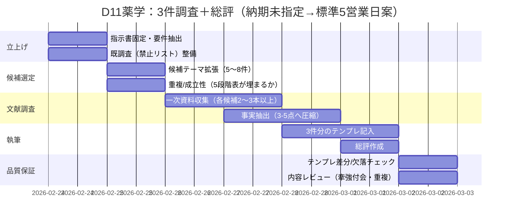

# D11薬学 指示書解析と成果物作成の実行計画

## エグゼクティブサマリー

本件の指示書は**提供済み**であり、添付ファイル **REQ-GPT-20260224-D11_pharmacy.md** に、調査テーマ（D11 薬学）と、最終成果物に要求される**厳密な出力フォーマット**、ならびに「計画書・確認質問は不要」「エグゼクティブサマリー不要」「3件を必ず出す」「テンプレート構造を変えない」などの制約が明記されています（＝最終成果物は“3件の調査結果＋総評”で完結する設計）。  
他方、今回ユーザーが求めているのは、**指示書の全文解析手順**と、指示書に従って最終成果物（3件＋総評）を作るための**詳細な実行計画・テンプレート・品質保証・スケジュール・リスク管理**です。そのため本書は、(1) 指示書要件を機械的に抽出し、(2) 指示書が要求する最終成果物を“再現性高く”作るための手順と統制（データ、参照すべき一次資料、検証方法）を提示します。  
特に薬学領域では、品質・安定性・製剤・薬物動態などで規制/標準が重要になるため、一次資料として、医薬品規格基準書であるentity["book","日本薬局方","pharmacopoeia, japan"]（所管: entity["organization","厚生労働省","health ministry, japan"]）や、規制・ガイドライン群を扱うentity["organization","医薬品医療機器総合機構","drug regulator, japan"]（ICH情報含む）を優先する設計が妥当です。citeturn0search0turn0search1turn2search7  
なお、指示書自体に**期限は記載がなく（未指定）**、また「構造類似の質」の定義や採点基準も**未指定**のため、実行計画側で“内部用の一貫性ルール”を設け、最終成果物では指示書の枠内に収める方針を採ります。

## 指示書全文の解析手順と未指定事項

### 指示書全文を完全に解析する手順

指示書（添付md）を「解釈せずに」まず**構造として分解**し、次に**要件として再構成**します（推測を混ぜない）。

1. **原本固定（版管理）**  
   添付ファイル名・更新日時・ハッシュ（任意）を記録し、解析対象を固定します（改変混入防止）。  
2. **セクション境界の抽出**  
   見出し（`#`/`##`/`###`）と区切り（水平線相当）を単位に、(a) 最重要指示、(b) 対象/目的、(c) 既調査、(d) 探索の焦点、(e) 出力フォーマット、(f) 注意事項、に分割します。  
3. **命令文（MUST/SHOULD/MAY）の同定**  
   「厳守」「不要」「変えない」「3件」「一次文献」など、拘束力の強い語をトリガーとして抽出し、要件化します。  
4. **入出力の確定**  
   入力＝“何を根拠に書け”か（一次文献等）、出力＝“どの見出し・表・項目を埋めるか”、を確定します。  
5. **重複回避条件の形式化**  
   「既調査（重複回避）」に列挙された既存エントリID・テーマを“禁止リスト”として保持し、候補選定時に照合します（同名・類義語も含めて判定ルール化）。  
6. **未指定事項の棚卸し**  
   期限、引用スタイル、文献数の上限、用語定義、採点基準など、書かれていないものを「未指定」として列挙し、実行計画側で補助ルール（内部統制）を提案します。  
7. **最終成果物テンプレートのロック**  
   指示書の“出力フォーマット（厳守）”をそのままテンプレート化し、**見出し階層・項目名・表の列**を固定します（追加見出しを作らない）。  
8. **検証観点の抽出**  
   “3件あるか”“各件に3–5の事実があるか”“表が5行揃っているか”“強度が高/中/低で埋まっているか”“牽強付会リスクに理由があるか”“総評があるか”をチェックリスト化します。

### 指示書から読み取れる制約の要点

- 最終成果物は「調査結果を直接」書く（計画や確認質問を出さない）。  
- 3件の調査結果を、定められたフォーマットで繰り返す。  
- 各件は、一次文献に基づく「確立された事実（3–5点）」、プロセス記述、5段階対応表、構造類似の質、牽強付会リスク（理由付き）、主要文献、を含む。  
- 既調査として3テーマが提示され、重複回避が要求される。  
- 総評（全体強度、最も類似が高い候補、独自性、既存エントリとの関係、注意点）を付す。  

### 明示的な未指定事項

- 納期・期限：**未指定**  
- 「一次文献」の範囲（規制文書を含むか、査読論文に限定か等）：**未指定**  
- 「確立された事実」の判定基準（コンセンサス、再現性、メタ解析優先等）：**未指定**  
- 「構造類似の質」の評価軸（何をもって“質が高い”とするか）：**未指定**  
- 「牽強付会リスク」判定基準（低/中/高の閾値、代表的リスク型）：**未指定**  
- 引用表記ルール（APA等）や和英比率：**未指定**  
- 図表（表以外の図）の可否：**未指定**（テンプレート追加禁止と衝突し得るため注意）

## 指示書から抽出した要件一覧

下表は、**指示書本文からのみ**機械的に抽出した要件です（ユーザー追加要望は別管理にするのが本来ですが、ここでは指示書要件に限定）。期限は明示がないためすべて「未指定」です。

| 要件ID | 要約 | 優先度 | 入力データ | 期待出力 | 検証方法 | 期限 |
|---|---|---|---|---|---|---|
| REQ-D11-001 | 計画書・確認質問を出さず、調査結果を直接記述する | 高 | 指示書本文 | 計画/質問の段落がない最終成果物 | 原稿を検索し「質問」「確認」等がないか確認 | 未指定 |
| REQ-D11-002 | 3件の調査結果を必ず出す（欠落不可） | 高 | 候補テーマ群 | 「薬学-1〜3」相当の3ブロック | 見出し数・連番・ブロック数のチェック | 未指定 |
| REQ-D11-003 | 出力フォーマット（テンプレート構造）を変えない | 高 | 指示書の出力テンプレ | 見出し/項目/表列が原本一致 | 差分比較（テンプレと原稿） | 未指定 |
| REQ-D11-004 | 5段階モデル（場→波→縁→渦→束）と構造類似のある薬学理論・現象を調査対象とする | 高 | 候補テーマ、関連文献 | 5段階対応表が成立する3件 | 各件で5行が埋まり、根拠が書かれている | 未指定 |
| REQ-D11-005 | 基本姿勢は「論証はしない。指し示すだけ。」 | 中 | 記述方針 | 断定や過剰な論証を避けた記述 | 表現レビュー（断定過多・推論過多の検出） | 未指定 |
| REQ-D11-006 | 既調査（EV-PM-001〜003）と重複しない | 高 | 既調査リスト（指示書に列挙） | 新規3件（既調査と別テーマ） | テーマ名・内容の類似判定（禁止リスト照合） | 未指定 |
| REQ-D11-007 | 各件に「[P] 確立された事実」を3–5点、一次文献に基づき記載 | 高 | 一次文献（規制文書/査読論文等） | 3–5点の箇条書き | 点数カウント＋各点に根拠文献があるか確認 | 未指定 |
| REQ-D11-008 | 各件に「プロセス/段階の記述」を段階ごとに具体的に記載 | 高 | 文献・専門知 | 段階分解された説明 | 段階の粒度（最低3段階以上など内部基準）でレビュー | 未指定 |
| REQ-D11-009 | 各件に「5段階との構造対応（候補）」表（列/行固定）を記載 | 高 | モデル対応メモ | 5行（場/波/縁/渦/束）すべて埋まった表 | 表の行数・列名一致・空欄検出 | 未指定 |
| REQ-D11-010 | 表の「強度」は各行で高/中/低から選ぶ | 高 | 対応の確信度 | 各行が高/中/低で埋まる | 値のバリデーション（許容値チェック） | 未指定 |
| REQ-D11-011 | 各件に「構造類似の質」「牽強付会リスク（高/中/低＋理由）」「主要文献」を記載 | 高 | 文章、文献一覧 | 3項目が欠落なく入る | 欠落チェック＋リスク理由の有無確認 | 未指定 |
| REQ-D11-012 | 3件の後に「薬学 総評」ブロックを出力し、指定4項目＋注意点を埋める | 高 | 3件の比較メモ | 総評の5項目が記載 | 項目欠落・候補名整合（最も高い候補＝本文候補） | 未指定 |
| REQ-D11-013 | 探索の焦点（候補）を出発点にしてよい（変更可） | 低 | 候補リスト | 3件選定に活用（必須ではない） | 使った場合は重複なし・妥当性レビュー | 未指定 |

## 要件別の作業手順と担当想定

ここでは、上記要件を満たすための「具体ステップ」と「担当ロール（想定）」を提示します。指示書は最終成果物として計画提示を禁じていますが、**制作側の内部プロセス**としては必要なため、内部文書に限定して運用します。

### REQ-D11-001 計画・確認質問を出さない

1. 最終成果物に含める文字種を固定する（見出し、本文、表、文献）。**計画・質問テンプレ**を原稿環境から排除。  
2. “書いてはいけない語”の簡易フィルタ（例：「確認」「〜でしょうか」）を実施。  
担当：編集者、QA

### REQ-D11-002 3件を必ず出す

1. 候補テーマを少なくとも5〜8件出し、そこから最終3件を選ぶ（欠落防止のバッファ）。  
2. 連番を「薬学-1」「薬学-2」「薬学-3」に固定し、見出し生成を自動化（手作業ミス低減）。  
担当：リサーチリード、編集者

### REQ-D11-003 テンプレート構造を変えない

1. 指示書の出力フォーマット部分を“原本テンプレ”として別ファイルに複製しロック。  
2. 埋めるのはプレースホルダ部分のみとし、見出し・表の列名・項目名は編集禁止。  
3. 納品前にテンプレと原稿を差分比較（見出し階層・表列の一致）。  
担当：編集者、QA

### REQ-D11-004 5段階モデルに構造類似する薬学テーマを選ぶ

1. 候補ごとに「場→波→縁→渦→束」へ**最低1対1で対応概念**を仮置きし、表が埋まるか確認。  
2. 表が埋まらない候補は早期棄却（牽強付会リスク抑制）。  
担当：薬学リサーチャー、リサーチリード

### REQ-D11-005 「論証しない、指し示す」文体

1. “因果を結論づける接続”を減らし、「観察される」「整理すると」「対応として見える」等へ寄せる。  
2. 一方で、確立された事実は一次資料に基づき簡潔に断定（事実と比喩の混同を避ける）。  
担当：編集者、薬学リサーチャー

### REQ-D11-006 既調査と重複しない

1. 既調査3件を禁止リスト化（テーマ名＋同義語＋上位概念）し、候補を照合。  
2. 近接テーマ（例：DDSと医薬品開発パイプラインの混線）が起きる場合は、焦点（設計原理/放出制御など）を明確化して差別化。  
担当：リサーチリード、QA

### REQ-D11-007 「確立された事実」3–5点を一次文献に基づき作る

1. 候補テーマごとに一次資料（規制文書、標準、査読論文）を最低2–3本確保。  
2. 事実候補を10個程度抽出→重複統合→最終3–5点に圧縮。  
3. 各点が「観察/測定/標準として定義」など検証可能な形になっているかをレビュー。  
担当：薬学リサーチャー、情報調査担当、編集者

### REQ-D11-008 段階的プロセス記述を作る

1. 文献中の工程（設計→評価→最適化→運用 等）を抽出し、最低3段階に整理。  
2. 各段階に「入力」「操作」「出力」を書ける形にする（抽象語だけにしない）。  
担当：薬学リサーチャー

### REQ-D11-009 5段階対応表を埋める

1. プロセス記述の段階と、5段階モデルを“整列”させ、各行に「対応概念」「根拠」「強度」を記入。  
2. 根拠は、(a) 文献の言い回し、(b) 観察される遷移、(c) 典型例、のいずれかで具体化。  
担当：薬学リサーチャー、編集者

### REQ-D11-010 強度（高/中/低）を一貫して付与する

1. 内部基準（例：一次資料で明示＝高、複数資料で示唆＝中、比喩依存＝低）を定める（指示書では未指定）。  
2. 5行の強度が極端に不均衡な場合は、候補そのものを見直す。  
担当：リサーチリード、QA

### REQ-D11-011 構造類似の質・牽強付会リスク・主要文献を付す

1. 「質」では“対応の解像度（粗い/細かい）”と“転用可能性（洞察として効くか）”を短文で記述。  
2. 「牽強付会リスク」は、比喩過多・証拠の薄さ・段階数の恣意性など、**具体理由**を1–2文で添える。  
3. 「主要文献」は一次資料優先で3–7本程度（未指定のため内部推奨）。  
担当：薬学リサーチャー、編集者

### REQ-D11-012 薬学 総評を作る

1. 3件の「強度（各行）」を俯瞰し、領域全体の強度（高/中/低）を決める。  
2. 最も構造類似が高い候補を1件選び、その理由を“論証せず”に短く指し示す。  
3. 既存エントリとの関係は「重複回避を満たしつつ、どこに連結するか」で整理。  
担当：リサーチリード、編集者、QA

## 必要なデータ・外部ソース設計

指示書は「一次文献に基づくこと」としか述べないため、薬学領域の一次資料を「規制/標準」「学術（査読）」「学会（準一次）」に分けて優先順位を付けます。特に規格・品質・安定性は規制文書の比重が大きいため、規制・標準を最優先に置きます。citeturn0search0turn2search7turn2search2  

### 優先度付き 外部ソース一覧

| 優先度 | 種別 | ソース | 使い所 | 期待できる具体アウトプット |
|---|---|---|---|---|
| 高 | 日本の公式/一次 | entity["organization","厚生労働省","health ministry, japan"]（日本薬局方関連）citeturn0search0 | 規格基準・用語の公的定義 | 「確立された事実」の根拠、品質概念の明文化 |
| 高 | 日本の公式/一次 | entity["organization","医薬品医療機器総合機構","drug regulator, japan"]（ICH/ガイドライン掲載）citeturn2search7turn2search9 | ICH文書の和訳/通知、品質・安定性の枠組み | 製剤安定性(Q1)や品質(Q10等)を“段階プロセス”として書ける材料 |
| 高 | 日本の公式/一次 | entity["organization","e-Gov","japan e-gov portal"]（パブリックコメント資料）citeturn2search2turn2search6 | 和訳PDFや募集要領に一次テキストがある | 正確な用語・工程表現を引用/要約可能 |
| 高 | 国際の一次 | entity["organization","ICH","pharma harmonization org"]（Q1ドラフト等）citeturn2search0turn2search4 | 国際一次文書（最新版の確認） | “段階”“ライフサイクル”表現の一次根拠 |
| 中 | 学術DB | entity["organization","J-STAGE","journal platform, japan"] citeturn1search3 | 日本語査読論文・総説探索 | テーマ固有の「確立された事実」を抽出 |
| 中 | 学術DB | entity["organization","CiNii Research","bibliographic db, japan"] citeturn1search6 | 日本語文献・学位論文・研究データ探索 | 文献網羅性の補強、一次資料への到達 |
| 中 | 学会（準一次） | entity["organization","日本薬学会","pharmaceutical society, japan"] citeturn1search1 | 分野俯瞰、学術イベント、用語整理 | テーマ位置づけ（ただし一次証拠は論文へ） |
| 中 | 学会（準一次） | entity["organization","日本DDS学会","drug delivery society, japan"] citeturn1search0turn1search4 | DDS領域の総説・用語 | DDS候補の一次論文への橋渡し |
| 中 | 学会（準一次） | entity["organization","日本東洋医学会","kampo society, japan"] citeturn0search3 | 漢方領域の基本情報 | 漢方処方設計候補の背景整理 |
| 低 | 海外規制/補助 | entity["organization","European Medicines Agency","eu medicines regulator"] citeturn2search5turn2search8 | ICH文書の参照ページ、相談期限等 | 国際的整合性の確認（和訳がない場合の補助） |

### 必要となる入力データの整理

- 既調査（禁止リスト）＝EV-PM-001〜003（指示書に明記）  
- 新規3件の候補テーマ（指示書の候補から選んでもよいが変更可）  
- 各候補テーマの一次資料（規制文書/標準/査読論文）  
- 5段階モデルへの対応メモ（各行：対応概念・根拠・強度）  
- 最終「総評」用の比較メモ（強度の俯瞰、最も高い候補の選定理由）  

## 分析設計とサンプル計算

指示書は数式やスコアリングを要求していません（＝**未指定**）。ただし、3件の比較や「総評」での一貫性を高めるため、**内部用**の採点・判定アルゴリズムを導入すると品質管理が容易になります（最終成果物には“高/中/低”を記載するだけに留め、内部計算は見せない運用が安全）。

### 内部用の推奨アルゴリズム

#### 行スコア化（5段階×強度）

- 強度を数値化：高＝3、中＝2、低＝1（未記入は運用上0だが、最終成果物は未記入禁止）  
- 候補 *k* の総合スコア：  
  \[
  S_k=\frac{1}{5}\sum_{i \in \{場,波,縁,渦,束\}} s_{k,i}
  \]
- 総評の「全体的強度」判定（例：内部基準）  
  - 高：\(S_k \ge 2.6\) を満たす候補が1つ以上、かつ牽強付会リスクが低/中  
  - 中：\(2.0 \le S_k < 2.6\) が中心  
  - 低：\(S_k < 2.0\) が中心  
  ※閾値は**未指定**のため、チーム合意で固定します。

#### 牽強付会リスクの内部判定（例）

リスク要因をチェックし、該当数で判定（最終成果物では「高/中/低＋理由」を自然文で書く）。

- 要因A：一次資料が乏しい/総説のみ  
- 要因B：5段階のうち2行以上が「低」  
- 要因C：対応概念が抽象語だらけ（操作可能性がない）  
- 要因D：プロセス記述が段階分解になっていない  
- 判定例：A〜Dの該当が3–4＝高、2＝中、0–1＝低

### サンプル計算

例として、ある候補テーマで各行の強度が  
場=高(3)、波=中(2)、縁=高(3)、渦=中(2)、束=低(1) の場合：

\[
S=\frac{3+2+3+2+1}{5}=\frac{11}{5}=2.2
\]

内部基準では「中」相当になりやすく、総評で「最も構造類似が高い候補」候補にするなら、低(1)の行を改善できる根拠（一次資料での明示など）を追加する、という改善アクションが導けます（ただしこの運用は指示書では未指定）。

## 成果物テンプレートと品質・納品管理

### 成果物の出力フォーマット

- ファイル形式：Markdown（`.md`）が最も自然（指示書がMarkdownで提示されているため）。**未指定**だが整合的。  
- セクション見出し：指示書の通り（変更不可）。  
- 図表の配置：指示書で明示されている表は「5段階との構造対応（候補）」の表のみ。追加図は**未指定**であり、テンプレート構造変更リスクがあるため、入れるなら既存セクション内に“追加行”として最小限にする（推奨は、図は入れず文献で参照）。  
- 図表例：下にテンプレート（原本準拠）と、補助的なMermaid例を示します。

image_group{"layout":"carousel","aspect_ratio":"16:9","query":["drug delivery system schematic diagram","ICH Q10 pharmaceutical quality system model diagram","Kampo Jun Chen Zuo Shi diagram","drug target discovery validation workflow diagram"],"num_per_query":1}

#### 指示書準拠の最終成果物テンプレート（原本コピー）

（ここは“そのまま使う”ためのテンプレートです。**見出し名・順序・表列を変更しない**ことがREQ-D11-003です。）

```text
### 薬学-{連番}: {候補名}

**[P] 確立された事実**:
- （3-5点。一次文献に基づくこと）

**プロセス/段階の記述**:
- （段階ごとに具体的に）

**5段階との構造対応（候補）**:

| 5段階 | この理論の対応概念 | 対応の根拠 | 強度（高/中/低） |
|--------|-------------------|-----------|----------------|
| 場（Field） | （記入） | （記入） | （高/中/低） |
| 波（Wave） | （記入） | （記入） | （高/中/低） |
| 縁（Relation） | （記入） | （記入） | （高/中/低） |
| 渦（Vortex） | （記入） | （記入） | （高/中/低） |
| 束（Bundle） | （記入） | （記入） | （高/中/低） |

**構造類似の質**:
**牽強付会リスク**: 高/中/低 + 理由
**主要文献**:

（3件分繰り返す）

## 薬学 総評

**構造類似の全体的強度**: 高/中/低
**最も構造類似が高い候補**: {候補名}
**この領域の独自性**:
**既存エントリ（EV-PM-001〜003）との関係**:
**注意点**:
```

#### Mermaidによる補助図例（テンプレ外の“内部資料”向け）

最終成果物に入れるとテンプレート構造変更と解釈される可能性があるため、**制作チームの内部共有用**の例です（指示書上は未指定）。

```mermaid
flowchart LR
  A[候補テーマ抽出] --> B[既調査と重複チェック]
  B --> C[一次文献収集]
  C --> D[[P]確立事実 3-5点]
  C --> E[プロセス段階の分解]
  D --> F[5段階対応表の記入]
  E --> F
  F --> G[質/牽強付会リスク/主要文献]
  G --> H[3件揃える]
  H --> I[薬学 総評]
```

### 検証・品質保証チェックリスト

最終成果物（3件＋総評）を、納品前に機械的に検証するためのチェックリストです。

| 区分 | チェック項目 | 合否基準 |
|---|---|---|
| 構造 | 「薬学-{連番}: {候補名}」が3ブロックある | 3つ揃っている（欠落0） |
| 構造 | 見出し・項目名・順序・表列がテンプレと一致 | 差分なし |
| 内容 | 各ブロックの「確立された事実」が3–5点 | 2点以下/6点以上がない |
| 内容 | 「プロセス/段階の記述」が段階ごとに具体 | 抽象語のみでない |
| 表 | 5段階の5行がすべて埋まっている | 空欄なし |
| 表 | 強度が高/中/低のみで記載 | 他の記号がない |
| 妥当性 | 牽強付会リスクが高/中/低＋理由になっている | 理由が空でない |
| 参照 | 主要文献が一次資料優先で挙がっている | 出典ゼロでない |
| 重複 | 既調査3件と実質重複していない | 禁止リスト照合OK |
| 総評 | 総評5項目が埋まっている | 欠落なし |
| スタイル | 計画・確認質問が本文に混入していない | 質問文がない |

### 納品スケジュール案

指示書に期限がないため**未指定**です。ここでは「標準的に5営業日で3件を高品質に仕上げる」想定のガント案を提示します（開始日：2026-02-24）。



### リスクと対策一覧

| リスク | 具体的な失敗モード | 影響 | 対策 |
|---|---|---|---|
| テンプレ逸脱 | 見出し追加、表列変更、順序変更 | 重大（要件違反） | テンプレ原本ロック＋差分検査（REQ-D11-003） |
| 3件欠落 | 途中で候補が潰れて2件になる | 重大 | 候補を多めに確保し“補欠”を保持（REQ-D11-002） |
| 既調査と重複 | 実質的にパイプライン/PKPD/耐性進化を焼き直す | 重大 | 禁止リスト＋類義語チェック＋スコープ明確化（REQ-D11-006） |
| 一次資料不足 | 二次解説のみで「確立事実」が弱い | 高 | 規制/標準（日本語和訳含む）と査読論文を最低ライン化（REQ-D11-007） |
| 牽強付会 | 5段階への当てはめが比喩に寄りすぎる | 高 | “表が埋まるか”を一次資料に引き付け、低行が多い候補は棄却（REQ-D11-009〜011） |
| 文体の揺れ | 論証・断定・煽りが混入 | 中 | 「指し示す」トーンの編集基準を事前共有（REQ-D11-005） |
| 総評の不整合 | “最も高い候補”が本文の強度と合わない | 中 | 内部スコアで整合を担保し、最終は短文で指し示す（REQ-D11-012） |

### オンライン図版URL例

ユーザー要望により、図版（例）のURLを提示します（本文中に直URLは置かず、下記コードブロックにまとめます）。一次資料としてはICH PDF等が比較的安定です。citeturn3search3turn2search0

```text
# 図版URL例（ページ/資料URL）

# ICH Q10（Annex 2にPQSモデル図の記載あり）
https://database.ich.org/sites/default/files/Q10%20Guideline.pdf

# ICH Q1（Step 2 Draft, 2025-04-11）
https://database.ich.org/sites/default/files/ICH_Q1EWG_Step2_Draft_Guideline_2025_0411.pdf

# e-Gov（ICH Q1案：和訳PDF等への入口）
https://public-comment.e-gov.go.jp/servlet/Public?CLASSNAME=PCMMSTDETAIL&Mode=0&id=495250045

# 参考：DDSの模式図（学術SNS。一次資料としては優先度低）
https://www.researchgate.net/figure/Schematic-diagram-of-the-drug-delivery-system_fig1_361320925
```

### 条件分岐の扱い

ユーザー追加指示にある「指示書が未提供の場合のサンプル9件作成」は、今回 **指示書が提供済み**のため**非該当**です（未提供ではない）。ただし、今後“別案件で指示書未提供”の状況が発生する場合は、本書の「解析手順」「要件表フォーマット」「QA」「スケジュール」「リスク」をそのまま流用し、指示書固有部分のみ「未指定」として埋め戻す運用が可能です。