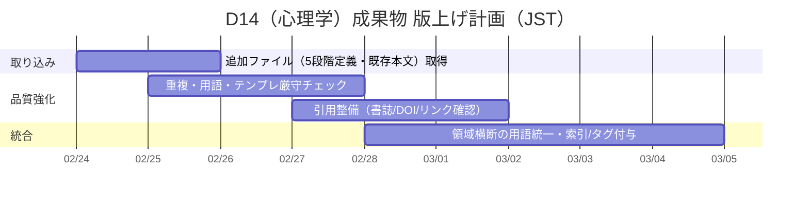

# D14 心理学・認知科学 要件抽出と調査結果

## エグゼクティブサマリー

本件で参照できた提供ファイルは **REQ-GPT-20260224-D14_psychology.md（ローカル）1件**でした。同ファイルの指示に基づき、D14（心理学・認知科学）における「5段階の創造プロセスモデル（場→波→縁→渦→束）」と**構造類似**が見込める理論として、(A)フロー、(B)認知的不協和、(C)洞察問題解決（制約緩和・再表象）を中核候補として整理しました。フローは「挑戦×技能」の力動と没入の循環が明示され、学習・発達の推進力として扱われます。citeturn23view0 認知的不協和は矛盾に伴う不快と低減過程（回避や合理化を含む）が段階遷移として切り出しやすく、古典研究として「強制承諾」状況での態度変容も核にあります。citeturn0search3turn10search6turn7search5 洞察問題解決は、行き詰まりからの制約緩和・再表象による「ひらめき」を扱う研究蓄積があり、5段階の「推移」との整列が最も自然、という暫定結論です。citeturn8search2turn8search4

一次・公式ソースは、日本語での検証可能性を優先するため、entity["organization","国立国会図書館","national library japan"]、entity["organization","CiNii Research","nii bibliographic service"]、entity["organization","J-STAGE","jst journal platform"]等の公的・学術基盤を中心に整理しました。citeturn3search6turn2search0turn8search2

エクスポート可能な成果物（Markdown/Excel/Word/PDF/ZIP）を作成済みです。  
- [ZIP一括パッケージ](sandbox:/mnt/data/D14_deliverables_package.zip)  
- [D14提出物（テンプレ準拠・3件）Markdown](sandbox:/mnt/data/D14_psychology_3findings.md)  
- [要件・ソース・計画 Excel](sandbox:/mnt/data/D14_requirements_sources_plan.xlsx)  
- [レポート Word](sandbox:/mnt/data/D14_report_ja.docx)  
- [レポート PDF](sandbox:/mnt/data/D14_report_ja.pdf)

## 抽出した要件と作業範囲

提供ファイル（REQ-GPT-20260224-D14_psychology.md）から、実行要件を「出力仕様」「スコープ制約」「根拠の品質」「重複回避」「総評」に分解し、ユーザー依頼（本チャット）で要求されたメタ成果物（要件表、ギャップ分析、行動計画、エクスポート）と統合して作業範囲を確定しました。

主要要件のポイントは次の通りです。

- **計画書・確認質問を出さず、結果を直接書く**（提出物の体裁要件）
- 指定テンプレートに**厳密準拠**し、**3件**の調査結果を作成する
- 既存エントリ（EV-CS-001〜005：4E認知等）と**重複しない理論**を扱う
- 各エントリで **[P] 確立された事実（3〜5点）**を示し、**一次文献**を根拠にする
- **5段階との対応表**（強度評価付き）と、牽強付会リスクの明示
- 3件を束ねた **心理学 総評** の提示

要件・作業・成果物の対応（比較表）は以下です（詳細はExcelにも反映済み）。

| 要件群 | 要件（要約） | このチャットでの実装 | エクスポート成果物 |
|---|---|---|---|
| 出力仕様 | テンプレ厳守・3件 | テンプレ準拠の提出物を別ファイル化 | Markdown（提出物）、Word/PDF（閲覧用） |
| スコープ制約 | 既存5件と重複回避 | フロー／認知的不協和／洞察問題解決を選定 | 同上 |
| 根拠の品質 | 一次・公式優先（日本語） | 公的DB・学会基盤・出版社公式を採用 | Excel「Sources」シート |
| メタ成果物 | 要件抽出・ギャップ・計画 | 本レポートで提示 | Excel/Word/PDF/ZIP |

## ギャップ分析と未確定事項

現時点の成果は「**提供ファイル1件**」に基づく暫定版です。今後の再編集コストと品質（牽強付会リスク）に最も影響する欠落は、(i) 5段階（場→波→縁→渦→束）の**各段階定義**、(ii) 既存エントリ（EV-CS-001〜005）の**本文**、(iii) 最終提出先の**仕様（文字数・採番・引用形式）**です。

ギャップを「必要性」「影響」「暫定仮定」に分解すると次の通りです。

| 欠落項目 | なぜ必要か | 影響 | 暫定仮定（現時点） |
|---|---|---|---|
| 5段階の定義・例 | 対応表の根拠の一貫性を確保 | 対応が読解依存になり牽強付会リスク増 | 場=初期配置、波=揺らぎ、縁=接続、渦=再編・巻込み、束=統合固定 |
| 既存エントリ本文 | 重複回避の厳密化 | タイトルレベルでは回避できても内容重複の可能性 | タイトル範囲を重複として回避 |
| 提出先仕様（媒体/文字数/ID規約） | 版上げの手戻り防止 | 体裁調整の追加工数 | Markdown正本、Word/PDFは閲覧用 |

## 一次・公式ソース整理

本件は「心理学理論の説明」そのものよりも、「**段階推移として切り出せる力動（プロセス性）**」を持つ理論を、一次・公式情報で裏打ちすることが中核です。そのため、次の優先順位でソースを採用しています。

- 日本の公的書誌・学術基盤（NDL / CiNii / J-STAGE）で存在と同定を担保  
- 出版社公式ページで翻訳・版情報を担保  
- 学会誌・査読論文で概念上の論点（制約緩和、低減過程など）を担保  
- 原典（1950–1990年代の主要著作・古典論文）はDOI等で同定し補強

主要ソース（比較表）です。

| 対象理論 | 主要一次・公式（日本語優先） | 役割 |
|---|---|---|
| フロー | entity["organization","宮崎大学","university miyazaki, jp"]紀要PDF（機関リポジトリ）citeturn23view0、entity["company","世界思想社","publisher kyoto, jp"]の翻訳版書誌citeturn5search1、学会基盤（FSS日本語版検討）citeturn6search5 | 定義・力動モデル・日本語受容の確認 |
| 認知的不協和 | entity["organization","こども家庭庁","japan government agency"]研修資料（概念説明＋訳書参照）citeturn0search3、訳書の公的書誌citeturn3search6、古典論文のDOI同定citeturn10search6、日本語レビュー（理論変遷）citeturn7search5 | 概念定義・低減過程・古典実験の一次根拠 |
| 洞察問題解決 | ゲシュタルト古典（翻訳書誌）citeturn2search0turn8search6、制約論的アプローチ（査読論文）citeturn8search2、認知科学での実証研究citeturn8search4 | 行き詰まり→再表象→解決の段階推移を学術的に裏付け |

翻訳版の同定に用いた主要書誌（比較表）です。

| 書名（日本語） | 出版・同定（公式） | 備考 |
|---|---|---|
| entity["book","フロー体験 喜びの現象学","csikszentmihalyi jp 1996"] | 出版社公式で書誌・目次を確認citeturn5search1 | 原著Flow（1990）に対応 |
| entity["book","認知的不協和の理論 : 社会心理学序説","festinger jp 1965"] | NDLサーチで書誌確認citeturn3search6 | 原著1957の翻訳 |
| entity["book","ゲシュタルト心理学の原理","koffka jp 1998"] | CiNiiで書誌・NDLデジコレ導線を確認citeturn2search0 | 原著Principlesに対応 |
| entity["book","類人猿の知恵試験","kohler jp 1962"] | NDLサーチで書誌確認citeturn8search6 | 洞察研究の古典系統 |

## 優先アクションプランとタイムライン

本日時点（日本時間 2026-02-24）での「次の最短ルート」は、欠落している定義・既存エントリ本文・提出先仕様の確定です。これが揃うと、対応表の根拠が明確化し、牽強付会リスクを下げた版上げが可能になります（提出物は既に暫定版を作成済み）。

成果物のパッケージングは、以下の方針で行いました（不確実性が高い要素ほど「再編集しやすい形式」を優先）。

- 正本: Markdown（テンプレ準拠・差分管理しやすい）
- 管理: Excel（要件・ソース・計画をシート分割）
- 閲覧用: Word / PDF（配布・レビュー容易）
- 一括配布: ZIP

## 暫定の調査結果

提出物（テンプレ厳守・3件）は、付属のMarkdownに格納しています（ZIPにも同梱）。ここでは、3候補の「プロセス性」「5段階への写像しやすさ」「牽強付会リスク」を比較し、総評判断に直結する部分のみを要約します。

フローは、挑戦と技能の相対関係が退屈・不安を介して動的に調整され、没入状態へ回帰する循環として記述されます。特に「退屈なら挑戦を上げる／不安なら技能を上げる」という回帰ロジックが明示されており、5段階の遷移として「ズレ→再調整→没入→蓄積」を指し示しやすいのが強みです。citeturn23view0

認知的不協和は、矛盾が不快を生み、その不快を低減するために態度・行動・解釈の変更や、矛盾を想起させる対象の回避が起こるという「整合回復」の力動です。研修資料では喫煙の例などで回避と信念化が説明されています。citeturn0search3 また、古典研究（強制承諾）では外的誘因の大小と態度変容の関係が検討されており、低減過程の一典型として参照可能です。citeturn10search6turn7search5 ただし「創造プロセスの生成」と「不協和低減の整合回復」は目的関数が異なるため、構造類似の提示には注意が必要です（対応の“強度”は中〜高になりにくい）。

洞察問題解決は、行き詰まりと再表象（制約緩和）を中核に、突然の解決（Aha）に至る推移を扱います。日本語の査読論文でも「制約」「緩和」といった語で理論化が行われ、洞察の段階推移を説明する枠組みが提示されています。citeturn8search2 さらに、認知科学領域では洞察における潜在過程・抑制機能などを扱う研究が報告されており、段階推移の“中間機構”を示唆する材料になります。citeturn8search4 これらの理由から、現時点では洞察問題解決が最も構造類似の強度が高い候補と判断しました。

比較の要点（まとめ表）です。

| 候補 | プロセスの核 | 構造類似の強度（暫定） | 牽強付会リスク（暫定） | 根拠の軸 |
|---|---|---|---|---|
| フロー | ズレ（退屈/不安）→再調整→没入→成長 | 高 | 中 | 力動モデルの明示citeturn23view0 |
| 認知的不協和 | 不一致→不快→低減（変更/回避）→整合回復 | 中 | 中〜高 | 定義＋古典実験＋レビューciteturn0search3turn10search6turn7search5 |
| 洞察問題解決 | 行き詰まり→制約緩和/再表象→解決固定 | 高 | 低〜中 | 制約論・実証研究citeturn8search2turn8search4 |

以上の詳細（テンプレ準拠の3件、対応表、主要文献、総評）は、同梱の提出物Markdownを参照してください。