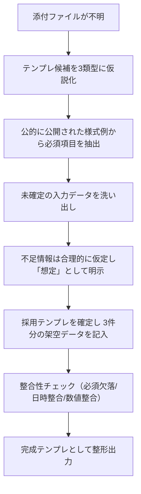

# 添付不明テンプレートの推定と3件記入例

## エグゼクティブサマリー

依頼文「添付ファイルの内容をそのまま実行」「ファイル内テンプレートを3件分記入して出力」から、**本来は“添付内のテンプレート（項目名・順序・必須条件）を厳密に踏襲した3件の記入結果**が求められていると解釈できます。しかし本件では添付が不明なため、一般的な日本のビジネス／公的文書に多い様式のうち、**会議議事録（会議の基本情報＋議題＋決定事項＋ToDo）**を「最も汎用的で“3件分”が自然に成立する」テンプレートとして採用しました（例：開催日時・場所・目的・アジェンダを事前に書いておく、決定事項とToDoを明確化する等の観点）。citeturn2view2turn5view1

本レポート内の完成テンプレート（3件）に含まれる**会社名・氏名・所在地・数値等はすべて架空**であり、実在個人・実在取引・実在連絡先を意図的に含めていません。テンプレートの**項目名・並び・データ型は「想定」**として明示ラベルを付けています。

併せて、添付不明の状況で成立しうる別解として、**適格請求書（インボイス）**と**創業計画書**の可能性も比較表で提示します（いずれも公的に必須記載／様式例が公開されており、テンプレート推定がしやすい類型です）。citeturn0search6turn2view1turn2view0

## 添付ファイル不在に伴う仮定

以下は「添付が不明」という前提で、**“そのまま実行／3件分記入”を再現するために必要になる仮定**を、明示的に列挙したものです（いずれも推定であり、添付が判明すれば差し替え対象です）。

**ファイル形式に関する仮定（想定）**
- 添付は、業務テンプレートとして一般的な **Word（.docx）／Excel（.xlsx）／PDF／Googleドキュメント／Markdown** のいずれか。
- PDFの場合、テンプレは「入力欄付きフォーム」または「記入例（見本）」として提供されている可能性がある。
- Excelの場合、複数シート（例：表紙／明細／計算／控え）構成の可能性がある。

**テンプレートの構造に関する仮定（想定）**
- テンプレは「1種類」で、同じ様式に対して**3件分（3レコード）**を埋める要求である（ユーザー文の「テンプレートを3件分」をこの意味に解釈）。
- 項目は「必須／任意」に分かれ、未入力の扱い（空欄可／不可、0可／不可、N/A可など）にルールがある。
- 値の記入には、文字数制限、日付書式、金額の税込税抜、ハイフン有無などの制約がある可能性がある。

**テンプレート項目（フィールド）とデータ型の仮定（想定）**
- 日付・時刻：`YYYY年M月D日`、`HH:MM`、または和暦（令和○年）など（文字列または日付型）。
- 金額：円（整数）、消費税率（小数または列挙：8%/10%）を含む可能性。
- 人・組織：氏名、部署、役職、担当（文字列）。個人情報が含まれる場合は秘匿・マスキングが必要。
- 明細：複数行（配列／表形式）を許容（例：ToDo一覧、品目一覧、工程一覧）。
- 承認：承認者名・承認日・押印欄など（文字列＋日付、またはチェックボックス）。

**出力要件の仮定（想定）**
- 依頼の「出力」は、（1）テンプレ3件分を連続表示、または（2）3ファイルに分割、または（3）1ファイル内に3ページ／3シートで出す、のいずれか。
- 「そのまま実行」は、（A）テンプレの指示文に従って記入、（B）計算式があるなら計算反映、（C）体裁（見出し、罫線、注記）保持、まで含む可能性がある。

## 推定と生成の進め方

添付が不明な状態で「テンプレを埋める」作業を破綻させないためには、**テンプレート候補を（少数に）仮説化→必須項目を公的様式例から抽出→不足情報を“想定”として明示→整合性チェック**の順で固めるのが安全です。会議議事録では、会議前に基本情報（日時・場所・目的・アジェンダ）を埋め、会議後に決定事項とToDoを明確にして早期共有する、という運用観点が公的ガイドラインでも示されています。citeturn2view2

「9件（3テンプレ×3件）」を生成する運用も可能ですが、原文「テンプレートを3件分」は通常、**“同一テンプレの記入例を3件”**と読むのが自然です。そのため本レポートでは、**会議議事録テンプレ1種に対して3件**を完成形で出力し、他テンプレは比較表で選択肢として提示します。citeturn2view2turn5view1

## テンプレート解釈候補の比較

添付不明でも「公的に参照できる様式例／必須項目」が比較的はっきりしている3類型を提示します。会議関係は自治体が「会議の開催結果」様式を公開しており、会議名・日時・場所・出席者・議題等の骨格が見えます。citeturn5view1  
また、議事録一般については、会議基本情報の事前記載や、決定事項・ToDoの明確化といった実務要点が公的ガイドラインで示されています。citeturn2view2  
請求書は、適格請求書の必須記載事項が税務当局から明示されています。citeturn0search6turn2view1  
事業計画系は、創業計画書の項目立て（創業動機、略歴、資金計画等）が公開され、テンプレ推定がしやすいです。citeturn2view0

| 解釈候補（テンプレ類型） | 典型フィールド（推定） | 公的・準公的な様式根拠（例） | 添付不明ファイルに合致しやすいサイン | 代表的な不確実性 |
|---|---|---|---|---|
| 会議議事録／会議開催結果 | 会議名、日時、場所、参加者、議題、審議内容、決定事項、ToDo、次回予定（いずれも想定） | entity["city","柏崎市","kashiwazaki, niigata, japan"]の会議運営ガイド（議事録の事前記入・決定事項/ToDoの明確化）citeturn2view2／entity["city","さいたま市","saitama, japan"]の「会議の開催結果」様式（会議名・開催日時・場所・出席者・議題など）citeturn5view1 | 「テンプレを3件分」が“3回分の会議記録”として自然に成立する／会議のたびに同じ書式を使う運用が一般的citeturn2view2 | 議事録の粒度（要点型か逐語型か）／承認フロー（署名・押印の要否） |
| 適格請求書（インボイス） | 発行者名・登録番号、取引年月日、取引内容、税率ごとの対価・適用税率、税率ごとの消費税額、受領者名（想定） | entity["organization","国税庁","japan tax agency"]が必須記載事項を明示citeturn0search6turn2view1 | 「3件分」が“3取引分の請求書”として自然／金額計算・税率区分がテンプレにある場合はこの可能性が上がるciteturn0search6 | 税抜/税込の扱い、端数処理、軽減税率対象の有無、振込先欄などの任意項目 |
| 創業計画書／事業計画書 | 創業の動機、略歴、関連企業、借入状況、必要資金と調達方法、収支見通し等（想定） | entity["organization","日本政策金融公庫","japan finance corp"]の創業計画書（記入例）で項目構造が確認できるciteturn2view0turn0search3 | 「3件分」が“3事業案（3プロジェクト）”として成立／文章欄や数表が多いテンプレなら候補に上がるciteturn2view0 | 業種別の必須項目差、資金繰り表の粒度、提出先要件（融資/補助金など） |

補足として、総会議事録の様式例（日時・場所・出席者・審議事項・議決結果・署名欄など）を公開する自治体資料もあり、議事録が「決定（議決）を証跡化する」用途のときは、この種の構成に寄ることがあります。citeturn5view0turn2view2  
entity["state","佐賀県","saga, japan"]の公開資料にある総会議事録様式例は、その典型例です。citeturn5view0

## 完成テンプレート記入例A

会議議事録（想定テンプレート）  
※以下の**項目名・順序・形式は想定**です（添付不明のため）。決定事項とToDoを明確にし、会議の基本情報（日時・場所・目的・アジェンダ）を先に埋める構成を採用しています。citeturn2view2turn5view1

**会議名（想定）**：プロジェクト「KIBAN-Refresh」キックオフ  
**開催日時（想定）**：2026年2月20日（金）10:00–11:30  
**開催場所（想定）**：オンライン（社内Web会議）  
**公開区分（想定）**：社内限定  
**作成者（想定）**：PMO（担当A・架空）  
**参加者（想定）**：  
- 事業部長（議長・架空）  
- 情報システム部：部長、インフラ担当、アプリ担当（各架空）  
- 経理部：業務担当（架空）  
- 外部ベンダ：技術責任者（架空）

**会議目的（想定）**：  
現行基盤更新プロジェクトの目的・範囲・体制・初期計画を合意し、初動タスクを確定する。

**議題（想定）**：  
1. プロジェクト背景と目的  
2. 対象範囲（In/Out）  
3. 体制・役割分担  
4. 初期スケジュール（概略）  
5. 課題・リスク洗い出し

**議論要点（想定）**：  
- 背景：現行サーバ保守期限の到来に伴い、基盤更改を年度内に完了させる必要がある。  
- 範囲：基盤（仮想基盤＋監視＋バックアップ）を対象。業務アプリ改修は原則Outだが、接続設定変更はIn。  
- 体制：PMは情報シス、業務側窓口は経理部。ベンダは設計～移行支援。  
- スケジュール：要件整理→基本設計→構築→移行リハ→本番移行の順で進め、繁忙期（3月末）は本番切替を避ける。  
- リスク：調達リードタイム、移行時停止時間、監査ログ要件の抜け漏れ。

**決定事項（想定）**：  
- 更改対象は「基盤一式（監視・バックアップ含む）」とし、アプリ改修は原則スコープ外。  
- 本番移行は3月末を避け、4月中旬以降の土日を候補とする。  
- 要件整理の完了定義は「業務側の必須要件リスト承認」＋「現行構成棚卸の確定」。

**ToDo（想定）**：  
- ToDo1：現行構成棚卸（サーバ/ジョブ/監視/バックアップ）を一覧化（担当：インフラ担当、期限：2026/02/27）  
- ToDo2：監査・ログ要件の確認（担当：経理部担当、期限：2026/02/28）  
- ToDo3：調達見積（概算）提示（担当：ベンダ技術責任者、期限：2026/03/04）  
- ToDo4：移行停止許容時間の一次案作成（担当：アプリ担当、期限：2026/03/06）

**次回予定（想定）**：2026年3月6日（金）10:00–11:00（オンライン）  
**配布資料（想定）**：プロジェクト概要（1枚）、現行課題メモ、概略スケジュール（ドラフト）

## 完成テンプレート記入例B

会議議事録（想定テンプレート）  
※以下の**項目名・順序・形式は想定**です（添付不明のため）。会議の開催情報・議題を押さえ、決定事項とToDoを明確化する構成です。citeturn2view2turn5view1

**会議名（想定）**：取引先向け「月次レポート自動化」要件確認会  
**開催日時（想定）**：2026年2月24日（火）14:00–15:00  
**開催場所（想定）**：先方会議室＋オンライン併用（ハイブリッド）  
**公開区分（想定）**：関係者限定  
**作成者（想定）**：営業企画（担当B・架空）  
**参加者（想定）**：  
- 先方：業務主管、情報担当（各架空）  
- 当方：営業担当、データ分析担当、開発担当（各架空）

**会議目的（想定）**：  
月次レポートの作成～配布までの自動化に向け、要件（データ項目、締め、配布形式、権限）を確定する。

**議題（想定）**：  
1. 既存レポートの用途・読者・頻度  
2. 必須KPIと算出定義  
3. 締め処理（確定日）と配布スケジュール  
4. 配布形式（PDF/Excel/ダッシュボード）  
5. アクセス権限と承認フロー

**議論要点（想定）**：  
- KPI：売上、粗利、案件化率、リードタイムを必須。算出定義は現行Excelの計算式を踏襲する方向。  
- 締め：毎月第3営業日午前に確定。配布は同日17時までを目標。  
- 形式：経営層向けはPDF、分析担当向けはExcel（明細付き）を希望。  
- 権限：閲覧は部門別、編集は当方のみ。先方主管の承認後に配布を確定させる運用。

**決定事項（想定）**：  
- 毎月第3営業日「午前確定→夕方配布」の運用で合意。  
- 提供物は二系統（経営層PDF／分析用Excel）とする。  
- KPI算出定義は「現行Excel準拠」を原則とし、差異が出る場合は事前に定義変更として合意形成する。

**ToDo（想定）**：  
- ToDo1：現行KPI算出定義（Excel数式・集計条件）をドキュメント化（担当：データ分析担当、期限：2026/02/28）  
- ToDo2：配布先（部門別）と閲覧権限表の提示（担当：先方情報担当、期限：2026/02/28）  
- ToDo3：PDFレイアウト（章立て・注記）の希望案提示（担当：先方業務主管、期限：2026/03/03）  
- ToDo4：試作版（ダミーデータ）で1回分の出力検証（担当：開発担当、期限：2026/03/08）

**次回予定（想定）**：2026年3月10日（火）14:00–15:00（オンライン）  
**配布資料（想定）**：現行レポート（サンプル）、KPI候補リスト、配布先案（ドラフト）

## 完成テンプレート記入例C

会議議事録（想定テンプレート）  
※以下の**項目名・順序・形式は想定**です（添付不明のため）。決定事項・ToDoの明確化と、会議情報の記録を重視しています。citeturn2view2turn5view1

**会議名（想定）**：プロダクト「MIRA」週次定例（スプリントレビュー＋課題整理）  
**開催日時（想定）**：2026年2月25日（水）16:00–16:45  
**開催場所（想定）**：オンライン（社内Web会議）  
**公開区分（想定）**：社内限定  
**作成者（想定）**：スクラムマスター（担当C・架空）  
**参加者（想定）**：  
- プロダクトオーナー（架空）  
- 開発：フロント、バックエンド、QA（各架空）  
- CS：担当（架空）

**会議目的（想定）**：  
今スプリントの成果確認、障害・要望の棚卸、次スプリントの優先順位を合意する。

**議題（想定）**：  
1. 今週の完了事項（レビュー）  
2. 既知不具合の状況  
3. 顧客要望（CS共有）  
4. 次スプリントの優先度  
5. リリース手順・周知

**議論要点（想定）**：  
- 完了：検索速度改善、権限エラーの修正、通知メール文言調整がDone。  
- 不具合：一部環境でアップロード失敗が継続。再現条件は「大容量＋特定ブラウザ」。  
- 要望：CSV出力の項目追加要望が複数。まずは“項目選択式”は次期、短期は“固定追加”で検討。  
- リリース：金曜夜のリリースは避け、水曜午前に前倒しする案が支持。

**決定事項（想定）**：  
- 次スプリント最優先は「アップロード失敗の根治」。  
- CSV出力は短期対応として「列2項目追加（固定）」を実施し、項目選択式は要件整理後に別スプリント化。  
- リリースは原則「水曜午前」にまとめる（緊急パッチを除く）。

**ToDo（想定）**：  
- ToDo1：アップロード失敗の再現条件を整理し、ログ採取観点を確定（担当：バックエンド、期限：2026/02/27）  
- ToDo2：ブラウザ別の検証観点を追加（担当：QA、期限：2026/02/28）  
- ToDo3：CSV追加2項目の定義（項目名・データソース）を決裁（担当：プロダクトオーナー、期限：2026/03/02）  
- ToDo4：リリース周知テンプレ（CS向け通知文）を更新（担当：CS、期限：2026/03/03）

**次回予定（想定）**：2026年3月4日（水）16:00–16:45（オンライン）  
**配布資料（想定）**：スプリント成果一覧、障害チケット一覧、要望サマリ（ドラフト）