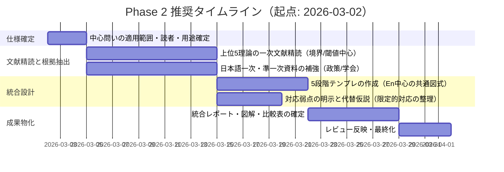

# 農学・生態学領域D12における「創造の5段階（場→波→縁→渦→束）」と構造類似する理論・概念の発掘レポート

## エグゼクティブサマリー

本レポートは、アップロード指示書（REQ-GPT-20260301-007_d12-deepresearch-retry.md）の要件に従い、既調査の3理論（適応的循環／パナキー、植生のパッチ動態、栄養カスケード／キーストーン種）と重複しない形で、農学・生態学（D12）領域から「創造の5段階（場→波→縁→渦→束）」と**構造的に対応づけ可能**な理論・概念を**10件**発掘し、各理論につき（1）理論名・提唱者・年、（2）概要（3〜5文）、（3）5段階との対応、（4）「縁（境界・関係・分岐点）」の明確性、（5）一次文献2〜3件（DOI/URL）を提示するものです（指示書要旨：L11〜L25、L27〜L47、L49〜L63）。

結論として、「縁」を最も明示的に扱い、5段階との対応が組み立てやすい（＝“構造類似”を議論しやすい）候補は、**生態学的境界理論**（境界そのものを中心概念に据える）citeturn15view0、**景観コネクティビティの臨界閾値（パーコレーション）**（連結性の“閾値＝分岐点”が核）citeturn3search1turn11search1、**レジームシフト／複数安定状態**（状態間遷移の“閾値”とヒステリシス）citeturn18search17turn18search5、**状態—遷移モデル（STMs）**（状態・遷移・閾値を管理用に形式化）citeturn4search4turn27search13、**IPMにおける経済的被害許容水準・経済閾値**（実務上の意思決定の“閾値”を中心に体系化）citeturn21search1turn26search0の5つです。

一方で、**乾燥地植生の自己組織化（反応拡散／チューリング様不安定性）**は、場→波→縁→渦→束を「均質場→微小揺らぎ→不安定化境界→自己組織化ダイナミクス→規則パターン」として対応づけられる点で強力ですciteturn14search0turn3search10。農学寄りの理論としては、**植物–土壌フィードバック**が「縁＝根圏・宿主特異的相互作用」を軸に、渦（フィードバック）と束（群集レベルの安定構造）まで含めて構造化できますciteturn7search1turn8search5。

本レポート末尾では、（i）追加で確認すべき未確定事項（中心問いの適用スコープ、想定読者、用途、深度など）、（ii）Phase 2に向けた作業計画（マイルストーンとガント）、（iii）主要リスクと軽減策を提示します。

## アップロード指示書の要件整理

アップロードファイルには、前回出力が「既存evidenceのレビュー」になったことへの是正として、今回は**新しい理論・概念の探索（ディープリサーチ：Phase 1）**を行うよう明記されています（L3〜L14）。中心問いは「創造の5段階（場→波→縁→渦→束）と構造類似がある理論・モデル・概念はあるか？」であり、5段階の定義も本文で与えられています（L16〜L25）。

要件を、指示書の文言に忠実に分解すると次の通りです。

- 新規性要件：農学・生態学領域で、中心問いに関連する理論・概念を**7件以上**「新たに」発掘する（L11〜L14）。
- 非レビュー要件：既存evidenceファイル（EV-AG-001〜003）の品質レビューではない（L13〜L14）。
- 重複禁止：既調査の3理論（適応的循環／パナキー、Wattの再生複合体、栄養カスケード／キーストーン種）とは重複しない（L27〜L33）。
- 出力必須項目（各理論ごと）：  
  1) 理論名・提唱者・年（主要文献：著者・年・タイトル・誌名）  
  2) 概要（3〜5文）  
  3) 5段階との対応（場・波・縁・渦・束に当たる概念があるか具体化）  
  4) 「縁」の有無（境界・関係・分岐点の概念が明確か：**最重要**）  
  5) 一次文献（2〜3件：DOI/URL付き）  
  （L49〜L57）
- 判断姿勢：類似は「何となく」ではなく**構造的対応**として判断し、弱い場合は「限定的」と正直に書く（L61〜L62）。
- 探索バランス：農学と生態学の双方からバランスよく探索（L63）。
- 探索方向の例示（制約ではない）：土壌科学、農学的プロセス（輪作・IPM・育種等）、遷移、島嶼生態学、生態系サービス、共生、撹乱生態学、景観生態学、農生態学（L35〜L47）。

期限・提出先・想定読者・予算・体裁（ページ数等）・評価方式（例えば採点基準）・ステークホルダー（個人名／組織名）は、ファイルに明示がありません（未指定事項として後掲「オープンクエスチョン」に整理）。

## 背景と評価観点

### 構造類似の判定フレーム

指示書は「構造的対応」を要求しているため、ここでは「5段階」を**システム論・生態学の語彙に翻訳する**評価観点を明確化します（本レポートの“評価枠”であり、一次文献の主張そのものではありません）。

- 場（Ba）：状態を規定する背景条件（外生要因、環境テンプレート、基盤資源、土壌・景観・気候・制度など）。
- 波（Nami）：ゆらぎ・攪乱・ノイズ・変動（確率過程、外乱、個体群変動、降雨変動、病害虫発生の変動など）。
- 縁（En）：境界・関係・結節点・分岐点（閾値、境界面、エッジ、接続、相互作用の“結び目”、レジーム転換点）。
- 渦（Uzu）：自己維持的ダイナミクス（正負フィードバック、自己組織化、閉ループ、ネットワーク効果）。
- 束（Taba）：方向づけ・集合・収束（安定パターン、規則構造、均衡、持続的な配置、制度化された意思決定規則）。

この枠組みで重要なのは、「縁」を（i）**明示概念として持つ**か、（ii）単なる比喩でなく**モデルの機能部品として機能する**か（例：閾値で挙動が急変、境界でフローが変換、接続性が相転移する等）です。特に、閾値・境界・接続性・遷移条件・意思決定点が理論の中心に据えられている場合、指示書の「縁」要件（最重要）を満たしやすくなります。

### 日本語一次・準一次資料の優先方針

本件は基礎理論（多くが英語圏）を含みますが、政策・実装寄りの領域（例：IPM）は日本語の一次・準一次（公的指針、学会資料）が有用です。たとえば、IPMはentity["organization","農林水産省","japan ministry agriculture"]が日本国内向けの「総合的病害虫・雑草管理（IPM）実践指針」を提示しており、定義・目的（経済性、健康・環境リスク低減、攪乱抑制等）が一次資料として参照できますciteturn21search1turn21search8。同様に、レジームシフト／レジリエンスは、日本語のワークブック（翻訳資料）で定義・用語を押さえられますciteturn9search5。

評価作業の流れを、後続の再利用可能性を意識してフローチャート化します。

```mermaid
flowchart TD
  A[中心問いと5段階定義の確認] --> B[候補理論の探索: 農学/生態学]
  B --> C[一次文献の特定: DOI/公式URL]
  C --> D[理論の核主張を3-5文で要約]
  D --> E[5段階へ対応付け: Ba/Nami/En/Uzu/Taba]
  E --> F[En(境界/関係/分岐点)の明確性を判定]
  F --> G[対応が弱い場合は限定的と明記]
  G --> H[優先度付けとPhase2計画へ接続]
```

## 新規理論・概念の発掘

以下は、既調査3理論と重複せず、農学・生態学の両面から「5段階」への構造対応を組み立てられる候補10件です。各理論について、指示書の出力形式（1〜5）に沿って記述します。

### 理論群の俯瞰

先に全体像（「縁」の型）を示すと、今回の10件は大きく3タイプに分かれます。

- **閾値・遷移（分岐点）型**：レジームシフト、状態—遷移モデル、IPMの経済閾値、景観の臨界閾値（パーコレーション）  
- **境界・接続（関係）型**：生態学的境界理論、メタコミュニティ、植物–土壌フィードバック  
- **自己組織化（フィードバック→パターン）型**：乾燥地植生パターン形成（反応拡散）、生態系エンジニア、ストレス勾配仮説、ニッチ構築

この分類自体は本レポートの整理（一次文献の用語ではない）ですが、指示書の「縁」要件に対して、どこに“縁”を置いて議論するか（閾値／境界面／接続点）を明確にするための地図として有効です。

image_group{"layout":"carousel","aspect_ratio":"16:9","query":["dryland vegetation pattern stripes aerial tiger bush","ecotone boundary forest field edge aerial","beaver dam ecosystem engineer habitat modification","soil profile horizons pedogenesis diagram"],"num_per_query":1}

### 発掘した理論・概念

#### 1) レジームシフト／複数安定状態（Alternative Stable States, Catastrophic Shifts）

**理論名・提唱者・年**  
レジームシフト（複数安定状態・急激な状態転換）／主要提唱者として entity["people","Marten Scheffer","ecologist wageningen"]（2001年前後以降、レビュー・統合）citeturn18search17turn0search1

**概要（3〜5文）**  
生態系は条件の変化に対して連続的に変わるだけでなく、**閾値（tipping point）**を境に、別の安定状態へ急激に移行することがあるという枠組みです。レジームシフトが起きると、元の状態へ戻りにくい（ヒステリシス）可能性があるため、管理・復元の考え方が連続モデルと大きく変わります。観測データ上も、臨界点接近に伴う統計的兆候（例：分散上昇）など「早期警告シグナル」が議論されますciteturn18search17turn22search1。

**5段階との対応**  
場：外生条件（栄養塩負荷、気候、攪乱頻度など“状態を規定する条件”）。citeturn18search17turn18search5  
波：条件変動・攪乱・ノイズ（ゆらぎ）が状態を揺さぶる。citeturn22search1  
縁：**閾値／転換点**（分岐点）で挙動が非連続に変わる。  
渦：状態を維持する**フィードバック**（透明水↔濁水など、自己強化・自己維持のループ）。citeturn18search17turn18search5  
束：新たな安定状態（別レジーム）への収束、あるいは管理介入で望ましい状態を維持。citeturn22search2  

**「縁」の有無（最重要）**  
極めて明確。理論の核が「閾値（分岐点）＝縁」にあるため、5段階対応の中心として扱いやすい。citeturn18search17turn18search5  

**一次文献（DOI/URL付き：2〜3件）**  
- Scheffer, M. et al. (2001). *Catastrophic shifts in ecosystems*. Nature. **DOI: 10.1038/35098000** citeturn18search17turn0search1  
- Scheffer, M. & Carpenter, S.R. (2003). *Catastrophic regime shifts in ecosystems: linking theory to observation*. Trends in Ecology & Evolution. **DOI: 10.1016/j.tree.2003.09.002** citeturn18search5  
- Carpenter, S.R. & Brock, W.A. (2006). *Rising variance: a leading indicator of ecological transition*. Ecology Letters. **DOI: 10.1111/j.1461-0248.2005.00877.x** citeturn22search1  

#### 2) 生態学的境界理論（Ecological Boundary Theory / Ecotone研究の理論枠組み）

**理論名・提唱者・年**  
生態学的境界の理論枠組み／主要提唱者として entity["people","Mary L. Cadenasso","ecologist boundary theory"] ら（2003）citeturn15view0

**概要（3〜5文）**  
生態系・景観には境界（林縁、河畔、水陸移行帯など）が遍在しますが、境界研究は系やスケールごとに断片化しがちでした。そこで、境界を「パッチ間コントラスト」「フローの種類（生物・物質・エネルギー・情報）」「境界の性質」といった共通変数で捉え、一般化して研究・モデル化する枠組みが提示されます。境界は単なる線ではなく、フローを変換し、相互作用を編成する“機能的要素”として扱われますciteturn15view0。

**5段階との対応**  
場：景観モザイク（パッチの配置・コントラスト）という前提条件。citeturn15view0  
波：フロー（個体移動、物質流、微気候変動）が時間的に揺らぐ／イベントで変わる。  
縁：境界そのもの（境界面の性質・透過性・変換能）。ここが理論の中心。citeturn15view0  
渦：境界がフローを変換し、局所環境・種組成を変え、それがさらに境界機能を変える（機能的フィードバックを設計可能）。  
束：境界機能の安定化（典型的なエッジ効果の空間パターン、境界管理の標準化）。

**「縁」の有無（最重要）**  
極めて明確（“縁”を理論の中心変数として明示）。指示書の要求に最も直接に適合しうる候補。citeturn15view0  

**一次文献（DOI/URL付き：2〜3件）**  
- Cadenasso, M.L. et al. (2003). *A Framework for a Theory of Ecological Boundaries*. BioScience. **DOI: 10.1641/0006-3568(2003)053[0750:AFFATO]2.0.CO;2** citeturn15view0  
- 日本語での関連（エコトーン形成・境界解析の必要性を論じる学術資料例）：田村（エコトーン形成の地生態学的研究）**URL: 東京メトロポリタン大学リポジトリ掲載PDF** citeturn10search0  
- 日本語での境界効果レビュー例（森林景観の境界効果の到達距離・作用機序）：酒井（2013）**URL: J-STAGE/農研機構系PDF** citeturn10search9turn10search5  

#### 3) メタコミュニティ理論（Metacommunity Concept）

**理論名・提唱者・年**  
メタコミュニティ概念（複数局所群集＋分散で結ばれた上位構造）／主要提唱者として entity["people","Mark A. Leibold","ecologist metacommunity"] ら（2004）citeturn17search0turn17search9

**概要（3〜5文）**  
局所群集は孤立しているのではなく、複数の局所群集が分散（dispersal）で結ばれた「メタコミュニティ」として理解すべきだ、という枠組みです。環境フィルタリング（ニッチ）と空間過程（分散・コロナイゼーション）が統合的に扱われ、パッチダイナミクス、種ソーティング、質量効果、中立モデルなど複数の視点を整理する枠として機能しますciteturn17search0turn17search9。

**5段階との対応**  
場：局所環境のモザイク（パッチ群と環境勾配）。citeturn17search0  
波：確率的な局所絶滅・加入、環境変動による局所条件の揺らぎ。  
縁：局所群集間を結ぶ分散経路・接続（ネットワークとしての“縁”）。  
渦：分散と局所相互作用が循環的に群集組成を更新（ソーティング⇄分散のループ）。citeturn17search0  
束：広域で観察される安定なβ多様性構造、あるいは特定のメタコミュニティ状態への収束。

**「縁」の有無（最重要）**  
明確。理論の中核に「局所間の結びつき（分散リンク）」があり、“関係としての縁”を扱いやすい。一方、「分岐点（閾値）」としての縁は、別途（コネクティビティ閾値等）と組み合わせると強化されます。citeturn17search0turn17search12  

**一次文献（DOI/URL付き：2〜3件）**  
- Leibold, M.A. et al. (2004). *The metacommunity concept: a framework for multi-scale community ecology*. Ecology Letters. **DOI: 10.1111/j.1461-0248.2004.00608.x** citeturn17search0turn17search9  
- 日本語の書誌・参照導線（国内学術DB）：**URL: CiNii Research（書誌）** citeturn17search9  
- 応用的発展例（食物網と分散の統合の方向性）：Gross (2020) *Modern models of trophic meta-communities*（レビュー）**URL: PMC** citeturn17search12  

#### 4) 景観コネクティビティの臨界閾値とパーコレーション理論の応用

**理論名・提唱者・年**  
景観コネクティビティ（連結性）と臨界閾値（critical thresholds）／主要提唱者として entity["people","Kimberly A. With","ecologist landscape connectivity"]（1990年代〜2000年代に理論化・応用）citeturn11search1turn3search1

**概要（3〜5文）**  
景観内の生息地の量や配置が少し変わるだけで、個体の移動成功や個体群応答が**不連続に急変**する「臨界閾値」があり得る、という視点です。パーコレーション理論を用いることで、断片化が進む景観で「突然つながらなくなる」相転移的挙動（連結クラスターの崩壊など）を評価できます。さらに、連結性は“回廊（corridor）”だけでは捉えきれない複雑な性質を持つと整理されますciteturn3search1turn11search1。

**5段階との対応**  
場：生息地・非生息地のモザイクという基盤（景観テンプレート）。citeturn11search2  
波：局所的な損失・攪乱・土地利用変化のゆらぎが連結性を揺さぶる。  
縁：**パーコレーション閾値／臨界範囲**（小変化で応答が急変する分岐点）。citeturn11search1turn3search1  
渦：移動成功⇄局所個体群の存続（レスキュー効果等）が循環的に連結性の意味を強める。  
束：広域で機能する連結ネットワーク（あるいは断絶したクラスター構造）として安定化。

**「縁」の有無（最重要）**  
非常に明確。“縁”を「つながり」かつ「閾値（分岐点）」として二重に扱えるため、5段階の骨格を作りやすい。citeturn11search1turn3search1  

**一次文献（DOI/URL付き：2〜3件）**  
- With, K.A. & Crist, T.O. (1995). *Critical Thresholds in Species' Responses to Landscape Structure*. Ecology. **DOI: 10.2307/2265819** citeturn11search1turn11search8  
- Taylor, P.D. et al. (1993). *Connectivity is a vital element of landscape structure*. Oikos. **DOI: 10.2307/3544927** citeturn11search13turn11search10  
- With, K.A. (2002). *Using Percolation Theory to Assess Landscape Connectivity and Effects of Habitat Fragmentation*. Springer（書籍章）**DOI: 10.1007/978-1-4613-0059-5_7** citeturn3search1  

#### 5) 乾燥地植生の自己組織化・パターン形成（反応拡散／チューリング様不安定性、SDF）

**理論名・提唱者・年**  
乾燥・半乾燥地で観察される植生の規則パターン（縞・斑点等）を、植物—水相互作用のモデルで説明する枠組み／主要提唱者として entity["people","Christopher A. Klausmeier","ecologist pattern formation"]（1999）および関連研究群（2001〜）citeturn14search0turn14search2

**概要（3〜5文）**  
水制限下の生態系では、植生が縞模様や斑点状などの空間パターンを示すことがあり、モデルはその出現を説明します。微小な揺らぎが増幅され、チューリング様の不安定性により規則パターンが生じる、という説明が提示されています。別モデルでも、降水量など条件に応じて裸地→均質植生へ移行する途中で多様なパターンが現れること、さらに複数安定状態が共存し得ることが示されますciteturn14search0turn14search2。

**5段階との対応**  
場：均質な環境・資源制約（水・地形・土壌）という基盤。citeturn14search1turn14search2  
波：微小ノイズ・局所地形差・降雨変動が揺らぎとして入る。citeturn14search1turn14search12  
縁：均質状態が不安定化する**臨界条件（分岐）**、または裸地／植生パッチの境界がフロー（浸透・流出）を変える境界面。  
渦：スケール依存フィードバック（局所促進＋遠距離抑制など）で自己組織化が持続。citeturn14search3turn3search10  
束：縞・斑点・迷路状などの**安定空間パターン**への収束。citeturn14search0turn14search2  

**「縁」の有無（最重要）**  
明確（ただし“縁”の主語が二通りある点に注意）。  
- 分岐点としての縁：不安定化条件（臨界）  
- 境界面としての縁：植生パッチ縁での水・物質フロー変換  
どちらを中心問いの「縁」とみなすかを、Phase 2で明示すると議論が締まります。citeturn14search0turn3search10  

**一次文献（DOI/URL付き：2〜3件）**  
- Klausmeier, C.A. (1999). *Regular and Irregular Patterns in Semiarid Vegetation*. Science. **DOI: 10.1126/science.284.5421.1826** citeturn14search0turn14search1  
- Rietkerk, M. et al. (2002). *Self-Organization of Vegetation in Arid Ecosystems*. The American Naturalist. **DOI: 10.1086/342078** citeturn3search10turn3search2  
- von Hardenberg, J. et al. (2001). *Diversity of Vegetation Patterns and Desertification*. Physical Review Letters. **DOI: 10.1103/PhysRevLett.87.198101** citeturn14search2turn14search12  

#### 6) 植物–土壌フィードバック理論（Plant–Soil Feedback）

**理論名・提唱者・年**  
植物—土壌コミュニティ間のフィードバック枠組み／主要提唱者として entity["people","James D. Bever","ecologist plant-soil feedback"]（1994; 1997）citeturn7search1turn23search3

**概要（3〜5文）**  
植物は土壌生物群集（病原菌、共生菌、分解者など）を変化させ、その変化した土壌が次の植物成長に正／負の影響を返す、という循環的枠組みです。フィードバックは種の共存、優占、侵入成功、遷移過程の理解に関与し得ます。実験的プロトコルや理論モデルを通じ、土壌コミュニティを群集生態学へ統合する基盤として提示されますciteturn7search1turn23search3。

**5段階との対応**  
場：土壌の物理化学条件＋既存の土壌生物群集（背景条件）。  
波：土壌病原菌・共生菌の揺らぎ、季節・管理・攪乱による土壌条件の変動。  
縁：**根圏（rhizosphere）／宿主特異性**が“結び目”となり、植物と土壌が関係として結合する分岐点。citeturn7search1turn8search5  
渦：正負フィードバック（自己強化／自己抑制）の循環が群集構造を維持・変化させる。citeturn7search1turn23search3  
束：共存構造、優占状態、侵入成功／失敗など、群集レベルの安定的帰結（あるいは周期・遷移）。

**「縁」の有無（最重要）**  
明確。縁を「関係（植物↔土壌生物の結合点）」として同定でき、さらにその結合が渦（フィードバック）を生み、束（群集構造）へ至る筋が作れる。citeturn7search1turn8search5  

**一次文献（DOI/URL付き：2〜3件）**  
- Bever, J.D. (1994). *Feedback between plants and their soil communities in an old field community*. Ecology. **DOI: 10.2307/1941601** citeturn7search1turn7search2  
- Bever, J.D. et al. (1997). *Incorporating the soil community into plant population dynamics: the utility of the feedback approach*. Journal of Ecology. **DOI: 10.2307/2960528** citeturn23search3turn23search4  
- Klironomos, J.N. (2002). *Feedback with soil biota contributes to plant rarity and invasiveness in communities*. Nature. **DOI: 10.1038/417067a** citeturn8search5turn8search1  

（日本語導線例：entity["organization","日本生態学会","ecological society of japan"]の学会誌サイトで、植物土壌フィードバックの総説掲載を告知・紹介）citeturn8search3  

#### 7) ニッチ構築理論（Niche Construction Theory）

**理論名・提唱者・年**  
ニッチ構築（生物が環境を改変し、選択圧を変える）／主要提唱者として entity["people","F. John Odling-Smee","evolutionary theorist"] ら（1996）citeturn3search11turn3search15

**概要（3〜5文）**  
進化は「環境→生物」の一方向だけでなく、生物が環境を改変することで、次世代以降の選択圧そのものが変化し得るという考え方です。環境改変形質（niche-constructing traits）と、改変された環境に依存する形質が共進化し得ることを、理論モデルで示します。結果として、生態・進化のダイナミクスに“環境改変によるフィードバック”が組み込まれますciteturn3search11turn3search15。

**5段階との対応**  
場：初期環境（外生条件）と既存資源配置。  
波：個体群変動・環境改変のばらつき・攪乱が揺らぎとなる。  
縁：環境改変が“関係の結節点”となり、生物と環境の相互依存が確立する分岐点（例：環境改変が一定水準を超えると選択圧が質的に変化）。citeturn3search3turn3search11  
渦：環境改変⇄選択圧⇄形質進化のフィードバックループ。citeturn3search15  
束：改変された環境と適応形質の組が安定化（“構築されたニッチ”として持続）。

**「縁」の有無（最重要）**  
“関係としての縁”は明確（生物—環境の結合点）。ただし「閾値としての縁」が常に明示されるわけではないため、5段階の“縁”を「分岐点」より「結節・関係」に寄せて解釈すると適合しやすい。citeturn3search11turn3search15  

**一次文献（DOI/URL付き：2〜3件）**  
- Odling-Smee, F.J. et al. (1996). *Niche Construction*. The American Naturalist. **DOI: 10.1086/285870** citeturn3search11turn3search7  
- Laland, K.N. et al. (1999). *Evolutionary consequences of niche construction and their implications for ecology*. PNAS. **DOI: 10.1073/pnas.96.18.10242** citeturn3search15  
- Laland, K.N. et al. (1996). *The evolutionary consequences of niche construction: a theoretical investigation*. Journal of Evolutionary Biology. **DOI: 10.1046/j.1420-9101.1996.9030293.x** citeturn3search3turn3search19  

（日本語導線例：ニッチ構築を用語定義から整理する日本語論文：文化的ニッチ構築の議論だが概念整理として参照可）citeturn20search6turn20search2  

#### 8) 生態系エンジニアリング（Ecosystem Engineers / Physical Ecosystem Engineering）

**理論名・提唱者・年**  
生態系エンジニア（生物が物理的状態を変え資源利用可能性を変える）／主要提唱者として entity["people","Clive G. Jones","ecologist cary institute"] ら（1994）citeturn4search10turn24search6

**概要（3〜5文）**  
生物は捕食・競争などの栄養関係だけでなく、環境を物理的に改変することで他種の資源利用可能性を変え、ハビタットを創造・維持し得ます。この役割を担う生物を生態系エンジニアと捉え、工学的改変（engineering）を生態系の主要過程として明示します。後続研究では、エンジニアリングが種多様性や個体群動態へ与える正負の効果、エンジニア／ハビタット系の安定性・周期性などが整理されますciteturn4search10turn24search6turn24search3。

**5段階との対応**  
場：改変前の物理環境（基盤条件）。  
波：エンジニアの個体群変動、攪乱の入り方、材料供給の変動。  
縁：構造物（ダム、塚、巣穴、植物体構造など）が生む**境界条件**（水陸境界の再配置、微気候境界、資源アクセスの分岐）。citeturn4search10turn24search3  
渦：環境改変⇄エンジニアの存続⇄他種の集積・相互作用の循環（正負のフィードバック）。citeturn24search6turn24search0  
束：工学的に再編成されたハビタットが持続し、典型的景観・群集構造が安定化。

**「縁」の有無（最重要）**  
明確。縁は「境界条件を作り替える構造物」および「改変によって生じる関係の結節」として明示できる。閾値型に比べると“分岐点”の表現は弱い場合があるため、対象系で「改変量の閾値」を追加定義するとさらに強くなる。citeturn4search10turn24search0  

**一次文献（DOI/URL付き：2〜3件）**  
- Jones, C.G. et al. (1994). *Organisms as ecosystem engineers*. Oikos. **DOI: 10.2307/3545850** citeturn4search10turn4search14  
- Jones, C.G. et al. (1997). *Positive and negative effects of organisms as physical ecosystem engineers*. Ecology. **DOI: 10.1890/0012-9658(1997)078[1946:PANEOO]2.0.CO;2** citeturn24search6turn24search0  
- Jones, C.G. et al. (1997). *Ecosystem engineering by organisms: why semantics matters*. Trends in Ecology & Evolution. **DOI: 10.1016/S0169-5347(97)81019-1** citeturn24search3  

（日本語導線例：JSTのJ-GLOBALで「生態系エンジニア」を用いた日本語論文情報にアクセス可能）citeturn20search0  

#### 9) ストレス勾配仮説（Stress-Gradient Hypothesis: SGH）と促進（Facilitation）の理論化

**理論名・提唱者・年**  
ストレス勾配仮説（SGH）／主提唱者として entity["people","Mark D. Bertness","marine ecologist"] と entity["people","Ragan Callaway","plant ecologist"]（1994）citeturn4search15turn19search13

**概要（3〜5文）**  
環境ストレスが強いほど、競争よりも“促進（facilitation）”などの正の種間相互作用が相対的に重要になる、という仮説です。これにより、従来の競争中心の群集観に対して、環境条件に応じて相互作用の符号（正負）が変わり得るという構造を理論に組み込めます。以後、仮説の精緻化（競争と促進の同時記述、勾配の種類、例外形の検討など）が進んでいますciteturn4search15turn25search0。

**5段階との対応**  
場：環境勾配（ストレスの背景条件）。citeturn4search15  
波：気象・攪乱などによるストレスの時間変動、資源パルス。  
縁：相互作用が競争優位→促進優位へ切り替わる**転換点（境界）**、または“相互作用の結び目”としての隣接関係。citeturn25search0turn19search2  
渦：促進が個体生存を高め、局所環境を改善し、さらに促進の効果が強まる（正のループが成立し得る）。  
束：勾配に沿った典型的群集配置（ゾーネーション）や、相互作用構造の安定パターン。

**「縁」の有無（最重要）**  
中〜高。縁は「相互作用が切り替わる境界」または「関係そのもの」に置けるが、系によって単調増加ではない形も議論されるため、対応は“限定的になり得る”と明記しておくのが安全ですciteturn25search11turn25search0。

**一次文献（DOI/URL付き：2〜3件）**  
- Bertness, M.D. & Callaway, R. (1994). *Positive interactions in communities*. Trends in Ecology & Evolution. **DOI: 10.1016/0169-5347(94)90088-4** citeturn4search15turn4search11  
- Maestre, F.T. et al. (2009). *Refining the stress-gradient hypothesis for competition and facilitation in plant communities*. Journal of Ecology. **DOI: 10.1111/j.1365-2745.2008.01476.x** citeturn25search0  
- 日本語での学会資料（SGHの成り立ちと展開をシンポジウムで整理）：**URL: 日本生態学会大会シンポジウムPDF** citeturn19search13  

#### 10) 状態—遷移モデル（State-and-Transition Models: STMs）

**理論名・提唱者・年**  
状態—遷移モデル（非平衡的レンジランド観を管理へ接続）／主要提唱者として entity["people","Michael Westoby","ecologist rangeland"] ら（1989）citeturn4search4turn4search8

**概要（3〜5文）**  
従来の単線的な遷移（succession）モデルでは捉えにくいレンジランド（乾燥地草原等）の変化を、「複数の状態」と「状態間の遷移（transition）」のカタログとして表現する枠組みです。重要なのは、遷移が連続的とは限らず、閾値を越えると元に戻りにくい（または別の管理が必要）という視点を管理に取り込む点です。以後、閾値・健全性評価と結びつき、管理者向けの意思決定ツールとして発展していますciteturn4search4turn27search1。

**5段階との対応**  
場：サイトの基礎条件（土壌、気候、地形、利用履歴）。citeturn4search4turn27search13  
波：降雨変動、火入れ、放牧圧などの攪乱と確率性。  
縁：**閾値（threshold）**と遷移条件（分岐点）がモデル要素として明示される。citeturn27search1turn27search2  
渦：状態ごとの自己維持機構（植生—土壌—攪乱レジームのフィードバック）。  
束：特定状態への定着（安定状態）または管理介入による望ましい状態への収束。

**「縁」の有無（最重要）**  
非常に明確。理論の中心部品が「閾値・遷移」であり、“縁＝分岐点”を明示できる。citeturn4search4turn27search1  

**一次文献（DOI/URL付き：2〜3件）**  
- Westoby, M. et al. (1989). *Opportunistic management for rangelands not at equilibrium*. Journal of Range Management. **DOI: 10.2307/3899492** citeturn4search8turn4search4  
- Briske, D.D. et al. (2003). *Vegetation dynamics on rangelands: a critique of the current paradigms*. Journal of Applied Ecology. **DOI: 10.1046/j.1365-2664.2003.00837.x** citeturn27search2  
- 日本語での関連整理（草地・レンジランドで閾値概念を整理）：*A Synthesis of Ecological Concepts and their Applications to Rangeland Ecosystems* **DOI: 10.14941/grass.56.61** citeturn27search13  

#### 11) IPM（総合的病害虫・雑草管理）における「経済的被害許容水準（EIL）」と「経済閾値（ET）」

**理論名・提唱者・年**  
統合的防除（Integrated Control）と経済閾値に基づく意思決定／主要提唱者として（学術史上）Sternら（1959）に起源citeturn26search19turn2search2、日本国内の制度・実装面では entity["organization","農林水産省","japan ministry agriculture"]がIPM実践指針を整備citeturn21search1turn21search8

**概要（3〜5文）**  
IPMは、利用可能な防除技術を経済性も含め慎重に検討し、リスクと環境負荷を低減しつつ発生増加を抑える「総合的」管理です。意思決定の中核の一つが、害虫密度が経済的損失と防除コストが釣り合う水準（EIL）と、そこへ到達する前に措置を開始する判断水準（ET）という“閾値”概念です。閾値を中心に、観測（モニタリング）と介入（選択肢の組合せ）を接続する点で、実務理論として高い形式性を持ちますciteturn21search1turn26search0turn26search19。

**5段階との対応**  
場：作物—圃場生態系・天敵相・栽培体系・政策指針（前提条件）。citeturn21search1turn21search8  
波：病害虫密度の変動、気象変動、抵抗性発達など。  
縁：**EIL/ET（意思決定の分岐点）**が明示され、ここが最重要の“縁”。citeturn26search0turn26search19  
渦：防除介入→天敵・病害虫—作物系の再編→次の発生構造（フィードバック）。citeturn26search8turn21search1  
束：持続的管理としての標準手順（指針・実践指標）への収束。citeturn21search8turn21search0  

**「縁」の有無（最重要）**  
極めて明確。縁を「経済閾値」という形式的な分岐点として実装しており、5段階の“縁”概念と対応づけやすい。citeturn26search0turn21search1  

**一次文献（DOI/URL付き：2〜3件）**  
- Pedigo, L.P. et al. (1986). *Economic Injury Levels in Theory and Practice*. Annual Review of Entomology. **DOI: 10.1146/annurev.en.31.010186.002013** citeturn26search0  
- 経済的被害許容水準（EIL）の概念整理（EIL/ETの図解を含む資料例）：Utah State University Extension資料 **URL: PDF** citeturn26search19  
- 日本の一次（公的）資料：entity["organization","農林水産省","japan ministry agriculture"] *総合的病害虫・雑草管理（IPM）実践指針* **URL: 公式ページ／PDF** citeturn21search1turn21search8  

#### 12) 土壌生成の状態因子モデル（State Factor Model / CLORPT、ペドジェネシスの定式化）

**理論名・提唱者・年**  
土壌生成を外生因子の関数として捉える状態因子モデル（CLORPT）／主要提唱者として entity["people","Hans Jenny","soil scientist clorpt"]（1941）citeturn5search8turn5search0  

**概要（3〜5文）**  
土壌を「気候（cl）、生物（o）、地形（r）、母材（p）、時間（t）」などの状態因子の関数として捉え、土壌形成を定量的ペドロジーとして記述する枠組みです。土壌を“システム”として扱い、外的駆動（状態因子）と土壌特性の対応を整理します。後続研究では、状態因子モデルの評価や、複雑系・非線形理論との接続も議論されていますciteturn5search0turn5search5。

**5段階との対応**  
場：状態因子（cl/o/r/p/t）が作る環境基盤。citeturn5search0turn5search12  
波：気候・生物活動・攪乱の時間変動（風化・堆積・生物攪拌のゆらぎ）。  
縁：地表—地下、層位（ホライズン）、母材—土壌などの**界面／境界**が形成・変化する分岐点。  
渦：風化・有機物分解・生物攪拌などが相互作用し、土壌プロファイルを自己組織化的に形成・維持。citeturn5search15turn5search5  
束：特定の土壌型・層位構造への収束（安定特徴としての地平）。  

**「縁」の有無（最重要）**  
中程度。土壌科学は境界（層位・界面）を扱うため“縁”は存在しますが、理論の中心が「境界機能」より「状態因子による記述」にあるため、縁を中心概念に据えるには追加の構造化（例：界面でのフロー変換モデル）を併用すると強い。citeturn5search15turn5search16  

**一次文献（DOI/URL付き：2〜3件）**  
- Jenny, H. (1941). *Factors of Soil Formation: A System of Quantitative Pedology*. **URL: Cornell Digital Library（公開記録）** citeturn5search8  
- Jenny, H. (1941/復刻). **URL: 公開PDF（Dover復刻の再掲PDF）** citeturn5search0  
- 位置づけ・解説（モデルの系譜整理、英語一次寄りの教科書章）：*Models and concepts of soil formation*（Cambridge Core章）**URL: PDF/章** citeturn5search15  
（日本語導線例：Jennyの著作に触れた土壌学史の日本語論文）citeturn5search16  

## 選択肢比較と優先度提案

### 「縁」適合度と5段階対応の強さ（提案スコア）

以下は、指示書の目的（縁を最重要視しつつ5段階へ対応）に対し、Phase 2で深掘り優先度を決めるための比較表です。スコア（高・中・低）は本レポートの判断であり、一次文献の数値評価ではありません。

| 理論・概念 | 農学/生態 | 「縁」の型 | 適合度（縁） | 適合度（5段階全体） | コメント |
|---|---|---|---|---|---|
| 生態学的境界理論citeturn15view0 | 生態 | 境界面 | 高 | 高 | 指示書の「縁」を正面から扱う |
| 景観コネクティビティ閾値（パーコレーション）citeturn3search1turn11search1 | 生態 | 閾値＋接続 | 高 | 高 | “分岐点”と“つながり”の両立 |
| レジームシフト／複数安定状態citeturn18search17turn18search5 | 生態 | 閾値 | 高 | 高 | 閾値・ヒステリシス・早期警告까지 |
| 状態—遷移モデル（STMs）citeturn4search4turn27search13 | 生態/農（管理） | 閾値 | 高 | 高 | 管理の意思決定に直結しやすい |
| IPMのEIL/ETciteturn21search1turn26search0 | 農学 | 意思決定閾値 | 高 | 中〜高 | “縁＝判断点”が形式化されている |
| 植物–土壌フィードバックciteturn7search1turn8search5 | 農学/生態 | 根圏の関係 | 中〜高 | 中〜高 | “縁→渦”が描きやすい |
| 乾燥地植生パターン形成citeturn14search0turn3search10 | 生態 | 分岐＋境界 | 中〜高 | 高 | “波→渦→束”が非常に強い |
| 生態系エンジニアciteturn4search10turn24search6 | 生態 | 境界条件 | 中 | 中〜高 | “縁”を構造物として置ける |
| ストレス勾配仮説citeturn4search15turn25search0 | 生態 | 相互作用の境界 | 中 | 中 | 勾配形・例外で議論が増える |
| 土壌生成の状態因子モデルciteturn5search8turn5search15 | 農学 | 界面 | 中 | 中 | “縁”を中心に据えるには補助理論推奨 |
| ニッチ構築citeturn3search11turn3search15 | 生態/進化 | 関係の結節 | 中 | 中 | “縁＝分岐点”より“縁＝関係”で強い |

### Phase 2の進め方の選択肢（深掘り範囲・工数の目安）

予算が未指定のため、ここでは「成果物の厚み」に応じた作業オプションを提示します（金額は提示せず、作業量＝人日目安で記載）。

| オプション | 成果物の深度 | 対象理論数 | 追加作業（例） | 目安工数 |
|---|---|---:|---|---:|
| A: 最短強化 | Phase1の精緻化 | 7〜10 | 各理論の一次文献を精読し、対応の根拠段落を抽出（引用は短く）／「縁」評価の明文化 | 3〜5人日 |
| B: 統合モデル案まで | 5段階との統合設計 | 4〜6（上位） | “縁”を中心に、5段階の共通テンプレ（共通図式）を作成／農学・現場例へ接続 | 7〜12人日 |
| C: 実装・検証設計まで | 実験・観測・意思決定設計 | 2〜3（最有望） | 指標設計（早期警告、閾値推定）、データ要件、実証ケース選定、日本の制度（IPM等）との接続 | 15〜25人日 |

## 作業計画とマイルストーン

現在日付（2026-03-01, Asia/Tokyo）を起点に、Phase 2へ移行する場合の具体的計画例を示します（期限未指定のため、標準的テンポの案）。



マイルストーン（成果の“区切り”）は次の3点が重要です。

- M1：中心問いの適用範囲（対象システム、学術目的か実務目的か）と評価基準（縁の定義）を確定  
- M2：上位候補（境界理論、パーコレーション、レジームシフト、STMs、IPM）の一次文献を精読し、5段階対応の根拠を“構造部品”として抽出  
- M3：5段階テンプレ（共通図式）を提示し、「共通する縁」を設計要素（観測・管理・介入点）として表現

## リスクと推奨次アクション

### 主要リスク

第一に、「縁」を“境界面”とみなすか“閾値（分岐点）”とみなすかで、最適な理論群が変わります。現状でも両方で整理は可能ですが、中心問いの解像度を上げないと、対応づけが散漫になり得ます（指示書が構造的対応を要求しているため）。第二に、英語一次文献が多く、アクセス制限（出版社サイト403等）が発生し得ます（ただし本レポートでは、PDF・PubMed・機関リポジトリ等の代替ソースも併用しています）。citeturn17search0turn18search17  
第三に、農学側は制度・実装（IPM等）が強く、理論の“抽象構造”が見えにくい場合があります。その際は、意思決定理論としての閾値（EIL/ET）を中心に据える必要がありますciteturn21search1turn26search0。

### 未指定事項（オープンクエスチョン）

- 「創造の5段階」は、どのシステムに適用する想定か（例：圃場管理、研究開発プロセス、土壌形成、景観管理、社会生態システムなど）。  
- “縁”は主として「閾値（分岐点）」か「境界面（エッジ）」か「関係の結節（ネットワーク）」か。優先順位はあるか。  
- 効果測定・検証の対象は何か（実験系、観測データ、シミュレーション、政策評価など）。  
- 最終成果物の用途（理論構築の素材集／研究提案書／教育資料／意思決定ツール／戦略文書）と想定読者（研究者、行政、企業、現場技術者）。  
- 日本国内の具体対象（作物・地域・管理課題：例 IPM普及、景観連結性、湖沼富栄養化など）を絞るか。citeturn21search4turn9search4  

### 推奨次アクション

1) 「縁」の定義を、（A）境界面、（B）閾値、（C）関係の結節のどれを主軸にするか決め、評価テンプレを固定する。  
2) 上位5候補（境界理論、パーコレーション、レジームシフト、STMs、IPM）を選び、一次文献の“構造部品”（境界変数、閾値条件、フィードバック、安定状態）を精読で抽出する。citeturn15view0turn3search1turn18search17turn27search1turn21search1  
3) 乾燥地植生パターン形成と植物—土壌フィードバックを「渦→束」の強い補助線として組み込み、5段階の“中盤（縁→渦）”の一般形を記述する。citeturn14search0turn7search1turn8search5