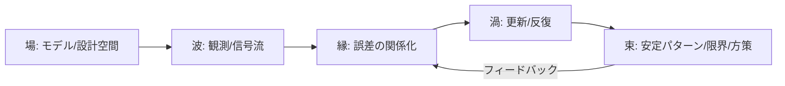

# D07 工学・情報科学 Step 7 レビュー報告書

## エグゼクティブサマリー

本レビューは、依頼ファイル相当の **REQ-GPT-20260228-002_d07-review.md** と、レビュー対象である **evidence-D07-engineering.md（EV-D07）** を読み込み、(1) 工学・情報科学の「確立された事実」レイヤ（[P]）の正確性、(2) 牽強付会（類推の飛躍）リスク、(3) 見落とし、(4) 領域レポート（L-1〜L-5）の質、(5) 信頼度スコア（confidence）の妥当性、の観点で精査したものです（「詳細レビュー（デフォルト）」として、検証・改善提案を厚めに記載）。

総合評価として、EV-D07は「誤差（error）を駆動力とする工学的メカニズム」を軸に、制御・通信・学習・最適化・セキュリティまでを一貫して配置しており、領域横断の説明力が高いです。特にフィードバック制御とPIDの普及・役割の記述は、一次寄りの権威ある文献とも整合します。citeturn0search0turn0search4 一方で、**[P]層としては修正必須（P0）**に相当する「断定が強すぎる／分類が誤解を招く」箇所が複数見られ、放置するとDB全体の信頼性（confidence）や、後続の比較ドメイン（他D領域）との整合性に影響します。

P0（必ず修正）として最も重要なのは次の3点です。

- **EV-D07-003（TCP輻輳制御）の「BBRもAIMD原理を共有」という記述**は不正確です。BBRは損失ベース（Reno/CUBIC等）とは異なる「モデルベース」の輻輳制御として仕様化・議論されています。citeturn0search14turn12search1  
- **EV-D07-010（量子鍵配送QKD）の「無条件安全」断定**は、理論（理想化）と実装（現実）の区別を曖昧にします。BB84の安全性証明は存在する一方、実装攻撃・前提条件の破れに関する指摘が公的機関・専門コミュニティから継続的に出ています。citeturn5search10turn5search3turn5search35turn5search15  
- **EV-D07-004（誤差逆伝播）の「1986年に提示」表現**は、一般読者には「初出」を意味しうるため、1970年代の先行（Werbos）と、1986年の普及・再提示（Rumelhartら）を分けて書くのが安全です。citeturn1search19turn1search2  

上記P0を反映し、さらに「用語定義・スコアの根拠・設計者バイアスの扱い」を整備すれば、EV-D07は **“研究メモ” から “査読可能な論拠DB”** に近づきます。現状の総合評点（レビュー観点の平均的見立て）は **B（有用だが、P0修正後にA帯が狙える）** です。confidenceは、現状の数値（0.75〜0.95）を維持するなら、**算出根拠（何を満たすと何点か）** を最小限でも明示する必要があります。

## 対象ファイルとレビュー前提

対象は次の2ファイルです。

- REQ-GPT-20260228-002_d07-review.md（レビュー依頼・観点定義）
- evidence-D07-engineering.md（論拠DB本体：EV-D07、10エントリ＋領域レポートL-1〜L-5＋クロスリファレンス）

前提として、目的・読者・納期・レビュー深度の指定がないため、依頼文の意図（工学・情報科学の専門的正確性を中心に、P0/P1/P2で改善提案）を満たす「詳細レビュー」を標準にしました。

また、ユーザー要望に沿い、**ファイル種別が未指定の場合のレビュー方針**も明示します（今回対象はMarkdown文書でした）。

- **テキスト文書（報告書・論文・企画書）**：主張→根拠→結論の論理線、引用の一次性、定義・前提の明示、一貫した用語・記法、反証可能性（検証手順）を重点確認。  
- **スライド**：1枚1メッセージ、ストーリーライン、図の自明性、口頭説明に依存しすぎない注記、参考文献スライドの充実度を確認。  
- **コード**：可読性（命名・責務分割）、再現性（実行手順・依存管理）、安全性（秘密情報の混入）、テスト方針（単体・統合）を確認。  
- **データシート（CSV/表）**：スキーマ定義、欠損・外れ値、集計の再現手順、列の意味と単位、加工履歴（データリネージ）を確認。  
- **画像**：説明文・凡例・出典、解像度、誤解誘発（軸欠落・歪曲）を確認（必要に応じて図表化や再作図を提案）。

## セクション別の要点抽出

以下は、REQとEV-D07を「セクション単位」で要点化し、どこが強みでどこが修正ポイントかを俯瞰できるようにした表です。

| ファイル / セクション | 要点（何を言っているか） | 主な [P] 主張（要約） | 5段階対応の核（要約） | 主要リスク / 改善余地（優先度） |
|---|---|---|---|---|
| REQ / レビュー観点 | 5観点で各エントリ＋領域レポートを評価し、P0/P1/P2で指摘する枠組み | 「工学・情報科学の確立事実として誤りがないか」を最重要視 | 類推や見落としも同時に評価する設計 | 観点ごとの**具体チェックリスト**を、参照元（標準・教科書・論文等）とともに固定化すると再現性が上がる（P1） |
| EV-D07-001 フィードバック制御 | D1（誤差駆動）との最も直接的対応として制御理論を提示 | フィードバック、PID、安定判別、カルマンフィルタ等の基礎は概ね妥当。PID普及率は権威文献に整合 citeturn0search0turn0search4 | 誤差→補正の閉ループを「波〜渦〜束」に割当 | 「PID＝D1/D2/D3」の対応は強いが、**比喩と同型（isomorphism）の線引き**を明確化すると説得力が上がる（P1） |
| EV-D07-002 PDCA | 組織スケールの改善循環としてPDCAを配置 | PDCAの起源・普及は概ね妥当（Shewhart→Demingの系譜）。ISO 9001がPDCAとプロセスアプローチを採る点は一次資料に整合 citeturn0search13turn8search1 | Checkを「縁」として計測・分析の位置づけ | 「ISO 9001でKPIが必須要件」等、規格の言い方を**過度に断定**すると[P]誤認になり得る（P0） |
| EV-D07-003 TCP輻輳制御 | 分散フィードバックの代表例としてAIMDを配置 | Jacobson起源とAIMD系の説明は標準仕様・原典に整合 citeturn12search8turn12search1turn1search1 | 損失/遅延→窓調整→公平性（束） | 「Reno/CUBIC/BBRがAIMD原理を共有」は誤解。BBRはモデルベースで別系統 citeturn0search14turn12search35（P0） |
| EV-D07-004 深層学習 | 誤差逆伝播＋SGDを誤差駆動の成功例として配置 | 逆伝播の1986論文は重要だが、先行（Werbos等）と「普及」を区別すべき citeturn1search19turn1search2。Transformer/ResNet等の年代表は一次論文に整合 citeturn6search0turn6search1turn6search6turn6search7 | 損失（縁）→勾配（波）→更新（渦）→表現（束） | 「成功要因」の断定（データ＋GPU等）は簡略化しすぎる恐れ。複数因子として書く（P1） |
| EV-D07-005 情報理論 | 容量（束）を「限界」の定式化として配置 | Shannonの符号化定理・容量概念は一次論文に整合 citeturn2search4 | ノイズと冗長性を縁として扱い、束を先に置く | 「束が先に定義される」特殊性は洞察的。反復復号の有無で渦が変わる点は良い自己批判（P1） |
| EV-D07-006 圧縮センシング | 欠損観測→復元をD1の数学的比喩として配置 | Donoho/Candèsらの枠組みは概ね妥当 citeturn2search1turn2search13 | スパース仮定（場）＋制約（縁）＋最適化（渦） | 「Nyquist基準より少ない観測」という言い方は、サンプリング定理との関係を誤解させ得る。条件付きで明確化（P0） |
| EV-D07-007 強化学習 | TD誤差・探索活用を縁として配置 | RLの標準教科書・TD学習・ドーパミン仮説・RLHFの代表論文に整合 citeturn2search6turn7search0turn7search1turn7search7 | 探索/活用の分岐を縁、方策更新を渦 | バンディット（UCB/Thompson）と一般RLの関係を一言補うと誤解が減る（P2） |
| EV-D07-008 進化的計算 | 自然選択の工学的再実装として配置 | NFL定理の存在は一次論文に整合 citeturn4search5 | 選択圧を縁、世代更新を渦 | Schema theorem等は「理論的基盤」と言い切ると議論を呼びうるため、位置づけを調整（P1） |
| EV-D07-009 リファクタリング | 技術的負債・スメル→構造改善の循環を配置 | リファクタリング定義や技術的負債の出典は概ね妥当 citeturn3search14turn3search12turn3search9 | 閾値判断を縁、TDD循環を渦 | 「コードスメル22種類」など、数を断定するより「代表例」に寄せると安全（P2） |
| EV-D07-010 暗号と鍵交換 | 敵対的環境下での安全な通信路構築として配置 | DH/RSA/TLSの基礎は一次資料・RFCと整合 citeturn2search3turn5search1turn5search0 | 認証境界を縁、安全な通信路を束 | QKD「無条件安全」の断定は理論と実装を混同しやすい（P0） citeturn5search10turn5search3turn5search35turn5search15 |
| 領域レポート L-1〜L-5 | D07全体の特徴（誤差駆動、設計者バイアス、渦の弱い項目等）を整理 | 「設計された創造」と「自然の創造」を区別し、留保を置く点が良い | D1との強い対応を領域結論に据える | 「30領域中で最も直接」等、比較主張は根拠（比較軸）を明示すると堅牢（P1） |
| クロスリファレンス | 5段階と主要エントリを対応づけ一覧化 | 参照性が高く、読者の探索を助ける | ナビゲーション用途 | 各リンク先の“なぜ代表なのか”を1行注記するとさらに良い（P2） |

## 問題点の指摘と根拠

### 正確性の問題

EV-D07全体は概ね教科書的記述に寄っていますが、以下は**[P]として誤認・誤解を誘発しうる**ため、優先修正が必要です。

**TCP輻輳制御：BBRの位置づけ（P0）**  
原文では、次のように記されています。

> 「TCP Reno/Cubic/BBR等の変種が並存。各アルゴリズムは…異なるが、AIMD原理を共有」  
> （evidence-D07-engineering.md: L0112）

RenoやCUBICが損失ベースの輻輳制御（典型的にAIMD系）として説明されることは、標準仕様RFCにも現れます。citeturn12search1 一方、BBRはIETFのドラフト文書でも「loss-based（Reno/CUBIC）と異なるアプローチを取る model-based algorithm」として明確に述べられており、同列に「AIMD原理を共有」とするのは不正確です。citeturn0search14turn12search35  
この誤りはD07-003の中心価値（分散フィードバックの説明）自体を損なうため、P0です。

**圧縮センシング：「Nyquist基準より少ない観測」（P0）**  
原文（要旨）は「Nyquist基準より少ない観測数から厳密復元」としています（evidence-D07-engineering.md: L0228）。圧縮センシングが「スパース性等の構造仮定＋適切な測定設計」によって少数観測で再構成可能であることは、Donohoらの一次論文と整合します。citeturn2search1turn2search13  
ただし「Nyquist基準」という語は、読者に「帯域制限信号のサンプリング定理を破る」と誤解させやすいので、**“何をNyquistと呼んでいるのか（時間サンプリングか、一般線形測定か）”**を明確化するのが安全です。ここは表現修正（P0）が妥当です。

**深層学習：逆伝播の“初出”誤解（P0寄り）**  
原文は「誤差逆伝播が提示された（1986）」と書きます（evidence-D07-engineering.md: L0149）。1986年の論文が逆伝播の普及・再定式化に決定的だった点は確実ですが、1974年のWerbosの博士論文など先行があるため、「初出」と読める言い方は避けるのが無難です。citeturn1search19turn1search2  
DBの性格上、「歴史的起点」を丁寧に書くほど、[P]層の堅牢性が上がります。

**暗号：QKD（BB84）の「無条件安全」断定（P0）**  
原文は「BB84：量子力学に基づく無条件安全」と断定します（evidence-D07-engineering.md: L0390）。BB84の安全性証明（例：Shor–Preskill）は確かに存在します。citeturn5search10  
しかし、(a) 前提（理想デバイス、認証された古典チャネル等）を満たす必要、(b) 実装攻撃が証明の仮定を破ると安全性保証が失われる点は、NISTの技術レポートや各国当局・専門家レビューでも繰り返し指摘されています。citeturn5search3turn5search35turn5search15turn5search19  
したがって「理論上は（仮定の下で）情報理論的安全性が示されるが、実装では別問題」と二層化して書くべきです。

### 一貫性の問題

**スコア（confidence）と“Accept”の基準が暗黙**  
EV-D07は各エントリに confidence（例：0.75〜0.95）を付与し、領域レポートで“Accept 10件、CA 0件”と総括しています（evidence-D07-engineering.md: 領域レポート L-2周辺）。しかし、confidenceの算出根拠が本文内で定義されないまま数値が提示されると、読者は「主観スコア」と受け取りやすくなります。

改善案は、少なくとも次を明示することです。

- confidence = **(Pの真偽確度)** と **(対応の妥当性)** を混ぜた値なのか、分離しているのか  
- “Accept/CA” の判断に使った閾値（例：Pが要修正ならCA、など）

この整備はP1ですが、DB運用上の効果が大きいです（後続の横断比較・自動評価に効く）。

**用語の粒度がエントリごとに揺れる**  
「誤差」「ノイズ」「予測誤差」「損失」「負債」など、類似概念が多く登場します。D07の強みは“誤差駆動”の一貫性なので、冒頭に**簡易グロッサリ（1〜2行定義）**を置くだけで、読者の理解コストが大きく下がります（P1）。

### 論理性の問題

**「同型（構造対応）」と「比喩（説明方便）」の線引きが章によって異なる**  
EV-D07は、制御・学習・情報理論など、厳密な数式構造がある領域と、リファクタリング等の実践知領域を同じフォーマットで並べます。これは良い設計ですが、読者は「すべて同レベルの“数学的同型”」だと誤解しうるため、各エントリの先頭に次のようなラベルを追加すると論理が安定します。

- **厳密（数学的定義あり）**：制御、情報理論、圧縮センシング（条件付き）、暗号（安全性定義の前提付き）  
- **計算的（アルゴリズム定義あり）**：深層学習、強化学習、GA  
- **実務的（規範・経験則）**：PDCA、リファクタリング

この「分類の明示」は牽強付会チェック（観点2）の説明責任を軽くします。

### スタイル・日本語表現の問題

**一次性の高い出典の提示方法が揺れる**  
例えば制御では権威ある教科書・論文を挙げていますが、同じ粒度で規格（ISO 9001）やRFC（ネットワーク標準）を扱う際、**どれが一次（仕様・原論文）で、どれが解説か**を区別すると、レビュー耐性が上がります。ISO 9001やTLS、TCP輻輳制御は「仕様」が一次になります。citeturn0search13turn5search0turn12search1

### 機密性・個人情報の扱い

EV-D07には個人情報は見当たりませんが、**作成経緯（内部プロセス名・評価フロー）**がメタデータに含まれます。外部共有の可能性があるなら、由来・担当の粒度を落とした「公開版メタデータ」を別に用意するのが安全です（P2）。

## 具体的な修正案

以下は「差分例（修正案）」です。原文の意図を残しつつ、[P]としての正確性・読みやすさ・一次資料整合性を上げる方向で提案します。

### EV-D07-003：BBRとAIMDの関係を是正（P0）

```diff
- - [P] TCP Reno/Cubic/BBR等の変種が並存。各アルゴリズムは輻輳信号の解釈と窓調整戦略が異なるが、AIMD原理を共有
+ - [P] TCPの輻輳制御には複数の系統がある。RenoやCUBICは主にパケット損失を輻輳シグナルとして扱う損失ベース（AIMD系）の代表例。一方BBRは、配送レートとRTT等の観測からネットワーク経路のモデルを推定して送信を制御するモデルベースの方式であり、損失ベースAIMDとは設計思想が異なる
```

根拠：BBRはIETFドラフトでも「loss-based（Reno/CUBIC）と異なるアプローチの model-based algorithm」として記述されます。citeturn0search14turn12search35  
この修正により、エントリの価値（集中制御 vs 分散制御の比較）がむしろ増します。

### EV-D07-010：QKD「無条件安全」を二層化（P0）

```diff
- - [P] 量子鍵配送（QKD, BB84プロトコル, Bennett & Brassard 1984）: 量子力学の原理に基づく無条件安全な鍵配送。盗聴が物理的に検出可能
+ - [P] 量子鍵配送（QKD, BB84等）: 理想化したプロトコル仮定の下では情報理論的安全性が証明されている。一方で実装はデバイスの不完全性や実装攻撃の影響を受けうるため、「理論上の安全性」と「実装上の安全性（運用・対策込み）」を区別して評価する必要がある
```

根拠：BB84の安全性証明は存在する一方、実装攻撃や前提破れは公的機関・レビュー論文でも論点化されています。citeturn5search10turn5search3turn5search35turn5search19  
これにより、D07-010自身が「敵対的環境」を扱う論拠として、より誠実になります。

### EV-D07-004：逆伝播の歴史記述を安全化（P0寄り）

```diff
- - [P] 多層ニューラルネットワークに対し、出力誤差を減少させるための結合重み反復調整として誤差逆伝播（backpropagation）が提示された（Rumelhart, Hinton & Williams 1986 Nature）
+ - [P] 多層ニューラルネットワークの学習では、誤差を各層の勾配として効率よく計算する逆伝播（バックプロパゲーション）が中核となる。1970年代に基礎となるアイデアが提案され、1986年の論文で広く普及・再定式化された
```

根拠：Werbosの1974年博士論文などの先行と、1986年論文の影響を併記するのが歴史記述として堅牢です。citeturn1search19turn1search2

### EV-D07-006：「Nyquist」表現を条件付きに（P0）

```diff
- - [P] 信号のスパース性を利用し、Nyquist基準より少ない観測数から信号を厳密復元できる
+ - [P] 信号がスパース（または圧縮可能）で、測定設計が適切な条件下では、信号次元より少ない回数の一般線形観測からでも復元が可能になる（圧縮センシング）。「どの意味でのサンプリング制約を下回るのか（時間サンプリングか、一般線形測定か）」を明示する
```

根拠：圧縮センシングは「少数の一般線形測定＋非線形復元」で測定回数を削減できる枠組みとして説明されます。citeturn2search1turn2search13

### EV-D07-002：ISO 9001とKPIの言い方を規格寄りに（P0）

```diff
- - [P] ISO 9001品質マネジメントシステムの中核原理として国際標準化。KPI計測と標準化文書化が必須要件
+ - [P] ISO 9001:2015は、プロセスアプローチをPDCAサイクルおよびリスクベース思考と組み合わせて品質マネジメントシステムを運用する枠組みを示す。運用にあたっては監視・測定・評価と「文書化された情報」の管理が重要になる（指標は組織の目的・品質目標と整合する形で定める）
```

根拠：ISO 9001がPDCAとプロセスアプローチを組み合わせる旨は規格本文（導入部）に明記されています。citeturn0search13  
“KPI必須”を規格本文の語彙に寄せることで、[P]の安全性が上がります。

## 優先度付きの改善タスクリスト

推定工数は「調査＋修正文＋相互参照更新」まで含む目安です。担当想定はロール（専門性）で置いています。

| 優先度 | タスク | 期待効果 | 推定工数 | 担当想定 | 依存関係 |
|---|---|---:|---:|---|---|
| P0 | EV-D07-003：BBRをAIMDと同一視しない形に修正 | [P]誤認防止、ネットワーク領域の信頼性回復 | 1.5〜3h | ネットワーク/Transport担当 | RFC/BBR参照追加 |
| P0 | EV-D07-010：QKD「無条件安全」を理論/実装で二層化し、注意書きを追加 | セキュリティ領域の誠実性向上、誤用防止 | 2〜4h | 暗号/セキュリティ担当 | NIST/ANSSI/NSA等の引用整理 |
| P0 | EV-D07-006：「Nyquist」表現を条件付きに書換 | サンプリング定理との混同回避 | 1〜2h | 信号処理/数理担当 | 圧縮センシングの定義文追記 |
| P0 | EV-D07-004：逆伝播の歴史表現を修正（先行＋普及の分離） | “初出”誤解の解消、学術的堅牢性UP | 1〜2h | ML担当 | Werbos/1986論文のrefs追記 |
| P1 | confidence算出根拠（最小スキーマ）を追記 | DBの査読可能性・再現性UP | 2〜5h | DB運用/編集担当 | 既存エントリのスコア再点検 |
| P1 | 用語グロッサリ（誤差/ノイズ/損失/予測誤差/負債）を冒頭に追加 | 読解コスト低減、用語揺れ抑制 | 1〜2h | 編集担当 | なし |
| P1 | 「厳密/計算的/実務的」ラベルを各エントリに付与 | 牽強付会評価の透明性UP | 2〜4h | 領域オーナー | 既存タグ整理 |
| P2 | クロスリファレンスに“代表理由”を1行注記 | ナビゲーション性UP | 1〜2h | 編集担当 | なし |
| P2 | 公開版メタデータ（作成経緯の粒度調整）テンプレ追加 | 外部共有時の情報管理改善 | 1〜3h | 運用担当 | 公開範囲ポリシー |

## 図表とフローチャート

### エントリレビューの最小プロセス

```mermaid
flowchart TD
  A[エントリの抽出] --> B[[P]主張の列挙]
  B --> C{一次資料で確認できるか}
  C -- はい --> D[P層: 問題なし/要修正/要議論]
  C -- 一部/難しい --> E[不確実性を明記し「条件付き」に書換]
  D --> F[[M]対応の評価]
  E --> F
  F --> G{牽強付会リスクは許容か}
  G -- 低/中 --> H[残す: 対応根拠と限界を追記]
  G -- 高 --> I[対応の弱体化 or エントリ再配置]
  H --> J[confidence再評価]
  I --> J
  J --> K[領域レポート(L-1〜L-5)へ反映]
```

### D07における「誤差駆動」一般形



この図は、制御（PID）、学習（SGD/TD）、通信（輻輳制御）などで「縁→渦→束」が反復し、束の安定性・限界が理論化されうる点を表します（ただし暗号のように“渦”がセッション維持として弱いケースもあり得ます）。

## 参考にした主要ソース

一次資料・公式資料を優先し、必要に応じて公的機関資料・査読論文・標準仕様を併用しました。

- PIDの普及率・位置づけ（「90%以上」系の代表的根拠）：Åströmの概説論文およびPID関連章。citeturn0search0turn0search4  
- ISO 9001:2015 がプロセスアプローチとPDCAを組み合わせる旨（規格本文）。citeturn0search13  
- TCP輻輳制御（標準仕様）と、AIMDの位置づけ：RFC 5681。citeturn12search1  
- TCP輻輳制御の原典：Jacobson（SIGCOMM 1988）。citeturn12search8  
- AIMDの効率・公平性収束の理論的検討：Chiu & Jain（1989）。citeturn12search10  
- BBRの性格（loss-basedと異なるmodel-based）：IETFドラフト（BBR仕様）および評価研究。citeturn0search14turn12search35  
- 逆伝播の普及に決定的な1986年論文：Nature掲載論文。citeturn1search2  
- 逆伝播の先行（1970年代）：Werbosの博士論文。citeturn1search19  
- 深層学習の代表的マイルストーン（AlexNet, Transformer, ResNet, BatchNorm）：各一次論文。citeturn6search0turn6search1turn6search6turn6search7  
- 情報理論の基礎（通信路容量・符号化定理）：Shannon 1948原論文。citeturn2search4  
- 圧縮センシング（基礎論文・概説）：Donoho 2006、および専門コミュニティによる解説。citeturn2search1turn2search13  
- 強化学習の標準的教科書：MIT Pressの書誌情報。citeturn2search6  
- TD学習の原典：Sutton 1988。citeturn7search0  
- ドーパミン報酬予測誤差仮説の代表論文：Schultzら（Science 1997）。citeturn7search1  
- RLHFを明示する代表論文：InstructGPT（Ouyangら）。citeturn7search7  
- リファクタリング定義（公式解説）：Martin Fowlerの定義ページ。citeturn3search14  
- 技術的負債の由来（一次に近い公開資料）と整理：Ward CunninghamのOOPSLA’92文書、およびFowlerの整理。citeturn3search12turn3search9  
- 公開鍵暗号の方向性（DH）とRSA原論文：DH原論文、RSA原論文。citeturn2search3turn5search1  
- TLS 1.3（標準仕様の要約定義）：RFC 8446。citeturn5search0  
- BB84の安全性証明（理論）と、実装上の脆弱性（公的機関・当局見解・サーベイ）：Shor–Preskill、NIST IR、ANSSIポジション、NSA見解、Opticaサーベイ。citeturn5search10turn5search3turn5search35turn5search15turn5search19