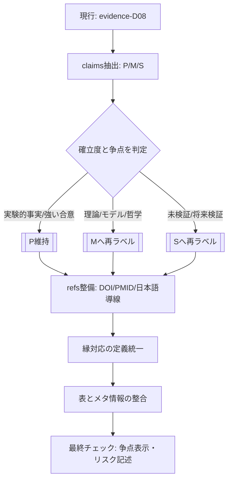

# D08 神経科学論拠DBレビュー報告書

## エグゼクティブサマリー

本レビューは、提供された2ファイル（`evidence-D08-neuroscience.md` と `REQ-GPT-20260301-001_d08-review.md`）を対象に、指定の観点（[P]層の正確性、5段階対応の牽強付会チェック（特に「縁」）、見落とし、領域レポート品質、信頼度スコアの妥当性）を含めて、実務的に修正可能な形で指摘と改善案をまとめたものです。（REQ-GPT-20260301-001_d08-review.md L5-L16）（evidence-D08-neuroscience.md L1-L10）

前提として、ユーザー側からは「対象読者・目的・締切・利用シーン（社内/社外・学術/実務）」が明示されていません（未指定である旨を明記します）。一方、こちらで確認できた範囲ではMarkdown形式のファイル2点で、論拠DB本体は約742行・11エントリ構成です。（evidence-D08-neuroscience.md L1-L10）本レビューでは、本文の宣言（「神経科学的事実[P]は“根拠”ではなく“対応物”」）を尊重しつつ、**“確立度の表示”が読者誤解を生まないこと**を最重要として評価しています。（evidence-D08-neuroscience.md L16-L18）

結論として、当該ファイルは「テンプレート化された11エントリ＋領域レポート＋クロス参照」という設計が強く、トレーサビリティ（どの理論がどの概念を支えるか）を管理できる土台は非常に良いです。（evidence-D08-neuroscience.md L38-L634, L635-L742）一方で、最大の改善余地は、**[P]（実験的事実・確立理論）に、理論枠組み・仮説・哲学的主張・比喩が混在している点**です。特に「予測処理/自由エネルギー」「意識理論（GNW/IIT）」「構成主義情動」「ポリヴェーガル」「4E/エナクティヴィズム」「CTC」「クリティカリティ」は、一次文献上も“理論として提示”される性質が強く、[P]で断言するとレビュー要件（神経科学の確立事実として正確か）と衝突しやすいです。（evidence-D08-neuroscience.md L16-L18, L38-L315）citeturn0search0turn13search3turn7search1turn4search0turn2search14

**問題点一覧（要点のみ）**

- **[P]ラベルの運用が“確立度の過大表示”に見える箇所がある**（理論・仮説・哲学的主張の混入）。最優先でラベル再定義/再ラベルが必要です。（evidence-D08-neuroscience.md L16-L18, L38-L315）citeturn13search3turn0search0turn7search0turn7search1turn4search0  
- **反応抑制の神経基盤の記述が単純化されすぎ**で、専門家レビューで突っ込まれやすい（Stop-signal等は右下前頭回・前補足運動野・基底核/視床下核などネットワークで語られることが多い）。（evidence-D08-neuroscience.md L220-L224）citeturn6search2turn6search19turn6search18  
- **ポリヴェーガル理論は“議論中”をより前面に**出すべき（批判と反論が並走しており、[P]断言はリスク）。（evidence-D08-neuroscience.md L375-L379, L688-L689）citeturn2search14turn2search6turn2search12  
- **図表整合性の不一致（スコアカード）**：フロントマターの“縁フラグ件数”が本文表と一致していません（🔴が1件過大）。（evidence-D08-neuroscience.md L9, L706-L718）  
- **引用・出典は骨格があるが検証性が弱い**：DOI/PMID/URL不足、争点理論の批判文献不足があり、一次資料優先運用に向けて改善余地が大きいです。（evidence-D08-neuroscience.md L65-L74, L368-L379, L579-L589）citeturn0search0turn2search14turn11search0turn7search0turn9search0  

## 前提とレビュー範囲

レビュー対象は次の2ファイルです。

- 論拠DB本体：`evidence-D08-neuroscience.md`（11エントリ＋領域レポート＋クロス参照）（evidence-D08-neuroscience.md L1-L10, L38-L634, L635-L742）
- レビュー要件：`REQ-GPT-20260301-001_d08-review.md`（観点・注意事項）（REQ-GPT-20260301-001_d08-review.md L5-L16, L36-L40）

ユーザー要件として、**ファイル形式・種類・分量・対象読者・目的・締切が未指定**です（その旨を明記）。一方、こちらで確認できた範囲ではMarkdown形式で、本体は約742行、`entry_count: 11` の構成です。（evidence-D08-neuroscience.md L1-L10）

不明点（レビュー上、仮定を置いて判断したもの）

- 対象読者：研究者 / エンジニア / PM / 一般のどれか（本レビューでは「専門家が見ても反論されにくい表現」を優先）
- 文書の目的：社内DB（設計参照枠）か、外部公開か（本文の「根拠ではなく対応物」から、社内参照枠想定で評価）。（evidence-D08-neuroscience.md L18）
- 締切：未指定（修正優先度と工数見積により、1〜2週間の短期スプリント運用を想定）
- [P]に含める「確立理論」の閾値：領域差が大きく、ここが最大の論争点になり得ます。（evidence-D08-neuroscience.md L16-L18）

レビューで採用した前提（明示）

- [P]は凡例通り「実験的事実・確立理論」を指すものとして、[P]の断言度を厳しめに点検します。（evidence-D08-neuroscience.md L16-L18）（REQ-GPT-20260301-001_d08-review.md L12-L13, L38-L40）
- 5段階対応は“モデルとして許容”しつつ、恣意性（特に縁）を下げるために「観察可能な操作変数（例：ゲーティング、切替、結合則）」へ落とす改善を提案します。（REQ-GPT-20260301-001_d08-review.md L13-L16, L27-L32）

## 全体構成と要点

本体ファイルはメタデータ（file_id, last_updated, entry_count, scorecard）に続き、全体概要と方法論的原則（「指し示すだけ」「神経科学的事実[P]は参照枠であり“根拠”ではなく“対応物”」）を宣言し、その後に領域概観（L-1）→11エントリ（D08-001〜011）→領域レポート（対応密度・スケール横断・洞察・保持論点）→クロス参照表、という構成です。（evidence-D08-neuroscience.md L1-L22, L24-L37, L38-L634, L635-L742）

各エントリはテンプレートが統一されており、flags/layer/triage、claims、5段階対応、縁フラグ、mechanism_type、scale、牽強付会リスク、supports、refs、confidence、Issue番号、そして「類似/独自/学び/文脈/判断」の小節で構成されています。（例：evidence-D08-neuroscience.md L38-L77, L78-L100）

セクション要点（要旨）

- L-1：神経科学における創造を「計算論」「生理」「身体・情動」の三層で概観し、5段階との接続を宣言。（evidence-D08-neuroscience.md L24-L35）
- D08-001：予測処理/自由エネルギー（計算論の核）。（evidence-D08-neuroscience.md L38-L102）
- D08-002：内受容と内受容的推論（身体状態→自己感・情動）。（evidence-D08-neuroscience.md L103-L156）
- D08-003：情動の構成理論（評価・概念・身体信号の統合）。（evidence-D08-neuroscience.md L157-L212）
- D08-004：実行機能・認知制御（抑制/葛藤・評価）。（evidence-D08-neuroscience.md L213-L263）
- D08-005：意識理論（GNW/IIT等）＋DMN。（evidence-D08-neuroscience.md L264-L315）
- D08-006：睡眠・夢（内部生成モデル、記憶再生）。（evidence-D08-neuroscience.md L316-L367）
- D08-007：ポリヴェーガル理論（安全感・社会的関与）。（evidence-D08-neuroscience.md L368-L418）
- D08-008：身体化/4E・エナクティヴィズム（脳-身体-環境）。（evidence-D08-neuroscience.md L419-L473）
- D08-009：可塑性・STDP（生理学的基盤）。（evidence-D08-neuroscience.md L474-L526）
- D08-010：θ-γカップリング/CTC（同期と通信）。（evidence-D08-neuroscience.md L527-L578）
- D08-011：神経雪崩・臨界（複雑系、CA扱い）。（evidence-D08-neuroscience.md L579-L634）
- L-2〜L-5：対応密度、スケール横断、洞察、保持論点。（evidence-D08-neuroscience.md L635-L690）
- クロスリファレンス：D1-D4、5段階×エントリ、4層、他ドメイン接続。（evidence-D08-neuroscience.md L693-L742）

## 技術的検証

本セクションは、(a) [P]層の正確性、(b) 牽強付会（特に縁）、(c) 見落とし、(d) 領域レポート品質、(e) 信頼度スコア妥当性、(f) 内部矛盾（表/メタ情報）をまとめて検証します。（REQ-GPT-20260301-001_d08-review.md L12-L16）

**事実性と確立度の総評**  
[ P ]凡例が「実験的事実・確立理論」なのに対し、claimsには（一次文献上も）理論として提示される枠組み・仮説・哲学的立場が混在しています。これにより、専門家には「確立度の過大表示」に映りやすく、非専門家には「確定事項」と誤認されやすい、という二重リスクが生じます。（evidence-D08-neuroscience.md L16-L18, L38-L315）citeturn0search0turn13search3turn7search0turn7search1turn4search0

**データ比較（主張ラベル見直し・文言修正の推定件数）**  
以下の図は、各エントリの[P]主張数、レビューとして提案する「[P]→[M]等の再ラベル」「文言の精密化（主に解剖学的・因果表現）」の推定件数です。推定は、各エントリのclaims行を抽出し、「一次文献が理論/仮説として提示」「争点が明確」「断言表現が強い」ものを再ラベル候補としてカウントしました。（evidence-D08-neuroscience.md L38-L634）citeturn13search3turn0search0turn7search0turn2search14turn10search3


**エントリ別レビュー要点（要点・牽強付会・信頼度）**（evidence-D08-neuroscience.md L38-L634, L706-L720）

| エントリ | セクション要点 | [P]主張の主な問題 | 5段階対応と「縁」の牽強付会リスク | 推奨信頼度 | 一次資料例 |
|---|---|---|---|---|---|
| D08-001 予測処理・自由エネルギー | 予測誤差最小化で知覚・行動・学習を統一する計算論的枠組み | 「脳は階層的ベイズ推論」「FEPは統一原理」等が“確立事実”として読まれ得る（理論位置づけ明記が必要） | 縁＝precision重みづけは筋が良いが、制御パラメータへの還元に見える危険 | 中〜高（理論として） | citeturn0search0turn0search1turn0search2turn0search3turn13search3 |
| D08-002 内受容と推論 | 内受容感覚と情動・自己感、内受容的推論 | 内受容的推論やself-modelが[P]で断言（枠組み提示に留めるのが安全） | 縁＝統合は妥当。操作変数（予測誤差/精度/島・ACC活動）へ落とすと非恣意性が上がる | 中 | citeturn3search4turn3search1turn3search6turn3search21turn1search9 |
| D08-003 情動の構成 | 情動を構成過程として扱い、評価・身体・概念の統合を強調 | 構成主義情動、ソマティック・マーカー、脅威＝扁桃体中心は論争領域（“学派の主張”として再ラベル推奨） | 縁＝カテゴリ化/評価の境界形成は筋が良いが、競合理論も併記したい | 中 | citeturn4search0turn5search1turn5search9turn4search2 |
| D08-004 実行機能と制御 | 葛藤検出→抑制→評価の協働で抱持を説明 | dlPFC＝反応抑制中心は言い過ぎ。Stop-signal等はネットワーク知見を反映すべき | 縁＝抑制は直感的。縁を「境界に留まる/ゲーティング」と再定義すると恣意性が下がる | 中（現状と整合） | citeturn6search0turn6search1turn6search2turn6search19turn15search1 |
| D08-005 意識とワークスペース | 意識理論（GNW/IIT等）とDMNを束ねる | GNW/IIT/controlled hallucinationは理論。Φ“相関”の断言は危険。DMNは概ね妥当だが方法論争もある | 縁を弱め（⚪）にした設計は妥当。ただし“弱い理由”の短文化があると良い | 中 | citeturn7search0turn7search1turn7search2turn7search3turn12search3 |
| D08-006 睡眠・夢 | 夢を内部モデル活動として捉え、記憶再生/更新を議論 | 「予測的処理が作動」等は推論が入るため、根拠（REM時DMN等）との距離を明記したい | 縁＝外界遮断下の整合性形成は面白いが、観察可能因子（再活性化/リプレイ）強調で堅牢化 | 中（現状と整合） | citeturn8search0turn8search2turn8search15turn8search3 |
| D08-007 ポリヴェーガル | 安全感→社会的関与→抱持前提条件を提示 | 自律神経3段階・進化論的主張は強い争点。本文に批判言及はあるがclaims側は緩めたい | 縁＝社会的関与は概念的に合うが、縁🔴で強く押すと逆効果になり得る | 低〜中 | citeturn2search14turn2search6turn2search12 |
| D08-008 4E・エナクティヴィズム | 脳-身体-環境の不可分性を提示 | 4E/エナクティヴィズム/オートポイエーシスは哲学・理論枠組みであり“神経科学の確立事実”としての[P]は不適切 | D08領域に置くなら神経科学的操作変数（ネットワーク/身体指標）との接続を増やす | 中（枠組みとして） | citeturn14search4turn14search5turn14search3 |
| D08-009 可塑性・STDP | LTP/STDP/メタ可塑性で学習の生理学的基盤を提示 | [P]として概ね適切。STDPが可塑性“全てではない”も妥当 | 縁＝タイミング窓（◎）は解釈として明快で強い | 高 | citeturn9search0turn9search1turn9search2turn9search3 |
| D08-010 θ-γ・CTC | 位相同期/位相-振幅カップリングと通信・記憶の関係 | CTCは一次文献でも仮説。claimsの[P]は“仮説”明記推奨 | 縁＝同期/ゲーティングは筋が良いが因果は議論中の旨を前面に | 中 | citeturn10search3turn10search1turn10search2turn10search0 |
| D08-011 神経雪崩・臨界 | べき則・分枝比・臨界最適性で“場”を論じる（CA） | べき則同定は一次文献あり。ただし「情報伝達最適化」は仮説寄りで[P]断言は避けたい | D29との差分を本文冒頭でより早く明示するとCAが理解されやすい | 中（現状と整合） | citeturn11search0turn11search1turn11search14turn11search7 |

**見落とし（補完候補）**  
現行11エントリは5段階の“構造対応”を作るには強いセットですが、創造性研究・ネットワークダイナミクス観点では、**サリエンス・ネットワーク（DMN⇄実行ネットワークのスイッチング）**、**報酬予測誤差（ドーパミンRPE）と探索/学習**を補うと、「縁＝切替/ゲーティング」の非恣意性を上げられる可能性があります。citeturn12search3turn12search0turn12search15turn12search14turn12search2

## 文章・表現・論理構成のレビュー

全体の論理は、「神経科学的事実・主要理論を“対応物”として配置して参照枠を作る」という宣言と整合しており、クロス参照表（D1-D4対応、5段階×エントリ、4層対応、他ドメイン接続）によってPM目線のレビュー可能性が高い点が強みです。（evidence-D08-neuroscience.md L14-L18, L693-L742）

読みにくさの主因は、内容量よりも「断言度の混在」です。理論枠組みまで[P]で列挙されると、“確立事実の箇条書き”として読まれやすく、本文が意図する「参照枠」からズレます。（evidence-D08-neuroscience.md L16-L18）

**書き換え例（差分）**  
意味を変えずに「断言度」「レビュー耐性」を上げる例として、D08-001とD08-007のclaimsの修正案を示します。（evidence-D08-neuroscience.md L44-L52, L375-L379）

```diff
- - [P] 脳は階層的ベイズ推論で予測誤差を最小化する（Rao & Ballard 1999, Friston 2010）
+ - [M] 予測処理（predictive processing）/自由エネルギーの枠組みでは、脳が階層的生成モデルに基づいて予測誤差（surpriseに関連）を低減するように知覚・行動を説明する
+   - 注：枠組みの射程（脳全体への一般化）や代替説明との比較は継続的に議論されている
```

一次文献が“理論として提示している”立場を忠実に反映する修正です。citeturn0search0turn13search3turn1search0

```diff
- - [P] 自律神経系は3段階構造 — 背側迷走神経（凍結・シャットダウン）、交感神経（闘争・逃走）、腹側迷走神経（社会的関与）（Porges 2011）
+ - [M] ポリヴェーガル理論では、自律神経反応を「背側迷走（不動化）」「交感（闘争/逃走）」「腹側迷走（社会的関与）」などの状態として整理する
+   - 注：迷走神経の機能分化や進化論的前提、RSA解釈については批判と反論が並走しているため、臨床・実務では“モデル”として扱う
```

批判と反論が併存する領域での“不確実性表示”を強化する修正です。citeturn2search14turn2search6turn2search12

**表現統一（軽微だが効果が大きい）**

- 初出時の英語併記ルール統一（precision/抱持/CTC/GNW/IIT/DMN等）。（evidence-D08-neuroscience.md L44-L52, L264-L279, L527-L536）
- 「confidence」と「信頼度」の重複表記を統一（どちらか一方へ）。（evidence-D08-neuroscience.md L75-L76, L90-L92）
- 「議論中」をメタ項目（例：`controversy: high/medium/low`）として外出しし、読者が冒頭で注意点を把握できるようにする。（evidence-D08-neuroscience.md L379-L389, L589-L604）

## 図表・データ・引用の妥当性

**図表/メタ情報の整合性**  
フロントマターのスコアカードが「縁🔴 5, 🟡 4, ⚪ 2」になっていますが、本文の対応表では🔴4件、🟡5件、⚪2件です。合計11は一致しているため、件数の入れ替わり（🔴と🟡）が発生しています。（evidence-D08-neuroscience.md L9, L706-L718）この不一致は後工程の自動集計でバグになりやすいので、scorecardを本文表から自動生成（または逆）へ寄せるのが安全です。（evidence-D08-neuroscience.md L1-L10, L706-L718）

**引用・出典の現状**  
refsは各エントリにあり、著者・年・誌名の骨格は概ね揃っています。（例：evidence-D08-neuroscience.md L65-L74）一方、一次資料優先運用の観点では、(1) DOI/PMID/URL不足、(2) 争点理論に対する批判文献不足、(3) 一部主張に対するrefs不足（例：抑制ネットワーク、DMN拮抗、臨界最適性など）が課題です。（evidence-D08-neuroscience.md L220-L224, L274-L276, L586-L588）citeturn6search2turn12search3turn11search14turn7search2turn2search14

**出典整備テンプレ案（一次資料優先に合わせる）**（REQ-GPT-20260301-001_d08-review.md L38-L40）

| 狙い | 追加する項目 | 例 |
|---|---|---|
| 検証性向上 | DOI/PMID/出版社/章情報 | STDP/LTPの代表論文にDOI付きで付与 citeturn9search0turn9search1 |
| 争点明確化 | supporting refs と critical refs の併記 | ポリヴェーガル：批判レビューと反論を同居 citeturn2search14turn2search12 |
| 日本語導線 | 日本語総説・辞典項目を1本追加 | 予測符号化/自由エネルギーの日本語解説 citeturn1search0 |

## 法的・倫理的リスク

本文は学術的整理ですが、内容が教育・臨床・組織開発に転用される可能性があります（本文中にも教育・臨床・組織論への含意が示唆）。その際、**不確実性が高い理論を“神経科学の確立事実”として提示すること**は、倫理的・レピュテーション上のリスクになり得ます。（evidence-D08-neuroscience.md L678-L679）

特にポリヴェーガル理論は臨床現場で流通する一方、迷走神経の解剖学的・進化論的前提やRSA解釈に対する批判があり、近年も批判・反論が継続しています。したがってclaims冒頭に[P]で断言すると、「科学的に確定した自律神経モデル」と誤認されやすい構図になります。citeturn2search14turn2search6turn2search12

同様に、意識理論（GNW/IIT）や構成主義情動は競合理論が共存する領域です。ここは「複数理論の位置づけ」と「本DBが採用する読み」を明記し、断言度を下げておくことが、倫理リスク（不確実性の適切表示）と実務リスク（後で覆った際の説明コスト）を下げます。citeturn7search0turn7search1turn4search0turn4search2

## 優先度付き修正リストと推奨スケジュール案

**優先度付き修正リスト（緊急度×工数）**（evidence-D08-neuroscience.md L16-L18, L38-L634）

| 優先度 | 修正項目 | 影響 | 推定工数 | 具体作業 |
|---|---|---|---|---|
| 緊急 | [P]運用基準の短文化＋再ラベル（特にD08-001/002/003/005/007/008/010/011） | 信頼性の根幹。誤解・反論リスクを直接下げる | 6〜10h | 「[P]=確立事実/確立理論」「[M]=理論枠組み/解釈」「[S]=検証可能仮説」を短文化し、claimsを整合 |
| 緊急 | スコアカードと本文表の一致（縁フラグ件数） | メタ情報のバグ除去 | 0.5h | 🔴/🟡件数を本文表に合わせて修正、または自動生成へ |
| 高 | D08-004 抑制系の記述をネットワーク表現へ更新 | 専門家レビューで刺さるリスクを低減 | 2〜4h | rIFG/preSMA/STN等を追記し、dlPFCは「目標維持/制御」に寄せる citeturn6search2turn6search19turn6search0 |
| 高 | 争点エントリにcritical refs追加（PVT/IIT/臨界など） | 倫理・対外説明の耐性増 | 3〜6h | refsを「支持/批判」に分け、議論中タグの根拠を明文化 citeturn2search14turn7search1turn11search14 |
| 中 | 見落とし補完の検討（サリエンス・ネットワーク/報酬予測誤差） | 縁対応の非恣意性が上がる | 4〜8h | 追加なら新規エントリ化（例：D08-012等）、統合ならD08-002/004/005へ接着 citeturn12search3turn12search14 |
| 中 | refsのDOI/PMID付与・書誌統一 | 再検証性の改善 | 3〜5h | DOI/PMID/出版社情報を追記。日本語総説も併記 citeturn1search0turn7search18turn9search0 |
| 低 | 日本語推敲（長文分割、用語揺れ） | 読みやすさ向上 | 2〜4h | L-1と類似/独自/学びを1〜2文短く、初出英語併記ルールを統一 |

**修正プロセスの可視化（Mermaid）**



**推奨スケジュール案（短期スプリント）**  
締切未指定のため、最小リスク低減に効く順で、2〜3稼働日相当のスプリント案を提示します。（evidence-D08-neuroscience.md L16-L18, L38-L634）

- 初日：([P]運用基準の短文化)→(D08-001/003/007を優先して再ラベル)→(スコアカード修正)（evidence-D08-neuroscience.md L16-L18, L38-L102, L157-L212, L368-L418, L9）
- 2日目：D08-004/005/011の精密化（抑制ネットワーク、意識理論の位置づけ明確化、臨界最適性の断言度調整）citeturn6search2turn7search0turn11search14
- 3日目：refs整備（DOI/PMID/URL、日本語導線、critical refs追加）。見落とし候補（サリエンス/RPE）は次スプリントの起票で管理 citeturn12search3turn12search14turn1search0