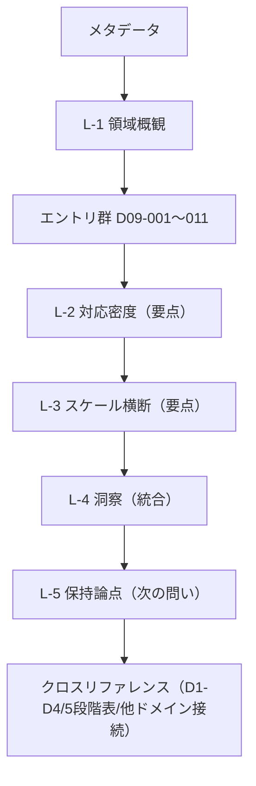
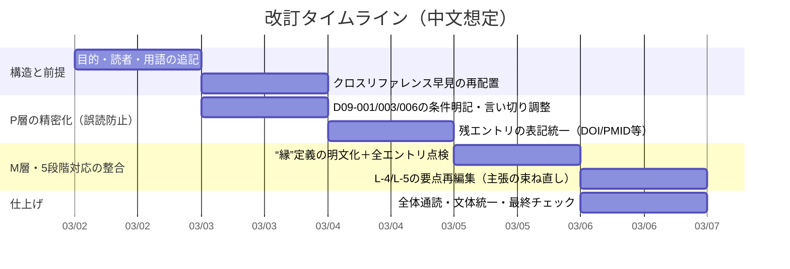

# 提出文書レビュー報告書（D09 生命科学・論拠DB）

## エグゼクティブサマリー

本提出物は、生命科学領域（D09）の知見を「論拠DB」として整理し、各エントリを **P層（事実・機構）** と **M層（モデル対応・学び）** に分け、さらに「場→波→縁→渦→束」の **5段階対応** にマッピングすることを目的とした、**内部向けの知識ベース兼設計ノート**として最も整合的です。特に、発達（モルフォゲン／刈り込み／ミエリン化）・代謝（ANLS／ミトコンドリア）・免疫（クローン選択）・睡眠（グリンパティック）を、創造プロセスの“基盤条件／選別／リセット”として並置する構図は説得力があります（例：グリンパティックの睡眠中活性化や脳間質腔拡大など、根幹主張は一次研究に裏づく）。citeturn11search0turn10search0turn10search7

一方で、改善余地は主に次の3点に集中します。

第一に、**読者前提（用語・上位モデル）**が暗黙で、初見読者には「抱持」「D1–D4」「縁フラグ」「品質チェック（CHK-A〜）」等が不透明です。冒頭に“この文書の使い方”と最小限の定義（1枚でよい）を追加すると、可搬性が大きく上がります。

第二に、P層の記述は概ね妥当ですが、いくつかは **「対象範囲（動物種／条件／領域）」「確立度（コンセンサス vs 議論）」** を明記しないと誤読リスクが出ます。例として、アストロサイト—ニューロン乳酸シャトル（ANLS）は裏づけ研究がある一方で、重要度・量的寄与を巡る論争もあり、“確立”の書き方には段階付けが必要です。citeturn1search0turn0search1turn0search0turn1search3

第三に、M層（学び）と5段階対応は洞察が強い反面、いくつかのエントリで「縁」が **比喩的説明に留まりやすい**（例：費用構造を扱うエントリでは段階対応が省略気味）ため、**縁＝“境界での選別・結合規則・閾値・タグ付け”**のように、形式的な定義を先に置き、各エントリの縁をその定義に沿って言語化すると一貫性が増します（境界モデルの実例として、補体系によるタグ付け→ミクログリア貪食は「縁」を明確に書ける好例）。citeturn5search4turn5search0

---

## 目的・想定読者・利用シーンの推定

文書内には、各エントリに **flags / layer / triage / claims / 5段階対応 / 学び / 文脈 / 判断（信頼度など）** が付与されています。これは「完成稿（論文・レポート）」よりも、次の用途に最適化された形式です。

- **目的（推定）**  
  生命科学領域の知見を、上位の抽象モデル（D1–D4、4層、5段階）へ接続するための“根拠カード”を揃え、モデル全体の妥当性を段階的に上げる（Step 7 再評価）こと。

- **ターゲット読者（推定）**  
  上位モデル（D1–D4、抱持/欠損駆動思考、5段階）を既知としている内部メンバー、または隣接ドメイン（D08神経科学等）の担当者。

- **読者に要求される前提知識**  
  神経科学・免疫・発生・代謝などの基礎概念。特に、グリアの議論（トリパータイトシナプス、mGluR5依存性、gliotransmissionの論争）などは専門性が要求されます。citeturn0search5turn25search0turn27search0

この推定が合っている限り、現行の“メタ情報多め・記号多め”の形式は合理的です。もし外部公開（一般・非専門）を視野に入れるなら、本文からメタ情報を折りたたむ（または付録化する）編集が必要になります。

---

## 構成と論理フローの診断

全体の並びは、**総論→各論→統合**の骨格があり、論理的に読みやすい部類です。とくに「領域概観（L-1）」で生命科学＝物質・エネルギー・構造変換という軸を立て、その後に代謝基盤／基本プロセス／失敗と回復へ展開する設計は一貫しています（睡眠による老廃物排出、ストレス負荷、代謝予算のような“前提条件”を先に置けている）。citeturn10search0turn11search0turn8search0turn2search0

ただし、初見読者が迷いやすいポイントが2つあります。

- **「統合テーブル（5段階×エントリ対応）」が末尾寄り**  
  使い方としては「まず表で全体像→気になるエントリへ」が自然なので、クロスリファレンスの表をL-1直後に“早見”として置き、末尾にも再掲（詳細版）する構造が向きます。

- **「D08との比較」「D1–D4対応」など、外部ドキュメント前提の記述が散在**  
  “内部利用”なら成立しますが、単体配布する場合は、参照先がないと評価不能になります。最低限、**依存関係（何を別文書に委ねているか）**を冒頭で列挙すると親切です。

文書構造（現状）を、読者導線として図示すると次のようになります。

---

## 主要主張のファクトチェックと検証優先度

ここでは **P層の「誤読されると全体が揺らぐ主張」** を中心に、一次情報で確認できるもの／条件付きのもの／議論が残るものを整理します（網羅的チェックは後述の工数見積に含めます）。

### 代謝・エネルギー基盤（D09-001 / D09-002）

- **アストロサイトのグルタミン酸取り込みと好気的解糖（乳酸産生）**は、PNAS（1994）の報告に一次根拠があります。citeturn1search0  
  一方で、脳内での **“エネルギー的にどれほど重要か（量的寄与）”**、また **神経刺激時にニューロン側の解糖がどれほど起動するか**は議論があり、反証・批判的レビューや計測研究も出ています。従って、P層の書き方は「仮説名＋支持／反対の整理」を維持しつつ、**“確立した事実”と“解釈モデル”を分離**するのが安全です。citeturn0search0turn1search3

- **乳酸輸送と長期記憶**については、ラット海馬で「長期記憶には必須だが短期記憶には影響が小さい」とする一次研究（Cell, 2011）があり、提示の方向性は妥当です。citeturn0search1

- **トリパータイトシナプス**は概念として成立していますが、若齢個体・培養系中心の知見（mGluR5依存性など）が成人脳で同様に成立するかは条件付きで、成人ではアストロサイトmGluR5が検出されにくいという報告もあります。従って「概念は重要だが、成人脳での実装は多様」という書き分けが望まれます。citeturn0search5turn25search0turn27search0

- **mtCB1（ミトコンドリア膜上CB1受容体）**について、CB1がミトコンドリア膜に存在し、活性化がミトコンドリア内cAMP低下→PKA活性低下→複合体I活性低下→呼吸抑制へつながる、という因果は論文要旨レベルで支持されます。citeturn26view0  
  さらに、急性カンナビノイド誘発性の記憶障害に海馬mtCB1が必要という報告もあります。citeturn2search5  
  ただし、文書内でも触れている通り、分野としては“ラボ集中・追試の厚み”の評価が重要であり、ここは **「確立：中／議論：あり」**の格付けが妥当です（信頼度“中”は合理的）。

- **神経信号のエネルギーコスト**（灰白質におけるシグナリングが高コストで、エネルギー制約が符号化様式に影響しうる）は、エネルギー予算の古典的レビューで議論されています。citeturn2search0turn4search1

### 剪定・可塑性・ストレス（D09-003 / D09-004 / D09-005）

- **発達期シナプス刈り込みと補体系（C1q/C3）・ミクログリア貪食**は一次研究・総説に強く支えられています。citeturn5search4turn5search0  
  ただし、これを“刈り込み一般の万能機構”のように読ませると過大一般化になり得るため、「特定回路系（例：網膜—視床）での強い証拠」など、適用範囲の注記があるとP層の精度が上がります。citeturn5search0

- **M1/M2という単純二分法は不十分**という批判は、専門誌の論考として明確に主張されています。citeturn5search3

- **過剰な炎症性サイトカインがシナプス機能へ悪影響**を与え得ることはレビューでも整理されていますが、現行の「過活性化→認知機能低下」は一般化が強いので、P層では「疾患文脈では関連が示唆」程度に落とすか、代表的レビューを明示すると安全です。citeturn28search3

- **成人脳でも経験依存的に髄鞘形成が変化し得る（活動依存的ミエリン化）**は、レビューおよび一次研究に支えられています。citeturn7search0turn6search0turn6search3

- **アロスタシス／アロスタティック負荷**の定義（“stability through change”）と、慢性ストレスが脳構造・機能に影響し得るという枠組みはレビューで整理されています（ただし具体的変化は研究系・測定で幅があるため、P層は「代表的所見」として扱うのが無難）。citeturn8search0turn9search7turn8search2

### 睡眠とクリアランス（D09-006）

- **グリンパティック系**（AQP4依存的なCSF-ISF交換・溶質クリアランス）の原型は、傍血管経路によるCSF流入／静脈周囲の排出、およびAQP4欠損でクリアランスが低下するという研究に依拠します。citeturn11search0

- **睡眠（または麻酔）で間質腔が拡大しクリアランスが促進**されるという代表的記述（“約60%拡大”）は、マウスを用いた研究要旨に明確です。citeturn10search0  
  提出文書が「麻酔下の外挿注意」を自ら書いている点は非常に良いリスク管理です。

- **ヒト睡眠中のCSF振動の観測**は、非REM睡眠で神経活動・血行動態・CSFが結合した低周波振動として報告されています。citeturn10search7

### 学習・進化・自己組織化（D09-007 / D09-008 / D09-009 / D09-010 / D09-011）

- **ドーパミン報酬予測誤差（RPE）**の「予期しない報酬でバースト」「条件づけ後に刺激へ移行」「予測された報酬欠如でディップ」は、古典的枠組みとして一次／レビューで支持されています。citeturn13search1  
  **不確実性の符号化**についても代表的研究があります。citeturn12search1

- **有性生殖の“コスト”と維持問題（twofold cost など）**は、進化理論上の中心論点としてレビューで整理されています。citeturn15search2turn14search0  
  一方、「真核生物の初期進化革新」など、系統史の言い切りは読者の誤解を招きやすいので、P層では「一般に性と減数分裂は真核生物で広く見られ、起源は重要マイルストーンと位置づけられる」程度に留め、根拠（総説）を添えるのが安全です。

- **オートファジー**は、酵母変異体による遺伝学的同定（1993）や、LC3のオートファゴソーム膜局在・処理（2000）など一次情報が揃っています。citeturn19search0turn18search0  
  2016年のノーベル生理学・医学賞がオートファジー機構研究に授与されたことも一次情報で確認できます。citeturn17search2  
  したがって、このエントリは信頼度を「中→高」に上げてもよい候補です（“事実”部分が強固）。

- **形態形成（位置情報／bicoid勾配／反応拡散）**は、古典論文から実証例まで一次情報が明確です（位置情報の枠組み、bicoid濃度勾配、反応拡散、魚類縞模様と反応拡散の整合）。citeturn21search10turn20search0turn21search0turn20search3

- **獲得免疫（クローン選択／V(D)J再構成／危険モデル）**は、歴史的整理（クローン選択の成立）と分子機構（RAG）に一次情報があります。citeturn23search3turn22search2turn22search1  
  危険モデル（自己／非自己以外の枠組み）も代表的論文で整理されています。citeturn29search0  
  また、胚中心での選択と親和性成熟に関して、日本語の一次に近い公的発信として entity["organization","東京大学","university of tokyo"] の研究成果公表が利用できます（読者が日本語で追える参照先として有用）。citeturn24search8

### 検証優先度の提案

優先度は「誤読の破壊力 × 議論の残りやすさ × 文書全体テーマへの寄与」で決めるのが合理的です。

- **最優先（誤読リスク高）**  
  ANLS/グリア伝達の“成人脳での成立条件”と量的寄与（D09-001）。citeturn25search0turn1search3turn0search0  
  グリンパティックの外挿範囲（麻酔 vs 自然睡眠、ヒト vs マウス）（D09-006）。citeturn10search0turn10search7turn11search0  
  microglia過活性→認知低下の一般化（D09-003）。citeturn28search3

- **次点（精度を上げたい）**  
  mtCB1の定量（“10–15%”の母集団がどこか明示）（D09-002）。citeturn26view0turn2search2  
  有性生殖の起源史の言い切り（D09-008）。citeturn15search2

- **相対的に安定（現状でも堅い）**  
  ドーパミンRPE（D09-007）。citeturn13search1turn12search1  
  オートファジー基本機構（D09-009）。citeturn19search0turn18search0turn17search2  
  形態形成の古典枠組みと実例（D09-010）。citeturn21search10turn20search3turn21search0  
  免疫のクローン選択とV(D)J（D09-011）。citeturn23search3turn22search1turn29search0

---

## 表現・文体・可読性のレビューと具体的改善

### 表現・トーンの総評

現状の文体は「技術メモ＋説得のためのフック（🎣等）＋意思決定ログ（Accept/信頼度）」が一体化しており、内部運用には強い一方、読者層が広がるほどノイズになります。したがって、**文書タイプ別の編集方針**を最初に決めるのが重要です。

- **内部DB/レビュー用（現状路線）**：メタ情報は維持。ただし用語定義と“縁フラグの意味”だけ補う。  
- **報告書/論文調**：絵文字・triage・flagsを付録化し、本文は「背景→要点→根拠→限界→解釈」に統一。  
- **メール/短文共有**：各エントリを1〜2行要約＋参照リンクに圧縮。

### 重大度別の課題一覧（修正提案付き）

| 重大度 | 症状（観測された問題） | 影響 | 推奨修正（最短で効く手当） |
|---|---|---|---|
| Critical | P層で「条件（種・領域・状態）」が省略され、一般化に読める箇所がある（例：ANLS、microglia過活性、グリンパティック） | 誤解が模型（M層）へ波及し、モデル妥当性の議論が崩れる | 各P主張を「対象（マウス/ラット/ヒト）」「条件（自然睡眠/麻酔）」「スコープ（回路限定/一般）」の3要素でタグ付け |
| Major | 上位概念（抱持、D1–D4、縁フラグ、CHK）の定義が文書内にない | 初見読者が途中で脱落、レビューコスト増 | 冒頭に「用語ミニ辞書（10行）」＋「縁フラグ判定基準（3段階）」を追加 |
| Major | 5段階対応の“縁”が比喩に流れやすいエントリがある（費用構造系など） | 5段階の普遍性主張が弱まる | 「縁＝結合規則/閾値/タグ/インターフェース」のチェックリストを作り、各エントリの縁をその語彙で再記述 |
| Major | 出典表記が粒度不統一（著者年だけ、DOI/PMIDなし、根拠と反証の並びがまちまち） | 追検証のコスト増、信頼度議論が不毛に | すべてのP主張に「PMID/DOI（可能なら）」を付与し、反証は“対立点1行＋代表文献”に圧縮 |
| Minor | 文が長い箇所があり、抽象語（前提・基盤・同型）が連続する | 理解に時間がかかる | 1文1命題に分割し、「比喩→定義→根拠→限界」の順へ並べ替え |
| Minor | 絵文字・フックの密度がエントリ間で揺れる | 読者の注意配分が乱れる | “フックは各エントリ最大1つ”など簡易ルール化（内部DBなら許容） |
| Minor | 「Accept/信頼度」の根拠が短いエントリがある | 再評価時に判断が再現できない | 信頼度欄に「確立度（教科書/主要総説/単発）」を一言で追記 |

### 書き換え例（Before / After）

以下は「意味は同じだが誤読余地を減らす」方向の具体例です（引用は最小限にとどめます）。

**例：グリンパティックの“60%拡大”の書き方**

- Before（趣旨）：  
  「睡眠中に活性化し、間質腔が拡大（動物実験で約60%…）」

- After（提案）：  
  「マウスでは、自然睡眠または麻酔で脳の間質腔が拡大し、CSF-ISF交換と溶質クリアランスが増える（代表報告では“約60%増”）。ただし、この定量は条件依存で、ヒト自然睡眠へそのまま外挿しない（※“睡眠/麻酔/覚醒”の比較条件を明記）。」

**例：mtCB1の“10–15%”の母集団の明確化**

- Before（趣旨）：  
  「mtCB1、全CB1の約10–15%」

- After（提案）：  
  「神経細胞のミトコンドリア膜上にもCB1受容体が局在しうる。割合の定量は“どの脳部位・細胞型・測定法”に依存するため、例として『海馬CA1で総CB1免疫標識の約15%がミトコンドリアに局在』のように、母集団を明示する。」

**例：microglia過活性→認知低下の一般化の抑制**

- Before（趣旨）：  
  「過活性化は神経炎症→サイトカイン過剰放出→認知機能低下」

- After（提案）：  
  「病態文脈では、ミクログリアの炎症性状態とサイトカイン環境の変化がシナプス機能・可塑性へ影響し、学習・記憶などの機能低下と関連づけられることがある（ただし因果の強さは疾患・モデルで異なるため“疾患依存”と注記）。」

**例：L-1領域概観の長文分割（読みの負荷軽減）**

- Before（趣旨）：  
  「第一の水準は代謝基盤…抱持には…」

- After（提案）：  
  「D09では、創造を“情報処理”ではなく“物質・エネルギー・構造変換”として扱う。  
  まず代謝基盤がある。ここでは『問いを保持するにはコストが要る』を、比喩ではなく生理学として示す。  
  次に、生命の基本プロセス（発生・免疫・生殖）がある。ここでは“多様性→選別”の構造が繰り返し現れる。  
  最後に、失敗と回復（炎症・負荷・睡眠・分解再利用）がある。ここでは、5段階の“逸脱”と“リセット”を扱う。」

---

## 優先度付き改訂計画と工数見積

### 優先度付きアクションチェックリスト

- [ ] 冒頭に「この文書の目的・読者・使い方」1セクションを追加（3〜8行）  
- [ ] 用語ミニ辞書（抱持 / D1–D4 / 縁フラグ / CHK）を追加  
- [ ] P層の主張を **対象（種・条件）** つきで再記述（特にD09-001/003/006）  
- [ ] “議論中”ラベルの基準を明文化（例：追試厚み・測定反証・メタレビューの有無）  
- [ ] 参考文献表記を統一（著者年＋DOI/PMID、可能ならオープン版リンク）  
- [ ] 5段階対応の“縁”をチェックリストで再点検（定義語彙に寄せる）  
- [ ] クロスリファレンスの表を前方に「早見」として再配置（末尾にも詳細版）  
- [ ] 外部公開の可能性がある場合：絵文字・triage・flagsを付録化（本文は論理文体へ）

### 改訂の所要時間見積（文書タイプ×分量別）

前提：ここでの“時間”は、**読み直し＋修正＋最低限の追検証（出典確認）**を含む目安です。締切不明のため、最短ルート（最小限の品質担保）と、丁寧ルート（再現性重視）の2段階で記します。

- **短文（<1,000語相当）**  
  最短：1〜2時間（構成整理＋語尾統一＋誤字）  
  丁寧：3〜6時間（主要主張の出典確認＋言い切り調整）

- **中文（1,000〜5,000語相当）**（本提出物は規模感としてこのレンジに近い）  
  最短：6〜10時間（用語定義追加＋P層の条件明記＋表記統一）  
  丁寧：12〜24時間（主要P主張を一次文献で再確認し、反証も含めて“確立度ラベル”付与）

- **長文（>5,000語相当）**  
  最短：1〜2日（構造リライト＋章立て再設計）  
  丁寧：3〜5日（出典の完全整備＋主張の粒度統一＋レビュー耐性の高い脚注化）

### 中文想定の改訂タイムライン例

### 事実検証に使う推奨リソース（日本語一次・公的を優先）

日本語で追える検証導線を増やすなら、次のような“信頼できる入口”を文末に置くのが有効です（各エントリの一次論文リンクに加えて）。

- entity["organization","東京大学","university of tokyo"] の研究成果公表（和文で概要・位置づけ・図解が得られる）citeturn24search8  
- entity["organization","Nobel Prize","nobel prize outreach"]（受賞理由の科学的背景PDFがまとまっており、オートファジー等の基礎整理に強い）citeturn17search2  
- entity["organization","CiNii","national institute of informatics jp"]（古典論文・書誌情報の確認に便利：位置情報、Turing、クローン選択の歴史など）citeturn21search1turn16search0turn29search1  

以上を踏まえると、現状は「内部DBとして良い形」まで来ています。次の改訂では、**(1) 前提の明文化、(2) P層の条件明記、(3) “縁”の定義統一**の3点に集中投資するのが、最小工数で最大効果を得るルートです。