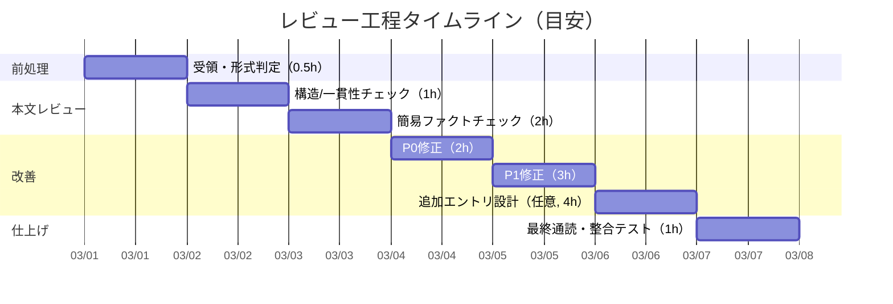

# ファイルレビュー報告書

## エグゼクティブサマリー

本レビューは、提供された2つのMarkdownファイル（レビュー依頼書＋論拠DB本文）について、(1)内容要約、(2)正確性・一貫性チェック、(3)改善点と具体的修正案、(4)リスクと影響評価、(5)簡易工数見積りを「中〜高」深度で実施したものである（レビュー実施日：2026-03-01 JST）。  
レビューにおけるファクトチェック方針は、**ファイルが参照する一次資料（原著論文）と、公的・公式サイト（例：教科書相当/公的医療情報/学会ガイドライン）を優先**し、必要に応じて二次レビュー（総説）で補完する。citeturn3search3turn5search2turn7search0turn2search0turn2search10

総合評価として、論拠DB（D10）は、**免疫学・臨床医学の確立概念（クローン選択、V(D)J再構成、免疫編集3E、炎症の能動的収束、創傷治癒相、敗血症の免疫抑制、免疫療法、移植拒絶/寛容、自己免疫、胚中心反応）を、一定の根拠（refs）付きで整理できており、骨格は妥当**である。citeturn0search1turn1search0turn5search2turn0search7turn5search4  
一方で、公開・共有・再利用を前提にした品質としては、次の点が「最優先（P0）」で修正対象になる。

- **表記の誤り/文字化けに近い誤字が、専門用語（胚中心・濾胞関連）に混入**している（例：「濱胞」「派泡…」）。この種の誤りは読者の理解と信頼性に直撃するため、最初に是正が必要。胚中心反応は、暗帯/明帯、Tfh、FDCなどの要素が定義上のコアであり、誤表記は内容正確性の毀損にもつながる。citeturn1search3turn7search2  
- **横断表（クロスリファレンス表）に、本文と不整合な語（例：感染巣→感染巾）が混入**しているため、用語統一（単語レベル）が必要。
- **領域レポート（L-2）の「30領域中最高水準」等が、本文内で検証不能**であり、根拠（集計元）へのリンク/注記がない限りは、断定表現のトーンダウンや根拠追記が必要。
- **confidence（高/中）が、確立事実[P]と構造解釈[M]の混在を単一ラベルで表現している**。精度管理の観点から、少なくとも「医学的事実の確度」と「5段階対応（解釈）の確度」を分離した二軸化を推奨する。

これらを修正した上で、設計論点として「縁（エッジ）の二重表現（接触・境界・介入の混在）」と「粒度（CM-001とCM-010のフラクタル扱い、創傷治癒と骨折修復の独立性）」は、**要議論**として整理・方針決定が必要になる。

## 対象ファイルと前提条件

前提条件（未指定事項の仮定）  
言語は日本語、レビュー深度は中〜高、納期と対象読者は未指定と仮定する。一次資料・公式情報を優先し、必要に応じて総説で補完する。citeturn1search9turn2search0turn3search3turn2search10

### ファイル一覧と形式

| ファイル | 形式/構造 | 想定言語 | 役割 | 要約（目安200字） |
|---|---|---|---|---|
| REQ-GPT-20260301-003_d10-review.md | Markdown（依頼仕様） | 日本語 | GPTレビューの要求仕様（観点・判定尺度・出力要件） | D10臨床医学・免疫学のStep7 Phase3レビュー依頼書。レビュー対象（evidence-D10-clinical-medicine.md）と10エントリ／領域レポートの評価観点（理論妥当性、縁の二重表現、粒度、L-1〜L-5品質、confidence妥当性）を定義し、3段階判定での指摘・修正案提示を求める。補体系・粘膜免疫・ワクチン免疫の扱いも論点として挙げ、信頼度スコアの妥当性検証を要求する。 |
| evidence-D10-clinical-medicine.md | Markdown＋YAMLメタデータ＋表（クロスリファレンス） | 日本語中心（一部英語） | D10（臨床医学・免疫学）論拠DB本文（10エントリ＋領域レポート） | 臨床医学・免疫学（D10）の論拠DB。YAMLメタデータ付きMarkdownで、適応免疫、がん免疫編集、炎症収束、創傷治癒、敗血症、骨折修復、アレルゲン免疫療法、移植寛容、自己免疫、胚中心反応の10エントリを「場-波-縁-渦-束」の5段階に対応付け、refs・confidence・領域レポート（L-1〜L-5）とクロスリファレンス表を収録。各エントリは類似/独自/学び/文脈/判断の枠で整理され、縁フラグ（🔴/🟡）と牽強付会リスクも付与されている。 |

## レビュー結果

### 依頼書で指定された観点の3段階評価

| 観点（REQの必須） | 判定 | 根拠（要点） | 条件付きでの修正/議論ポイント |
|---|---|---|---|
| 理論の妥当性（各CMエントリ） | 要修正 | 各トピックは免疫学・臨床医学の主要概念で、参照文献も概ね妥当（例：クローン選択説、V(D)J再構成、がん免疫編集3E、炎症の能動的収束、敗血症免疫抑制、胚中心反応）。citeturn0search8turn1search0turn0search1turn5search2turn5search4turn7search2 | (a) 創傷治癒のM1/M2二分法は有用だが「過度に単純」とされうるため注記が望ましい。citeturn6search3turn6search16 (b) 敗血症のSIRS→CARS逐次モデルは単純化批判があり、同時並行（混在）を強調する記述に寄せると正確性が上がる。citeturn3search18turn5search4 |
| 「縁」の二重表現（CM-007/008/009など） | 要議論 | 「接触シグナルの縁（APC–T/B、Tfh–B等）」と「自己/非自己境界の縁（寛容・自己免疫）」と「介入としての縁（免疫療法）」が同一ラベルで運用されているため、読者の解釈が揺れる。citeturn1search3turn2search0turn4search4 | 「縁」の下位分類（後述）を設計として決める必要がある（用語とタグ設計の問題で、単なる誤字修正では解けない）。 |
| エントリ数/粒度の適正（10件） | 要議論 | 10件は「領域の代表例」セットとしては過不足ないが、依頼書が挙げる補体系・粘膜免疫（経口免疫寛容）・ワクチン免疫は、本ドメインの中心概念として独立エントリ化の利益が大きい。citeturn3search3turn4search4turn4search9 | 追加する場合、どの粒度（分子/細胞/臓器/公衆衛生）までをD10で扱うか、スコープ定義が必要。 |
| L-1〜L-5の質（領域レポート） | 要修正 | L-4/L-5は洞察・保留論点として機能している一方、断定調（例：「最高水準」）の根拠が本文内に不足する箇所がある。さらに「恨意性」等の誤字、専門語の誤表記が混入。 | (a) 根拠のある集計値なら出典（領域DB集計）を明示、ないならトーンダウン。 (b) 誤字修正（P0）。 |
| 信頼度スコア（高/中）の妥当性 | 要修正 | 「科学的確立度」と「5段階対応の解釈強度」が一つのconfidenceに混在しうる。例：アレルゲン免疫療法自体の機序は確立寄りだが、束の“上書き”は[M]解釈。citeturn2search0turn2search1 | 二軸化（P:医学的確度 / M:対応解釈の確度）またはconfidence欄の注記強化が必要。 |

### 簡易ファクトチェック（一次資料・公式情報優先）

外部一次資料・公式情報で、論拠DB内の「核となる主張」が概ね妥当であることを、代表例で確認した（全件の逐語検証ではなく、レビューとしてのスポットチェック）。

- **クローン選択説（CM-001）**：1957年のクローン選択説の提示、および抗体多様性機構（V(D)J再構成）の確立は、免疫学の中核的理解として整合する。citeturn0search8turn1search0turn4search15  
- **がん免疫編集3E（CM-002）**：Elimination–Equilibrium–Escapeの3相として整理される枠組みは総説として確立している。citeturn0search1turn0search17  
- **急性炎症の能動的収束（CM-003）**：Resolvins/Protectins等のSPM（specialized pro-resolving mediators）を含む「解決（resolution）」の生理学的枠組みは確立したレビューが存在する。citeturn5search2turn0search2  
- **創傷治癒相（CM-004）**：止血/炎症/増殖/リモデリング（相は重なり得る）という整理は医学教育・レビューで一般的。citeturn0search7turn0search11  
- **敗血症の免疫抑制（CM-005）**：敗血症は高炎症と免疫抑制が同時並行し得る、という理解が強調される（SIRS→CARSの単純な逐次モデルは限界が指摘される）。citeturn5search4turn3search18  
- **アレルゲン免疫療法（CM-007）**：長期効果のための治療期間（3〜5年を目安とし個別化）は実務資料・レビューで整合的。citeturn2search0turn2search1turn2search15  
- **移植拒絶の時間スケール（CM-008）**：超急性（分〜）/急性（週〜月〜）/慢性（月〜年〜）といった時間軸整理は公的医療情報・教科書的整理でも整合。citeturn2search10turn2search2  
- **胚中心反応（CM-010）**：暗帯（SHM・増殖）→明帯（抗原獲得とTfhヘルプによる選択）というゾーン分化と循環は、レビューで明確に整理されている。citeturn1search3turn7search2turn1search11  

### 主要な問題点一覧（正確性・一貫性・論理・データ・表現）

| ID | 種別 | 問題点（要約） | 影響 | 該当箇所（例） | 優先度 |
|---|---|---|---|---|---|
| I-01 | 表現/正確性 | 「濱胞」「派泡…」等、**胚中心/濾胞関連の誤表記**が混入（Tfh/FDC周辺） | 専門読者の信頼低下、誤学習誘発 | CM-010（胚中心形成、FDC表記など） | P0 |
| I-02 | 一貫性 | クロスリファレンス表で「感染巾」など、本文語彙と不整合の語が混入（本文は「感染巣」） | 参照表の信頼性低下、検索性悪化 | クロスリファレンス表（CM-005の「場」） | P0 |
| I-03 | 表現/論理 | L-2「30領域中最高水準」等の**定量主張が本文内で検証不能**（出典不在） | レポート部の説得力低下 | D10領域レポート L-2 | P0 |
| I-04 | 表現 | L-5「領域境界の恨意性」など、語義として不自然（意図は「恣意性」等の可能性） | 読解阻害、品質印象低下 | D10領域レポート L-5 | P0 |
| I-05 | 正確性/表現 | 創傷治癒のM1→M2を軸とした記述は便利だが、二分法は過度単純化になり得る | 科学的厳密性の懸念 | CM-004（縁の説明） | P1 |
| I-06 | 正確性/論理 | 敗血症のSIRS/CARSは「逐次」より「混在」を強調した方が現代理解に整合 | 誤解の余地 | CM-005（モデル説明） | P1 |
| I-07 | 設計/一貫性 | confidenceが「確立事実」と「5段階対応解釈」を混在して表現 | トリアージ運用が粗くなる | 全体設計（特にCM-007/008） | P1 |
| I-08 | スコープ/論理 | 補体系・粘膜免疫/経口免疫寛容・ワクチン免疫が未収録。依頼書でも論点化されている | ドメイン網羅性の不足 | ドメイン設計全体 | P2 |

## 優先度付き改善提案

### 改善提案表（具体的修正例つき）

| 優先度 | 対象 | 改善提案（要点） | 具体的修正例（抜粋：置換案） | 期待効果 |
|---|---|---|---|---|
| P0 | CM-010 | 誤表記の一括修正（濾胞/胚中心関連）＋用語統一 | 例：`T濱胞細胞（Tfh）` → `T濾胞ヘルパーT細胞（Tfh）`、`濱胞樹状細胞` → `濾胞樹状細胞（FDC）`。胚中心の明帯/暗帯・Tfh・FDCがコア要素である点に合わせる。citeturn1search3turn7search2 | 正確性と信頼性の回復、検索性改善 |
| P0 | クロス表 | クロスリファレンス表と本文の語彙整合（単語レベル） | 例：`感染巾` → `感染巣`（本文の「感染巣と宿主免疫…」に揃える） | 表の参照性・一貫性向上 |
| P0 | L-2/L-5 | 根拠不明の定量断定・誤字の是正 | 例：`30領域中最高水準` → `（領域DB集計では）相対的に高い（要:集計根拠リンク）`／`恨意性` → `恣意性（または任意性）` | レポート部の説得力・品質印象向上 |
| P1 | CM-004 | M1/M2表現の注記（過度単純化の回避） | 例：`M1→M2転換` を「連続的な表現型シフト（便宜上M1/M2と表記）」に修正し、二分法の限界を脚注化する。citeturn6search3turn6search16 | 科学的厳密性の底上げ、批判耐性向上 |
| P1 | CM-005 | SIRS/CARSの説明を「混在」寄りに正規化 | 例：逐次モデルの説明に「同時並行し得る」「患者内・時点内で混在」を追記する。citeturn3search18turn5search4 | 現代理解への整合、誤解低減 |
| P1 | 全体 | confidenceを二軸化（P:医学事実 / M:対応解釈） | 例：`confidence_P: 高 / confidence_M: 中` のように分離。免疫療法の臨床知見は高、束の“上書き”は解釈として中、などを明確化。citeturn2search0turn2search1 | トリアージの精度向上、運用が安定 |
| P2 | ドメイン設計 | 依頼書の論点（補体系・粘膜免疫/経口免疫寛容・ワクチン免疫）を追加エントリ化 | 補体の基本機能（オプソニン化、炎症促進、MAC等）を独立項目化。citeturn3search3turn3search7 経口免疫寛容を粘膜免疫として独立化。citeturn4search4turn4search0 ワクチン免疫を「記憶形成と免疫誘導」の観点で独立化。citeturn4search1turn4search9 | 網羅性・説明力の向上、REQの未解決論点解消 |

### 具体的修正案（箇条・短文）

- CM-010の誤表記修正は「単語置換」ではなく、**胚中心反応の標準構成要素（暗帯/明帯、Tfh、FDC）**に用語を揃える方針で全面点検する。citeturn1search3turn7search2  
- L-2の「最高水準」等は、**（a）内部集計を引用できるなら出典を明記、（b）できないなら主観表現に落とす**、の二択で対応する。  
- confidenceは、最低限「医学的事実の確度」と「5段階対応の確度」を分離する（例：CM-007）。citeturn2search0turn2search1  
- 用語統一ルール（例：GC=胚中心、Tfh=濾胞ヘルパーT、FDC=濾胞樹状細胞）を**冒頭の凡例に追記**し、クロス表にも同ルールを適用する。citeturn1search3turn7search2  

## リスクと影響評価

### リスク一覧（簡易マトリクス）

| リスク | 発生可能性 | 影響 | 具体例 | 低減策 |
|---|---:|---:|---|---|
| 専門用語の誤表記が残存 | 中 | 高 | 胚中心/濾胞関連の誤表記が、内容の正否以前に信頼を毀損 | P0修正（CM-010、凡例・表の統一） |
| 断定表現が根拠薄のまま残る | 中 | 中〜高 | 「30領域中最高水準」等が反証されるとレポート全体が弱体化 | 出典明記 or トーンダウン（P0） |
| 医学モデルの単純化が誤解を誘う | 中 | 中 | SIRS/CARS逐次、M1/M2二分法など | 注記と最新理解の追記（P1）。citeturn3search18turn6search3 |
| confidence運用が粗くなり品質管理が破綻 | 中 | 中 | [P]と[M]混在で「高」判定が拡散 | 二軸化または注記強化（P1） |
| スコープ不足で重要概念が欠落 | 低〜中 | 中 | 補体・経口免疫寛容・ワクチン免疫が未収録 | 追加エントリ計画化（P2）。citeturn3search3turn4search4turn4search9 |

注意：本ファイル群は医療・免疫学を扱うため、編集物が外部公開・教育利用される場合は、**臨床判断の根拠として直接使用しない**旨の免責と、参照先（ガイドライン/原著）への導線を明記することが望ましい。citeturn5search4turn2search0turn2search10  

## 作業計画と工数見積り

### 簡易見積り（中〜高深度）

| 作業 | 内容 | 目安工数 |
|---|---|---:|
| 形式判定・目次/構造抽出 | Markdown/YAML/表の構造確認、セクション粒度把握 | 0.5h |
| P0修正 | 誤表記（濾胞/胚中心）、クロス表の語彙整合、L-2断定表現の根拠整理、誤字修正 | 1.5〜3h |
| P1修正 | SIRS/CARS・M1/M2等の注記、confidence二軸化設計と反映 | 2〜4h |
| 追加エントリ設計（P2） | 補体・経口免疫寛容・ワクチン免疫の要否判断、テンプレ適用 | 2〜6h |
| 全体整合テスト | 用語統一、リンク/参照、表の整合、最終通読 | 1〜2h |

合計（想定）：**5〜15時間**（追加エントリの作成有無で変動）。  
※「全主張の一次資料突合（逐語）」まで行う場合は、別途（10エントリ×追加2〜4h程度）で増加し得る。citeturn0search1turn5search2turn2search0turn1search3turn5search4  

### Mermaidタイムライン（作業工程）



## レビュー手順と報告書テンプレート

### 詳細レビュー手順（ファイル形式が未知の場合の標準手順）

レビューを再現可能にするため、**「形式判定 → 構造抽出 → 要約 → 検証 → 改善 → リスク → 仕上げ」**の順で進めるのが安定する。一次資料・公式サイトを優先し、総説は補助に回す。citeturn3search3turn2search0turn2search10

- **PDF**：章立て・図表番号・脚注/参考文献を抽出し、重要図表は「図表ごと」に主張と根拠を対応付ける。  
- **Word/テキスト**：見出し階層、定義語（用語集）、参照（リンク/脚注）を抽出し、同一語の揺れを統一する。  
- **Excel/スプレッドシート**：入力値の出典、計算列の式、参照範囲、単位、欠損、外れ値、再計算可能性（再現性）を点検する（「数式が正しい」だけでなく「前提が正しい」かを確認）。  
- **画像**：凡例・単位・縮尺・注記の有無、誤読リスク（色覚・解像度）、必要ならOCRでテキスト化して検証する（ただしOCRは誤りを含み得るため二重確認）。  
- **スライド**：1枚1メッセージ、論理の接続（A→B→C）、発表時間に対する密度、図の出典、専門語の初出定義を点検する。  

本案件（Markdown＋YAML）の場合は、以下を最低ラインとする。  
(1) YAMLメタデータと本文の件数整合、(2) 用語統一（凡例＋本文＋表）、(3) refsの体裁統一、(4) [P]/[M]/[S]の表示ポリシーの明確化、(5) 断定表現の根拠明示。

### レビュー報告書テンプレート（サンプル）

以下は、今回の出力形式を再利用できる「テンプレ（雛形）」である（案件ごとに差し替え）。

```text
# ファイルレビュー報告書

## エグゼクティブサマリー
- 対象：＜ファイル名/範囲＞
- 結論：＜総合評価＞
- 重要指摘（P0）：＜3点まで＞
- 重要指摘（P1/P2）：＜必要に応じて＞
- リスク：＜高い順に要約＞
- 追加で必要な情報：＜未確定事項＞

## 対象ファイルと前提条件
- 前提（言語/読者/用途/納期/深度）
- 情報源方針（一次資料・公式サイト優先）
- ファイル一覧（形式/役割/要約）

## レビュー結果
- 指定観点×3段階評価（問題なし/要修正/要議論）
- 主要な問題点一覧（正確性・一貫性・論理・データ・表現）
- ファクトチェック（抜粋：一次資料・公式情報）

## 優先度付き改善提案
- 改善提案表（P0/P1/P2、具体修正例つき）
- 修正方針（用語統一、体裁、出典、読者配慮）

## リスクと影響評価
- リスクマトリクス（発生可能性×影響）
- 低減策（短期/中期）

## 作業計画と工数見積り
- 作業内訳と工数（簡易）
- Mermaidタイムライン（作業工程）

## 追加情報と前提条件
- 必要な追加資料（出典、仕様、対象読者、スコープ境界）
- 未確定点と、確定した場合に変わる判断
```