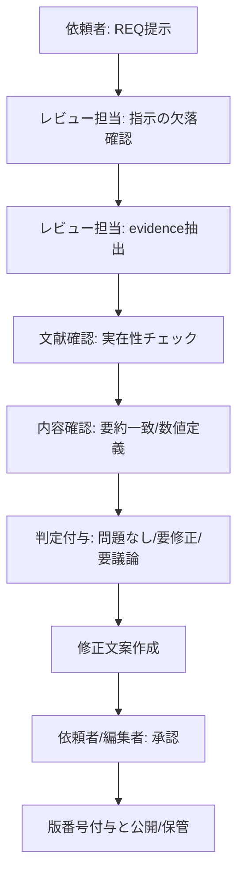
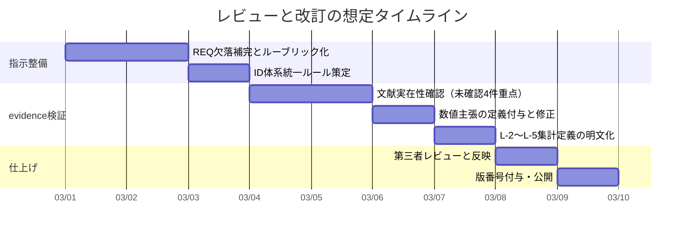

# 指示レビューと証拠ファイル品質監査報告書

## エグゼクティブサマリー

本レビューは、ユーザー提供の指示ファイル（REQ）と証拠ファイル（evidence、いずれもMarkdown）を対象に、「指示に従いレビューして」という要請に対し、**指示文そのものの品質（明確性・完全性等）**と、**指示の対象であるevidenceファイルの品質（文献実在性・要約正確性等）**を同時に評価したものである（2026-03-01 JST）。  

結論として、evidenceファイルは「薬学（Pharmacy）」領域における候補10件を、[P]（文献に基づく解釈）と[M]（理論から着想した構造的類似）に分け、さらにL-1〜L-5の集約（密度・スケール横断・洞察・保持論点）を付しており、**概念設計としては一貫性が高い**。一方で、REQ指示文は**途中が省略（“...”）され、観点2〜4が欠落**しているため、レビューのスコープ・判定基準・成果物形式が不完全である（出典未指定）。この欠落は、レビュー結果の再現性と合意形成（「要修正」「要議論」の境界）を不安定にする。  

evidence側の主要な要修正点は、①**数値主張（例：成功率約5%）の定義不足**、②**引用の粒度と一次資料リンクの不統一**、③**信頼度スコアが全件「中」に集中し弁別力が低い**、④**日本語一次・公的資料の参照を増やせる箇所（QbD、徐放性製剤ガイドライン等）の形式統一**である。特に「Design Space」定義やQbDの説明は、entity["organization","PMDA","japan regulator"]が公開するICH Q8日本語資料に明確な定義があるため、[P]層の強度を最大化できる。citeturn13view0turn25view0  

優先度の高い改善（要約）は以下である。  
第一に、REQの欠落（観点2〜4）を復元し、**目的・範囲・判定基準・責任分担・成果物**を明文化する（出典未指定）。  
第二に、evidenceの各エントリで、**「何をどこまで検証したか」をflagsと信頼度に反映**させる（例：文献実在性確認済、主張一致確認済、数値再計算済）。  
第三に、数値主張は「フェーズ範囲」「疾患領域」「母集団」「期間」を明記し、近年の大規模推定（例：Phase I→承認の成功確率推定）と整合させる。citeturn32search0turn23search6  

---

## 対象資料と前提

対象は、ユーザーがアップロードした以下2ファイルである（いずれもMarkdown、ファイル内記載に基づく）。  
- 指示ファイル（REQ）：レビュー依頼の概要、観点、出力形式を規定（ただし途中省略あり）。（出典未指定）  
- 証拠ファイル（evidence）：薬学（Pharmacy）領域の「論拠DB」として10エントリ＋L-1〜L-5集約を提示し、各エントリにflags、layer、claims、判断等が付与されている。（出典未指定）

重要な前提・制約は次である。  
- REQはファイル冒頭で「REQ-GPT-20260301-002」と表示されるが、ファイル名と齟齬があるため、**真正性（版管理）に不確実性**がある（出典未指定）。  
- REQの「レビュー観点（5点）」のうち、**観点2〜4が“...”で欠落**している。よって、本報告では**欠落部分は「想定構成要素」として補完案を提示**し、原文断定は避ける（出典未指定）。  
- evidence内の文献は、一部「lit:未確認」または「概要」等のタグがあり、**“文献実在性の確認済み”ではないものが混在**している（出典未指定）。  
- 本環境では、アップロードファイルに対する行番号付き引用（filecite）が利用できないため、ファイル内引用は**短い抜粋**として提示し、外部一次資料はWeb一次情報で裏取りし引用する（出典未指定）。  

---

## 指示文に含まれる構成要素の推定と現状評価

REQの記載（出典未指定）と、一般的な「レビュー指示」文書のベストプラクティス（後述のテンプレート参照、出典未指定）から、原指示文に含まれるであろう構成要素を整理する。**存在がREQで確認できないものは「出典未指定」**と明記する。

目的はREQで明示されており、「独立した視点からの品質検証」と読むことができる（出典未指定）。一方、**範囲・判定基準・役割・期限**が不完全で、レビュー品質の再現性を損なうおそれがある（出典未指定）。

以下に、構成要素ごとの推定と、REQ上の充足状況を示す（「未記載」は出典未指定）。  

- **目的**：独立した視点から品質検証（REQに明示、出典未指定）。  
- **範囲**：evidence全体（10エントリ＋L-1〜L-5）（REQに明示、出典未指定）。  
- **想定読者**：依頼者（ユーザー）・作成者（Claude）・編集者（不明、出典未指定）。  
- **必須アクション**：観点ごとに判定＋具体コメント、要修正時はIDと提案（REQに明示、出典未指定）。  
- **制約**：ID表記は「PM-{NNN}」で記載、観点の判定候補（問題なし/要修正/要議論等）（REQに明示、出典未指定）。  
- **成果物**：観点別の判定とコメント（REQに明示、出典未指定）。  
- **タイムライン**：依頼日記載のみ。納期・レビュー工数・反復回数は未記載（出典未指定）。  
- **成功基準**：誤りがない、文献要約が正確、集計が正確等の文言はあるが、判定閾値が未定義（出典未指定）。  
- **責任分担**：誰が修正するか、誰が最終承認するか未記載（出典未指定）。  
- **品質基準・参照標準**：医薬品品質（ICH Q8/Q9/Q10等）に直接触れる箇所はevidence側に多いが、指示文側には「どの標準に合わせるか」未記載（出典未指定）。  
  - ただし、evidenceで扱うQbD概念は、PMDA公開のICH Q8日本語資料に定義があるため、指示文に「参照先」を明記するとレビューが安定する。citeturn13view0turn25view0  
- **出典管理方針**：文献実在性確認を強く求めるが、確認方法・満たすべき書誌情報項目が未定義（出典未指定）。

---

## 指示文の主要ポイントと暗黙の前提

REQの主要ポイント（明示）と暗黙の前提（推定）を整理する（出典未指定）。  

主要ポイントは、(a)対象範囲の限定、(b)観点別レビュー、(c)判定ラベルの付与、(d)要修正時のID指定、(e)PM-007〜010は文献実在性確認を重点、に集約される（出典未指定）。  

暗黙の前提として重要なのは次である。  
- 「独立した視点」とは、作成者（Claude）の主張に引きずられず、**第三者的に検証すること**を意味する（定義はREQに未記載、出典未指定）。  
- 「文献引用の実在性確認」は、少なくとも**書誌情報（著者・年・タイトル・誌名・DOI等）**の照合を伴う（手順は未記載、出典未指定）。  
- 「[P]層」は確立事実を扱うため、**一次資料・ガイドライン等**で裏付け可能であるべき（基準は未記載、出典未指定）。例として、QbDの用語定義（デザインスペース、QbD等）は公式文書に明文化がある。citeturn25view0turn13view0  
- 「PM-{NNN}」ID体系が前提だが、evidence側の実IDは「EV-PM-xxx」であるため、**ID対応表（マッピング）の暗黙前提**がある（出典未指定）。  
- 観点2〜4が欠落しているにもかかわらず「5点レビュー」として運用される前提があり、**評価の網羅性が損なわれる**（出典未指定）。

---

## 指示ポイント別の品質評価

REQの各ポイントを、明確性・完全性・実行可能性・整合性・標準/ベストプラクティス適合（以下「適合」）の観点で評価し、問題点を特定する（出典未指定）。評価は要点を短く示す。

| 指示ポイント | 明確性 | 完全性 | 実行可能性 | 整合性 | 適合 | 主な問題点 |
|---|---|---|---|---|---|---|
| 対象はevidence全体（10エントリ＋L-1〜L-5） | 高 | 中 | 高 | 高 | 中 | “全体”の定義は明確だが、版・更新の扱いが未定義（出典未指定） |
| 観点1：[P]層の正確性と文献要約 | 中 | 中 | 中 | 中 | 中 | “専門知識から見て誤り”の判定閾値・手順が未定義（出典未指定） |
| L-2〜L-5の妥当性評価を含む | 中 | 中 | 中 | 中 | 中 | 「正確」「妥当」「有益」の評価観点が抽象的（出典未指定） |
| 観点5：信頼度スコア妥当性 | 中 | 低 | 中 | 中 | 中 | “高/中/低”の定義・算出規則が未定義（出典未指定） |
| 判定ラベル（問題なし/要修正/要議論） | 中 | 低 | 中 | 中 | 中 | 判定基準が明文化されず属人的になりやすい（出典未指定） |
| 要修正時はID（PM-{NNN}）と修正提案を明記 | 中 | 中 | 中 | 低 | 中 | evidence側ID（EV-PM-xxx）との差分で運用不整合（出典未指定） |
| PM-007〜010は文献実在性確認を重点 | 高 | 中 | 中 | 高 | 高 | 優先付けは妥当だが、確認レベル（一次確認/内容一致確認）が未定義（出典未指定） |
| 観点2〜4が“...”で欠落 | 低 | 低 | 低 | 低 | 低 | 5点レビューの要件を満たさず、成果物の網羅性が欠落（出典未指定） |

適合の観点では、医薬品開発・品質領域では用語の定義が公式資料に存在するため、**指示文側も参照先を明記して定義衝突を避ける**のが望ましい。例えば「デザインスペース」「QbD」の定義は、PMDA公開のICH Q8日本語資料に明確な記載がある。citeturn25view0turn13view0  

---

## evidenceファイルの抽出評価

ここでは、REQの観点1（[P]層）と観点5（信頼度）、およびREQに明示されたL-2〜L-5の評価対象について、evidenceファイルの状態を「要点ベース」で監査する（出典未指定）。

### エントリ構造と検証フラグの現状

evidenceは10エントリすべてに flags を持ち、「lit:概要/複数/DR確認済/未確認」および「v:未検証/Level2」が付与される（出典未指定）。分布は次の通りで、**lit:未確認が4件（EV-PM-007〜010）**であり、REQの注意書きと整合する（出典未指定）。  

簡易棒グラフ（件数、出典未指定）  
- lit:DR確認済 ███ (3)  
- lit:概要 ██ (2)  
- lit:複数 █ (1)  
- lit:未確認 ████ (4)  

この分布は、レビューの優先度（未確認4件を重点）を合理化する一方で、**信頼度が全件「中」に集約**されているため、フラグとスコアの整合が弱い（出典未指定）。

### [P]層の正確性と文献実在性

主要引用は概ね実在し、分野的にも妥当である。ただし、**数値主張や制度主張は一次資料への参照粒度が不足**している箇所がある（出典未指定）。代表例は以下である。

- EV-PM-003（抗菌薬耐性進化）は、耐性の形成・水平伝播などを総説と講演に基づき説明しており、引用の方向性は妥当である。耐性化の警句（アンダードーズによる耐性誘導）は、entity["people","Alexander Fleming","nobel laureate 1945"]のNobel Lectureに明示の警告があるため、[P]層の根拠は強い。citeturn30view0turn31view0 また、耐性が環境・医療・コミュニティで同時進行する点は総説で整理されている。citeturn28search1turn28search3  
- EV-PM-006（QbD）は、デザインスペースやQbD定義が日本語一次資料に明文化されており、[P]層の堅牢性が高い。PMDA公開のICH Q8日本語資料では、デザインスペースを「入力変数と工程パラメータの多元的な組み合わせと相互作用」と定義している。citeturn25view0turn13view0  
- EV-PM-004（経口徐放性製剤）は、放出モデル（Higuchi）と関連ガイドライン（1988年通知）を扱うが、**「どの要素が“標準化”されたか」**が曖昧である。1988年の厚生省通知は、徐放性製剤（経口投与製剤）の設計・評価で検討すべき事項や放出特性評価、溶出試験規格設定等を提示しており、「標準化」の具体物をこの通知の項目に結びつける必要がある。citeturn11view0 Higuchi式の原典は1963年論文として確認できる。citeturn2search0turn33search1  
- EV-PM-001（開発パイプライン）は「成功率は約5%」とするが、成功率は定義（Phase I→承認、全領域平均、がん領域等）で振れる。大規模推定ではPhase I→承認の成功確率が全体で約13.8%という推定もあるため、**“約5%”を固定値として断定しない**方が安全である。citeturn32search0turn23search0  
- EV-PM-008（ファーマコゲノミクス）は「FDA(2005)以降添付文書にゲノム情報」とするが、2005年にはFDAが薬理ゲノミクスデータ提出のガイダンスを発出しているため、ここを「添付文書」一般に直結させるより、**“規制当局が薬理ゲノミクスデータの提出・利用の枠組みを明確化した”**へ言い換えると精度が上がる。citeturn24search0 また総説としてはRelling & Evans（2015）、Evans & McLeod（2003）が実在する。citeturn16search5turn16search8  
- EV-PM-009（DDI）は、韓・寺らの総説（2007）およびFDAの最終ガイダンス（2020年公表）に接続されており、方向性は妥当である。citeturn20search0turn17search2turn17search1  
- EV-PM-010（SBDD）は、総説（Anderson 2003、Blundell 1996）が実在し、SBDDの説明は妥当である。citeturn18search1turn19search0 ただし「サキナビル等」を成功例に挙げるなら、SBDDとHIVプロテアーゼ阻害薬開発史を結ぶ一次/準一次資料を併記すると検証可能性が上がる。citeturn18search0  
- EV-PM-007（プロドラッグ設計）は、総説（Rautio et al. 2008）が実在し、定義も明確である。citeturn17search5turn17search0  

### L-2〜L-5の妥当性

L-2（対応密度）は「Accept 10/10」「縁フラグ🔴6/🟡4」という集計を提示している（出典未指定）。evidence内の各エントリの縁フラグ分布（🔴6、🟡4）は整合しており、集計自体は概ね妥当と評価できる（出典未指定）。ただし、**Accept/CA/Rejectの定義**と、縁フラグの判定手順（誰が・何を根拠に🔴にするか）が未定義である（出典未指定）。  

L-3（スケール横断）は、分子〜制度までの記述を行うが、スケール軸（空間・時間・制度）を数値化していないため、比較は定性的に留まる（出典未指定）。  

L-4（洞察）は「縁のスペクトラム」「東西の接続」を提示し、読者フックとしては有用だが、文化論の一般化リスク（“東洋/西洋”の固定化）を避ける注意書きを付すと安全性が上がる（出典未指定）。  

L-5（保持論点）は重複・差分・未裏付けの論点を列挙しており、未解決事項のログとして機能している（出典未指定）。

---

## リスクと曖昧さの簡易リスク表

指示文（REQ）の欠落と、evidenceファイルの現状から、実務上のリスクを影響度・発生確率・早期対策で整理する（出典未指定）。  

| リスク | 内容 | 影響度 | 発生確率 | 早期対策 |
|---|---|---|---|---|
| 観点2〜4欠落によるレビュー網羅性欠如 | 5点レビュー要件を満たさず、重要な評価観点が抜ける | 高 | 高 | REQの欠落を補完し、観点2〜4を明文化（テンプレ化） |
| ID体系不一致 | REQはPM-{NNN}、evidenceはEV-PM-xxx。運用で混乱 | 中 | 高 | 公式IDを統一し、旧IDは別名（alias）扱い |
| 数値主張の定義不足 | 成功率「約5%」等が定義不明で誤解誘発 | 高 | 中 | “どの区間の成功率か”を明記し、範囲で表現citeturn32search0turn23search6 |
| 信頼度スコアの弁別力不足 | 全件「中」で、優先度付けに使えない | 中 | 高 | ルーブリック導入（実在性確認、内容一致確認等） |
| 「東西」表現の一般化リスク | 文化論の固定化・誤読につながる | 中 | 中 | 表現を限定（“医療体系の歴史的背景”など）し注意書きを追加 |
| 文献未確認エントリの公開リスク | EV-PM-007〜010が未確認のまま流通 | 高 | 中 | 公開前に一次確認、未確認はドラフト扱い |
| 規制用語の誤用 | QbD等は定義が公式にあるため、誤用で信頼低下 | 高 | 低 | PMDA公開資料の定義を引用し整合させるciteturn25view0turn13view0 |

---

## 改善提案と改訂例

ここでは、REQ（指示文）とevidenceの双方に対し、**具体的な改善案**を提示する。要求に従い、少なくとも8項目の「原文（または抜粋）対 改訂文」を表形式で示す。原文はファイル記載ベース（出典未指定）、外部事実を含むものは一次資料で裏付け可能な形に修正する。  

### 原文対改訂文の比較表

| # | 対象 | 原文または抜粋 | 問題 | 改訂案（例） |
|---|---|---|---|---|
| 1 | REQ | 「レビュー観点（5点）」だが観点2〜4が「...」 | 完全性欠如 | 「観点2：[M]層の妥当性」「観点3：エントリ網羅性・重複」「観点4：L-1〜L-5の論理整合」等を全文で記載（出典未指定） |
| 2 | REQ | 「独立した視点からの品質検証」 | “独立”定義不明 | 「作成者（Claude）の主張を前提にせず、一次資料・標準定義・反例検討により第三者的に検証する」（出典未指定） |
| 3 | REQ | 「専門知識から見て誤りがないか」 | 判定閾値不明 | 「誤り＝一次資料と矛盾／用語定義不一致／数値の定義欠落／論理飛躍、のいずれかに該当」と明記（出典未指定） |
| 4 | REQ | 「要修正の場合は…ID（PM-{NNN}）」 | ID不整合 | 「evidenceの公式ID（EV-PM-xxx）を用い、必要に応じて別名PM-xxxを併記」と統一（出典未指定） |
| 5 | evidence（EV-PM-001） | 「成功率は約5%」 | 定義不明で誤解 | 「成功率は定義に依存するため、“Phase I→承認”など区間を明記し、必要に応じて範囲（例：数%〜十数%）で記載」citeturn32search0turn23search6 |
| 6 | evidence（EV-PM-004） | 「厚生省(1988)がガイドラインで標準化」 | “何が標準化”不明 | 「厚生省通知（昭和63年 薬審一第5号）は、設計時に検討すべき事項や放出特性評価、溶出試験規格設定等を提示」と具体化citeturn11view0 |
| 7 | evidence（EV-PM-008） | 「FDA(2005)以降添付文書にゲノム情報」 | 因果が飛躍 | 「FDAは2005年に薬理ゲノミクスデータ提出の枠組みを示した。ラベル反映は薬剤・時期に依存するため、例示する場合は薬剤名・ラベル根拠を併記」citeturn24search0turn16search8 |
| 8 | evidence（EV-PM-009） | 「組み合わせ爆発で全容把握は原理的に困難」 | 用語が曖昧 | 「多剤併用は組合せ数が急増するため、全組合せの臨床検証は現実的でない——そのためリスクベースのDDI評価が用いられる」と書き換えciteturn17search2turn20search0 |
| 9 | evidence（L-2） | 「Accept 10/10」 | Accept定義不明 | 「Accept＝5段階対応の主要点が[P]層で一次資料により裏付け可能、かつ4チェックA〜Dが全て✅」など基準を明記（出典未指定） |
| 10 | evidence（L-4） | 「東西の接続」 | 一般化リスク | 「伝統医学的処方設計原理とネットワーク薬理学的分析枠組みの接続」など、対象を限定（出典未指定） |

### 優先度付き実装チェックリストと推定工数

以下は、改訂を実装するための優先度付きチェックリストである（工数は目安、幅で提示）。  

1. REQの観点2〜4を補完し、判定基準（問題なし/要修正/要議論）をルーブリック化（2〜4時間）  
2. ID体系（EV-PMとPM）の統一ルールと表示仕様を決め、evidence全体に反映（1〜2時間）  
3. 文献確認フローをflagsと信頼度に接続（例：実在性確認済／要約一致確認済）し、信頼度の弁別力を回復（2〜6時間）  
4. EV-PM-001の成功率等の数値主張を「対象区間・母集団・範囲」で再記述し、必要箇所に一次資料引用を追加（1〜3時間）citeturn32search0turn23search6  
5. EV-PM-007〜010（lit:未確認）の文献実在性を全件確認し、未確認なら「ドラフト」へ格下げ（2〜5時間）citeturn17search5turn19search0turn18search1  
6. EV-PM-004の「標準化」表現を1988通知の具体項目に接続し、書誌（文書番号等）を明記（1〜2時間）citeturn11view0  
7. EV-PM-008のFDA表現をガイダンスの射程（データ提出・利用）に合わせて修正し、必要ならラベル例を追加（1〜3時間）citeturn24search0turn16search5  
8. L-2〜L-5の集計定義（Accept/縁フラグ/4チェック）を付録として明文化（1〜2時間）  
9. 文化表現（東西等）に注意書きを追加し、対象限定語に置換（0.5〜1.5時間）  
10. 最終レビュー（第三者チェック）と版番号付与（1〜2時間）（出典未指定）

### 明確化された指示文テンプレート

以下は、今回のREQを「欠落なく再現可能」にするための、コピー可能な短いテンプレートである（出典未指定）。

```md
# レビュー指示書

## 目的
- 何を品質検証するか（例：evidenceファイルの[P]層の事実性と、L-2〜L-5集約の妥当性）

## 対象
- 対象ファイル名・版（例：evidence-D11-pharmacy.md vX.Y）
- 対象範囲（例：全エントリ＋L-1〜L-5）

## 想定読者
- 依頼者 / 作成者 / 編集者 / 公開読者（任意）

## 用語定義
- [P] / [M] / flags / 信頼度（高・中・低） / Accept / 縁フラグ / 4チェック（A〜D）

## レビュー観点
- 観点1：[P]層（事実・引用・要約一致）
- 観点2：[M]層（類似の妥当性・論理飛躍・反例）
- 観点3：網羅性（重複、欠落、粒度）
- 観点4：集約（L-2〜L-5）の妥当性（集計定義、洞察の有用性、未解決論点の適切さ）
- 観点5：信頼度スコア（根拠と整合、弁別力）

## 判定ルール
- 問題なし / 要修正 / 要議論 の判定基準（ルーブリック）を明記

## 成果物
- 観点ごとの判定 + 具体コメント
- 要修正の場合：対象ID（公式ID）+ 修正文案 + 根拠

## スケジュールと責任分担
- レビュー期限、修正担当、最終承認者、反復回数
```

### Mermaid図

責任フロー（flowchart）とタイムライン（gantt）を示す。コードブロック内はplain textとし、固有名は一般表記に留める（出典未指定）。





---

### 付記 出典方針

本報告は、医薬品品質・規制用語に関する一次資料として、PMDA公開のICH Q8日本語資料（デザインスペース定義、QbD定義等）を優先して参照した。citeturn25view0turn13view0 また、徐放性製剤の設計・評価に関する日本語一次資料として、厚生省通知（昭和63年 薬審一第5号）PDFを参照した。citeturn11view0 それ以外の領域（薬理ゲノミクス、DDI、SBDD、耐性進化等）は、当該分野の一次・査読文献および規制当局ガイダンス（主に英語）を引用し、出典を明示した。citeturn24search0turn17search2turn18search1turn28search1turn30view0