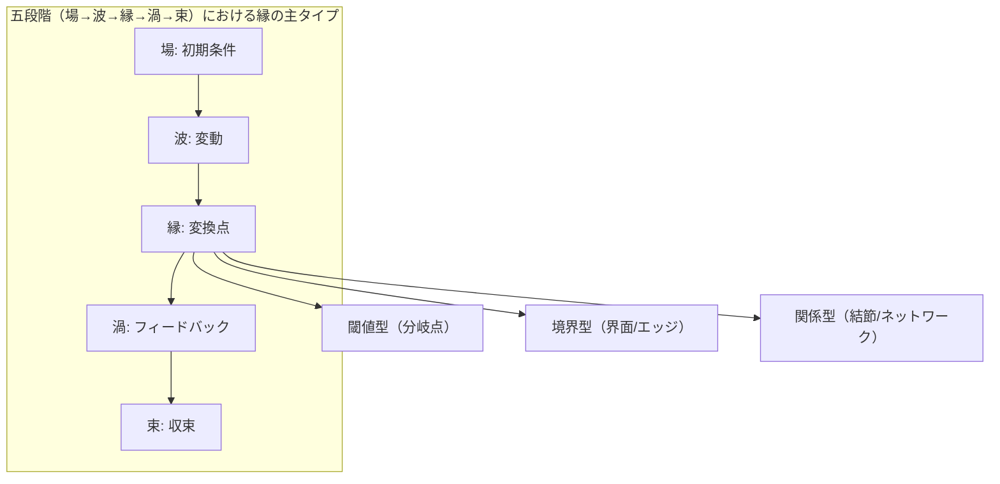
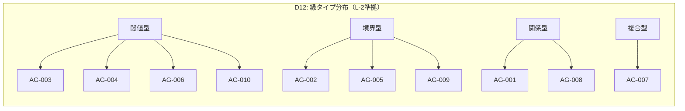

# REVIEW 農学・生態学

[Download REVIEW-D12-agriculture.md](sandbox:/mnt/data/REVIEW-D12-agriculture.md)

## 実行サマリー

本レビューは、`evidence-D12-agriculture.md`（D12: 農学・生態学、10エントリ＋Lレベル）について、REQの要求に沿って **文献実在・内容精度（[P]）**、**五段階（場→波→縁→渦→束）へのマッピング妥当性（[M]）と縁フラグ判定**、**牽強付会リスク**、**見落とし候補**、**Lレベル品質と信頼度**を検証したものです。レビュー日は 2026-03-04（JST）です。

結論として、**主要理論の選定・構造（D12として「閾値型・境界型・関係型」が揃う設計）は概ね妥当**です。一方で、**文献書誌情報の誤り（P0）**が複数あり、Phase 3（GPTレビュー）として最優先で修正すべきです。特に以下は **P0（要修正）**です。

- **AG-002**: 引用が「Robertson & Vitousek (2009) *Ecological Applications* 19(5):1059–1066」となっていますが、主要レビューとして一般に参照されるのは **Annual Review of Environment and Resources 34:97–125**の論文です（DOI 10.1146/annurev.environ.032108.105046）。現状の書誌は一致しません（「不一致」が強く疑われます）。citeturn37search2turn37search6turn6view1  
- **AG-010**: Briske et al. (2003) のページ・号が誤っています。該当DOI（10.1046/j.1365-2664.2003.00837.x）は **Journal of Applied Ecology 40:601–614**（少なくとも多くの標準的書誌でそのように扱われています）で、現ファイルの「40(3) 494–507」と整合しません。citeturn32search0turn32search3  
- **AG-010の日本語関連文献**: 「日本草地学会誌 56(1) 61–69 DOI:10.14941/grass.56.61」は **同定不能**でした（同一書誌・DOIを一次的に突合できず、現時点では“未検証/不確実”）。このまま残すと[P]層の信頼を損ねます（差し替え or DOI/URLの再特定が必要）。citeturn15search7turn19search0  
- **IPMの制度化（AG-003）**: 「農林水産省がIPM実践指針を整備」は方向性として妥当ですが、同ページ上で **当該指針は新ガイドライン策定に伴い廃止**されたことも明示されています。レビュー文では「制度化」の記述に **改訂史（廃止・置換）**を追記すべきです。citeturn33view1turn33view0  

縁フラグ（🔴/🟡）は、全体として **「縁＝理論の核」か「縁＝派生的」か**で整合的に運用されています。とくに指定評価対象の **AG-005（🔴）・AG-009（🟡）・AG-007（🟡）の差**は概ね妥当ですが、AG-009は「境界型」である以上、**縁の定義（境界条件の再配置）をもう一段具体化**しないと、読者には牽強付会に見えるリスクが残ります（P1）。

## P層の正確性

**判定**: **要修正（P0あり）**。理論骨格は正確なものが多いが、書誌不整合（AG-002, AG-010）と未検証和文引用（AG-010）が残る。

**優先度**: **P0（要修正）＋P1（改善推奨）**。

### 所見

**検証した主要原典・公式文書（一次・公式を優先）**  
- entity["people","J. H. Connell","ecologist succession models"] & entity["people","R. O. Slatyer","ecologist succession models"] (1977) “Mechanisms of Succession in Natural Communities and Their Role in Community Stability and Organization”（DOI 10.1086/283241）citeturn37search0turn38view1  
- entity["people","C. S. Holling","ecologist resilience theory"] (1973) “Resilience and Stability of Ecological Systems”（DOI 10.1146/annurev.es.04.110173.000245）citeturn28search3turn36view0  
- entity["people","G. Philip Robertson","ecosystem ecologist nitrogen"] & entity["people","Peter M. Vitousek","biogeochemist nitrogen cycle"] (2009) “Nitrogen in Agriculture: Balancing the Cost of an Essential Resource”（DOI 10.1146/annurev.environ.032108.105046）citeturn37search2turn37search6  
- entity["people","V. M. Stern","entomologist integrated control"] ら (1959) “The integrated control concept”（Hilgardia; DOI 10.3733/hilg.v29n02p081）citeturn21search3turn37search17  
- entity["people","L. P. Pedigo","entomologist economic thresholds"] ら (1986) “Economic injury levels in theory and practice”（DOI 10.1146/annurev.en.31.010186.002013）citeturn0search1turn39view0  
- entity["people","Marten Scheffer","ecologist regime shifts"] ら (2001) “Catastrophic shifts in ecosystems”（Nature; DOI 10.1038/35098000）citeturn37search11turn37search15  
- entity["people","Stephen R. Carpenter","limnologist ecosystem ecology"] & entity["people","William A. Brock","economist early warning"] (2006) “Rising variance: a leading indicator of ecological transition”（Ecol. Lett.; DOI 10.1111/j.1461-0248.2005.00877.x）citeturn21search5turn21search1  
- entity["people","Mary L. Cadenasso","ecologist boundary theory"] ら (2003) “A Framework for a Theory of Ecological Boundaries”（DOI 10.1641/0006-3568(2003)053[0750:AFFATO]2.0.CO;2）citeturn22view0  
- entity["people","Laurance Ries","ecologist edge effects"] ら (2004) “Ecological Responses to Habitat Edges …”（DOI 10.1146/annurev.ecolsys.35.112202.130148）citeturn22view1  
- entity["people","Kimberly A. With","landscape ecologist connectivity"] & entity["people","Thomas O. Crist","ecologist landscape thresholds"] (1995) “Critical thresholds …”（Ecology; DOI 10.2307/2265819）citeturn9view0  
- entity["people","C. A. Klausmeier","ecologist pattern formation"] (1999) “Regular and irregular patterns in semiarid vegetation”（Science; DOI 10.1126/science.284.5421.1826）citeturn25view0  
- entity["people","Max Rietkerk","ecologist dryland patterns"] ら (2002) “Self-organization of vegetation in arid ecosystems”（Am. Nat.; DOI 10.1086/342078）citeturn25view1  
- entity["people","J. von Hardenberg","physicist vegetation patterns"] ら (2001) “Diversity of vegetation patterns and desertification”（Phys. Rev. Lett.; DOI 10.1103/PhysRevLett.87.198101）citeturn25view2  
- entity["people","James D. Bever","ecologist plant soil feedback"] (1994) “Feedback between plants and their soil communities in an old field community”（Ecology; DOI 10.2307/1941601）citeturn9view1turn3search10  
- entity["people","John N. Klironomos","ecologist soil biota"] (2002) “Feedback with soil biota contributes …”（Nature; DOI 10.1038/417067a）citeturn25view3  
- entity["people","Clive G. Jones","ecologist ecosystem engineers"] ら (1994, 1997) “Organisms as ecosystem engineers” / “Positive and negative effects …”（DOI 10.2307/3545850; DOI 10.1890/…）citeturn24view0turn24view2  
- entity["people","Mark Westoby","ecologist rangeland stm"] ら (1989) “Opportunistic management for rangelands not at equilibrium”（DOI 10.2307/3899492）citeturn27search6turn27search0  
- entity["people","David D. Briske","rangeland ecologist"] ら (2003) “Vegetation dynamics on rangelands: a critique of the current paradigms”（DOI 10.1046/j.1365-2664.2003.00837.x）citeturn32search0turn32search3  
- entity["organization","USDA Natural Resources Conservation Service","conservation agency us"] “National Ecological Site Handbook (Part 631)”（STMの位置づけ）citeturn33view4  
- entity["organization","農林水産省","ministry agriculture japan"]「総合的病害虫・雑草管理（IPM）実践指針」関連ページ（廃止・置換の注記含む）citeturn33view1turn33view0  
- entity["organization","J-STAGE","japanese journal platform"]: 日本草地学会誌の巻号ページ（和文引用の再同定に必要）citeturn19search0turn19search1  

本ファイルの主張のうち、REQで重点確認対象となっている論点は概ね裏取りできました。

- **生態遷移の3メカニズム（促進・耐性・阻害）**は、Connell & Slatyer (1977) 本文内で3モデル（facilitation / tolerance / inhibition）として明示されています。citeturn38view1turn37search0  
- **レジリエンス概念（Holling 1973）**は、同論文内で「関係の持続（persistence）」「撹乱や状態変数変化を吸収しても関係が維持される能力」として定義されています（ここでは“resilience determines the persistence…”の定義部を根拠に要約）。citeturn36view0turn28search3  

- **EIL/ET定義（Pedigo et al. 1986）**は、(a) EIL を「経済的損失と防除コストが釣り合う水準（最小の害虫密度）」として扱い、(b) ET を「増加中の害虫個体群がEILに到達するのを防ぐために防除を開始する判断密度」と定義しており、ファイルの要約は整合的です。citeturn39view0turn38view0  
  - ただし、AG-003の[P]で「Stern et al. (1959)」にEILモデルを帰属させる書き方は、Pedigo本文が「経済閾値の最も受け入れられた形はSternら」と位置づけていることと整合しますが、**EIL/ETの定義引用はPedigo側に寄せて明確化**すると誤読が減ります。citeturn39view0turn21search19  

- **レジームシフト（Scheffer et al. 2001）**は、Natureの総説として“突然の状態転換・閾値（tipping point）・早期警告の難しさ”等を扱う論文であり、ファイルの要約は妥当です。citeturn37search11turn37search15  
  - Scheffer & Carpenter (2003) は「閾値に達するまで漸進変化の影響が小さく、越えると大きな転換・復元困難」という含意を明示し、ファイルの主張（ヒステリシス等）に整合します。citeturn22view3  

- **景観コネクティビティ／パーコレーション（With & Crist 1995）**は、パーコレーション閾値付近での不連続応答を扱う文脈が明示されています（PDF冒頭の記述・図示により確認）。citeturn9view0turn22view2  

- **乾燥地植生パターン（Klausmeier 1999）**は、半乾燥地での規則縞・不規則モザイクを、植物と水のダイナミクスモデルとして説明しうる旨が要旨に示されています。citeturn25view0  
  - von Hardenberg et al. (2001) は、降水に応じたパターン遷移と多重安定状態の共存を要旨で明示しています。citeturn25view2  

- **状態–遷移モデル（STMs）**は、Westoby et al. (1989) が「非平衡レンジランドにおける管理枠組み」として提示した文脈と整合します。DOIと書誌は複数の標準的データベースで一致します。citeturn27search6turn27search0  
  - USDAに関しては、NRCSのNational Ecological Site Handbook（Part 631）が「STMは生態サイトの時間動態を記述する推奨方法で、複数状態と遷移（しばしば閾値を含む）を示す」と明記しており、「採用」の根拠として十分です。citeturn33view4  

一方で、以下は書誌・同定の面で重大な不整合が残っています。

| ID | 現ファイルの参照 | 検証結果 | 影響 |
|---|---|---|---|
| AG-002 | Robertson & Vitousek (2009) *Ecol. Appl.* 19(5) 1059–1066 | **書誌不一致の疑いが強い**。窒素に関する代表的総説としては *Annual Review of Environment and Resources* 34:97–125（DOI 10.1146/annurev.environ.032108.105046）が確認できる | [P]層の根拠が揺らぐ（引用差し替えが最優先） |
| AG-010 | Briske et al. (2003) *J. Appl. Ecol.* 40(3) 494–507 | DOI 10.1046/j.1365-2664.2003.00837.x は **40:601–614**として流通（書誌不一致） | DOIは合っているが巻号ページが誤り |
| AG-010 | 日本語関連（草地学の閾値概念整理） DOI:10.14941/grass.56.61 | **同定不能（未検証）**。J-STAGE上では同巻同号に複数記事があるが、提示DOIに対応する記事を確認できず | そのままでは“架空引用”疑義 |

### 修正提案

P0（要修正）として、次の編集を推奨します（“差し替え”は最小限の具体案です）。

- **AG-002（P0）**  
  - refs を以下へ差し替え（または追加して主根拠を移す）:  
    - Robertson & Vitousek (2009) “Nitrogen in Agriculture: Balancing the Cost of an Essential Resource”, *Annual Review of Environment and Resources* 34:97–125, DOI 10.1146/annurev.environ.032108.105046 citeturn37search2turn37search6  
  - 本文の[P]は維持可能だが、「二目的最適化」を言うなら、同総説の“政策・管理含意”節（N損失、コスト、外部性）に寄せて要約の精度を上げるとよい。citeturn37search6  

- **AG-010（P0）**  
  - Briske et al. (2003) の巻号ページを **40:601–614**へ修正（DOIは維持）。citeturn32search0turn32search3  
  - 「日本語関連」文献は、**(a) DOI/URLを再特定できるまで一旦削除**、または **(b) J-STAGE上の実在記事に置換**（例: 同巻同号の実在記事を明示し、DOIもJ-STAGEの表示値を採用）を推奨。citeturn15search7turn19search0  

- **AG-003（P1）**  
  - 農林水産省IPMは“整備・普及”の根拠として妥当だが、「指針は廃止され新ガイドラインへ移行」の但し書きを追記し、現行性を担保する。citeturn33view1turn33view0  

## 五段階マッピング妥当性と縁判定

**判定**: **概ね妥当（ただしP1の調整余地あり）**。縁フラグは「理論の核が縁かどうか」で整理されており、全体の整合性は高い。個別に“縁の定義が抽象的で牽強付会に見えうる箇所”がある。

**優先度**: **P1（改善推奨）**（AG-002, AG-005, AG-009中心）。

### 所見

#### 全体整合

本ファイルの五段階対応は、概ね次のパターンで統一されています。

- **場**: 初期条件（環境テンプレート、資源プール、基礎状態）
- **波**: 変動（撹乱、ノイズ、外生条件変動、個体群変動）
- **縁**: 変換点（閾値＝分岐点、界面＝フロー変換、関係の結節点）
- **渦**: フィードバック（自己強化/自己抑制、管理サイクル）
- **束**: 収束（状態・パターン・制度・プロトコルとしての定着）

この統一は、境界研究の枠組み（境界がフローを変換する“機能要素”であること）にも整合します。citeturn22view0turn22view1  

#### 縁フラグ（🔴/🟡）の妥当性

指定された3件に焦点を当てて差分理由を明確化します。

| 観点 | AG-005 境界理論（🔴） | AG-009 生態系エンジニア（🟡） | AG-007 乾燥地パターン（🟡） |
|---|---|---|---|
| 理論の中心変数 | **境界そのもの**（patch contrast / flow / boundary nature）citeturn22view0 | 中心は「生物による物理改変」。境界は“結果として”現れる（ビーバーダム等）citeturn24view0turn24view2 | 中心は**自己組織化フィードバック**とパターン形成（Turing-like など）citeturn25view0turn25view2 |
| 閾値（分岐） | 文脈依存だが、境界機能の変化点は論じやすい（ただし枠組みは一般論）citeturn22view0 | 明示的な“分岐点”は通常扱わない（例示次第） | 分岐はあるが、説明の重心は「渦→束」（自己組織化→パターン） |
| 🔴/🟡の妥当性 | 🔴妥当（縁＝理論核） | 🟡は妥当寄り。ただし“縁の具体物”を増やすと🔴へ上げ得る | 🟡妥当（渦が核、縁は二次） |

**結論**:  
- **AG-005が🔴で、AG-009が🟡**という差は、「縁の“中心性（主変数か、派生か）”」という基準に照らすと妥当です。AG-005は境界を一般化して“何を測るべきか（patch contrast / flow identity / boundary nature）”まで提示しています。citeturn22view0  
- **AG-007が🟡**である点も妥当です。Klausmeierの要旨はパターン形成の数理（Turing-like不安定性）を前面に置き、縁（分岐条件・パッチ境界）は存在するものの、説明焦点は“渦（フィードバック）→束（空間パターン）”です。citeturn25view0turn25view2  

#### 牽強付会リスクが見える箇所（P1）

- **AG-002（窒素循環）**: 「縁＝根圏・微生物・土壌粒子の界面」は“境界型”として理解可能だが、窒素循環の核心を「界面」に集約すると、読者が「縁＝場所」と誤解する危険がある。Robertson & Vitousek (2009) は農業窒素の利得と外部性（損失）を包括的に扱うため、**縁を“プロセス制御点（ホットスポット）”として書く**ほうが自然。citeturn37search6  
- **AG-009（生態系エンジニア）**: 「構造物が生む境界条件の再配置」を縁とするのは筋が通るが、Jonesらの定義は“資源利用可能性を変える物理状態変化”であり、境界条件に限定されない。まず「物理状態変化＝環境の設計変更」を主語にして、その結果としての境界（例: 湿地/流水の境界、巣穴周辺の土壌通気境界）を例示すると、牽強付会に見えにくい。citeturn24view0turn24view2  
- **AG-005（境界理論）**: 五段階のうち「渦」「束」を“境界が自己強化するメカニズム”として書いている点は、枠組み論文の射程からは一段推論になる可能性がある。境界がフローを変換することまでは明示されるが、自己強化ループはケース依存なので、**[M]（構造類似）として明確に切り分ける**とよい。citeturn22view0turn22view1  

### 修正提案

縁フラグそのもの（🔴/🟡）の全面変更は不要ですが、[M]の記述を「論文が明示する範囲」と「類推」を分ける編集を推奨します。

- **AG-002（P1）**: 五段階対応の「縁」を「界面」だけでなく、以下のように追記  
  - 例: **縁＝反応・輸送の結節（ホットスポット/ホットモーメント）**（根圏、微小酸素勾配、湿潤乾燥遷移、管理介入点）  
- **AG-005（P1）**: 「渦」「束」を [P]ではなく [M]寄りに整理し、本文に「境界の自己強化は系依存」という但し書きを追加（枠組み論文の整合性を置く）。citeturn22view0  
- **AG-009（P1）**: 「縁＝境界条件の再配置」を、Jones (1994, 1997) の“物理状態変化→資源利用可能性変化”の定義に寄せ、具体例を2つ入れる（例: ダムによる水理境界、巣穴による土壌気相境界）。citeturn24view0turn24view2  





## 見落とし候補

**判定**: **追加候補あり（P1）**。現10件は「縁」中心性でよく揃っているが、D12の“管理介入”をもう一段強く説明できる候補が残る。

**優先度**: **P1（改善推奨）**。

### 所見

現ファイルが「除外候補」として挙げた4件（ニッチ構築、メタコミュニティ、ストレス勾配仮説、CLORPT/ペドジェネシス）は、重複・対応緩さ・中心性の観点から除外理由が説明されています（L-4）。一方で、D12の特徴（管理介入・不確実性・学習サイクル）を補強する観点で、次の理論が候補になります。

- **適応的管理（Adaptive Management）**: 管理＝仮説検証としての学習過程を中心に据える枠組みで、IPMやSTMsと“制度化された渦”を同一系列に置ける。entity["people","Carl J. Walters","ecologist adaptive management"] (1986) は「管理を継続的・実験的プロセスとして扱う」ことを主題としており、D12のレンズ③を補強します。citeturn28search1turn28search21  
- **パナ―キー／適応サイクル（Panarchy / Adaptive Cycle）**: 撹乱と再編成を含む複数スケール循環の枠組みで、AG-001（遷移）・AG-004（レジーム）・AG-010（STMs）を“上位統合（束）”として束ねやすい。entity["people","Lance H. Gunderson","ecologist panarchy"] & Holling (2002) の書誌が確立している。citeturn28search20turn28search16  

いずれも「縁」が必ずしも単体の閾値/境界ではなく、**“どの状態に留まり、いつ放出・再編成するか”**という管理判断に現れるため、D12の“縁の制度化/構築性”保持論点（L-4）とも整合します。

### 修正提案

- 10件の枠は維持しつつ、L-4「保持論点」か、別途「候補リスト（未採用）」に **Adaptive Management / Panarchy** を追記する（採否はpjdhiro判断）。  
- 追加する場合は、**AG-003（IPM）・AG-010（STMs）と一緒に“管理サイクル系”として配置**すると、D12の農学寄り比重も上げられる。

## Lレベルの質

**判定**: **概ね良好（ただしP1・P0の修正点あり）**。分析の骨格は明確だが、比較主張（「唯一」）と、未検証文献が混在するとL-1〜L-5全体の説得力が落ちる。

**優先度**: **P0（未検証文献の除去/再特定）＋P1（表現調整）**。

### 所見

- **L-1（領域サマリー）**  
  - 「閾値型・境界型・関係型が揃う」という“ドメイン内特徴づけ”は、L-2表の分類と整合しています（内部整合）。  
  - ただし「唯一のドメイン」という比較主張は、他ドメイン一覧が提示されていないため **本ファイル単体からは検証不能**です（未指定扱いにするべき）。  

- **L-2（縁マッピング詳細）**  
  - 型分類は全体として妥当。特にAG-006を「閾値+接続型」とする整理は、パーコレーション閾値（分岐）と接続性（ネットワーク）を同時に扱う点で腑に落ちます。citeturn9view0turn22view2  
  - 改善点は、AG-007の「分岐+境界型」を“どちらが主か”補足すること。現在は本文で「渦が重心」と説明しているため、表にも注記を入れるとL-2だけ見た読者が迷わない。

- **L-3（評価レンズ横断分析）**  
  - レンズ①〜③のまとめは、各エントリの説明と矛盾がなく、D12が“フィードバック”を強く押している点が明確。  
  - 実務的には、レンズ③を「制度化（IPM/STMs）」「設計（バッファー/景観）」「予測（早期警告/砂漠化）」の3群に束ねると、読みやすさが上がる。

- **L-4（保持論点）**  
  - [非常識]2件は価値が高い。  
    - 「縁の制度化」は、Stern–Pedigo系列の意思決定閾値（ET）と、NRCSのSTM（閾値・状態遷移）を並べることで、確かに“設計される縁”を抽出できる。citeturn39view0turn33view4  
    - 「縁の構築性」は、Jonesらが示す“物理状態変化による資源可用性の変更”が、境界を自ら創出する生物の存在を支持する。citeturn24view0turn24view2  
  - ただし「非常識」というラベルは読者によってはノイズになる可能性があり、表現を「仮説」「新規視点」へ弱める選択肢はあります（P2）。

- **L-5（次ステップ）**  
  - 方針は現実的。特に「縁🔴エントリの3条件検証」→「P0修正→P1改善→フラグ更新」は良い。  
  - ここに **AG-002/AG-010の書誌修正**と **未検証和文の扱い**を明示すると実行性が上がります。

### 修正提案

- **L-1（P1）**: 「唯一のドメイン」を「本ドメイン内では3タイプが揃い、縁の多様性が高い」に弱める（比較主張を避ける）。  
- **L-2（P1）**: AG-007行に「重心: 渦（自己組織化）」注記を追加。  
- **L-5（P0/P1）**: 「AG-002参照の修正」「AG-010日本語関連の再同定/削除」「Briske(2003)書誌修正」を明記する。

```mermaid
flowchart TD
  start["レビュー開始"] --> extract["エントリ抽出（10件 + L群）"]
  extract --> pcheck["[P] 文献実在・DOI・要旨照合"]
  pcheck --> mmap["[M] 五段階マッピング整合性チェック"]
  mmap --> edgeflag["縁フラグ（🔴/🟡）の妥当性評価"]
  edgeflag --> lcheck["L群（サマリー/マッピング/レンズ/保持/次ステップ）整合性"]
  lcheck --> trust["信頼度（上げ下げ）提案"]
  trust --> end["レビュー結果（P0→P1→P2）"]
```

## 信頼度の妥当性と総合評価

**判定**: **要修正（P0起因で一部は据え置き）**。書誌P0を正せば、多くのエントリは「高」へ引き上げ可能。一方、未検証和文・抽象度の高い[M]は慎重に扱うべき。

**優先度**: **P0（書誌修正）→P1（表現調整）**。

### 所見

現状は全10件が「信頼度: 中（GPTレビュー未済）」です。今回の検証結果から、**“高へ上げられる候補”**と**“上げにくい/下げる候補”**は次の通りです。

| ID | 現状 | GPTレビュー後の推奨 | 根拠（要約） |
|---|---|---|---|
| AG-001 | 中 | 高 | 3モデルの一次確認、レジリエンス定義確認 citeturn38view1turn36view0 |
| AG-002 | 中 | 中（修正後に高可） | 書誌P0修正が前提 citeturn37search2turn37search6 |
| AG-003 | 中 | 高（追記後） | ET/EIL定義確認、MAFFの制度化確認（ただし“廃止/置換”追記） citeturn39view0turn33view1 |
| AG-004 | 中 | 高 | Scheffer系列の根拠強い citeturn37search11turn22view3 |
| AG-005 | 中 | 高 | 枠組みの抽象度は高いが一次要旨で主要概念確認 citeturn22view0turn22view1 |
| AG-006 | 中 | 高 | パーコレーション閾値の説明確認 citeturn9view0turn22view2 |
| AG-007 | 中 | 高 | Klausmeier/PRL要旨で主要主張確認 citeturn25view0turn25view2 |
| AG-008 | 中 | 高 | Bever/Klironomosの主張確認 citeturn9view1turn25view3 |
| AG-009 | 中 | 中〜高 | 定義は強いが“M側の縁定義”を具体化しないと誤解余地 citeturn24view0turn24view2 |
| AG-010 | 中 | 中（修正後に高可） | Briske書誌のP0修正、和文引用の再同定が前提。STM採用はNRCS文書で裏付け citeturn32search0turn33view4 |

### 修正提案

- **信頼度「高」への引き上げ条件を明文化**すると運用が安定します。例:  
  - (1) DOI/書誌が一次ソースで一致  
  - (2) [P]主要主張が一次要旨/本文で確認できる  
  - (3) [M]は推論域を明確にし、牽強付会注意書きがある  
- **AG-002 / AG-010**は、P0修正が完了するまで“中”据え置きが妥当。  
- **AG-009**は、縁の実装例を増やす（境界の具体）ことで“高”へ上げられる余地がある。

## 付録：差分パッチ案（最小修正）

以下は、P0中心の“最小差分”案です（内容改稿より先に、まず根拠の足場を安定させる目的）。

```diff
--- a/evidence-D12-agriculture.md
+++ b/evidence-D12-agriculture.md
@@ EV-AG-002 refs
-  - Robertson, G. P., & Vitousek, P. M. (2009). *Ecol. Appl.*, 19(5), 1059-1066.
+  - Robertson, G. P., & Vitousek, P. M. (2009). *Annual Review of Environment and Resources*, 34, 97-125. DOI: 10.1146/annurev.environ.032108.105046

@@ EV-AG-010 refs
-  - Briske, D. D., et al. (2003). *J. Appl. Ecol.*, 40(3), 494-507. DOI: 10.1046/j.1365-2664.2003.00837.x
+  - Briske, D. D., et al. (2003). *Journal of Applied Ecology*, 40, 601-614. DOI: 10.1046/j.1365-2664.2003.00837.x

-  - 日本語関連: 草地学における閾値概念の整理. *日本草地学会誌*, 56(1), 61-69. DOI: 10.14941/grass.56.61
+  - 日本語関連: （要再同定）J-STAGE上で実在記事のタイトル/DOIを再確認できるまで一旦保留（削除 or 置換）
```