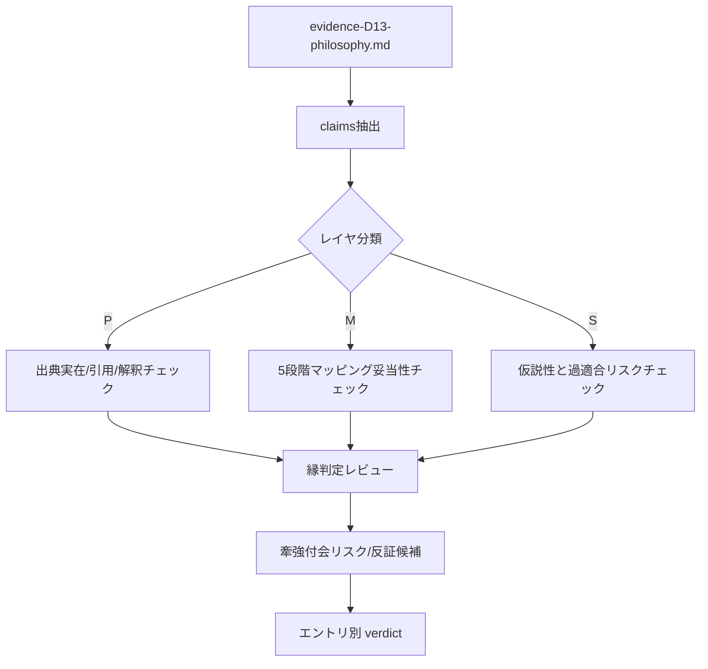

# REVIEW-D13-philosophy.md

## エグゼクティブサマリー

本レビューは、/mnt/data/evidence-D13-philosophy.md の「D13哲学」エビデンスを対象に、各主張（claims）を抽出し、(P)出典精度、(M)5段階モデルへのマッピング妥当性、(縁)第3段階に関する判定の妥当性、牽強付会リスク、欠落候補/反証可能性の5観点で精査した。

結論として、**全11エントリのうち9件は公開・採用可能域（ただし大半はP1=改善推奨）**であり、**2件はCA（要議論）維持が妥当**だった。特に、反省的思考の「5ステップ」を一次文献で明示するデューイは、5段階モデルの“段階数合わせ”批判に対する強いアンカーになる。citeturn9view0turn21view0 また、ガダマー（問い／地平融合）とメルロ＝ポンティ（可逆性／交叉配列）は「縁」を“境界での出来事”として厚く記述しており、縁の根拠として強い。citeturn10view3turn15view0turn12view4 パースのアブダクションは、縁＝「驚き→仮説」の生成点を論理学的に明確化できる。citeturn19view0turn13view0

一方でCA（要議論）になっているシェリングとドゥルーズ＝ガタリについては、**抽象度が高すぎて“何にでも当たる”**／または**段階化そのものへの内在的抵抗**が強く、対応付けを「指し示し」以上に強く主張すると牽強付会になりやすい。citeturn27view0turn14view0

証拠ファイル上の集計（読み替えを含む）を、レビュー側で再整理すると次の通り。

- triage（証拠ファイル記載）: Accept 9 / CA 2
- 縁フラグ（全11）: 🔴 6 / 🟡 4 / ⚪ 1  
  ※証拠ファイルの「縁集計」はAcceptのみを母数にしている可能性が高く、その場合は 🔴 6 / 🟡 3 となる。

簡易チャート（全11、証拠ファイルの triage をそのまま表示）:

- Accept: ■■■■■■■■■ (9)
- CA:     ■■ (2)

## レビュー設計

**評価軸**

- (P) 出典精度: 参照文献の実在、引用の正確性（逐語／意訳）、解釈が文脈から逸脱していないか。
- (M) マッピング妥当性: 5段階モデル（場→波→縁→渦→束）への対応が、**段階数合わせ**や**同義語探し**に堕ちずに説明できているか。
- (縁) 第3段階判定: 証拠ファイルが採用する「縁の3条件」（関係網／未決定性／渦接続）を前提とし、その判定（🔴🟡⚪）が妥当かをレビュー側で再判定（🟢=妥当、🟡=一部留保、🔴=不適切）する。
- 牽強付会リスク: 抽象度が高すぎて後付け対応が可能になっていないか（タウトロジー化、強引なアナロジー化）。
- 欠落候補/反証: 反対方向の哲学（段階化拒否、反基礎づけ）や、同一哲学内の別解釈・反証候補が十分に扱われているか。

**外部照合の基本方針**

一次文献の逐語照合が可能なもの（例: デューイの一次テキスト）については、テキスト内の該当箇所を確認した。citeturn9view0 それ以外は、権威性の高い二次資料（entity["organization","Stanford Encyclopedia of Philosophy","online encyclopedia"]・entity["organization","Internet Encyclopedia of Philosophy","online encyclopedia"] 等）で、概念の所在と解釈の妥当域を確認した。citeturn10view2turn11view0turn12view4turn14view0turn15view2turn29view0  
※5段階モデル自体の厳密定義（必要条件・十分条件）が証拠ファイル外で与えられていないため、(M)は「モデルへの拘束条件を最小に仮定した場合」の評価である。

**対象エントリ**

人物（11エントリ、12名）:
- entity["people","ギルベール・シモンドン","philosopher 1924-1989"]
- entity["people","ジョン・デューイ","philosopher 1859-1952"]
- entity["people","アルフレッド・ノース・ホワイトヘッド","philosopher 1861-1947"]
- entity["people","フリードリヒ・W・J・シェリング","philosopher 1775-1854"]
- entity["people","エトムント・フッサール","philosopher 1859-1938"]
- entity["people","モーリス・メルロ＝ポンティ","philosopher 1908-1961"]
- entity["people","ハンス＝ゲオルク・ガダマー","philosopher 1900-2002"]
- entity["people","ジル・ドゥルーズ","philosopher 1925-1995"]
- entity["people","フェリックス・ガタリ","philosopher 1930-1992"]
- entity["people","チャールズ・サンダース・パース","philosopher 1839-1914"]
- entity["people","テオドール・W・アドルノ","philosopher 1903-1969"]
- entity["people","西田幾多郎","philosopher 1870-1945"]

**主要一次文献の実在性チェックに使ったソースキー**

以下は「証拠ファイルが参照する一次文献が実在する」ことの確認用キーであり、以降は原則としてコード（Sxx）で参照する（タイトルの反復を避けるため）。

- S01 entity["book","L'individuation à la lumière des notions de forme et d'information","simondon 2005 edition"] citeturn17view0
- S02 entity["book","How We Think","dewey 1910 book"] citeturn9view0
- S03 entity["book","Logic: The Theory of Inquiry","dewey 1938 book"] citeturn21view0
- S04 entity["book","The Quest for Certainty","dewey 1929 book"] citeturn20view0
- S05 entity["book","Process and Reality","whitehead 1929 book"] citeturn10view2turn11view0
- S06 entity["book","Erster Entwurf eines Systems der Naturphilosophie","schelling 1799 book"] citeturn27view0
- S07 entity["book","Von der Weltseele","schelling 1798 book"] citeturn28search6turn27view0
- S08 entity["book","System des transcendentalen Idealismus","schelling 1800 book"] citeturn27view0
- S09 entity["book","Darstellung meines Systems der Philosophie","schelling 1801 book"] citeturn27view0
- S10 entity["book","Analysen zur passiven Synthesis","husserl hua xi 1966"] citeturn15view2turn30search1
- S11 entity["book","Zur Phänomenologie des inneren Zeitbewusstseins","husserl hua x 1966"] citeturn15view3
- S12 entity["book","Erfahrung und Urteil","husserl 1939 book"] citeturn15view2
- S13 entity["book","Le visible et l'invisible","merleau-ponty 1964 book"] citeturn12view4turn30search9
- S14 entity["book","Phénoménologie de la perception","merleau-ponty 1945 book"] citeturn12view4turn31search1
- S15 entity["book","Wahrheit und Methode","gadamer 1960 book"] citeturn10view3turn30search7
- S16 entity["book","Mille plateaux","deleuze guattari 1980 book"] citeturn12view5turn14view0
- S17 entity["book","Qu'est-ce que la philosophie?","deleuze guattari 1991 book"] citeturn12view5
- S18 entity["book","Negative Dialektik","adorno 1966 book"] citeturn29view0turn12view0
- S19 entity["book","Dialektik der Aufklärung","horkheimer adorno 1947 book"] citeturn29view2
- S20 entity["book","働くものから見るものへ","nishida 1927 book"] citeturn24search4turn24search8
- S21 entity["book","西田幾多郎哲学論集 III: 自覚について 他四篇","iwanami bunko 1989"] citeturn26view0
- S22 entity["book_series","Collected Papers of Charles Sanders Peirce","harvard up 1931-58"] citeturn19view0

レビュー手順の全体像（概念図）:



## エントリ別判定と論点

**総合判定テーブル**

| entry | verdict | P | M | edge_flag | edge_acc | risk | note |
| --- | --- | --- | --- | --- | --- | --- | --- |
| EV-D13-001 | P1 | 🟡 | 🟢 | 🔴 | 🟢 | 中 | 一次文献の版・該当箇所の照合が不足。transduction/前個体性は外部資料で概念確認可。 |
| EV-D13-002 | Accept | 🟢 | 🟢 | 🔴 | 🟢 | 低 | 一次文献で5段階を明示。非線形性（1-2融合）も原典で確認可。 |
| EV-D13-003 | P1 | 🟡 | 🟡 | 🟡 | 🟢 | 中 | 語彙対応の恣意性を抑える必要。prehension/concrescence等は二次で補強。 |
| EV-D13-004 | 要議論 | 🟡 | 🔴 | ⚪ | 🟢 | 高 | 『縁』相当概念が弱く、極性=波で止まる。時期差/解釈多義性で過適合リスク高。 |
| EV-D13-005 | P1 | 🟡 | 🟡 | 🟡 | 🟢 | 中 | 現象学的射程（意味構成）と存在生成の差を明示した上で使う必要。 |
| EV-D13-006 | P1 | 🟡 | 🟢 | 🔴 | 🟢 | 中 | 『肉/可逆性/交叉配列』は強いが、引用の原文・版確認が未了。 |
| EV-D13-007 | P1 | 🟡 | 🟢 | 🔴 | 🟢 | 中 | 地平融合・問いの優位は二次で確認可。ページ指定の精度は要補強。 |
| EV-D13-008 | 要議論 | 🟡 | 🔴 | 🟡 | 🟢 | 高 | 段階化拒否が内在的反証。概念一般性が高く、何にでも当たる危険。 |
| EV-D13-009 | P1 | 🟡 | 🟢 | 🔴 | 🟢 | 低 | abductionの位置づけはSEPで確認可。CP番号引用・逐語の検証は追加推奨。 |
| EV-D13-010 | P1 | 🟡 | 🟡 | 🟡 | 🟡 | 中 | 非同一性/客体の優位は二次で確認可。星座=方法の一次根拠は補強余地。 |
| EV-D13-011 | P1 | 🟡 | 🟢 | 🔴 | 🟡 | 中 | 場所論理は強いが『場』のレベルがモデル射程を超える可能性。日本語一次資料への当たりを増やす。 |

凡例:  
- verdict: Accept=現状で採用可 / P1=改善推奨 / P0=要修正 / 要議論=CA維持  
- P: 出典精度（🟢強/🟡部分/🔴弱）  
- M: マッピング妥当性（🟢強/🟡部分/🔴弱）  
- edge_acc: 証拠ファイルの縁判定（🔴🟡⚪）が適切か（🟢妥当/🟡留保/🔴不適切）

**重要論点の注記**

EV-D13-002（デューイ）: 5段階の列挙が一次文献に明示され、かつ「第1・第2の融合」「非線形な往還」も本文で説明されるため、モデル全体の“線形誤解”を避けやすい。citeturn9view0turn21view0

EV-D13-003（ホワイトヘッド）: 「actual occasions（actual entities）」や「concrescence（growing together）」を、過程的生成として整理する二次資料が豊富で、場→束の循環として読む足場はある。citeturn10view0turn10view2turn11view0 ただし、語彙対応を強く言い切ると、モデル語の意味が拡張しすぎて恣意性が増える点に注意が必要。

EV-D13-005（フッサール）: 受動的時間化が自我に制御されない点は二次資料で明確に支持される。citeturn15view2turn15view3 ただし、現象学は存在論的コミットメントを括弧に入れるため、D13内の「分析生成 vs 存在生成」論点を残したまま使う必要がある。

EV-D13-006（メルロ＝ポンティ）: 「肉」「可逆性」「交叉配列」は、主客境界を“出来事”として扱う点で縁概念の厚い根拠になる（像としての“境界”ではなく、相互変容の“境界作用”）。citeturn12view4

EV-D13-007（ガダマー）: 理解を「地平の融合」と捉える点や、理解構造における「問い」の優位は二次資料で明示される。citeturn10view3turn15view0 D13のD1/D2と接続しやすい一方、存在論的生成への拡張は慎重さが要る。

EV-D13-009（パース）: アブダクションが「説明仮説形成」であり、驚き→仮説→演繹→帰納へと連結する枠組みは、パース研究の標準的整理に沿う。citeturn19view0turn13view0 逐語引用（CP番号やページ）については、一次テキストの版面照合を増やすとPが上がる。

EV-D13-010（アドルノ）: 非同一性と「客体の優位」は、否定弁証法の核心概念として二次資料が支える。citeturn13view2turn12view0 「束（固定化）への批判的制御」というD13内の機能付けは面白いが、星座的方法を一次文献に直接固定する補強があると説得力が増す。

EV-D13-011（西田）: 「場所の論理」と絶対無は、世界と概念形式の“包摂の場”として説明される。citeturn13view3turn12view1 また、「働くものから見るものへ」が1927年に刊行されたことは日本語書誌で確認できる。citeturn24search4turn24search8 ただし、絶対無の場所が5段階の「場」を“究極場”にまで引き上げる可能性があり、モデル側の「場のレベル」を明示して整合を取る必要がある。

## クレーム抽出テーブル

以下は claims（89件）をエントリ・通し番号で抽出し、タイトル等の反復を避けるために一部を「〈出典〉」に置換した要約一覧である。

| claim_id | layer | claim_clean |
| --- | --- | --- |
| EV-D13-001-01 | P | 個体化は質料形相論（hylomorphism）を拒否し、前個体的な準安定状態（metasta… |
| EV-D13-001-02 | P | transductionは「局所的な構造解決が隣接領域に伝播する操作」であり、操作原理である… |
| EV-D13-001-03 | P | 前個体的余剰（charge de realite pre-individuelle）は個体化… |
| EV-D13-001-04 | P | 情動（affectivite）は心的個体化の中核にあり、心的存在は自己内部だけでは問題系を解… |
| EV-D13-001-05 | P | 「認識もまた個体化されねばならない」——存在論と認識論は分離不可能（同書 Conclusion） |
| EV-D13-001-06 | M | 5段階と同じ射程（存在の創造そのもの）を記述する。前個体的場→ポテンシャル差（波）→tran… |
| EV-D13-001-07 | M | transductionは5段階全体の動力学に対応する。D1（欠損駆動思考）はその自己認識的現れ |
| EV-D13-001-08 | M | シモンドンの「情報（information）」はShannon情報ではなく、準安定系における… |
| EV-D13-001-09 | S | 意識下の「解決不能→問いの生成」と意識上の「意図的保持（抱持）」は同じ構造のスケ… |
| EV-D13-002-01 | P | 〈出典〉 (1910, ch.6) において反省的思考の「5つの論理的に区別されるステップ」… |
| EV-D13-002-02 | P | 第1・第2ステップは融合しうる——「不安や衝撃が先に来て、後から問題が明確化される場合がある… |
| EV-D13-002-03 | P | 〈出典〉 (1938, ch.6) では探究をより一般的に定式化: 「不確定な状況（inde… |
| EV-D13-002-04 | P | 「状況（situation）」の概念が重要。探究は対象物単体ではなく「全体的状況」を変換する… |
| EV-D13-002-05 | P | 〈出典〉 (1929) では「確実性の探求」＝束への過剰収束を批判。確実な“束”を求める形而… |
| EV-D13-002-06 | M | Deweyの探究過程は5段階とほぼ同型。困難/違和感の感受（場/波）→問題の定式化（縁）→… |
| EV-D13-002-07 | M | Deweyは5段階を線形段階ではなく循環として理解する。仮説の検証は新たな問題（波）を生み、探… |
| EV-D13-002-08 | M | D2（欠損）の解釈: Deweyの第1段階は「欠損の感受」。第5段階（検証）で欠損が解消され… |
| EV-D13-003-01 | P | 〈出典〉 (1929, Part I, ch.II) において 「actual entities (actual occasions)」を実在の最終単位として定義。「… |
| EV-D13-003-02 | P | 「creativity（創造性）」は究極概念であり、「many become one, and are increased by one」という生成公式を提示（PR, Part I, ch.II, §2） |
| EV-D13-003-03 | P | concrescence（con- + crescere = grow together）: 多から一への成長過程。生成は「decision（決定）」としての選択・排除を含む（PR, Part I, ch.II, §3） |
| EV-D13-003-04 | P | prehension（把握）: 他のactual entitiesを「感じ取る」関係的構成作用。主体-客体の二分ではなく、全ての実在が相互に内在的関係を持つ（PR, Part II, ch.IV） |
| EV-D13-003-05 | P | eternal objects（永遠の対象）: potentialityの領域。actual entitiesがその可能性を具体化することで「definiteness（規定性）」を獲得する（PR, Part I, ch.III） |
| EV-D13-003-06 | P | Godは「primordial nature」と「consequent nature」の二面を持つ。神は可能性（eternal objects）を秩序づけ、actual entitiesに「initial aim（初期目的）」を与える（PR, Part V） |
| EV-D13-003-07 | M | Whiteheadの形而上学は5段階の強い存在論的対応を持つ。creativity（場）→potentiality/eternal objects（波）→prehension（縁）→concrescence（渦）→satisfaction（束）→新たなprehensionの場へ循環 |
| EV-D13-003-08 | M | ただしD13의「束」理解との緊張: Whiteheadの束（satisfaction）は瞬間的完結であり、制度化・固定ではない。束は即座に「客観的に不死なデータ」として次の場へ入る。束→場循環が強い |
| EV-D13-003-09 | M | D2（欠損）との接続: initial aimは「欠損の方向づけ」の一種。現状の未決定性（欠損）に対し、可能性の秩序づけが「次に何を目指すか」を与える。ただし神導入がモデル一般性を損なう可能性 |
| EV-D13-003-10 | M | 縁フラグ🟡の根拠: prehensionは関係網(✓)だが、Whiteheadの生成は「決定」によって未決定性を縮減するため、縁を「未決定の界面」と捉えるかは解釈に依存（±） |
| EV-D13-004-01 | P | Schellingの自然哲学（Naturphilosophie, 1797-1800頃）で「自然は産出する（natura naturans）」という観点を強調。自然は静的対象ではなく動的な自己産出過程 |
| EV-D13-004-02 | P | 「極性（Polaritat）」: 自然の基本構造として対立する力が相互に条件づけ合う。磁気の両極がモデル。極性は自然の全階梯に貫かれる（S06, §...） |
| EV-D13-004-03 | P | Potenzen（潜勢態/力の階梯）: 自然は段階的に自己を展開する。機械→化学→有機→感覚→意識へと上昇する系列（S06, §§...） |
| EV-D13-004-04 | P | 世界魂（Weltseele）仮説: 自然全体を貫く統一的原理を想定。個物に内在するが個物を超える統一（S07） |
| EV-D13-004-05 | P | 同一性哲学（Identitatsphilosophie, 1801頃）: 主観と客観の根底に「絶対同一性」を置く。意識と自然は同一根源の二つの表現（S09） |
| EV-D13-004-06 | P | 芸術は「意識的と無意識的」の統一を示す。哲学が到達できない絶対を芸術が直観的に呈示する（S08） |
| EV-D13-004-07 | M | Schellingは5段階の「場→波」を強く支持する。自然の生産性（場）→極性/緊張（波）→階梯的展開（渦/束?）…ただし「縁」相当の多項関係網が弱い |
| EV-D13-004-08 | M | 縁フラグ⚪の根拠: 対立（極性）は二項関係に留まりがちで、多項的関係網の生成（縁条件1）を明示しない。未決定性（条件2）はあるが、渦への“界面”として整理しにくい |
| EV-D13-004-09 | M | したがって、SchellingはD13内で「波の哲学」として置くなら有効だが、縁中心の根拠として置くと牽強付会リスクが高い |
| EV-D13-005-01 | P | 〈出典〉 (講義1918-1926, Husserli...受動的発生（passive genesis）の層を体系的に記述。受動的総合は意識の「底層」で作動する、自我の関与なき連合的構造化 |
| EV-D13-005-02 | P | 連合（Assoziation）は類似性と隣接性に基づく受動的結合。感覚的データが自発的に対（pair）を形成し、群れを作り、背景から前景を分節する（Hua XI, §§16-20） |
| EV-D13-005-03 | P | 触発（Affektion）は「背景から際立つものが自我に向けて放つ力」。触発力は対象の際立ち（Abhebung, contrast）に比例する（Hua XI, §§32-35）。背景との差異が触発の条件——差異なければ触発なし |
| EV-D13-005-04 | P | 時間意識の三重構造: 原印象（Urimpression）→把持（Retention）→予持（Protention... 〈出典〉, 1893-1917, Hua X） |
| EV-D13-005-05 | P | 〈出典〉 (1939, posthumous, ed. L. Landgre...前述語的経験から述語的判断への移行を詳述: 基体の受容→説明的把握（内的地平の展開）→関係づけ→概念的規定（EU §§6-24） |
| EV-D13-005-06 | M | 受動的総合は5段階の「場→波→縁」の意識内プロセスとして記述可能。受動的背景（場）→触発による際立ち（波）→連合的結合・前述語的関係づけ（縁）→能動的総合の起動（渦）→述語的判断の確定（束） |
| EV-D13-005-07 | M | 触発（Affektion）はD2（欠損）と構造的に接続する。「背景との差異が触発の条件」は「予測と現実の誤差が意識化の条件」と構造同型。差異がなければ触発も欠損も生じない |
| EV-D13-005-08 | M | ただし重要な射程差がある: フッサールの記述は「意識における意味の構成」（分析生成）であり、「存在そのものの創造」（存在生成）とは記述レベルが異なる。フッサール自身は現象学的還元によって存在論的コミットメントを括弧に入れる（epoche） |
| EV-D13-006-01 | P | 〈出典〉 (1964, posthumous, ed. C. Le...ではない。この概念を指示するためには、水・大気・土・火というかつての元素という古い用語が必要となるだろう」（VI, p.184） |
| EV-D13-006-02 | P | 可逆性（reversibilite）: 触れる手が触れられもする。見る目が見られもしうる。主客の境界は固定的では...る者と触れられるものとの間の差異は消失しない......しかしそれは裂開（ecart）にすぎない」（VI, p.194-195） |
| EV-D13-006-03 | P | 交叉配列（chiasme）: 見えるものと見えないもの、触れるものと触れられるものが交差する構造。「私の身体はものの間にある一つのものではなく......見えるものが自らを見ることになるその折り目（pli）」（VI, p.179） |
| EV-D13-006-04 | P | 裂開（ecart）: 肉の内部における最小の差異・隔たり。分化を可能にする「ずれ」。可逆性は完全な一致ではなく、常にecartを含む |
| EV-D13-006-05 | P | 〈出典〉 (1945, Part I) で「身体図式」...。身体は対象世界の一部であると同時に世界への志向的投企の主体である。身体は「第三の存在様式」——純粋な主体でも純粋な客体でもない |
| EV-D13-006-06 | M | 「肉」は5段階の「場」に対応する前-区別的媒体。「裂開」（ecart）は「波」の発生——肉の内部における最小の差...性/交叉配列」は「縁」——主体と世界が接触し変容し合う界面。「表現」（身体の創造的形成作用）は「渦」。沈殿した文化的世界は「束」 |
| EV-D13-006-07 | M | ecart（裂開）の概念はD2（欠損）と構造的に接続する。ecartは「差異」であるが、否定的欠如ではなく生産的...があるからこそ触れ合いが可能になる。D2の「予測と現実の誤差」もまた、否定的エラーではなく創造的契機として機能する（D1の射程） |
| EV-D13-006-08 | M | 可逆性は5段階の「縁」の最も深い哲学的記述の一つ。「触れる者は触れられる」——境界における関係は一方向的ではなく、可逆的な相互変容。これは和辻哲郎の「間柄」（既存EV-PH-006）と構造的に共鳴する |
| EV-D13-007-01 | P | 〈出典〉 (1960, Teil II, Kap.2) において理解（Ver...zontverschmelzung）として記述。解釈者の地平とテキスト/他者の地平が出会い、融合することで新しい理解が生成される |
| EV-D13-007-02 | P | 先入見（Vorurteil）は理解の障害ではなく条件。「先入見のない理解は存在しない」（WM, p.270ff）。啓蒙主義の「先入見に対する先入見」を批判し、先入見の「生産的側面」を復権させた |
| EV-D13-007-03 | P | 効果史（Wirkungsgeschichte）: テキストの歴史的効果が後続の理解を規定する。解釈者は常にすでに...意識（wirkungsgeschichtliches Bewusstsein）はこの条件を自覚する態度（WM, p.305ff） |
| EV-D13-007-04 | P | 問いの構造: 「問い」（Frage）はテキストへの本来的なアクセスの形式。テキストが答えであるような問いを再構成することが理解の核心。問いは理解の条件であり帰結でもある（WM, Teil III, Kap.3） |
| EV-D13-007-05 | P | 対話の構造: 真の理解は対話（Gesprach）を通じて達成される。対話では「事柄そのもの」（die Sache selbst）が主導し、対話者は事柄に導かれる。「良い対話では、誰が正しかったかは問題にならない」（WM, p.387） |
| EV-D13-007-06 | M | ガダマーの解釈学は5段階の「解釈学的実現」として読める。前理解の地平（場）→テキスト/他者との出会いが前理解を揺...解釈学的循環の駆動（渦。部分と全体の往還が理解を生成する）→地平の融合（束。新たな拡大された地平が形成され、次の理解の場となる） |
| EV-D13-007-07 | M | 「問い」の概念はD1（欠損駆動思考）と直接的に接続する。「棄却される誤差を問いとして拾う」のD1と、「テキストが答えであるような問いを再構成する」ガダマーの解釈学的問いは、「問い」を起動力とする点で構造同型 |
| EV-D13-007-08 | M | 「先入見は理解の条件」はD2（欠損）の構造と接続する。先入見（予測）とテキスト（現実）の間の齟齬が理解を駆動する——これは「予測と現実の誤差」が創造を駆動するD2の解釈学的表現 |
| EV-D13-008-01 | P | 〈出典〉 (1980, "Introduction: Rhizome") でリゾーム概念を提示。リゾームは中心や階層を持たず、「どの点もどの点とでも接続可能」。連結性と異質性の原理（principles of connection and heterogeneity） |
| EV-D13-008-02 | P | 「アサンブラージュ（agencement/assemblage）」: 異質な要素の結合体。領土化（territorialisation）によって一時的にまとまり、脱領土化（deterritorialisation）によって解体し、再領土化で新たな形に再構成される（〈出典〉, plateau 6, 10など） |
| EV-D13-008-03 | P | 「内在平面（plan d'immanence）」: 思考が展開される場。哲学は概念を内在平面に配置する。内在平面は超越的原理を拒否し、「思考の条件」を思考内部に置く（〈出典〉, ch.2） |
| EV-D13-008-04 | P | 「線（lines）」と「逃走線（ligne de fuite）」: システムを貫く生成変化の動線。逃走線は既存の束（固定化）を解体し、新たな接続を生む |
| EV-D13-008-05 | P | 「生成変化（devenir）」: 固定的同一性ではなく差異的生成のプロセス。主体/客体の固定境界を解体する（Deleuze, 〈出典〉; D&G, 〈出典〉) |
| EV-D13-008-06 | M | ドゥルーズ＝ガタリは5段階モデルに対し、原理的に反線形的な批判を提供する。5段階が「線形段階」という理解ならリゾームはそれを拒否。だが5段階が「スペクトラム」なら部分的接続は可能 |
| EV-D13-008-07 | M | リゾームは「場」（思考の背景）でありつつ「縁」（接続の界面）でもある。どの点も接続可能であるという原理は「縁」を全域化する＝縁の特異性を失う危険 |
| EV-D13-008-08 | M | 5段階との整合は「領土化サイクル」として読むと成立: 場（内在平面）→波（逃走線/差異の噴出）→縁（アサンブラージュの新しい接続）→渦（生成変化の連鎖）→束（領土化による暫定的安定）。ただし束は常に可変で制度化しない |
| EV-D13-008-09 | M | 縁フラグ🟡: 関係網(✓)・未決定性(✓)は強いが、「縁→渦」の段階化そのものを拒否するため、縁をモデル第3段階として固定することに抵抗がある |
| EV-D13-009-01 | P | "The Fixation of Belief" (1877, 〈出典〉...信念（belief = habit of action）への移行」として記述。「疑いの不快が探究への唯一の直接的動機」(p.5) |
| EV-D13-009-02 | P | 疑い（doubt）は「実在する、生きた疑い」でなければならない。仮想的・哲学的疑いは探究を駆動しない（同論文 §IV） |
| EV-D13-009-03 | P | 信念の固定の4方法: 固執の方法（tenacity）、権威の方法（authority）、先験的方法（a priori）、科学の方法（method of science）。科学の方法のみが自己修正的である（同論文 §V-VIII） |
| EV-D13-009-04 | P | "How to Make Our Ideas Clear" (1878) でプラグマティズムの格率を定式化: 「...られる、実際上の帰結を生みうる効果の全てを考慮せよ。その場合、それらの効果についての概念が、その対象についての概念の全てである」 |
| EV-D13-009-05 | P | アブダクション（abduction, retroduction）: 演繹でも帰納でもない第三の推論形式。「驚くべ...ればCは当然の帰結→H が真であると仮定する理由がある」(CP 5.189, 1903)。仮説の生成を論理的操作として位置づけた |
| EV-D13-009-06 | P | 探究の三段階: アブダクション（仮説の生成）→演繹（仮説の含意の展開）→帰納（検証）。この三段階は循環的であり、...「探究の方法は自己修正的である。すなわち、もし方法が十分長く適用されれば、いかなる誤りも最終的に修正される」(CP 5.576) |
| EV-D13-009-07 | M | パースの探究論は5段階モデルとデューイ（#2）以上に精緻な対応を持つ。信念の安定状態（場）→疑い（波。「実在する...ープ（渦。仮説の含意の展開と検証の往還が「まとまり」を形成する）→信念の固定（束。新たな行動習慣が確立され、次の疑いの場となる） |
| EV-D13-009-08 | M | アブダクションはD1（欠損駆動思考）の論理学的定式化。「驚くべき事実」＝予測と現実の誤差。「仮説の生成」＝誤差を問いとして拾い、答えの候補を創出する操作 |
| EV-D13-009-09 | M | 「疑いの不快」はD2（欠損）の情動的側面と直接的に対応する。パース自身が「不快」（irritation）という情動的語彙を用いている——疑いは認知的状態であるだけでなく、情動的経験でもある |
| EV-D13-010-01 | P | 〈出典〉 (1966, Teil I "Verhaltnis zur Ontol...揚（Aufhebung）を拒否。弁証法は矛盾を肯定的統合（synthesis）に解消すべきではなく、矛盾を維持し続けるべきである |
| EV-D13-010-02 | P | 非同一的なもの（das Nichtidentische）: 概念に回収されないもの、概念を超過するもの。「対象は...p.161）。同一化思考（Identitatsdenken）は個別的なものを一般的カテゴリーに押し込め、非同一的なものを抑圧する |
| EV-D13-010-03 | P | 星座的配置（Konstellation）: 対象を一つの概念で捕捉するのではなく、複数の概念を対象の周りに配置す...法。「概念群が星座のように配置されることで、概念がその内部で実現しようと虚しく試みるものが照らし出される」（ND, p.162） |
| EV-D13-010-04 | P | 客体の優位（Vorrang des Objekts）: 主観主義に対して、客体は常に主体を超過する。認識は主体の構成に還元されない（ND, Teil III "Modelle"） |
| EV-D13-010-05 | P | 啓蒙の弁証法（〈出典〉, Horkheimer & Adorno, 1947）: 啓蒙（理性による支配）は自己を神話に転化させる。合理化の極致が非合理に至る |
| EV-D13-010-06 | M | アドルノの否定弁証法は5段階モデルの「束への過剰収束」に対する批判的装置として機能する。非同一的なもの（場。概念...念が対象を照らし出す。ただし完全な把握には至らない）→暫定的束（束。ただしこの束は常に再批判の対象であり、最終的統合を拒否する） |
| EV-D13-010-07 | M | アドルノの「束」は特異——それは本質的に暫定的であり、再解体可能（再脱-束-化）。5段階モデルの「束」が安定化・制度化を含意する場合、アドルノはその安定化自体を批判する。「束を束のまま放置してはならない」という哲学的命令 |
| EV-D13-010-08 | M | D3（抱持）との接続: 否定弁証法は「結論を出さずに矛盾を保持する」態度を哲学的に正当化する。抱持の「反射的に処理せず保持する」は、アドルノの「同一化に急がない」と構造同型 |
| EV-D13-011-01 | P | 「場所」論文（1926年、『哲学研究』掲載、後に『働くものから見るものへ』所収）において「場所」（basho）の... 有の場所（存在するものの場所）→相対的無の場所（意識の場所。対象を映す鏡）→絶対無の場所（自覚の場所。意識すら包む究極の場所） |
| EV-D13-011-02 | P | 「絶対矛盾的自己同一」（1939年論文『絶対矛盾的自己同一』）: 多と一、主観と客観は絶対的に矛盾しつつ自己同一...消されるのではなく、矛盾したまま同一性を保つ。「個物は個物の自己否定に於いて全体であり、全体は全体の自己否定に於いて個物である」 |
| EV-D13-011-03 | P | 「行為的直観」（1937年『哲学論文集 第三』所収「行為的直観」）: 知と作は分離不可能。自己は行為を通じて世界を知り、同時に世界を作る。「見ることは作ることであり、作ることは見ることである」 |
| EV-D13-011-04 | P | 「自己否定」が創造の原動力。自己が自己を否定することで、新しい自己が立ち上がる。「世界は自己否定的に自己自身を限定する」（『哲学論文集 第四』、1940年） |
| EV-D13-011-05 | P | 「無の自己限定」: 絶対無は自らを限定することで有の世界を産出する。無から有が生じるのではなく、無が自己を限定する過程が「生成」である |
| EV-D13-011-06 | M | 西田の「場所の論理」は5段階モデルの「場」概念に最も深い哲学的根拠を提供する。絶対無の場所は5段階の「場」の存在論的基盤——「まだ分かれていない」どころか、分かれること・分からないこと・分かれるものの全てを包む究極の場 |
| EV-D13-011-07 | M | 「絶対矛盾的自己同一」は5段階の「縁～渦」に焦点を持つ記述。矛盾する二つのもの（多と一、主と客）が分離しながら同...」（縁）から「一つのまとまりとして立ち上がる」（渦）への移行を記述する——ただし、西田的にはこれは「移行」ではなく同時的な出来事 |
| EV-D13-011-08 | M | 「自己否定」はD2（欠損）の存在論的根拠。予測と現実の誤差（D2）は、自己が自己を否定する契機——自己が自己と一致しないという経験——として読める。D1（欠損駆動思考）は西田的には「自己否定を創造の原動力として引き受ける態度」 |
| EV-D13-011-09 | M | 「行為的直観」はD13領域の「分析生成 vs 存在生成」レンズを無効化する。知と作が分離不可能であるなら、理解の生成と存在の生成は同じ出来事の二つの側面にすぎない |

## CA二件の精査

**EV-D13-004（シェリング）のCA**

受理条件（Acceptance conditions）:
- **適用範囲の縮小**: 5段階の全域対応ではなく、「場→波（生産性／極性／生起）」までを主対象にし、「縁」を補助論点に格下げする。
- **テキスト固定**: 前期自然哲学・同一性哲学・後期肯定哲学が混線しやすいため、どの時期のどのテキストを用いるかを固定し、引用箇所を狭くする（S06/S08/S09中心、S07は補助）。
- **縁の再定義をしない**: 「二項対立＝縁」といった短絡を避け、縁の3条件（多項関係網／未決定性／渦接続）を満たす実例を示せない限り、縁フラグを上げない。

CA妥当性評価:
- 証拠ファイルが示す通り、シェリングは自然を「生産性（productivity）」として捉え、自然が自己抑制して“産物”となる比喩など、過程的語彙は豊かである。citeturn27view0 しかし、この強みは主に「場→波」の力動性に集中しており、縁を「多項関係が成立しはじめる界面」として独立に主題化する根拠は薄い。
- したがって、**CAの主要因は抽象度（多義性）と縁不足**であり、現状のまま“5段階全域の実証的対応”として出すのは過適合リスクが高い。citeturn27view0

抽象化リスクがCAを駆動しているか:
- Yes。シェリング研究は解釈多様性が高く、同一語が異なる時期で機能を変える。二次資料側も「受容の争点の多さ」を明示している。citeturn9view2turn27view0

**EV-D13-008（ドゥルーズ＝ガタリ）のCA**

受理条件（Acceptance conditions）:
- **段階モデルとしての読解を放棄**: 5段階を「線形段階」ではなく「操作のスペクトラム／位相空間」として読み替える（証拠ファイルL-5の論点に沿う）。
- **焦点概念の限定**: 「リゾーム」「内在平面」「アサンブラージュ」等をまとめて“場～束”に対応させるのではなく、例えば「領土化／脱領土化／再領土化」周りに限定して、循環（束→場）として示す。citeturn14view2turn14view0
- **反証（内在的批判）を同梱**: ドゥルーズ＝ガタリ自身が「樹木的（階層的）モデル」への批判としてリゾームを提起しているため、段階化そのものが批判対象になりうる点を本文構造に組み込む（“支持”ではなく“緊張”として提示する）。citeturn14view0

CA妥当性評価:
- 二次資料は『千のプラトー』が「rhizome」として書かれており、任意の点を相互接続可能な構造であること、さらに領土化／脱領土化等の概念ネットワークが展開されることを述べる。citeturn14view0turn14view2 これは「関係網」条件の根拠たりうる。
- しかし、同じ根拠が“何にでも当たる”一般性を同時に生み、さらにリゾームは段階モデルを原理的に拒む方向性を持つため、5段階への対応付けを「説明」ではなく「翻訳」として提示しない限り、妥当性を損ねる。citeturn14view0turn12view5
- よって**CAは現状維持が妥当**で、受理するなら上記の適用範囲縮小と反証同梱が必須になる。

抽象化リスクがCAを駆動しているか:
- Yes。二次資料でも、構造が“どこからでも接続可能”であるため、百科事典的な要約自体が困難であると明言される。citeturn14view0

## 横断所見と欠落候補

**牽強付会リスクを下げる共通ガードレール**

「哲学」は抽象度が高く、**モデル側の語（場/波/縁/渦/束）を拡張し始めると、どの哲学も“当たって見える”**危険がある。これを抑えるため、少なくとも次を推奨する。

- **「縁」は多項関係＋未決定性＋渦接続の3条件を同時に要求**し、どれか欠ける場合は縁フラグを上げない（シェリングが示す“波止まり”はむしろ検出器として有益）。
- **分析生成／存在生成の射程差を明記**し、フッサール・ガダマー等（意味構成中心）を「存在論の根拠」と誤読しない。citeturn12view3turn10view3
- **“反証可能性”を添付**する: 例えば、ドゥルーズ＝ガタリの段階化拒否や、ガダマーの「理解は終わらない」見取りなど、モデルの限界を同時に示す。citeturn14view0turn10view3

**欠落候補と反証観点**

証拠ファイルL-1〜L-5が示す通り、D13内部には未解決の保持論点がある（「場」のレベル、分析生成vs存在生成、段階化拒否の扱い等）。citeturn13view3turn21view0  
レビュー観点では、次が「追加すると強くなる」候補である。

- **日本語一次文献の当たり増し**: 西田については、書誌（entity["organization","国立国会図書館サーチ","library catalog japan"]／entity["organization","CiNii","japan bibliographic service"]）と公開テキスト（entity["organization","青空文庫","japanese public domain"]カード等）は確認できたが、中心概念の根拠箇所をもう一段増やすとPが上がる。citeturn24search8turn24search4turn26view0
- **“段階モデル批判”の体系的導入**: CA2件だけではなく、段階化や統合（束）への批判を体系的に位置づけると、モデルの自己免疫（過剰一般化の抑止）が働く。アドルノの非同一性／客体優位はその導線になる。citeturn13view2turn12view0

```text
sandbox:/mnt/data/REVIEW-D13-philosophy.md
```