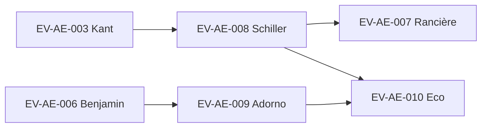

# evidence-D15-aesthetics.md 品質レビュー報告書

## エグゼクティブサマリー

本レビューは、添付の `evidence-D15-aesthetics.md`（10エントリ＋L-1〜L-5）を全文精読し、REQで指定された5観点（[P]正確性／牽強付会チェック／見落とし／L-1〜L-5の質／信頼度の妥当性）で、行番号に紐づく具体コメントと“差分が明確な修正案”を提示するものです（一般論・テンプレ・実行計画は含めません）。

最重要の修正点は次の3群です。  
第一に、**EV-AE-007（Rancière）で一次情報として扱われるべき書誌が誤っている**点です。具体的には「芸術の3レジーム」の最初が「倒理的」になっているタイポ（L275）と、日本語訳情報の訳者名が誤っている点（L278）です。後者は法政大学出版局の書誌（訳者：梶田裕）とCiNiiの書誌で不一致が確認できます。citeturn35view0turn2search3  
第二に、**L-1とL-2に集計・記述不整合**があります。L-1は🔴件数が本文内で矛盾し（L424）、L-2は「6タイプ」と言いながら8分類を列挙しています（L444）。  
第三に、**信頼度（全件“中”）のフラットさ**は、REQで指摘された通り差をつける余地が大きいです。特にEV-AE-005（Dewey）とEV-AE-008（Schiller）は一次テキスト上の対応が明確で、強度・検証可能性が高いため「高」相当へ引き上げる合理性があります（Deweyの“consummation”“doing/undergoing”“resistance and tension”は章抜粋で明示）。citeturn34view0turn34view1 一方、EV-AE-006（Benjamin）とEV-AE-007（Rancière）はファイル自身が渦・束対応の限定性を明記しており、少なくとも「中（下）」〜「低」への調整が妥当です（本文L244, L282）。

なお、今回の作業は「提供された2ファイルのみ」を前提としており、`cross_ref` が指す外部根拠（例：EV-PA-006、D13、EV-PH-003など）が未提供のため、当該参照先の実在・内容整合までは検証不能です（不足資料は末尾に明記）。

## 対象ファイルの構造と抽出結果

対象ファイルは、メタ情報（ステータス・更新日・entry_count）に続き、`EV-AE-001`〜`EV-AE-010`の10エントリと、領域サマリー等の`L-1`〜`L-5`で構成されています（全477行）。エントリは共通して `flags/layer/by/triage/level/proposer/scale/module/claims/refs/issue/cross_ref` を持ち、後段に `[類似][独自][学び][文脈][判断]` を配置する形式です（例：EV-AE-001はL21〜L59、EV-AE-010はL379〜L417）。

本ファイルが扱う美学系の一次・主要参照対象（著者・作品）を、重複なく一度だけ明示します：entity["people","ドナルド・メルツァー","psychoanalyst 1922"]／entity["people","メグ・ハリス・ウィリアムズ","psychoanalyst writer"]『entity["book","The Apprehension of Beauty","meltzer 1988"]』、entity["people","メラニー・クライン","psychoanalyst 1882"]、entity["people","ウィルフレッド・ビオン","psychoanalyst 1897"]、entity["people","世阿弥","noh playwright 1363"]『entity["book","風姿花伝","zeami 15th c"]』、entity["people","本居宣長","japanese scholar 1730"]『entity["book","源氏物語玉の小櫛","motoori 1799"]』、entity["people","久松真一","japanese philosopher 1889"]『entity["book","侘の茶","hisamatsu 1965"]』、entity["people","岡倉天心","japanese thinker 1863"]『entity["book","茶の本（The Book of Tea）","okakura 1906"]』、entity["people","能勢朝次","japanese scholar 1885"]『entity["book","幽玄論","nose 1944"]』、entity["people","イマヌエル・カント","german philosopher 1724"]『entity["book","判断力批判（Kritik der Urteilskraft）","kant 1790"]』、entity["people","マルティン・ハイデガー","german philosopher 1889"]『entity["book","芸術作品の根源（Der Ursprung des Kunstwerkes）","heidegger 1935"]』、entity["people","ジョン・デューイ","american philosopher 1859"]『entity["book","経験としての芸術（Art as Experience）","dewey 1934"]』、entity["people","ヴァルター・ベンヤミン","german philosopher 1892"]『entity["book","複製技術時代の芸術作品（Das Kunstwerk im Zeitalter seiner technischen Reproduzierbarkeit）","benjamin 1936"]』、entity["people","ジャック・ランシエール","french philosopher 1940"]『entity["book","感性的なもののパルタージュ（Le Partage du sensible）","ranciere 2000"]』、entity["people","フリードリヒ・シラー","german poet 1759"]『entity["book","人間の美的教育について（Über die ästhetische Erziehung des Menschen）","schiller 1795"]』、entity["people","テオドール・W・アドルノ","german philosopher 1903"]『entity["book","美の理論（Ästhetische Theorie）","adorno 1970"]』、entity["people","ウンベルト・エーコ","italian semiotician 1932"]『entity["book","開かれた作品（Opera aperta）","eco 1962"]』。

## 五観点に基づく横断レビュー

観点1（[P]層の正確性）の判定は**要修正**です。理由は、(a) 事実誤り・書誌誤りが明確な箇所（EV-AE-007訳者、L275タイポ、L-1/L-2集計矛盾）、(b) [P]の中に「原文の字面」から一段飛ぶ一般化が混在する箇所（EV-AE-002の「開示しないことが美の条件」など）があるためです。なお、Kantの節番号（§2が無関心性、§23–29が崇高）などは一次テキストの章題レベルで整合が取れます。citeturn17view0turn29view0 またSchillerの第20書簡に「Bestimmbarkeit」を置く整理も原文に一致します。citeturn13view0turn13view1

観点2（牽強付会チェック）の判定は**要修正（ただし主に表現整理）**です。全体として、各エントリは「場→波→縁→渦→束」の写像を“対応の強弱込み”で記述しており、Benjamin/Rancière/Adornoは本文自身が「渦・束の射程が異なる」「渦の対応は限定的」等の留保を置いています（EV-AE-006 L244、EV-AE-007 L282、EV-AE-009 L371）。ただし、CA→Acceptに昇格したEV-AE-003/004/007は、縁の3条件（関係網・未決定性・渦接続）を満たすという強い主張を置く以上、その根拠（どの本文要素がどの条件に対応するか）を“もう一段だけ具体化して補強”した方が、牽強付会の疑いを減らせます（例：EV-AE-003 L135、EV-AE-004 L173、EV-AE-007 L282）。縁フラグ（🔴/🟡）自体は、D3(抱持)が中核概念として明示されている4件（001/005/008/010）に🔴が付いている点で整合的ですが、EV-AE-002は「秘すれば花」等で抱持を中核に置いており、🟡のままでよいかは再検討余地があります（L83〜L85）。

観点3（見落とし）の判定は**要議論**です。現行10件は「心理分析／日本美学／独哲（Kant-暮期批判含む）／米プラグマティズム／メディア・政治美学／記号論」と射程が広く、D15の“縁の型の多様性”を立てる意図に合致しています。一方で、(i) 概念史の起点（“aesthetics”の成立）や、(ii) 規範性（趣味の標準）を補う古典的論点、(iii) “解釈と遊戯”を弊害なく取り込める中間項が欠けています。追加候補としては、Baumgarten（感性的認識としてのaesthetica）、Hume（趣味の標準）、Gadamer（芸術経験＝遊戯・祭り・象徴）等が「場／縁／束」の説明力を補強し得ます（ここでは“候補名の提示”に留め、追加採否は別判断が必要）。

観点4（L-1〜L-5の質）の判定は**要修正**です。L-1は🔴件数の記述が自己矛盾しており（L424）、L-2は「6タイプ」と言いながら8分類を列挙しています（L444）。またL-2のEco行は「分岐点」を言いながら型が「関係型」になっており、分類語（型）と説明語の整合を要します（L438〜L443）。L-3〜L-5は、領域横断の差分と保留論点を短く明確に列挙できており、品質は相対的に高いですが、上記の数値・分類不整合があるため“議論用の土台”として現状は脆い部分があります。

観点5（信頼度の妥当性）の判定は**要修正**です。全10件が「中（GPTレビュー未済）」であることは運用上理解できますが、少なくとも「一次テキスト上の対応が明瞭で検証可能」なEV-AE-005（Dewey）とEV-AE-008（Schiller）は「高」相当へ上げる合理性があります。Deweyは“経験がconsummationへ向かう運動”“doing/undergoingの結合”“resistance and tensionの転化”を明示し、5段階の骨格（特に縁＝結合点、束＝完結）と直結します。citeturn34view0turn34view1 Schillerも第12書簡（感性衝動・形式衝動）と第15書簡（play instinct／living form）および第20–21書簡（Bestimmbarkeitと美的状態）で対応が一次テキストに実装されており、縁と場の定式化が強いです。citeturn10view1turn16view3turn13view0turn13view1 逆に、EV-AE-006/007は本文内で“限定的”留保があるため、少なくとも“中（下）”〜“低”の候補になります（L244, L282）。

## エントリ別注釈テーブル

凡例：重大＝事実誤り/書誌誤り/集計矛盾、 中＝分類・ラベル・根拠の不足、 軽微＝表現統一・可読性

| entry id | 原文抜粋（行） | 指摘事項 | 根拠/参照 | 重大度 | 許容範囲内の具体修正案 |
|---|---|---|---|---|---|
| EV-AE-001 | 「proposer…Klein…Bion…」（L28）／「KleinのPS↔D…前提条件」（L34）／refsは2件のみ（L36-38） | proposer/claimsが示す理論（Klein/Bion）に対してrefsが不足。さらにL34は因果関係の言い切りが強く、[P]としては要調整。 | ファイル内行参照（L28, L34, L36-38, L51-52）。 | 中 | (a) refsにKlein/Bionの一次または標準的二次文献を追加、またはproposerから外す。 (b) L34を「PS↔Dポジションの往還：統合（D）に向かうには、PS的分裂不安に耐える契機が必要」等、“前提条件”の単線因果を弱める。 |
| EV-AE-002 | proposerに「岡倉天心 (1906)」（L68）だがrefsに無い（L77-81）。refsに「能勢朝次…幽玄論」（L81）だがproposerに無い（L68）。 | proposer/refsの不整合。加えて「開示しないことが美の条件」（L72）は引用以上の一般化で、[P]/[M]の切り分け余地。 | 「秘すれば花なり…」（原文例）citeturn31search6turn31search0 | 中 | (a) proposerを「世阿弥・本居・久松・能勢」に更新し、岡倉を残すならclaims/refsに「茶の本」由来の該当根拠を追加。 (b) L72を分割：前半（引用趣旨）を[P]、後半「開示しないことが美の条件」は[M]へ。 |
| EV-AE-003 | cross_refに「（もしD13に…）」（L123） | cross_refが“条件文”を含み、参照ID欄として不適切（機械処理・レビュー時に曖昧）。 | ファイル内行参照（L123）。 | 軽微 | L123を「- **cross_ref**: EV-PH-003」＋別行で「注：D13側にKant項目がある場合に接続」等へ分離。 |
| EV-AE-004 | 「裂け目（Riß）＝…縁…保持…抱持」（L164） | 牽強付会ではなく解釈として成立するが、CA→Acceptの根拠に“縁の3条件”を置くなら、どの要素がどの条件かを1語ずつ固定すると強い。 | ファイル内行参照（L164, L173）。 | 軽微 | L164の写像を「場＝大地／波＝闘争／縁＝裂け目／渦＝真理の生起の自己展開／束＝作品としての定着」まで明示し、L173の3条件と語彙対応させる。 |
| EV-AE-005 | 「consummation」「doing/undergoing」「resistance and tension」（L193-196相当） | [P]内容は一次テキストで直接裏付け可能。信頼度が全件“中”のままだと相対的妥当性を欠く。 | Dewey章抜粋：consummation／doing-undergoing／resistance&tensionciteturn34view0turn34view1 | 中 | [判断]の信頼度を「高」へ（少なくとも“中（上）”）。根拠としてrefsに章抜粋ページ/章題情報を追記（例：「Ch.3 Having an Experience」）。 |
| EV-AE-006 | 「アウラ＝…（Das Kunstwerk, §III-IV）」（L234）／「ショック/注意散漫の受容（渦）」（L244） | §表記は版によって揺れ得るため、どの版か指定すると[P]が強固。渦・束の射程差は本文で留保済みで妥当。 | 第三稿でアウラ定義はIII節に明示。citeturn22view0 | 軽微 | L234を「（第三稿 III–IV節）」のように版明記へ更新。信頼度は“中（下）”または“低”候補（観点5参照）。 |
| EV-AE-007 | 「芸術の3レジーム：倒理的→…」（L275）／「邦訳: 梯久美子訳…」（L278） | 重大：タイポ（倫理的）＋訳者名誤り。さらに3レジームは「倫理的・表象的（詩的）・美的」の定型があるため、語の固定が望ましい。 | 法政大学出版局：訳者は梶田裕、書名「感性的なもののパルタージュ 美学と政治」。citeturn35view0turn2search3 3レジーム定義（二次だが学術系）citeturn30search1 | 重大 | (a) L275「倒理的」→「倫理的」。可能なら「倫理的（イメージの倫理的体制）→表象的／詩的→美的」と補う。 (b) L278「梯久美子訳」→「梶田裕訳」、年（2009）も追加してrefsを法政書誌に整合。 |
| EV-AE-008 | 「Stofftrieb/Formtrieb（第12-13）」「Spieltrieb…（第14-15）」「Bestimmbarkeit（第20-21）」（L311-313） | [P]は一次テキストで支持され、縁・場の定式化が強い。“中”固定は過小評価。 | 第12書簡（感性/形式）citeturn10view1／第15書簡（living form/play instinct）citeturn16view3／第20-21書簡（Bestimmbarkeitと美的状態）citeturn13view0turn13view1 | 中 | [判断]の信頼度を「高」へ。refsに参照書簡番号または版情報（原典/邦訳の対応）を1行追記。 |
| EV-AE-009 | 「真理内容／謎性格／非同一性…」（L351-353） | [P]としては妥当だが、術語が多く検証点（該当箇所）をrefsに付すと強い。縁の型（緊張型）の説明はL-2と整合。 | ファイル内行参照（L351-353, L370-371, L442-443）。 | 軽微 | refsに該当章/節や訳書ページ（可能なら）を追記。信頼度は“中”維持でも可だが、用語密度から“中（下）”の根拠も立つ。 |
| EV-AE-010 | 「campo di possibilità」（L392）／「開かれていても構造を持つ」（L393） | campo di possibilitàは一次資料で確認でき、[P]妥当。citeturn28view1turn23view0turn26view0 ただし「indeterminatezza」「ambiguità intenzionale」は典拠箇所をrefs内で特定すると[P]が強化（現状は語だけが先行）。また「コンプリート」は用語として軽い。 | Eco関係：campo／有限の場の議論は本文に明示。citeturn28view1turn23view0turn26view0 | 中 | (a) L392「コンプリート」→「完成させる（仕上げる）」に置換。 (b) 391の伊語術語は、該当箇所（序文/章/頁）をrefsに追記できないなら、[P]→[M]へ落として安全化。 |
| L-1 | 「縁🔴: 3 … →訂正: 4件」（L424） | 集計の自己矛盾（表現としても残すべきでない）。 | ファイル内行参照（L424-425）。 | 重大 | L424を「縁🔴: 4（001,005,008,010）」に確定し、“訂正”注記を削除。 |
| L-2 | 「6タイプ（保持・停止・接合・関係・分岐・境界・結合・緊張）」 （L444） | 数と列挙が不一致（6と言いながら8）。さらにEco行の「分岐点」説明と「関係型」ラベルがズレ。 | ファイル内行参照（L444, L438-443）。 | 重大 | (a) L444「6タイプ」→「8タイプ」。 (b) Eco行：型を「分岐型」に寄せるか、説明を「関係型」に合わせて“分岐点”語を外す。 |
| L-3 | 「Kant…Schiller…Rancière…」等の横断（L446-462） | 方向性は妥当。Rancièreのレジーム名誤りが直ると、この節の信頼性も上がる。 | Rancière 3レジームは定型あり。citeturn30search1 | 軽微 | L-3本文の固有名詞の誤り（倒理的）修正の反映のみで足りる。 |
| L-4 | 「保持論点」（L463-471） | 問題提起として有用。特に「束が閉じない」などはEco側一次資料と接続できる。citeturn26view0turn28view1 | Eco “campo di possibilità/relazioni”文脈。citeturn26view0turn28view1 | 軽微 | 追加修正は不要。もし“保持”概念の定義を固定するなら、L-4冒頭に1行で定義（ファイル内の語彙で）を置くと良い。 |
| L-5 | 「Phase 3: GPTレビュー依頼書作成」（L476） | 本レビューによりPhase 3は実質着手済みのため、ステータス表現が運用上は更新対象になり得る。 | ファイル内行参照（L472-477）。 | 軽微 | L-5のPhase 3表現を「完了/反映待ち」に更新するか、現行のままでも可（運用判断）。 |

## 統合課題リスト

書誌・表記の誤り（最優先で直すべきもの）  
EV-AE-007の「倒理的」は内容理解を阻害する誤字であり、倫理的レジームへの修正が必須です（L275）。3レジームの語彙は「倫理的（イメージの倫理的体制）／表象的（詩的）／美的」が学術的定型として確認されます。citeturn30search1 同エントリの邦訳書誌は、法政大学出版局の書誌（訳者：梶田裕）と一致するよう修正が必要です（L278）。citeturn35view0turn2search3

集計・分類の不整合（議論の土台を弱めるもの）  
L-1の縁🔴件数（L424）と、L-2の「6タイプ」表記（L444）は、領域サマリーとしての信頼性を毀損します。特にL-2は列挙自体が8分類であるため、“数値だけ”の誤りで済み、修正コストが小さい一方で効果が大きいです。

[P]/[M]境界の整理（「確立事実」と「解釈」を分ける）  
EV-AE-002の「秘すれば花」自体は原文根拠を持ちますが、そこから一般原理として「開示しないことが美の条件」へ拡張する部分は、[M]として分離する方がREQの[P]観点に適合します。citeturn31search6turn31search0 同様にEV-AE-001のクライン理論の“前提条件”の言い切りは、[P]を守るなら表現の緩和が望ましい（L34）。

信頼度の差分付け（REQ観点5への直接回答）  
EV-AE-005（Dewey）は、経験の運動が“consummation”へ向かうこと、doing/undergoingの結合が経験の意味を作ること、resistance/tensionが美的経験に転化されることを一次テキスト上で直接確認でき、5段階対応（特に縁・束）の検証可能性が高いです。citeturn34view0turn34view1 EV-AE-008（Schiller）も同様に、衝動論・遊戯衝動・規定可能性が書簡単位で裏付けられるため、信頼度を「高」に上げる合理性が強いです。citeturn10view1turn16view3turn13view0turn13view1 一方EV-AE-006/007は、ファイル中で渦・束の限定性が明言されているため、少なくとも“中（下）”〜“低”という勾配を付けた方が、読者の期待管理として誠実です（L244, L282）。

## 不足資料と参照検証結果

不足資料（本レビューの範囲外になったものの明示）  
`evidence-D15-aesthetics.md`内部の `cross_ref` には、EV-PA-006（L40）、EV-PH-003（L123）、D13関連（L202）など、今回未提供の参照先が含まれます。これらは「参照先の存在確認」「同一概念の重複/矛盾チェック」「D13/D14側の記述との整合」等の検証に必須ですが、現時点ではファイル外根拠が欠落しているため未検証です（提供され次第、クロスドメイン整合の観点で追加レビューが可能）。

参照検証（REQ指定の“原語・節番号”等の確認）  
Kantの「無関心性」節配置（§2）および崇高（§23–29）の節構造は章題レベルで整合します。citeturn17view0turn29view0 SchillerのBestimmbarkeitは第20書簡本文に出現し、美的状態（“実在的にも道徳的にも何も決定しないが…美的”）の定式化も確認できます。citeturn13view0turn13view1 Ecoの「campo di possibilità」は、二次整理（Treccani）と一次抜粋（伊語PDF）の双方で確認でき、「無秩序ではなく有限の可能性の場／関係の場」という含意も本文で支えられます。citeturn23view0turn28view1turn26view0 Deweyの“consummation”“doing/undergoing”“resistance and tension”も章抜粋で明示され、EV-AE-005の中核主張を支持します。citeturn34view0turn34view1

（注）上図はファイル内 `cross_ref`（L319, L358, L398）で明示される“エントリ間参照”のみを図示しています。