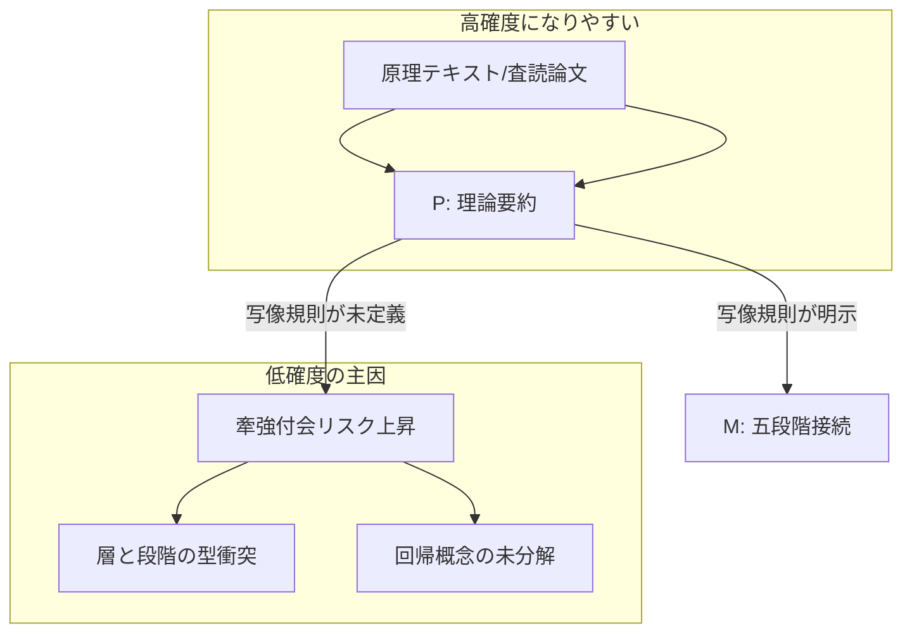

# 歴史エビデンスレビュー報告書

## エグゼクティブサマリー

本レビューは、evidence-D16-history.md（全十件のエントリ＋総括）を、三月二日版指示（REQ-GPT-20260302-013_d16-review.md）に従って評価したものである。結論として、当該エビデンスは「テンプレート化された記述」「理論の多様性確保」「五段階モデル（場・波・縁・渦・束）への接続意図」が明確で、D16の“理論辞書”としての有用性は高い。一方で、（i）複数時間層（ブローデル等）を五段階“連鎖”に読み替える際の写像規則が未定義、（ii）循環理論における「束→場回帰」の意味（完全リセットか、残存制度を含む螺旋か）がエントリ間で揺れている、（iii）「縁フラグ」や「縁の型（タイプ）」集計に内部不整合がある、（iv）除外した主要理論家群（マルクス等）について、エビデンス側に除外理由が明示されていない、という課題がレビュー上のボトルネックである。

五観点の判定（高・中・低）を先に要約すると次の通り。

- **整合性：中**（定型は安定しているが、ID表記揺れ・総括部の集計矛盾が残る）
- **妥当性：中**（一次理論の要約は概ね適切だが、五段階写像が「層」概念と衝突する箇所がある）
- **網羅性：中**（選定はバランス良いが、除外候補群の扱いが未規定で監査可能性が低い）
- **信頼度：中**（参照文献は妥当だが、ページ根拠・一次確認済み印が不足し、主張ごとの確度差の運用が弱い）
- **表現：中**（箇条書き中心で明快だが、概念定義の省略と総括部の数え上げミスが理解を阻害）

短期の改善優先度は、①「層（複数時間）」×「段階（生成系列）」の交差表（写像規則）を追加、②「場回帰」を“循環”と“螺旋（残存・学習込み）”に分解して統一定義、③縁フラグ基準の明文化と総括部の集計修正、④除外理論家の除外理由（または未確定宣言）の明記、である。これにより、三月二日版指示の狙う「牽強付会の抑制」と「縁フラグ妥当性監査」が実装可能になる。

## レビュー対象と方法

対象は evidence-D16-history.md（十件：ブローデル／トインビー／パス依存／イブン＝ハルドゥーン／ウォーラーステイン／ヒューズ／コゼレック／ホワイト／ヴィーコ／ターチン＋総括L-1〜L-5）で、各エントリの [P]（文献要約）と [M]（五段階モデル接続）を分離して検討した。外部検証は、一次（原著・公刊論文）に準ずる公開情報、または学術出版社・査読誌・公的アーカイブ等の高信頼ソースを優先した。例えば、パス依存は「増加収益（increasing returns）として概念化」する定式化を、政治学の中核論文で確認する（Pierson）。citeturn17search6

確度（信頼度）の運用は、主張単位で次の三段階とした。

- **高**：一次・査読論文・学術出版社等により、主張内容が直接支持される
- **中**：権威ある二次資料・公的要約により支持されるが、一次箇所指定や争点整理が不足
- **低**：五段階への写像など、解釈的飛躍が大きく、規則未定義のため検証不能性が高い

（注）一部の国内機関リポジトリは閲覧制限・取得失敗が発生したため、同等概念を扱う査読論文・出版社情報・公的要約で代替している（例：コゼレックの鞍型期や経験空間／期待の地平）。citeturn33search0turn33search2turn4search8

本報告中の「evidence内位置」は、evidence-D16-history.mdの行番号（概数）で示す。

## レビュー観点の評価

以下は、三月二日版指示の「五観点（整合性・妥当性・網羅性・信頼度・表現）」に対応して、判定・具体コメント・改善提案をまとめたものである。

| 観点 | 判定 | 具体コメント | 改善提案 |
|---|---|---|---|
| 整合性 | 中 | 各エントリが flags/layer/claims/refs/判断 の定型で揃っており、読む側の認知負荷は低い。一方、総括L-2で「八タイプ」と言いつつ列挙が十項目になっており、内部集計に矛盾がある（evidence L-2周辺）。また、IDが「EV-HI-xxx」「xxx」「HI-xxx」等で揺れるため、指示書側の監査表（HI-xxx）と突合しにくい。 | 「ID表記はHI-xxxに統一（必要ならEV接頭辞は別フィールドへ）」を明文化。L-2のタイプ数は、列挙を八に整理するか、十タイプとして定義更新する。総括部では“数”に関する文言（件数、タイプ数）を自動集計に寄せる。 |
| 妥当性 | 中 | [P]要約は概ね標準理解と整合する。例：パス依存を「増加収益」に結びつける定式化は主要論文に整合。citeturn17search6　他方で、複数時間層（長期持続・景気循環・事件）を五段階の“時系列段階”に読み替える箇所は、層（同時並存）と段階（生成系列）のカテゴリ衝突が残る（EV-HI-001）。ブローデルの三層区分それ自体は広く支持されるが、citeturn24search0turn24search2　「層→段階」写像規則が未定義のため、牽強付会に見え得る。 | 「層×段階」の二次元モデルを導入し、各理論が（a）どの時間層を主に扱うか、（b）どの段階生成を説明するか、を交差表で示す（層を段階に“変換”しない）。循環理論については「回帰＝完全リセット」か「回帰＝残存込みの螺旋」かを明示し、エントリ間で統一する。 |
| 網羅性 | 中 | 十件という制約下で、マクロ（世界システム／文明循環）からミクロ寄りの認識論（概念史／叙述論）まで散らしている点は良い。ただし、指示書が監査対象として挙げるマルクス／シュペングラー／コリングウッド等、および三月一日版で候補に挙がっていたフクヤマ／ホブズボーム／スコット／ル＝ロワ＝ラデュリについて、エビデンス側に「なぜ入れないのか」の監査可能な説明がない。歴史唯物論は「モードの矛盾が次の社会形態を駆動する」という段階論として一般に要約され、citeturn39search1　比較用の“線形段階モデル”として有用である。シュペングラーは文明のライフサイクルを強く主張する循環型モデルで、citeturn40search0　既収録（トインビー／ヴィーコ／ターチン）との冗長性評価が必要になる。 | 「除外候補リスト」と「除外理由（重複・射程外・同一機能の代替がある等）」をL-5に追加し、未確定なら未確定と明記する。線形（終末／終点）モデルの対極として、フクヤマのような“終点論”の位置づけを最小コストで注記する（追加エントリが無理なら脚注で）。 |
| 信頼度 | 中 | 文献欄に一次文献が入り、主要概念も概ね妥当。しかし、ページ・章・節までの根拠指定が弱く、また「GPTレビュー未済」等の但し書きが多く、主張別の確度差が運用されていない。例：イブン＝ハルドゥーンの「三世代＝百二十年」「四世代で威信が破壊」等は、翻訳テキスト上で直接確認できるレベルの主張であり高確度にできる。citeturn6search1　一方、ホワイトの叙述論は「史実否認」と誤読されやすく、争点整理なしに断言すると信頼度が落ちる。ホワイトの理論が「四トロープ体系」を持つこと自体は複数の学術的要約で確認できるが、citeturn38search2turn38search0　“何を否定し、何を主張するか”の精査が要る。 | 各[P]主張に「根拠箇所（章・節）」を付与。確度ラベルを“エントリ全体”ではなく“主張単位”に付け、総括で高・中・低の分布を出す。特にヒューズ（LTSとモメンタム）のように公開一次（作業論文）に当たれるケースは高確度化しやすい。citeturn11search37turn10search7 |
| 表現 | 中 | 記述は箇条書きで読みやすく、[P]/[M]の切り分けも良い。ただし、五段階概念（場・波・縁・渦・束）がこのファイル単体では定義されず、外部ドキュメント依存があるため、レビュー単体での再現性が下がる。また、総括L-2の「八タイプ」不整合、参照文献表記の省略記号（…）は“証拠としての精度”を損なう。 | 冒頭に「五段階ミニ定義（各二〜三行）」を追記し、最低限このファイルだけで読み切れるようにする。文献表記は省略せず、版・年・章（可能なら頁）を統一書式で記載する。 |

## 牽強付会チェックと縁フラグ検証

本節では、三月二日版指示が求める「牽強付会チェック（特にブローデル／ホワイト／ヴィーコ／循環理論／場回帰）」と「縁フラグ妥当性」を、エビデンスの主張構造に沿って検証する。

### 層概念と段階概念の衝突点

EV-HI-001は、長期持続・景気循環・事件史という“複数時間層”を、五段階（場→波→縁→渦→束）へ部分的に読み替える（evidence EV-HI-001の[M]）。しかし、ブローデルの骨格は「同時並存する異なる速度の歴史」であり、三層の区分それ自体が“生成の順序”ではない、という点が重要である。三層区分（地理＝長期、社会経済＝中期、個人／事件＝短期）は公的要約にも明示される。citeturn24search0turn24search2  
このため、三層を五段階の“時系列段階”として読むと、「層＝並存」「段階＝遷移」という型の違いが未解決のまま残り、牽強付会に見えるリスクが高い。

改善案としては、**「層×段階」二次元化**が最もコストが低い。すなわち、ブローデルは「場〜束のどれかを説明する理論」ではなく、「どの段階も複数時間層で観察される」という“観測レンズ”を提供すると位置づける。これにより、「層間相互作用はM2と共鳴」というエビデンス側の直観（evidence EV-HI-001）を、写像規則として監査可能にできる。

### ホワイトの位置づけと“縁”への過剰接続リスク

EV-HI-008は triage が CA（要注意）で、「出来事は書かれることで存在する」「[M]は縁薄い」としている（evidence EV-HI-008）。ホワイトの議論が歴史叙述を“言語的構築物”として捉え、解釈が修辞（トロープ）に規定されるとしたことは、学術的要約でも確認できる。citeturn38search2turn38search0  
一方、一般向け論評でも、ホワイトが「歴史学を物語性をもつ言語的構築物として見る」点は繰り返し紹介される。citeturn38search3  

ここでの牽強付会ポイントは、「叙述の縁（修辞的関係）＝五段階の縁（関係生成）」を短絡させる危険である。エビデンスはCAとして抑制しており、三月二日版指示（ホワイトは低めに寄せる可能性）とも整合する。citeturn38search0  
ただし、[P]側の文言「事実の客観的反映ではない」は、ホワイトの受容史における最大の争点（相対主義批判）を呼び込みやすいので、**「史実の否定ではなく、史実の“プロット化／意味づけ”が不可避という主張」**のように“争点回避型に精密化”する方が信頼度が上がる。

### ヴィーコと循環理論における「場回帰」整合性

EV-HI-009は、ヴィーコの三時代（神・英雄・人間）と ricorso（回帰）を、五段階に接続しようとする（evidence EV-HI-009）。ヴィーコが「真なるものは作られたもの（verum factum）」という原理を軸に、人間の制度世界を“生成原因から理解する”という方向性を持つことは、哲学事典級の整理でも確認できる。citeturn13search2  
また、三時代と、それに並行する言語変化（合図・象徴・合意語彙）を述べる典型箇所は公開抜粋でも確認できる。citeturn34search3  

問題は「束→場回帰」をどう定義するかである。ヴィーコの回帰は、単なる“初期状態への完全リセット”ではなく、腐敗と“第二の野蛮”を経て再出発するような、少なくとも単純反復ではない含意を持つ（回帰を強調する解説も、線形進歩と循環性の両面を指摘する）。citeturn3search6turn13search2  
したがって、循環理論三件（イブン＝ハルドゥーン／ヴィーコ／ターチン）を同一の「場回帰」で束ねるなら、**回帰を二種類に分解**するのが安全である。

- **回帰A（完全交替型）**：支配集団が交替し、秩序が新規に再構成される（王朝交替の強調）
- **回帰B（残存・螺旋型）**：制度・語彙・人口構造などが残存し、次周期の初期条件を規定する（“同じ場”ではない）

イブン＝ハルドゥーンの「三世代＝百二十年」「四世代で威信が破壊」という定式は翻訳抜粋で直接言明されており、citeturn6search1　これは回帰Aの色が濃い。一方、ターチンの構造人口学的循環は、長期波（世俗波）に短周期が重なるなど、周期の“重ね合わせ”を明示し、citeturn9search0　回帰B（残存条件込み）で読む方が自然である。エビデンスL-4が「周期性」「螺旋レンズ」を問題化しているのは適切だが（evidence L-4）、この分類を**エントリ横断の共通スキーマとして明文化**すると牽強付会耐性が上がる。

### 縁フラグの妥当性

三月二日版指示では、縁フラグの妥当性が実質的な監査対象であり、赤（強）として EV-HI-003（パス依存）と EV-HI-006（ヒューズ）が指定されている。これは概ね妥当である。パス依存は「臨界的分岐（critical juncture）が後続経路を規定する」タイプの関係形成を中核に持ち、増加収益的力学が“固定化”を生む、という整理と整合する。citeturn17search6  
またヒューズのLTSは、発明・発展・移転等の局面を扱う作業論文（章草稿）に当たれるため、段階モデルとの接続が相対的に検証しやすい。citeturn11search37　モメンタム概念も「技術・組織・態度要素の“質量”が方向性を維持する」という定義で学術文章に明示されている。citeturn10search7

一方、EV-HI-005（世界システム）は、核心が「中核／周辺／半周辺」という関係構造であるため、縁フラグを黄に留めるか赤に上げるかは基準次第である。“関係構造そのものが理論の本体”という意味では、縁フラグ赤へ上方修正する方が説明可能性は高い（半周辺がバッファとして機能する説明も、原典抜粋系資料で確認できる）。citeturn15search6turn16search1  
逆に、EV-HI-001（ブローデル）は関係より“観測レンズ”が核なので黄のままが妥当、EV-HI-008（ホワイト）は白〜灰（縁フラグ対象外）で妥当、という整理ができる。

## 主張別サマリーと信頼度分布

### 主要主張テーブル

下表は、各エントリの中核的な[P]主張と、五段階へ橋渡しする[M]主張を抽出し、外部裏取り・確度・対応方針を付けたものである（evidence内位置は行番号の目安）。

| エントリ | 主張要約 | evidence内位置 | 外部裏取り（主要） | 推奨確度 | 推奨アクション |
|---|---|---:|---|---|---|
| EV-HI-001 | 歴史時間を長期（地理・気候等）／中期（景気循環）／短期（事件）に区分する | L37-L39 | 三層の時間区分（地理＝長期、社会経済＝中期、事件＝短期）は公的要約でも明示。citeturn24search0turn24search2 | 高 | 受理（ただし根拠章・版の明確化） |
| EV-HI-001 | 三層を五段階（場・波・縁・渦・束）へ読み替える | L40 | 三層は本来“並存速度”であり、段階遷移とは型が違う。citeturn24search0turn24search2 | 低 | 改訂（層×段階の二次元化） |
| EV-HI-002 | 文明は挑戦と応答で成長し、応答不能で停滞・崩壊する | L76-L77 | 文明の興亡を挑戦への応答と創造的少数者の機能で説明する要約。citeturn14search0turn14search8 | 中〜高 | 受理（出典箇所の特定で高確度化） |
| EV-HI-003 | パス依存を増加収益過程として概念化し、臨界点が経路を固定する | L115-L119 | パス依存＝増加収益の動学として概念化し、臨界的分岐を重視する整理。citeturn17search6 | 高 | 受理 |
| EV-HI-003 | 「束→場回帰（リロックイン）」として分岐再編の型に接続する | L119 | パス依存は“固定化”と“分岐点”を扱うが、周期的回帰を必然視しない。citeturn17search6 | 中 | 改訂（回帰概念の定義と適用条件の明記） |
| EV-HI-004 | 王朝はアサビーヤにより興隆し、世代交替で衰退し交替する | L157-L160 | 「三世代＝百二十年」「四世代で威信が破壊」と明示する翻訳抜粋。citeturn6search1 | 高 | 受理（根拠章番号を付与） |
| EV-HI-004 | 循環を「束→場回帰（交替）」の原型として扱う | L160 | 世代交替型の循環は直接支持されるが、残存条件の扱いは理論や解釈で差が出る。citeturn6search1 | 中 | 改訂（回帰A/Bの区別） |
| EV-HI-005 | 世界システムは中核／周辺／半周辺の分業と不等交換で維持される | L198-L201 | 世界システム分析の枠組み要約（出版社情報）と、半周辺がバッファになる原典抜粋。citeturn16search1turn15search6 | 中〜高 | 受理（一次頁の特定で高に） |
| EV-HI-005 | 「関係構造（縁型）」として五段階の縁に接続できる | L201 | 半周辺＝中核と周辺の間のバッファという整理は“関係構造”として明瞭。citeturn15search6 | 中〜高 | 受理（縁フラグ基準次第で赤候補） |
| EV-HI-006 | LTSは発明・発展・移転等の局面を経てモメンタムを獲得する | L237-L241 | 章草稿（作業論文）として公開され、局面（発明等）を直接確認可能。citeturn11search37 | 高 | 受理 |
| EV-HI-006 | モメンタムは技術・組織・態度要素の“質量”として維持力になる | L241-L242 | 学術論文がモメンタム定義を明示。citeturn10search7 | 高 | 受理（信頼度を「中→高」へ） |
| EV-HI-007 | 経験空間／期待の地平の緊張が歴史時間を構成する | L276-L278 | コゼレックの当該論文内容を日本語で要約紹介。citeturn4search8 | 中〜高 | 受理（一次の章・節情報を追記） |
| EV-HI-007 | 鞍型期（概ね一七五〇〜一八五〇）を概念変動の転換期とする | L278-L279 | 鞍型期（Sattelzeit）を一七五〇〜一八五〇頃とする整理。citeturn33search2turn33search0 | 高 | 受理 |
| EV-HI-008 | 歴史叙述はトロープ等の修辞的構造に規定される | L315-L318 | 四トロープ体系としての整理。citeturn38search2turn38search0 | 中 | 受理（争点の注記で安定化） |
| EV-HI-008 | 五段階への写像は薄く、CA（要注意）とする | L318 | トロープ理論は“叙述生成”であり、制度生成モデルに無理接続しない判断は妥当。citeturn38search0 | 中 | 受理 |
| EV-HI-009 | 三時代（神・英雄・人間）と、それに対応する言語変化を持つ | L354-L357 | 三時代と三種の言語を述べる公開抜粋。citeturn34search3 | 中〜高 | 受理 |
| EV-HI-009 | verum factum（真なるものは作られたもの）により歴史認識を基礎づける | L357-L358 | verum factum原理を軸に人文科学的方法を展開する整理。citeturn13search2 | 高 | 受理 |
| EV-HI-010 | 政治不安定の波動（世俗波＋周期）があり、構造要因で説明できる | L394-L399 | 五十年周期等の重ね合わせと構造人口学の説明（査読論文）。citeturn9search0 | 高 | 受理 |
| EV-HI-010 | 二〇一〇年の不安定化予測を、二〇二〇年時点で回顧検証した | L402-L403 | Natureでの予測提示と、PLOS ONEでの回顧評価。citeturn7search2turn7search0 | 高 | 受理（「二〇二〇年代予測」の扱いは別枠化） |
| L-2 | 「縁の型は八タイプ」として多様性を示す | L433-L448 | 列挙が十項目になっており内部矛盾（エビデンス内整合性の問題）。 | 低 | 改訂（数え上げ・型定義の修正） |

### 信頼度分布の可視化

上表（二十件強）の推奨確度を素朴集計すると、「高」が概ね半数、残りが「中」、写像規則未定義の箇所が「低」に集中する。特に「層→段階」変換（ブローデル）と「回帰」概念の統一が、低確度の主因である。ブローデルの“三層”自体は高確度だが、citeturn24search0turn24search2　五段階への写像だけが低確度、という形で“理論要約とモデル接続の確度差”が明確に出ている。

（図は、現在のエビデンスで“確度が落ちるメカニズム”を抽象化したもの。）

## 指示書三月一日版と三月二日版の差分と衝突評価

三月二日版は三月一日版と比べて、レビューの焦点を「無理な当てはめ（牽強付会）抑制」と「循環理論の場回帰整合」に寄せ、見落とし監査の候補群を絞り込んでいる。両者に**手続き上の直接衝突はなく**、三月二日版は“より監査可能な改訂”と評価できる。ただし、三月一日版にあった広い見落とし候補（フクヤマ等）を完全に捨てると、網羅性監査が弱まるため、運用上は「二日版を主、ただし一日版の候補リストを補助チェック」とするのが安全である。

| 争点 | 三月一日版の要求 | 三月二日版の要求 | レビュー判断への影響 |
|---|---|---|---|
| 牽強付会チェック | 主にブローデル／ヒューズ／ホワイトの当てはめ妥当性 | ブローデル／ホワイト／ヴィーコに加え、循環理論（イブン＝ハルドゥーン・ヴィーコ・ターチン）で「束→場回帰」を整合確認 | 二日版の方が、低確度箇所（回帰概念）を特定しやすい |
| 縁フラグ監査 | フラグ妥当性（ただし具体基準は薄い） | 赤指定（パス依存・ヒューズ）を明示し、妥当性検証を要求 | フラグの“基準明文化”が必須になる |
| 見落とし候補 | フクヤマ／ホブズボーム／スコット／ル＝ロワ＝ラデュリ等を列挙 | マルクス／シュペングラー／コリングウッドに絞り、除外理由例を提示 | 二日版に従うだけだと候補が絞られすぎる恐れ（ただし衝突はない） |
| 信頼度の重点 | ヒューズは「最も素直」等の示唆 | ヒューズは高寄せ可、ホワイトは低寄せ可、と明示 | 三月二日版は“主張別確度差”の運用を促す |

衝突評価：両版は同時に満たし得る（矛盾命令ではない）。差分は「監査対象のスコープ」と「循環・縁の検査密度」であり、レビュー運用を二日版へ寄せる合理性がある。

## 最終勧告

三月二日版指示を**採用推奨**とする。理由は、（a）縁フラグと循環（場回帰）を明示的検査項目にし、牽強付会を“論点化”できる点、（b）信頼度に関してホワイトの扱いなど、争点が出やすい領域で慎重さを促す点、にある。citeturn38search0  

ただし、採用と同時に、次の「欠落防止チェック」を固定手順として追加したい。

第一に、**除外候補の監査表を二層化**する。二日版の必須候補（マルクス／シュペングラー／コリングウッド）に加え、三月一日版が列挙したフクヤマ／ホブズボーム／スコット／ル＝ロワ＝ラデュリ等は“補助候補”として残し、少なくとも「なぜ入れないのか（重複・射程外・代替あり）」を文章化する。歴史唯物論は段階論としての比較軸を提供し得る。citeturn39search1　シュペングラーは循環モデルの強い代表であり、既収録との冗長性判断が可能である。citeturn40search0turn40search4　スコットは日常的抵抗や国家の“可視化（legibility）”批判を通じ、縁（関係）や渦（統治理性）の別系統の証拠になり得る。citeturn40search5turn42search0　ル＝ロワ＝ラデュリは気候史の系譜として長期持続との接続候補になる。citeturn41search0　ホブズボームは「長い十九世紀」などの期間設定概念で時間レンズの補強ができる。citeturn42search2

第二に、「層×段階」表と「回帰A/B」定義を追加し、**低確度（写像規則未定義）を構造的に減らす**。三層時間（同時並存）を段階遷移として読まない、回帰を完全リセットと残存螺旋に分解する、という二点だけでも、三月二日版が狙う牽強付会抑制の効果が大きい。citeturn24search0turn9search0