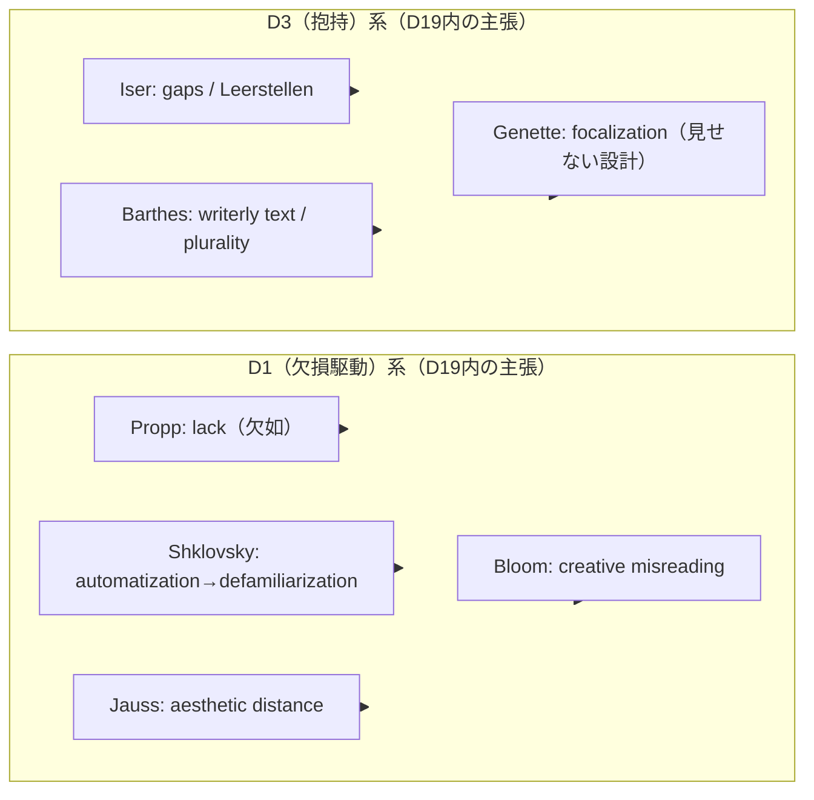

# D19 文学・文芸学エビデンスレビュー報告書

## エグゼクティブサマリー

本報告書は、提出された `evidence-D19-literary-studies.md`（以下「D19エビデンス」）を、学術査読者（文学理論・批評理論に通暁）向けに、原典準拠性・理論的一貫性・牽強付会（不当な連想接続）・トリアージ／縁判定・L-1〜L-5メタ分析の妥当性という観点から精査したものである。なお、レビュー基準を規定する「REQファイル」は未提供であるため、**REQ固有の判定基準（Accept/CAの閾値、縁🔴🟡⚪の定義、L-1〜L-5の作法、信頼度ラベルの規格）への準拠性**は確証できない。この点は本報告書で明示的に「要データ」として扱う。

主要結論は以下の通りである。

第一に、**プロップ記述は、核心命題（31機能、機能概念、機能順序の同一性）について原典と整合的**である。プロップが「機能」を「行為者」ではなく「行為（物語進行上の意義）」として定義し、機能の順序が一様であることをテーゼとして提示する点は、英訳版本文で明確に確認できる（D19:EV-LT-001）。citeturn18view0turn1view1turn18view1  
ただし、**31機能→M2（5段階）への圧縮対応**は理論輸入（[M]）としては成立しうる一方、情報損失・射程逸脱（ロシア魔法民話以外への一般化）を不可避に伴うため、**「対応の強い根拠」ではなく「ヒューリスティック」**として書式上も明確化すべきである（要修正）。

第二に、**トドロフ（Todorovの5要素）について、D19が一次文献（1971年 “The 2 Principles of Narrative”）で「5要素列挙がある」と断定している点は、現時点の検証環境では一次本文に直接アクセスできず（JSTOR側が閲覧制限）、原典照合が未完了である**。citeturn3view0turn1view0  
一方で、同論文の要点として「継起（succession）に加えて変換（transformation）が必要」という主張は、同論文を引く二次資料の引用（頁指定付き）レベルでは支持される。citeturn2search5turn2search2  
結論として、**EV-LT-005は「要議論（原典照合の完了まで）」**とし、現状の「一次文献で5要素列挙」「段階数合わせ不要」というメタ結論（L-1等）も連鎖的に書き換えが必要である。

第三に、**ブルーム（Bloomの6修正比）について、6つの修正比の名称（clinamen, tessera, kenosis, daemonization, askesis, apophrades）は邦訳版目次（章題）レベルで確認でき、名称列挙自体は妥当**である。citeturn12search11  
ただし、D19における各比の日本語グロス（例：clinamen=逸脱、daemonization=反転等）は、**邦訳書で採用される章題用語（「クリナーメン」「デモナイゼーション」等）との整合や、比の機能定義（理論上の働き）まで踏み込んだ原典照合が未実施**であり、学術的精度としては「要修正」である。加えて、**6修正比をM2（5段階）へ写像する方法論**はD19自身が「6≠5のズレ」として未解決課題化しており（L-4）、採用確定（Accept）に対して信頼度「中」のまま据え置く内部整合性に齟齬がある（要修正）。

全体として、10エントリすべてが「Accept」になっているが、各エントリの多くが「hiro:未確認」かつ「GPTレビュー未済」で信頼度「中」である以上、一般的な査読実務の観点からは **Acceptの濫用**に見える。REQ基準が不明なため断定は避けるが、少なくとも **「原典直引き可能性（ページ／節照合）」「[P]/[M]峻別の徹底」「連想接続の条件明示」**を満たすまで、複数エントリは「CA（要確認）」相当へ戻すのが妥当である。

## 対象資料と検証方法

本報告書が参照した一次データは、D19エビデンス（提出ファイル）である。加えて、指定要件に従い、可能な範囲で一次・公式ソース（邦訳が存在する場合は邦訳書誌情報を優先）を参照し、D19の記述と照合した。

ただし、以下は**要データ（未提供またはアクセス制限）**として、本レビューでは「検証不能」と明記する。

- REQファイル（トリアージ、縁判定、L-1〜L-5作法、信頼度定義、判定基準の厳密仕様）
- entity["people","ツヴェタン・トドロフ","bulgarian-french theorist"]の1971年論文（JSTORでの本文直接閲覧が制限され、一次本文照合が未完了）citeturn3view0turn1view0
- entity["people","ハロルド・ブルーム","american critic 1930-2019"]の理論細部（『entity["book","The Anxiety of Influence","bloom 1973 theory of poetry"]』本文の節・頁単位照合が未実施）
- D19内の他ドメイン参照（D1/D2/D3/D15〜D18、M2、縁＝場/波/縁/渦/束 等）の**定義文書**（用語がプロジェクト固有で、外延・内包が確認できない）

原典照合は、①一次本文が取得できる場合は当該頁の記述確認、②取得不能な場合は書誌情報と、頁指定引用を含む信頼できる二次資料で暫定照合、③それでも不足する場合は「要議論」とする、という三段階で行った。

## 原典準拠性の検証

ここでは、要件で指定された **プロップ／トドロフ（5要素）／ブルーム（6修正比）**の3点について、D19エビデンスの主張を「原典（または原典に準ずる証拠）」と突き合わせ、**正確性・忠実性・言い過ぎ**を判定する。

image_group{"layout":"carousel","aspect_ratio":"1:1","query":["Morphology of the Folktale book cover","The Anxiety of Influence book cover","Tzvetan Todorov portrait","Narrative Discourse Genette book cover"],"num_per_query":1}

### 主張対照表

| 対象 | D19エビデンス上の主張（要旨） | 原典・一次根拠（確認できた範囲） | 判定 | 原典レベルの修正案 |
|---|---|---|---|---|
| entity["people","ウラジーミル・プロップ","russian folklorist 1895-1970"] | 「機能」は人物ではなく行為の単位で、物語進行上の意義で定義される（EV-LT-001） | “Function is understood as an act of a character, defined from the point of view of its significance for the course of the action.”citeturn18view0turn1view1 | 問題なし | 引用箇所（頁）を明示し、邦訳（『entity["book","昔話の形態学","propp 1987 japanese ed"]』）該当頁も併記（要修正：形式面）。citeturn12search0turn12search15 |
| 同上 | 「31機能」「機能の出現順序は不変」（EV-LT-001） | 31機能の限定が明示され、機能の順序が常に同一であり、欠落があっても順序は変わらない旨が述べられる。citeturn18view1turn1view1 | 問題なし | ただし「ロシア魔法民話」以外（文学一般・映画脚本）への一般化は別命題なので、[P]と切り離し [M] に移す（要修正）。 |
| entity["people","ツヴェタン・トドロフ","bulgarian-french theorist"] | 1971年論文に「物語の5つの不可欠要素（均衡→破綻→認知→回復→新均衡）」が列挙される（EV-LT-005／L-1） | 当該論文本文への一次アクセスが制限され直接照合できない。citeturn3view0turn1view0 5要素モデルは広く流通しているが、一次文献根拠は本レビューでは確証できない。citeturn7search0 | 要議論 | 「一次文献で5要素列挙」という断定を撤回し、(a) 原典で確認できた最小命題（継起＋変換）と、(b) 教育的要約としての5段階モデル、を分離して記述。原典照合完了まで[ P ]→[ M ]または「二次整理」タグへ。 |
| 同上 | 「継起だけでなく変換（反復・反転など）が必要」（EV-LT-005） | トドロフ論文の要点として「継起だけではなく変換も必要」という引用が、頁指定付きで伝えられている。citeturn2search5turn2search2 | 概ね問題なし | 「反復・反転」を例示するなら、原典で実際に挙げられる変換タイプ（語りの反復配置等）に合わせて例を限定し、出典頁を追記（要修正：精密化）。 |
| entity["people","ハロルド・ブルーム","american critic 1930-2019"] | 6修正比（clinamen, tessera, kenosis, daemonization, askesis, apophrades）の列挙（EV-LT-010） | 邦訳書目次が6修正比を章題として列挙しているため、名称列挙は強く支持される。citeturn12search11 | 概ね問題なし | D19内の日本語グロス（逸脱/補完/自己空虚化/反転/禁欲/回帰）は、邦訳の章題（「クリナーメン」「デモナイゼーション」「死者の帰還」等）と照合し、用語選択を統一。citeturn12search11 |
| 同上 | 「強い詩人」「創造的誤読」「影響は不安として経験」（EV-LT-010） | 邦訳章題が「詩的誤読」を中心概念として提示しており、枠組み自体は妥当と推定されるが、本文節・頁の一次照合が未実施。citeturn12search11 | 要修正 | 「推定」ではなく本文根拠（該当章の定義節）に基づいて定義文を再記述し、章・節・頁を明示。一次照合が完了するまで信頼度を「中→低（暫定）」へ。 |

## エントリ別の学術的査読

本節では、10エントリすべてについて、(i) 牽強付会の有無、(ii) 理論的一貫性（[P]と[M]の混線、スケール飛躍、他理論との不整合）、(iii) 必要な修正案を、「判定（問題なし／要修正／要議論）」の形で提示する。なお、各エントリは基本的に「概念紹介」レベルであり、作品分析（ケース）を伴わない。したがって、強い対応主張（“最短距離”“段階数合わせ不要”など）は、原典照合なしでは理論的に過剰確信になりやすい。

### 全エントリ集計表

| ID | 理論家 | エントリ主題 | D19のtriage | 主な問題点（要約） | 判定 | 推奨アクション |
|---|---|---|---|---|---|---|
| EV-LT-001 | entity["people","ウラジーミル・プロップ","russian folklorist 1895-1970"] | 機能連鎖（31機能） | Accept | 31→5段階の圧縮を「根拠」ではなく「ヒューリスティック」として境界条件を明示すべき。民話外一般化の扱いが曖昧。citeturn18view1turn1view1 | 要修正 | [P]は原典単位で頁注、[M]は「損失・射程」注記を付す。邦訳書誌も追記。citeturn12search0turn12search15 |
| EV-LT-002 | entity["people","ミハイル・バフチン","russian philosopher 1895-1975"] | 対話性／ヘテログロシア | Accept | 「カーニバル」等、複数著作にまたがる概念の出典峻別が不足（どの著作のどの節か）。 | 要修正 | ヘテログロシア・対話性・権威的言葉/内的説得的言葉・カーニバルを、それぞれの典拠（著作・節）に分解して引用。 |
| EV-LT-003 | entity["people","ハンス・ローベルト・ヤウス","german literary theorist"]／entity["people","ヴォルフガング・イーザー","german literary theorist"] | 受容美学（期待の地平／空所） | Accept | JaussとIserの一次典拠が不十分。Iserの「空所」概念は提示書誌（1972）より後年の理論展開も踏まえる必要。 | 要修正 | Jauss 1967講演（のち英訳）とIser主要著作（英訳書誌）を併記し、概念定義を一次の語彙に寄せる。出版社公式書誌も活用。citeturn16search19 |
| EV-LT-004 | entity["people","ヴィクトル・シクロフスキー","russian formalist 1893-1984"] | 異化（ostranenie） | Accept | [P]出典（版・訳・頁）の欠落。自動化→異化の循環をプロジェクト用語へ接合する条件が暗黙。citeturn25view2 | 要修正 | 引用箇所（自動化・知覚の回復・異化定義）を頁指定し、[M]接続は「比喩的同型」であることを明示。citeturn25view2 |
| EV-LT-005 | entity["people","ツヴェタン・トドロフ","bulgarian-french theorist"] | 物語五要素循環 | Accept | 「一次文献で5要素列挙」の断定が原典未照合のままメタ結論を牽引。citeturn3view0turn7search0 | 要議論 | 1971論文本文の一次照合完了まで、5要素を[ P ]扱いしない／もしくは5段階を二次整理として扱う。 |
| EV-LT-006 | entity["people","ピエール・ブルデュー","french sociologist 1930-2002"] | 文学場／象徴財市場 | Accept | 「restricted vs large-scale」「奉献」などの概念は根拠が強いが、D19では要約の圧縮が強く、対立図式が実体化されやすい。citeturn20view0turn19view0 | 要修正 | ブルデュー自身が対立を「関係として定義」する点を補強し、二分法の硬直化を避ける注記を付す。citeturn20view0turn19view0 |
| EV-LT-007 | entity["people","ロラン・バルト","french theorist 1915-1980"] | S/Z・多元的読解 | Accept | 5コードやscriptible/lisibleの出典が二次依存になりやすい。作者の死をD1へ直結する論理が粗い。citeturn28search5turn28search4 | 要修正 | 5コードは一次（S/Z）か、一次に近い形の引用ソースに落とし込む。作者の死→D1接続は「解釈学上の含意」に留める。citeturn28search5turn28search4 |
| EV-LT-008 | entity["people","ノースロップ・フライ","canadian critic 1912-1991"] | 原型批評（四季サイクル） | Accept | 四季＝4ミュトス対応の列挙が一部混線の恐れ。一次根拠（該当箇所）提示が必要。citeturn28search6 | 要修正 | 「春=喜劇、夏=ロマンス、秋=悲劇、冬=アイロニー／風刺」を明確化し、引用箇所を頁注。citeturn28search6 |
| EV-LT-009 | entity["people","ジェラール・ジュネット","french theorist 1930-2018"] | ナラトロジー（時間・声・焦点化） | Accept | 定義は一般に妥当だが、「焦点化＝語り手-物語-読者の三者関係」とするのは解釈的で、Genette本来の “who sees/who speaks” 区別が薄れる恐れ。citeturn28search3 | 要修正 | 「語り（voice）」と「焦点化（focalization）」の区別軸（見る/語る）を明示し、抱持接続は限定的に。citeturn28search3 |
| EV-LT-010 | entity["people","ハロルド・ブルーム","american critic 1930-2019"] | 影響の不安／創造的誤読 | Accept | 6修正比の名称は確かだが、比の作用定義・訳語統一・6→5写像が未解決。citeturn12search11 | 要修正 | 邦訳章題に合わせて訳語体系を統一し、各比の定義節を本文から要約して再記述。6→5は「未解決課題」扱いを維持。citeturn12search11 |

### 牽強付会リスクの典型パターン

D19エビデンス全体で頻出する牽強付会リスクは、主に次の3類型に整理できる。

第一は、**段階数・単位の非等質性を「対応」と呼んでしまうこと**である。たとえば、プロップの31機能（機能論的・シーケンス論的単位）をM2の5段階（プロジェクト内の抽象段階）に圧縮するとき、対応は「類比」以上にはならない。プロップ自身は機能の欠落や組み合わせを論じ、31機能が測定単位であることを強調するため、「5段階＝原典が言う最小構造」と誤認されない防波堤が必要である。citeturn18view1turn1view1

第二は、**一次概念の所在（著作・章・文脈）を跨いだ合成**である。バフチンの「対話性」「ヘテログロシア」と「カーニバル」は理論的親縁性がある一方、概念史的にはテクスト・文体論と祝祭文化論にまたがるため、D19のような「概念カタログ」形式では出典峻別が必須になる。

第三は、**二次的に流通した教育モデルを一次に帰属させること**である。トドロフの「5段階（均衡→破綻→認知→修復→新均衡）」は教育現場で広く普及しているが、JSTOR本文未照合のまま一次列挙を断定すると、D19内の「縁🔴」やL-1最強候補判断を連鎖的に誤誘導しうる。citeturn3view0turn7search0

## トリアージ・縁判定とL-1〜L-5メタ分析の評価

### トリアージ（Accept一色）の妥当性

D19エビデンスは、10エントリすべてが「Accept」となっている一方で、個別エントリの「信頼度」は概ね「中」であり、かつ「未確認」「GPTレビュー未済」が明示されている。REQ基準が未提示のため規約違反とは断じられないが、一般に「Accept」は「監査可能性（誰が読んでも同じ根拠に到達できる）」を含意することが多い。

最低限、以下を満たさない限り、学術査読の工程管理としては「CA（要確認）」を併置する方が安全である。

- [P]主張が、一次（または一次に準ずる）箇所へ**節・頁でトレース可能**であること
- [M]主張が、(a) 類比の範囲、(b) 失われる情報、(c) 反証可能性の条件、を明示していること
- 「最強候補」「最短距離」など選抜語彙が、根拠とセットになっていること

特にEV-LT-005（トドロフ）は、L-1/L-4においてD19全体のキーストーンとして機能しているため、一次照合未完了のままAcceptに置くのはリスクが高い。citeturn3view0turn1view0

### 縁判定（縁🔴🟡⚪）の整合性

L-2「縁マッピング詳細」は、縁を「実装の型」として類型化し、D19の特徴（制度型・受容型・知覚型・誤読型など）を可視化する点で、メタ分析として有益である。一方、縁🔴の根拠が「5段階との最短距離」「段階数が一致」という**形式的一致**に寄り過ぎると、一次未照合の場合に評価全体が崩れる。citeturn7search0turn3view0

現状で最も再検討が必要なのは以下である。

- **Todorov（縁🔴）**：5要素の一次列挙が未照合である以上、縁🔴の根拠を「段階一致」に置けない。むしろ「継起＋変換」という原典の核に即して、縁の強度を再定義すべき。citeturn2search5turn2search2
- **Genette（縁⚪）**：焦点化は「見る／語る」の配置設計として、抱持系（D3）との接続は十分に強くなりうる。ジュネットの枠組み自体は時間・態・声の分析装置として確立しているため、縁⚪とするなら「縁」のプロジェクト定義上、何が不足するのか（交渉性？関係生成？）を明文化する必要がある。citeturn28search3

### L-1〜L-5メタ分析の品質

L-1〜L-5は、単なる一覧ではなく「保持論点（L-4）」で未解決問題を明確に掲げており、研究計画としての体裁は良い。とりわけ「6≠5のズレ」「焦点化の縁性」「分析生成 vs 存在生成」といった論点は、理論運用上の重要な分岐を押さえている。

ただし、L-1の「一次文献で5要素列挙」という断定が、一次照合未完了の場合に誤りとなる可能性があるため、L-1→L-4の議論の前提が揺らぐ。したがって、まず **Todorov原典照合の完了**が、L階層メタ分析の信頼度を底上げする最短経路になる。citeturn3view0turn7search0

## 修正案と運用上の提言

### 主要修正案（原典レベル）

**トドロフ（EV-LT-005）**  
判定：要議論  
学術コメント：D19は「5要素が一次に列挙される」ことを根拠に、5段階モデルとの一致を「段階数合わせ不要」としているが、一次本文未照合の現状では確証できない。JSTOR制限下では、少なくとも「継起に加え変換が不可欠」という核命題に退き、5段階モデルは「教育的分解（セカンダリ）」として別レイヤーに置くべきである。citeturn2search5turn3view0  
修正案（差し替え例）：  
- [P] 物語の原理は継起だけでなく変換を含む（一次照合済み箇所に頁注）。citeturn2search5turn2search2  
- [M]（二次整理）教育的には「均衡→破綻→認知→修復→新均衡」としてモデル化されることが多いが、一次での列挙有無は要確認。citeturn7search0turn3view0  

**ブルーム（EV-LT-010）**  
判定：要修正  
学術コメント：6修正比の名称自体は邦訳目次で裏づくが、各比の作用（詩的誤読の位相）をD19が短いグロスで固定すると、邦訳の語彙体系と齟齬が出やすい。章題（クリナーメン／テスセラ／ケノーシス／デモナイゼーション／アスケーシス／アポフラデース）を基準に、訳語と説明語彙を統一し、本文の定義節に基づく要約へ更新すべきである。citeturn12search11  
修正案（最低限）：  
- [P] 6修正比の列挙は、邦訳目次の表記に合わせる（ローマ字＋カナの併記）。citeturn12search11  
- [M] 6→5写像は「未確定の方法論課題」として本文・L-4の両方に明確化し、縁🔴の根拠にしない。

**プロップ（EV-LT-001）**  
判定：要修正（軽微）  
学術コメント：核心の一次主張は堅いが、31→5圧縮を「構造対応が堅い」と言い切ると、プロップ固有の機能論（ペア配置、欠落しても順序維持、測定単位としてのスキーム）を薄める。圧縮対応は「分析目的に応じた粗視化」と明示し、圧縮で失われる機能差（例：贈与者場面と追跡場面等）を注記するのが望ましい。citeturn18view1turn1view1  
修正案：  
- [P] 機能定義・順序テーゼの頁注を追加。citeturn18view0turn1view1  
- [M] 5段階対応は「粗視化（coarse-graining）」として明示し、反例（機能が複数回出現・入れ子等）可能性も注記。

### mermaidによる関係整理

D19の「D1（欠損駆動）／D3（抱持）」クラスタ化は、概念的に有望だが、一次根拠と類比（[M]）の峻別が必要である。以下は、D19内部で想定されている結束を、**“主張の種類差”**（一次／類比）を分けて可視化したもの。

（注）この図はD19内のクラスタ仮説の可視化であり、D1/D3自体の定義はREQ未提示のため本レビューでは検証不能。

### 運用提言（REQ未提示下での安全策）

- **「Accept」＝「一次照合済み（頁注あり）」という最低条件**を暫定導入し、未照合は「CA（要確認）」へ移す。特にトドロフとブルームはL階層に波及するため優先度を上げる。citeturn3view0turn12search11
- [P]主張には、可能な限り**邦訳版（書誌）＋英語版（引用箇所）**を併置する。プロップは邦訳書誌が明確に存在するため、D19の「日本語一次アクセス可能性」が高い領域である。citeturn12search0turn12search15
- 「縁🔴」など強い評価を置く場合は、**評価根拠を“形式一致（段階数）”ではなく“理論核（何を縁として定義するか）”**に寄せる。トドロフは特に「継起＋変換」という核から再記述する。citeturn2search5turn2search2
- 6修正比や四季＝4ミュトスのように「列挙が命」の部分は、**一次の列挙箇所（目次でも可、ただし本文定義が理想）**を最小根拠として先に固定し、解釈拡張はその後に積む。citeturn12search11turn28search6