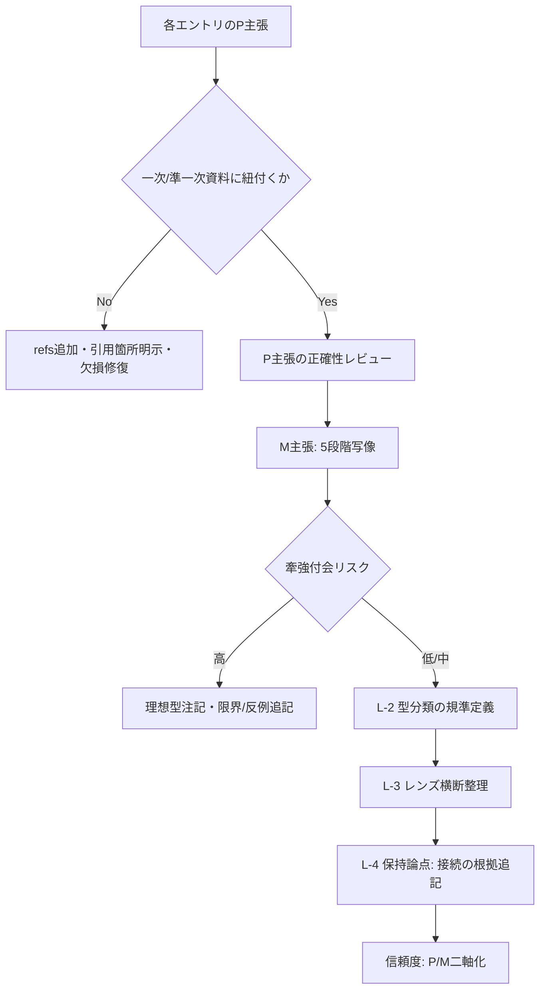

# D20 法学・政治学 Evidence 品質レビュー報告書

## エグゼクティブサマリー

本レビューは、REQ（/mnt/data/REQ-GPT-20260302-017_d20-review.md）の5観点に従い、evidence（/mnt/data/evidence-D20-law-politics.md；最終更新2026-03-02、10エントリ＋L-1〜L-5）を精読し、[P]（文献に基づく解釈）主張の正確性・出典妥当性、[M]（構造的類似）主張の牽強付会リスク、L-1〜L-5の統合部分の品質、信頼度（confidence）設計を中心に検証した（REQ: L28-L67、evidence: L1-L474）。

結論として、evidenceは「制度/規範の生成と正当化」をD20の中核に据え、10理論を「手続設計としての縁」に寄せて整理するという編集方針自体は整合的であり（evidence: L11-L24）、特に **entity["people","エリノア・オストロム","political economist"]**の8設計原則（LP-003）や、**entity["people","ジョン・キングダン","policy scholar"]**のマルチプル・ストリームズ（LP-009）など、「縁」を制度設計・時間窓として把握する観点は、D20の目的（縁の設計）に対して説明力が高い。citeturn0search7turn7view2

一方で、REQの最重要点である **[P]層の正確性** については、主要理論の骨格は概ね正しいものの、(a) いくつかのエントリで本文が「…」により欠損しており、定義・リスト・因果説明が途中で切れている、(b) エントリの **refs（参考文献）や引用の粒度が理論ごとに不均一**で、[P]主張の検証可能性が落ちる、(c) **LP-005（多層ADR）で、UNCITRAL文書が直接は支えない形の“四段階（交渉→調停→仲裁→訴訟）”定義を[P]として置いている**疑いがある、という3点が実務上の大きな品質リスクである（evidence: L179-L217）。citeturn6view1turn1search7

優先度の高い推奨アクションは、(1) 欠損箇所（…）の解消と、[P]主張に対する一次資料・準一次資料（学術論文・公的機関資料）の紐付け強化、(2) LP-005の[P]定義を「UNCITRALが言っていること」と「一般的に多層条項で見られる型」を分離して書き直すこと、(3) LP-009（3流れ）等、REQで指定された要検証ポイントについて、**用語の全文表記＋典拠箇所明示**により「読めば検証できる状態」にすること、(4) 信頼度を「P層信頼度」と「M層信頼度」に分離するなど、スコア設計を改善すること、である。citeturn7view2turn0search7turn0search13

## レビュー方法と評価枠組み

レビュー対象の10エントリは、**entity["people","H.L.A.ハート","legal philosopher"]**（LP-001）、**entity["people","デイヴィッド・イーストン","political scientist"]**（LP-002）、オストロム（LP-003）、**entity["people","エマニュエル＝ジョゼフ・シェイエス","french political theorist"]**／**entity["people","カール・シュミット","german jurist"]**（LP-004）、多層ADR（LP-005：**entity["organization","国連国際商取引法委員会","un trade law commission"]**等）、**entity["people","スティーヴン・クラスナー","international relations scholar"]**／**entity["people","ロバート・コヘイン","international relations scholar"]**（LP-006）、**entity["people","ジョン・ロールズ","political philosopher"]**（LP-007）、**entity["people","ユルゲン・ハーバーマス","german philosopher"]**（LP-008）、キングダン（LP-009）、**entity["people","ルーティ・G・タイテル","legal scholar"]**／**entity["organization","国際移行期正義センター","transitional justice ngo"]**（LP-010）で構成される（REQ: L11-L24、evidence: L26-L409）。citeturn6view3

事実照合は、REQで指定された要検証ポイント（特にLP-003/004/007/008/009）を中心に、一次・公的資料（例：UNCITRAL公式文書、国連総会決議、官庁資料）と、日本語の査読・大学リポジトリ論文等を優先し、補助的に英語の標準的解説も併用した。citeturn6view1turn6view2turn0search7turn1search0turn0search13turn7view2

## 観点別レビュー結果

### 実行したチェックリストの判定表

| 観点（REQ） | 判定 | 根拠の要旨 | 重要度 |
|---|---|---|---|
| [P]層の正確性（REQ: L28-L35） | 要修正 | 中核定義（ロールズ2原理、討議原理(D)、オストロム8原則、制憲権力の区別等）は概ね妥当だが、本文欠損（…）・参照不均一・LP-005の典拠の当て方が弱く、検証可能性が不足（evidence: L101-L409） | 高 |
| 牽強付会チェック（REQ: L37-L43） | 要議論 | [M]は「当てはめない」方針を明示する一方（evidence: L17）、縁→渦等の写像が“理想型”として妥当かは読者層により評価が割れる。全件Acceptも運用上再検討余地（evidence: L410-L420） | 中 |
| 見落とし（REQ: L45-L52） | 追加候補あり | 排除候補の説明はあるが、法・政治学の基礎理論（正当性類型、支配の三類型、インプット/アウトプット正統性等）が未登場で、L-3のレンズ①を補強できる | 中 |
| L-1〜L-5の質（REQ: L54-L58） | 要修正 | レンズ横断は有用だが、L-2の「10タイプ」根拠と定義の厳密さ、Rawlsの縁実装の整合、保持論点のテキスト欠損（…）が課題（evidence: L421-L467） | 高 |
| 信頼度の妥当性（REQ: L60-L64） | 要修正 | 全件「中」は説明責任が弱い。P層とM層で信頼度を分ける等の設計改善が必要。特にOstrom/Rawls/HabermasはP層だけなら高に寄せられるが、現状は欠損・参照不足で上げにくい | 中 |

### 観点: [P]層の正確性

**判定: 要修正**（REQ: L28-L35）

REQが求める主要ポイントについて、事実照合の結果は次の通り。

ロールズ（LP-007）の骨格は概ね正確である。原初状態・無知のヴェールは「社会的地位等の偶然性に関する情報制約の下で正義原理を選ぶ」という理解であり（evidence: L267-L270）、日本語の講義資料や研究論文でも同趣旨で説明される。citeturn0search0turn0search4 ただし、evidence本文は「無知のヴェ…」で文が途切れており、**定義の核心（何を知らないのか／なぜそれが合理的選択に寄与するのか）を“読者が文面から再構成できない”状態**になっている（evidence: L267）。また「第二原理」の内部構造（公正な機会均等と差異原則の関係、原理間の優先順位）を明確化すると、誤読耐性が上がる。citeturn0search4turn0search0

ハーバーマス（LP-008）の「討議原理(D)」の定義は、国内の法学系論文に見られる定式（「すべてのありうる関係者が合理的討議の参加者として合意しうる行為規範が妥当」）と整合的で、要約として妥当である（evidence: L305）。citeturn0search13turn0search1 一方、「理想的発話状況」を「平等参加・強制なし」の2条件に圧縮している点は、要約としては許容されるが、学術的には（発言機会の平等、発言の自由、批判・問い直しの自由など）より具体的に条件列挙されることが多い。citeturn5search12turn5search23 REQが「正確な条件」を求めている以上（REQ: L31）、**条件の列挙を1段深くする**のが望ましい。

キングダン（LP-009）は、衆議院調査局の政策過程分析でも「政策・問題・政治の3流れ」「合流時に窓が開く」「キングダンがゴミ缶モデルに多くを負う」と整理されており、evidenceの方向性は妥当である（evidence: L344-L347、L393付近）。citeturn7view2 しかし、ここも「問題の流れ(problem str...eam)」とテキストが欠損しており（evidence: L344）、REQが要求する「正確な名称と内容」（REQ: L32）は、現状では**文面だけで満たせていない**。

オストロム（LP-003）の8設計原則列挙は、日本の官庁資料（環境省白書）に掲載されている8項目と対応しており、正確性は高い（evidence: L113）。citeturn0search7turn0search3 また「2009年ノーベル経済学賞」は官庁資料側でも明記される。citeturn0search7 ただし、[類似]や[独自]段落で「監視…」「DiMaggio & Po...」のように欠損があり、理論の操作化（縁の設計仕様書）という重要価値が、文章としては未完成である（evidence: L121、L124）。

制憲権力（LP-004）について、シェイエスが制憲権力（pouvoir constituant）と制定権力（pouvoir constitué）を区別する点は、日本語研究論文でも確認でき、evidenceの要約は妥当である（evidence: L150）。citeturn1search0turn1search4 シュミットの定義（政治的統一体の実存の態様と形式に関する全体決定）も、日本語文献に同趣旨の表現があり、引用方針として妥当である（evidence: L151）。citeturn1search5turn1search33 一方、International IDEAのプロセス要約（「合意→包摂的手続設計→批准→実施」）は、方向性としてはIDEAの指南書が強調する「政治的妥協としての憲法づくり」「早期段階からの活用」等と整合するが、evidence側がどの節を根拠にしたかが明確でない（evidence: L152-L157）。citeturn6view0

総合すると、概念自体の誤りは限定的だが、REQが意識した「正確な表現」と「検証可能性」を満たすには、欠損除去と参照提示の強化が必要である。

### 観点: 牽強付会チェック

**判定: 要議論**（REQ: L37-L43）

evidenceは方法論として「指し示すだけ。無理に当てはめない」と自己制約を置いており（evidence: L17）、[M]の過剰一般化を避ける意識はある。しかし、各エントリの[M]は「場→波→縁→渦→束」を“説明図式”として強く適用しており、とくに「討議過程=縁→渦の理想型」（LP-008）や「三流れの独立=場／合流=縁」（LP-009）は、**理論の焦点（議論の規範性／政策過程の偶然性）を、5段階の語彙へ再記述する操作**になっている（evidence: L308、L347）。この操作は教育的には有用だが、研究者読者には「理論固有の争点（たとえばハーバーマスにおける“合意”の地位、キングダンにおける“政策起業家”の役割の幅）」が薄まるリスクがある。citeturn0search13turn7view2

また、REQが指摘する「全10件Accept（CA 0件）は甘すぎないか」（REQ: L42）については、現状のevidenceには本文欠損（…）や参照不足が複数残るため、少なくとも編集工程上は **「内容は有用だが“未完成”」という理由で条件付きAccept（あるいはCA相当）**を設ける方が品質管理に向く。これは理論の価値判断ではなく、検証可能性・再利用性の観点である（evidence: L410-L420）。

さらに、REQが特に疑義を呈した「Rawlsの“原初状態”を5段階の“場”と読む」（REQ: L39）について、evidence本文は原初状態を「場の意図的設計」として位置づけるに留まり、5段階の“段階分解”自体は強調していない（evidence: L276-L283）。この点はむしろ過剰適用を避けており、牽強付会リスクは相対的に低い。

### 観点: 見落とし

**判定: 追加候補あり**（REQ: L45-L52）

evidenceは「入れなかったもの」として、**entity["people","ロナルド・ドゥウォーキン","legal philosopher"]**、**entity["people","ミシェル・フーコー","french philosopher"]**、**entity["people","ダロン・アセモグル","economist"]**／**entity["people","ジェイムズ・A・ロビンソン","political scientist"]**、**entity["people","ハンナ・アーレント","political theorist"]**を挙げ、領域分担（別Dで扱う、他エントリに吸収）という理由づけを与えている（REQ: L47-L51、evidence: L447-L452）。この整理は、ドメイン設計（重複回避）の観点から合理性がある。

ただし、法学・政治学の“入門〜中核”としての網羅性を高める観点では、次のタイプの理論が欠けているため、L-3のレンズ①（正当性の生成メカニズム）を補強する「追加候補あり」とするのが妥当である（evidence: L440-L446）。

第一に、「正当性の類型」や「支配の正当化根拠」を体系的に分類する古典は、D20のレンズ①（合意・権力・手続・伝統）に直結するにもかかわらず、10エントリ内では直接扱われていない（evidence: L20-L23）。第二に、政策・制度の正当性を「入力（参加/討議）と出力（成果/効率）」で分ける枠組みは、現行のL-3分類（手続的/機能的など）を補強し、Easton/Ostrom/Habermas/Rawls間の差をより説明しやすくする。これらは“5段階に合うから入れる”のではなく、D20の評価レンズ自体を強化するための補助線として有効である。

### 観点: L-1〜L-5の質

**判定: 要修正**（REQ: L54-L58）

L-1は件数・縁の色分け・最強候補を簡潔に示し、領域サマリーとして機能する（evidence: L410-L420）。その上でL-3は「正当性生成」「規範と例外」「D1/D3接続」の3軸で横断整理しており、10エントリが単なる寄せ集めではなく、共通評価軸で読める点は強い（evidence: L438-L458）。

しかしL-2の「縁の型分類（10タイプ）」は、分類規準（何をもって“メタ規範型”“システム型”等とするか）が本文中に定義されていないため、現状では**ラベル付けの恣意性**が残る（evidence: L421-L437）。REQが「10タイプは妥当か」と問うのは（REQ: L55）、この“規準の不在”が主な理由になり得る。改善策としては、(a) 型の定義文（1〜2文）を各タイプに付ける、(b) 複数ラベル許容（例：Rawlsは契約型＋情報制約型）のように粒度を調整する、のいずれかが必要である。

また、L-2のRawls（007）は「反照的均衡」を縁の実装としているが（evidence: L428）、L-4では「無知のヴェール＝抱持」の接続を保持論点の筆頭に置いている（evidence: L461）。両者は両立し得るものの、“縁の実装”を何に置くかが揺れて見えるため、**「縁＝手続制約（ヴェール）」と「縁＝正当化手続（反照的均衡）」の関係**を一段明示すると、L-2〜L-4の整合性が上がる。citeturn0search0turn0search4

保持論点（L-4）のテーマ設定自体は妥当で、たとえば「政策の窓＝一時的な合流」という整理は、政策過程研究の整理とも整合する（evidence: L462）。citeturn7view2 ただしL-4本文にも「…LM」等の欠損があり、保持論点が“メタクラスタ”として何を結びたいのかが読者に伝わりにくい（evidence: L461）。ここは編集上の要修正点である。

### 観点: 信頼度の妥当性

**判定: 要修正**（REQ: L60-L64）

REQは「全エントリ中だが差をつけるべきものはないか」と具体例（Ostrom/Rawls）を挙げている（REQ: L61-L63）。この問いに対しては、**“理論の権威”だけで信頼度を上げるのは不十分**であり、evidenceの信頼度は少なくとも次の2層に分解する必要がある。

第一に「[P]主張が一次資料・準一次資料により検証可能か」。この観点では、官庁資料に裏付けられるOstromの8原則や、衆議院調査局資料で確認できるKingdonの3流れ／ゴミ缶モデル関係は、P層信頼度を“高”に寄せられる。citeturn0search7turn7view2 また、UNCITRAL規則や国連決議は典拠として強く、P層は高になり得る。citeturn6view1turn6view2

第二に「[M]主張（5段階写像・縁の読み替え）の妥当性」。これは理論・読者・用途依存で、P層より不確実性が高い。実務的には、**“P高・M中”のように二軸表示**にする方が、利用者にとって誤用リスクが低い。

現状の「中（GPTレビュー未済）」という表現は、工程管理としては正直だが（evidence: 各エントリ末尾）、利用者が「何が未済なのか」を判断できない。REQが求めるのは“権威の有無”だけでなく“信頼度スキームの妥当性”なので（REQ: L60-L64）、スキーム改修が必要である。

## 指摘事項と優先順位

以下は、誤情報・論理飛躍・出典欠如・欠損・バイアス等を「分類→影響→推奨対応」の形で整理した一覧である（該当箇所はevidence行番号で特定）。

| 優先 | 分類 | 該当箇所（evidence） | 指摘内容 | 影響度 | 推奨対応 |
|---|---|---|---|---|---|
| P0 | テキスト欠損 | LP-007 claims（L267） | 定義文が「無知のヴェ…」で途切れ、REQが求める正確表現の検証が不能 | 高 | 欠損解消。何を知らないか（地位・才能・価値観等）と目的（公正な選択条件）を明記し、参照箇所を示す citeturn0search0turn0search4 |
| P0 | テキスト欠損 | LP-009 claims（L344） | 3流れの名称が欠損し、REQの要件（名称と内容の正確性）を満たさない | 高 | 「問題・政策・政治」を全文表記し、各流れの内容（問題認識、政策共同体内の案、政治的環境）を追記 citeturn7view2 |
| P0 | 出典の当て方 | LP-005 claim（L190） | 「交渉→調停→仲裁→訴訟」をUNCITRAL(2021)で定義したかのように読めるが、UNCITRAL規則は主に調停手続を定める | 高 | [P]を「UNCITRALが述べること（調停はいつでも可能等）」と「一般論としての多層条項例」に分離。多層条項一般は別典拠を付す citeturn6view1turn1search7 |
| P0 | 出典不足/不均一 | 複数エントリ refs以降（例：LP-001 L23付近、LP-003 L121、LP-008 L315など） | refs欄があるのに、本文中で「…」欠損・追加参照欠如により[P]の検証可能性が落ちる | 高 | すべての[P]主張に「出典（一次/準一次）」を最低1つ紐づける。欠損（…）を除去して完成稿にする |
| P1 | 牽強付会リスク | LP-008 [M]（L308） | 「討議→合意→渦に結晶」は教育的比喩として有効だが、討議の非合意・権力関係を過小評価し得る | 中 | 「理想型である」旨をより強く注記し、現実政治での乖離（権力・排除）を短く併記 citeturn0search13turn5search12 |
| P1 | 牽強付会リスク | LP-009 [M]（L347） | 「合流の瞬間=縁」という写像は妥当だが、政策起業家・結合条件を削ぎ落としやすい | 中 | 政策起業家・窓の条件（時間制約）を要点として追記し、写像の限界を注記 citeturn7view2 |
| P1 | 内部整合性 | L-2 Rawls（L428）とL-4#1（L461） | “縁”を反照的均衡に置くのか、ヴェール（抱持）に置くのかが不明瞭 | 中 | 「縁＝手続制約（ヴェール）」と「縁＝正当化手続（反照的均衡）」の階層関係を定義し、L-2の実装欄を更新 citeturn0search0turn0search4 |
| P2 | 根拠薄い比較 | L-2末尾（L437） | 「10タイプ。D19文学と同等。」は比較根拠が示されず、ノイズになり得る | 低〜中 | 比較を削除するか、D19側の型定義と対応表を付す（対応が不明なら削除を推奨） |
| P2 | 精度改善余地 | LP-008 ideal speech（L306） | 2条件要約は大枠妥当だが、REQが「正確な条件」を求めるため列挙不足 | 中 | 機会均等・発言自由・批判自由・強制の排除等を短く列挙して補正 citeturn5search12turn5search23 |
| P2 | 精度改善余地 | LP-007 2原理（L268） | 要約は妥当だが、第2原理内部の構成・優先順位が曖昧 | 中 | 公正な機会均等と差異原則の関係（通常の整理）を注記し、誤読耐性を上げる citeturn0search0turn0search4 |
| P2 | スコア設計 | 全エントリ信頼度「中」（各エントリ末尾） | P層とM層の不確実性が混ざっており、差分が説明できない | 中 | 信頼度を二軸化（P信頼度/M信頼度）し、P層は典拠の強さでスコアリング。M層は用途依存で原則「中」 |

### 参考としての論理フロー可視化

evidenceの品質を「検証可能性→写像の妥当性→統合（L-1〜）」の順に安定化させるための、編集・レビューの推奨フローを示す。

## 主要事実照合と参照ソース

REQで指定された重要論点＋本レビューで追加的に重要と判断した論点について、照合に用いた主要ソースを示す（一次・公的・日本語を優先）。

| 照合対象 | evidence該当 | 結論（要旨） | 参照ソース |
|---|---|---|---|
| ロールズ：原初状態・無知のヴェール・2原理 | LP-007（L267-L270） | 概ね妥当だが本文欠損があり要修正 | citeturn0search0turn0search4 |
| ハーバーマス：討議原理(D)の定式 | LP-008（L305） | 要約として妥当 | citeturn0search13turn0search1 |
| ハーバーマス：理想的発話状況の条件 | LP-008（L306） | 方向性は妥当、条件列挙を補強推奨 | citeturn5search12turn5search23 |
| キングダン：3流れ（政策・問題・政治）と政策の窓 | LP-009（L344-L346） | 内容は妥当、ただしevidence本文欠損で要修正 | citeturn7view2 |
| キングダンとゴミ缶モデルの関係 | LP-009文脈（L364付近） | 「多くを負う」という整理は公的研究資料でも確認可能 | citeturn7view2 |
| オストロム：8設計原則 | LP-003（L113） | 列挙は正確 | citeturn0search7turn0search3 |
| シェイエス：制憲権力と制定権力の区別 | LP-004（L150） | 要約は妥当 | citeturn1search0turn1search4 |
| シュミット：制憲権力の定義 | LP-004（L151） | 要約は妥当 | citeturn1search5turn1search33 |
| UNCITRAL調停規則：調停は他手続と無関係に実施可能 | LP-005（L191） | 公式文書で確認可能 | citeturn6view1 |
| シンガポール調停条約：国際的執行枠組み | LP-005（L192） | 国連決議・UNCITRAL資料・日本政府発表で確認可能 | citeturn6view2turn2search0turn2search36 |
| 移行期正義：定義（大規模人権侵害への司法的/非司法的対応） | LP-010（L381） | ICTJの整理と整合 | citeturn6view3 |
| 移行期正義：4つの柱（訴追・真実・賠償・制度改革） | LP-010（L382） | 実務整理として支持される文献がある（ただし5柱整理も存在） | citeturn2search29turn2search21 |

## 結論と推奨アクション

REQに照らした最終結論は、「エントリ選定と横断レンズの方向性は強いが、[P]主張の検証可能性（欠損・参照）と、信頼度設計が未完成のため、現状品質は“要修正”」である（REQ: L28-L67、evidence: L410-L474）。

推奨アクションは優先度順に以下である。

最優先は、欠損（…）の除去と、REQで指定された要検証エントリ（LP-003/004/007/008/009）から **「定義文・リスト・用語名を全文で復元し、出典箇所が追跡できる形に整える」**ことである（evidence: L113-L153、L267、L305、L344）。citeturn7view2turn0search13turn0search7turn1search0

次に、LP-005は信頼できる一次資料（UNCITRAL、国連条約）を使っている強みがあるため、**UNCITRALが明示する事項（例：調停はいつでも可能）**と、一般に見られる多層条項の型（交渉→調停→仲裁→訴訟等）を切り分ければ、[P]層の堅さが一段上がる。citeturn6view1turn6view2turn1search7

その上で、L-2の「縁の型（10タイプ）」は、型の定義規準を1段追加し、Rawlsの“縁実装”をL-4の保持論点（ヴェール＝抱持）と整合するように再整理するのがよい（evidence: L421-L467）。citeturn0search0turn0search4

最後に、信頼度は「全件中」のワンスコアから、P層とM層を分けた二軸表示に移すことが望ましい。これにより、OstromやKingdonのように[P]の典拠が強い部分は高く評価しつつ、写像（M）の不確実性は適切に留保できる。citeturn0search7turn7view2turn6view1