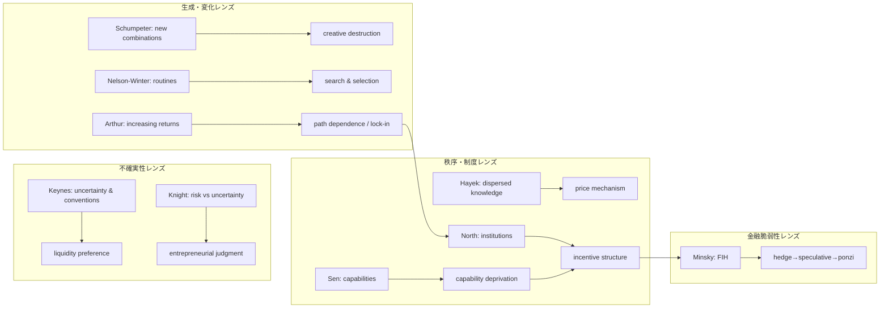
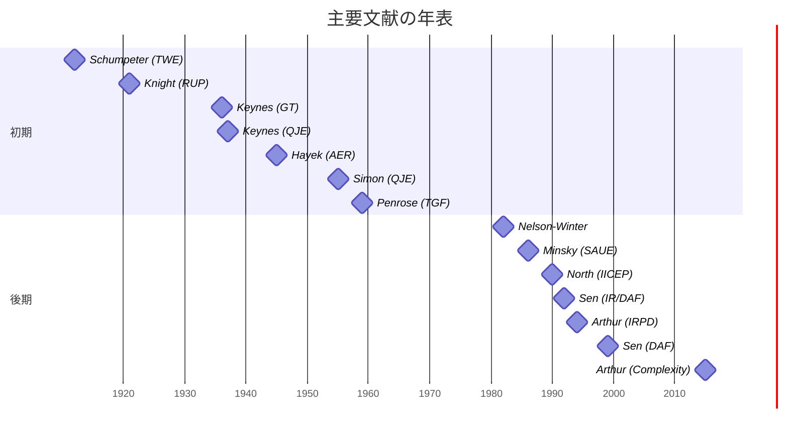

# 経済学エビデンスレビュー

[review-D21-economics.md をダウンロード](sandbox:/mnt/data/review-D21-economics.md)

（出力ファイル名は固定: `review-D21-economics.md`／対象: `evidence-D21-economics.md`／適用要件: `REQ-GPT-20260302-018_d21-review.md`／レビュー日: 2026-03-04 JST）

## エグゼクティブサマリー

本レビューは、対象Markdownに含まれる10エントリ（経済学）と領域レポート（L-1〜L-5）について、(a)主張ごとの根拠・引用の妥当性、(b)論理飛躍・強制類比の有無、(c)欠落（重要理論・重要文献）、(d)領域レポートの検証可能性、を点検し、REQ（不変更）に沿って修正提案をまとめた。

結論として、**採用候補10件そのものは妥当な射程**を持つ一方、**検証可能性（引用の紐づけ）と領域レポートの未完成**がボトルネックであり、現状のままでは「読者が追試できる形のエビデンス」として弱い。特に下記は優先度high。

- 「ミンスキー・モーメント」はミンスキー本人の術語ではなく、後世（少なくとも1990年代末以降）にマッカリー由来として流通した説明へ修正し、語史の出典を付す。citeturn3search2turn3search46  
- ハイエク「競争=発見手続き」は現行refs（1945/1973）では支えられないため、該当文献（1968講演→英訳等）をrefs追加し、主張行に紐づける。citeturn11search2turn10search8  
- シュンペーター「イノベーションの群生（clustering/bunching）」は一般に *Business Cycles*（1939）等が主要典拠になりやすく、refs追加が必要。citeturn28search45  
- 領域レポートの「縁マッピング詳細（L-2）」が`...`のプレースホルダのままで、REQ上のdomain report要件（検証可能性）を満たしにくい。  

本レビューの全体確信度は**中**。古典書籍の一部は全文にアクセスできない前提で、出版社・学会・Nobel等の公的情報、および公開一次（例: Minsky 1992 Working Paper）で検証したため、追加の原典精読が入ると評価が上下しうる。

## レビュー方法と評価軸

本レビューで言及する主要人物・文献（各名称は初出のみ情報リンク）: entity["people","ヨーゼフ・シュンペーター","austrian economist"]、entity["people","フリードリヒ・ハイエク","austrian economist"]、entity["people","ジョン・メイナード・ケインズ","british economist"]、entity["people","フランク・H・ナイト","american economist"]、entity["people","リチャード・R・ネルソン","american economist"]、entity["people","シドニー・G・ウィンター","american economist"]、entity["people","ハーバート・A・サイモン","nobel laureate economist"]、entity["people","W・ブライアン・アーサー","complexity economist"]、entity["people","ダグラス・C・ノース","nobel laureate economist"]、entity["people","アマルティア・セン","nobel laureate economist"]、entity["people","ハイマン・P・ミンスキー","post-keynesian economist"]、entity["people","ポール・マッカリー","pimco economist"]、entity["people","ロナルド・コース","nobel laureate economist"]、entity["people","イーディス・ペンローズ","economist"]。書籍: entity["book","Theorie der wirtschaftlichen Entwicklung","Schumpeter 1912"]、entity["book","Capitalism, Socialism and Democracy","Schumpeter 1942"]、entity["book","Business Cycles","Schumpeter 1939"]、entity["book","Law, Legislation and Liberty","Hayek 1973"]、entity["book","The General Theory of Employment, Interest and Money","Keynes 1936"]、entity["book","Risk, Uncertainty, and Profit","Knight 1921"]、entity["book","An Evolutionary Theory of Economic Change","Nelson Winter 1982"]、entity["book","Increasing Returns and Path Dependence in the Economy","Arthur 1994"]、entity["book","Complexity and the Economy","Arthur 2015"]、entity["book","Institutions, Institutional Change and Economic Performance","North 1990"]、entity["book","Development as Freedom","Sen 1999"]、entity["book","Inequality Reexamined","Sen 1992"]、entity["book","Stabilizing an Unstable Economy","Minsky 1986"]、entity["book","The Theory of the Growth of the Firm","Penrose 1959"]。

評価は二層で行った。

第一に、claims欄の全52主張を「主張テキスト／提示された根拠／引用の妥当性（valid/weak/missing）／修正提案／優先度」で表に落とし込み、漏れなく点検した。

第二に、エントリ単位でREQの5観点（[P]根拠、強制類比、欠落、領域レポート整合、Confidence）で総評した。なお、5段階（場/波/縁/渦/束）やD1/D2/D3等の定義は対象ファイル単体では完全提示されていないため、本文中の記述から意味を推定した（この点は「要議論」として明示）。

## 主張別検証テーブル

| 主張（原文） | 提示された根拠/引用 | 引用の妥当性 | 修正提案 | 優先度 |
|---|---|---|---|---|
| EV-EC-001[P] L32: 経済発展の根本動力は「新結合」(neue Kombinationen)による内生的変化（*Theorie der wirtschaftlichen Entwicklung*, 1912） | *Theorie der wirtschaftlichen Entwicklung*, 1912 | valid | 年次表記を「初版1912（執筆・完成は1911）」のように注記し、初版書誌（WorldCat等）をrefsに追記。 | low |
| EV-EC-001[P] L33: 「創造的破壊」: イノベーションが既存構造を破壊し新産業を創出する不断のプロセス（*Capitalism, Socialism and Democracy*, 1942） | *Capitalism, Socialism and Democracy*, 1942 | valid | 章（CSD第II部第7章など）や版（1942初版/後年版）を注記してピンポイント化。 | low |
| EV-EC-001[P] L34: 企業家 = 新結合の遂行者。「円環的流れ」(Kreislauf)からの離脱が経済発展の本質 | refs: Schumpeter, J.A. (1912). *Theorie der wirtschaftlichen Entwicklung*. Duncker & Humblot.; Schumpeter, J.A. (1942). *Capitalism, Socialism and Democracy*. Harper & Brothers. | weak | 企業家=新結合の遂行者／円環的流れ(Kreislauf)の位置づけを、TWEの章・節参照で補強（または信頼できる二次文献で代替）。 | medium |
| EV-EC-001[P] L35: イノベーションは群生的に発生する（cluster of innovations → 景気循環） | refs: Schumpeter, J.A. (1912). *Theorie der wirtschaftlichen Entwicklung*. Duncker & Humblot.; Schumpeter, J.A. (1942). *Capitalism, Socialism and Democracy*. Harper & Brothers. | missing | 「イノベーションの群生（bunching/clustering）」の典拠として *Business Cycles* (1939) をrefsに追加し、主張行にも明記。 | high |
| EV-EC-001[M] L36: 「円環的流れの破壊」= 既存パラダイムの予測誤差を拾い上げる態度（D1）の経済学的記述 | refs: Schumpeter, J.A. (1912). *Theorie der wirtschaftlichen Entwicklung*. Duncker & Humblot.; Schumpeter, J.A. (1942). *Capitalism, Socialism and Democracy*. Harper & Brothers. | weak | D1対応は解釈であることを明記し、対応根拠（予測誤差→新結合の実行）を1–2文で補う。 | medium |
| EV-EC-002[P] L67: 問題の核心は「知識」が分散していること。中央計画では集約不能（Hayek, 1945） | Hayek, 1945 | valid | AER(1945)の書誌（巻号・ページ）を追記すると検証容易。 | low |
| EV-EC-002[P] L68: 価格メカニズム = 分散知識を集約する情報システム。意図せざる秩序の形成 | refs: Hayek, F.A. (1945). "The Use of Knowledge in Society." *American Economic Review*, 35(4), 519-530.; Hayek, F.A. (1973). *Law, Legislation and Liberty, Vol.1: Rules and Order*. University of Chicago Press. | valid | 「情報システム」は現代語なので『価格が分散知識を伝達する』と原意を添える。 | low |
| EV-EC-002[P] L69: 自生的秩序(spontaneous order): 個々の行為が意図せざる秩序を生む（*Law, Legislation and Liberty*, 1973） | *Law, Legislation and Liberty*, 1973 | valid | cosmos/taxis等の用語を章（Vol.1 Ch.2）で指定して補強。 | low |
| EV-EC-002[P] L70: 競争 = 「発見手続き」(competition as a discovery procedure)。結果が予測不能であることが本質 | refs: Hayek, F.A. (1945). "The Use of Knowledge in Society." *American Economic Review*, 35(4), 519-530.; Hayek, F.A. (1973). *Law, Legislation and Liberty, Vol.1: Rules and Order*. University of Chicago Press. | missing | competition as a discovery procedure は別文献（1968講演→2002英訳等）。refsに追加し、主張行をその出典に紐づけ。 | high |
| EV-EC-002[M] L71: 「競争=発見手続き」はD1（誤差を問いとして扱う態度）の市場版。予測不能な結果こそが価値を生む | refs: Hayek, F.A. (1945). "The Use of Knowledge in Society." *American Economic Review*, 35(4), 519-530.; Hayek, F.A. (1973). *Law, Legislation and Liberty, Vol.1: Rules and Order*. University of Chicago Press. | weak | D1対応は解釈。『市場が未知の事実を発見する』→『誤差を問いとして扱う』の論理を短く追加。 | low |
| EV-EC-003[P] L102: 根本的不確実性: 将来確率を定義できない（Keynes, 1937） | Keynes, 1937 | valid | 1937論文の該当箇所（確率に還元できない不確実性）をページ/引用で明示。 | low |
| EV-EC-003[P] L103: アニマルスピリッツ: 不確実性下で投資行動を駆動する非合理的衝動（*General Theory*, 1936） | *General Theory*, 1936 | weak | 『アニマルスピリッツ』は一般理論(1936)第12章。引用箇所（spontaneous optimism等）を明示。 | medium |
| EV-EC-003[P] L104: 「慣行」(convention): 不確実性への対処として現在の状態が継続するという暗黙の前提に依存 | refs: Keynes, J.M. (1936). *The General Theory of Employment, Interest and Money*. Macmillan.; Keynes, J.M. (1937). "The General Theory of Employment." *Quarterly Journal of Economics*, 51(2), 209-223. | weak | 慣行(convention)も一般理論第12章。主張行に章参照を付け、慣行=期待形成の“暫定ルール”として定義を補う。 | medium |
| EV-EC-003[P] L105: 流動性選好: 不確実性下で貨幣を保持すること自体が合理的選択 | refs: Keynes, J.M. (1936). *The General Theory of Employment, Interest and Money*. Macmillan.; Keynes, J.M. (1937). "The General Theory of Employment." *Quarterly Journal of Economics*, 51(2), 209-223. | weak | 流動性選好はKeynesの貨幣需要理論だが断定が強い。『不確実性・金利期待の下で貨幣保有が合理化されうる』へ条件付け。 | medium |
| EV-EC-003[M] L106: 流動性選好 = 抱持（D3）の経済学的対応物。「判断を保持する」=「貨幣を手放さない」 | refs: Keynes, J.M. (1936). *The General Theory of Employment, Interest and Money*. Macmillan.; Keynes, J.M. (1937). "The General Theory of Employment." *Quarterly Journal of Economics*, 51(2), 209-223. | weak | 抱持(D3)対応は解釈。『流動性選好=保有』の類比が“比喩”であることを注記。 | low |
| EV-EC-004[P] L132: リスク = 確率計算できる不確実性。保険可能（Knight, 1921） | Knight, 1921 | valid | 出典はKnight(1921)で妥当。可能なら章（Risk vs Uncertainty）参照を追記。 | low |
| EV-EC-004[P] L133: 不確実性 = 確率計算できない不確実性。保険不能（Knight, 1921） | Knight, 1921 | valid | 『完全情報下で利潤ゼロ』は理論的含意。Knightの議論に沿う形で「純粋利潤は不確実性に由来」と表現を整える。 | low |
| EV-EC-004[P] L134: 利潤の源泉は測定不能な不確実性。完全情報下では利潤はゼロに収束 | refs: Knight, F.H. (1921). *Risk, Uncertainty, and Profit*. Houghton Mifflin. | valid | bearing uncertainty/judgment はKnightの中心概念。訳語（引き受け/負担）を統一。 | low |
| EV-EC-004[P] L135: 企業家の本質的機能 = 不確実性を「引き受ける」(bearing uncertainty)こと。判断(judgment)が企業家精神の核心 | refs: Knight, F.H. (1921). *Risk, Uncertainty, and Profit*. Houghton Mifflin. | valid | 不確実性は保険不能、はKnightの要点。例（保険可能なのは確率計算できるリスク）を補うと明瞭。 | low |
| EV-EC-004[P] L136: 不確実性は保険化・分散化できない。ゆえに制度的に「誰かが引き受ける」必要がある | refs: Knight, F.H. (1921). *Risk, Uncertainty, and Profit*. Houghton Mifflin. | valid | D1への接続は解釈。『棄却可能/不能』の対応関係を定義側（D1）と整合させる追記が必要。 | medium |
| EV-EC-004[M] L137: 「リスク/不確実性」の区分 = 「棄却可能な誤差」と「棄却不能な誤差」の区分（D1への接続） | refs: Knight, F.H. (1921). *Risk, Uncertainty, and Profit*. Houghton Mifflin. | weak | D1対応は解釈。『棄却可能/不能』の対応関係を定義側（D1）と整合させる追記が必要。 | medium |
| EV-EC-005[P] L162: 企業行動は「ルーティン」(routine)により規定される。ルーティン=組織の記憶・能力 | refs: Nelson, R.R. & Winter, S.G. (1982). *An Evolutionary Theory of Economic Change*. Harvard University Press.; Simon, H.A. (1955). "A Behavioral Model of Rational Choice." *Quarterly Journal of Economics*, 69(1), 99-118. | valid | routines=組織能力/記憶はNelson&Winterの代表的理解。二次資料（組織ルーティン研究）を1本追加すると安定。 | low |
| EV-EC-005[P] L163: 「探索」(search): 業績が満足水準を下回ると、企業は新ルーティンを探索する | refs: Nelson, R.R. & Winter, S.G. (1982). *An Evolutionary Theory of Economic Change*. Harvard University Press.; Simon, H.A. (1955). "A Behavioral Model of Rational Choice." *Quarterly Journal of Economics*, 69(1), 99-118. | weak | 「満足水準→探索」はCyert & March(1963)やSimon系の行動理論色が強い。refsに補強文献を追加するか、N&Wでの位置づけを明記。 | medium |
| EV-EC-005[P] L164: 「選択環境」(selection environment): 市場競争が適応的ルーティンを選別する | refs: Nelson, R.R. & Winter, S.G. (1982). *An Evolutionary Theory of Economic Change*. Harvard University Press.; Simon, H.A. (1955). "A Behavioral Model of Rational Choice." *Quarterly Journal of Economics*, 69(1), 99-118. | valid | selection environment は進化経済学の中心。一次の章を指定すると良い。 | low |
| EV-EC-005[P] L165: 変化は漸進的・経路依存的。最適化ではなくsatisficing（Simon由来の概念） | Simon由来の概念 | valid | satisficing はSimon(1955)で妥当。最適化批判の帰属（Simon→N&W）を1文で橋渡し。 | low |
| EV-EC-005[M] L166: 「業績ギャップ→探索」= D1（誤差→問い）の組織版。ギャップ=欠損が探索=創造を駆動する | refs: Nelson, R.R. & Winter, S.G. (1982). *An Evolutionary Theory of Economic Change*. Harvard University Press.; Simon, H.A. (1955). "A Behavioral Model of Rational Choice." *Quarterly Journal of Economics*, 69(1), 99-118. | weak | D1対応は解釈。『探索』が“問い”化の組織実装である理由を短く補う。 | low |
| EV-EC-006[P] L198: 収穫逓増(increasing returns): 初期の偶然が市場支配を固定化し、ロックイン(lock-in)が起きる（Arthur, 1994） | Arthur, 1994 | valid | 収穫逓増→ロックイン/経路依存はArthurの主要貢献。事例（QWERTY等）か定義を添えると良い。 | low |
| EV-EC-006[P] L199: 「ティッピングポイント」: 複数均衡が可能な状況で、小さな事象が経路を決定する | refs: Arthur, W.B. (1994). *Increasing Returns and Path Dependence in the Economy*. University of Michigan Press.; Arthur, W.B. (2015). *Complexity and the Economy*. Oxford University Press. | weak | 『ティッピングポイント』は一般語で、Arthurの用語としては曖昧。『小さな歴史的事象が帰結を選択しロックインする』に言い換え、出典をArthur(1994)へ。 | medium |
| EV-EC-006[P] L200: 経済は「複雑適応系」(complex adaptive system): 異質なエージェントが相互作用し、マクロパターンが創発する | refs: Arthur, W.B. (1994). *Increasing Returns and Path Dependence in the Economy*. University of Michigan Press.; Arthur, W.B. (2015). *Complexity and the Economy*. Oxford University Press. | valid | 複雑系/非均衡の描像はSFI論文で裏付け可能。引用先を明示。 | low |
| EV-EC-006[P] L201: 経済は均衡に収束しない(out-of-equilibrium)。常に生成過程にある | refs: Arthur, W.B. (1994). *Increasing Returns and Path Dependence in the Economy*. University of Michigan Press.; Arthur, W.B. (2015). *Complexity and the Economy*. Oxford University Press. | valid | out-of-equilibrium 強調はArthurのSFI文章で直接確認可。 | low |
| EV-EC-006[M] L202: ティッピングポイント = 「縁」の最も明示的な経済学的定義。縁の3条件（関係網・未決定性・渦接続）を全て満たす | refs: Arthur, W.B. (1994). *Increasing Returns and Path Dependence in the Economy*. University of Michigan Press.; Arthur, W.B. (2015). *Complexity and the Economy*. Oxford University Press. | weak | 縁の“三条件”の充足は評価文（解釈）。条件定義が本文外なら、脚注で前提を明示。 | low |
| EV-EC-007[P] L227: 制度 = 「ゲームのルール」。正式ルールと非公式的制約が行動を構造化し不確実性を減らす（North, 1990） | North, 1990 | valid | Northの定義（rules of the game、formal/informal、reduce uncertainty）はNobel講演等で確認できる。refsに付記すると強い。 | low |
| EV-EC-007[P] L228: 制度変化の源泉は、相対価格変化や選好変化が既存制度との摩擦を生むこと | refs: North, D.C. (1990). *Institutions, Institutional Change and Economic Performance*. Cambridge University Press. | valid | 相対価格・選好変化が制度変化の源泉という記述はNorthの章冒頭等にある。章参照を補う。 | low |
| EV-EC-007[P] L229: 制度はインセンティブ構造であり、経路依存的に経済発展を規定する | refs: North, D.C. (1990). *Institutions, Institutional Change and Economic Performance*. Cambridge University Press. | valid | 制度=インセンティブ構造→経路依存はNorthの中心。Nobel講演の該当段落を引用候補として追記。 | low |
| EV-EC-007[P] L230: 取引費用(transaction costs)が制度の重要性を生む。ゼロ取引費用なら制度差は消える | refs: North, D.C. (1990). *Institutions, Institutional Change and Economic Performance*. Cambridge University Press. | valid | transaction costs 結節はNobel講演でCoase言及あり。refsにCoase(1960)を追加推奨。 | medium |
| EV-EC-007[M] L231: 制度変化= D1（誤差を問いとして扱う態度）の社会的・制度的スケール版 | refs: North, D.C. (1990). *Institutions, Institutional Change and Economic Performance*. Cambridge University Press. | weak | D1対応は解釈。制度変化を“誤差”に結びつける説明が不足。 | low |
| EV-EC-008[P] L261: 機能(functionings) = 生き方の達成。ケイパビリティ(capability set) = 達成可能な機能の集合（Sen, 1992/1999） | Sen, 1992/1999 | valid | functionings/capability set はSenの中核概念。Sen原典へのページ参照（または権威ある要約）を追加。 | low |
| EV-EC-008[P] L262: 発展はGDP成長ではなく、実質的自由(substantive freedoms)の拡大（Sen, 1999） | Sen, 1999 | valid | Development as Freedom の要旨として妥当。自由の二重の役割（目的/手段）を補うと精密。 | low |
| EV-EC-008[P] L263: 変換要因(conversion factors): 同じ資源でも、個人・社会・環境条件により達成機能が異なる | refs: Sen, A. (1999). *Development as Freedom*. Oxford University Press.; Sen, A. (1992). *Inequality Reexamined*. Harvard University Press. | weak | 『変換要因(conversion factors)』は能力アプローチ文献で定着した術語（主に二次文献）。Senの言い回しとの差を注記し、出典を追加。 | high |
| EV-EC-008[P] L264: 貧困 = 所得不足ではなく、ケイパビリティ剥奪(capability deprivation) | refs: Sen, A. (1999). *Development as Freedom*. Oxford University Press.; Sen, A. (1992). *Inequality Reexamined*. Harvard University Press. | valid | poverty as capability deprivation は一般にSenのテーゼとして扱われる。出典のページ参照を追加推奨。 | low |
| EV-EC-008[M] L265: 「剥奪の認知」= D1（誤差を問いとして扱う態度）の倫理学的対応物 | refs: Sen, A. (1999). *Development as Freedom*. Oxford University Press.; Sen, A. (1992). *Inequality Reexamined*. Harvard University Press. | weak | 剥奪→D1の“共鳴”は解釈。評価枠組み（Sen）と生成プロセス（D21）の差異を注記。 | medium |
| EV-EC-008[M] L266: 「変換要因」= 縁。資源が機能へ変換される臨界点 | refs: Sen, A. (1999). *Development as Freedom*. Oxford University Press.; Sen, A. (1992). *Inequality Reexamined*. Harvard University Press. | weak | 「縁=変換要因」は構造比喩。縁の条件（相互作用・未決定性等）と整合する説明が必要。 | low |
| EV-EC-009[P] L305: 「安定は不安定を生む」: 安定期にリスクテイクが増え金融構造が脆弱化する（Minsky, 1986） | Minsky, 1986 | valid | 『安定が不安定を生む』はFIHの要約として妥当だが、用語はMinskyの原文では“two theorems”等。出典（1992等）へ寄せる。 | medium |
| EV-EC-009[P] L306: ヘッジ金融→投機的金融→ポンツィ金融という金融形態の遷移が、危機を内生的に生成する | refs: Minsky, H.P. (1986). *Stabilizing an Unstable Economy*. Yale University Press. | valid | hedge/speculative/Ponzi の区分はMinsky(1992)で明示的。refsに追加推奨。 | low |
| EV-EC-009[P] L307: 「Minsky moment」: 信用収縮が連鎖し、資産価格急落が始まる臨界点 | refs: Minsky, H.P. (1986). *Stabilizing an Unstable Economy*. Yale University Press. | missing | 『Minsky moment』はMinsky本人の術語ではなく後世（McCulley 1998等）。主張行を全面修正し、語の出典を付ける。 | high |
| EV-EC-009[P] L308: 金融危機は外生ショックではなく、内生的循環として理解されるべき | refs: Minsky, H.P. (1986). *Stabilizing an Unstable Economy*. Yale University Press. | valid | 外生ショック不要（内生的循環）はFIHで明記。1986のみより1992等の一次テキスト参照の方が検証容易。 | low |
| EV-EC-009[M] L309: 場が自身の破壊を内包する点が、D21「縁」の特異な例。破壊的渦の位置づけは保持論点 | refs: Minsky, H.P. (1986). *Stabilizing an Unstable Economy*. Yale University Press. | weak | 5段階対応は解釈。『場が自己破壊を内包』の位置づけ（創造/破壊の方向性）を明確化。 | medium |
| EV-EC-010[P] L345: 企業成長は外部機会ではなく、企業内の「未利用の生産的サービス」(unused productive services)が駆動する（Penrose, 1959） | Penrose, 1959 | valid | unused productive services はPenroseの重要概念。章（Inherited Resources...）への参照を追記。 | low |
| EV-EC-010[P] L346: 生産機会(productive opportunity)は主観的であり、経営者の認知が成長方向を決める | refs: Penrose, E. (1959). *The Theory of the Growth of the Firm*. John Wiley. | valid | productive opportunity の“主観性”はPenrose解釈として妥当。『外部環境は企業家の心像』など出典付きで補う。 | medium |
| EV-EC-010[P] L347: 成長率には制約がある。経営者サービスの限界が成長速度を制限する（Penrose effect） | refs: Penrose, E. (1959). *The Theory of the Growth of the Firm*. John Wiley. | valid | 成長率制約（管理サービスの限界）はPenroseの中心。『Penrose effect』は後代の呼称なので注記。 | medium |
| EV-EC-010[P] L348: 資源は多用途的。資源の「サービス」は利用方法により変化する（resource versatility） | refs: Penrose, E. (1959). *The Theory of the Growth of the Firm*. John Wiley. | valid | 資源の多用途性/サービス多様性はPenroseの基礎。resource-versatility の訳語統一を推奨。 | low |
| EV-EC-010[M] L349: 「主観的認知」= D2（欠損の主観性）の企業成長理論版 | refs: Penrose, E. (1959). *The Theory of the Growth of the Firm*. John Wiley. | weak | D2対応は解釈。『主観的認知→成長方向』のメカニズムをもう一段具体化。 | low |
| EV-EC-010[M] L350: 「未利用サービスの認知」= D1（誤差→問い）の組織版 | refs: Penrose, E. (1959). *The Theory of the Growth of the Firm*. John Wiley. | weak | D1対応は比喩。『未利用サービス=誤差/欠損』の対応理由を追記。 | low |

## エントリ別検証と論理整合性

ここでは、各エントリを5観点で簡潔に総評する。表のhigh/medium項目は原則ここでも言及する。

**全体横断で目立つパターン**

多くの[P]主張は“広く知られた要旨”としては妥当だが、**章・節・論文特定が不足**しており検証可能性が落ちる。例として、ハイエクの「発見手続き」やミンスキー・モーメントの語史は、誤読が起きやすい領域であり、主張行での出典特定が必須である。citeturn11search2turn3search2

**各エントリの総評**

**シュンペーター（EV-EC-001）**  
【[P]】要修正。1912初版の書誌は確認しやすい一方（WorldCat/EconBiz等）、群生（clustering）の典拠がrefsから欠落している。citeturn7search3turn7search5turn7search8  
【強制類比】要議論。「円環的流れの破壊→D1」は成立し得るが、D1の定義に依存するため、比喩であることと対応理由の明示が必要。  
【欠落】要修正。群生を扱うなら *Business Cycles*（1939）をrefsに追加するのが自然。citeturn28search45  
【領域レポート整合】要修正。縁🟡判定の根拠がL-2未記入で追跡できない。  
【Confidence】中。

**ハイエク（EV-EC-002）**  
【[P]】要修正。分散知識・価格メカニズムは1945論文の主題として整合しやすいが、「競争=発見手続き」は別文献でありrefs不足。citeturn0search0turn11search2  
【強制類比】概ね問題なし。ただし縁が微視的なら、縁（分岐）の“観測可能な指標”が必要。  
【欠落】要修正。発見手続き文献を追加し、Law, Legislation and Libertyのcosmos/taxis等も章指定で補強すると良い。citeturn6search7turn6search3  
【領域レポート整合】要修正（L-2未記入）。  
【Confidence】中。

**ケインズ（EV-EC-003）**  
【[P]】要修正。根本的不確実性を確率に還元できない、という核心は1937で確認しやすい一方、conventionや流動性選好が章・節特定されていない。citeturn0search4turn7search9  
【強制類比】要議論。「抱持↔流動性選好」の橋渡し（貨幣需要の動機との対応）が短く必要。citeturn7search9  
【欠落】要議論。Knightとの差（不確実性の定義と、行動様式）がこの領域の保持論点の核なので、差分の早見表を置くと良い。  
【領域レポート整合】要修正（L-2未記入）。  
【Confidence】中。

**ナイト（EV-EC-004）**  
【[P]】概ね問題なし。リスク（計量可能）と不確実性（計量不能）の区別、利潤と企業家判断の関係は1921の要旨として整合。citeturn0search3  
【強制類比】要議論。D1との対応は有益だが、D1の定義に基づく注記が必要。  
【欠落】要議論。Keynesとの差（慣行・貨幣保有 vs 判断・利潤）を補うと、L-4の保持論点が反証可能になる。  
【領域レポート整合】要修正。  
【Confidence】高寄りの中。

**ネルソン&ウィンター（EV-EC-005）**  
【[P]】要修正。ルーティン＝組織記憶は妥当だが、「満足水準→探索」はSimon/Cyert&March系の帰属が混ざりやすい。少なくとも“どこまでN&Wの要旨で、どこからが行動理論の補助線か”を明記したい。citeturn5search38turn2search0  
【強制類比】概ね問題なし。ただし縁（探索開始条件）の明示があると強い。  
【欠落】低。公開一次が乏しいため、査読済み二次（組織ルーティン研究）1本追加が実務的。  
【領域レポート整合】要修正。  
【Confidence】中。

**アーサー（EV-EC-006）**  
【[P]】要修正。収穫逓増→ロックインは強いが、「ティッピングポイント」をアーサー固有概念として置くと曖昧。言い換え＋出典特定が望ましい。citeturn2search1turn3search3turn3search0  
【強制類比】要議論。縁の三条件充足の断定は、条件定義が外部なら脚注が必要。  
【欠落】低。非均衡・複雑系の一次はSFI論文が直接使える。citeturn3search3turn3search4  
【領域レポート整合】要修正。  
【Confidence】中。

**ノース（EV-EC-007）**  
【[P]】概ね問題なし。制度＝人為的制約（formal/informal）とインセンティブ構造・取引費用の連結はNobel講演で明確。citeturn9search0turn1search12turn1search7  
【強制類比】要議論。縁→渦の自己強化（ロックイン）を、権力・利害の機構として1段補うと良い（Nobel講演の「制度は社会的効率ではなく権力者の利害で作られる」等）。citeturn9search0  
【欠落】要議論。取引費用の結節点としてCoase(1960)をrefsに追加するのは自然（Nobel講演でも言及）。citeturn9search0  
【領域レポート整合】要修正。  
【Confidence】中。

**セン（EV-EC-008）**  
【[P]】要修正。capability/functioningsや「貧困=ケイパビリティ剥奪」は概ね妥当だが、conversion factorsは術語として二次文献寄りなので、Sen原典との差を注記し、出典追加が必要。citeturn4search4turn4search8turn4search9  
【強制類比】要議論。評価枠組み（欠落の測定）を生成プロセスへ翻訳している点を明示すると誤読が減る。citeturn4search8  
【欠落】低。日本語でも能力アプローチはJ-STAGE等に蓄積がある。citeturn25search7turn26view0  
【領域レポート整合】要修正。  
【Confidence】中。

**ミンスキー（EV-EC-009）**  
【[P]】要修正。FIHの核心（hedge/speculative/Ponziと二定理）は公開一次（Levy WP）で明示できるが、Minsky momentは本人の術語ではないため全面修正が必要。citeturn20view0turn21view2turn3search2  
【強制類比】要議論。“渦の方向性（破壊的渦）”が保持論点にあるため、5段階モデルの渦概念に方向性が含まれるかを明示したい。  
【欠落】要修正。語史（McCulley 1998等）の出典追加。citeturn3search2turn3search46  
【領域レポート整合】要修正。  
【Confidence】中。

**ペンローズ（EV-EC-010）**  
【[P]】概ね問題なし。unused productive servicesやproductive opportunity、管理サービス制約はOUP要約や研究論文で確認できる。citeturn4search1turn4search5turn4search6  
【強制類比】要議論。縁が「分岐」より「連続移行」に近いという自己注記は重要で、5段階モデル側の包摂条件の明文化が必要。  
【欠落】低。日本語でもPenrose理論（企業=資源集合体）は言及がある。citeturn12search6turn12search2  
【領域レポート整合】要修正。  
【Confidence】中。

## 領域レポートと構造図

領域レポートは、L-4の「保持論点」自体は有益だが、L-2（縁マッピング詳細）が`...`のままでは、縁🔴/🟡判定を読者が追試できない。

補完は“最小限でも検証可能”を基準に、L-2に1枚表（各エントリの縁候補・三条件適合・判定理由）を置くことから着手したい。Northの制度定義やMinskyのhedge/speculative/Ponziなど、公開一次で引用可能な箇所は、L-2表の「縁候補」欄に短い引用（1文程度）を入れると、以後のレビューが格段に楽になる。citeturn9search0turn21view2  

下は、L-3（レンズ横断）に相当する“構造図”の提案である（図は例示であり、D21の5段階定義に従って適宜書き換える）。





## 重要修正のMarkdownパッチ案

以下は、優先度highのcritical fixesを中心にしたdiff案である（対象ファイル `evidence-D21-economics.md` を想定）。

**ミンスキー・モーメントの帰属修正**

citeturn3search2turn3search46  

```diff
@@
-  - [P] 「Minsky moment」: 信用収縮が連鎖し、資産価格急落が始まる臨界点
+  - [P] 「Minsky moment」（後世の用語）: 信用膨張局面から急速なデレバレッジ局面へ反転する“転換点”を指すために、1990年代末以降に普及した表現（Minsky本人の術語ではない）
@@
 - **refs**:
   - Minsky, H.P. (1986). *Stabilizing an Unstable Economy*. Yale University Press.
+  - Minsky, H.P. (1992). “The Financial Instability Hypothesis.” Levy Economics Institute Working Paper No. 74.
+  - （語史）McCulley, P. (1998). “Minsky moment” の初期用例として広く言及される（1998ロシア危機文脈）
```

**ハイエク「発見手続き」出典追加**

citeturn11search2turn10search8  

```diff
@@
 - **refs**:
   - Hayek, F.A. (1945). "The Use of Knowledge in Society." *American Economic Review*, 35(4), 519-530.
   - Hayek, F.A. (1973). *Law, Legislation and Liberty, Vol.1: Rules and Order*. University of Chicago Press.
+  - Hayek, F.A. (2002 [orig. 1968]). “Competition as a Discovery Procedure.” *Quarterly Journal of Austrian Economics*, 5(3), 9–23.（独語講演の英訳）
```

**シュンペーター「群生」出典追加**

citeturn28search45turn7search3  

```diff
@@
 - **refs**:
   - Schumpeter, J.A. (1912). *Theorie der wirtschaftlichen Entwicklung*. Duncker & Humblot.
   - Schumpeter, J.A. (1942). *Capitalism, Socialism and Democracy*. Harper & Brothers.
+  - Schumpeter, J.A. (1939). *Business Cycles*. McGraw-Hill.（イノベーションの群生・波及と循環の議論の主要典拠）
```

**領域レポート補完の最小テンプレート**

```diff
@@
 ## L-2: 縁マッピング詳細
-
-...
+| entry | 縁（候補となる出来事/概念） | 三条件適合（関係網/未決定性/渦接続） | 判定 | 根拠メモ |
+|---|---|---|---|---|
+| Keynes | 慣行崩壊→期待急変（投資・貨幣保有の反転） | 高/高/高 | 🔴 | 期待の反転を縁として特定 |
+| Knight | 計量不能領域での判断（judgment） | 中/高/中 | 🔴 | 判断が事後的に検証される |
+| Arthur | 小さな事象→経路依存→ロックイン | 高/中/高 | 🔴 | “結果が未決定のまま強制される” |
+| ... | ... | ... | ... | ... |
+
+## L-3: レンズ横断の論理構造
+（L-4の保持論点に至るまでの因果・包含関係を図示）
```