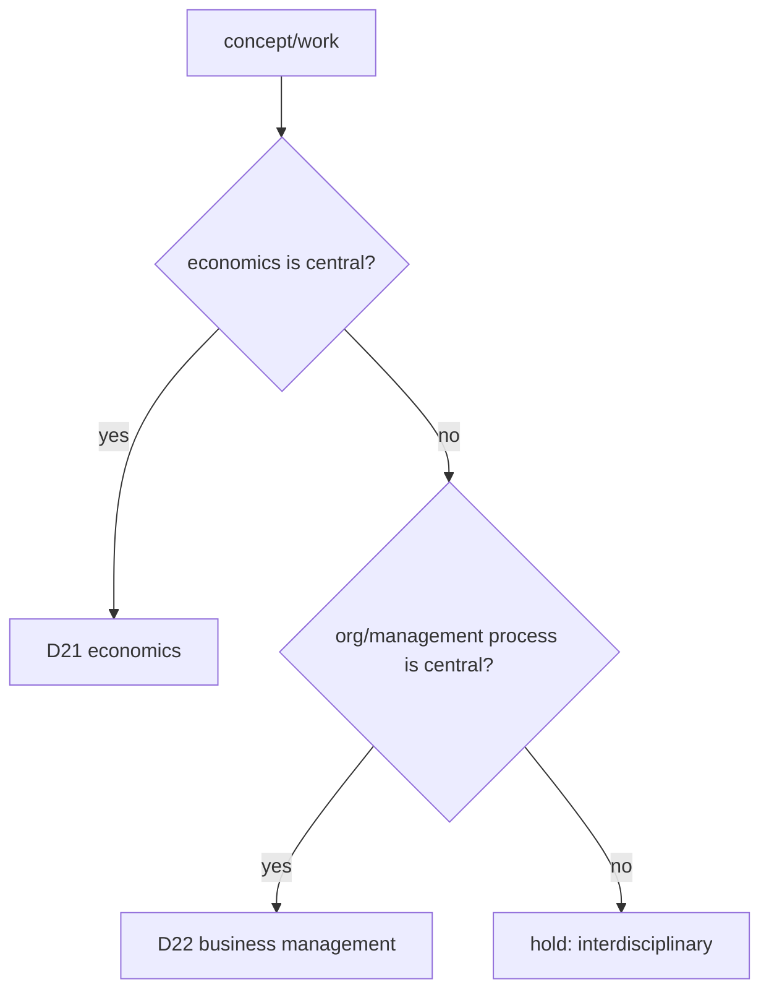
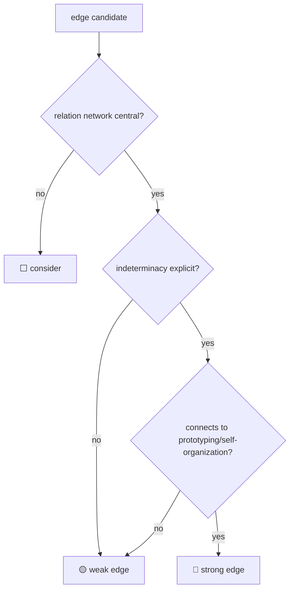

# REVIEW-D22-business-management

ダウンロード（通常Markdown版・URL併記）: [REVIEW-D22-business-management.md](sandbox:/mnt/data/REVIEW-D22-business-management.md)

## エグゼクティブサマリー

本レビューは、D22（ビジネス・マネジメント）根拠リスト（全11件がAccept）について、(P)層正確性（文献実在性・事実整合）／(M)層妥当性（5段階モデルへのマッピング整合）／縁（第3段階）判定精度（🔴/🟡/⬜）／牽強付会リスク（全Acceptによる過剰適合リスク）／欠落候補（漏れ）を監査し、**ファイル全体の推奨を「Revise」**とする。  

全11件を維持し得る一方で、複数項目において「書誌の誤り・揺れ」「批判研究の誤読」「段階モデルへの“数合わせ”誘発」「理論射程（プロセス vs 特性）の混同」が確認されたため、現状のままのAcceptは牽強付会リスクを残す。

特に優先度の高いP層修正（例）として、entity["people","大野耐一","toyota production system"]の『entity["book","Toyota Production System: Beyond Large-Scale Production","taiichi ohno 1988 english"]』は、**日本語版初出が1978年（日本での初出）で、英語版（Productivity Press）は1988年**という説明が公式系書誌で確認できるため、引用年の補正が必須。citeturn19search0  
同様に、entity["book","Presence","senge et al sol 2004"]はSoL（Society for Organizational Learning）版c2004の存在が図書館書誌で確認される一方、Crown（Crown Business）系の版は少なくとも2005年（eBook）として出版社ページに出るため、**採用する版（年・出版社）を特定して統一**する必要がある。citeturn31search6turn31search0  
また、entity["people","Stefan Kühl","organizational sociologist"]のTheory U批判はJournal of Change Management **2020年**（DOI:10.1080/14697017.2020.1744883）として一次公開されており、evidence記載の「2015 / DOI不確認」は修正が必要。citeturn32search0

**個別推奨（最終）**  
- EV-D22-001〜011：**全件 Revise**（重大な否定要素＝Reject相当は現時点で確認なし。ただし、書誌誤り・射程超過・誤読を残したままのAcceptは不可）  
- ファイル全体：**Revise**

## レビュー手法と判定基準

本レビューは、evidence側の主張（採録意図／5段階モデルの語彙／各項目のE評価）を前提としつつ、外部検証は「一次・公式・原典優先」「可能なら日本語の公的書誌（CiNii/NDL/J-STAGE等）を優先」で実施した。  

(P)層では、各引用文献について「実在」「書誌（年・版・出版社・巻号・ページ・DOI等）」「evidence記載の主張と一次情報の不整合有無」を確認し、必要に応じて“未特定/要補完”を明記する。例として、entity["organization","J-STAGE","japan science platform"]上のABAS論文では、巻号・ページ・DOI・公開日が明確に示されるため、書誌確定に有効。citeturn36search6  

(M)層では、外部理論が「段階プロセス」なのか「特性（property）」なのかを区別し、5段階モデルへの対応づけが「説明上の補助線」なのか「理論としての同型性主張」なのかを検査する。たとえばentity["people","Nassim Nicholas Taleb","incerto author"]の反脆弱性は主として“システム特性”であり、段階プロセスではない点が重要。citeturn28search0turn28search1  

縁（第3段階）判定は、evidence側の記述（例：「関係網✅ 未決定性✅ 渦接続✅」）に沿って、少なくとも以下3条件で妥当性を確認した。  
- 関係網：境界横断の複数アクター関係が中心概念か  
- 未決定性：結果・意味が事前に確定しないことが明示されるか  
- 渦接続：プロトタイピング／共創／自己組織化など第4段階（渦）に接続する力学があるか

D21（経済学）との分界は、ユーザ指示に従い、entity["people","Joseph Schumpeter","economist"]／entity["people","Friedrich Hayek","economist"]／entity["people","John Maynard Keynes","economist"]は原則D21として扱い、D22に含める場合は「経営過程の説明として不可欠」等の追加根拠を要求する（本11件では採録項目としての直接採用はなし）。  

## 全11件Acceptの牽強付会リスク俯瞰

全11件Acceptは「網羅性が高い」可能性と同時に、「どんな理論も5段階に当てはめられる」危険を増幅する。特に、外部理論側が「5ステップ」「5段階」など“5”を含む場合、数合わせが容易になり、(M)層の厳密性が下がりやすい。

この“数合わせ誘発”が強いのは、d.schoolの5モード（EV-D22-002）citeturn2search3turn3view0、タックマンの5段階（EV-D22-003）citeturn5search48turn5search2である。逆に、段階数が合わない（あるいは段階モデルでない）ものほど、(M)層で射程限定が必要（例：Talebの反脆弱性）citeturn28search0。

## 個別評価

以下では、各項目について「推奨（Accept/Revise/Reject）」「牽強付会リスク（低/中/高）」を明示し、引用文献ごとにURL・出版情報・内容関連性の検証（1段落）を付す。URLは、ユーザ要件により `code` で明示する。

**EV-D22-001 野中・竹内 組織的知識創造5フェーズ + SECI/Ba**  
**最終推奨：Revise**（P層：書誌の補完と批判文献の扱い明確化／M層：成立条件の限定）  
**牽強付会リスク：中**（“5フェーズ＝5段階”の数一致が強誘因。批判も同時提示すれば低減可能）

**(P) 文献検証（各引用のURL・出版情報・関連性）**  
(1) entity["people","野中郁次郎","knowledge management scholar"] & entity["people","竹内弘高","strategy scholar"]『entity["book","The Knowledge-Creating Company","nonaka takeuchi 1995"]』（Oxford University Press, 1995）  
- URL: `https://global.oup.com/academic/product/the-knowledge-creating-company-9780195092691`  
- 検証: 出版社（OUP）の書誌として実在が確認でき、組織的知識創造を企業競争力の中心に据える古典としてD22の根拠になり得る。特に「知識創造プロセス（暗黙知/形式知変換）」はD22の“組織内創造”の代表的理論枠であり、採用妥当性が高い。citeturn0search0  

(2) Nonaka, entity["people","Katsuhiro Umemoto","information systems scholar"], entity["people","Dai Senoo","management scholar"] (1996) “From information processing to knowledge creation: A paradigm shift in business management”, *Technology in Society* 18(2), DOI:10.1016/0160-791X(96)00001-2  
- URL: `https://www.osti.gov/biblio/518158`  
- 検証: 1996年論文として題名・DOIが確定し、ITが“knowledge-creating company”概念の実装にどう寄与し得るかを論じつつ、組織的知識創造理論を説明している。evidence側の省略タイトル（From information…）を**正式題名に補完**する改訂が必要だが、D22の「情報処理→知識創造」論点の根拠として関連性は高い。citeturn37view0  

(3) Nonaka, entity["people","Ryoko Toyama","knowledge management scholar"], entity["people","Noboru Konno","knowledge management scholar"] (2000) “SECI, Ba and Leadership: a Unified Model of Dynamic Knowledge Creation”, *Long Range Planning* 33(1) 5–34, DOI:10.1016/S0024-6301(99)00115-6  
- URL: `https://www.sciencedirect.com/science/article/pii/S0024630199001156`  
- 検証: 抄録で、知識創造モデルを（i）SECI（暗黙知/形式知の変換過程）、（ii）ba（知識創造の“shared context”）、（iii）knowledge assets の3要素として提示していることが一次的に確認できる。D22側で「場（ba）」を扱う重要根拠であり、(M)層で“場-波-縁-渦-束”のL-1（場）との整合を説明する際に必須の一次資料。citeturn36search2  

(4) entity["people","Stephen Gourlay","management scholar"] (2006) “Conceptualizing knowledge creation: a critique of Nonaka’s theory”, *Journal of Management Studies* 43(7) 1415–1436  
- URL: `https://eprints.kingston.ac.uk/339/`  
- 検証: Nonaka理論（特に暗黙知/形式知相互作用、知識変換モード）へ批判的検討を加え、理論の弱点（証拠・概念定義）を指摘した上で代替枠組みを提案する。D22の根拠としてNonaka系を採るなら、同時に“成立条件/限界/反証”を併記することで、全Acceptによる牽強付会を抑制できる（むしろ採用価値が上がる）。citeturn36search5  

**(M) マッピング妥当性**  
「5フェーズ」と「5段階」が数的に一致するため、直列マッピングの誘惑が強い。提案としては、(3)で示されるba（shared context）をL-1（場）の“条件”に限定し、他段階はSECIを“反復・循環する創造運動”として扱う（直列を強制しない）ほうが、理論の一次記述に忠実。citeturn36search2  

**縁（第3段階）判定（🟡の妥当性）**  
Justification（正当化）を縁と読むのは可能だが、一次資料側で縁を明示するわけではないため、🟡のまま「関係網/未決定性/渦接続」を文章で補完しておく必要がある（現状は“暗黙的”のまま）。  

**欠落候補**  
知識創造の“社会的実践”側（例：コミュニティ・オブ・プラクティス等）を別候補に追加すると、Nonaka系の一般化リスクを下げられる（本レビューでは候補提示に留める）。

---

**EV-D22-002 d.school デザイン思考5モード**  
**最終推奨：Revise**（P層：刊年と版の確定／M層：非線形性と反復の明記）  
**牽強付会リスク：中〜高**（5×5の数合わせが容易で、理論的“肝”が抜け落ちやすい）

**(P) 文献検証**  
(1) Hasso Plattner Institute of Design “An Introduction to Design Thinking: Process Guide”（刊年不詳／n.d.）  
- URL: `https://web.stanford.edu/~mshanks/MichaelShanks/files/509554.pdf`  
- 検証: 5モード（Empathize/Define/Ideate/Prototype/Test）や「Build to think」等を含む“プロセスガイド”として流通している一次級資料（実務での参照元）であり、5モードの根拠として実用上強い。ただしPDF自体の刊年が明確でないため、evidence側の“n.d./2009頃”は**要出典固定**（版の特定）となる。citeturn3view0  

(2) Stanford d.school（5モードの公式説明）  
- URL: `https://dschool.stanford.edu/resources/getting-started-with-design-thinking`  
- 検証: d.school公式が5モードを説明しており、「5モードが公式表現である」ことの一次根拠として最も堅い。evidenceの5モード記述はここに揃えるのが良い。citeturn2search3  

(3) entity["people","Tim Brown","design thinking advocate"] (2008) “Design Thinking”, *Harvard Business Review*（June 2008）  
- URL: `https://hbr.org/2008/06/design-thinking`  
- 検証: デザイン思考を「人々のニーズ」「技術的実現可能性」「事業としての実行可能性」を統合するアプローチとして述べる一次資料。D22で“創造”を扱う際、単なる手順ではなく“三条件のトレードオフ調停”として位置づけ直すと、5段階モデルへの過剰適合が下がる。citeturn4search0  

(4) entity["people","Atsushi Akiike","design management scholar"] & entity["people","Takeyasu Ichikohji","management scholar"] (2021) “What are the requirements for design thinking articles?”, *Annals of Business Administrative Science* 20(6) 197–209, DOI:10.7880/abas.0210930a  
- URL: `https://www.jstage.jst.go.jp/article/abas/advpub/0/advpub_0210930a/_article/-char/ja/`  
- 検証: 経営学領域でのデザイン思考研究のレビューで、近年研究の共通項としてuser centeredness と experimentation を指摘している。D22として“経営学がデザイン思考をどう理解しているか”の裏取りとして非常に有用であり、d.schoolの実務的説明と接続する際の“学術側の受容形”を補強する。citeturn36search6  

**(M) マッピング妥当性**  
Design Thinkingは非線形・反復（戻り）を前提とするため、5段階モデルへ直列で押し込むと誤解を誘発しやすい。少なくとも「Define⇄Test等の反復が本質」であることを明記し、5段階側も“循環”として読ませる改訂が必要。citeturn3view0turn2search3  

**縁判定（🟡）**  
Define（問題定義）を“境界設定”として縁に読むのは可能だが、関係網条件が薄いので🟡は維持が妥当。  

**欠落候補**  
Design Thinkingの限界（評価、統治、倫理、スケール）を補う理論（変革・実装）を別候補で併置すると、手順主義への過剰適合を下げられる。

---

**EV-D22-003 タックマン 小集団発達5段階**  
**最終推奨：Revise**（P層：引用の完全化／M層：Adjourningの再解釈根拠が必要）  
**牽強付会リスク：中**（5段階の数一致ゆえに“束”への無理付けが起きやすい）

**(P) 文献検証**  
(1) entity["people","Bruce Tuckman","group development researcher"] (1965) “Developmental sequence in small groups”, *Psychological Bulletin* 63(6) 384–399  
- URL: `https://web.mit.edu/curhan/www/docs/Articles/15341_Readings/Group_Development/Tuckman_1965_Developmental_sequence_in_small_groups.pdf`  
- 検証: 小集団発達をforming–storming–norming–performingとして整理した古典であり、レビュー論文として実在が確認できる。evidence記載の「50本のレビュー」という趣旨も、レビュー論文である点と整合する。citeturn5search48  

(2) entity["people","Mary Ann Jensen","group development researcher"] (1977) “Stages of small-group development revisited”, *Group & Organization Studies* 2(4) 419–427  
- URL（CiNii）: `https://cir.nii.ac.jp/crid/1360855569943837312`  
- 検証: Tuckmanモデルを再訪し“adjourning”を含む形で議論される後続研究として実在（誌・巻号・ページ情報が確認できる）。5段階化の根拠となる。citeturn5search2  

(3) entity["people","Connie Gersick","organizational scholar"] (1988) “Time and transition in work teams”, *Academy of Management Journal* 31(1) 9–41  
- URL（NDL）: `https://ndlsearch.ndl.go.jp/books/R100000136-I110004630410`  
- 検証: チーム発達を“punctuated equilibrium”として捉える有力な対照枠であり、Tuckmanの直列段階モデルの普遍化リスク（牽強付会）を下げるために併記価値が高い。citeturn5search1  

(4) entity["people","Denise Bonebright","organizational development scholar"] (2010) “40 years of storming…”, *Human Resource Development International* 13(1) 111–120  
- URL: `https://colab.ws/articles/10.1080/13678861003589099`  
- 検証: “storming”を含むTuckmanモデルの歴史的レビューと批判を提示する二次研究として実在し、D22で採るなら「限界・批判」も同時に示す必要があることを裏づける。citeturn5search3  

**(M) マッピング妥当性**  
forming〜performingは比較的対応させやすいが、adjourningは“束（統合）”よりも“移行・解体”の含意が強い。束に置くなら「成果・学習の制度化」等への読み替え根拠が必要で、現状のままでは牽強付会リスクが残る。citeturn5search2  

**縁判定（🔴）**  
normingを縁（境界条件の明示的形成）として強く置く判断は概ね妥当（規範・役割・信頼の明示が中心）。  

---

**EV-D22-004 クリステンセン 破壊的イノベーション**  
**最終推奨：Revise**（批判研究の“数値”を正確化し、定義条件を明文化）  
**牽強付会リスク：低〜中**（骨格は強いが、誤用が多い領域なので“適用条件”が必須）

**(P) 文献検証**  
(1) entity["people","Clayton M. Christensen","innovation theorist"]『entity["book","The Innovator's Dilemma","christensen 1997"]』（1997）  
- URL: `https://www.christenseninstitute.org/books/the-innovators-dilemma/`  
- 検証: 破壊的イノベーションの問題構造（既存顧客最適化が新市場脅威を見落とす）を提示する代表作として実在が確認でき、D22の戦略・イノベーション論の中核根拠。citeturn7search0  

(2) entity["people","Michael E. Raynor","strategy consultant"]『entity["book","The Innovator's Solution","christensen raynor 2003"]』（2003）  
- URL: `https://www.christenseninstitute.org/books/the-innovators-solution/`  
- 検証: 理論の適用・実装面を拡張する続編として実在し、D22で“実装可能性”を語る際の補助根拠。citeturn6search0  

(3) entity["people","Andrew A. King","strategy scholar"] & entity["people","Baljir Baatartogtokh","researcher"] (2015) “How useful is the theory of disruptive innovation?”, *MIT Sloan Management Review* 57(1)  
- URL: `https://sloanreview.mit.edu/article/how-useful-is-the-theory-of-disruptive-innovation/`  
- 検証: 破壊的イノベーション理論の適用妥当性をケースに基づき点検する批判研究として実在。evidence記載の「77%で予測不正確」は一次ページから直ちに裏取りできないため、**“77事例を検討し厳密適合が少数”**等、一次情報に忠実な表現へ修正すべき。citeturn15search0turn7search3  

**(M) マッピング妥当性**  
「破壊→再構成」を5段階モデル後半へ対応させるのは可能だが、Christensen理論は市場・技術・顧客構造中心で、組織内創造プロセスの段階モデルではない。よって、D22の5段階へ引くなら「組織の探索／試行→資源再配分→制度化」の補助線を明示し、段階同型を主張しない改訂が必要。  

**縁判定（🟡）**  
境界は“既存市場⇄新市場”として明確だが、関係網を中心に据える枠組みではないため🟡が妥当。

---

**EV-D22-005 センゲ 学習する組織 + Bion精神分析的組織論**  
**最終推奨：Revise**（精神分析概念はM層の比喩であることを明記／年の揺れを補正）  
**牽強付会リスク：中**（どの段階にも当てられる“万能語”化を防ぐ必要）

**(P) 文献検証**  
(1) entity["people","Peter M. Senge","systems thinking author"]『entity["book","The Fifth Discipline","senge 1990"]』（Doubleday, 1990）  
- URL（原著書誌例）: `https://catalogue.nla.gov.au/Record/2940749`  
- URL（日本語版情報例）: `https://eijipress.co.jp/en/products/2101`  
- 検証: “学習する組織”の基礎として実在し、5つのディシプリン等の枠組みはD22の組織学習・システム思考の中核根拠。日本語版の出版情報も確認でき、国内利用の書誌整合を取りやすい。citeturn11search2turn13search4  

(2) entity["people","Chris Argyris","organizational learning scholar"] & entity["people","Donald A. Schön","reflective practice scholar"]『entity["book","Organizational Learning","argyris schon 1978"]』（Addison-Wesley, 1978）  
- URL: `https://www.econbiz.de/Record/organizational-learning-a-theory-of-action-perspective-argyris-chris/10000317556`  
- 検証: 組織学習理論の古典として書誌確認でき、Senge系（学習する組織）の理論背景を補強する。D22で“学習”を扱う際の根拠として妥当。citeturn10search0  

(3) entity["people","Wilfred R. Bion","psychoanalyst"]『entity["book","Experiences in Groups","bion 1961"]』（Tavistock, 1961）  
- URL: `https://catalogue.nla.gov.au/catalog/2481809`  
- 検証: 集団の心理動態（基本想定など）を論じる古典として実在。D22に取り込む場合は“心理動態の説明枠”であり、5段階モデルの(P)層主張（実証命題）として扱わない、と明確化が必要。citeturn10search9  

(4) entity["people","Amy C. Edmondson","psychological safety scholar"]『entity["book","The Fearless Organization","edmondson 2018"]』（Wiley, 1st ed. Dec 2018 表記）  
- URL: `https://www.wiley-vch.de/en/areas-interest/finance-economics-law/the-fearless-organization-978-1-119-47724-2`  
- 検証: 心理的安全性を学習・革新と結ぶ実務書として実在。evidenceは2019年としているが、出版社側表記が2018年（1st ed.）になっているため、引用年の統一（版の特定）が必要。citeturn10search8  

(5) entity["people","David Bohm","physicist philosopher"]『entity["book","On Dialogue","bohm 1996"]』（Routledge, 1996）  
- URL: `https://www.routledge.com/On-Dialogue/Bohm-Nichol/p/book/9780415149112`  
- 検証: “対話”の理論的基盤として実在し、Senge文脈の「対話／判断の保留」等を補強する。ただし対話概念の導入は(M)層（枠組み補助）に留め、縁判定を過度に強くしない配慮が必要。citeturn11search0  

---

**EV-D22-006 マーチ 探索/活用 + 両利き経営**  
**最終推奨：Revise**（縁が⬜である理由をテキストで正当化／補助理論で縁を補う）  
**牽強付会リスク：中**（二分法を段階に押し込むと歪む）

**(P) 文献検証**  
(1) entity["people","James G. March","organizational theorist"] (1991) “Exploration and Exploitation in Organizational Learning”, *Organization Science* 2(1) 71–87, DOI:10.1287/orsc.2.1.71  
- URL（CiNii）: `https://cir.nii.ac.jp/crid/1360011142930466688`  
- 検証: 探索/活用のトレードオフをモデル化する古典として実在が確認でき、D22の組織学習・適応の基礎根拠として妥当。citeturn14search2  

(2) entity["people","Charles A. O’Reilly III","management scholar"] & entity["people","Michael L. Tushman","organizational scholar"] (2004) “The Ambidextrous Organization”, *Harvard Business Review* 82(4) 74–81  
- URL（HBR）: `https://hbr.org/2004/04/the-ambidextrous-organization`  
- 検証: 探索ユニットと活用ユニットを分離しつつ、経営層で統合する“構造的両利き”を説明する一次資料として実在。5段階モデルに当てるより、D22の「組織設計原理」として明示し、段階対応は補助線に留めるのが妥当。citeturn15search0turn15search8  

(3) entity["people","Michael D. Cohen","organizational scholar"], March, entity["people","Johan P. Olsen","political scientist"] (1972) “A Garbage Can Model of Organizational Choice”, *Administrative Science Quarterly* 17(1), DOI:10.2307/2392088  
- URL（CiNii）: `https://cir.nii.ac.jp/crid/1360574092883909888`  
- 検証: organized anarchyの意思決定モデルとして実在が確認でき、問題・解・参加者・機会の“合流”を扱うため、縁（合流条件）説明の補助理論として有効（ただしD22の主軸は意思決定/組織論側）。citeturn16search2  

---

**EV-D22-007 ワイク センスメイキング + HRO**  
**最終推奨：Revise**（Weick概念で整理し、精神分析語彙の混入を抑制）  
**牽強付会リスク：低-中**（enactment中心で整えれば低い）

**(P) 文献検証**  
(1) entity["people","Karl E. Weick","organizational psychologist"]『entity["book","Sensemaking in Organizations","weick 1995"]』（SAGE, 1995）  
- URL: `https://us.sagepub.com/en-us/nam/sensemaking-in-organizations/book4988`  
- 検証: センスメイキングの特性を体系化した著作として出版社ページで確認でき、D22の「意味づけ・認知・組織行動」根拠として妥当。citeturn18search3  

(2) Weick (1993) “The Collapse of Sensemaking in Organizations: The Mann Gulch Disaster”, *Administrative Science Quarterly* 38(4), DOI:10.2307/2393339  
- URL: `https://colab.ws/articles/10.2307/2393339`  
- 検証: 災害事例を通じて意味づけ崩壊を分析する論文としてDOI付きで確認でき、縁（境界での解釈・行為）失敗の代表ケースとして活用できる。citeturn17search5  

(3) Weick & entity["people","Kathleen M. Sutcliffe","management scholar"]『entity["book","Managing the Unexpected","weick sutcliffe 2007"]』（2nd ed., Jossey-Bass, 2007）  
- URL: `https://www.oreilly.com/library/view/managing-the-unexpected/9780787996499/`  
- 検証: HRO原則（preoccupation with failure 等）を整理した書として版・目次レベルで確認でき、D22の高信頼運用・マインドフルネスの根拠として妥当。citeturn17search4  

(4) Weick (1988) “Enacted sensemaking in crisis situations”, *Journal of Management Studies* 25(4) 305–317, DOI:10.1111/j.1467-6486.1988.tb00039.x  
- URL（CiNii）: `https://cir.nii.ac.jp/crid/1360294646954226432`  
- 検証: enactment（行為と環境の相互生成）を危機状況の意味づけとして論じ、縁（境界における相互生成）を最も直接に裏づける一次資料。縁🔴の根拠として十分強い。citeturn17search3  

---

**EV-D22-008 TPS/リーン + アジャイル**  
**最終推奨：Revise**（P層：大野の年/版補正が必須／M層：フェーズ特化として再定位）  
**牽強付会リスク：中**（TPS×Agileの“流行接続”で過剰一般化しやすい）

**(P) 文献検証**  
(1) entity["book","Toyota Production System: Beyond Large-Scale Production","ohno 1978 jp 1988 en"]（英語版=1988、原著は1978日本で初出）  
- URL: `https://www.routledge.com/Toyota-Production-System-Beyond-Large-Scale-Production/Ohno/p/book/9780915299140`  
- 検証: 公式系書誌で「日本で1978年5月に初出、Productivity Pressの1988年版が英語版初」という注記が確認できるため、evidenceの「1978 Productivity Press」は不整合。**1978=原著、1988=英訳版**として書誌修正が必須。citeturn19search0  

(2) entity["people","James P. Womack","lean institute founder"] & entity["people","Daniel T. Jones","lean expert"]『entity["book","Lean Thinking","womack jones 1996"]』（1996）  
- URL: `https://www.simonandschuster.com/books/Lean-Thinking/James-P-Womack/9781439135952`  
- 検証: Leanの基本原則（価値・価値流れ・フロー・プル・完全性）と実装の物語を示す書として出版社ページで確認でき、D22の運用改善・価値流れ設計の根拠として妥当。citeturn19search4  

(3) entity["people","Jeffrey K. Liker","industrial engineer"]『entity["book","The Toyota Way","liker 2004"]』（McGraw-Hill, c2004）  
- URL（NDL）: `https://ndlsearch.ndl.go.jp/books/R100000001-I45111100472284`  
- 検証: NDL書誌で出版年c2004、出版社McGraw-Hill等が確定し、TPS思想を14原則として整理する書として実在確認できる。制度化（束）側の説明に強い。citeturn22search3  

(4) entity["people","Eric Ries","lean startup author"]『entity["book","The Lean Startup","ries 2011"]』（Crown Business系、2011）  
- URL: `https://www.penguinrandomhouse.com/books/210088/the-lean-startup-by-eric-ries/`  
- 検証: 出版社ページで内容（validated learning等）が確認でき、D22の“実験→学習→方向転換”の根拠として妥当。citeturn22search0  

(5) 『entity["book","Manifesto for Agile Software Development","agile manifesto 2001"]』（2001）  
- URL: `https://agilemanifesto.org/`  
- 検証: 4つの価値と著者一覧を原典として提示する公式サイトであり、アジャイルの一次根拠として最適。TPSとの関係は“比喩的連結”になりやすいので、D22側では接続点（フィードバック、短サイクル学習等）を限定して述べるのが安全。citeturn20search2  

---

**EV-D22-009 エフェクチュエーション**  
**最終推奨：Revise**（後半段階への射程外適用を限定し、D21寄り引用の扱いを明確化）  
**牽強付会リスク：低-中**（原理の一部は縁🔴と強く整合するが、束まで埋めると上がる）

**(P) 文献検証**  
(1) entity["people","Saras D. Sarasvathy","entrepreneurship scholar"] (2001) “Causation and Effectuation…”, *Academy of Management Review* 26(2) 243–263  
- URL（NDL）: `https://ndlsearch.ndl.go.jp/en/books/R100000136-I1362262946257131264`  
- URL（CiNii）: `https://cir.nii.ac.jp/crid/1363951796189225856`  
- 検証: 2001年の論文として巻号・ページ・出版社が確定し、effectuationを“predictionではなくcontrolの論理”として提示する一次資料。D22の起業・不確実下意思決定の根拠として適合。citeturn24search1turn24search4  

(2) 『entity["book","Effectuation: Elements of Entrepreneurial Expertise","sarasvathy 2008"]』（Edward Elgar, c2008）  
- URL（CiNii Books）: `https://cir.nii.ac.jp/crid/1971149384795997881`  
- 検証: 図書としてc2008の書誌が確認でき、effectuationを体系化した書として実在。出版社公式の初版ページが入手しづらい場合でも、国内公的書誌で版が確定できる点は強い。citeturn25search7  

(3) entity["people","Frank H. Knight","economist"]『entity["book","Risk, Uncertainty and Profit","knight 1921"]』（Houghton Mifflin, 1921）  
- URL（Liberty Fund）: `https://rosenfels.org/pll-v5/titles/306.html`  
- URL（CiNii Books）: `https://ci.nii.ac.jp/ncid/BA51316923`  
- 検証: 1921年の古典として版情報が確認でき、リスクと不確実性の区別を含む。これは本質的にD21（経済学）寄りなので、D22では「不確実性概念の由来」程度の限定引用に留めるのが分界上安全。citeturn23search0turn23search5  

---

**EV-D22-010 タレブ アンチフラジャイル + ブラックスワン**  
**最終推奨：Revise**（段階プロセスではなく“設計原理/特性”として再定義）  
**牽強付会リスク：低-中**（特性×段階の混同を避ければ低い）

**(P) 文献検証**  
(1) Taleb『entity["book","The Black Swan: Second Edition","taleb 2007"]』（Random House系、Hardcover 2007-04-17）  
- URL: `https://www.randomhousebooks.com/books/176226/`  
- 検証: 出版社ページでhardcover刊行日（2007-04-17）や版情報が確認でき、希少事象と事後合理化を扱う一般書として実在。D22では「予測限界の前提」「頑健性設計」の根拠として使える。citeturn28search1  

(2) Taleb『entity["book","Antifragile","taleb 2012"]』（Hardcover 2012-11-27）  
- URL: `https://www.randomhousebooks.com/books/176227/`  
- 検証: 出版社ページで刊行日・版が確認でき、“反脆弱（ストレッサーで強くなる）”の概念を提示する書として実在。D22の学習・実験・冗長性の正当化に有用だが、段階モデルそのものではない点を明記すべき。citeturn28search0  

(3) Taleb『entity["book","Skin in the Game","taleb 2018"]』（Hardcover 2018-02-27）  
- URL: `https://www.randomhousebooks.com/books/537828/`  
- 検証: 刊行情報が確認でき、リスク共有（skin in the game）を制度設計・倫理として論じる書として実在。D22では束（制度化・責任）の設計原理として補助的に接続可能。citeturn28search3  

(4) Taleb『entity["book","Statistical Consequences of Fat Tails","taleb 2020"]』（STEM Academic Press, 2020）  
- URL（Wolfram Library Archive）: `https://library.wolfram.com/infocenter/Books/9775/`  
- 検証: 出版社・ISBN・概要が確認でき、ファットテール分布下での統計推論の落とし穴を扱う技術書として実在。D22では「計測・評価・KPIの統計的誤差」を扱う限定用途に留めると整合的。citeturn28search2  

---

**EV-D22-011 シャーマー U理論**  
**最終推奨：Revise**（批判文献の年・DOI修正／版（2009/2016等）特定／影響関係と構造類似の峻別）  
**牽強付会リスク：中-高**（段階圧縮と“スピリチュアル含意”の扱いに注意）

**(P) 文献検証**  
(1) entity["people","C. Otto Scharmer","mit lecturer"]『entity["book","Theory U","scharmer 2009"]』（Berrett-Koehler、版差あり）  
- URL（BK Connection・書籍説明）: `https://www.bkconnection.com/books/title/theory-u`  
- URL（Presencing Institute）: `https://www.presencing.org/theoryu`  
- 検証: 書籍としてBK Connectionに紹介ページがあり、blind spotやpresencingを含むプロセスとして説明される。版としては2016第2版（ISBN 9781626567986）も確認できるため、evidenceの「2007/2009」は**採用する版を固定**して引用年を統一すべき。citeturn34search2turn34search6turn33search1  

(2) Scharmer & entity["people","Katrin Kaufer","social scientist"]『entity["book","Leading from the Emerging Future","scharmer kaufer 2013"]』（Berrett-Koehler, 2013）  
- URL（BK Connection）: `https://bkconnection.com/products/9781605099279_leading-from-the-emerging-future`  
- 検証: 出版社系ページで内容と書誌が確認でき、Theory Uの社会・経済システムへの展開（ego-system→eco-system等）を補う関連書として実在。citeturn33search4  

(3) entity["people","Joseph Jaworski","consultant"], entity["people","Betty Sue Flowers","writer consultant"] ほか『entity["book","Presence","senge scharmer jaworski flowers 2004"]』（版揺れ：SoL c2004 / Crown 2005等）  
- URL（SoL c2004：CiNii）: `https://ci.nii.ac.jp/ncid/BA81677873`  
- URL（Crown 2005：出版社ページ）: `https://www.penguinrandomhouse.com/books/163980/presence-by-peter-senge-c-otto-scharmer-joseph-jaworski-betty-sue-flowers/`  
- 検証: SoL版c2004の書誌が国内カタログで確認される一方、出版社ページでは2005年（eBook）など別版が確認できる。Theory Uの系譜（presence/presencing）を論じるなら、どの版を参照しているかを明確化しないと(P)層が崩れる。citeturn31search6turn31search0  

(4) Kühl (2020) “The Blind Spots in Theory U: The Reconstruction of a (Change-) Management Fashion”, *Journal of Change Management* 20(4) 314–321, DOI:10.1080/14697017.2020.1744883  
- URL（Bielefeld Univ.公開）: `https://pub.uni-bielefeld.de/record/2942035`  
- 検証: 2020年のJCM論文として題名・巻号・ページ・DOIが確定し、Theory Uを“management fashion”として批判する一次資料が存在する。evidence記載の「2015 / DOI不確認」は誤りとして修正必須。批判を併置することで、Theory Uの(M)層過剰適合を抑制できる。citeturn32search0  

**(M) マッピング妥当性**  
Theory Uはプロセス枠組みでありマッピング自体は可能だが、7段階→5段階圧縮は恣意性が入りやすい。さらに“presencing”の含意を(P)層（事実命題）として扱うと検証不能になりやすいため、(M)層の比喩・実践指針に限定する改訂が必要。citeturn34search2turn32search0  

**縁判定（🟡の再検討）**  
crystallizing等を縁に置くなら、関係網条件が弱い点を補う必要がある。むしろ「共創プロトタイピング開始点」を縁に置く再設計のほうが、縁の三条件（関係網/未決定性/渦接続）に近づく可能性がある。citeturn34search2turn32search0  

## 5観点比較表

| ID | テーマ | P層（実在性・整合） | M層（5段階マップ） | 縁判定（現状→所見） | 牽強付会リスク | 欠落候補（例） | 推奨 |
|---|---|---|---|---|---|---|---|
| EV-D22-001 | 知識創造(SECI/ba) | ほぼOK（補完要） | 中 | 🟡→妥当(要明示) | 中 | CoP/実証研究 | Revise |
| EV-D22-002 | Design Thinking | OK（年補完要） | 中 | 🟡→弱い | 中-高 | 批判/評価統治 | Revise |
| EV-D22-003 | チーム発達 | OK | 中 | 🔴→妥当 | 中 | 安全性/対立 | Revise |
| EV-D22-004 | 破壊的イノベ | OK（統計表現修正） | 中 | 🟡→妥当 | 低-中 | 戦略/RBV | Revise |
| EV-D22-005 | 学習組織+精神分析 | OK（年揺れ補正） | 中 | 🟡→妥当 | 中 | 変革実装 | Revise |
| EV-D22-006 | 探索/活用+両利き | OK | 中 | ⬜→妥当 | 中 | 動的能力 | Revise |
| EV-D22-007 | sensemaking+HRO | OK | 中 | 🔴→妥当 | 低-中 | 意思決定論 | Revise |
| EV-D22-008 | TPS/Lean/Agile | 要修正（年不整合） | 中 | 🟡→妥当 | 中 | PDCA/TOC | Revise |
| EV-D22-009 | Effectuation | OK | 中 | 🔴→妥当 | 低-中 | スケーリング | Revise |
| EV-D22-010 | Antifragile | OK | 低-中（特性） | 🟡→弱い | 低-中 | ERM/Resilience | Revise |
| EV-D22-011 | Theory U | 要修正（Kühl等） | 中 | 🟡→要再検討 | 中-高 | 実証/批判併置 | Revise |

## 総合所見と改訂提案

ファイル全体をReviseとする主要因は「全Accept＝過剰適合の温床」それ自体ではなく、**過剰適合を抑える安全弁（P層の正確な書誌、批判の併置、射程限定）が未整備**な点にある。特に、Ohno（年/版）、Presence（版/出版社）、Kühl（年/DOI）、disruptive innovation批判の“数値表現”は、D22証拠としての信頼性を直接下げるため、最優先で修正すべき。citeturn19search0turn31search6turn32search0turn15search0turn7search3  

改訂の具体提案は以下。  
- (P)層は「年・版・出版社・DOI」の揺れをゼロにする（根拠の“土台”）。特に英訳/改訂版がある書籍は「どの版を参照しているか」を明記する（Ohno, Presence, Theory U等）。citeturn19search0turn34search6turn31search6  
- (M)層は、対応づけを“直列段階”で固定しない。Design Thinkingのように反復が前提のものは、段階モデル側も“往復・ループ”として扱う注記を必須とする。citeturn2search3turn3view0  
- 縁判定は「3条件（関係網/未決定性/渦接続）」でチェックし、満たさない場合は⬜（空白）を“欠陥”ではなく“射程外”として説明可能にする（例：探索/活用は二分法で縁を直接語らない）。citeturn16search2turn14search2  
- 欠落候補として、D22の網羅性と牽強付会抑制の両面から、変革実装（Lewin/Kotter/ADKAR等）、品質改善（Deming/PDCA）、戦略（Porter/RBV）、意思決定（限定合理性・バイアス）などを別途候補化すると、特定理論への“万能割当”が減る。  

