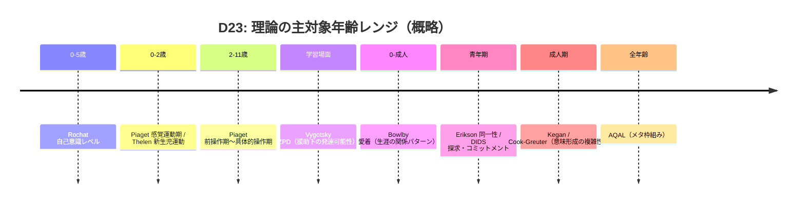

# D23 発達心理学 evidence レビュー結果
[ダウンロード: REVIEW-D23-developmental-psychology.md](sandbox:/mnt/data/REVIEW-D23-developmental-psychology.md)

（ダウンロード用ファイル名: `REVIEW-D23-developmental-psychology.md`）

## エグゼクティブサマリー

本レビューは、`evidence-D23-developmental-psychology.md`（D23: 発達心理学の論拠DB、11エントリ＋L-1〜L-5）を、指示書`REQ-GPT-20260304-023_d23-review.md`の観点に沿って監査（P層・M層・縁判定・牽強付会・欠落候補、加えてD23固有の理論横断マッピング／発達段階整合／年齢横断の構成概念妥当性）した。(evidence-D23-developmental-psychology.md L11-L17) (REQ-GPT-20260304-023_d23-review.md L3-L70)

最重要の結論は次の3点である。

第一に、P層（一次文献に基づく記述）の**大枠は概ね正確**だが、**EV-D23-003（DIDS）**に「5次元モデル提示」を**2006年論文まで遡らせている**記述があり、これは一次文献の系譜（2006: 4次元モデル、2008: 反芻的探求を追加して拡張）と齟齬があるため、**P0（修正必要）**と判定する。(evidence-D23-developmental-psychology.md L111-L156) citeturn0search18turn9search3

第二に、M層（5段階: 場→波→縁→渦→束への構造マッピング）は、発達心理学が「構造の変容」を扱うという前提から**確証バイアスが入りやすい**。対象ファイル自身も「指し示すだけ。無理に当てはめない」と明記しており、この姿勢は妥当だが、**理論ごとの“段階”概念の粒度差（乳幼児〜成人、認知・自己・社会・動機などの領域差）**を吸収する明示的ルールが不足している。(evidence-D23-developmental-psychology.md L17-L17) (REQ-GPT-20260304-023_d23-review.md L14-L18)

第三に、「縁（3段階目）」判定は、🔴3件（キーガン／動的システム／ZPD）の根拠は概ね説明できる一方、⚪2件（マズロー／ウィルバー）は「縁が不在」というより**“縁が中心構成要素ではない”**という意味での⚪であることを明確化すると、分類の再現性が上がる（要表現調整）。(REQ-GPT-20260304-023_d23-review.md L47-L55) citeturn6search17turn4search11

監査の結果、エントリ別の最終判定（Accept / P0 / P1 / 要議論）は以下の通りである。(REQ-GPT-20260304-023_d23-review.md L64-L69)

| ID | 理論（要約） | evidence側 triage | 本レビュー判定 | 主因 |
|---|---|---|---|---|
| EV-D23-001 | キーガン構造発達理論 | ✅ Accept | Accept | P層堅牢、M層の主張範囲も適切 |
| EV-D23-002 | ロシャ自己意識レベル | ✅ Accept | P1 | レベル表記（0の扱い）を明確化すると誤読が減る |
| EV-D23-003 | DIDS（dual-cycle） | ⚠️ CA | P0 | 2006/2008のモデル系譜のP層誤差（一次文献照合） |
| EV-D23-004 | 動的システム（Thelen & Smith） | ✅ Accept | Accept | P層・M層とも整合、縁🔴根拠も妥当 |
| EV-D23-005 | ピアジェ認知発達 | ⚠️ CA | 要議論 | 「均衡化」と5段階側の“欠損保持/誤差保持”概念の整合が未確定 |
| EV-D23-006 | ヴィゴツキーZPD | ✅ Accept | Accept | P層強固、縁🔴は定義次第だが妥当性高い |
| EV-D23-007 | ボウルビィ愛着 | ✅ Accept | P1 | AAIの出典表記など、P層の参照精度を上げられる |
| EV-D23-008 | エリクソン心理社会 | ⚠️ CA | 要議論 | 8段階→5段階マッピングが恣意的になりやすい |
| EV-D23-009 | マズロー欲求階層 | ⚠️ CA | P1 | 理論の中心が動機づけで、発達“段階”と縁の扱いを分離して記述すべき |
| EV-D23-010 | Cook-Greuter自我発達 | ✅ Accept | P1 | 分布・測定の一次根拠（WUSCT/SCT等）補強で強化可能 |
| EV-D23-011 | ウィルバーAQAL | ⚠️ CA | P1 | 「全現象を4象限で記述可能」は主張として明示すべき（断定回避） |

## レビュー対象と前提

対象は、(a) D23 evidenceファイルと、(b) 指示書（レビュー観点・スコアボード・出力形式）である。(REQ-GPT-20260304-023_d23-review.md L5-L70) (evidence-D23-developmental-psychology.md L1-L635)

本レビューでの「P層/M層/縁」は対象ファイルの凡例に従い、P層は一次文献に基づく記述、M層は5段階モデルへの構造的類似（解釈）として扱う。(evidence-D23-developmental-psychology.md L15-L15)

また指示書の要求に合わせ、evidenceファイル内のtriage（✅ Accept / ⚠️ CA）は参照しつつ、最終判定は **Accept / P0 / P1 / 要議論**で統一した。(REQ-GPT-20260304-023_d23-review.md L64-L69) (evidence-D23-developmental-psychology.md L535-L560)

未指定だった点について置いた前提（=本レビューの仮定）は次の通りである。

- 5段階（場→波→縁→渦→束）の**厳密定義**は本ファイル内で概説される範囲で理解し、外部文書（他ドメインや別章）に依存する細部は「未検証」として扱った。(evidence-D23-developmental-psychology.md L11-L17)
- 参照に現れる他ドメインID（例: EV-PA-002など）は、当該ドキュメントが手元にないため、**関係の真偽ではなく“ラベル付けの妥当性”**（縁判定・過剰一般化の有無）として評価した。(evidence-D23-developmental-psychology.md L591-L624)
- 引用は、日本語/英語の一次・公式・査読資料を優先したが、書籍の全文がオンラインで直接確認できない箇所は、出版社書誌・抄録・公的アーカイブを補助的に用いた。citeturn6search3turn18search32turn10search16

## 次元別の詳細所見

**P層正確性**

P層の検証は、(i) 対象ファイルのP主張（と参照文献）が一次資料の主張範囲と整合しているか、(ii) 断定表現が「記述」なのか「理論の主張」なのかを区別できているか、(iii) 年代・用語・測定法の出典が追跡可能か、の3点で行った。(REQ-GPT-20260304-023_d23-review.md L37-L40) (evidence-D23-developmental-psychology.md L15-L15)

- **確定的なP0（修正必要）: EV-D23-003（DIDS）**  
  対象ファイルは「探求とコミットメントを5次元モデルとして提示（Luyckx et al. 2006, 2008）」と記す。(evidence-D23-developmental-psychology.md L123-L123)  
  しかし、2008論文は「4次元モデルを拡張（Extending the four-dimensional model…）」として反芻的探求（ruminative exploration）を追加する位置づけであり、2006論文は**4次元モデル**を検証・提示する系譜にある。citeturn9search3turn9search0turn0search18  
  よって「2006で5次元提示」は一次文献の系譜と一致しない（=P層の引用経路の誤差）ため、修正が必要である。citeturn9search3turn0search18

- **P層は概ね妥当だが表現調整が必要: EV-D23-011（AQAL）**  
  「すべての現象はこの4象限で記述可能」という文は、経験的事実というよりウィルバー理論の基本仮定（メタ理論上の立場）の提示であるため、断定を避け「Wilberは〜と主張/提案」と表現するとP層の正確性が上がる。(evidence-D23-developmental-psychology.md L489-L489) citeturn6search17turn6search3

- **出典追跡性が高いP層（良好例）**  
  ロシャの「出生〜4-5歳にかけて自己意識のレベルが展開する」主張は、原著抄録および論文本体の要約と整合する。(evidence-D23-developmental-psychology.md L75-L83) citeturn13search2turn13search0  
  動的システムの「新生児ステッピング反射の消失を体重増加と筋力比で説明する」論点も一次資料に整合する。(evidence-D23-developmental-psychology.md L166-L170) citeturn3search25turn3search22  
  ZPDの定義は「現実的発達水準」と「援助下の潜在的水準」の間の領域として広く引用される形と一致する。(evidence-D23-developmental-psychology.md L255-L261) citeturn1search37turn2search16  
  愛着理論については、乳児の愛着分類（SSP等）と成人の愛着表象（AAI等）の関連がメタ分析で支持されることを示しており、記述方向は妥当である。(evidence-D23-developmental-psychology.md L300-L323) citeturn10search16turn10search4

- **参照精度を上げるとよい箇所（P1）**  
  愛着理論ではAAIの“作成者/手続き”と“採点体系（Main & Goldwyn）”の区別を明示すると、P層のトレーサビリティが上がる。citeturn10search28turn10search5 (evidence-D23-developmental-psychology.md L315-L323)  
  Cook-Greuterの段階分布（一般成人母集団 n=4510 の比率）は2004論文のTable Iに依拠できるため、当該表の数字（例: Expert 36.5%, Achiever 29.7%など）を明示引用するとP層が強化される。citeturn12view1 (evidence-D23-developmental-psychology.md L444-L450)  
  ピアジェの4段階と年齢幅は通説であるが、引用されている1952年書籍は主として感覚運動期の詳細であるため、4段階の総括を明示した一次文献（あるいはPiaget自身の総説）へ参照を追加できるとより堅牢になる。(evidence-D23-developmental-psychology.md L213-L216) citeturn7search5turn7search9

**M層妥当性**

対象ファイルは発達心理学を「秩序（構造）の変容」と捉え、5段階モデルとの構造類似を根拠にマッピングする。(evidence-D23-developmental-psychology.md L13-L13) これは探索として有益だが、理論ごとに「段階」と「変化メカニズム」が異なるため、M層の妥当性は“どの抽象度で比較するか”に強く依存する。(REQ-GPT-20260304-023_d23-review.md L14-L55) citeturn13search7turn6search17

- **整合性が高い（相対的に強い）マッピング**  
  キーガンの「主体→客体」変容は、自己-他者境界（self/other）を引き直す“構造変容”として説明されるため、5段階の段階移行メカニズムとの対応は比較的透明である。(evidence-D23-developmental-psychology.md L33-L39) citeturn18search1turn18search32  
  動的システムは、安定状態（アトラクタ）と相転移（phase transition）として新構造の創発を記述し、非線形な変化・多因子相互作用を強調するため、5段階の「縁→渦→束」を“安定化と再組織化”として読む解釈は筋がよい。(evidence-D23-developmental-psychology.md L166-L175) citeturn3search23turn3search35  
  ZPDは「発達“水準”」を単独の能力でなく、他者との共同活動・媒介（道具・言語）を含む発達可能性として扱うため、「縁（関係の中での生成）」の強い候補になる。(evidence-D23-developmental-psychology.md L255-L265) citeturn2search32turn1search37

- **要議論になりやすいマッピング（D23固有の注意点）**  
  ピアジェの均衡化は、同化/調節のバランスを通じて高次均衡へ移行する枠組みであり、基本的には“誤差（不均衡）を低減して新均衡へ”という方向性を持つ。(evidence-D23-developmental-psychology.md L214-L215) citeturn7search9turn7search5  
  対象ファイルは、この点が5段階側の「欠損保持/誤差保持」と方向が異なることを自覚的に書いており（この自己批判は妥当）、その差異をどう扱うかがマッピングの論点になる。(evidence-D23-developmental-psychology.md L218-L218) (REQ-GPT-20260304-023_d23-review.md L44-L45)  
  エリクソンは“心理社会的課題（crisis）”の連鎖であり、各段階の中心構成概念は関係性・文化規範・役割期待などに強く依存する。8段階を5段階へ畳み込むときは、構造対応というより「発達課題の束ね方（分類学）」になるため、恣意性管理のルールが必要である。(evidence-D23-developmental-psychology.md L339-L358) (REQ-GPT-20260304-023_d23-review.md L52-L54) citeturn7search2  
  DIDSは“段階”というより、探求／コミットメントが循環する“プロセス”モデルであり、5段階へ単射するより、5段階の各局面で観測される“サブプロセス指標”として扱う方が整合的になりやすい。(evidence-D23-developmental-psychology.md L123-L129) citeturn9search3turn8search0

- **メタ理論の位置づけ（AQAL）の整理が鍵**  
  AQALは多理論統合のメタ枠組みとして有用だが、5段階との関係は「対応」よりも「検査（抜け漏れチェック）」として置く方が、過剰な同型化を避けられる。(evidence-D23-developmental-psychology.md L504-L504) citeturn6search17turn6search3

**縁判定精度**

指示書は縁🔴3件の根拠（特にZPD）と、縁⚪2件の妥当性（マズロー／ウィルバー）を精査することを求めている。(REQ-GPT-20260304-023_d23-review.md L47-L55)

ここでは「縁」を、対象ファイル各エントリが記す“縁の3条件”（関係網・境界・移行条件の明示）を満たすかで判定する（ただし3条件自体の厳密定義は対象ファイル外にあるため、記述から推定する）。(evidence-D23-developmental-psychology.md L40-L40) (evidence-D23-developmental-psychology.md L176-L176) (evidence-D23-developmental-psychology.md L266-L266)

- **🔴（強い縁）3件の妥当性**  
  キーガン秩序3（社会化された自己）は「対人関係に埋め込まれた意味づけ」であり、自己が関係網に組み込まれている状態を中核に据えるため、縁🔴は妥当。(evidence-D23-developmental-psychology.md L40-L40) citeturn18search1  
  動的システムはアトラクタ地形・相転移・多因子相互作用を使い、境界（分岐点・安定域）を理論の言語として持つため、縁🔴の根拠は説明可能。(evidence-D23-developmental-psychology.md L176-L176) citeturn3search23turn13search7  
  ZPDは“単独能力”ではなく、他者との協働・媒介の中で立ち上がる発達可能性として定義されるため、縁🔴とする判断は妥当性が高い。(evidence-D23-developmental-psychology.md L266-L266) citeturn1search37turn2search16

- **🟡（部分的縁）6件の妥当性の焦点**  
  ロシャは自己意識の生成を（身体-環境の分化・状況化）として描き、関係的側面はあるが、理論全体が“関係網の境界操作”に特化しているわけではないため🟡は妥当。(evidence-D23-developmental-psychology.md L85-L85) citeturn13search0  
  ボウルビィは二者関係（養育者-子）の強い理論だが、内的作業モデルが後の関係パターンへ一般化しうるため“縁はあるがスコープが限定的”という🟡理由は筋が通る。(evidence-D23-developmental-psychology.md L312-L312) citeturn10search10turn10search16  
  Cook-Greuterの段階は意味形成の複雑化であり、対人理解の拡張を含むが、縁自体を一次概念として定義しているわけではないので🟡は妥当。ただし、一般成人分布など測定論拠を補強すると、縁判定の再現性も上がる。(evidence-D23-developmental-psychology.md L450-L450) citeturn12view1  
  一方で、ピアジェ・DIDS・エリクソンは「社会関係は重要だが理論の中心が“関係境界”ではない」ため、🟡を維持するなら“縁をどの意味で採っているか”の脚注が必要になる（後述の置換提案）。(evidence-D23-developmental-psychology.md L221-L221) (evidence-D23-developmental-psychology.md L131-L131) (evidence-D23-developmental-psychology.md L358-L358)

- **⚪（縁が中心でない）2件の再記述提案**  
  マズローは所属・愛（belongingness and love）を階層の一層として含むため、関係性は“欠落”ではない。よって⚪は「縁が不在」ではなく「縁が理論の構造軸ではない」として説明すると誤解が減る。(evidence-D23-developmental-psychology.md L404-L404) citeturn2search3turn4search11  
  AQALも同様に、関係性は象限（We/Its）として含まれるが、それはメタ枠組みであり“縁の発達理論”ではない。⚪は妥当だが、分類理由を“メタ理論であること”に寄せて明記するとよい。(evidence-D23-developmental-psychology.md L497-L497) citeturn6search17turn6search3

**牽強付会リスク**

指示書が指摘する通り、発達心理学は5段階の「似て見えやすさ」が高く、対応付けは確証バイアスの温床になりうる。(REQ-GPT-20260304-023_d23-review.md L14-L16) (evidence-D23-developmental-psychology.md L13-L17)

高リスク領域は、(a) 段階理論どうしの“段階”を同型視すること、(b) メタ理論（AQAL等）を段階理論と同列に置くこと、(c) 測定法が異なる構成概念を同一の軸に押し込むこと、である。citeturn9search2turn12view1turn6search17

具体例として、エリクソン8段階→5段階の対応は、発達課題の束ね方に依存し、最適解が一意に定まらない。(REQ-GPT-20260304-023_d23-review.md L52-L54) citeturn7search2  
DIDSは循環モデルであり、段階系列へ落とすと本来の理論的利点（適応的探求と反芻的探求の区別、プロセスの層別化）が失われうる。citeturn9search3turn8search0

リスク低減の具体策として、対象ファイルの「表面的類似と構造的類似を区別する」方針を、次のように運用ルール化することを推奨する。(evidence-D23-developmental-psychology.md L17-L17)

- マッピングの単位を「概念」ではなく「観測可能な指標（測定）＋時間スケール＋相互作用のスコープ」に分解してから対応付ける。citeturn9search2turn10search16turn13search7
- 5段階に「入らない」要素を明示的に列挙し、“入らないこと自体”を知見として保持する（過剰整合の回避）。(evidence-D23-developmental-psychology.md L535-L560)
- メタ理論は「チェックリスト」として別レイヤーに置き、段階理論と同じ評価軸で序列化しない。citeturn6search17turn14search3

**欠落候補**

指示書が挙げる欠落候補（Loevinger / Stern / Fischer）は、いずれもD23の理論横断マッピングと測定の厚みを増すため優先度が高い（後節で具体化）。(REQ-GPT-20260304-023_d23-review.md L57-L61) citeturn12view1turn4search14

加えて、発達を“個体内”だけでなく“文脈/システム”として扱う理論（例: 生態学的システム理論）を入れると、「縁」の定義が社会生態学的に補強され、5段階への安易な同型化リスクを下げられる。citeturn13search15turn13search7

**D23固有評価**

D23（発達心理学）で特に重要なのは、(1) 段階理論の理論横断マッピング（抽象度の揃え方）、(2) 年齢帯の整合（乳児→児童→青年→成人の連結）、(3) 構成概念妥当性（測定・不変性）の扱いである。(REQ-GPT-20260304-023_d23-review.md L35-L61)

対象ファイルのL-3は、時間スケール（乳幼児の月〜年、成人の年〜十年、メタ理論の理論的スケール）を明示しており、これは良い設計判断である。(evidence-D23-developmental-psychology.md L561-L579)

一方で、理論横断マッピングの精度を上げるには、少なくとも次の3軸を併記した“二段階マップ”が有効である（図示）。citeturn9search2turn12view1turn13search0turn10search16

```mermaid
flowchart TB
  subgraph AxisA[軸A: 構造複雑性の焦点]
    A1[意味形成の構造変容\n(例: Kegan/Cook-Greuter)]
    A2[認知操作の構造変容\n(例: Piaget/DST)]
    A3[社会媒介による発達可能性\n(例: ZPD)]
    A4[動機づけ階層/価値\n(例: Maslow)]
    A5[統合メタ枠組み\n(例: AQAL)]
  end

  subgraph AxisB[軸B: 関係スコープ]
    B1[個体内]
    B2[二者関係]
    B3[集団・文化]
    B4[社会システム]
  end

  A1 --> B1
  A1 --> B3
  A2 --> B1
  A2 --> B2
  A3 --> B2
  A3 --> B3
  A4 --> B1
  A4 --> B2
  A5 --> B1
  A5 --> B4
```

さらに、DIDSのような尺度は、年齢帯（高校生〜大学生）での信頼性・妥当性が示されているが、縦断・文化間比較では測定不変性の検証が重要になる。citeturn8search0turn9search2turn9search6  
同様に、AAIなどの分類は文化・母集団での不変性や伝達ギャップ（sensitivityが説明できない部分）などが課題として議論されており、5段階対応の根拠に使うなら“どの部分が支持され、どの部分が未解決か”を併記した方が科学的に堅牢になる。citeturn10search16turn10search12turn10search19

年齢・理論の俯瞰は次の通りである（概念の重なりを可視化）。(evidence-D23-developmental-psychology.md L561-L579)



## 主張マッピング照合表

以下の表は、対象ファイルの代表的な主張（P層・M層の双方）を抽出し、一次資料（または一次に準ずる公式資料）と照合した結果である。(REQ-GPT-20260304-023_d23-review.md L3-L55) (evidence-D23-developmental-psychology.md L21-L635)

| claim（対象ファイルの主張） | source（一次・公式優先） | match? | notes |
|---|---|---|---|
| Keganは意味形成を段階的に進む発達として記述する。(evidence-D23-developmental-psychology.md L33-L36) | Kegan書誌・概要（Google Books）citeturn18search1 | partial | 概要は段階的発達とself/other区別の再設定を述べるが、SOIや秩序名の詳細は本文参照が必要 |
| 「主体（subject）だったものが次段階で客体（object）になる」(evidence-D23-developmental-psychology.md L33-L37) | Kegan概要（self/other区別の引き直し）citeturn18search1 | partial | “subject-object”用語を直接確認できる一次箇所の引用を加えるとより強い |
| SOI（Subject-Object Interview）が開発されている。(evidence-D23-developmental-psychology.md L35-L35) | SOIマニュアルの書誌（Lahey et al. 1988）citeturn18search19 | partial | “開発”過程までを一次で示す箇所（書籍序文等）の特定ができるとより強い |
| Rochatは出生〜4-5歳までの自己意識の展開を論じる。(evidence-D23-developmental-psychology.md L75-L83) | Rochat(2003)抄録（PubMed）citeturn13search2 | yes | 抄録が年齢範囲と「5 levels」を明記 |
| Rochatはレベルを“attractor states”として位置づける。(evidence-D23-developmental-psychology.md L81-L82) | Rochat(2003)本文（PDF）citeturn13search0 | yes | “basic attractor states of mature self-awareness”の記述がある |
| DIDSは「5次元モデルを提示（2006,2008）」(evidence-D23-developmental-psychology.md L123-L123) | 2006は4次元モデル、2008で拡張（SciDirect）citeturn0search18turn9search3 | no | 2006の位置づけ修正が必要（P0） |
| DIDSは反芻的探求を含む5次元を測定する。(evidence-D23-developmental-psychology.md L124-L126) | DIDS-J（J-STAGE）citeturn8search0 | yes | 25項目・5因子（CM/IC/EB/ED/RE）を明記 |
| Thelenは新生児ステッピングの消失を身体要因で説明する。(evidence-D23-developmental-psychology.md L166-L170) | Thelen(1982)抄録（PubMed）citeturn3search22 | yes | 体格要因とステップ数の関係が示される |
| A-not-Bを動的場/身体化で説明する枠組み。(evidence-D23-developmental-psychology.md L171-L174) | Thelen et al.(2001)（Cambridge Core / PubMed）citeturn3search23turn3search35 | yes | A-not-Bをgoal-directed actionの結合ダイナミクスとして扱う |
| Piagetは認知発達を4段階で記述する。(evidence-D23-developmental-psychology.md L213-L216) | 一次文献の特定箇所まで確認できず（翻訳書誌は確認）citeturn7search5turn7search9 | partial | 年齢帯つき4段階の明示一次箇所（Piagetの総説等）への参照追加が望ましい |
| 均衡化は1975原著→1985英訳として整理できる。(evidence-D23-developmental-psychology.md L224-L224) | 原著1975/英訳1985の書誌citeturn7search9turn7search5 | yes | 出版年の系譜は整合 |
| ZPDは現実的水準と援助下水準の差として定義される。(evidence-D23-developmental-psychology.md L255-L261) | Vygotsky引用を含む解説（NYSED）citeturn1search37 | yes | 典型的定義に一致（一次箇所への直接参照があればさらに強い） |
| AAI分類と乳児愛着の関連がメタ分析で支持される。(evidence-D23-developmental-psychology.md L318-L323) | van IJzendoorn(1995)（Psychological Bulletin / PubMed）citeturn10search16turn10search4 | yes | メタ分析として確立 |
| “secure base”概念をBowlbyが体系化（Ainsworthにも言及）。(evidence-D23-developmental-psychology.md L300-L307) | Bowlby(1988)『A Secure Base』citeturn10search10turn10search6 | yes | 書籍内でAinsworthへの言及がある |
| Eriksonはライフサイクルを段階として扱う（追加段階も議論）。(evidence-D23-developmental-psychology.md L339-L361) | 『The Life Cycle Completed』書誌（Norton）citeturn7search2 | partial | 1950/1968原典の直接照合は未実施（要補強） |
| Maslowの欲求階層（1943/1954）が通説の基礎。(evidence-D23-developmental-psychology.md L385-L389) | Maslow(1943)原典（Psychological Review）citeturn2search3 | yes | 原典が階層仮説を提示 |
| 欲求階層の実証支持は限定的。(evidence-D23-developmental-psychology.md L394-L399) | Wahba & Bridwell(1976)レビューciteturn4search11turn4search7 | yes | 部分的支持・批判的レビュー |
| 自己超越はMaslow後期に位置づく。(evidence-D23-developmental-psychology.md L403-L406) | Koltko-Rivera(2006)citeturn5search17 | yes | 後期Maslowの自己超越を整理 |
| Cook-Greuterの成人発達分布（n=4510）が提示される。(evidence-D23-developmental-psychology.md L444-L450) | Cook-Greuter(2004) Table Iciteturn12view1 | yes | 分布が明記される |
| AQALはquadrants/levels/lines/states/typesを基本要素とする。(evidence-D23-developmental-psychology.md L486-L493) | Wilber(2006) JITP “IOS Basic and the AQAL Map”citeturn6search17 | yes | 基本要素を自著で列挙 |

## 修正提案と置換

以下は、対象ファイル本文に対する**具体的な修正（P0）**および**改善提案（P1）**である。各置換は、原文を維持しつつ誤差・誤読リスクを下げることを目的とする。(REQ-GPT-20260304-023_d23-review.md L64-L69) (evidence-D23-developmental-psychology.md L1-L635)

**P0（修正必要）**

1) EV-D23-003（DIDS）: 2006/2008のモデル系譜を修正  
根拠: 2006は4次元モデル、2008で反芻的探求を加え拡張。citeturn0search18turn9search3 (evidence-D23-developmental-psychology.md L123-L123)

**置換（L123）**

```text
  - [P] アイデンティティ形成を「探求（exploration）」と「コミットメント（commitment）」の下位プロセスに分解し、5次元モデルを提示（Luyckx et al. 2006, 2008）
```

→

```text
  - [P] アイデンティティ形成を「探求（exploration）」と「コミットメント（commitment）」の下位プロセスに分解し、まず4次元モデルを提示（Luyckx et al. 2006）。その後、反芻的探求（ruminative exploration）を加えて5次元モデルへ拡張（Luyckx et al. 2008）
```

**P1（改善推奨）**

2) EV-D23-011（AQAL）: 4象限の全称化を回避して“主張”として明記  
根拠: AQALはメタ理論の枠組み提案であり、断定より立場の提示が適切。citeturn6search17turn6search3 (evidence-D23-developmental-psychology.md L489-L489)

**置換（L489）**

```text
  - [P] 4象限: 内面-個（主観/意識）, 外面-個（客観/行動）, 内面-集合（間主観/文化）, 外面-集合（間客観/社会システム）。すべての現象はこの4象限で記述可能
```

→

```text
  - [P] 4象限: 内面-個（主観/意識）, 外面-個（客観/行動）, 内面-集合（間主観/文化）, 外面-集合（間客観/社会システム）。Wilberは、あらゆる現象をこの4象限から記述・分析できるという立場（メタ理論）を提案している
```

3) EV-D23-002（Rochat）: 「5水準」と「水準0」の関係を注記（誤読防止）  
根拠: Rochat(2003)はLevel 0〜5を扱うが、“five levels”表題とのズレが初学者に混乱を招きやすい。citeturn13search0turn13search2 (evidence-D23-developmental-psychology.md L75-L83)

推奨追記（L79付近）: 「※水準0はdegree zeroとして別枠に置かれるため、表題は“five levels”だが本文では0〜5のラベルを用いる」等。

4) EV-D23-007（愛着）: AAIの“面接自体”と“採点体系（Main & Goldwyn）”を分けて参照  
根拠: Main & Goldwynの分類体系は改訂版を含む未刊行マニュアルとして言及されることが多い。citeturn10search28turn10search5 (evidence-D23-developmental-psychology.md L315-L323)

5) EV-D23-010（Cook-Greuter）: 分布の一次根拠（Table I）を本文に明示  
根拠: n=4510の分布がTable Iに明記。citeturn12view1 (evidence-D23-developmental-psychology.md L444-L450)

## 欠落候補と参照優先度

**欠落候補（優先順位つき）**

指示書が挙げた3候補は優先度が高い。(REQ-GPT-20260304-023_d23-review.md L57-L61)

- 高優先: Loevinger（自我発達理論のオリジナル）  
  Cook-Greuterが拡張した基礎理論であり、測定（WUSCT/SCT）の原型とスコアリング思想をD23に明示的に入れると、成人発達群のP層が強化される。citeturn12view1turn4search14

- 高優先: Stern（乳児期の自己感覚）  
  Rochat（自己意識）とBowlby（愛着）の間にある“乳児期の自己-他者経験の質”を埋め、年齢横断の構成概念妥当性（0-2歳領域）を補完しうる。(REQ-GPT-20260304-023_d23-review.md L59-L59)

- 高優先: Fischer（ダイナミック・スキル理論）  
  Piaget（段階）と動的システム（連続変化・相転移）の橋渡しとして、技能の粒度（タスク熟達）を明示し、横断マッピングの恣意性を下げる。(REQ-GPT-20260304-023_d23-review.md L60-L60)

追加で、D23の「縁」概念を社会生態学的に補強する観点から、次を推奨する。

- 中優先: Bronfenbrenner（生態学的システム理論）  
  個体内→二者関係→文化→社会制度という層構造を理論として持つため、縁判定とスケール横断（L-3）の基盤になる。citeturn13search15turn13search7

- 中優先: Kohlberg（道徳性発達段階）  
  典型的な段階理論としてPiaget/Eriksonと並び、段階概念の比較と5段階への過剰同型化検査に使える。citeturn12view1

**付録: 参照優先ソース（短縮リスト）**

一次・公式を優先し、今回の修正や判断に荷重の大きいものを上位に置く。

- Rochat, P. (2003). Five levels of self-awareness…（Consciousness and Cognition）citeturn13search2turn13search0
- Luyckx et al. (2006) / Luyckx et al. (2008)（DIDS系譜）citeturn0search18turn9search3
- 中間玲子ほか（DIDS-J）心理学研究（J-STAGE）citeturn8search0turn8search5
- Thelen et al. (2001) A-not-Bの動的場理論（Behavioral and Brain Sciences）citeturn3search23turn3search35
- van IJzendoorn (1995) AAI→乳児愛着のメタ分析（Psychological Bulletin）citeturn10search16turn10search4
- Maslow (1943) 原典 / Wahba & Bridwell (1976) 批判的レビュー citeturn2search3turn4search11
- Cook-Greuter (2004) 分布と段階概要（Industrial and Commercial Training）citeturn12view1
- Wilber (2006) “IOS Basic and the AQAL Map”（JITP）citeturn6search17

**全体総括コメント**

本D23 evidenceは、発達を「構造の変容」として捉える観点から5段階モデルとの対話を試みており、特に「意味形成の構造変容（Kegan/Cook-Greuter）」と「非線形な創発（動的システム）」の2本柱が強い。一方で、段階理論・プロセス理論・メタ理論が混在するため、(a) マッピングの運用ルール（抽象度・時間スケール・測定）を明示し、(b) “入らないもの”を知見として保持し、(c) 欠落候補（Loevinger/Stern/Fischer、さらに文脈理論）を追加すると、牽強付会リスクを抑えつつ縁判定と横断対応の精度を引き上げられる。(evidence-D23-developmental-psychology.md L13-L17) (REQ-GPT-20260304-023_d23-review.md L14-L61)