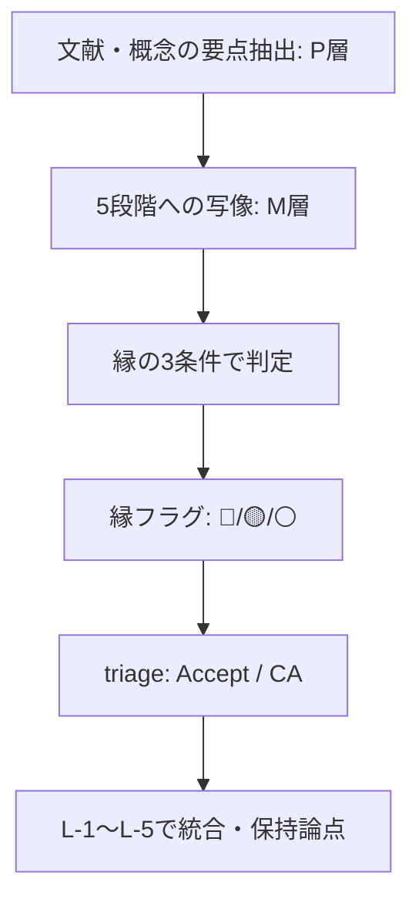

# REVIEW-D25-anthropology

## エグゼクティブサマリー

本レビューは、要件ファイルが指定する対象（10エントリ＋L-1〜L-5）と5観点（層正確性・層妥当性・縁判定精度・牽強付会リスク・欠落候補）に沿って、`evidence-D25-anthropology.md` を精査し、修正提案まで含めて評価したものです（要件: REQ L5–L6, L34–L58, L60–L68 / Evidence: L1–L9, L469–L540）。

結論として、Evidenceは「境界・移行・分類・相互行為」を軸に、人類学の“縁”対応を体系的に提示しており、全体構成（エントリ＋領域レポート）と自己批判（牽強付会リスク注記、保持論点）はよく整備されています（Evidence: L17, L40, L85, L174, L396, L527–L540）。一方で、レビュー品質（再現性・誤読耐性）を下げる要因が複数あります。

重要な改善点は次の3つです。  
第一に、[P]層（文献に基づく主張）の検証表示が「DR確認済／書誌確認済／概要」など混在し、一次資料のどこを確かめたのかが追跡できません。さらに「…」で省略された記述が多く、意図せず“断言”として読まれる危険があります（Evidence: L33–L36, L77–L80, L295–L303, L379–L392, L535）。  
第二に、[M]層（5段階マッピング）は多くの箇所で説得力があるものの、「同型」「同じ月を指す」等の比喩的断言が多く、要件が警戒する“語彙的類似の過剰読解”の懸念が残ります（要件: REQ L41–L45, L50–L53 / Evidence: L61, L106, L171, L517）。  
第三に、CA（EV-AN-009）の扱いは妥当ですが、要件の出力形式は「CA」を列挙していないため、レビュー出力上は「要議論」へ写像し、昇格条件を検証タスクとして明文化するのが安全です（要件: REQ L60–L66 / Evidence: L382, L395–L397）。

エントリ判定（要件の4区分に合わせた換算）は、P0（重大誤認）に相当する決定的瑕疵は見当たらず、EV-AN-009は「要議論」、それ以外は概ね「Accept」または「P1（改善推奨）」が妥当です（要件: REQ L62–L66 / Evidence: L488–L490）。

外部の一次・準一次情報に照らすと、通過儀礼の三相構造（分離・マージン・統合）と、そのマージンが後続研究で「betwixt and between」と呼ばれる点は、版の解説でも確認でき、Evidenceの核となる参照枠自体は妥当です。citeturn2view0  
社会劇の四局面（breach, crisis, redress, reintegration/schism）も、ターナー自身の定式化として広く確認できます。citeturn0search5turn0search17  
汚穢＝「場違い（matter out of place）」の要点も一般的理解と整合します。citeturn0search2  
したがって、本レビューは“理論選択の方向性”を否定するものではなく、「検証可能性」と「当てはめ抑制」の表現整備によって、Acceptの堅牢性を上げることを主眼とします。

## 対象資料と評価枠組み

対象は以下の2文書です。  
Evidenceは最終更新日・件数を明示し（Evidence: L5–L6）、要件側はスコアボード（Accept 9/10, CA 1）と縁フラグ配分を予定値として提示しています（要件: REQ L8–L12）。両者は整合しています（Evidence: L488–L498, L547–L558）。

Evidenceで主要に参照される研究者（要件が明示する層正確性の検証対象を含む）は、通過儀礼（entity["people","アルノルト・ヴァン・ヘネップ","french ethnologist"]）、社会劇・リミナリティ（entity["people","ヴィクター・ターナー","british anthropologist"]）、汚穢と禁忌（entity["people","メアリー・ダグラス","british anthropologist"]）、民族境界（entity["people","フレドリック・バルト","norwegian anthropologist"]）、贈与論（entity["people","マルセル・モース","french sociologist"]）、コンタクト・ゾーン（entity["people","メアリー・ルイーズ・プラット","literary theorist"]）、構造化理論・実践感覚（entity["people","アンソニー・ギデンズ","british sociologist"]／entity["people","ピエール・ブルデュー","french sociologist"]）に加え、欠落候補として構造人類学の entity["people","クロード・レヴィ＝ストロース","french anthropologist"] が明示されています（要件: REQ L36–L39, L55–L56 / Evidence: L28, L72, L117, L162, L206, L250, L384, L430, L481）。

5観点は要件に明文化されています（要件: REQ L34–L58）。本レビューでは、Evidenceが自前で掲げる抑制原則（「無理に当てはめない」「表面的類似と構造的類似を区別」）が、実際に各エントリの言い回し・判定に反映されているかを、各観点に織り込みチェックしました（Evidence: L17）。

評価フロー（Evidence内の暗黙手順を可視化）：

## 五観点サマリー表

| 観点 | 主要な指摘（要約） | 影響度 | 代表例（Evidence行） | 推奨修正（要約） |
|---|---|---|---|---|
| 層正確性 | 「DR確認済／書誌確認済／概要」が混在し、一次資料のどこを確認したか追跡不能。省略記号「…」が主張の精度を落とす。 | 中 | L23–L24, L379, L535 | 検証ラベルを統一（一次資料:章節/頁まで）、省略を減らし“断言”を避ける。 |
| 層妥当性 | マッピング自体は強いが、「同型」等の断言が多く、語彙類似の過剰読解に見える箇所が残る。 | 中 | L36–L38, L170, L441, L547–L558 | 対応を「中心対応／外挿」へ分割し、重み付け・反証可能性を明記。 |
| 縁判定精度 | 3条件の運用は有益だが、全体定義が冒頭になく、🔴集中が“甘い”と読まれる余地。 | 中 | L39, L217, L395, L442, L494–L498 | 3条件の定義・判定閾値（🔴/🟡/⚪）を共通ルール化し、根拠を短文で明示。 |
| 牽強付会リスク | 人類学＝境界中心ゆえ「何でも縁」に見える。Evidence内でも「縁の学問」等の強い言い回しが自己矛盾になり得る。 | 高 | L13, L17, L61, L517 | “比喩→分析”の切替を明確化し、断言語を「仮説」「構造的類似」へ弱める。 |
| 欠落候補 | 要件が挙げる構造人類学・医療/認知人類学の検討が未決着。さらに「場」記述不足が構造的ギャップとして残る。 | 中 | L481, L535, L539 | 追加候補（または不採用理由）を明文化し、「場」補完の方針をD25内で確定。 |

## 五観点の詳細所見

**層正確性（[P]層の正確さ・参照可能性）**  
評価（要点）: 主要理論の“骨格”は概ね妥当だが、検証の粒度が不統一で、レビュー読者が追跡できない点が最大の弱点です（要件: REQ L36–L39）。とくに、贈与論・操作連鎖・コンタクト・ゾーンは一次資料の確認不足がEvidence自身によって示唆されています（Evidence: L263, L326, L396, L535）。

根拠（抜粋）:
> evidence-D25-anthropology.md L23–L24: `flags` が「[lit:DR確認済]」「[v:未検証]」等の併記になっている（検証主体・方法が不明確）。  
> evidence-D25-anthropology.md L379: EV-AN-009 は `[lit:概要]` と明示。  
> evidence-D25-anthropology.md L535: 「贈与論の原典確認…直接確認する必要がある。性質: データ不足。」  
> evidence-D25-anthropology.md L263: 「原典本文の直接引用での段階確認は未了」  
> evidence-D25-anthropology.md L326: 「…原典の段階記述の詳細確認は部分的」

外部整合（最低限の確認）:  
通過儀礼の三相（分離・マージン・統合）と、マージンをめぐる後続研究の定番表現は、解説で明示されています。citeturn2view0  
社会劇の四局面（breach, crisis, redress, reintegration/schism）も定式化として確認できます。citeturn0search5turn0search17  
「汚穢＝場違い（matter out of place）」も通説的理解と合致します。citeturn0search2

影響度: **中**（内容の方向性は妥当でも、追跡不能だと“論拠DB”としての価値が落ちる）

推奨修正（具体）:  
1) 検証ラベルを3段階程度に統一し、各エントリに最低1つの“追跡可能情報”を付与（例: 「一次資料: 章名／節名、またはページ範囲」「二次資料: 書誌＋該当章」）。  
2) `claims` 内の「…」省略を減らし、少なくとも定義文・段階列挙は全文で残す（例: EV-AN-001 の三相、EV-AN-002 の四局面）。  
3) EV-AN-006 はEvidence自身が「データ不足」を宣言しているため（Evidence: L535）、P層の主張に“原典箇所”を追記してから最終Acceptに固定するのが安全。

**層妥当性（[M]層の5段階マッピングの妥当性）**  
評価（要点）: マッピングの発想は筋が良く、特に「波→縁→渦」が儀礼-過程論で強く出るという整理は説得的です（Evidence: L502–L504）。ただし、要件が警戒する「マージン＝縁」の自明化や語彙一致による短絡は、言い回し次第で“雑な当てはめ”に見えます（要件: REQ L43–L45）。

根拠（抜粋）:
> evidence-D25-anthropology.md L17: 「無理に当てはめない。表面的類似と構造的類似を区別する。」（原則は明記）  
> evidence-D25-anthropology.md L36–L38: 「分離＝波、マージン＝縁、統合＝渦…」と直結マッピング。  
> evidence-D25-anthropology.md L547–L558: 5段階対応表で、各段階の対応強度（○△—）を整理している。

影響度: **中**（読者の納得度・外部ドメインへの転用可能性に影響）

推奨修正（具体）:  
1) 各エントリの `5段階対応` を「中心対応（1〜2段階）」と「外挿（補助）」に分割し、外挿は根拠文（何が“渦”に相当するのか等）を1文で添える。特にCAのEV-AN-009は、外挿を明示している点は良いので（Evidence: L394–L397）、他エントリも同様の“外挿ラベル”を付ける。  
2) 「同型」「同じ月」などの比喩は、**構造的類似の主張（検証可能）**と**直観的説明（比喩）**を分けて書く（後述「牽強付会」参照）。  
3) 「場」概念がエントリごとに意味拡散しているため（例: 旧状態、規範、分類体系、ハビトゥス等が混在：Evidence L38, L83, L172, L441）、D25内の暫定定義をL-1かL-4の冒頭に置く。

**縁判定精度（縁フラグ🔴/🟡/⚪の妥当性）**  
評価（要点）: 「縁の3条件」を各エントリで明示している点は非常に良く、要件の懸念（“境界という語があるだけ”）に対して、形式的には反証可能な枠組みを与えています（要件: REQ L46–L49）。一方で、3条件の“全体定義”が冒頭にないこと、🔴が特定クラスター（001–004）に集中していることが、甘さの疑念を生みます（要件: REQ L46–L48 / Evidence: L494–L498）。

根拠（抜粋）:
> evidence-D25-anthropology.md L39: EV-AN-001 が「関係網・未決定性・渦接続」の3条件を列挙して🔴判定。  
> evidence-D25-anthropology.md L217: EV-AN-005 は(2)の薄さを根拠に🟡。  
> evidence-D25-anthropology.md L442: EV-AN-010 は3条件が部分的として⚪。  
> evidence-D25-anthropology.md L494–L498: 🔴4件、🟡4件、⚪1件、(CA)🟡1件の集計。

影響度: **中**（「縁」中心領域ゆえ、判定枠が曖昧だと全体が“縁バイアス”に見える）

推奨修正（具体）:  
1) L-0（凡例の直後）に「縁の3条件」定義を新設し、(1)関係網、(2)未決定性、(3)渦接続が何を意味するかを固定（各エントリの文言を短くでき、読みやすさも上がる）。  
2) 🔴/🟡/⚪の閾値を定義（例: 3条件がすべて明示＋(2)に具体例がある＝🔴、3条件ありだが(2)または(3)が弱い＝🟡、中心が縁ではない＝⚪）。  
3) 001/003が🔴なのは内容上妥当だとしても、要件が求める説明責任として（要件: REQ L47–L48）、**「語彙一致ではなく、どのメカニズムが“未決定性”を生むか」**を1文で補足する（例: “分類の失効／成員資格の停止／規範判断の宙吊り”など、抽象語ではなく現象語で）。

**牽強付会リスク（当てはめ過剰・断言過剰）**  
評価（要点）: 要件が「人類学は縁との親和性が高すぎて牽強付会が起きやすい」と明示している通り（要件: REQ L15, L50–L52）、最大のリスクは“正しさ”より“言い方”にあります。Evidenceは原則として抑制を掲げ（Evidence: L17）各エントリでもリスク注記をつけていますが（Evidence: L85, L396）、同時に「縁の学問」「構造は同型」等の強い言い回しが残り、抑制原則と緊張します（Evidence: L13, L61, L106, L517）。

根拠（抜粋）:
> evidence-D25-anthropology.md L13: 「『縁の学問』…10エントリ中8エントリで『縁』の強い対応」  
> evidence-D25-anthropology.md L61 / L106: 「構造は同型」系の断言が複数箇所に出現。  
> evidence-D25-anthropology.md L396: CA理由として「他段階は解釈的補填」と明示（この“抑制の書き方”は良い手本）。

影響度: **高**（本領域は“当てはめやすい”ため、断言が残るとレビュー全体が疑われる）

推奨修正（文言レベルの具体案）:  
- 「同型」→「**構造的類似（仮説）**」に置換し、どの点が類似かを1フレーズで添える（例: “段階列→閾→再統合”）。  
- 「縁の学問」→「**縁の概念が前景化しやすい領域**」程度に弱め、かわりに“縁判定の3条件で抑制する”と続ける（Evidence: L17 を活用）。  
- EV-AN-002/003の独立性（要件: REQ L16, L52–L53）について、002は「社会過程（紛争・是正・失敗分岐）」、003は「儀礼過程（分類失効・コミュニタス）」と射程を最初に明示して重複感を減らす（Evidence: L82–L85, L126–L131）。

**欠落候補（不足している候補・代替枠組み）**  
評価（要点）: EvidenceはL-1で三潮流（儀礼-過程／境界-分類／交換-物質-実践）を提示しており（Evidence: L473–L480）、10件としての“整理の骨格”は十分に成立しています。ただし、要件が挙げる欠落候補（構造人類学、医療・認知人類学）は、現状では「保持論点」や“既存CA-001”への言及に留まり、採否理由がレビュー可能な形で確定していません（要件: REQ L55–L58 / Evidence: L481, L531–L532）。

根拠（抜粋）:
> evidence-D25-anthropology.md L481: 構造分析は「分析フレーム」で「生成プロセス」ではない、として外している。  
> evidence-D25-anthropology.md L531–L532: 構造分析（既存CA-001）は“解釈分岐”として保持。  
> 要件 REQ L56–L58: 構造人類学・医療/認知・10件でのカバー率を問う。

影響度: **中**（不足自体より、「なぜ入れないか」が弱いと“恣意性”が出る）

推奨修正（具体）:  
1) 構造人類学については「不採用でもよい」が、**不採用理由を1段深く**する（例: “生成プロセスの記述が薄い”だけでなく、“5段階の哪个段階にも強く錨を下ろさず、メカニズム記述が‘関係の束’の静的表現に寄る”など）。  
2) 医療人類学・認知人類学は、採用するなら「場（環境・制度）」「束（制度化）」補完の候補になり得ます。少なくとも「候補がない理由（本Evidenceの選定基準との不一致／Phase4で追加予定 等）」をL-5に明文化すると、欠落が“計画的”になります。  
3) 10件での「創造/生成/変容プロセス」カバーについて、L-1の三潮流のうち、とくに「場」記述の弱さが残るとEvidence自身が認めているため（Evidence: L539）、欠落候補は“サブフィールド名”ではなく「場を厚く書ける理論群」を軸に探索する方が目的適合します。

## エントリ別判定と修正文案

要件の出力形式（Accept/P0/P1/要議論）に合わせ、Evidenceの triage（Accept/CA）をレビュー側で換算します（要件: REQ L62–L66 / Evidence: L488–L490）。

| ID | Evidence triage | レビュー判定 | 主な論点 | 優先修正 |
|---|---|---|---|---|
| EV-AN-001 | Accept | **Accept** | 3相→5段階対応が中核。原典検証済みと記載。 | `claims` の省略「…」を減らし、三相定義を全文で保持（Evidence: L33–L36）。 |
| EV-AN-002 | Accept | **P1** | 003との重複疑義（要件）。社会過程モデルで類比と明記は良い。 | 冒頭に「社会過程（紛争・是正・失敗分岐）」であることを明言し、003との差分を固定（Evidence: L85）。 |
| EV-AN-003 | Accept | **Accept** | “縁”内部構造の説明が最も精密。反構造批判も注記済み。 | liminoid拡張は保留と明言し、一次資料の未確認範囲を段落で分離（Evidence: L145, L529）。 |
| EV-AN-004 | Accept | **P1** | “場違い”定義は強いが、生成より維持寄りで段階記述が弱い。 | 「維持→侵犯→回復」の循環として明示し、生成主張は控えめに（Evidence: L174, L180）。 |
| EV-AN-005 | Accept | **P1** | 境界の持続は強いが(2)未決定性が薄いと自己評価。 | “縁”より“束”寄りの読み替え可能性を注記し、判定根拠を短文化（Evidence: L216–L218）。 |
| EV-AN-006 | Accept | **P1** | 原典直接確認未了が明示。hau論争もあり、層正確性の要改善。 | 原典の「三義務」「全体的社会的事象」箇所を一次資料で確定（Evidence: L535）。 |
| EV-AN-007 | Accept | **P1** | “場”補完として重要。ただし操作連鎖は“分析ツール”側面もあり、生成理論化の言い方注意。 | 「分析枠」部分と「生成プロセス」部分を分離し、一次資料確認範囲を明示（Evidence: L307, L326）。 |
| EV-AN-008 | Accept | **P1** | レビュー論文で一次理論ではない点を自覚。D18重複管理が課題。 | D25に置く理由（人類学的用途）を1段落で固定し、D18との差分欄を追加（Evidence: L366–L367, L537）。 |
| EV-AN-009 | CA | **要議論** | CA妥当（段階記述が薄く、他段階は外挿）。昇格条件が未達。 | “昇格に必要な検証”をチェックリスト化（段階的プロセスの一次記述の確保等）（Evidence: L396–L397）。 |
| EV-AN-010 | Accept | **P1** | “縁”対応は⚪だが、「束→場」循環の補完として価値。 | Accept理由を「縁」ではなく「循環理論の補完」と冒頭で明示し、2理論併記の注意点を短文化（Evidence: L442–L443, L458–L460）。 |

注意: P0（重大誤認）相当の断定は、現テキストからは特定できません。むしろEvidenceが「原典未了」「解釈的補填」などの弱点を自分で書いている点が救いです（Evidence: L396–L397, L535）。

修正文案（例・差し替え推奨）  
- Before（強い断言）:  
  > evidence-D25-anthropology.md L13: 「『縁の学問』…圧倒的に強い」  
  After（抑制＋判定枠の接続）:  
  「人類学は境界・通過・分類を中心概念としてきたため、M2の『縁』と構造的に重なる論点が多い。ただし親和性が高い分、当てはめ過剰の危険があるため、本DBでは『関係網／未決定性／渦接続』の3条件で縁判定を行う。」（Evidence: L17, L39 を活用）

- Before（比喩混在）:  
  > evidence-D25-anthropology.md L61: 「構造は同型」  
  After（検証可能な言い方）:  
  「（仮説）三相モデルは、5段階のうち『波→縁→渦』に強い構造的類似を持つ。対応の根拠は、移行期での（a）成員資格の停止、（b）規則の再構成、（c）再統合の前提化、の3点である。」（Evidence: L38–L40 に整合）

## 方法面のギャップと代替解釈

方法面ギャップ（再現性・検証可能性）  
第一に、Evidenceの `flags` に「[ai:…][hiro:未確認][v:未検証]」が多く、どの段階で人手検証・一次資料検証が入る想定かが不透明です（Evidence: L23, L379）。ここは“論拠DB”として致命的ではないものの、将来の運用で品質が揺れます。  
第二に、縁判定の3条件が“各エントリに埋め込まれている”ため、ルールの統一性が読み手に見えません（Evidence: L39, L217, L395, L442）。共通定義を前に出すだけで、レビュー耐性が上がります。  
第三に、「4チェック結果（A〜D）」が各エントリに出ますが（Evidence: L61, L106, L151）、A〜Dの凡例が冒頭にないため、論理検査としての透明性が不足します。

代替解釈（同じエビデンスからの別の写像）  
- EV-AN-005（民族境界）は、“縁”というより「束（境界維持装置が制度化される側）」が主役だと読むこともできます（Evidence: L216–L218）。この場合、縁フラグ🟡は維持しつつ、5段階対応表の「束」を○寄りに再評価する余地があります（Evidence: L553–L554）。  
- EV-AN-004（汚穢と禁忌）は、“波＝侵犯”よりも、“縁＝侵犯そのもの（境界上の曖昧物）”に重心を置く読みがあり得ます。Evidenceは「汚穢の認知＝縁」としていますが（Evidence: L170, L172）、認知以前に“分類不能物が出現した時点”を縁に置くと、未決定性（条件(2)）の説明が厚くなります。  
- EV-AN-010（構造化理論/実践感覚）は、縁フラグ⚪が示す通り（Evidence: L442）、“縁を説明する理論”ではなく、“循環（束→場）を説明する理論”として置く方が明確です。すると、D25内の「縁中心クラスター」と「循環補完クラスター」の二階建て構造が明示できます（Evidence: L505–L506, L523）。

不足データ／不足分析（解消に必要なもの）  
- EV-AN-006: 一次資料の箇所確定（Evidence: L535）。外部資料でも贈与交換の「与える・受ける・返す（互酬）」の三義務が中核として提示される点は確認できるため、ここは一次箇所を固定すれば層正確性が大きく改善します。citeturn1search14turn1search2  
- EV-AN-009: コンタクト・ゾーン概念の定義自体は「文化が出会い、衝突し、格闘する社会空間」として広く流通しており（Evidence: L389 / 外部確認も可能）、問題は“段階過程”の同定です。citeturn0search7turn0search3  
- EV-AN-007: 操作連鎖（chaîne opératoire）の定義・適用範囲を「概念定義」「分析手法」「生成モデル」の3層に分けると、牽強付会リスクの議論が整理できます。citeturn1search3turn1search7

## 全体総括コメント

Evidenceは、要件が想定する配分（Accept 9、CA 1／🔴4・🟡5・⚪1）と整合し（要件: REQ L8–L12 / Evidence: L488–L498, L547–L558）、また自分の弱点（原典未了・解釈的補填・重複管理・場記述不足）をL-5にまとめている点で、すでに“レビューに耐える素地”があります（Evidence: L527–L540）。その上で、最も効く改善は「検証可能性（層正確性の可視化）」と「断言抑制（牽強付会リスクの言語処理）」です。

具体的には、(a) 検証ラベルと一次箇所の最低要件を統一し、(b) 3条件と4チェックの凡例を前置し、(c) “比喩的断言”を“仮説＋根拠”へ変換する——この3点だけで、同じ内容でもレビュー品質が一段上がります（Evidence: L17, L39, L61, L535）。EV-AN-009は現状「要議論」が妥当で、昇格条件もEvidence内に明記されているため（Evidence: L396–L397）、ここを「追加検証タスク」として管理すれば、全体の堅牢性が保てます。