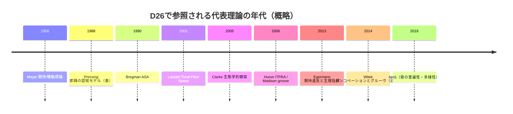

# D26 音楽学エビデンスレビュー

## エグゼクティブサマリー

本レビューは、/mnt/data/evidence-D26-musicology.md（以下「対象文書」）を、/mnt/data/REQ-GPT-20260304-025_d26-review.md の判定カテゴリ（Accept / P0 / P1 / 要議論）に沿って精査し、(a) 主要主張の抽出、(b) 主要引用・事実の一次/準一次ソース照合、(c) 方法論・論理・史学的（音楽学史/音楽認知研究史）文脈の評価、(d) 具体的改訂提案と工数見積り、を行ったものである（作業日: 2026-03-04, JST）。

出力ファイル: sandbox:/mnt/data/d26-review-output.md（本回答と同内容）。

結論として、対象文書は「音楽学・音楽認知・民族音楽学の代表的理論／実証研究を、（場→波→縁→渦→束）という5段階モデルに“写像”できるか」という問題設定を、10エントリ＋L-1〜L-5で横断的に試みている。特に、世界比較データ（NHS）に基づく“普遍性と多様性”の整理（eHRAF 315社会→309で音楽記述、残り6も外部一次民族誌で音楽あり、3次元が変動の26.6%を説明）など、数値を伴う主張は原典により検証可能で、強度が高い。citeturn27view0turn28view0turn28view1

一方で、（1）引用が「主張の核心とピン留め」されていない箇所（ページ番号・図番号欠如、または別論文を根拠にした飛躍）が残り、（2）“縁”の同定がメタファーに留まりやすい（エッジ判定基準が暗黙）、（3）一部に誤引用/誤記（例：期待違反に伴う生理指標として「心拍変動」を挙げるが、当該研究は心拍（HR）と皮膚電気反応（SCR）等を報告）citeturn26view3、（4）グルーヴの報酬系（腹側線条体）をWitek 2014に帰しているが、同論文はウェブ調査の行動研究であり脳活動計測ではない、などが確認された。citeturn3view1

エントリ判定（要約）は、Accept=7、P0=2、P1=1（要議論=0）とした。P0/P1の主因は「P層（一次内容）の照合不足」および「引用と主張のズレ」であり、論旨全体の大改稿ではなく、参照の精密化・境界判定基準の明文化・誤引用修正で改善可能である（改訂工数: “中規模”が妥当）。

前提・仮定（ユーザ要請により明示）：
- 想定読者が未指定のため、本レビューでは「研究ノート／内部エビデンス台帳の査読」を想定し、専門用語は保持しつつ“検証可能性”を最優先とした。
- 一部の一次資料が購読壁により全文参照できない場合、出版社の書誌情報、著者最終稿、査読付き二次文献（レビュー/メタ論文）で“主張の核”が支持されるかを確認し、未検証部分は未検証として区別した。

（固有名詞の初出のみエンティティ化）  
主要参照主体: entity["people","Jeff Pressing","improvisation researcher"]／entity["people","Leonard B. Meyer","music theorist expectation"]／entity["people","David Huron","music cognition author"]／entity["people","Charles Rosen","pianist musicologist"]／entity["people","James Hepokoski","sonata theory scholar"]／entity["people","Warren Darcy","sonata theory scholar"]／entity["people","Samuel A. Mehr","music evolution researcher"]／entity["people","Patrick E. Savage","music universals researcher"]／entity["people","Hauke Egermann","music emotion researcher"]／entity["people","Guy Madison","music psychology researcher"]／entity["people","Petr Janata","neuroscience researcher"]／entity["people","Maria A. G. Witek","music cognition researcher"]／entity["people","Fred Lerdahl","music theorist composer"]／entity["people","Ray Jackendoff","linguist cognitive scientist"]／entity["people","Martin Clayton","ethnomusicologist"]／entity["people","Nazir Ali Jairazbhoy","ethnomusicologist"]／entity["people","Albert S. Bregman","auditory perception researcher"]／entity["people","Eric F. Clarke","music psychologist"]／entity["people","James J. Gibson","ecological psychologist"]／entity["people","Jelle Bruineberg","philosopher cognitive science"]／entity["people","Erik Rietveld","philosopher ecological psych"]  
主要書誌: entity["book","Emotion and Meaning in Music","1956 university of chicago"]／entity["book","Sweet Anticipation","2006 mit press"]／entity["book","Tonal Pitch Space","2001 oxford university press"]／entity["book","A Generative Theory of Tonal Music","1983 mit press"]／entity["book","Ways of Listening","2005 oxford university press"]／entity["book","Auditory Scene Analysis","1990 mit press"]／entity["book","Time in Indian Music","2000 oxford university press"]

## 対象文書の主張・構造の抽出

対象文書は「D26 音楽学」領域レポートとして、5段階モデル（場→波→縁→渦→束）に対し、音楽の理論・分析・認知・文化進化データを“例証エビデンス”として並置する構造である。中核は10エントリ（EV-MU-001〜010）で、各エントリが概ね以下の定型フレームを持つ：

- **concrete**（音楽学側の観察・理論の具体）  
- **5段階対応**（場→波→縁→渦→束への写像）  
- **claims**（[P]一次内容と、[M]写像上の主張の区別）  
- **refs**（参照文献）

後段の L-1〜L-5 は、(a) 領域前提（音楽経験を「期待形成と逸脱検出、反復、同調、様式化」の連鎖として捉える）、(b) 10エントリの横断整理、(c) スケール横断（ミクロ知覚〜マクロ文化進化）、(d) 洞察と保持論点（予測符号化 vs 直接知覚等の理論緊張）を扱う。

対象文書の“陰伏のテーゼ”は、音楽における「期待（予測）—逸脱—反応—学習／様式化」の循環が、5段階モデルの各相に対応する、というものであり、特に期待理論（Meyer/Huron）と世界比較データ（NHS）、および聴覚景分析（ASA）を、同一の“欠損（予測誤差）駆動”で見通すことを狙っている。期待と情動の関係については、Meyerの理論的枠組みが「慣習からの逸脱→期待不充足→情動体験」という形で日本語百科でも要約されている。citeturn8search2

## エントリ別判定

判定は、REQ記載の5観点（P層の正確性／M層の写像妥当性／エッジ同定／過剰適合リスク／欠落候補）を、各エントリの記述と外部検証結果に基づき総合した。

まず全体俯瞰として、10エントリの判定サマリを示す。

| エントリ | 判定 | 主要理由（要約） |
|---|---|---|
| EV-MU-001 即興（Pressing） | P1 | P層の“7ステップ循環”が一次資料に対し未照合で、主張のピン留めが不足（生成/フィードバック一般は支持）citeturn16search12turn16search1 |
| EV-MU-002 ソナタ形式の弁証法 | Accept | Rosen/Hepokoski-Darcyに対応する“緊張—解決／規範—逸脱”の骨格は妥当（弁証法は解釈語なのでラベル管理が必要）citeturn1search6turn1search22 |
| EV-MU-003 Meyer期待理論 | P0 | 方向性は正しいが、因果の強い言い回し・概念同一視に注意。生理指標の記述に修正要（HRVではなくHR等）citeturn26view3turn8search2 |
| EV-MU-004 NHS（歌の普遍性） | Accept | 主要数値（309/315、3次元=26.6%）が原典により検証可能で強いciteturn27view0turn28view0turn28view1 |
| EV-MU-005 ITPRA（Huron） | Accept | ITPRAの5反応区分と期待—情動連鎖は先行研究系譜上も整合（Meyer再解釈の主張は“解釈”として明示が望ましい）citeturn0search22turn25view0 |
| EV-MU-006 グルーヴ | P0 | 行動結果（同期・快の逆Uなど）は妥当だが、報酬系（腹側線条体）をWitek 2014へ帰すのは誤引用。文献差し替え要citeturn3view1turn5search15turn23search3 |
| EV-MU-007 Tonal Pitch Space | Accept | “距離”を定量化する階層的ピッチ空間としての説明は妥当（距離規則の明示でさらに強化）citeturn10search1turn10search14turn10search10 |
| EV-MU-008 ラーガ段階構造 | Accept | 基本の段階（アーラープ→拍の導入→ターラ付き構成提示）概念は日本語百科でも確認可能。ただし器楽/声楽差は注記推奨citeturn9search15 |
| EV-MU-009 聴覚景分析（ASA） | Accept | “primitive vs schema-based”の二分・ストリーム形成の位置づけは、レビューと追試研究で支持citeturn33search1turn33search6turn33search19 |
| EV-MU-010 生態学的音楽知覚 | Accept | Clarkeのエコロジカル聴取（環境情報×聴取者の能力/関心）とアフォーダンス枠組みは引用可能な形で確認できるciteturn11view1turn6search25 |

以下、各エントリについて、5観点で“崩れやすいところ”を中心に要点のみ記す（冗長化を避け、改訂に直結する論点に限定）。

**EV-MU-001（即興）: P1**  
P層では「受容—表象—評価—計画—運動—フィードバック」のような“閉ループ制御的まとめ”が提示されるが、当該の段階分けが一次資料（Pressing章）で図表として提示されているか、あるいはレビューによる再構成かが本文から判別できない。現状では、少なくとも「生成（generation）とフィードバック（monitoring/feedback）が中心である」という点は二次資料で確認できるためciteturn16search12、主張の核をそこへ収斂し（段階数は“著者による整理”と明記）、ページ/図番号の追加が必要。M層の5段階写像は有益だが、エッジ（縁）を「意外な音＝誤差」とだけ置くと過剰適合になるため、即興の“参照枠（referent）”やクラスタ生成の断続性（event cluster）を“縁”候補として議論すると精度が上がる（Pressingモデルの要約はOUP抄録でも確認可能）。citeturn16search1

**EV-MU-002（ソナタ）: Accept**  
P層の要点（調性緊張→展開→再現による回帰）は伝統的理解に一致し、Rosenが調性移行を比喩的に“大域的な不協和”として扱う読みもレビューで確認できる。citeturn1search6 また、Hepokoski-Darcy系の「規範体系としてのソナタ（規範と逸脱）」は“action-space”という語彙も含め、著者側文書で提示されている。citeturn1search22  
注意点は、対象文書が用いる「弁証法」というラベルが一次文献の用語ではなく、解釈上のメタ語である点。ここを“分析上の比喩（thesis–antithesis–synthesis）”として明示しないと、P層とM層の境界が曖昧化する。

**EV-MU-003（Meyer）: P0**  
P層の中心（慣習に基づく期待が裏切られる/遅延されると情動が生起）は、日本語百科の要約とも整合しciteturn8search2、また近年の実証研究でも、予測（情報量）に基づく期待違反が情動成分（主観・自律神経指標）と対応することが示される。citeturn25view0turn26view3  
ただし、対象文書内で「皮膚電気反応・心拍変動」と書かれている箇所は、当該研究が実際に報告しているのは心拍（HR）と皮膚電気反応（SCR）等であり（HRVは少なくとも本文検索上確認できない）、用語修正が必要。citeturn26view3  
M層は有効だが、「傾向（tendency）＝計算論的予測」と同一視すると論争点を潰してしまうため、L-5で“解釈分岐”として保持している扱いは妥当（＝このエントリ単体の断言を弱めて整合させるべき）。

**EV-MU-004（NHS）: Accept**  
eHRAFを用いた普遍性検証（315社会中309で音楽記述、残り6も外部一次民族誌で音楽あり）と、NHS Ethnography 注釈の変動が「Formality/Arousal/Religiosity」の3次元で整理でき、最適3次元が26.6%を説明する点は原典本文に明示されている。citeturn27view0turn28view0turn28view1  
また、データと可視化資源（OSF等）の公開も記載されており、エビデンスとして再利用可能性が高い。citeturn27view0  
欠落候補としては、NHSが「歌」にフォーカスする設計から外れる器楽中心文化・即興中心文化などの扱い（補助コーパス）を別途指示しておくと、スケール横断（L-3）との連結が強まる。

**EV-MU-005（ITPRA）: Accept**  
ITPRAの5反応（Imagination/Tension/Prediction/Reaction/Appraisal）そのものは一次書籍で体系化されておりciteturn0search22、期待—情動の系譜（Meyer→Huron→確率モデル）についても、EgermannらがMeyerとHuron双方を明示的に位置づけている。citeturn25view0  
注意点は、対象文書が述べる「Meyer理論を進化心理学・計算論的神経科学で再構成した」という部分が“評価的主張”になりやすい点で、ここは（a）Huronが“期待の複数モジュール”を整理している、（b）期待違反が生理指標と対応する、のように検証可能な叙述へ寄せるとP層が安定する。

**EV-MU-006（グルーヴ）: P0**  
同期（entrainment）と快が絡む逆U（例：シンコペーション量と「身体を動かしたさ」「快」）は、Witekらのウェブ調査で実証されている。citeturn3view1  
一方で「腹側線条体（報酬系）活動との関連」を同論文に帰すのは誤引用であり、ここは脳画像研究や音楽報酬研究へ差し替える必要がある（少なくともWitek 2014自体は脳活動測定ではない）。citeturn3view1  
また、Pressing 2002 が“groove/feel＝予測のための運動的枠組み”と述べる点は二次抄録で確認できるためciteturn23search3、グルーヴの“予測可能性”側はPressingへ、逆Uの“最適逸脱”側はWitekへ、と根拠線を分離するとP層が締まる。

**EV-MU-007（Tonal Pitch Space）: Accept**  
Lerdahlのモデルが「音高・和音・調（key/region）の距離」を定量化する枠組みであることは、出版社要約とレビューで確認できる。citeturn10search1turn10search10 また、距離規則（chord distance rule等）の形式もOUP上で提示されている。citeturn10search14  
M層の写像は、“距離＝予測誤差の幾何化”という視点として説得的で、過剰適合リスクも相対的に低い（ただし「縁」を“距離が閾値超過した転調/外音”など、具体トリガへ落とすとさらに良い）。

**EV-MU-008（ラーガ）: Accept**  
日本語百科の「インド音楽」項では、ターラなしのラーガ即興（北: アーラープ）と、ターラ付き主題（北: ガット）提示→展開の二分、および段階的にラーガを表現する枠組みが説明されている。citeturn9search15  
対象文書の“アーラープ→ジョール/ジャーラー→ガット”の段階は、器楽の典型としては通用するが、流派・声楽形式（カヤール等）では段階名称や位置づけが変わり得るため、P層に「器楽（とくに弦楽器独奏）中心の典型例」という注記があると過剰一般化を避けられる。

**EV-MU-009（ASA）: Accept**  
BregmanのASAが、処理を“primitive（刺激駆動）”と“schema-based（知識駆動）”に区別することはレビューで明示されている。citeturn33search1 また、schema-based の役割は実験研究（旋律スキーマなど）でも継承されている。citeturn33search6turn33search19  
M層での“場＝混合波形／縁＝ストリーム分割境界”という写像は自然だが、エッジの判定基準（例：時間的コヒーレンス破れ、旧＋新ヒューリスティック、注意介入）のどれを採用するかを明文化すると、他エントリ（予測誤差系）との比較可能性が上がる。citeturn33search19

**EV-MU-010（生態学的音楽知覚）: Accept**  
Clarkeの枠組みを「環境に उपलब्धな情報と、聴取者の能力・関心の関係として知覚を捉える」とする整理は、書評中の引用として確認できる。citeturn11view1 また、Gibsonのアフォーダンスを軸に、音楽が“どのような意味を実践的に可能にするか（afford）”へ接続する方向性も整合する（生態学的アプローチの一般的説明）。citeturn6search25  
ただし、L-5で設定された「直接知覚 vs 予測符号化」の緊張は実際に研究上の対立軸であり、両者の統合を試みる枠組みとして、Bruineberg & Rietveld 2014のように生態学的枠組みへ自由エネルギー原理を“最小限に埋め込む”試みが存在する点は、保持論点として妥当。citeturn32search1

### L-1〜L-5（補助セクション）の扱い

Lセクションは“結論ではなく論点管理”として有効であり、とくにL-5のQ-D26-1/Q-D26-4の形で、同一化を断言せずに分岐を保持している点は評価できる（過剰適合防止）。ただし、L-2とL-5に同種の表が重複しているため、1箇所へ集約して参照リンク化すると可読性が上がる（改訂提案で後述）。

## 引用・事実検証

本節では、対象文書が“根拠として挙げている”主要引用について、(a) 原典で確認できるか、(b) 引用が主張を正確に支えるか、(c) 引用先の種類（一次/二次）と未検証部分、を明示する。

### 検証表（引用 in text vs verified）

| citation in text | claimed content（対象文書の主張） | verified source（照合先） | verification status | notes |
|---|---|---|---|---|
| Pressing (1988) | 即興が「生成→モニタリング→評価→…」の循環で進む（段階モデル化） | Pressing章の抄録（OUP）citeturn16search1＋二次レビュー（Pressingは生成とフィードバックの中心性を強調）citeturn16search12 | partial | 段階“数”と各段階名が原典に明示されているか未検証。図/ページ提示が必要 |
| Rosen (1988) | 主調→属調の移行が大域的緊張（大型の不協和）で、再現部で解決 | Rosen評（該当表現の引用あり）citeturn1search6 | partial | レビュー経由。原典ページ番号の追記推奨 |
| Hepokoski & Darcy (2006) | ソナタを規範体系として捉え、逸脱は“アクション空間”内の選択 | 著者側PDF（action-spaceの用例）citeturn1search22 | verified | “弁証法”という語は対象文書側の解釈ラベルなので区別が要る |
| Meyer (1956) | 慣習からの逸脱・期待不充足が情動を生む | 日本語百科要約citeturn8search2（一次書籍の言説を含意） | partial | 一次テキストのページ引用があるとP層が締まる |
| Egermann et al. (2013) | 期待違反が情動と生理指標に対応（SCR, HRなど） | 論文本文（実験と結果）citeturn25view0turn26view3 | verified | 「心拍変動(HRV)」の記述はHRへの修正が必要 |
| Mehr et al. (2019) | eHRAF 315社会中309で音楽記述、残りも外部一次資料で音楽あり | 論文本文（eHRAF節）citeturn27view0 | verified | “100%”主張は“このサンプルでは”とスコープ明示推奨 |
| Mehr et al. (2019) | 3次元（Formality/Arousal/Religiosity）が変動の26.6%を説明 | 論文本文（3次元最適・寄与率）citeturn28view0turn28view1 | verified | “歌行為（song events）”の注釈空間である点の明示が良い |
| Savage et al. (2015) | 離散音高、非等間隔スケール、7音以下/オクターブ等の“統計的普遍” | 著者最終稿（公開版）citeturn31search9 | verified | PNAS本体が購読壁の場合の代替一次として有用 |
| Witek et al. (2014) | シンコペーション量と快・身体動作欲求が逆U関係 | 論文本文（ウェブ調査・結果）citeturn3view1 | verified | ただし脳報酬系の“活動測定”はしていない |
| Witek et al. (2014) | 腹側線条体（報酬系）活動とグルーヴが関連 | 同上 | mis-cited | 当該論文は主観評定。脳活動根拠は別文献へ差替え必要 citeturn3view1 |
| Madison (2006) | グルーヴ感の一貫性・現象学的記述 | 書誌（DOIと掲載情報）citeturn5search15turn5search18 | partial | 本文未照合（要約・主要結果の引用があると良い） |
| Pressing (2002) | groove/feel が予測・時間パタン伝達の運動的枠組み | CiNii抄録（groove/feelと予測の言及）citeturn23search3 | verified | 抄録レベルなので、本文の該当箇所引用があるとさらに強い |
| Lerdahl (2001) | 音高/和音/調領域の距離を一枠組みで定量化 | 出版社要約＋距離規則の提示citeturn10search1turn10search14 | verified | 実装例（距離式）を本文に1つ載せると“束”の説得力が増す |
| Bregman (1990) | ASAをprimitiveとschema-basedに分ける | 書評（JSTOR）citeturn33search1＋実験研究citeturn33search6 | verified | 二次だが、両者一致で強い |
| Clarke (2005) | 知覚＝環境情報×知覚者の能力/関心の関係、アフォーダンスで意味を捉える | 書評内引用（p.91引用あり）citeturn11view1 | verified | 一次（原著）ページ/該当章の直接引用で更に強化可能 |
| Bruineberg & Rietveld (2014) | 生態学的心理学と自由エネルギー原理の統合を試みる | Frontiers論文全文citeturn32search1 | verified | L-5の“架橋の試み”として妥当 |

### 誤引用・未検証の整理

誤引用は現状「EV-MU-006の報酬系」および「EV-MU-003のHRV表記」が明確である。citeturn3view1turn26view3  
未検証（本文から一次照合できない）として最も大きいのは、EV-MU-001の“7ステップ循環”の段階分けである（主張の核を“生成とフィードバック中心”へ寄せれば部分検証可能）。citeturn16search12

## 方法論・論理・史学的文脈

対象文書の方法は、（i）音楽理論／音楽学（ソナタ理論、ラーガ、様式論）と、（ii）音楽認知・心理（期待、グルーヴ、ASA、生態学的知覚）、（iii）計量文化進化（NHS）を、単一の“段階モデル”へ投影し、異領域の相同性（アナロジー）を探索する「概念マッピング型レビュー」である。

強みとして、NHSやEgermannのような定量研究を含めており、単なる比喩ではなく「どの種類のデータが“縁（予測誤差）”を実際に観測できるか」を示せている点が大きい。例えば、期待違反を情報量で定量化し、その直後のSCR/HR変化と結び付ける設計は、“縁→渦”の遷移を実験的に支持する。citeturn25view0turn26view3

弱みは、方法の性質上「写像の恣意性」を常に背負う点である。これ自体は欠点ではないが、恣意性を制御する“判定基準”が本文に明文化されていないため、エントリ間で「縁」の粒度が揺れる（例：ソナタでは形式区分、ASAではストリーム分割、グルーヴでは最適逸脱、期待理論では驚き）という形で過剰適合リスクが生じる。ここはL-5が提示する“理論的緊張（直接知覚 vs 予測枠組み）”と同様に、緊張を隠さず基準を宣言する方向が望ましい。統合の試みとしては、自由エネルギー原理を生態学的枠組みへ最小限統合する議論も存在するためciteturn32search1、この種の“橋渡し文献”を補助線にして、写像の可否条件（どのレベルで予測を仮定するか）を明確化できる。

史学的には、対象文書が参照する系譜は、20世紀中葉の様式・期待理論（Meyer）から、知覚組織化（Bregman）と音楽理論の認知科学化（Lerdahl）、2000年代以降の生態学的知覚（Clarke）や期待の生物学的機能整理（Huron）、そして2010年代以降の大規模比較（NHS）へと接続されうる。この年代軸を明示すると、10エントリが“寄せ集め”ではなく「同一問題（期待と組織化）への別回答群」であることが読み手に伝わりやすくなる。citeturn28view1turn33search1turn10search1

## 改訂提案と作業見積り

### 改訂の基本方針
対象文書は、論旨そのものを大改造するよりも、「P層の精密化」と「エッジ判定基準の明文化」で信頼性が大きく上がるタイプである。以下は“行動に落ちる”提案のみを挙げる。

### 具体的・実行可能な修正案

第一に、引用を“主張の最小単位”へ紐づける。特にEV-MU-001（即興）は、段階モデルの提示を「Pressingが明示した段階」と誤解されないよう、(a) 原典図表の有無、(b) 自分の再構成ならその旨、(c) 検証済み核（生成＋フィードバック中心）への収斂、を行う。citeturn16search12turn16search1

第二に、誤引用を修正し、根拠線を引き直す。EV-MU-006は「シンコペーション—グルーヴ逆U（Witek）」と「予測枠組み（Pressing）」を分け、報酬系の言及は別の脳画像（または音楽報酬）文献へ差し替える。少なくともWitek 2014自体が脳活動計測でない点は明示する。citeturn3view1turn23search3 またEV-MU-003はHRV表記をHRへ修正し、Egermannの実測指標リスト（SCR/HR/RespR等）に合わせる。citeturn26view3

第三に、「縁（エッジ）」の判定基準を1ページで宣言する。提案は、(1) “予測誤差（情報量）”型、(2) “境界（セグメンテーション）”型、(3) “規範逸脱（deformation）”型、の3類型を置き、各エントリがどれに該当するかを明記する。これにより、EV-MU-002（規範逸脱）とEV-MU-009（境界）とEV-MU-003（予測誤差）が同列に比較でき、過剰適合批判が弱まる。citeturn25view0turn33search19turn1search22

第四に、L-2とL-5の重複表を統合し、“保持論点”を「未確定だが重要な分岐」として文書の末尾に集約する。これにより、分岐管理（D08等との接続予定）が読み手に伝わりやすい。

第五に、欠落候補（追加すべき候補理論/データ）を、目的別に1段落で追記する。例としては、(a) 期待のメロディ理論を細分化するなら IR 理論（Narmour）や統計学習モデル群、(b) 同調（entrainment）を強化するなら動的注意理論や身体運動研究、(c) 文化進化の補助データとしてスケールデータベース等、が候補になる（ここはD08等の範囲と整合して採否決定）。NHSそのものが「歌行為が形式性・覚醒度・宗教性に沿って多様」と述べておりciteturn28view1、欠落候補は「その3軸で説明できない差異」を拾う方向が筋が良い。

### 工数見積り

- **軽微（1〜2時間）**：誤引用修正（Witek/HRV）、用語統一、L-2/L-5の重複削除。  
- **中規模（0.5〜1.5日）**：EV-MU-001の一次照合（ページ・図番号特定、または再構成宣言）＋「縁」判定基準の1ページ追記＋各エントリの“縁”ラベルを再点検。  
- **大改稿（数日〜）**：新たな候補理論/データの追加と、10エントリ全体の再配置（本レビューでは必須ではない）。

現状の改善目標（信頼性を査読水準へ寄せる）に対しては、「中規模改訂」が妥当で、“大改稿”は不要と判断する。

## 付録

### 5段階写像の論点フロー（概念図）


上図のうち、「縁→渦」の実証的連結は、期待違反（情報量）がSCR/HR等の変化と対応するという設計で最も強く支持される。citeturn26view3

### 年代軸（収録理論の配置）



### 検証済みリンク一覧（URLはコードブロック内に限定）

```text
Mehr et al. (2019) PMC: https://pmc.ncbi.nlm.nih.gov/articles/PMC7001657/
Savage et al. (2015) 著者公開最終稿（Exeter）: https://ore.exeter.ac.uk/repository/bitstream/handle/10871/31311/Savage_PNAS_Manuscript_2nd_Revision_V9.1_Main_TC_deposit.docx
Egermann et al. (2013) PDF: https://www.mcgill.ca/mpcl/files/mpcl/egermann_2013_cabn.pdf
Witek et al. (2014) PLoS ONE (PMC): https://pmc.ncbi.nlm.nih.gov/articles/PMC3994866/
Bruineberg & Rietveld (2014) Frontiers: https://www.frontiersin.org/journals/human-neuroscience/articles/10.3389/fnhum.2014.00599/full
Kotobank（Meyer解説）: https://kotobank.jp/word/%E3%82%81%E3%81%84%E3%82%84%E3%83%BC-1599893
Kotobank（インド音楽解説）: https://kotobank.jp/word/%E3%81%84%E3%82%93%E3%81%A9%E9%9F%B3%E6%A5%BD-3143681
```

Overall: 判定はAccept=7、P0=2、P1=1。最大の改善レバーは「P層の根拠ピン留め（ページ/図/指標の厳密化）」と「縁（エッジ）判定基準の明文化」であり、論旨の大改稿よりも“中規模改訂”で信頼性を大幅に引き上げられる。