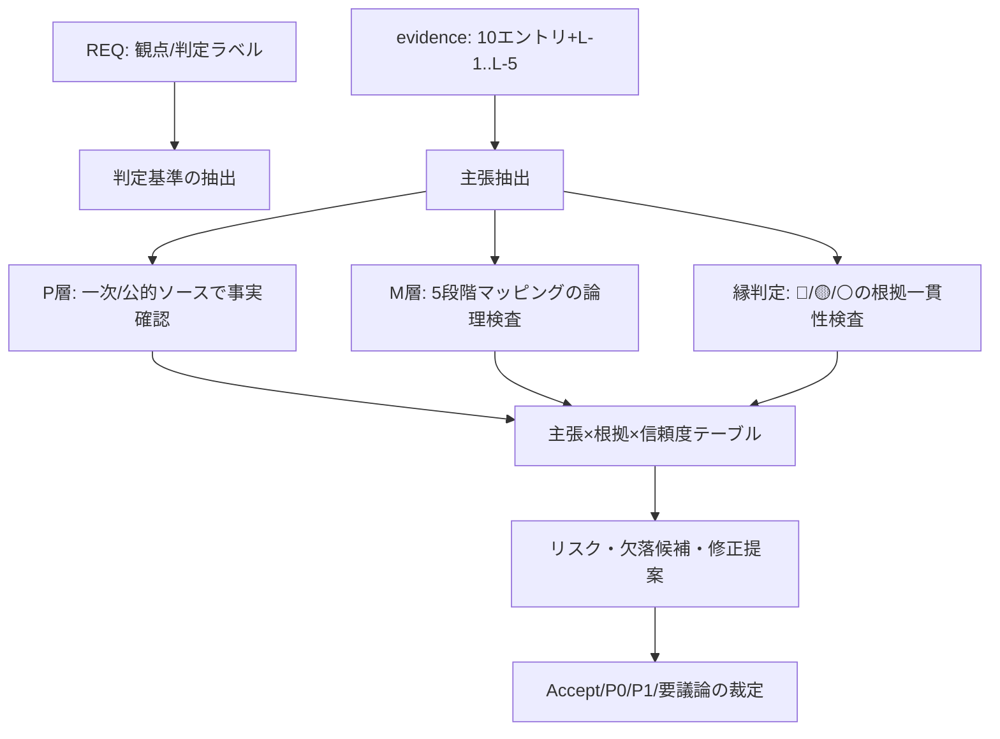

# D27 建築・空間デザイン evidence レビュー

出力ファイル: sandbox:/mnt/data/D27-architecture_review_20260304.md

## エグゼクティブサマリー

本レビューは、`evidence-D27-architecture.md` を、`REQ-GPT-20260304-026_d27-review.md` の5観点（P層正確性 / M層妥当性 / 縁判定精度 / 牽強付会リスク / 欠落候補）で検証した（REQ-GPT-20260304-026_d27-review.md L35-L62）。対象は10エントリ＋L-1〜L-5（および追補のクロスリファレンス）である（evidence-D27-architecture.md L21-L780）。

総合判断は**条件付きAccept**。EV-AD-001〜008は、文献実在・主要概念の精度の観点で大きな破綻は見られない一方、(a) 一次文献の章・ページ単位の突合（引用精度の最終固定）、(b) 「既存evidence」参照の欠落解消、(c) “縁”判定（🔴/🟡/⚪）の横断比較可能な定式化、が必要。EV-AD-009は“場/波”寄りの知覚論として価値はあるが、5段階の「縁」への接続が弱く**要議論**。EV-AD-010はRejectという「負例」枠として有用だが、「連続的差異化＝境界の消去」という論拠が強すぎる可能性があり、Rejectを維持するなら“両立不能条件”の形に言い換えるべきである（evidence-D27-architecture.md L543-L545, L724）。

REQ内に“指定出力ファイル名”が記載されていないため、仮に **`D27-architecture_review_20260304.md`** として保存した（REQ-GPT-20260304-026_d27-review.md L63-L70）。

## 対象と前提

対象ファイルは次の2点。
- `REQ-GPT-20260304-026_d27-review.md`（観点と判定ラベル定義）
- `evidence-D27-architecture.md`（10エントリ＋L-1〜L-5＋追補）

前提・注意点。
- 行番号参照（例: evidence-D27-architecture.md L249-L257）は、2026-03-04時点のローカルファイルを1行=1で付番したもの。
- evidenceは「指し示すだけ。無理に当てはめない」「表面的類似と構造的類似を区別する」を方法論原則に掲げる（evidence-D27-architecture.md L17）。本レビューは、この原則がM層・縁判定に実装されているかを重点点検した。

## 評価プロセス

REQの5観点に沿って、(1) エントリ単位、(2) DB横断（L-1〜L-5およびクロスリファレンス）で評価した（REQ-GPT-20260304-026_d27-review.md L35-L62）。

## 観点別所見

### P層正確性

REQが重点指定した4点（Alexander / Otto / van Eyck & Hertzberger / Jacobs）について、evidence本文の主張は外部一次（または公的）ソースと概ね整合している（REQ-GPT-20260304-026_d27-review.md L38-L46）。

EV-AD-001の中心人物である entity["people","クリストファー・アレグザンダー","architect theorist"] について、evidenceは『entity["book","The Nature of Order","alexander 2002-2005"]』のBook 1にある「15の基本性質」や、Book 2のstructure-preserving transformations、Mirror-of-the-Self（ペア比較）を中核根拠に置く（evidence-D27-architecture.md L35-L38）。15性質の存在・構成は研究要約で確認でき、citeturn1search16turn1search12 structure-preserving transformationsがBook 2で主要概念として扱われることも書籍構成から裏づけられる。citeturn3search5 またMirror-of-the-Self testがペア比較として議論されることは査読論文で説明されている。citeturn3search4

EV-AD-002は entity["people","フライ・オットー","german architect engineer"] のform-findingを「境界条件が形態を規定する」生成として位置づける（evidence-D27-architecture.md L88-L96）。参照文献『entity["book","Finding Form","otto rasch 1996"]』の書誌は版元資料で確認できる。citeturn0search17 またIL設立年（1964）と2015年プリツカー賞受賞は大学研究機関史および公式リリースで確認できる。citeturn12search0turn4search13

EV-AD-003〜004について、entity["people","アルド・ファン・アイク","dutch architect"] のin-between（doorstep）概念は学術論文・書誌から確認できる。citeturn4search23turn4search5 また「遊び場700以上」という規模感も研究レビューで裏づけがある。citeturn4search19turn4search2 一方、evidence本文は「既存evidence AD-005 poché / AD-006 Lynch」など当該ファイル内に存在しない参照を含む（evidence-D27-architecture.md L178, L678-L682）。これは“事実誤認”ではなく“検証可能性の欠落”であり、P層の実務品質に直結する。

entity["people","ヘルマン・ヘルツベルハー","dutch architect"] のthreshold spaceについて、evidenceは「アクセス可能性・責任・視線」を設計変数として提示する（evidence-D27-architecture.md L195-L201）。この種の定式は大学論文等の引用でも確認できるため骨格は妥当だが、一次文献の該当語（visibility/supervision等）と日本語要約の対応を章・ページで固定すべきである。citeturn4search21turn4search17

EV-AD-005で扱う entity["people","ジェイン・ジェイコブズ","urbanist author 1916-2006"] の4条件（用途混合・短いブロック・建物年代混在・密度）は、Jacobs研究の二次整理でも一貫して“diversityの生成条件”として扱われる。citeturn10search8turn2search26 border vacuum概念がJacobsに由来することも交通研究報告・都市実証研究で参照される。citeturn11search24turn11search6 “sidewalk ballet”という比喩も公開抜粋で確認できる。citeturn10search13

EV-AD-006（「間」）は、日本語の公的・準公的ソースで事実確認がしやすい。1978年の「MA: Space-Time in Japan」展は entity["point_of_interest","Musée des Arts Décoratifs","paris museum"]（entity["city","パリ","france capital"]）で開催された会期がアーカイブで確認でき、citeturn3search6turn3search2 参考文献として挙げられる entity["people","神代雄一郎","japanese architectural historian"] の『entity["book","間・日本建築の意匠","koj iro 1999"]』も国立国会図書館書誌で確認できる。citeturn3search11

EV-AD-007〜008は本文中で「文献実在性未確認」とされるが（evidence-D27-architecture.md L406-L467）、主要参照は存在確認が可能である。entity["people","アヒム・メンゲス","architect researcher"] の“Material Computation”(2012)と“Fibrous Tectonics”(2015)は、entity["company","Wiley","publisher"] の該当ページでDOI等が確認できる。citeturn5search0turn5search1  
また entity["people","アレハンドロ・アラヴェナ","chilean architect"] のマニュアルは entity["company","Hatje Cantz","art publisher germany"] 刊として日本の書誌DBで確認でき、Quinta Monroy（93世帯等）も査読研究で検討されている。citeturn5search25turn6search4

EV-AD-009〜010も書誌存在は確認できる。entity["people","ユハニ・パラスマー","finnish architect"] の『entity["book","The Eyes of the Skin","pallasmaa 1996/2005"]』は書誌情報から概要確認でき、周辺視野/中心視野の対比は本人論文でも繰り返される。citeturn9search1turn9search17 entity["people","パトリック・シューマッハー","architect theorist"] のparametricism論はAD誌論文と本人掲載テキストで一次性が確保できる。citeturn13search1turn9search2 また『entity["book","The Autopoiesis of Architecture","schumacher 2011-2012"]』の刊行情報も版元で確認できる。citeturn2search5turn2search24

### M層妥当性

evidenceはD27が「境界の設計」を本質に含むため“縁”対応が濃密になりやすいと自己説明しており、対応密度表でも「縁」対応8/10件と報告する（evidence-D27-architecture.md L604-L632）。この自己説明は妥当だが、REQが警告する通り、🔴が多い状況は確証バイアスの兆候にもなり得る（REQ-GPT-20260304-026_d27-review.md L49-L52）。evidence側はCA/Rejectを用意して安全弁を設け、さらに「無理に当てはめない」を宣言している（evidence-D27-architecture.md L17, L604-L623）。方向性は良い。

ただし、写像の論理強度は群によって差が大きい。物理的生成や時間的生成が明示される群（Otto/Menges/Aravena等）は反証可能性が相対的に高い一方（evidence-D27-architecture.md L76-L126, L353-L468）、静的条件論（Jacobs）や知覚論（Pallasmaa）、様式宣言（Schumacher）は比喩的になりやすい（evidence-D27-architecture.md L237-L293, L469-L583）。この差を“プロセス記述群／境界設計群／知覚・様式群”にクラスター化した整理は有益である（evidence-D27-architecture.md L633-L639）。

REQが求める「設計プロセス（意図）と自然的生成プロセスの区別」は、保持論点としては立てられている（例: Mengesで“計算的最適化と自発的生成”、evidence-D27-architecture.md L688-L706）。しかし判定手順として明文化されていないため、P1として、(i) Otto等を“自然生成アンカー”に置く、(ii) 設計論は「どの段階を操作する語彙か」として読む、という二層化が望ましい。

### 縁の判定精度

縁フラグは3条件（関係網・未決定性・渦接続）で統一している（evidence-D27-architecture.md L604-L632）。判定根拠を明確にしようとする設計自体はREQの要求に沿う（REQ-GPT-20260304-026_d27-review.md L53-L58）。

改善点は、3条件の運用定義がエントリ間で“比較可能”になるまで落ちていないこと。
- van Eyck（003）とHertzberger（004）は、媒介（意味論）とグラデーション（操作論）で差別化できているが（evidence-D27-architecture.md L139-L146, L195-L201）、同時に“同一の洞察（縁＝帯域）”へ統合する記述が近接するため、差別化軸を見出しで固定した方が精度が上がる。
- 「間」（006）は“日本性の記号化”リスクを自己申告しておりREQ合致だが（evidence-D27-architecture.md L310-L317、REQ-GPT-20260304-026_d27-review.md L57-L60）、普遍/文化特殊の議論は典拠図版・節参照で一般化範囲を限定すべき。
- Pallasmaa（009）の⚪は、本人が境界を主題化しない点と整合し概ね妥当（evidence-D27-architecture.md L486-L490）。citeturn9search1turn9search17
- Schumacher（010）は、本人のnegative heuristicsが「無関係な並置の回避」等である以上、“境界消去”という言い方は強めで、Rejectを維持するなら「縁の3条件を満たしにくい条件」へ翻訳した方が判定精度が上がる（evidence-D27-architecture.md L543-L545, L724）。citeturn9search2turn13search1

### 牽強付会リスク

evidenceはJacobs/Pallasmaa/Schumacherでリスク評価を中〜高にしており自己評価は妥当（evidence-D27-architecture.md L254-L257, L490-L545）。ただし、重点は2点。

第一に、Alexanderが5段階の着想源に近いという循環論法リスク（REQ指摘）に対し、保持論点はあるが（15性質＝結果特徴で段階ではない、evidence-D27-architecture.md L712-L716）、DB運用上「Alexanderを定義ソース／他を独立検証ソースとして扱う」等の管理方針が未整備。

第二に、Schumacher Rejectの根拠が弱いと“安全弁”として機能しない点である。autopoiesis援用は批判的検討研究が存在するため、Reject根拠の言い換え（両立不能条件化）によって負例の再現性を上げられる。citeturn9search27

### 欠落候補

REQが挙げる3候補（Koolhaas / Venturi / Landscape urbanism）は追加価値が高い（REQ-GPT-20260304-026_d27-review.md L62）。

- entity["people","レム・コールハース","dutch architect"] の「ビッグネス」論は、巨大スケールが内外関係や都市接続を変質させる点で“縁”を別角度から照らす可能性がある。日本語解説でも『entity["book","S,M,L,XL","koolhaas 1995 book"]』所収論考として整理される。citeturn7search20
- entity["people","ロバート・ヴェンチューリ","american architect"] の『entity["book","Complexity and Contradiction in Architecture","venturi 1966 book"]』は、近代の単純化に対して多様性・対立・both-andを肯定し、波（緊張）や縁（共存）を理論化し得る。citeturn8search16turn7search1
- entity["people","チャールズ・ウォルドハイム","architecture theorist"] 編『entity["book","The Landscape Urbanism Reader","waldheim 2006 anthology"]』や、同書収録のentity["people","ジェームズ・コーナー","landscape architect"] “Terra Fluxus”は、都市を固定形態ではなくプロセス（flux）として扱い、M層の“生成”を厚くし得る。citeturn8search4turn8search15

加えて、evidence本文が“既存evidence AD-006 Lynch”を参照するため（evidence-D27-architecture.md L682）、entity["people","ケヴィン・リンチ","urban planner author"] のedges（barrier/seam）概念は、欠落解消として優先度が高い。citeturn7search15

## エントリ別裁定

REQの判定ラベル（Accept / P0 / P1 / 要議論）に従い裁定する（REQ-GPT-20260304-026_d27-review.md L63-L70）。

まず、P層として“事実確認できる主張”を抽出し、evidence内根拠と外部突合を対応付ける。

| 主張ID | 主張（要約） | evidence内根拠 | 外部突合（代表） | 信頼度 |
|---|---|---|---|---|
| C1 | AlexanderはBook 1で15の基本性質を提示 | L35 | citeturn1search16turn1search12 | 中 |
| C2 | structure-preserving transformationsはBook 2の中核概念 | L36 | citeturn3search5 | 中 |
| C3 | Mirror-of-the-Selfはペア比較手続き | L38 | citeturn3search4 | 中 |
| C4 | Ottoのform-findingは平衡形探索として整理できる | L88-L92 | citeturn0search17 | 中 |
| C5 | ILは1964年に設立 | L113 | citeturn12search0 | 高 |
| C6 | van Eyckのin-between/doorstepは媒介領域の設計概念 | L139-L146 | citeturn4search23turn4search5 | 中 |
| C7 | van Eyckは700+の遊び場計画に関与 | L142 | citeturn4search19turn4search2 | 中 |
| C8 | Hertzbergerのthresholdはaccessibility/責任等で論じられる | L195-L201 | citeturn4search21turn4search17 | 中 |
| C9 | Jacobsの4条件はdiversity生成条件として整理される | L249 | citeturn10search8turn2search26 | 中 |
| C10 | border vacuumはJacobs由来として参照される | L250 | citeturn11search24turn11search6 | 中 |
| C11 | “sidewalk ballet”は街路秩序の比喩 | L252 | citeturn10search13 | 中 |
| C12 | 1978年「MA: Space-Time in Japan」展がパリ装飾美術館で開催 | L301 | citeturn3search6turn3search2 | 高 |
| C13 | 『間・日本建築の意匠』（1999）は実在 | L301 | citeturn3search11 | 高 |
| C14 | “Material Computation”(2012)と“Fibrous Tectonics”(2015)はAD誌論文として実在 | L365-L376 | citeturn5search0turn5search1 | 高 |
| C15 | Elemental増分住宅マニュアル（2012）は実在 | L434 | citeturn5search25 | 高 |
| C16 | Quinta Monroyは93世帯等のincremental housingとして研究される | L425 | citeturn6search4 | 中 |
| C17 | Pallasmaaは多感覚性・周辺視野等を論じる | L481-L484 | citeturn9search1turn9search17 | 中 |
| C18 | Schumacherはparametricismを論じ、2009年にAD誌論文がある | L537-L541 | citeturn13search1 | 高 |
| C19 | parametricismのnegative heuristics（反復/無関係並置回避等）が明記される | L538 | citeturn9search2 | 中 |
| C20 | Schumacherのautopoiesis論はentity["people","ニクラス・ルーマン","german sociologist"]理論援用の系譜に位置づく | L539 | citeturn2search5turn9search27 | 中 |

続いて、M層・縁判定の妥当性（解釈強度）を含めたエントリ裁定。

| エントリ | 判定 | 根拠（最小） |
|---|---|---|
| EV-AD-001 | P1 | 強いが循環論法管理とページ参照が必要（L35-L56, L712-L716） |
| EV-AD-002 | P1 | 物理生成として強いが“5段階”再構成の注記が必要（L88-L96） |
| EV-AD-003 | P1 | 縁操作として強い。004との差別化軸を固定（L139-L147） |
| EV-AD-004 | P1 | 操作語彙として有用だが一次典拠固定が必要（L195-L201） |
| EV-AD-005 | P1 | 条件論→プロセス読解は自覚的。🟡の定式化改善（L249-L257） |
| EV-AD-006 | P1 | 具体装置で恣意性を制限。普遍/文化特殊の根拠補強（L306-L317） |
| EV-AD-007 | P1 | 主要文献は実在。最適化/自発性差を判定器へ反映（L365-L374, L688-L706） |
| EV-AD-008 | P1 | 時間軸実装として強いが効果指標の根拠追加（L425） |
| EV-AD-009 | 要議論 | “場/波”は有力だが縁以降が弱い（L486-L490） |
| EV-AD-010 | 要議論 | 負例として有益。Reject根拠の言い換え/再ラベルが必要（L543-L545, L724） |

## リスクと欠落候補の優先順位

### 優先リスク

1. 一次文献粒度（章・ページ）の不足  
影響: P層の最終固定ができず、M層・縁判定が比喩に留まる。対策: REQ指定4点から版・ページ参照を固定（REQ-GPT-20260304-026_d27-review.md L38-L46）。

2. 欠落参照（poiché/Lynch等）の存在  
影響: DBとして自己完結せず検証不能（evidence-D27-architecture.md L678-L682）。対策: エントリ追加または参照削除。

3. 確証バイアス（🔴が多い）  
影響: モデルが何でも説明できる錯覚。対策: 負例の根拠を再現可能にし、追加の負例候補も用意（REQ-GPT-20260304-026_d27-review.md L49-L52）。

4. 設計プロセスと自然的生成プロセスの混同  
影響: 5段階の射程が不明確。対策: Otto等を自然生成アンカーに置いて二層化（REQ-GPT-20260304-026_d27-review.md L51-L52）。

5. Schumacher Reject根拠の過強  
影響: 安全弁として機能しない。対策: “境界消去”ではなく“縁3条件を満たしにくい条件”へ翻訳（evidence-D27-architecture.md L543-L545, L724）。

6. 「間」の記号化  
影響: 文化特殊性の切り取りが恣意的。対策: 図版・節参照で一般化範囲を限定（evidence-D27-architecture.md L310-L317）。

### 欠落候補の優先追加案

- ビッグネス（Koolhaas）citeturn7search20  
- Complexity and Contradiction（Venturi）citeturn8search16turn7search1  
- Landscape Urbanism（Waldheim/Corner）citeturn8search4turn8search15  
- edges（Lynch）citeturn7search15  

## 受入チェックリストと著者への質問

### 受入判定チェックリスト

- [ ] P層: REQ指定4点について引用語句・章・ページ（版情報含む）が付与されている（REQ-GPT-20260304-026_d27-review.md L38-L46）。  
- [ ] M層: 「設計プロセス」と「自然的生成プロセス」の区別が判定手順として明文化されている（REQ-GPT-20260304-026_d27-review.md L51-L52）。  
- [ ] 縁判定: 🔴5件の根拠が比較可能に書かれ、van Eyck(003)とHertzberger(004)の差別化軸が固定されている（REQ-GPT-20260304-026_d27-review.md L53-L58）。  
- [ ] 牽強付会: Alexander循環論法リスク、Schumacher Reject妥当性、間の記号化リスクの管理方針が更新されている（REQ-GPT-20260304-026_d27-review.md L59-L61）。  
- [ ] 欠落候補: Koolhaas/Venturi/Landscape urbanism、およびLynch/poché参照の扱いが決まっている（REQ-GPT-20260304-026_d27-review.md L62）。  

### 著者への推奨編集・質問

- EV-AD-001: 15性質（結果特徴）とstructure-preserving transformations（プロセス）の区別を、Book 1/2の該当章・ページ参照で確定してよいか（evidence-D27-architecture.md L712-L716）。  
- EV-AD-002: 「実験手法の5段階」は一次文献の明示か、再構成か。再構成なら根拠（どの記述から抽出したか）を注記で示せるか（evidence-D27-architecture.md L91-L92）。  
- EV-AD-003/004: “媒介（意味論） vs グラデーション（操作論）”の差別化見出しを先に固定し、「縁の多面性」マッピングへ接続する構成にできるか（evidence-D27-architecture.md L759-L771）。  
- EV-AD-005: 4条件（必要条件）とsidewalk ballet（プロセス記述）を二段化し、縁フラグ🟡の定式理由を更新できるか（evidence-D27-architecture.md L254-L257）。  
- EV-AD-006: “普遍/文化特殊”の一般化範囲を、展覧会カタログの特定節・図版参照で限定できるか（evidence-D27-architecture.md L306-L317）。  
- EV-AD-008: 「面積2倍」「資産価値上昇」に関して根拠研究の指標・反証（批判研究）を1行で併記できるか。citeturn6search4  
- EV-AD-010: Rejectを維持するなら「縁3条件を満たしにくい条件」の形に翻訳できるか。維持しないなら、場/波の部分一致として再ラベルするか（evidence-D27-architecture.md L543-L545, L724）。

### 付記: 出力ファイル名

REQ本文に“指定出力ファイル名”の記載が見当たらないため、本レビューは仮に `D27-architecture_review_20260304.md` として保存した（REQ-GPT-20260304-026_d27-review.md L63-L70）。