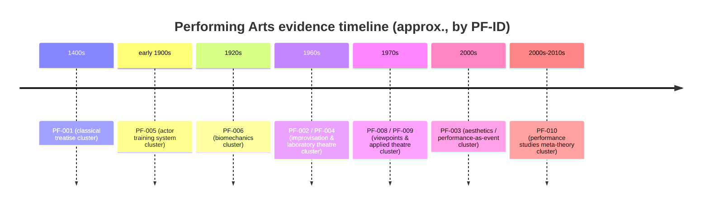

# REVIEW-D28-performing-arts.md レビュー

（成果物ファイル: [REVIEW-D28-performing-arts.md](sandbox:/mnt/data/REVIEW-D28-performing-arts.md)）

## エグゼクティブサマリー

本レビューは、`evidence-D28-performing-arts.md`（舞台芸術・パフォーマンス領域、全10エントリ + L-1〜L-5）を対象に、`REQ-GPT-20260304-027_d28-review.md` に定義された5観点（[P]層の正確性／牽強付会チェック／見落とし／L-1〜L-5の質／信頼度スコア妥当性）で品質検証したものです（2026-03-04時点）。

結論として、文書は「5段階（場→波→縁→渦→束）」という抽象モデルを、**演者-観客の共在**や**即興的創発**を中心とする舞台芸術領域の理論・実践へ比較的一貫して接続できており、構造化（項目設計）も良好です。特に「秘すれば花」および「花＝珍しさ/面白さ/意外性」といった趣旨の説明は、公的機関の解説とも整合し、領域固有の強いフックになっています。citeturn6search3turn6search0

一方で、**L-2の縁フラグ集計に数え間違い**があり（🟡が「3件」ではなく「4件」）、集計セクションの信頼性を毀損しています。さらに新規候補（PF-006〜010）では、主要文献の実在は概ね確認できるものの、**出版年・任期年などの年次表記の揺れ**と、[P]層の根拠が「出版社/大学/学会/国立機関」まで降り切っていない箇所が残ります。citeturn0search7turn0search2turn0search8turn0search5turn0search0

総合品質は **83/100**（根拠は後述）。最優先の修正は、(1) L-2集計の訂正、(2) PF-008/009の年次情報の整流化、(3) PF-006〜010の[Ｐ]根拠を一次・準一次（書誌・出版社・大学/学会系）へ置き換えることです。

## レビュー範囲と方法

対象は `evidence-D28-performing-arts.md` 全体（全653行相当、以下「Lxx」は当方で付与した行番号）です。構造は、10エントリ（EV-PF-001〜010）と領域レポート（L-1〜L-5、クロスリファレンス表）から構成されます。

評価手順は次の通りです。

- 文書内の[P]主張（引用・書誌・固有概念）を抽出し、特に新規候補（EV-PF-006〜010）について**書誌実在性と代表概念の整合**を優先確認。
- 「5段階」対応と「縁フラグ（🔴/🟡/⚪）」の判定根拠を、文書内説明の自己整合性と、当該理論の性格（プロセスモデル／記述分類体系／メタ理論）に照らして評価。
- L-1〜L-5の集計・洞察の内部整合性（計数、用語の使い分け、推論の飛躍）を点検。

制約として、文書が参照する「M2（5段階）」「D1〜D3」「T1〜T7」「CHK-A〜D」の**定義（参照元のコア資料）**が本レビュー対象外であるため、対応付け妥当性の評価は「当該理論の一般的理解」および文書内説明の透明性に基づく相対評価です（厳密なモデル検証ではありません）。

**書誌実在性のクイック検証**

REQで「新規候補」とされるPF-006〜010について、少なくとも代表文献の実在（出版社/書誌/大学等）を確認しました（概念の精密要約までの完全検証は別途）。

| PF-ID | 提唱者 | 代表文献（例） | 実在性の確認根拠（例） | コメント |
|---|---|---|---|---|
| EV-PF-006 | entity["people","フセヴォロド・メイエルホリド","russian theatre director"] | （一次断片が引用される資料） | 3段階「intention/realization/reaction」を一次資料へ遡及して示す資料が存在citeturn3search41turn11search42 | 用語（raccourci/rakurs等）の整理が必要 |
| EV-PF-007 | entity["people","ルドルフ・ラバン","movement theorist"] | entity["book","Effort","laban lawrence 1947"] | 国内書誌で1947版の存在と版変遷（1947→後版）を確認citeturn1search4 | 分類体系でありCAは妥当 |
| EV-PF-008 | entity["people","アン・ボガート","theatre director"] / entity["people","ティナ・ランドー","theatre director"] | entity["book","The Viewpoints Book","bogart landau 2004"] | 出版社・図書館書誌で存在確認（2004/2005表記揺れあり）citeturn0search2turn0search7 | 年次表記の整流が必要 |
| EV-PF-009 | entity["people","アウグスト・ボアール","brazilian theatre practitioner"] | entity["book","Legislative Theatre","boal 1998"] | 出版社ページと学術誌レビューで存在確認（刊年表記の揺れあり）citeturn0search0turn0search5 | 任期年の整流が必要 |
| EV-PF-010 | entity["people","リチャード・シェクナー","performance studies theorist"] | entity["book","Performance Theory","schechner 2003"] | 出版社ページで目次に「efficacy-entertainment braid」等を確認citeturn3search5 | メタ理論中心のためCAは妥当 |

（補足）PF-006の人物の生没年/最期など歴史事項は、信頼できる百科事典で確認可能です。citeturn12search0

## 観点別評価

**正確性**

**判定: 要修正（局所）**

エントリの基礎書誌は概ね実在確認でき、主要概念も標準的理解と整合します。ただし、年次・書誌面の揺れや、概念の「一次所在」が見える形で提示されていない箇所が散見されます。

**強み（具体箇所）**

- EV-PF-001（L21-73）: 「秘すれば花」「花＝珍しさ/面白さ」等の趣旨説明が、公的機関の解説と整合。citeturn6search3turn6search0
- EV-PF-003（L127-180）: 「身体的共在」「自己生成的フィードバック・ループ」という骨格は、出版社紹介や当該概念を中心に据える議論と整合。citeturn6search2turn7search0turn7search2
- EV-PF-010（L506-559）: 「広帯域」「restored behavior」等でパフォーマンスを拡張する立場や、学科史上の位置付けは大学公式情報とも整合。citeturn2search0turn2search1

**要修正（具体箇所と提案）**

- **EV-PF-008（L397-450）**: 代表文献の年次は「2004/2005」の揺れが生じやすい領域のため、refs／proposer側で「出版/配布/書誌年」を分けて表記すると誤解が減ります。citeturn0search2turn0search7turn0search4
- **EV-PF-009（L451-505）**: 市議会勤務年の表記に揺れ（1992-1996表記等）があり、年次の整流が必要。citeturn0search8  
  併せて、代表文献の刊年も資料により差が出るため注記推奨。citeturn0search5turn0search0
- **EV-PF-010（L506-559）**: 「訓練→ワークショップ→…→余韻」の列挙は妥当な可能性が高い一方、一次所在（書籍の章・図表番号）を明示してください。教科書に「Performance processes」章があることは確認できます。citeturn3search0turn5search8

**牽強付会チェック**

**判定: 概ね問題なし（CA周辺は要議論）**

総論として、本文は「指し示すだけ。無理に当てはめない」と原則を明言しており、CA判定エントリでは自己制約として機能しています。

**評価ポイント（具体箇所）**

- EV-PF-007（L343-396）: 動作分析を「分類体系」として扱い、プロセスモデルではないためCA・牽強付会リスク高と明記しているのは妥当。LMAが「Body/Space/Shape/Effort」等のカテゴリで動作を記述することは研究文脈でも一般的です。citeturn13search2turn1search4
- EV-PF-010（L506-559）: メタ理論中心であり、個別概念の対応はできても「一貫したプロセス列」になりにくいとしてCAにしている点は、REQ側注意喚起（CA妥当性）に沿います。citeturn2search0turn3search5

**要議論（具体箇所と論点）**

- EV-PF-009（L451-505）: 「観客→行為者」転換を中心に据えるため「縁」🔴は強いが、二項対立（抑圧者/被抑圧者）が残る点を本文も認めている。ここは「非二元性」を必須条件に置くか推奨条件に置くかで判定が変わるため、要議論が妥当。citeturn0search8turn8search1
- EV-PF-006（L288-342）: 訓練技法をプロセスモデルとして読む解釈ステップが残る。縁🟡のままで妥当だが、用語（raccourci/rakurs等）整理と「縁」を媒介構造として再記述すると牽強付会リスクを下げられます。citeturn3search41turn10search0turn11search2

**見落とし**

**判定: 追加候補あり（ただし選定方針次第）**

REQ側の参考として、重要な演劇理論・実践が候補外として挙げられており（例: 叙事的演劇、残酷演劇、特定メソッド等）、現状の10本は「情報欠落」というより「選定の結果」です。従って課題は、**なぜ外れたか（縁要件不充足／プロセス記述不足／メタ理論過多等）の説明を、L-1またはL-5に一文で明示すること**にあります。

追加候補としては、次の1件は検討価値が高いです。

- entity["people","Eugenio Barba","theatre anthropologist"]（関連組織: entity["organization","Odin Teatret","holstebro, denmark"]）: 俳優訓練・異文化横断・身体の「修行（長期）×上演（一回性）」を橋渡ししやすい枠組みで、現状のL-1テーマを補強し得ます。

**L-1〜L-5の質**

**判定: 要修正（L-2の数値／他は概ね良好）**

- **L-1（L562-575）**: 3潮流（体験と構成／即興と創発／パフォーマンス拡張）で領域俯瞰ができ、10エントリ配置とも整合。  
  ただし「ある実践が方向論争を“統合した”」という断定は歴史叙述として強めなので、「影響関係」程度に弱めるか根拠文献を付けるのが安全です。citeturn10search0turn9search1turn12search0
- **L-2（L576-591）**: **要修正**。縁フラグ集計が誤り。本文は「🔴5件, 🟡3件, ⚪1件」だが、エントリ側は🔴5（PF-001/002/003/008/009）、🟡4（PF-004/005/006/010）、⚪1（PF-007）です（合計10）。最優先で修正すべきです。
- **L-3（L592-603）**: スケール横断の整理（秒→社会制度）が明快。citeturn16search1turn2search0
- **L-4（L604-613）**: 洞察は筋が良い。特に「身体的共在→フィードバック・ループ」という筋は、当該理論の議論枠と整合。citeturn7search0turn7search2  
  一方、「D3の唯一の明確な定式化」等の断定は比較範囲を限定する言い換えが安全です。citeturn6search3
- **L-5（L614-627）**: 翻訳連鎖（例: perezhivanie）など、未解決課題の分解が適切。学術的にも翻訳・用語問題は重要論点です。citeturn9search3

**信頼度スコアの妥当性**

**判定: 要修正（スコア粒度／根拠の見せ方）**

現状、信頼度が「中」に集中し（PF-007のみ低）、読者にとっての識別力が弱いです。特にPF-006〜010では、(a)文献実在性、(b)[P]要約の検証度、(c)5段階マッピングの解釈コストが混在しており、単一ラベルでは情報価値が落ちます。

改善案として、信頼度を二軸で併記することを推奨します。

- **P信頼**: 書誌・概念（一次・準一次で確認できる度合い）
- **M信頼**: 5段階マッピング（プロセス記述として自然か）

例えばEV-PF-010はP信頼は高めになりやすい一方、M信頼は中〜低（メタ理論中心で縁がプロセス内に降りにくい）になりやすい、という形で識別可能になります。citeturn2search0turn3search5

## 優先度付き改善提案

下表は、課題・修正案・工数見積（低/中/高）をまとめたものです。

| 優先 | 対象 | 位置（行/セクション） | 課題タイプ | 指摘内容 | 推奨修正（具体案） | 工数 |
|---:|---|---|---|---|---|---|
| 1 | L-2 | L576-591（特にL581付近） | 集計ミス | 縁フラグの🟡数が誤り（3→4） | 「🔴5件, 🟡4件, ⚪1件」に修正。可能なら脚注で🟡内訳（PF-004/005/006/010）も併記 | 低 |
| 2 | EV-PF-009 | L451-505 | 年次不整合 | 市議会勤務年が資料により揺れる | 「1992-1996（任期開始年の表記揺れあり）」等に整流化し、根拠ソースを追加citeturn0search8 | 低 |
| 3 | EV-PF-009 | L451-505 | 書誌注記 | 代表文献の刊年が資料により揺れる | refsに「1998（刊）/1999（出版社表記）」など注記追加citeturn0search5turn0search0 | 低 |
| 4 | EV-PF-008 | L397-450 | 書誌整流 | 代表文献の年次（2004/2005） | refsの年を「2004（出版）; 2005（書誌）」等にし、proposer表記も同期citeturn0search2turn0search7 | 低 |
| 5 | EV-PF-006 | L288-342 | 用語整理 | raccourci/rakursの表記混線 | 用語欄で関係を明示し表記統一（以後の再利用性向上）citeturn11search2turn11search42 | 中 |
| 6 | EV-PF-010 | L506-559 | 根拠不足 | プロセス列挙の一次所在が不明 | 書籍章名・図番号等、所在の明示（引用は不要）citeturn3search0turn5search8 | 中 |
| 7 | 全体 | 複数箇所 | 参照の質 | refsが二次・三次に偏る | 出版社/大学/学会/国立機関の参照をrefsへ追加し、lit:未確認の解消計画を明示 | 中 |
| 8 | 全体 | 冒頭・凡例 | 可読性 | 略号の定義が本ファイル内にない | 先頭に「略号ミニ辞書（10行程度）」を追加 | 低 |

**mermaid 補助図**

理論・実践の時間配置（目安）を、PF-ID中心に可視化します（固有名詞を避け、俯瞰用の図に限定）。

## 総合品質スコアと根拠

**総合: 83 / 100**

加点要素は、(a) 各エントリが同一テンプレートで比較可能、(b) CA判定を自己制約として明示し牽強付会を抑制、(c) L-4/L-5がモデル改善につながる論点を保持している、の3点です。

減点要素は、(1) L-2の計数ミス（信頼性の直接毀損）、(2) 新規候補の年次・書誌の揺れ（[P]層の精度不足）、(3) 信頼度ラベルが均されすぎて識別力が落ちている、の3点です。最大の改善余地は「正しさの見せ方（書誌・一次所在の明示）」です。

## 著者向け最終アクションチェックリスト

- [ ] L-2の縁フラグ集計を修正（🟡=4件）し、内訳も本文に追記する  
- [ ] EV-PF-009の市議会年次を整流化し、注記を付けるciteturn0search8
- [ ] EV-PF-009の代表文献（刊年）の揺れを注記で吸収するciteturn0search5turn0search0
- [ ] EV-PF-008の代表文献年次（2004/2005）を一貫表記に整形するciteturn0search2turn0search7
- [ ] EV-PF-006の用語（raccourci/rakurs）を統一し、用語関係を明示するciteturn11search2turn11search42
- [ ] CAエントリ（PF-007/010）は、表でも「プロセスモデルではない」ことが一目で分かるよう△/—運用を厳しめにする  
- [ ] 信頼度を「P信頼 / M信頼」の二軸で併記する（まずPF-006〜010から）  
- [ ] 冒頭に略号ミニ辞書を追加し、初見読者の解釈コストを下げる