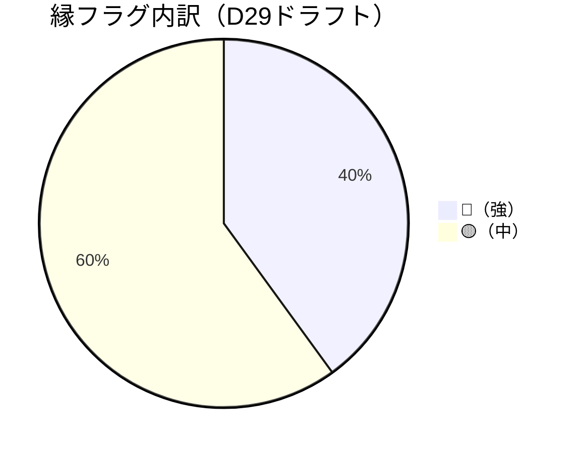
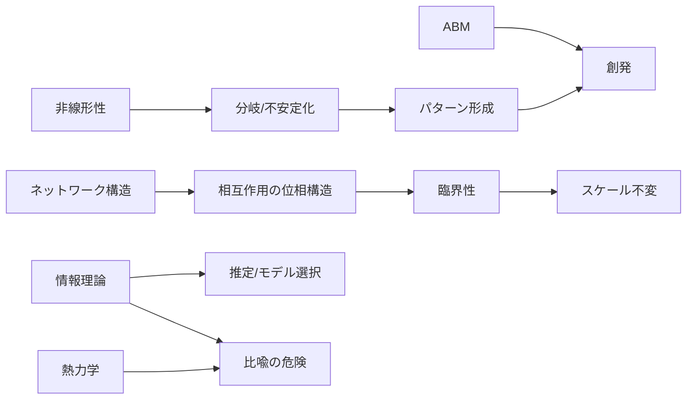

# REVIEW-D29-complexity-science

## エグゼクティブサマリー

本レビューは、入力された `evidence-D29-complexity-science.md`（複雑系科学の10エントリ＋領域レポートL-1〜L-5）を対象に、依頼要件 `REQ-GPT-20260304-022_d29-review.md` に沿って、(P)層正確性／(M)層妥当性／縁（第3段階）判定精度（🔴/🟡）／牽強付会リスク／欠落候補（重要理論の漏れ）を精査した。

総合所見として、**複雑系科学の中核概念（非平衡自己組織化、臨界性・相転移、パーコレーション、ネットワーク、反応拡散）を「縁」を中心に束ねる構成は強い**。主要な一次文献の実在と内容整合も概ね良好で、たとえば散逸構造（非平衡が秩序源になり得る／分岐と揺らぎの役割）、SOC、繰り込み群、形態形成の反応拡散、スモールワールド等は、原典側の記述と整合する。citeturn12view0turn16view0turn0search1turn1search1turn1search3turn12view1turn3search1turn5search3

一方で、改訂優先度が高い論点は次の3点に集約される。

第一に、**(P)層における「主張→典拠」接続の欠け**が散見される。具体的には、(a)自己触媒集合（CX-003）の「前生物的実験系の進展」、(b)シナジェティクス（CX-004）の「レーザー原型」の典拠、(c)オートポイエーシス（CX-007）の「enaction（認知＝生きること）」の典拠、(d)反応拡散（CX-008）の「動物模様への関与」「境界条件がパターン選択に与える決定性」、(e)カオスの縁（CX-009）のRBNに関する定量命題が、現状では文献参照が弱い（または不在）ため、**引用補強が必須**。citeturn17search3turn15search0turn22search2turn13search2turn10search0

第二に、**(M)層（5段階モデル）への当てはめが高品質である一方、用語の操作的定義が不足**し、領域横断フェーズで意味がズレるリスクがある。特に「縁の3条件」と「束の3タイプ（維持構造型／統計構造型／構造トポロジー型）」は、現状の洞察として優れているため、モデル定義側に明示的に“逆輸入”する価値が高い。

第三に、**CX-009「カオスの縁」は引き続きCA（警戒）維持が妥当**だが、現状のままだと「興味深いことが起きる場所が興味深い」という循環論法（トートロジー）や、λ等の指標の不確かさが本文の説得力を削ぐ。批判的再検討（例：Mitchell et al.）まで含めて「仮説としての地位」を明確にした上で残すのが安全。citeturn4search3turn10search2

欠落候補としては、複雑系科学の“実践的コア”である **エージェントベースモデル（ABM）／複雑適応系（CAS）／情報理論（Shannon・Jaynes系）** がD29本文の軸に未接続で、ここを補うと領域の完成度が大きく上がる。citeturn20search0turn20search1turn19search11turn19search0turn19search1

## 対象文書とレビュー方法

対象は以下の2ファイル（2026-03-04 JST時点）。

- 入力エビデンス：`evidence-D29-complexity-science.md`
- 依頼要件：`REQ-GPT-20260304-022_d29-review.md`

レビューは、(1)主張抽出→(2)典拠の実在確認→(3)典拠内容と主張の一致検査（可能な限り一次・公式ソース）→(4)5段階モデル整合性→(5)縁🔴/🟡妥当性→(6)牽強付会（比喩・過剰一般化）評価→(7)欠落理論の同定→(8)改訂提案、の順に行った。

```mermaid
flowchart TD
  A[入力: evidence / REQ] --> B[主張抽出: 各CXエントリ]
  B --> C[典拠抽出: refs/括弧内引用/暗黙参照]
  C --> D[一次・公式ソースで実在検証]
  D --> E[内容一致検査: 主張と要旨/定義/結果の整合]
  E --> F[5段階(M)整合: 場→波→縁→渦→束]
  F --> G[縁判定: 3条件×🔴/🟡]
  G --> H[牽強付会/比喩過剰の検出]
  H --> I[欠落候補の同定: ABM/情報理論/CAS等]
  I --> J[改訂提案: 文言・引用・再分類・優先度]
```

縁フラグ（🔴/🟡）分布は、当該ドラフトの自己評価どおり「縁寄り」で、D29の特徴（“縁の学”としての複雑系）を強化する素材になっている。



## 五観点評価

### エントリ別の総合判定（改訂観点）

依頼の運用ラベル（Accept/P0/P1/要議論）に合わせ、**内容を採用しつつ改稿が要る箇所**を明示する（Accept＝採用、P1＝軽微〜中改稿で強化、P0＝主要主張の根拠不足や誤読リスク、要議論＝位置づけ自体の再検討が必要）。

| Entry | 現状Triage | 推奨判定 | 主因（端的） |
|---|---|---|---|
| CX-001 散逸構造 | Accept | Accept（P1） | 一次文献整合は強いが、社会系比喩の制限条件を“先に”明文化したい。citeturn12view0turn16view0 |
| CX-002 SOC | Accept | Accept（P1） | SOCの“定義拡散”とパワー則検定の要件は妥当。統計検定の段落をテンプレ化すると強い。citeturn1search6turn1search3 |
| CX-003 自己触媒集合 | Accept | Accept（P0→P1） | 「実験系進展」主張に一次典拠が不足。RAF検出・実験例の引用補強が必要。citeturn4search1turn17search1 |
| CX-004 シナジェティクス | Accept | Accept（P1） | 枠組みは堅いが、レーザー例など“原型事例”に一次参照（または標準書）を添えると安心。citeturn15search0turn5search6 |
| CX-005 臨界現象/RG | Accept | Accept（P1） | 一次整合は非常に強い。年次・書誌を厳密化（講演1982→出版1983の区別）。citeturn2search13turn12view1turn2search1 |
| CX-006 パーコレーション | Accept | Accept（P1） | 閾値の核は堅いが、疫学・頑健性応用は典拠追加が望ましい。citeturn2search3turn18search2turn18search11 |
| CX-007 オートポイエーシス | Accept | Accept（P0→P1） | 概念核は堅いが、enaction主張・社会理論拡張の扱いは典拠と注意書きを強化。citeturn3search11turn7search0turn22search2 |
| CX-008 反応拡散/チューリング | Accept | Accept（P1） | 原典と実験は堅い。生物学的関与・境界条件の文献補強でP層が締まる。citeturn3search1turn3search2turn8search0 |
| CX-009 カオスの縁 | CA | CA（要議論） | 操作的定義の不安定さ＋批判的再検討の必要。仮説の位置づけを明確化して残す。citeturn4search3turn10search2turn10search0 |
| CX-010 ネットワーク科学 | Accept | Accept（P1） | コア文献は堅いが、「生成理論」ではなく「形式言語」枠である点を本文構造で強調。citeturn5search3turn6search0turn0search3turn6search2 |

### (P) 層正確性（文献の実在性・引用の正確さ・内容理解）

一次・公式ソース照合の観点では、**中核文献は実在し、要旨レベルでドラフトの主張と一致**している。典型例として、散逸構造については、非平衡が秩序の源となり得ること、不可逆過程が散逸構造に至り得ること、分岐点近傍で揺らぎが分岐経路（branch）に影響することが、ノーベル講演本文で確認できる。citeturn12view0turn16view0

SOCに関しても、自己組織化臨界（遅い駆動の下で臨界状態に向かう）という中心命題は原著論文で確認でき、パワー則の検出が統計的に難しく、単純なログ–ログ回帰が危険である点は、統計的手続き（最尤推定・適合度検定・モデル比較）を示す標準的整理に整合する。citeturn0search1turn1search1turn1search3  
加えて、SOC概念が分野へ拡散する過程で定義が変質し得る／論争構造を整理する、というドラフトの姿勢は、25年レビューの位置づけと整合的である。citeturn1search6

ネットワーク科学について、スモールワールド性（高クラスタリング＋短平均経路長）という性質の定義的主張は原著と整合し、優先的選択によるスケールフリー生成も原典に整合する。citeturn5search3turn6search0  
また「スケールフリー普遍性」への警戒は、規模の大きいコーパスで“強いスケールフリー性が稀”と報告する研究と方向が一致する。citeturn0search3

ただし、(P)層で弱い箇所は「引用欠け」に集中する。代表例を挙げる。

- **CX-003（自己触媒集合）**：前生物的実験系（RNA/リボザイム等）で自己触媒ネットワーク研究が進展、という主張は妥当な方向だが、本文中の典拠が不足している。近年の“自己触媒RNA反応ネットワーク”の実験やレビューを添えるべき。citeturn17search1turn17search3
- **CX-007（オートポイエーシス）**：「enaction（認知＝生きること）」系の主張は、オートポイエーシスの原典だけでなく、後続の認知科学系整理（例：The Embodied Mind）へ橋渡しが必要。citeturn3search11turn22search2
- **CX-008（反応拡散）**：動物模様への関与は、レビュー論文等で補強すると「示唆」→「どの程度支持されているか」の粒度が上がる。citeturn8search0turn8search1
- **CX-009（カオスの縁）**：RBNでの臨界接続（K≈2）周辺の「秩序が出る」叙述は古典論文・標準書に典拠を明示したい。citeturn10search0turn10search1

### (M) 層妥当性（5段階モデルとの論理整合）

ドラフトは各エントリで「場←…／波←…／縁←…／渦←…／束←…」の対応を記述しており、**“閾値・分岐・界面・相転移”を縁の中心現象として捉える**という設計は一貫している。特に、臨界現象（CX-005）とパーコレーション（CX-006）は、縁＝閾値点（臨界点／浸透閾値）、渦＝マクロ相（新しい相／巨視的クラスター）、束＝普遍性クラス／フラクタル統計構造、という写像が明瞭で、(M)層の“基準器”として使える。citeturn2search13turn12view1turn2search3

改善提案として重要なのは、**モデル側の用語定義を、D29側の洞察で更新する**こと。

- 「縁の3条件」（関係網／未決定性・選択／渦接続）は、D29本文中で局所的には使われているが、モデル全体の定義としては明文化されていない。ここをモデル定義へ持ち上げると、他領域での縁判定がブレにくくなる。
- 「束の3タイプ」（維持構造型／統計構造型／構造トポロジー型）は、散逸構造・SOC・普遍性・ネットワークが同じ「束」に見えても“残り方”が異なることを明確化しており、(M)層の精度向上に直結する。特に「維持構造型」は、プリゴジン的散逸構造（フラックス停止で消える）を、統計構造型（パワー則・普遍性指数）と混同しないための安全弁になる。citeturn12view0turn1search1turn12view1

### 縁（第3段階）判定の精度（🔴/🟡妥当性）

現行の🔴4件（CX-003/005/006/007）・🟡6件（CX-001/002/004/008/009/010）は、概ね妥当である。

- 🔴の根拠が最も堅いのは、(a)臨界現象（相関長発散・全スケール結合という“際”）とRGの枠組み、(b)浸透閾値での巨視的連結出現という最小モデル、の2つである。いずれも「関係網（相互作用）」「未決定性（臨界点での非解析性・選択）」「渦接続（新相／巨視的クラスター）」が明示される。citeturn12view1turn2search3
- 🟡が妥当な代表はネットワーク科学（CX-010）で、相互作用“構造”を記述する形式言語として縁に寄与する一方、ネットワーク科学それ自体が「閾値点で何が起こるか」という生成プロセス理論ではない点が、(2)(3)の間接性につながる。多層・高次相互作用のレビューは「関係網」の表現力を押し上げるが、そのまま縁🔴にするには、具体的な“選択・相転移”過程（例：高次相互作用が臨界点や流行閾値をどう変えるか）まで踏み込む必要がある。citeturn6search1turn6search2

再分類の“候補”として議論価値があるのはCX-001（散逸構造）で、プリゴジン講演には分岐点・揺らぎ・分岐経路（branch）の議論が明示されるため、縁の3条件自体は満たしているようにも見える。citeturn16view0  
ただしドラフトが🟡維持としている理由（関係網の明示度が臨界・パーコレーションほど強くない）は、縁判定基準を「ネットワーク／結合構造」の明示性へ寄せる設計として一貫しているため、現状維持でよい。重要なのは「なぜ🟡なのか」を、縁判定基準（関係網の明示度）とセットで読者に伝えること。

### 牽強付会リスク（理論的飛躍・比喩過剰）

牽強付会は、ドラフト自身が最も危険視している「パワー則／スケールフリーの万能化」と「熱力学比喩の無制限拡張」に集中する。

- パワー則については、**統計検定のテンプレ化**が推奨される。SOCやネットワークの議論で“パワー則が出た＝SOC／スケールフリー”にならないよう、推定（MLE）・適合度（KS等）・代替分布との尤度比比較という最低限のチェックを本文に“手続きとして埋め込む”ことが、牽強付会リスクを構造的に下げる。citeturn1search3turn0search3
- 熱力学比喩は、プリゴジン講演自体が都市や生物を引き合いに出した上で、非平衡が秩序源になり得ることを述べるため、読者が社会系へ安易に一般化しやすい。citeturn12view0  
  したがって、本文側で「熱力学の量（エントロピー生成等）を本当に定義しているのか／境界条件は何か」を明示し、定義できない場合は「情報理論のエントロピー（不確実性）」など別の量へ置き換えて議論する、という“逃げ道”を用意するとよい。Shannon・Jaynes系の参照は、その安全弁になり得る。citeturn19search0turn19search1

最も高リスクなのはCX-009で、「エッジ・オブ・ケイオス」は主張が魅力的であるほど、操作的定義の不安定さと循環論法の罠が大きい。Langtonは位相転移近傍で情報伝送・保存・修正が最適化され得る可能性を論じる一方、Mitchell et al.はλ指標の信頼性や先行解釈に疑義を示しており、「仮説の確証」ではなく「仮説の提示と批判的検討」が妥当。citeturn4search3turn10search2

### 欠落候補（複雑系科学として重要理論の漏れ）

D29の現行10件は「縁＝閾値／界面／相転移」周りに厚いが、複雑系科学の“方法論の柱”として次が欠けている。

- **エージェントベースモデル（ABM）**：局所ルールからマクロパターンが創発する、という複雑系の最頻出メカニズムを“手続きとして実装する”枠組み。Schellingの分離モデルは古典例。citeturn20search0
- **複雑適応系（CAS）**：適応し学習する多数要素（エージェント）が相互作用し、全体が創発的に変化するという枠組み（Holland）。複雑系科学の学術的中核の一つ。citeturn19search11
- **情報理論（Shannon）と最大エントロピー原理（Jaynes）**：複雑系における「情報」「不確実性」「観測とモデル化」を扱う共通言語で、熱力学比喩の誤用を避けるためにも有効。citeturn19search0turn19search1

これらはD29に「縁」だけでなく「観測・推定・モデル化」の軸を加え、領域の射程を自然に拡張する。



## 主張-引用検証テーブル

凡例：Source Verified? は「引用された典拠が実在し、主張の核（定義・結果・要旨）が典拠と整合するか」。Noには「典拠欠け（要追記）」と「不一致（要修正）」を含む。

| Claim（要約） | Cited Source（ドラフト想定） | Source Verified? | Notes |
|---|---|---|---|
| 非平衡が秩序源になり得て、散逸構造に至る | R1 | Yes | 講演本文で“non-equilibrium may be a source of order”“dissipative structures”の趣旨が確認できる。citeturn12view0 |
| 分岐点近傍で揺らぎが分岐経路を左右 | R1 | Yes | 分岐点で揺らぎがbranchを決める趣旨が確認できる。citeturn16view0 |
| SOC：遅い駆動下で臨界状態へ自己組織化 | R3/R4 | Yes | SOCの中核主張として整合。citeturn0search1turn1search1 |
| パワー則検出はログ–ログ回帰では危険でMLE等が必要 | R5 | Yes | 統計手続きの必要性が明示される。citeturn1search3 |
| SOC定義の拡散・論争をレビューが整理 | R6 | Yes | SOCの定義変質と論争の整理を掲げるレビュー。citeturn1search6 |
| “スケールフリー普遍性”は統計的に疑義 | R7 | Yes | 強いスケールフリー性が稀という結論を含む。citeturn0search3 |
| 触媒密度閾値で自己触媒集合が生じ得る | R8 | Yes | 自己触媒集合に関する古典論文として実在・整合。citeturn4search2 |
| RAF集合検出が多項式時間アルゴリズムとして定式化 | R9 | Yes | “polynomial-time algorithm”趣旨が確認できる。citeturn4search1turn4search5 |
| 前生物的実験系で自己触媒ネットワーク研究が進展 | （本文に典拠弱） | No | 追記推奨：自己触媒RNAネットワーク実験・レビュー等。citeturn17search1turn17search3 |
| シナジェティクス：秩序変数と従属原理で統一記述 | R11 | Yes | 標準書で枠組みが確認できる。citeturn15search0turn5search6 |
| レーザーが原型事例 | （本文に典拠弱） | No | 追記推奨：Haken系一次／標準書のレーザー例節を参照。citeturn15search0 |
| RG：多スケールの揺らぎを順次積分消去する戦略 | R12 | Yes | 公式講演で手続きが明示される。citeturn12view1turn2search13 |
| RGの臨界現象論（Kadanoffスケーリング等） | R13 | Yes | 1971論文として実在・整合。citeturn2search1 |
| パーコレーション閾値で巨視的連結成分が出現 | R14 | Yes | 起源論文として実在。citeturn2search3 |
| p_c近傍でべき分布・普遍性クラス | R15 | Yes | 標準書として実在（版情報は1994改訂第2版等）。citeturn14search0turn14search9 |
| 疫学（SIR）とパーコレーション閾値の対応 | （本文に典拠弱） | No | 追記推奨：SIRとパーコレーションの同値・閾値対応。citeturn18search2turn18search0 |
| オートポイエーシス定義（自己産出ネットワーク） | R16 | Yes | 定義的核の参照として妥当。citeturn3search11 |
| 境界の自己産出（モデル化を含む） | R17 | Yes | オートポイエーシスのモデル論文として実在。citeturn7search0turn7search12 |
| enaction（認知＝生きること） | （本文に典拠弱） | No | 追記推奨：認知＝enaction整理（Varelaほか）。citeturn22search2turn22search6 |
| 数学的形式化の不十分さ（批判的レビュー） | R18/R19 | Yes | 原典の曖昧さ・再整理の必要性を論じる系統。citeturn7search3turn7search10 |
| 社会理論への拡張（Luhmann） | R20 | Yes | 書誌として実在。拡張の妥当性は別途議論だが、参照先としては妥当。citeturn7search13turn7search21 |
| 反応拡散：拡散駆動不安定でパターン形成 | R21 | Yes | 原著で示唆される。citeturn3search1turn3search17 |
| CIMA反応でチューリング構造の実験的証拠 | R22 | Yes | PRL論文として実在。citeturn3search2turn3search6 |
| 動物体表模様への関与 | （本文に典拠弱） | No | 追記推奨：レビュー（Kondo & Miura）等。citeturn8search0turn8search4 |
| CAの相転移近傍で情報処理が最大化“し得る” | R24 | Yes（仮説） | 原著は可能性提示。断定を避ける文言が望ましい。citeturn4search3 |
| λは信頼性の低い予測子（先行解釈を批判） | R25 | Yes | 異なる結果を報告し、先行解釈に疑義。citeturn10search2turn10search7 |
| RBN：K≈2近傍で“秩序・安定”が生じる趣旨 | R26 | Yes | 2〜3入力で秩序・安定という趣旨が含まれる。citeturn10search0turn10search4 |
| スモールワールド性（高C＋短L） | R27 | Yes | 原著として実在・整合。citeturn5search3turn5search11 |
| 優先的選択でべき次数分布（BAモデル） | R28 | Yes | 原著として整合。citeturn6search0turn6search4 |
| 多層ネットワークの構造とダイナミクス | R29 | Yes | レビューとして実在。citeturn6search1turn6search9 |
| ペアを超える高次相互作用ネットワーク | R30 | Yes | レビューとして実在。citeturn6search2turn6search6 |

## 改訂提案（文言・引用・再分類・優先順位）

### 優先度付きアクションリスト

| Priority | 対象 | 推奨変更（具体） | 目的（なぜ必要か） | 工数 |
|---|---|---|---|---|
| High | 全体 | 「縁の3条件」を定義セクションで明文化（関係網／未決定性・選択／渦接続）し、各エントリの評価が“定義に還元”できるようにする | (M)層の判定ブレを抑止し、🔴/🟡の説明責任を強化 | Medium |
| High | CX-009 | 断定語を排し「仮説」位置づけへ再編集（例：“最大化される”→“最大化され得ると提案”）。操作的定義（λ、Lyapunov、情報量指標など）の揺れを列挙し、批判文献を本文に組み込む | 循環論法／過剰一般化の最大リスクを抑える citeturn4search3turn10search2 | Medium |
| High | CX-003 | 「前生物的実験系の進展」を、少なくとも1本の実験論文＋1本のレビューで補強（例：自己触媒RNAネットワーク実験、自己触媒集合レビュー） | (P)層の“引用欠け”を解消 citeturn17search1turn17search3 | Medium |
| High | CX-007 | enaction主張に橋渡し典拠を追加し、オートポイエーシス原典との関係を段落で整理（「同義」ではなく「系譜上の展開」へ） | (P)層の正確性と誤読回避 citeturn3search11turn22search2turn22search6 | Medium |
| High | CX-006 | 疫学・頑健性応用部に一次典拠を追加し、用語（R0 vs 閾値）の対応を厳密化（SIRとパーコレーション同値等） | 応用主張の根拠を明確化し、誤用を防ぐ citeturn18search2turn18search11 | Low–Medium |
| Medium | CX-008 | 「動物模様」主張をレビューで補強し、境界条件の役割を標準書参照で締める | “示唆”の粒度を上げ、(P)層を安定化 citeturn8search0turn13search2 | Low |
| Medium | CX-004 | レーザー例に典拠を付加（標準書の該当節や概説） | “原型事例”の信頼性（P層）を上げる citeturn15search0turn5search6 | Low |
| Medium | CX-005 | 書誌の厳密化：講演（1982）と出版（1983）の区別を追記 | (P)層の引用精度を上げる citeturn2search13turn2search2 | Low |
| Medium | 全体 | 「束の3タイプ」を、5段階モデル本文（束定義）に反映するかの判断を明示（採用するなら定義更新） | (M)層の精度向上と領域横断比較の基礎化 | Medium |
| Low | CX-010 | ネットワーク科学は「生成理論」ではなく「形式言語」である旨を、冒頭で一文明記（本文にも反映） | 読者が“何でもネットワーク”に流れないためのガード citeturn6search2turn0search3 | Low |

### 具体的な文言修正案（例）

- **CX-009（カオスの縁）**  
  推奨：  
  - 変更前（趣旨）：*「相転移近傍で情報処理能力が最大化される」*  
  - 変更後（例）：*「相転移近傍で情報伝送・保存・修正が最適化され得る可能性が提案されているが、指標（例：λ）と計算能力の関係は単純ではなく、反例・再検討もあるため仮説として扱う」* citeturn4search3turn10search2

- **CX-006（パーコレーション→疫学の橋渡し）**  
  推奨：  
  - 変更前（趣旨）：*「疫学（R0）と接続」*  
  - 変更後（例）：*「ネットワーク上SIRモデルはボンド・パーコレーションと対応づけられ、パーコレーション閾値が流行閾値と対応する枠組みがある」* citeturn18search2turn18search0

- **CX-007（認知＝生きること）**  
  推奨：  
  - 変更前（趣旨）：*「認知は生きることと同義」*  
  - 変更後（例）：*「オートポイエーシスと『生物学的認知』の系譜は、のちにenaction（認知＝身体化された行為）として展開される。ここでは“同義”ではなく“発展系譜”として扱う」* citeturn3search11turn22search2turn22search6

## 追加参考文献（注釈付き）と最終QAチェック

### 追加参考文献（欠落補完の最小セット）

- ABMの古典例として、局所ルールからのマクロ創発（分離）を示すSchellingモデルを1本追加（「D29が縁中心である」ことと相性が良い：局所選好の“縁”がマクロ構造へ繋がる）。citeturn20search0  
- CAS（複雑適応系）を1本追加し、複雑系科学を“物理系の臨界”だけでなく“適応するエージェント群”へ拡張する。citeturn19search11  
- 情報理論（Shannon）と最大エントロピー原理（Jaynes）を追加し、「熱力学比喩」と「情報量」を区別する編集指針を明文化する。citeturn19search0turn19search1  
- 可能なら、複雑系研究コミュニティの公式紹介（領域の定義・射程）を補助参照として追加（領域概観の一次性を上げる）。citeturn19search6

### 最終QAチェックリスト（保存前）

- すべての[P]主張について、**「主張→典拠」リンクが本文で追える**（引用欠けがない）  
- パワー則／スケールフリーの記述は、**統計的検定手続き（MLE＋適合度＋代替分布比較）を明示**している citeturn1search3turn0search3  
- CX-009は、**操作的定義の揺れ・批判文献・仮説としての地位**が明記され、断定に見えない citeturn10search2turn4search3  
- 臨界（CX-005）・パーコレーション（CX-006）・SOC（CX-002）の関係は、**“同じ月を指す”のか“別概念”か**が説明されている（混同防止）  
- 「束の3タイプ」「縁の3条件」が、**D29だけの洞察で終わらずモデル定義に反映するか**の方針が書かれている  
- 参照文献リストの書誌（年次・DOI・版情報）が整合している（特にRG講演年）。citeturn2search13turn2search2  

### 参考文献リスト（検証に用いた一次・公式ソース中心）

- [R1] entity["people","イリヤ・プリゴジン","nobel chemist 1977"] (1977). *Time, Structure and Fluctuations*（ノーベル講演）. citeturn0search4turn12view0turn16view0  
- [R2] Prigogine & entity["people","イザベル・ステンジェール","philosopher of science"] (1984). *Order Out of Chaos: Man’s New Dialogue with Nature*. citeturn13search0  
- [R3] entity["people","ペール・バク","physicist soc"] ほか (1987). *Self-organized criticality: An explanation of the 1/f noise*. citeturn0search1  
- [R4] Bak ほか (1988). *Self-organized criticality*. citeturn1search1  
- [R5] entity["people","アーロン・クラウセット","network scientist"] ほか (2009). *Power-law distributions in empirical data*. citeturn1search3turn0search6  
- [R6] entity["people","ニコラス・ワトキンス","space physicist"] ほか (2016). *25 Years of Self-Organized Criticality: Concepts and Controversies*. citeturn1search6turn1search2  
- [R7] entity["people","アンナ・D・ブロイド","network scientist"] & Clauset (2019). *Scale-free networks are rare*. citeturn0search3turn0search7  
- [R8] entity["people","スチュアート・カウフマン","complexity theorist"] (1986). *Autocatalytic sets of proteins*. citeturn4search2  
- [R9] entity["people","ウィム・ホルダイク","mathematician raf"] & entity["people","マイク・スティール","mathematician phylogenetics"] (2004). *Detecting autocatalytic, self-sustaining sets in chemical reaction systems*. citeturn4search1turn4search5  
- [R10] Hordijk & Steel (2010). *Autocatalytic Sets and the Origin of Life*. citeturn17search3turn4search18  
- [R11] entity["people","ヘルマン・ハーケン","physicist synergetics"] (1983). *Advanced Synergetics: Instability Hierarchies of Self-Organizing Systems and Devices*. citeturn15search0turn5search6  
- [R12] entity["people","ケネス・G・ウィルソン","nobel physicist 1982"] (1982/1983). *The Renormalization Group and Critical Phenomena*（ノーベル講演）. citeturn2search13turn12view1turn2search2  
- [R13] Wilson (1971). *Renormalization Group and Critical Phenomena. I: Renormalization Group and the Kadanoff Scaling Picture*. citeturn2search1turn2search12  
- [R14] entity["people","S・R・ブロードベント","mathematician percolation"] & entity["people","J・M・ハマーズリー","mathematician percolation"] (1957). *Percolation processes*. citeturn2search3turn2search17  
- [R15] entity["people","ディートリッヒ・シュタウファー","physicist percolation"] & entity["people","アモン・アハロニー","physicist percolation"] (1994). *Introduction to Percolation Theory*（改訂第2版の書誌）. citeturn14search0turn14search9turn14search10  
- [R16] entity["people","ウンベルト・マトゥラーナ","biologist autopoiesis"] & entity["people","フランシスコ・ヴァレラ","neuroscientist autopoiesis"] (1980). *Autopoiesis and Cognition: The Realization of the Living*. citeturn3search11  
- [R17] Varela ほか (1974). *Autopoiesis: The organization of living systems, its characterization and a model*. citeturn7search0turn7search12  
- [R18] entity["people","ピエル・ルイジ・ルイージ","chemist origin of life"] (2003). *Autopoiesis: a review and a reappraisal*. citeturn7search3turn7search11  
- [R19] entity["people","パブロ・ラセト=バリー","philosopher biology"] (2012). *Autopoiesis 40 years later. A review and a reformulation*. citeturn7search10turn7search2  
- [R20] entity["people","ニクラス・ルーマン","sociologist systems theory"] (1984). *Soziale Systeme: Grundriss einer allgemeinen Theorie*（書誌）. citeturn7search13turn7search21  
- [R21] entity["people","アラン・チューリング","mathematician"] (1952). *The chemical basis of morphogenesis*. citeturn3search1turn3search17  
- [R22] Castets ほか (1990). *Experimental evidence of a sustained standing Turing-type nonequilibrium chemical pattern*. citeturn3search2turn3search6  
- [R23] entity["people","近藤滋","biologist pattern formation"] & entity["people","三浦崇","biologist"] (2010). *Reaction-Diffusion Model as a Framework for Understanding Biological Pattern Formation*. citeturn8search0turn8search20  
- [R24] entity["people","クリストファー・ラングトン","complex systems researcher"] (1990). *Computation at the edge of chaos: Phase transitions and emergent computation*. citeturn4search3turn4search15  
- [R25] entity["people","メラニー・ミッチェル","complex systems scientist"] ほか (1993). *Revisiting the Edge of Chaos: Evolving Cellular Automata to Perform Computations*. citeturn10search2turn10search7  
- [R26] Kauffman (1969). *Metabolic stability and epigenesis in randomly constructed genetic nets*. citeturn10search0turn10search4  
- [R27] entity["people","ダンカン・ワッツ","network scientist"] & entity["people","スティーブン・ストロガッツ","mathematician"] (1998). *Collective dynamics of “small-world” networks*. citeturn5search3turn5search11  
- [R28] entity["people","アルバート=ラースロー・バラバシ","network scientist"] & entity["people","レーカ・アルベルト","physicist"] (1999). *Emergence of scaling in random networks*. citeturn6search0turn6search4  
- [R29] Boccaletti ほか (2014). *The structure and dynamics of multilayer networks*. citeturn6search1turn6search9  
- [R30] entity["people","フェデリコ・バッティストン","physicist network science"] ほか (2020). *Networks beyond pairwise interactions: Structure and dynamics*. citeturn6search2turn6search6  
- [R31] entity["people","M・E・J・ニューマン","network scientist"] (2001/2002). ネットワーク上SIRとパーコレーションの対応（解説論文／作業稿）. citeturn18search2turn18search0  
- [R32] entity["people","クロード・シャノン","information theorist"] (1948). *A Mathematical Theory of Communication*. citeturn19search0turn19search4  
- [R33] entity["people","E・T・ジェインズ","physicist bayesian"] (1957). *Information Theory and Statistical Mechanics*. citeturn19search1turn19search5  
- [R34] entity["people","ジョン・H・ホランド","complex adaptive systems"] (1992). *Complex Adaptive Systems*. citeturn19search11turn19search3  
- [R35] entity["organization","Santa Fe Institute","research institute santa fe nm us"]（公式概要）. citeturn19search6turn19search2  
- [R36] entity["people","P・W・アンダーソン","nobel physicist 1977"] (1972). *More Is Different*. citeturn21search0turn21search12  
- [R37] entity["people","トーマス・C・シェリング","economist nobel"] (1971). *Dynamic models of segregation*. citeturn20search0turn20search4  
- [R38] entity["people","ジョシュア・M・エプスタイン","complexity social scientist"] & entity["people","ロバート・アクステル","complexity researcher"] (1996). *Growing Artificial Societies: Social Science from the Bottom Up*. citeturn20search1turn20search5  
- [R39] entity["people","ロバート・アクセルロッド","political scientist"] (1997). *The Complexity of Cooperation: Agent-Based Models of Competition and Collaboration*. citeturn20search2turn20search6  
- [R40] Varela ほか (1991). *The Embodied Mind: Cognitive Science and Human Experience*（enactionの導入）。citeturn22search2turn22search17turn22search6