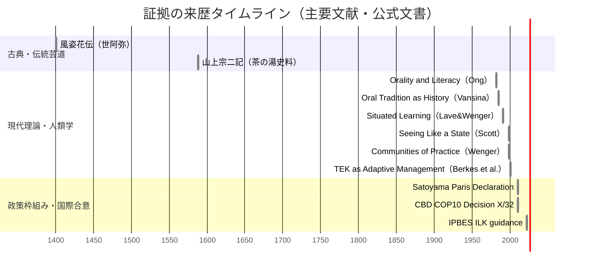

# REVIEW-D30-traditional-knowledge

## エグゼクティブサマリー

本レビューは、アップロードされた **evidence-D30-traditional-knowledge.md**（以下「Evidence」）に含まれる全引用（refs）について、(a) 文献の実在性・書誌情報の正確性、(b) Evidenceが採用する **5段階モデル（場→波→縁→渦→束）** への論理整合、(c) **縁（第3段階）** 判定（🔴/🟡）の妥当性、(d) **牽強付会**（過剰解釈）リスク、(e) **欠落候補**（追加すべき中核根拠）を点検した。

結論として、Evidenceは「伝統知」を **単なる知識の蓄積ではなく、実践・制度・身体・関係性の中で更新される動的体系**として捉える枠組みを持ち、TEK、LPP、職人技能、里山など複数領域にわたる“構造類似”の提示は概ね筋が良い。一方で、レビュー上の主要な改善点は次の3点に集約される。

第一に、**引用の特定性（同定可能性）にばらつき**がある。DOIや出版社ページ・政府公定訳・図書館カタログで一意に検証できる引用が多数ある一方、**「武道文化論」「日本民俗学会関連論文」等のように書誌が不足して検証不能**なものが残る。特に **守破離** 周りは、用語史・出典の扱いが曖昧なまま「精査が必要」としているため、[P]層の強度が下がっている（表1参照）。

第二に、[P]/[M] 境界の運用が部分的に揺れる。[P]としている文が、実質的に「評価語」や「読み」としての主張（例：「広く参照される」「共存モデルとして位置づけ」）を含む箇所があり、[P]層の監査可能性を下げる。ここは **[P]は“典拠が直接支える記述”に限定し、一般化・位置づけ・類推は[M]へ寄せる**と改善する。

第三に、**縁（第3段階）判定の基準適用が一部で不整合**になっている。Evidence自身が「関係網・未決定性・渦接続」のような条件語を使いながら、条件の充足とラベル（🔴/🟡）が一致しない箇所がある。とくに **EV-TK-003** は「一座建立」という“縁→渦”の飛躍が主題であり、縁判定は🔴に上げるか、🟡のままなら“未充足条件”を明示する必要がある（表3参照）。

## レビュー範囲と方法

本レビューは、Evidenceに含まれる **EV-TK-001〜010**（10件）と、補足扱いの **EV-TK-NA-001**（NA）、および文脈整理の **L-1〜L-5 / クロスリファレンス**を対象にした（Evidenceヘッダ部に「entry_count: 10」等の記載あり）。Evidenceが明示する凡例（[P]=文献に基づく解釈 / [M]=理論から着想した構造的類似）と、「無理に当てはめない」方針は、レビュー規準として妥当である（Evidence冒頭の方法論記述）。

レビュー手順は以下の通り。

- **引用検証**：各refsを抽出し、DOI（出版社/学会サイト）、政府公定訳PDF、図書館カタログ（CiNii/UNESCO/University OPAC等）、公式機関ページで実在性と書誌を照合した。  
- **[P]層正確性**：引用元が当該主張を直接支えるか（少なくとも要旨・定義・一次記述に整合するか）を確認し、過大一般化がある場合は修正文案を提示した。  
- **[M]層妥当性**：5段階モデルへの写像が「表面的類似」ではなく「生成・更新・制度化の力学」に対応しているかを点検した。  
- **縁（第3段階）判定精度**：Evidenceが用いる判定ロジック（条件語）を踏まえ、🔴/🟡の整合と説明の十分性を監査し、必要なラベル変更を提案した。  
- **牽強付会リスク / 欠落候補**：根拠不足・用語史未確定の箇所、理論の“乗せすぎ”になりやすい箇所を例示し、より堅い一次・公式根拠への差し替え/追加を提案した。

**前提（明示的な仮定）**：REQファイル（REQ-GPT-20260304-028_d30-review.md）は途中に「…」が含まれており、縁判定や5段階要素の厳密定義が欠落しているため、本レビューでは **Evidence側の運用（場→波→縁→渦→束、縁=関係の中で意味が編まれる過程、等）**を準拠定義として扱った（REQの欠落部分に依存する規則は「未指定」として扱う）。

```mermaid
flowchart TD
  A[一次・公式ソース\n(論文DOI/出版社/政府公定訳/機関サイト)] --> B[Evidence refs\n(書誌として列挙)]
  B --> C[[P] 主張\n(定義・事実・記述)]
  B --> D[[M] 主張\n(5段階モデルへの構造類似)]
  C --> E[5段階モデル写像\n場→波→縁→渦→束]
  D --> E
  E --> F[縁ラベル判定\n🔴/🟡]
  F --> G[クロスリファレンス\n他Dとの接続メモ]
```

## 引用検証結果

下表は、Evidenceのrefs欄に登場する各引用について、**実在性（found/not found）**、**確定できた正確書誌**、および **Evidence側の不一致・不足**をまとめた。

### 表1 文献・公的資料の実在性と書誌照合

| Evidence記載の引用 | 検証 | 確定した書誌情報（最小限だが一意になる形） | 不一致・不足（修正提案） |
|---|---|---|---|
| Berkes, F., Colding, J., & Folke, C. (2000). Rediscovery of Traditional Ecological Knowledge as Adaptive Management. Ecological Applications, 10(5), 1251–1262. | found | Berkes, F., Colding, J., & Folke, C. (2000). “Rediscovery of Traditional Ecological Knowledge as Adaptive Management.” *Ecological Applications*, 10(5), 1251–1262.（Wiley/DOIランディング）citeturn0search4turn0search16 | Evidence表記は概ね妥当。厳密化するならDOIを追記（出版社ページに記載）。citeturn0search4 |
| Huntington, H. P. (2000). Using Traditional Ecological Knowledge in Science: Methods and Applications. Ecological Applications, 10(5), 1270–1274. | found | Huntington, H. P. (2000). “Using Traditional Ecological Knowledge in Science: Methods and Applications.” *Ecological Applications*, 10(5), 1270–1274.（Wiley/DOIランディング）citeturn0search1 | Evidence表記は概ね妥当。厳密化するならDOIの追記。citeturn0search1 |
| IPBES (2022). ILK方法論ガイダンス | found | IPBES “Approach to Indigenous and Local Knowledge (ILK)”関連資料。2022年承認のILK方法論ガイダンスPDFと、ILKの公式説明ページが確認できる。citeturn1search0turn1search1 | Evidenceは「IPBES(2022)」のみで文書名が曖昧。**正式タイトル・版・承認日**（例：MEP Approved 5 May 2022等）を追記推奨。citeturn1search0turn1search1 |
| 名古屋議定書（2018公定訳） | found（ただし年次表現に注意） | 外務省が提供する名古屋議定書の和文PDF（公定訳としての扱いで流通）。citeturn2search15turn2search1 | 「2018」の根拠が本文から一意に読めない場合があるため、**“外務省提供の和文（公定訳扱い）”**として出典を固定し、ファイル名/掲載ページを明記すると監査容易。citeturn2search15turn2search1 |
| Lave, J., & Wenger, E. (1991). *Situated Learning: Legitimate Peripheral Participation*. Cambridge University Press. | found | Lave, J., & Wenger, E. (1991). *Situated Learning: Legitimate Peripheral Participation*. Cambridge University Press（出版社ページ確認）。citeturn0search11 | OK。必要なら邦訳情報も追記（Evidence未収載）。 |
| Wenger, E. (1998). *Communities of Practice: Learning, Meaning, and Identity*. Cambridge University Press. | found | Wenger, E. (1998). *Communities of Practice: Learning, Meaning, and Identity*. Cambridge University Press（出版社ページ確認）。citeturn0search2 | OK。 |
| 世阿弥.『風姿花伝』（一座建立の寿福） | found（版指定なし） | 「衆人愛敬をもて、一座建立の寿福とせり」の典拠は『風姿花伝』に確認でき、学術論文でも当該句が引用・解釈されている。citeturn14search12turn14search15turn14search11 | Evidenceは**どのテキスト版（校注・訳・出版社）**か不明。研究用途では **校注版の書誌**（例：完訳日本の古典等）をrefsに追加し、本文引用の箇所（巻・段）を明記推奨。citeturn15search3 |
| 山上宗二.『山上宗二記』 | found（版指定なし） | 「茶湯者覚悟十体」等を含む『山上宗二記』は、CiNii/NDLで書誌が確認でき、引用句（露地へ入るより出づるまで…）についてレファレンス事例でも典拠提示がある。citeturn15search1turn15search10 | Evidenceは版不明。**現代語訳全文完訳等の特定版**（出版年・出版社）をrefsに追加し、引用箇所を固定すると良い。citeturn15search4turn15search10 |
| 茶事における場の共創（J-STAGE会議論文） | found（特定可能） | 近い題目として、体験茶事と「一座建立」を扱うSSI大会論文集の論文（J-STAGE）を確認（DOIあり）。citeturn13search2turn13search0 | Evidenceは題名・著者・年・媒体が欠ける。**論文の正確書誌（著者、年、誌名、頁、DOI）**をrefsに置換推奨。citeturn13search2turn13search0 |
| 「武道文化論」守破離の説明 | unidentifiable | 「武道文化論」という名称の資料は複数形態（講義資料等）で存在し得るが、Evidenceの記述だけでは一意同定できない。citeturn20search3 | **著者・年・媒体（書籍/論文/講義資料）・出版社/URL**が必要。現状は検証不能。 |
| 「茶の湯のコミュニケーション」守破離の説明 | unidentifiable | 「茶の湯のコミュニケーション」という題目で学位論文（博士論文）が確認できる。citeturn22view0 | Evidenceの意図が当該博士論文か不明。**著者名・年・大学**を明記するか、別資料なら正確書誌を追加。citeturn22view0 |
| 世阿弥関連伝書（用語史的精査が必要） | not found（引用として不成立） | 「関連伝書」はカテゴリであり引用ではない（書誌が確定しない）。 | refsに置くなら、**具体書名（拾玉得花、花鏡等）・校注版・出版年**を列挙し、どの語・概念の用語史を検証するのかを明確化。 |
| 野中郁次郎・竹内弘高 (1995).『知識創造企業』（SECIモデルの理論的背景） | found（ただし年と版が不一致の可能性） | 原著（英語）は1995年に出版されている一方、日本語書名『知識創造企業』として参照する場合、版・出版社・年を区別して記載する必要がある（野中氏の業績紹介/出版社情報で確認可能）。citeturn11search18turn11search6 | Evidenceは「1995」と「日本語書名」を同一行に置いているため混同リスク。**(i) 1995英語原著**と**(ii) 日本語版の出版年**を分けて書くことを推奨。citeturn11search18turn11search6 |
| 田中恭子.「変わり続けるという伝統」（旭酒造事例） | found | 田中恭子「変わり続けるという伝統」—旭酒造を扱う論文（PDF/紀要）を確認。citeturn11search12turn11search0 | refsは媒体（紀要名・巻号・頁）不足。**掲載誌・巻号・頁・発行年**を明記推奨。citeturn11search12 |
| Ong, W. J. (1982). *Orality and Literacy: The Technologizing of the Word*. Methuen. | found（版情報補強可） | *Orality and literacy: the technologizing of the word*（Methuen, 1982）をCiNiiおよびUNESCO書誌で確認。citeturn26search1turn26search33 | Evidence表記は妥当。可能ならISBN等を追記すると監査性が上がる。citeturn26search8turn26search1 |
| Vansina, J. (1985). *Oral Tradition as History*. University of Wisconsin Press. | found | *Oral Tradition as History*（University of Wisconsin Press, 1985）を出版社書誌（Bibliovault）等で確認。citeturn26search12 | Google Books等ではJames Currey版も見えるため、Evidenceが参照した版を固定（北米版=Wisconsin Press等）すると良い。citeturn26search12turn26search5 |
| Scott, J. C. (1998). *Seeing Like a State: How Certain Schemes to Improve the Human Condition Have Failed*. Yale University Press. | found | Yale University Pressの書誌で確認可能（出版社ページ）。citeturn6search7 | OK。 |
| Sillitoe, P. (1998). The Development of Indigenous Knowledge: A New Applied Anthropology. Current Anthropology, 39(2), 223–252. | found | *Current Anthropology* 39(2) の当該論文はJSTOR/出版社ページ相当で確認可能（DOIも確認可能）。citeturn6search18turn6search2 | Evidence表記は概ね妥当。厳密化するならDOIを追加推奨。citeturn6search6turn6search18 |
| Sennett, R. (2008). *The Craftsman*. Yale University Press. | found（版によって年の見え方注意） | Yale University Pressの書誌（ペーパーバック等）で確認できる。citeturn26search3 | Evidenceは「2008」。Yaleの表示は版により2009（pb）等があり得るため、**hardcover first pub/edition**を固定して書くと良い。citeturn26search6turn26search3 |
| 生田久美子. (1987).『「わざ」から知る』. 東京大学出版会. | found | 東京大学出版会およびCiNiiで書誌確認可能。citeturn7search4turn7search12 | OK。 |
| Takeuchi, K. et al. (2003). *Satoyama: The Traditional Rural Landscape of Japan*. Springer. | found | Springerの書誌ページで確認可能。citeturn7search2 | “et al.”の範囲（編者/著者）を固定し、できればISBN/編者一覧を追記推奨。citeturn7search2 |
| SATOYAMA Initiative. (2010). Conceptual Framework. CBD COP10, Nagoya. | found（ただし“文書名”が曖昧） | COP10決定（Decision X/32）で「Satoyama Initiative」を認識する文言が公式決定文に存在し、関連のパリ宣言（2010）も公式PDFとして確認できる。citeturn18search0turn18search1turn18search5 | Evidenceの「Conceptual Framework」が特定文書名としては曖昧。**(i) COP10 Decision X/32** と **(ii) Paris Declaration (2010)** に分解してrefs化を推奨。citeturn18search0turn18search1turn18search5 |
| Takeuchi, K. et al. (2012). Rebuilding Socio-Ecological Production Landscapes (Satoyama Initiative). | mixed（同題名が不確定） | “maintain and rebuild socio-ecological production landscapes”はSatoyama Initiativeの公式説明に現れるが、Evidenceのような**同一タイトルの出版物**は確認できていない。citeturn18search7turn18search10turn18search26 | refsは再同定が必要：候補として(i) Takeuchi (2010) “Rebuilding the relationship between people and nature…”（Ecological Research）または(ii) 2012年のUNU Press書籍（Satoyama–Satoumi…）等に置換が妥当。citeturn18search26turn19search21turn19search0 |
| 本田安次. 『日本の民俗芸能』シリーズ（神楽、田楽、風流等） | found（ただし巻号不足） | 『日本の民俗芸能』は木耳社より複数巻で刊行（1966–1973）としてCiNiiで確認可能。citeturn17search1 | “シリーズ”とするなら **第1巻〜等の巻と出版年**を明記すると監査可能。citeturn17search4turn17search1 |
| 日本民俗学会関連論文（具体的引用はGPTレビューで補完予定） | not found（引用として不成立） | 学会・雑誌自体は存在するが、「関連論文」では引用にならない（特定不能）。citeturn17search2turn17search6 | 具体論文（著者・年・題名・巻号・頁・DOI）へ置換必須。 |
| 佐々木香織 (2015). 「序破急概念の変遷」 | found | 「序破急概念の変遷 : 世阿弥『拾玉得花』を中心に」日本思想史学（47号）掲載として確認可能。citeturn23search3turn23search0 | OK（年・誌名・巻号・頁を明記するとさらに良い）。citeturn23search3 |
| 佐々木香織. 「『拾玉得花』における『序破急』」 | found（ただし年がEvidenceと不一致） | 『拾玉得花』における「序破急」を扱う論考は確認できる（筑波リポジトリPDF等）。citeturn23search2 | Evidenceは「2013」としているが、確認できた論文は別年次の可能性。**正確な刊行年・媒体**で書誌を確定することを推奨。citeturn23search2turn23search1 |

**引用監査の総括**：Evidence内refs 27件のうち、(a) **found**（一意同定・書誌確定）= 20件、(b) **mixed/版指定不足**（存在は確実だがrefsとして不十分）= 5件、(c) **not found/unidentifiable**（引用として成立していない）= 2件、という評価になる（上表の判定に基づく）。  
最大の改善余地は、**(1)「引用になっていないrefs」をゼロにすること**、および **(2) 里山・守破離・民俗芸能周りの“カテゴリー参照”を一次・公式・査読付きに置換すること**である。

**優先参照ソース（監査に使った一次・公式中心）**：出版社DOI・出版社公式ページ（Cambridge/Wiley/Yale/Springer等）、IPBES公式ページと2022年ガイダンス、外務省の公定訳PDF、CBD COP決定文（Decision X/32）、Satoyama Initiativeの公式PDF（Paris Declaration）とCOP決定文。citeturn0search4turn0search1turn0search11turn0search2turn7search2turn26search3turn1search0turn2search1turn18search0turn18search1

## 5段階モデルとの整合性評価

Evidenceは、複数の伝統知領域を「場→波→縁→渦→束」に写像し、特に **縁（関係の中で意味が編まれる過程）** と **束（制度・伝承体系への沈殿）** を強調している。これは、伝統知を“情報”としてではなく“実践・相互作用・制度”として捉える上で合理的であり、TEK・徒弟制・茶事・職人技能・里山・民俗芸能の多くが、**「束が固定物ではなく、束→場へ回帰して更新される」**循環として読める点は強みである（例：里山の撹乱管理、酒造りのフィードバック、口承のhomeostatic性など）。citeturn18search7turn12search0turn26search23

一方、[M]層の弱点は、同じ写像が **どの領域にも当てはまり得る“万能テンプレ”**になりやすい点にある。これを避けるには、各領域固有の「縁」が何で、どの観測指標で“縁が起きた”と言えるのか（参加正統性、主客の相互読解、素材抵抗の発現、景観接続帯の管理など）を、[P]層の一次根拠とセットで固定する必要がある。citeturn0search11turn22view0turn7search2turn18search0

### 表2 Evidence内の主張セグメントと5段階モデル要素の対応監査

凡例：主対応要素（場/波/縁/渦/束）を「→」で列挙し、**整合性の懸念**がある場合は「注意点」に要旨を記す。

| エントリ | セグメント | [P/M] | Evidenceの主張（原文要旨） | 主対応要素 | 注意点（整合/ズレ） |
|---|---|---|---|---|---|
| EV-TK-001 | claim | P | TEKをknowledge-practice-belief complexとして定義し、適応的管理実践を記述 | 場→束 | 定義の典拠としてはBerkesの書籍系にも現れるため、当該論文での定義箇所を固定引用すると監査が強化される。citeturn0search4turn24search12 |
| EV-TK-001 | claim | P | TEKの記録化困難、ILKを動的体系として整理 | 縁→束 | 「ILKの定義」は公式文書名を確定し、引用箇所を固定すると良い。citeturn1search0turn1search1turn0search1 |
| EV-TK-001 | claim | M | 観察→解釈→応答→制度化→更新サイクルが5段階に対応 | 場→波→縁→渦→束 | サイクル表現は強いが、各矢印に具体例（どのTEK事例か）を入れると“M”の説明責任が下がる。citeturn0search4 |
| EV-TK-001 | 独自性 | M | 権利・領土・コスモロジーと不可分、ABS等を束に含める | 束 | ABS/権利の根拠はCBD/名古屋議定書・8(j)等の公式条項で補強できる。citeturn2search1turn25search1 |
| EV-TK-002 | claim | P | LPP（周辺参加）として学習を記述 | 場→縁→渦 | [P]として妥当。引用の精度は高い。citeturn0search11 |
| EV-TK-002 | claim | P | CoPの構成概念（参加/物象化等）を提示 | 縁→渦→束 | [P]として妥当。citeturn0search2 |
| EV-TK-002 | claim | M | 「正統性あるアクセス」を縁の具体例として読む | 縁 | 濃い構造類似だが、縁を「権限・アクセス条件」と定義するなら、その定義を冒頭で固定した方が一貫する。citeturn0search11 |
| EV-TK-002 | 独自性 | M | legitimacyが縁成立の前提という制約 | 縁→束 | 良いが、権限の制度化（束）に何が該当するか（免許・儀礼・評価制度など）を例示すると良い。citeturn0search11 |
| EV-TK-003 | claim | P | 『風姿花伝』に“一座建立の寿福” | 縁→渦 | 文献実在性は強い。版固定と引用箇所固定で監査性が上がる。citeturn14search12turn15search3 |
| EV-TK-003 | claim | P | 『山上宗二記』に“一期に一度”の趣旨 | 場→縁 | 典拠提示は可能。版固定推奨。citeturn15search10turn15search4 |
| EV-TK-003 | claim | P | 体験茶事で“場の共創/一座建立”相当を検討した会議論文 | 縁→渦 | refsが不完全だったが特定可能。書誌置換で改善。citeturn13search2turn13search0 |
| EV-TK-003 | claim | M | 場準備→緊張→交流→一体感→沈殿が5段階 | 場→波→縁→渦→束 | 妥当。特に縁→渦が中心。波（緊張）を何で測るかを補うと説得力増。citeturn22view0 |
| EV-TK-003 | 独自性 | M | “座”は関係性から創発する集合的経験 | 縁→渦 | D28との差異化として有益。実証根拠（観察記録や会議論文）の位置づけを明確に。citeturn13search2 |
| EV-TK-004 | claim | P | 守破離=修行段階（守/破/離） | 束→縁→渦 | 内容自体は一般的だが、**出典**が弱い（refsが同定不能）。用語史根拠で補強が必要。citeturn16search8turn16search5 |
| EV-TK-004 | claim | P | 世阿弥淵源説は精査が必要 | （注意） | 実際に“世阿弥の語”とされがちな混同があるため、ここは[Ｐ]というより[Ｍ]（リスク指摘）として扱う方が自然。citeturn16search8turn16search5 |
| EV-TK-004 | claim | M | 型=縁（自己と型の境界）を経由して渦へ | 縁→渦 | 構造は筋が良いが、縁を「自己×型の境界」と取ると“関係網”の定義が他エントリとズレる。縁の定義を統一するか、縁のサブタイプとして宣言すると良い。citeturn16search8 |
| EV-TK-004 | 独自性 | M | 守の内部に縁の下部構造（せめぎ合い） | 縁 | 良い洞察。ただし用語史未確定のまま一般化すると牽強付会が増える。citeturn16search5turn16search8 |
| EV-TK-005 | claim | P | 獺祭が杜氏制廃止・データ化・共有・フィードバック | 縁→束→場 | 一次に近い企業公式紹介で裏取り可能。citeturn12search0turn12search6 |
| EV-TK-005 | claim | P | 知識管理論で広く参照、SECI事例として読める | 注意（P/M境界） | 「広く参照」は定量根拠が必要。ここは(M)寄せ推奨。SECI理論背景の正確書誌（英語原著/邦訳年）を固定。citeturn11search18turn11search6 |
| EV-TK-005 | claim | M | 縁=データ化・共有（暗黙×形式の境界で結び直す） | 縁→束 | 非常に良いが、縁を「暗黙×形式の境界」と定義する場合、他エントリの縁（社会関係）との整合を説明する必要。citeturn24search2turn24search1 |
| EV-TK-005 | 独自性 | M | “五感判断”の翻訳としてのデータ化 | 縁 | [M]の核。企業戦略の混入を抑える方針は妥当。citeturn12search0turn11search12 |
| EV-TK-006 | claim | P | Ongが口承文化の特徴（agonistic等）を記述 | 波→縁→束 | 書誌は確定。内容要約は妥当だが、特性列挙は将来監査のためページ固定が望ましい。citeturn26search1turn26search33turn26search19 |
| EV-TK-006 | claim | P | Vansinaが口承伝統の方法論・分類・変容を分析 | 縁→束 | 書誌は確定。ここも分類の粒度が高いので、対象範囲（歴史資料としての口承）を明記すると良い。citeturn26search12turn26search5 |
| EV-TK-006 | claim | M | 生活世界→出来事→語りのパフォーマンス→定型化→伝統化 | 場→波→縁→渦→束 | 縁＝パフォーマンスと置くのは妥当だが、縁が「相互作用」なのか「媒介局面」なのか定義が揺れやすい。citeturn26search23 |
| EV-TK-006 | 独自性 | M | homeostatic性=束の非固定性、保存媒体=身体 | 束→場 | 強い。TEKや民俗芸能と横断比較が成立する。citeturn26search23turn25search21 |
| EV-TK-007 | claim | P | Scottのメーティス=経験に基づく実践知、テクネーと対比 | 場→縁 | 書誌は固い。citeturn6search7 |
| EV-TK-007 | claim | P | Sillitoeがlocal/indigenous knowledgeと科学知の関係 | 縁 | 書誌は固い。citeturn6search18turn6search2 |
| EV-TK-007 | claim | M | 民俗知は“場”の性質を直接記述、棄却誤差を拾う | 場→波 | “国家の可読性”議論は本質的だが、5段階への配置は説明が必要（“波=棄却誤差の顕在化”など）。citeturn6search7 |
| EV-TK-007 | 独自性 | M | “国家が見えないものを見る能力”としてのメーティス | 縁→波 | 良い。ここはCBDやWIPOの“伝統知”定義と接続可能で、欠落候補で補強できる。citeturn25search5turn25search4 |
| EV-TK-008 | claim | P | 生田が“わざ”の習得過程を身体的関与として記述 | 場→縁→渦 | 書誌は堅い。citeturn7search4turn7search12 |
| EV-TK-008 | claim | P | Sennettがresistance/hand-brain dialogue等を記述 | 縁→渦 | 書誌は堅い。版年の固定を推奨。citeturn26search3turn26search6 |
| EV-TK-008 | claim | M | 工房・素材（場）→抵抗（波）→対話（縁）→結晶（渦）→制度（束） | 場→波→縁→渦→束 | モデル適合は高い。束（制度化）を“職人組織/ギルド/資格”などに具体化するとさらに良い。citeturn26search3turn24search1 |
| EV-TK-008 | 独自性 | M | D2的誤差の物質版としてresistance | 波→縁 | 妥当。Polanyi等を欠落候補として追加すると理論基盤が増す。citeturn24search1turn24search9 |
| EV-TK-009 | claim | P | 里山=里×山の接続帯としてのSEPL | 縁→場 | 書誌は堅い。定義をSpringer/公式文書のどこから取るか固定すると良い。citeturn7search2turn18search10 |
| EV-TK-009 | claim | P | COP10で発足、SEPLs推進枠組み | 束→場 | COP決定文で根拠が固い。citeturn18search0turn18search3 |
| EV-TK-009 | claim | P | モザイク土地利用と撹乱管理が多様性維持 | 波→縁 | 里山生態学の主張として妥当だが、引用箇所固定（書籍の章・頁）でP層がさらに強化。citeturn7search2turn18search7 |
| EV-TK-009 | claim | M | 境界(edge)が生産的景観を生む、管理放棄=波の停止 | 縁→波→渦 | 構造は強い。波停止の比喩は説明が必要（撹乱=波、という定義の宣言）。citeturn18search7turn18search0 |
| EV-TK-009 | 独自性 | M | 語義=境界、縁の管理が核心 | 縁→束 | 「語義」主張は辞書・言語学根拠で補強するとより堅い（現状は示唆に留めるのが安全）。 |
| EV-TK-010 | claim | P | 民俗芸能、Hondaの体系的記録 | 束 | シリーズ書誌は確認できるが巻が未特定。refsを巻指定にする。citeturn17search1 |
| EV-TK-010 | claim | P | 反復上演・年次準備が伝承の場 | 場→縁→束 | 主張自体は妥当だが、refsが「学会関連論文」で未確定。文化財研究所等の具体論文で補強可能。citeturn17search3 |
| EV-TK-010 | claim | M | 年中行事→到来→稽古→上演→制度保存、各上演は再現であり創造 | 場→波→縁→渦→束 | 構造は良いが、P層の典拠を補う必要がある。citeturn24search15turn17search3 |
| EV-TK-010 | 独自性 | M | “一緒にやる”伝承、LPP/口承の交差 | 縁→束→場 | 良い横断接続。しかしrefs不足のまま一般化すると牽強付会が増えるため、具体論文で支える。citeturn17search3turn25search15 |

```mermaid
flowchart LR
  subgraph Model[5段階モデル]
    Ba[場] --> Wa[波] --> En[縁] --> Uzu[渦] --> Taba[束]
  end

  TK1[TK-001 TEK] --- Ba
  TK1 --- En
  TK1 --- Taba

  TK2[TK-002 LPP/CoP] --- Ba
  TK2 --- En
  TK2 --- Uzu
  TK2 --- Taba

  TK3[TK-003 茶事/一座建立] --- En
  TK3 --- Uzu
  TK3 --- Taba

  TK4[TK-004 守破離] --- En
  TK4 --- Uzu

  TK5[TK-005 酒造(暗黙→形式)] --- En
  TK5 --- Taba
  TK5 --- Ba

  TK6[TK-006 口承] --- Ba
  TK6 --- En
  TK6 --- Uzu
  TK6 --- Taba

  TK7[TK-007 メーティス] --- Ba
  TK7 --- En

  TK8[TK-008 職人技能] --- Ba
  TK8 --- Wa
  TK8 --- En
  TK8 --- Uzu

  TK9[TK-009 里山] --- En
  TK9 --- Wa
  TK9 --- Taba

  TK10[TK-010 民俗芸能] --- Ba
  TK10 --- En
  TK10 --- Uzu
  TK10 --- Taba
```

## 縁（第3段階）判定監査

Evidenceは各エントリに「縁フラグ（🔴/🟡）」を付し、しばしば **関係網 / 未決定性 / 渦接続**（3条件のような語彙）で説明している。この説明の方向性自体は有益だが、判定の一貫性を上げるには、次のいずれかに寄せる必要がある。

- **方式A（充足数ベース）**：3条件すべて満たす=🔴、2条件=🟡、それ未満=非該当。  
- **方式B（確信度ベース）**：3条件の“根拠強度”も含めた確信度で🔴/🟡を付与（根拠が弱いなら条件充足でも🟡）。  

Evidenceは現状、AとBが混在しているため、読み手に「なぜその色なのか」を再計算させる局面が生じる。以下の表では、Evidenceの説明と照合しつつ、**方式B（確信度ベース）**としてラベルの再提案を行う。

### 表3 縁判定（🔴/🟡）の根拠妥当性と推奨ラベル

| エントリ | Evidenceの縁ラベル | 監査（関係網/未決定性/渦接続） | 推奨ラベル | 根拠・変更理由（要旨） |
|---|---|---|---|---|
| EV-TK-001 | 🔴 | 3/3（根拠強） | 🔴（維持） | TEKは社会-生態系の関係網、環境変動への応答の未決定性、解釈→実践→制度への接続が文献的に強い。citeturn0search4turn1search0turn25search1 |
| EV-TK-002 | 🟡 | 3/3（根拠中） | 🟡（維持） | LPPは縁（legitimate access）を明確に持つが、縁を“関係の中で意味が編まれる”と取るか“アクセス条件”と取るかで定義が揺れる。まず縁定義を固定してから🔴へ上げるのが安全。citeturn0search11turn0search2turn25search15 |
| EV-TK-003 | 🟡 | 3/3（根拠強） | 🔴（変更） | “一座建立”は明示的に **縁→渦**（交流→一体感）を主題化する。Evidence自身の説明でも条件充足を述べており、🟡のままだと判定ロジックが不整合になる。citeturn14search12turn13search2turn15search10 |
| EV-TK-004 | 🟡 | 2/3（根拠弱〜中） | 🟡（維持） | 守破離は“縁＝自己×型”の解釈が成立するが、refsが同定不能でP層が薄い。まず出典（茶道辞典・国語辞典・原典）を確定し、縁の定義（社会関係型/自己×型型）を宣言する必要がある。citeturn16search8turn16search5 |
| EV-TK-005 | 🟡 | 2〜3/3（根拠中） | 🟡（維持） | 工程データ化は“暗黙×形式”の境界を強く描くが、「未決定性」は経営判断と工程不確実性のどちらを指すのか曖昧。縁は強いので、未決定性の指標化で🔴に近づく。citeturn12search0turn11search12 |
| EV-TK-006 | 🟡 | 3/3（根拠中） | 🟡（維持） | 口承の縁（語りの場の相互作用）は強いが、Vansinaの対象は「歴史資料としての口承」であり、口承一般へ一般化すると🟡が妥当。対象限定を明記できれば🔴も可能。citeturn26search12turn26search1turn25search21 |
| EV-TK-007 | 🟡 | 2/3（根拠中） | 🟡（維持） | Scottは“失敗の構造”が中心で、伝統知の生成プロセス（縁→渦）の一次描写は薄い。縁を“知の衝突帯”として扱うなら妥当だが、生成のプロトコルを補う根拠が必要。citeturn6search7turn6search18turn25search5 |
| EV-TK-008 | 🟡 | 2/3（根拠中） | 🟡（維持） | 素材抵抗と手-脳対話は縁として強いが、関係網が職人×素材に寄りやすい。工房共同体（徒弟制）面を足すと関係網条件が増える。citeturn26search3turn7search4 |
| EV-TK-009 | 🔴 | 3/3（根拠強） | 🔴（維持） | COP決定文とParis Declaration等の公式根拠があり、境界（里×山）と撹乱管理が“縁×波×束”として強固。citeturn18search0turn18search1turn18search7turn7search2 |
| EV-TK-010 | 🟡 | 3/3（根拠弱〜中） | 🟡（維持） | 構造としては縁が強いが、refsが「学会関連論文」で未確定。先にP層（具体論文/文化財研究）を補強してから🔴検討が安全。citeturn17search3turn24search15 |



## 欠落候補と牽強付会リスク

### 表4 欠落候補（優先度順）

| 優先度 | 欠落候補（追加すべき根拠） | 何が改善されるか | 推奨ソース（例） |
|---|---|---|---|
| 高 | 伝統知の国際的定義・権利枠組み（TEK/ILKを“政策・権利”で支える） | EV-TK-001の「ABS/FPIC」等を[Ｐ]で支える。伝統知の定義を“学術”だけでなく“条約・制度”で固定できる | CBD Article 8(j) の公式ページと傳統知の説明資料。citeturn25search1turn25search5turn25search21 |
| 高 | 伝統知・TCEの知財保護の公式整理（WIPO） | EV-TK-001/010の「束（制度化）」を法制度・知財の観点で補強。過剰一般化を抑えた“公式定義”が得られる | WIPO “Traditional Knowledge”ポータルと解説PDF。citeturn25search0turn25search4turn25search16 |
| 高 | 無形文化遺産保護条約（UNESCO）を民俗芸能の一次枠組みとして追加 | EV-TK-010の[P]層強化（「祭礼・芸能・工芸技術」等を国際枠組みで定義） | 外務省の条約概要と条約本文PDF（和文）。citeturn24search15turn24search3 |
| 高 | 守破離の出典の一次確定（辞典・原資料） | EV-TK-004のrefsを監査可能にし、用語史の“精査が必要”を具体手順へ落とす | レファレンス協同DBが示す辞典・原資料（茶道大辞典、日本国語大辞典、茶話抄、不白筆記等）。citeturn16search5turn16search8 |
| 中 | 「場（ba）」概念の一次（Nonaka & Konno 1998） | Evidence全体の“場”概念の言語化を補強し、5段階モデルの用語整合性を上げる | “The Concept of Ba” DOIページ。citeturn24search2 |
| 中 | 暗黙知の一次理論（Polanyi） | EV-TK-005/008の「暗黙→形式」「身体知」の理論的足場を広げ、SECI依存を減らす | University of Chicago Pressの書誌、およびCiNii書誌。citeturn24search1turn24search9 |
| 中 | TEK定義の“定義典拠”をBerkes書籍で補強 | EV-TK-001の[P]「knowledge-practice-belief complex」を、論文だけでなく定義源（書籍）を併記して監査性を上げる | *Sacred Ecology*（出版社/Google Books）。citeturn24search28turn24search12 |
| 中 | 民俗芸能の保存・伝承方法に関する文化財研究の一次論文 | EV-TK-010の[P]を「学会関連」から具体論文へ置換し、縁判定の確信度を上げる | 東京文化財研究所系の調査研究（民俗芸能の伝承方法）。citeturn17search3 |
| 低 | CoPの発展（Wengerら2002のマネジリアル化） | EV-TK-002の「束（制度化）」を、学習理論→経営処方の変化として追記できる | Harvard Business Publishingの書誌。citeturn25search3 |

### 表5 牽強付会（過剰解釈）リスクの具体例と推奨リライト

| リスク種別 | Evidence内の典型（要旨） | 何が危険か | 推奨リライト（例） |
|---|---|---|---|
| [P]に一般化語が混入 | 「知識管理論で広く参照される」等（EV-TK-005） | “広く”は測定不能で[P]監査が崩れる | **[M]**へ移し「SECI枠組みで解釈し得る事例として提示されることがある」程度に落とす。出典（文献レビュー等）がない限り“広く”は避ける。citeturn11search12turn11search18 |
| 参照不能refsを足場にする | 「日本民俗学会関連論文（補完予定）」（EV-TK-010） | 典拠が空で、[P]が裏取りできない | refsを具体論文に置換し、本文も「本田の体系的記録に加え、文化財研究の議論に基づけば…」のように書く。citeturn17search1turn17search3 |
| “語源的に淵源”の断定が過大 | 守破離の世阿弥淵源説（EV-TK-004） | “出てこない/別起源”の可能性がある領域で断定すると誤情報化 | 「世阿弥起源と紹介されることがあるが、辞典・用語史では兵法語・茶道への応用等が示され、起源同定には一次史料の確認が必要」へ。citeturn16search8turn16search5 |
| 5段階モデルの“万能化” | どの対象も場→波→縁→渦→束に整理できる | 反証不能になり理論価値が下がる | 各エントリごとに「縁の観測指標（何が起きたら縁か）」を1行で定義し、該当文献から直接支える記述を[P]で添える。 |
| 里山“語義=境界”の断定 | 「語義自体が境界」（EV-TK-009） | 辞書根拠がないと[P]化できない | 「語義の解釈として“境界帯”と説明されることが多い」へ落とし、辞書/言語学根拠を追加してから[P]へ昇格。citeturn18search10turn7search2 |
| “縁”の定義揺れ | 縁=社会関係（LPP）/縁=暗黙×形式境界（酒造）/縁=パフォーマンス（口承） | 統一基準がないと縁判定の精度が出ない | “縁”を **「相互作用が意味生成を起こす境界局面」** と定義し、サブタイプ（社会関係型/認知-身体型/規範-制度型など）を宣言して整合を取る。citeturn24search2turn25search21turn0search11 |

**総評（牽強付会リスク）**：Evidenceは「無理に当てはめない」という原則を掲げているが、実務上は (a) refsが引用になっていない箇所、(b) [P]に一般化語が混入する箇所、(c) 縁定義がサブタイプ化されずに揺れる箇所で、牽強付会が発生しやすい。上表の修正により、[P]層の監査可能性と、縁判定の再現性が実質的に上がる。

**補足（制度・権利の位置づけ）**：伝統知は、学術的定義だけでなく、CBD 8(j)などの条約上の位置づけ、WIPOのTK/TCEの整理、無形文化遺産保護条約の対象範囲によって、制度化（束）の輪郭が大きく変わる。D30の「束」を安定させるために、これら公式枠組みを“欠落候補（高）”として優先補強するのが合理的である。citeturn25search1turn25search4turn24search15