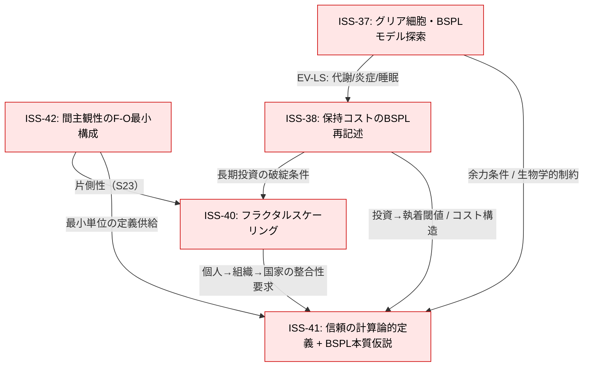

# PLAN — TASK #5「信頼の構造モデル探索」（ISS-41拡張）

作成日: 2026-02-07  
参照した正本: `docs/README.md`, `docs/CURRENT.md`, `docs/quality-management.md`, `base/schema/core-definitions.md`, `base/schema/auxiliary/bspl-model.md`, `base/voice/pjdhiro-statements-db.md`（S25-S30周辺＋信頼系断片）, `base/evidence/evidence-business-org.md`, `base/evidence/evidence-life-sciences.md`, `base/evidence/evidence-psychoanalysis.md`, `skills/codex-agent/SKILL.md`, `skills/codex-agent/references/track-record.md`

---

## 0. 背景（現在地）

- `docs/CURRENT.md`（最終更新: 2026-02-07）で、TASK #5は **「理論面の最大焦点」** とされ、保持論点ISS-41（🔥）の拡張として位置づけられている。
- 信頼は本プロジェクトの原点（S49「出発点は信頼」）でありつつ、現状は「身近だが解像度が低いワード」（S25）として、モデル化が未完了。
- BSPLモデルは `base/schema/auxiliary/bspl-model.md` にて **探索的補助モデル [S]** として確立済み。ただし「BSPLの本質=信頼か？」は **ISS-41として保持** され、昇格は抑制されている（bspl-model.md §4.4）。

---

## 1. TASK #5のスコープ定義

### 1.1 このTASKで「明らかにする」こと（IN）

1. **信頼の最小構成（計算論的定義の叩き台）**
   - “信頼” を、感情ラベルとしてではなく、**構造・プロセスとして**記述できる最小単位に落とす。
   - 特に **片側から始まる信頼**（S23: 片側信頼、母子/ブランド等）を扱えることを必須要件にする（双方向前提にしない）。

2. **F-O軸（D4）・抱持（D3）・Container/安全基地（EV-PA）との接続**
   - 信頼を「O軸の中心語」として使うなら、TC-009（感情ラベル分解）に従い、F/Oの評価・統合・破綻と接続できる形で書く。
   - Container（Bion）・安全基地/内的作業モデル（Bowlby）を、信頼の **成立条件（資産）** と **結果（蓄積）** の両面から整理する。

3. **BSPLとの関係の整理（ISS-41の中核）**
   - BSPLの「信頼レンズ」（bspl-model.md §4.4）を、過剰一般化なしに再検討する。
   - 争点は次の二択（中間も許容）：
     - A) 「信頼がBSPLに *似る*」＝多領域同型の一例（説明上便利だが本質ではない）
     - B) 「BSPLの本質が信頼構造を *記述している*」＝信頼が、BSPLを貫く基礎変数である
   - どちらを採るかは **昇格ではなく保持** を前提に、判断基準（採否条件）を設計する。

4. **フラクタルスケーリング（ISS-40）に耐える言い方**
   - 個人（内的作業モデル）→関係→組織→国家（ソフトパワー）へスケールしても、破綻しにくい抽象度で「信頼」を記述する。

### 1.2 このTASKで「やらない」こと（OUT）

- **経験科学としての厳密な実証**（新規データ収集、統計、再現性評価、因果推定）
- **外部文献の総説づくり**（本リポジトリ内のevidenceを超える網羅的レビュー）
- **BSPLや4層の昇格・定義変更の決定**（本TASKの成果は、まず補助モデル/保持論点として置く）
- **transform層（PDF/ブログ）向けの最終文章化**（Container機能チェック#9は将来の出力段階で主に適用）

---

## 2. 関連保持論点（ISS-37/38/40/41/42）との接続マップ

### 2.1 役割分担（要約）

- **ISS-41（中心）**: 信頼の計算論的定義 + 「BSPLの本質仮説」検討枠
- **ISS-42（最小単位）**: 間主観性のF-O最小構成（S23の片側性を理論化する足場）
- **ISS-38（コスト閾値）**: 「保持コスト」をBSPLで再記述（投資→沈没/執着への転換点＝bspl空欄②）
- **ISS-37（生物学的基盤）**: 余力（代謝・炎症・睡眠等）と抱持成立条件（D3-a）＝信頼投資の物理的制約
- **ISS-40（スケール）**: 個人/組織/国家のスケーリング一貫性（S22: 信頼vs短期利益、ソフトパワー）

### 2.2 接続グラフ（作業用）

### 2.3 追加の固定アンカー（本TASKで常時参照する根）

- D4（F-O評価）: `base/schema/core-definitions.md`
- 信頼レンズ（ISS-41の発火点）: `base/schema/auxiliary/bspl-model.md` §4.4
- 片側性・最小構成の動機: `base/voice/pjdhiro-statements-db.md` S23
- 「短期利益 vs 長期信頼」: S22（BSPLの売上＝存在理由）
- Container/安全基地: `base/evidence/evidence-psychoanalysis.md`（EV-PA-002等）
- 組織スケールのContainer/心理的安全: `base/evidence/evidence-business-org.md`（HRO、組織抱持条件）

---

## 3. Codexブリーフィングとして分割可能なサブタスク案（Type A/B/C）

> Type分類は `skills/codex-agent/SKILL.md` の基準に従う（A=機械的、B=解釈、C=創造）。  
> なお、Codex納品の配置は `codex/codex_README.md` を正とし、`codex/output/` を基本出力先とする。

### 3.1 Type A（機械的検証・抽出）— Codex適性: 高

- **A1: 信頼・間主観性・BSPL関連の「全出現箇所」抽出**
  - 対象: `base/schema/auxiliary/bspl-model.md`, `base/schema/core-definitions.md`, `base/voice/pjdhiro-statements-db.md`, `base/evidence/*`（特にPA/LS/BZ-ORG）, `docs/quality-management.md`
  - 出力: “信頼/安心/安全/愛着/Container/安全基地/内的作業モデル/贈与/のれん/純資産/PL-O/BS純資産” の **索引表**（ファイル＋見出し名＋短い要約＋[P/M/S]）
  - 目的: T1-T3/T4-T5等の未所在の検出（現状、この計画作成時点ではレポ内に明示定義が見つかっていない）

- **A2: 「信頼レンズ」依存マップ作成（BSPL要素→信頼読み替え）**
  - 対象: `base/schema/auxiliary/bspl-model.md` §4.1〜4.6, §5
  - 出力: 表（BS/PL各項目ごとに、(a)信頼としての読み、(b)根拠ファイルID、(c)リスク（牽強付会条件①〜③））

- **A3: エビデンス三点セットの対応表作成**
  - EV-PA（Container/安全基地）× EV-LS（余力/負債）× EV-BZ-ORG（組織Container/心理的安全）
  - 出力: 「信頼の成立条件」観点での対応表（どれが *条件*、どれが *結果*、どれが *破綻モード* か）

### 3.2 Type B（解釈・境界判断）— Codex適性: 限定（[UNCERTAIN]必須）

- **B1: 信頼の「最小構成」候補を3案に分岐して提示**
  - 条件: 双方向性前提にしない／F-O分解（TC-009）を破らない／D3-a（成立条件）と矛盾しない
  - 出力: 3案それぞれに「採用すると何が説明できるか/できないか」「どのISSに効くか」を列挙
  - Safety Valve: 自信が低い箇所に `[UNCERTAIN]` を必須付与

- **B2: ISS-41（二択A/B）の採否条件を設計**
  - 出力: 「A)似ている」採用条件、「B)本質」採用条件、保留条件（判定不能条件）を明文化
  - 注意: “正しさ” ではなく “昇格してよいか” の判断基準にする（TC-005保持原則）

- **B3: 信頼と抱持の境界線（前提/結果/相互強化）の整理**
  - 出力: 3パターン（信頼→抱持、抱持→信頼、相互再帰）を比較し、どの層に置くべきかを提案

### 3.3 Type C（創造・モデル構築）— Codex適性: 中〜高（形式拘束が必要）

- **C1: 「信頼のBSPL表現（暫定）」の設計案**
  - 出力: “信頼をBS/PLに書くならどの項目が何か” の暫定設計（例: BS純資産=測定不能な含み価値、PL-O投資=関係への投資 等）
  - 目的: ISS-38（投資→沈没閾値）と一体で扱える形にする
  - 注意: 物理系への拡張は `[M]止まり` を明記（bspl-model.md 牽強付会条件③）

- **C2: 片側信頼の類型（S23）→最小構成（ISS-42）への写像**
  - 出力: 母子/ブランド/神秘体験などの例を、F-O最小構成で **何が共通で、何が違うか** として整理
  - 目的: 「間主観性=双方向」前提の破壊を理論に落とす

- **C3: スケール別（個人/関係/組織/国家）で壊れない説明の試作**
  - 出力: 各スケールで (a)信頼の資産、(b)信頼の費用、(c)破綻パターン を同一フォーマットで提示
  - 品質条件: 群盲象チェック（最低3領域）を“見える形”で提示（Container機能CT-5の前倒し適用）

---

## 4. 依存関係と推奨実行順序

### 4.1 依存関係（要点）

- A系（抽出・索引）が先。**B/Cの議論は素材不足だと「言葉が先に立つ」**（TC-004/TC-009違反リスク）。
- B2（ISS-41採否条件設計）は、C1（信頼BSPL案）より先に置くと「昇格を急ぐ圧」が下がる。
- ISS-38は、信頼を“良いもの”として固定すると見えなくなる。C1/C3では必ず「投資→執着（沈没）」の破綻パスを同梱する。

### 4.2 推奨順序（最短ループ）

1. **A1**: 信頼関連の全出現箇所抽出（未所在のT1-T5の発見を最優先）
2. **A2**: BSPL信頼レンズの依存マップ化（牽強付会条件①〜③で危険箇所を先に囲う）
3. **A3**: EV-PA/EV-LS/EV-BZ-ORGの「成立条件」対応表
4. **B1**: 信頼最小構成の候補3案（ここで初めて“定義案”を出す）
5. **B3**: 信頼×抱持の境界整理（D3-aと整合するか確認）
6. **C2**: 片側信頼の類型→最小構成写像（ISS-42の具体化）
7. **C1**: 信頼のBSPL表現（暫定）＋ISS-38（閾値）を組み込む
8. **C3**: スケール別テンプレで整合性チェック（ISS-40）
9. **B2**: ISS-41（二択A/B）の採否条件を最終化し、現時点の暫定結論（採用/保留）を明記

※この時点で「結論を出せない」は正常。成果は **“判定不能条件の明文化”** として価値がある（TC-005保持原則）。

---

## 5. 成果物の形式と配置先

### 5.1 本TASK（計画）自体の成果物

- `codex/output/PLAN-task5-trust-model.md`（本ファイル）

### 5.2 Codex依頼（REQ）と納品（REPORT）

- 依頼（REQ）: `codex/inbox/REQ-CODX-YYYYMMDD-NNN_task5-trust-<slug>.md`
- 納品（REPORT）: `codex/output/REPORT-CODX-YYYYMMDD-NNN_task5-trust-<slug>.md`
- 完了後の退避: 参照が本文/スキーマに組み込まれたら `codex/archive/` へ移動（`codex/codex_README.md` §4）

### 5.3 人間レビュー後に作る「正本」候補（将来）

> 本TASKのゴールは“計画”だが、実装フェーズの置き場所も先に固定しておく（TC-007情報一元化）。

- 信頼モデル（補助モデルとして開始）:
  - 置き先候補: `base/schema/auxiliary/trust-model.md`
  - ステータス案: `[S]`（探索）→ 条件を満たしたら `[M]` へ（昇格は別判断）
  - 含める内容: 最小構成、F-O/抱持/Container接続、BSPLとの関係（ISS-41判定条件）
- 判断ログ（採否・保留理由）:
  - `docs/decision-log/2026-02/LOG-YYYYMMDD-XXX_task5-trust-model.md`
- CURRENT更新（着手/保留/成果回収）:
  - `docs/CURRENT.md`（タスク進捗・ISS温度感の更新）

---

## 6. 完了条件（品質チェックの適用）

本TASK（探索・モデル化）に対する “done” の最小条件：

1. **D1-D4と矛盾しない**（品質チェック#1）
2. **感情ラベル“信頼”を使う箇所はF-O分解できる**（TC-009）
3. **群盲象チェック（最低3領域）で同一構造が提示できる**（品質チェック#4、CT-5の先取り）
4. **牽強付会限定条件を満たす**（bspl-model.md §4.6①〜③）
5. **「わからない／保留」が明示されている**（Container機能CT-2、保持論点の可視化）

---

## 7. 直近の注意事項（ブロッカー）

- `docs/CURRENT.md` には「Session 6p: 信頼T1-T3、間主観性T4-T5」とあるが、この計画作成時点の探索範囲では **T1-T5の実体ファイル（定義本文）を特定できていない**。  
  → 最初の実装サブタスクは **A1（抽出）で所在を確定**し、見つからない場合は「T1-T5がどこにあるべきか」（voice DB / schema / decision-log / sessions）を決める必要がある。

